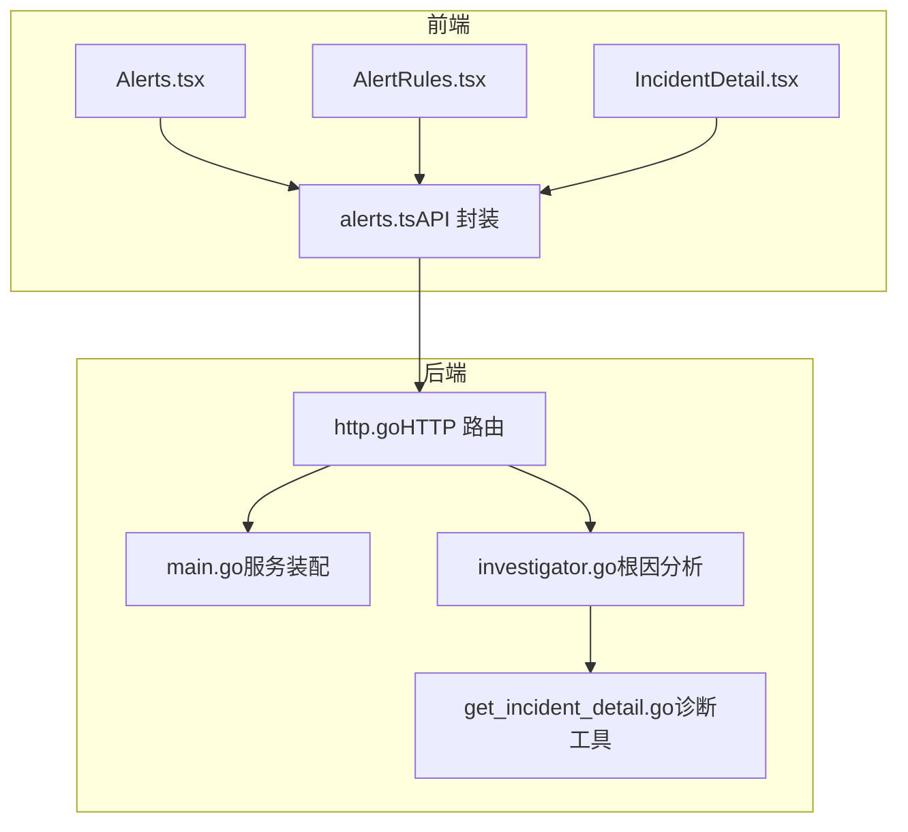
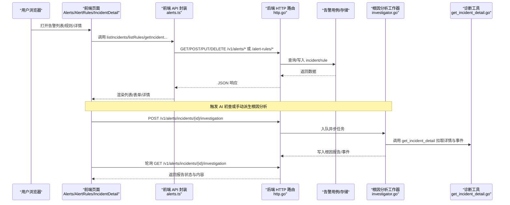
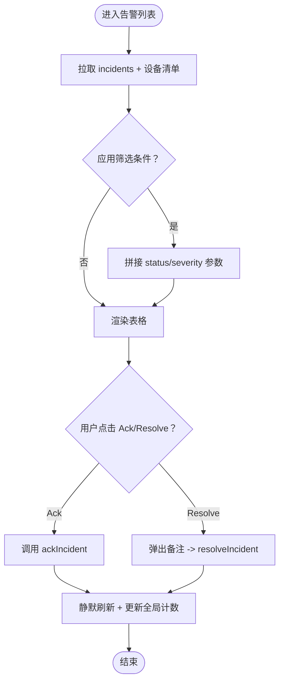
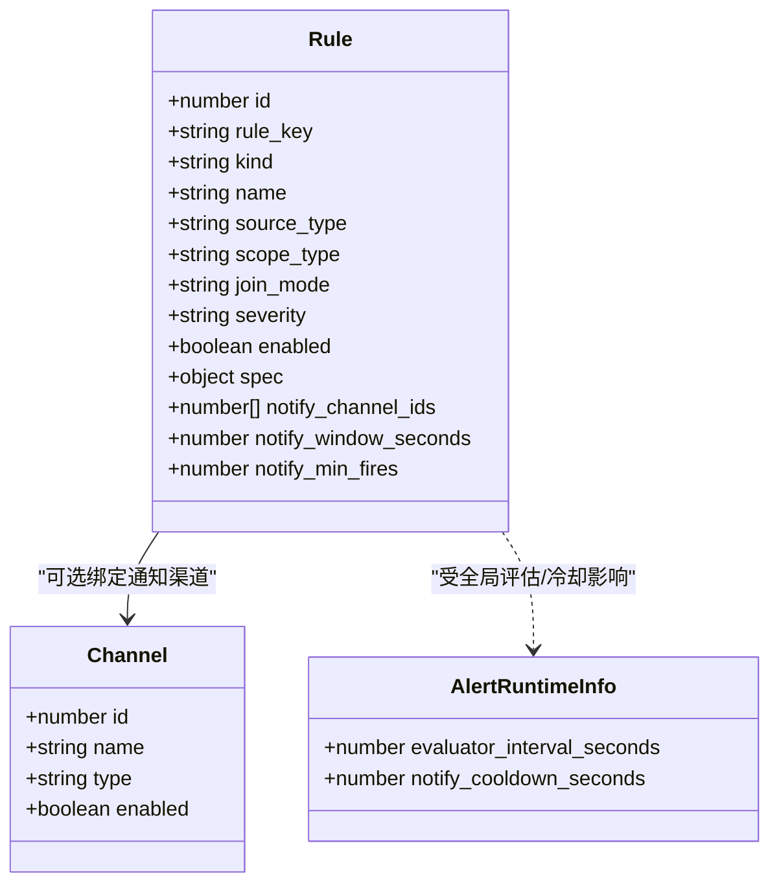
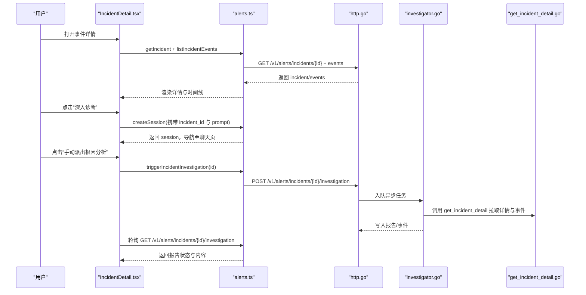
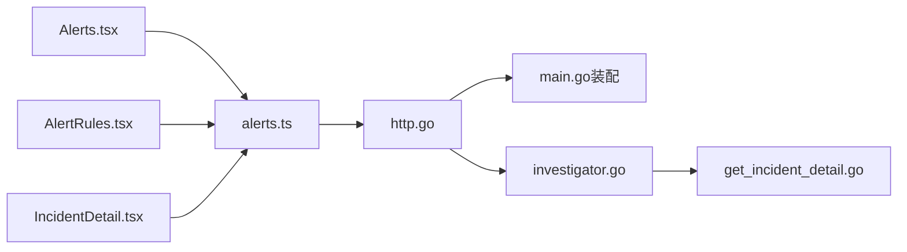

# 告警与监控

<cite>
**本文引用的文件**   
- [Alerts.tsx](file://web/src/pages/Alerts.tsx)
- [AlertRules.tsx](file://web/src/pages/AlertRules.tsx)
- [IncidentDetail.tsx](file://web/src/pages/IncidentDetail.tsx)
- [alerts.ts（前端 API）](file://web/src/api/alerts.ts)
- [http.go（后端告警路由）](file://internal/manager/server/alert/http.go)
- [main.go（服务启动与告警子系统装配）](file://cmd/ongrid/main.go)
- [investigator.go（根因分析工作器）](file://internal/manager/biz/aiops/investigator/investigator.go)
- [get_incident_detail.go（诊断工具：获取事件详情）](file://internal/manager/biz/aiops/tools/get_incident_detail.go)
</cite>

## 目录
1. [简介](#简介)
2. [项目结构](#项目结构)
3. [核心组件](#核心组件)
4. [架构总览](#架构总览)
5. [详细组件分析](#详细组件分析)
6. [依赖关系分析](#依赖关系分析)
7. [性能与优化建议](#性能与优化建议)
8. [故障排查指南](#故障排查指南)
9. [结论](#结论)

## 简介
本文件聚焦于“告警与监控”相关的前端页面与后端能力，围绕以下目标展开：
- 深入介绍 Alerts.tsx 告警列表页面的数据展示与筛选机制。
- 详细说明 AlertRules.tsx 告警规则管理页面的配置界面与业务逻辑。
- 阐述 IncidentDetail.tsx 事件详情页面的根因分析与处理流程。
- 说明告警的实时推送、通知渠道集成与自动化处理机制。
- 提供告警规则优化与性能调优的实践指导。

## 项目结构
与告警与监控相关的代码主要分布在以下位置：
- 前端页面：web/src/pages/Alerts.tsx、web/src/pages/AlertRules.tsx、web/src/pages/IncidentDetail.tsx
- 前端 API 封装：web/src/api/alerts.ts
- 后端 HTTP 路由：internal/manager/server/alert/http.go
- 服务启动与告警子系统装配：cmd/ongrid/main.go
- 根因分析工作器与工具：internal/manager/biz/aiops/investigator/investigator.go、internal/manager/biz/aiops/tools/get_incident_detail.go

图表来源
- [Alerts.tsx:1-120](file://web/src/pages/Alerts.tsx#L1-L120)
- [AlertRules.tsx:187-218](file://web/src/pages/AlertRules.tsx#L187-L218)
- [IncidentDetail.tsx:67-127](file://web/src/pages/IncidentDetail.tsx#L67-L127)
- [alerts.ts:31-55](file://web/src/api/alerts.ts#L31-L55)
- [http.go:165-180](file://internal/manager/server/alert/http.go#L165-L180)
- [main.go:1022-1050](file://cmd/ongrid/main.go#L1022-L1050)
- [investigator.go:26-60](file://internal/manager/biz/aiops/investigator/investigator.go#L26-L60)
- [get_incident_detail.go:65-91](file://internal/manager/biz/aiops/tools/get_incident_detail.go#L65-L91)

章节来源
- [Alerts.tsx:1-120](file://web/src/pages/Alerts.tsx#L1-L120)
- [AlertRules.tsx:187-218](file://web/src/pages/AlertRules.tsx#L187-L218)
- [IncidentDetail.tsx:67-127](file://web/src/pages/IncidentDetail.tsx#L67-L127)
- [alerts.ts:31-55](file://web/src/api/alerts.ts#L31-L55)
- [http.go:165-180](file://internal/manager/server/alert/http.go#L165-L180)
- [main.go:1022-1050](file://cmd/ongrid/main.go#L1022-L1050)
- [investigator.go:26-60](file://internal/manager/biz/aiops/investigator/investigator.go#L26-L60)
- [get_incident_detail.go:65-91](file://internal/manager/biz/aiops/tools/get_incident_detail.go#L65-L91)

## 核心组件
- 告警列表页（Alerts.tsx）
  - 支持按状态、级别筛选；轮询刷新；全局未确认计数同步；设备名称解析；行级 Ack/Resolve 操作。
- 告警规则管理页（AlertRules.tsx）
  - 规则列表、启用/禁用、删除；新建/编辑规则（含预设模板）；预览试算；运行时评估周期与冷却时间展示；通知渠道列表加载。
- 事件详情页（IncidentDetail.tsx）
  - 事件详情、事件时间线、AI 初查面板、Agent 执行时间线、根因分析报告、Grafana/Loki/Tempo 跳转、Ack/Resolve/Silence 操作、深入诊断会话创建。
- 前端 API（alerts.ts）
  - 统一封装 incident/rule/channel/runtime-info 等接口类型与请求方法。
- 后端路由（http.go）
  - 暴露 /v1/alerts/*、/v1/alert-rules/*、/v1/notification-channels/* 等 REST 接口。
- 服务装配（main.go）
  - 初始化告警仓库、用例、缓存规则提供者、通道解析器、内置抑制器、内置规则与通道种子数据。
- 根因分析（investigator.go + get_incident_detail.go）
  - 异步队列化执行 LLM 诊断，调用工具拉取事件详情并关联指标/日志/链路，产出结构化报告。

章节来源
- [Alerts.tsx:40-126](file://web/src/pages/Alerts.tsx#L40-L126)
- [AlertRules.tsx:187-218](file://web/src/pages/AlertRules.tsx#L187-L218)
- [IncidentDetail.tsx:67-127](file://web/src/pages/IncidentDetail.tsx#L67-L127)
- [alerts.ts:31-55](file://web/src/api/alerts.ts#L31-L55)
- [http.go:165-180](file://internal/manager/server/alert/http.go#L165-L180)
- [main.go:1022-1050](file://cmd/ongrid/main.go#L1022-L1050)
- [investigator.go:26-60](file://internal/manager/biz/aiops/investigator/investigator.go#L26-L60)
- [get_incident_detail.go:65-91](file://internal/manager/biz/aiops/tools/get_incident_detail.go#L65-L91)

## 架构总览
从用户交互到数据落库与通知投递的整体流程如下：

图表来源
- [Alerts.tsx:71-98](file://web/src/pages/Alerts.tsx#L71-L98)
- [AlertRules.tsx:220-233](file://web/src/pages/AlertRules.tsx#L220-L233)
- [IncidentDetail.tsx:81-127](file://web/src/pages/IncidentDetail.tsx#L81-L127)
- [alerts.ts:31-55](file://web/src/api/alerts.ts#L31-L55)
- [http.go:165-180](file://internal/manager/server/alert/http.go#L165-L180)
- [investigator.go:26-60](file://internal/manager/biz/aiops/investigator/investigator.go#L26-L60)
- [get_incident_detail.go:65-91](file://internal/manager/biz/aiops/tools/get_incident_detail.go#L65-L91)

## 详细组件分析

### 告警列表页（Alerts.tsx）
- 数据获取与刷新
  - 使用轮询定时器定期拉取最新 incidents，并在首次加载时显示 loading 状态。
  - 支持 status/severity 筛选参数传递至后端。
- 全局未确认计数
  - 通过共享 store 同步侧边栏红点计数，避免与当前筛选结果不一致。
- 设备名称解析
  - 在页面挂载时拉取设备清单，将 target_id 映射为可读的设备名，缺失则回退为默认文本。
- 行内操作
  - Ack：仅对 open 且可变更账号可用；成功后静默刷新列表与全局计数。
  - Resolve：弹出备注输入框，提交后刷新列表与全局计数。
- UI 与体验
  - 未确认行左侧高亮条便于快速定位；空态提示友好；错误信息以横幅呈现。

图表来源
- [Alerts.tsx:71-98](file://web/src/pages/Alerts.tsx#L71-L98)
- [Alerts.tsx:100-120](file://web/src/pages/Alerts.tsx#L100-L120)
- [Alerts.tsx:230-263](file://web/src/pages/Alerts.tsx#L230-L263)
- [alerts.ts:31-55](file://web/src/api/alerts.ts#L31-L55)

章节来源
- [Alerts.tsx:40-126](file://web/src/pages/Alerts.tsx#L40-L126)
- [Alerts.tsx:230-263](file://web/src/pages/Alerts.tsx#L230-L263)
- [alerts.ts:31-55](file://web/src/api/alerts.ts#L31-L55)

### 告警规则管理页（AlertRules.tsx）
- 规则列表与统计
  - 展示规则总数、启用数、内置/自定义数量，以及各 kind 分布。
  - 展示运行时评估间隔与通知冷却时间（来自 runtime-info）。
- 规则 CRUD
  - 新建/编辑：支持多种 kind（阈值、异常、预测、燃烧率、原生 PromQL、日志匹配/总量、链路延迟/错误率），包含 scope、join_mode、severity、条件/表达式、runbook_url、通知渠道选择、发送策略（窗口+最小触发次数）。
  - 启用/禁用：一键切换 enabled 状态。
  - 删除：内置规则不可删；非管理员按钮禁用。
- 预设模板
  - “从预设挑”快速生成草稿，合并 seed 到默认表单。
- 预览试算
  - 调用 previewRule 进行只读试算，返回 fire_count、samples、series、threshold、unit 等，用于验证表达式与阈值。
- 通知渠道
  - 加载全局配置的 channel 列表，帮助运维了解通知去向。

图表来源
- [alerts.ts:346-390](file://web/src/api/alerts.ts#L346-L390)
- [alerts.ts:459-515](file://web/src/api/alerts.ts#L459-L515)
- [AlertRules.tsx:220-233](file://web/src/pages/AlertRules.tsx#L220-L233)
- [AlertRules.tsx:706-724](file://web/src/pages/AlertRules.tsx#L706-L724)

章节来源
- [AlertRules.tsx:187-218](file://web/src/pages/AlertRules.tsx#L187-L218)
- [AlertRules.tsx:220-233](file://web/src/pages/AlertRules.tsx#L220-L233)
- [AlertRules.tsx:706-724](file://web/src/pages/AlertRules.tsx#L706-L724)
- [alerts.ts:346-390](file://web/src/api/alerts.ts#L346-L390)
- [alerts.ts:459-515](file://web/src/api/alerts.ts#L459-L515)

### 事件详情页（IncidentDetail.tsx）
- 基本信息与快捷操作
  - 展示 severity/status、rule_key/name、target、fired/last fired/count、ack/resolved 时间。
  - 快捷跳转 Grafana/Loki/Tempo 查看相关指标/日志/链路。
  - 支持 Ack/Resolve/Silence 操作，权限控制由 usePermissions 决定。
- AI 初查与根因分析报告
  - 自动派发：告警触发后短时间内高频轮询等待 AI 初查事件出现。
  - 手动派发：若未自动派发，提供“手动派出根因分析”按钮。
  - 报告状态机：pending/running/not_started/ready/failed/skipped/feature_disabled，不同状态对应不同 UI 与交互。
  - 报告内容：root_cause、affected_window、pinpointed_target、evidence、related_alerts、suggested_actions、findings_md、confidence 等。
- Agent 时间线与对话式深入诊断
  - 展示 agent 工具调用时间线。
  - “深入诊断”按钮创建带上下文的聊天会话，引导 agent 继续分析。

图表来源
- [IncidentDetail.tsx:81-127](file://web/src/pages/IncidentDetail.tsx#L81-L127)
- [IncidentDetail.tsx:385-462](file://web/src/pages/IncidentDetail.tsx#L385-L462)
- [alerts.ts:139-149](file://web/src/api/alerts.ts#L139-L149)
- [http.go:165-180](file://internal/manager/server/alert/http.go#L165-L180)
- [investigator.go:26-60](file://internal/manager/biz/aiops/investigator/investigator.go#L26-L60)
- [get_incident_detail.go:65-91](file://internal/manager/biz/aiops/tools/get_incident_detail.go#L65-L91)

章节来源
- [IncidentDetail.tsx:67-127](file://web/src/pages/IncidentDetail.tsx#L67-L127)
- [IncidentDetail.tsx:385-462](file://web/src/pages/IncidentDetail.tsx#L385-L462)
- [alerts.ts:139-149](file://web/src/api/alerts.ts#L139-L149)
- [http.go:165-180](file://internal/manager/server/alert/http.go#L165-L180)
- [investigator.go:26-60](file://internal/manager/biz/aiops/investigator/investigator.go#L26-L60)
- [get_incident_detail.go:65-91](file://internal/manager/biz/aiops/tools/get_incident_detail.go#L65-L91)

### 通知渠道与自动化处理
- 通知渠道
  - 前端通过 listChannels/createChannel/updateChannel/deleteChannel/testChannel 管理渠道。
  - 后端暴露 /v1/notification-channels/* 路由。
- 自动化处理
  - 告警触发后，系统可异步派发根因分析任务，调用诊断工具拉取事件详情与上下文，生成结构化报告。
  - 规则层可配置 notify_channel_ids 与发送策略（notify_window_seconds、notify_min_fires），结合全局冷却时间实现降噪与节流。

章节来源
- [alerts.ts:485-503](file://web/src/api/alerts.ts#L485-L503)
- [http.go:165-170](file://internal/manager/server/alert/http.go#L165-L170)
- [AlertRules.tsx:706-724](file://web/src/pages/AlertRules.tsx#L706-L724)
- [alerts.ts:360-390](file://web/src/api/alerts.ts#L360-L390)
- [investigator.go:26-60](file://internal/manager/biz/aiops/investigator/investigator.go#L26-L60)

## 依赖关系分析
- 前端页面依赖 alerts.ts 提供的类型与函数，统一发起 HTTP 请求。
- 后端 http.go 将 REST 路由映射到具体用例与存储层。
- main.go 负责初始化告警子系统（仓库、用例、缓存规则、通道解析器、内置抑制器、种子数据），确保运行期能力可用。
- 根因分析模块独立于主路径，异步执行，不阻塞告警触发。

图表来源
- [Alerts.tsx:71-98](file://web/src/pages/Alerts.tsx#L71-L98)
- [AlertRules.tsx:220-233](file://web/src/pages/AlertRules.tsx#L220-L233)
- [IncidentDetail.tsx:81-127](file://web/src/pages/IncidentDetail.tsx#L81-L127)
- [alerts.ts:31-55](file://web/src/api/alerts.ts#L31-L55)
- [http.go:165-180](file://internal/manager/server/alert/http.go#L165-L180)
- [main.go:1022-1050](file://cmd/ongrid/main.go#L1022-L1050)
- [investigator.go:26-60](file://internal/manager/biz/aiops/investigator/investigator.go#L26-L60)
- [get_incident_detail.go:65-91](file://internal/manager/biz/aiops/tools/get_incident_detail.go#L65-L91)

章节来源
- [Alerts.tsx:71-98](file://web/src/pages/Alerts.tsx#L71-L98)
- [AlertRules.tsx:220-233](file://web/src/pages/AlertRules.tsx#L220-L233)
- [IncidentDetail.tsx:81-127](file://web/src/pages/IncidentDetail.tsx#L81-L127)
- [alerts.ts:31-55](file://web/src/api/alerts.ts#L31-L55)
- [http.go:165-180](file://internal/manager/server/alert/http.go#L165-L180)
- [main.go:1022-1050](file://cmd/ongrid/main.go#L1022-L1050)
- [investigator.go:26-60](file://internal/manager/biz/aiops/investigator/investigator.go#L26-L60)
- [get_incident_detail.go:65-91](file://internal/manager/biz/aiops/tools/get_incident_detail.go#L65-L91)

## 性能与优化建议
- 列表与详情轮询
  - 合理设置轮询间隔，避免频繁请求造成抖动；在关键阶段（如 AI 初查到达前）采用更短间隔，随后回落至常规间隔。
- 规则评估与冷却
  - 利用全局评估间隔与通知冷却时间降低风暴风险；结合规则的 notify_window_seconds 与 notify_min_fires 做二次降噪。
- 表达式与窗口
  - metric_raw 中尽量复用已有聚合函数与合适的时间窗口，减少瞬时查询带来的开销；PromqlWindowChips 可辅助识别窗口范围。
- 预览试算
  - 在保存前使用 previewRule 进行只读试算，观察 fire_count、series、threshold 与 unit，提前发现误配。
- 设备名解析
  - 设备清单一次性加载并缓存，避免每行重复请求；缺失时回退默认文本保证可用性。
- 权限与并发
  - 操作按钮根据权限禁用，减少无效请求；批量操作注意防抖与去重。

[本节为通用性能建议，无需特定文件引用]

## 故障排查指南
- 列表加载失败
  - 检查网络与鉴权；查看错误横幅信息；确认后端 /v1/alerts/incidents 是否可达。
- 规则无法保存
  - 校验 rule_key 命名规范与必填字段；使用预览试算定位表达式问题；确认管理员权限。
- 根因分析未自动生成
  - 检查功能开关与环境变量；等待一定时间后尝试“手动派出”；关注 not_started 状态与最大轮询次数。
- 通知未送达
  - 核对渠道配置与测试；确认规则是否绑定了正确的 notify_channel_ids；检查全局冷却时间与规则发送策略。

章节来源
- [Alerts.tsx:198-206](file://web/src/pages/Alerts.tsx#L198-L206)
- [AlertRules.tsx:740-760](file://web/src/pages/AlertRules.tsx#L740-L760)
- [IncidentDetail.tsx:385-462](file://web/src/pages/IncidentDetail.tsx#L385-L462)
- [alerts.ts:485-503](file://web/src/api/alerts.ts#L485-L503)

## 结论
本方案通过清晰的前端页面与稳健的后端能力，构建了完整的告警与监控闭环：
- 列表页提供高效的数据展示与筛选，配合全局计数与设备名解析提升可操作性。
- 规则管理页覆盖全生命周期管理，支持预览试算与发送策略，兼顾易用性与灵活性。
- 事件详情页整合 AI 初查与根因分析报告，辅以多观测平台跳转与对话式深入诊断，加速排障。
- 通知渠道与自动化处理机制完善，结合全局与规则级策略有效降噪。
- 性能优化建议与故障排查指南有助于稳定运行与快速定位问题。