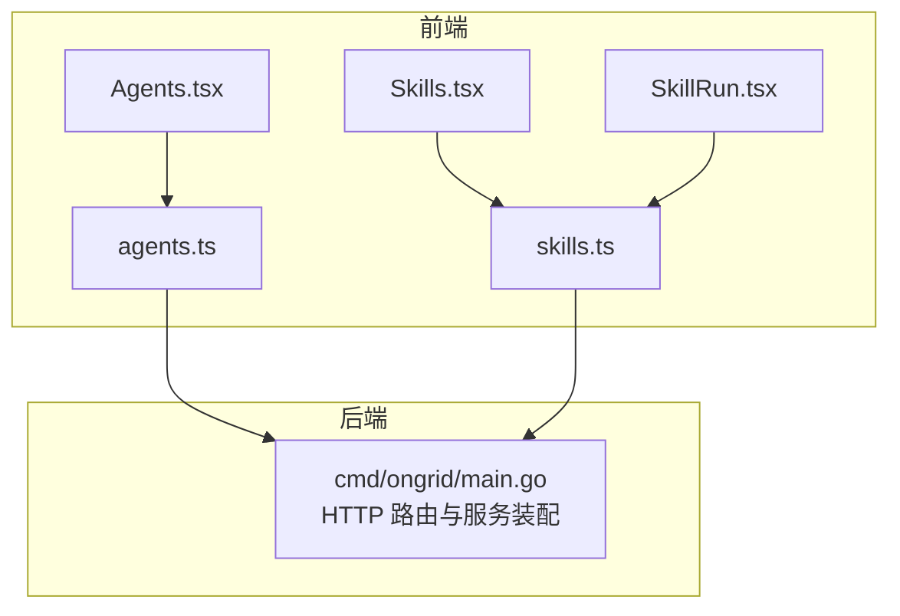
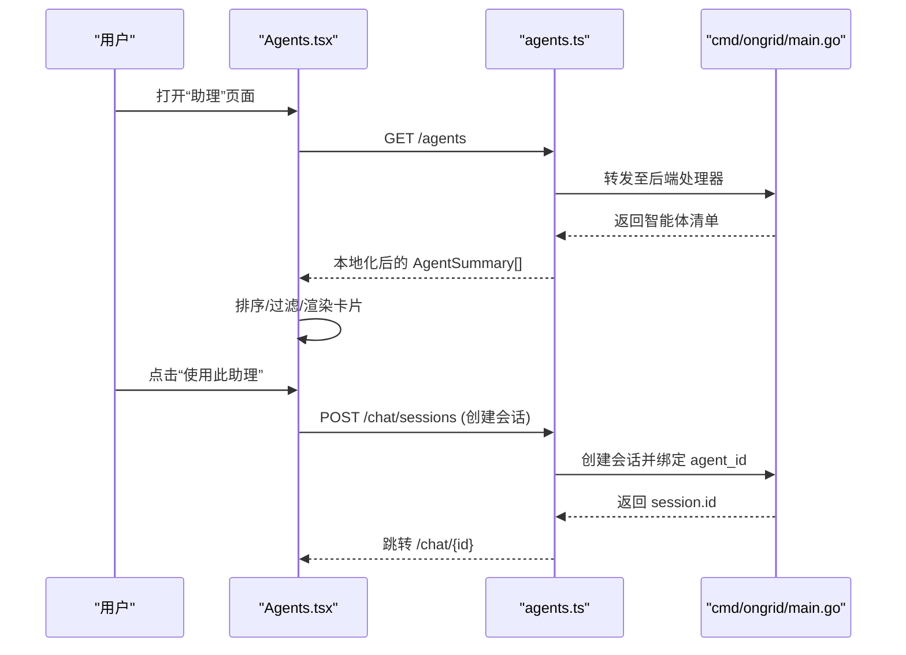
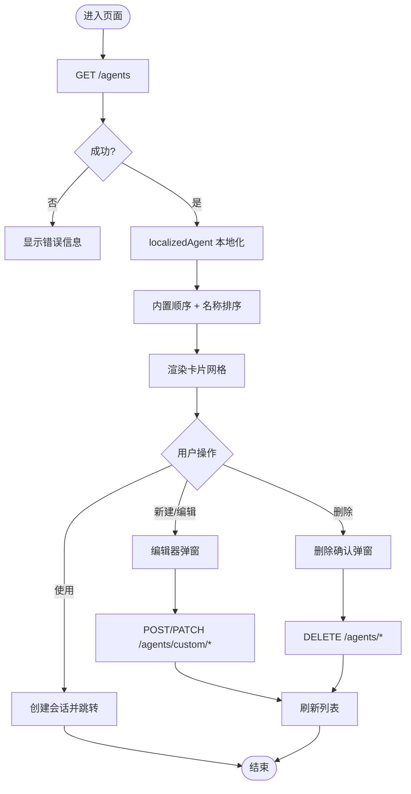
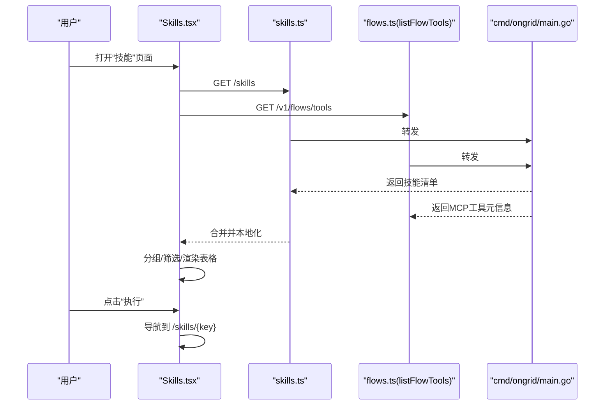
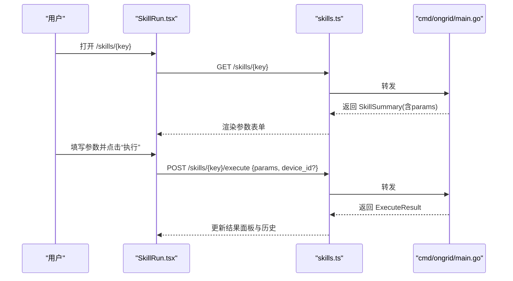
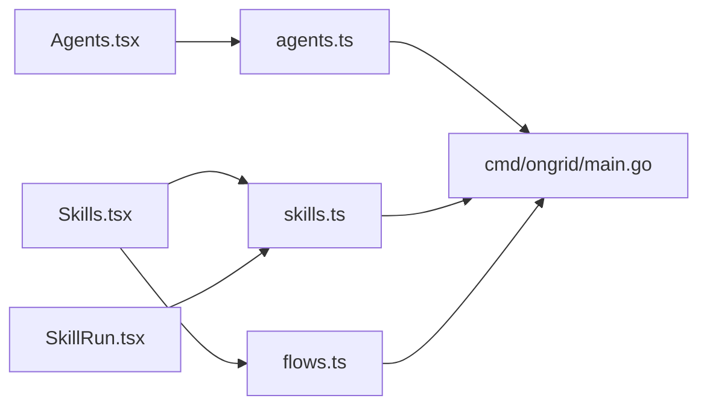

# 智能体管理

<cite>
**本文引用的文件**   
- [Agents.tsx](file://web/src/pages/Agents.tsx)
- [Skills.tsx](file://web/src/pages/Skills.tsx)
- [SkillRun.tsx](file://web/src/pages/SkillRun.tsx)
- [agents.ts](file://web/src/api/agents.ts)
- [skills.ts](file://web/src/api/skills.ts)
- [main.go](file://cmd/ongrid/main.go)
</cite>

## 目录
1. [简介](#简介)
2. [项目结构](#项目结构)
3. [核心组件](#核心组件)
4. [架构总览](#架构总览)
5. [详细组件分析](#详细组件分析)
6. [依赖关系分析](#依赖关系分析)
7. [性能与体验优化](#性能与体验优化)
8. [故障排查指南](#故障排查指南)
9. [结论](#结论)

## 简介
本文件聚焦“智能体管理”相关的前端页面与交互，围绕以下目标展开：
- Agents.tsx 智能体列表页面的组件设计与状态管理
- Skills.tsx 技能管理页面的功能实现与用户交互流程
- SkillRun.tsx 技能执行页面的参数配置与执行监控机制
- 智能体的生命周期管理、权限控制与操作审计能力说明
- 智能体调试与故障排查指导方案

## 项目结构
与智能体管理直接相关的核心前端文件位于 web/src/pages 与 web/src/api 下：
- 页面层：Agents.tsx、Skills.tsx、SkillRun.tsx
- API 层：agents.ts、skills.ts
- 后端入口（服务装配与路由注册）：cmd/ongrid/main.go

图表来源
- [Agents.tsx:1-200](file://web/src/pages/Agents.tsx#L1-L200)
- [Skills.tsx:1-120](file://web/src/pages/Skills.tsx#L1-L120)
- [SkillRun.tsx:1-120](file://web/src/pages/SkillRun.tsx#L1-L120)
- [agents.ts:1-140](file://web/src/api/agents.ts#L1-L140)
- [skills.ts:1-120](file://web/src/api/skills.ts#L1-L120)
- [main.go:1850-1900](file://cmd/ongrid/main.go#L1850-L1900)

章节来源
- [Agents.tsx:1-200](file://web/src/pages/Agents.tsx#L1-L200)
- [Skills.tsx:1-120](file://web/src/pages/Skills.tsx#L1-L120)
- [SkillRun.tsx:1-120](file://web/src/pages/SkillRun.tsx#L1-L120)
- [agents.ts:1-140](file://web/src/api/agents.ts#L1-L140)
- [skills.ts:1-120](file://web/src/api/skills.ts#L1-L120)
- [main.go:1850-1900](file://cmd/ongrid/main.go#L1850-L1900)

## 核心组件
- 智能体列表页（Agents.tsx）
  - 展示内置/预置/自定义三类智能体，支持搜索、新建、编辑、删除、查看详情、一键开启会话。
  - 内置与预置为只读；自定义可编辑与删除。
  - 通过 agents.ts 调用 /agents 系列接口完成 CRUD。
- 技能管理页（Skills.tsx）
  - 聚合“代码/包注册的 SKILL.md 技能 + MCP 工具”，提供分类筛选、运行位置过滤、详情查看与执行入口。
  - 管理员可见“扩展”安装入口（Marketplace），非管理员仅见目录。
  - 通过 skills.ts 调用 /skills 系列接口。
- 技能执行页（SkillRun.tsx）
  - 根据技能的参数定义动态渲染表单，支持设备选择（host 范围）、云端执行（manager 范围）。
  - 执行后展示结果与最近历史，危险/变更类技能有显式风险提示。

章节来源
- [Agents.tsx:1-200](file://web/src/pages/Agents.tsx#L1-L200)
- [Skills.tsx:1-200](file://web/src/pages/Skills.tsx#L1-L200)
- [SkillRun.tsx:1-200](file://web/src/pages/SkillRun.tsx#L1-L200)
- [agents.ts:1-140](file://web/src/api/agents.ts#L1-L140)
- [skills.ts:1-120](file://web/src/api/skills.ts#L1-L120)

## 架构总览
前端以 React 页面组件为主，API 层封装 HTTP 请求，后端由 Go 主程序装配服务并暴露 REST 接口。

图表来源
- [Agents.tsx:60-120](file://web/src/pages/Agents.tsx#L60-L120)
- [agents.ts:110-140](file://web/src/api/agents.ts#L110-L140)
- [main.go:1850-1900](file://cmd/ongrid/main.go#L1850-L1900)

## 详细组件分析

### 智能体列表页（Agents.tsx）
- 数据加载与状态
  - 初始化时拉取 /agents，统一进行本地化（localizedAgent），维护 items/loading/refreshing/error/query 等状态。
  - 客户端侧按内置顺序（default → specialist-* → reviewer）+ 名称排序，保证稳定阅读动线。
- 交互流程
  - 新建：弹出编辑器，支持从内置/预置“复制为自定义助理”作为种子（fork）。
  - 编辑：仅对 user 来源的智能体开放；name 不可变。
  - 删除：二次确认弹窗，成功后刷新列表。
  - 使用：创建新会话并跳转到聊天页，携带 agent_id。
- 权限与可见性
  - source 区分 builtin/disk/user；user 才可编辑/删除；builtin/disk 只读，但支持 fork。
  - 卡片显示“继承全部工具/指定工具数”和“只读模式”标识。
- 错误处理
  - 网络或业务异常统一捕获并提示；按钮在提交中禁用防止重复提交。

图表来源
- [Agents.tsx:60-200](file://web/src/pages/Agents.tsx#L60-L200)
- [agents.ts:110-140](file://web/src/api/agents.ts#L110-L140)

章节来源
- [Agents.tsx:1-200](file://web/src/pages/Agents.tsx#L1-L200)
- [agents.ts:1-140](file://web/src/api/agents.ts#L1-L140)

### 技能管理页（Skills.tsx）
- 数据源与聚合
  - 并行拉取 listSkills 与 listFlowTools（MCP 工具），将 MCP 映射为 inventory_only 的 SkillSummary 项，统一归入目录。
  - 基于 toolGroupKey/groupTag/groupTitle 进行分组与折叠展示。
- 筛选与视图
  - 支持关键词搜索、运行位置（设备端/云端）过滤、类别（内置/扩展/MCP）过滤。
  - 管理员可见“扩展”Tab（Marketplace），用于安装/卸载扩展。
- 详情与执行
  - 详情弹窗展示描述、参数表、返回示意；inventory_only 的技能隐藏“执行”按钮，引导通过聊天让 AI 调用。
  - 非 inventory_only 的技能行提供“执行”链接，跳转到 /skills/{key}。

图表来源
- [Skills.tsx:180-260](file://web/src/pages/Skills.tsx#L180-L260)
- [skills.ts:47-54](file://web/src/api/skills.ts#L47-L54)
- [main.go:1850-1900](file://cmd/ongrid/main.go#L1850-L1900)

章节来源
- [Skills.tsx:1-420](file://web/src/pages/Skills.tsx#L1-L420)
- [skills.ts:1-120](file://web/src/api/skills.ts#L1-L120)

### 技能执行页（SkillRun.tsx）
- 参数表单生成
  - 根据 getSkill 返回的参数定义动态渲染输入控件（string/int/float/bool/duration/enum），自动填充默认值。
  - host 范围需要选择设备；manager 范围无需设备。
- 校验与执行
  - 必填参数校验、设备选择校验；dangerous/mutating 类型会给出风险警示。
  - 调用 executeSkill，传入 key、device_id（可选）、序列化后的 params。
- 结果与历史
  - 右侧面板展示最新执行结果（JSON 格式化）；顶部保留最近 3 次历史记录（时间、设备、ok/error）。

图表来源
- [SkillRun.tsx:40-150](file://web/src/pages/SkillRun.tsx#L40-L150)
- [skills.ts:295-307](file://web/src/api/skills.ts#L295-L307)
- [main.go:1850-1900](file://cmd/ongrid/main.go#L1850-L1900)

章节来源
- [SkillRun.tsx:1-320](file://web/src/pages/SkillRun.tsx#L1-L320)
- [skills.ts:295-307](file://web/src/api/skills.ts#L295-L307)

### 智能体生命周期管理
- 来源与可见性
  - builtin：系统内置，只读，不可删除。
  - disk：预置（来自 agents/*.md），只读，可从 UI “复制为自定义助理”。
  - user：用户自定义，可编辑与删除。
- 生命周期阶段
  - 创建：新建或 fork 内置/预置。
  - 编辑：仅 user 来源。
  - 删除：二次确认后移除；已有会话回退到默认协调员继续运行。
- 会话绑定
  - 使用某智能体创建会话时，会话绑定 agent_id；删除智能体不影响已存在会话。

章节来源
- [Agents.tsx:1-200](file://web/src/pages/Agents.tsx#L1-L200)
- [agents.ts:110-140](file://web/src/api/agents.ts#L110-L140)

### 权限控制
- 角色与界面
  - 管理员：技能页可见“扩展”Tab，可访问 Marketplace 安装/卸载扩展。
  - 普通用户：仅见“技能目录”，无安装入口。
- 资源级控制
  - 智能体：仅 user 来源可编辑/删除；builtin/disk 只读。
  - 技能：inventory_only 的技能不暴露手动执行表单，需通过聊天由 AI 调用。
- 运行时保护
  - 危险/变更类技能在执行前给出明确风险提示，避免误操作。

章节来源
- [Skills.tsx:25-70](file://web/src/pages/Skills.tsx#L25-L70)
- [Skills.tsx:450-520](file://web/src/pages/Skills.tsx#L450-L520)
- [SkillRun.tsx:180-220](file://web/src/pages/SkillRun.tsx#L180-L220)

### 操作审计
- 技能执行审计
  - 后端 skill 服务装配了审计 Sink，执行记录落库（skill_executions），便于追溯。
- 工具链审计
  - 基础工具装饰器支持审计埋点与指标上报，覆盖开始/结束事件与成功计数。
- 变更事件查询
  - 提供查询变更事件的工具，可按资源类型与时间窗检索审计日志。

章节来源
- [main.go:1885-1892](file://cmd/ongrid/main.go#L1885-L1892)
- [main.go:1850-1900](file://cmd/ongrid/main.go#L1850-L1900)

## 依赖关系分析
- 页面与 API
  - Agents.tsx 依赖 agents.ts；Skills.tsx 依赖 skills.ts 与 flows.ts；SkillRun.tsx 依赖 skills.ts。
- 前后端契约
  - /agents、/agents/custom/*、/skills、/skills/{key}/execute 等接口由后端 main.go 装配的服务暴露。
- 外部集成
  - 技能目录同时聚合 MCP 工具（listFlowTools），形成统一的“LLM 可见能力”清单。

图表来源
- [Agents.tsx:1-120](file://web/src/pages/Agents.tsx#L1-L120)
- [Skills.tsx:1-120](file://web/src/pages/Skills.tsx#L1-L120)
- [SkillRun.tsx:1-120](file://web/src/pages/SkillRun.tsx#L1-L120)
- [agents.ts:1-140](file://web/src/api/agents.ts#L1-L140)
- [skills.ts:1-120](file://web/src/api/skills.ts#L1-L120)
- [main.go:1850-1900](file://cmd/ongrid/main.go#L1850-L1900)

章节来源
- [Agents.tsx:1-120](file://web/src/pages/Agents.tsx#L1-L120)
- [Skills.tsx:1-120](file://web/src/pages/Skills.tsx#L1-L120)
- [SkillRun.tsx:1-120](file://web/src/pages/SkillRun.tsx#L1-L120)
- [agents.ts:1-140](file://web/src/api/agents.ts#L1-L140)
- [skills.ts:1-120](file://web/src/api/skills.ts#L1-L120)
- [main.go:1850-1900](file://cmd/ongrid/main.go#L1850-L1900)

## 性能与体验优化
- 并发加载
  - 技能目录并行拉取技能与 MCP 工具，减少首屏等待。
- 本地化与排序
  - 智能体列表本地化与固定内置顺序，提升可读性与一致性。
- 懒加载
  - 扩展安装 Tab 采用 lazy 加载，避免默认目录引入额外体积。
- 表单与交互
  - 参数表单按类型渲染，默认值预填，降低输入成本；危险/变更类操作前置风险提示。

[本节为通用建议，不直接分析具体文件]

## 故障排查指南
- 页面无法加载数据
  - 检查浏览器控制台是否有 ApiError；确认后端 /agents 与 /skills 接口可达。
  - 技能目录为空时，确认设备是否已注册其 capability，以及 MCP 服务是否正常。
- 技能执行失败
  - 若为 host 范围，确认已选择在线设备；检查必填参数是否完整。
  - 查看“结果”面板的错误信息；必要时刷新技能定义后再试。
- 权限相关问题
  - 管理员未看到“扩展”Tab：确认当前用户角色是否为 admin。
  - 无法编辑/删除智能体：确认该智能体是否为 user 来源。
- 审计与回溯
  - 通过变更事件查询工具定位近期规则/配置变更；结合技能执行审计记录定位问题根因。

章节来源
- [Skills.tsx:180-260](file://web/src/pages/Skills.tsx#L180-L260)
- [SkillRun.tsx:90-150](file://web/src/pages/SkillRun.tsx#L90-L150)
- [main.go:1885-1892](file://cmd/ongrid/main.go#L1885-L1892)

## 结论
- Agents.tsx 提供了完整的智能体清单与生命周期管理能力，兼顾内置/预置/自定义三类来源，并通过“复制为自定义助理”降低定制门槛。
- Skills.tsx 将代码/包技能与 MCP 工具统一呈现，配合管理员扩展安装入口，形成“所见即所得”的能力目录。
- SkillRun.tsx 以参数驱动的动态表单与执行结果面板，提供直观的执行与监控体验，并对高风险操作进行显式提示。
- 后端在服务装配阶段集成了技能执行审计与工具链审计，为安全合规与问题回溯提供支撑。