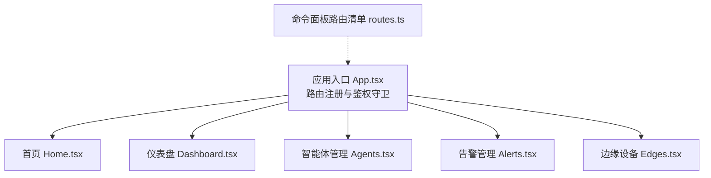
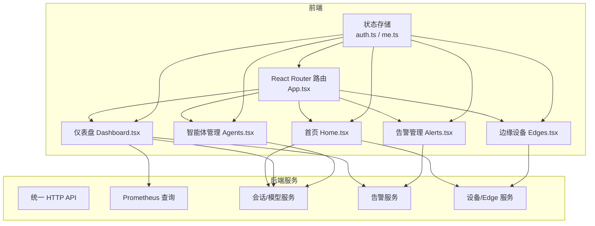
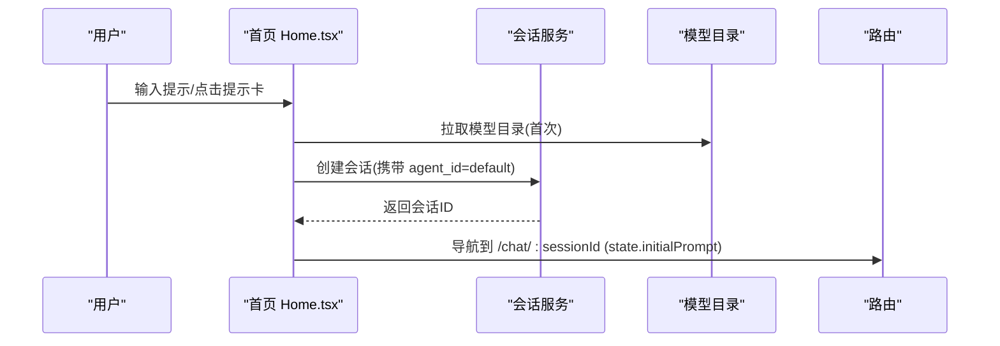
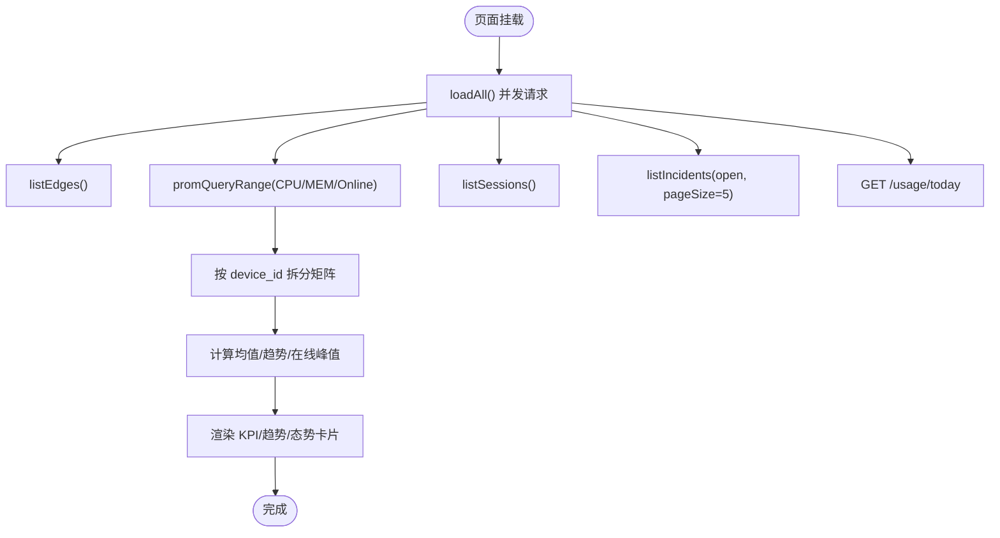
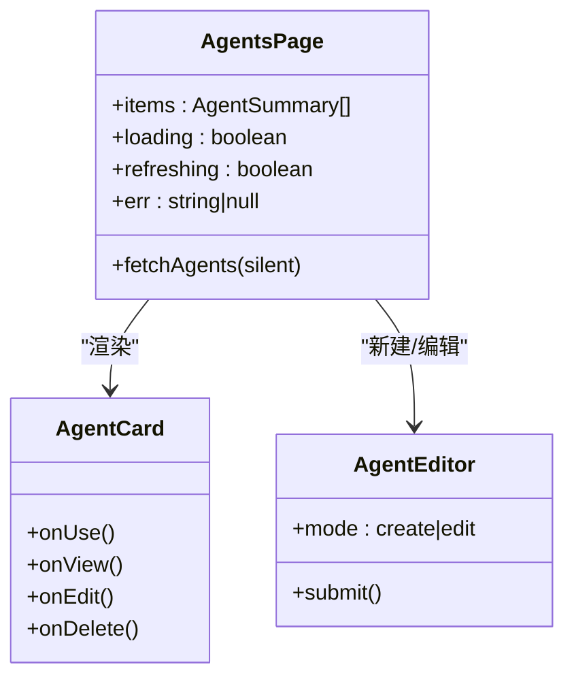
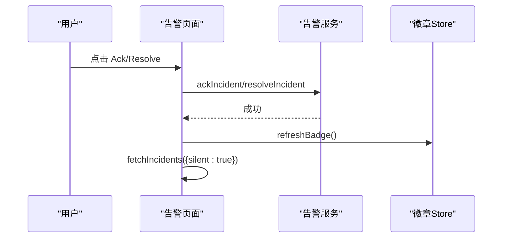
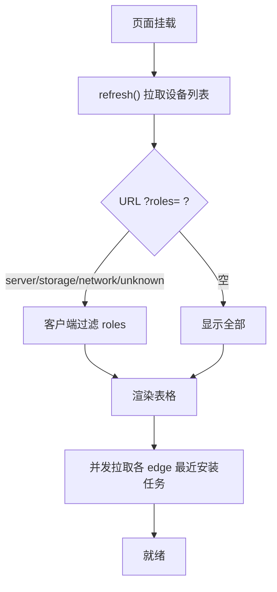
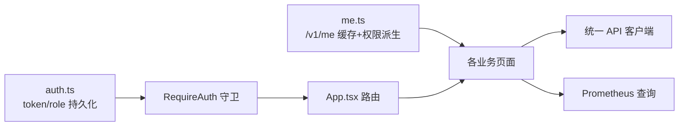

# 核心业务页面

<cite>
**本文引用的文件**   
- [App.tsx](file://web/src/App.tsx)
- [routes.ts](file://web/src/lib/routes.ts)
- [Home.tsx](file://web/src/pages/Home.tsx)
- [Dashboard.tsx](file://web/src/pages/Dashboard.tsx)
- [Agents.tsx](file://web/src/pages/Agents.tsx)
- [Alerts.tsx](file://web/src/pages/Alerts.tsx)
- [Edges.tsx](file://web/src/pages/Edges.tsx)
- [auth.ts](file://web/src/store/auth.ts)
- [me.ts](file://web/src/store/me.ts)
</cite>

## 目录
1. [简介](#简介)
2. [项目结构](#项目结构)
3. [核心组件](#核心组件)
4. [架构总览](#架构总览)
5. [详细组件分析](#详细组件分析)
6. [依赖关系分析](#依赖关系分析)
7. [性能考量](#性能考量)
8. [故障排查指南](#故障排查指南)
9. [结论](#结论)

## 简介
本文件聚焦于核心业务页面的设计与实现，覆盖首页、仪表盘、智能体管理、告警管理、边缘设备管理等关键页面。文档从数据获取策略、状态管理、用户交互流程、页面导航与参数传递、权限控制与安全验证、以及性能优化与最佳实践等维度进行系统化阐述，帮助读者快速理解并高效扩展这些页面。

## 项目结构
前端采用 React + TypeScript + React Router 的 SPA 架构，路由集中定义在应用入口中，页面按功能域组织在 pages 目录下，公共能力通过 store（Zustand）和 api 模块提供。命令面板使用的静态路由清单独立维护，便于非侧边栏调用方复用。

图表来源
- [App.tsx:84-234](file://web/src/App.tsx#L84-L234)
- [routes.ts:1-111](file://web/src/lib/routes.ts#L1-L111)

章节来源
- [App.tsx:84-234](file://web/src/App.tsx#L84-L234)
- [routes.ts:1-111](file://web/src/lib/routes.ts#L1-L111)

## 核心组件
- 首页：以对话式入口为主，聚合模型选择、提示词卡片、设备接入引导；支持创建会话并跳转到聊天线程页。
- 仪表盘：聚合在线设备数、CPU/MEM 趋势、LLM 用量、本周会话数、活跃告警概览；通过 Prometheus 查询与后端接口拉取数据。
- 智能体管理：展示内置/预置/自定义助理列表，支持新建、编辑、删除、复制为自定义助理，一键使用助理开启新会话。
- 告警管理：分页/筛选查看告警事件，支持确认、解决操作，联动全局未确认计数徽章。
- 边缘设备：设备列表、角色分配、安装/升级、密钥轮换、WebSSH 跳转、安装日志查看；支持按名称/主机名/IP 过滤与按角色筛选。

章节来源
- [Home.tsx:144-324](file://web/src/pages/Home.tsx#L144-L324)
- [Dashboard.tsx:42-433](file://web/src/pages/Dashboard.tsx#L42-L433)
- [Agents.tsx:51-210](file://web/src/pages/Agents.tsx#L51-L210)
- [Alerts.tsx:40-266](file://web/src/pages/Alerts.tsx#L40-L266)
- [Edges.tsx:68-595](file://web/src/pages/Edges.tsx#L68-L595)

## 架构总览
以下图展示了核心页面与外部服务/存储的交互关系，包括认证、API 客户端、Prometheus、会话与告警服务等。

图表来源
- [App.tsx:84-234](file://web/src/App.tsx#L84-L234)
- [Home.tsx:168-204](file://web/src/pages/Home.tsx#L168-L204)
- [Dashboard.tsx:69-210](file://web/src/pages/Dashboard.tsx#L69-L210)
- [Agents.tsx:69-86](file://web/src/pages/Agents.tsx#L69-L86)
- [Alerts.tsx:71-125](file://web/src/pages/Alerts.tsx#L71-L125)
- [Edges.tsx:144-177](file://web/src/pages/Edges.tsx#L144-L177)
- [auth.ts:20-41](file://web/src/store/auth.ts#L20-L41)
- [me.ts:94-114](file://web/src/store/me.ts#L94-L114)

## 详细组件分析

### 首页（Home）
- 数据获取策略
  - 启动时并行拉取设备总数与 LLM 模型目录，用于渲染空态引导与默认模型选择。
  - 将服务端默认模型与本地持久化选择进行对齐，确保后续会话继承一致。
- 状态管理
  - 使用共享模型选择 store 持久化当前选择的 provider/model，跨页面生效。
  - 提交前校验输入，错误信息就地显示。
- 用户交互流程
  - 输入或点击提示卡 → 创建会话 → 携带 initialPrompt 跳转到聊天线程页。
  - 无设备时展示“去新建第一台设备”引导，点击跳转至设备页。
- 导航与参数传递
  - 通过路由参数 sessionId 进入会话页，state 携带初始提示文本。
- 权限与安全
  - 受 RequireAuth 守卫保护；会话创建失败时返回友好错误提示。
- 性能优化
  - 问候语与提示卡采样在 mount 时计算一次，避免重复洗牌。
  - 模型选择变更同时更新服务端默认配置，减少后续推理路径的不一致性。

图表来源
- [Home.tsx:168-204](file://web/src/pages/Home.tsx#L168-L204)
- [Home.tsx:226-245](file://web/src/pages/Home.tsx#L226-L245)
- [App.tsx:102-104](file://web/src/App.tsx#L102-L104)

章节来源
- [Home.tsx:144-324](file://web/src/pages/Home.tsx#L144-L324)

### 仪表盘（Dashboard）
- 数据获取策略
  - 定时刷新（usePoll），一次性并发拉取设备列表、Prometheus 指标范围查询、会话统计、告警摘要、今日用量。
  - Prom 查询按 device_id 分组，前端 demux 后拼装每设备的 CPU/MEM 时序与在线设备历史。
- 状态管理
  - 多段错误状态分别管理（edges/sessions/usage/prom），保证局部失败不影响整体。
  - 计算派生指标：24h 平均 CPU/MEM、在线设备趋势、本周会话数。
- 用户交互流程
  - 手动刷新按钮触发全量加载。
  - 点击行内“打开图表”跳转 Grafana 钻取（基于 device_id）。
- 导航与参数传递
  - 跳转到告警详情页时附带 severity/rule 查询参数，便于二次筛选。
- 权限与安全
  - 受 RequireAuth 守卫保护；用量接口 404 视为暂无统计而非错误。
- 性能优化
  - 单次 Prom range 查询聚合多设备指标，避免 N 次往返。
  - 图表数据点按小时桶聚合，降低渲染压力。

图表来源
- [Dashboard.tsx:69-210](file://web/src/pages/Dashboard.tsx#L69-L210)
- [Dashboard.tsx:222-258](file://web/src/pages/Dashboard.tsx#L222-L258)

章节来源
- [Dashboard.tsx:42-433](file://web/src/pages/Dashboard.tsx#L42-L433)

### 智能体管理（Agents）
- 数据获取策略
  - 初始化拉取助理列表，支持刷新；详情弹窗按需加载工具清单。
- 状态管理
  - 列表排序：内置优先（default → 专家 → reviewer），其余按名称排序。
  - 编辑/新建/删除均通过模态框承载，保存成功后静默刷新。
- 用户交互流程
  - 点击“使用此助理”→ 创建会话（agent_id=该助理）→ 跳转聊天线程。
  - 内置/预置助理不可直接编辑，提供“复制为自定义助理”fork 后再编辑。
- 导航与参数传递
  - 通过 createSession 返回的 id 导航到 /chat/:id。
- 权限与安全
  - 仅用户自定义助理可编辑/删除；内置项只读。
- 性能优化
  - 列表本地搜索与排序，避免频繁后端交互。
  - 工具清单懒加载，仅在编辑器打开时拉取。

图表来源
- [Agents.tsx:51-210](file://web/src/pages/Agents.tsx#L51-L210)
- [Agents.tsx:583-795](file://web/src/pages/Agents.tsx#L583-L795)

章节来源
- [Agents.tsx:51-210](file://web/src/pages/Agents.tsx#L51-L210)
- [Agents.tsx:583-795](file://web/src/pages/Agents.tsx#L583-L795)

### 告警管理（Alerts）
- 数据获取策略
  - 定时轮询（30s）拉取告警列表，支持按状态/级别筛选；每次拉取同步全局未确认计数徽章。
  - 首屏拉取设备清单，构建 device_id→name 映射，用于目标列展示。
- 状态管理
  - 行级忙态（ackBusyId）、全局 openCount 来自共享 store，保证侧边栏红点与页面头部一致。
- 用户交互流程
  - 点击行进入详情；支持 Ack/Resolve，Resolve 需填写备注。
  - 操作完成后静默刷新列表并同步徽章。
- 导航与参数传递
  - 行点击导航到 /alerts/incidents/:id；仪表盘可带 severity/rule 查询参数直达。
- 权限与安全
  - 只读账号无法执行 Ack/Resolve；按钮禁用并提供提示。
- 性能优化
  - 批量拉取（pageSize=100），减少往返；静默刷新避免闪烁。

图表来源
- [Alerts.tsx:71-125](file://web/src/pages/Alerts.tsx#L71-L125)
- [Alerts.tsx:230-263](file://web/src/pages/Alerts.tsx#L230-L263)

章节来源
- [Alerts.tsx:40-266](file://web/src/pages/Alerts.tsx#L40-L266)

### 边缘设备（Edges）
- 数据获取策略
  - 定时刷新（10s）拉取设备列表；首次拉取 manager 版本用于 Agent 版本漂移提示。
  - 预拉每个 edge 最近一次安装任务，供“日志”按钮启用。
  - 设备事实缓存（deviceFactsCache）避免重复 GET /devices/{id}。
- 状态管理
  - 本地 filter（name/hostname/ip）与 URL roles 筛选合并下发后端；roles 为空表示未分类。
  - 行级 busy/toast 状态管理整包升级结果。
- 用户交互流程
  - 新建设备 → 弹出密钥窗口 → 暂存 secret_key 到 sessionStorage → 支持一键/手动安装。
  - 角色分配弹窗保存后广播设备变化，侧边栏子项自动刷新。
  - WebSSH 在新标签页打开，基于 device_id 建立反向连接。
- 导航与参数传递
  - 行点击跳转 /edges/:edgeId；所属设备列点击跳转 /hosts/:hostId。
- 权限与安全
  - 只读账号禁用终端/安装等操作；离线或未关联设备时禁用相关入口。
- 性能优化
  - 设备事实缓存 + 并发去重（inflight Map）；安装日志预拉一次，避免点击再查。
  - 列表字段固定宽度与截断，提升大数据量下的渲染稳定性。

图表来源
- [Edges.tsx:144-177](file://web/src/pages/Edges.tsx#L144-L177)
- [Edges.tsx:183-204](file://web/src/pages/Edges.tsx#L183-L204)
- [Edges.tsx:1486-1539](file://web/src/pages/Edges.tsx#L1486-L1539)

章节来源
- [Edges.tsx:68-595](file://web/src/pages/Edges.tsx#L68-L595)
- [Edges.tsx:800-908](file://web/src/pages/Edges.tsx#L800-L908)
- [Edges.tsx:1486-1539](file://web/src/pages/Edges.tsx#L1486-L1539)

## 依赖关系分析
- 路由与导航
  - 所有受保护页面由 RequireAuth 守卫包裹；登录态缺失时重定向到 /login 并保留来源路径。
  - 命令面板路由清单独立维护，支持模糊匹配与分组展示。
- 权限与身份
  - auth store 持久化 token/role/email；me store 提供单飞请求与派生权限标志（isAdmin/isViewer/canMutate）。
- 页面间导航
  - 通过 useNavigate 与 Link 组合，结合路由参数与查询字符串传递上下文（如 severity/rule）。
- 外部依赖
  - Prometheus 查询用于仪表盘趋势；会话/模型/告警/设备服务通过统一 API 访问。

图表来源
- [App.tsx:69-82](file://web/src/App.tsx#L69-L82)
- [auth.ts:20-41](file://web/src/store/auth.ts#L20-L41)
- [me.ts:94-114](file://web/src/store/me.ts#L94-L114)

章节来源
- [App.tsx:69-82](file://web/src/App.tsx#L69-L82)
- [auth.ts:20-41](file://web/src/store/auth.ts#L20-L41)
- [me.ts:94-114](file://web/src/store/me.ts#L94-L114)

## 性能考量
- 数据层
  - 批量与并发：仪表盘并发拉取多源数据；告警/设备列表使用较大 pageSize 减少往返。
  - 缓存与去重：设备事实缓存与 inflight 去重，避免重复请求风暴。
  - 时间序列降采样：Prom 查询按小时桶聚合，降低图表渲染压力。
- 渲染层
  - 列表固定列宽与截断，避免换行导致的抖动。
  - 懒加载与按需拉取：工具清单、安装日志预拉一次，不在首屏阻塞。
- 交互层
  - 静默刷新与局部错误隔离，避免全局失败导致白屏。
  - 防抖与节流：搜索输入与滚动场景下避免高频重排。

[本节为通用指导，不直接分析具体文件]

## 故障排查指南
- 登录态异常
  - 检查 auth store 是否包含 token；若缺失将被重定向到登录页。
- 权限不足
  - 使用 usePermissions 判断 canMutate；只读账号无法执行敏感操作。
- 数据加载失败
  - 各页面维护独立 error 状态，关注对应错误提示；必要时手动刷新。
- 设备事实不一致
  - 检查 deviceFactsCache 命中情况；若 404 会缓存 null，避免重试骚扰。
- 告警徽章不同步
  - 确认 refreshBadge 是否在操作后调用；store 内部已做去重。

章节来源
- [auth.ts:20-41](file://web/src/store/auth.ts#L20-L41)
- [me.ts:94-114](file://web/src/store/me.ts#L94-L114)
- [Alerts.tsx:71-125](file://web/src/pages/Alerts.tsx#L71-L125)
- [Edges.tsx:1486-1539](file://web/src/pages/Edges.tsx#L1486-L1539)

## 结论
核心业务页面围绕“低门槛入口、高信息密度、强可操作性”的目标设计：首页以对话驱动，仪表盘提供全局态势，智能体与告警/设备管理则提供完整的运维闭环。通过统一的鉴权与权限派生、稳定的数据获取与缓存策略、以及清晰的导航与参数传递机制，系统在可用性与性能之间取得良好平衡。建议在新增页面时沿用现有模式：集中路由、共享 store、批量并发、局部错误隔离与静默刷新，以确保一致的用户体验与可维护性。