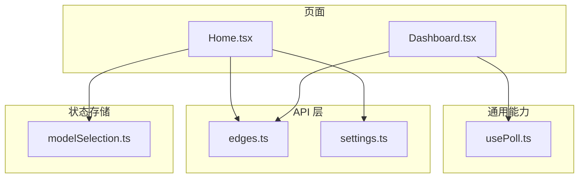
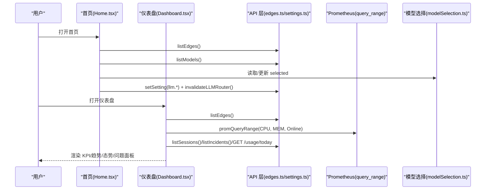
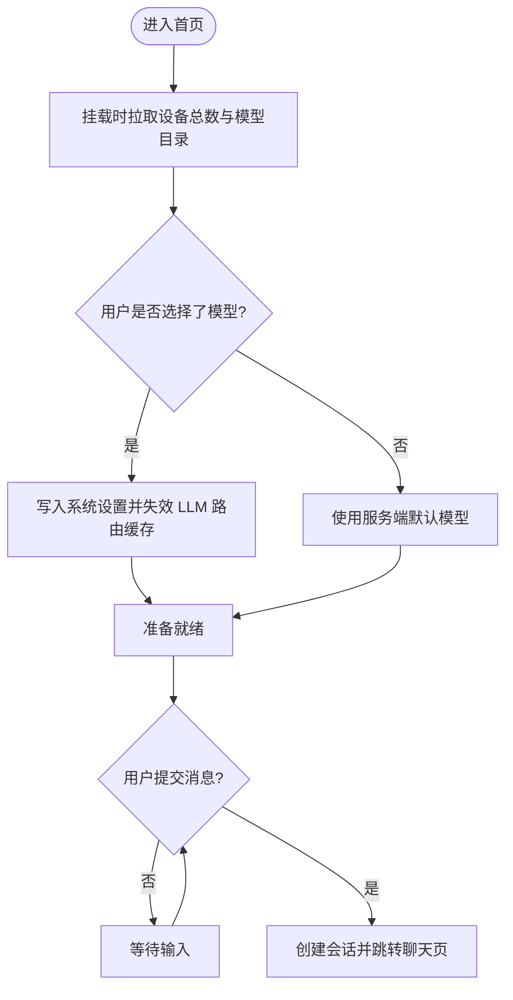
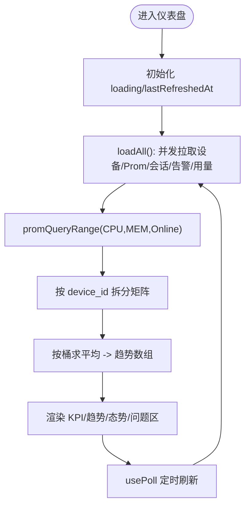
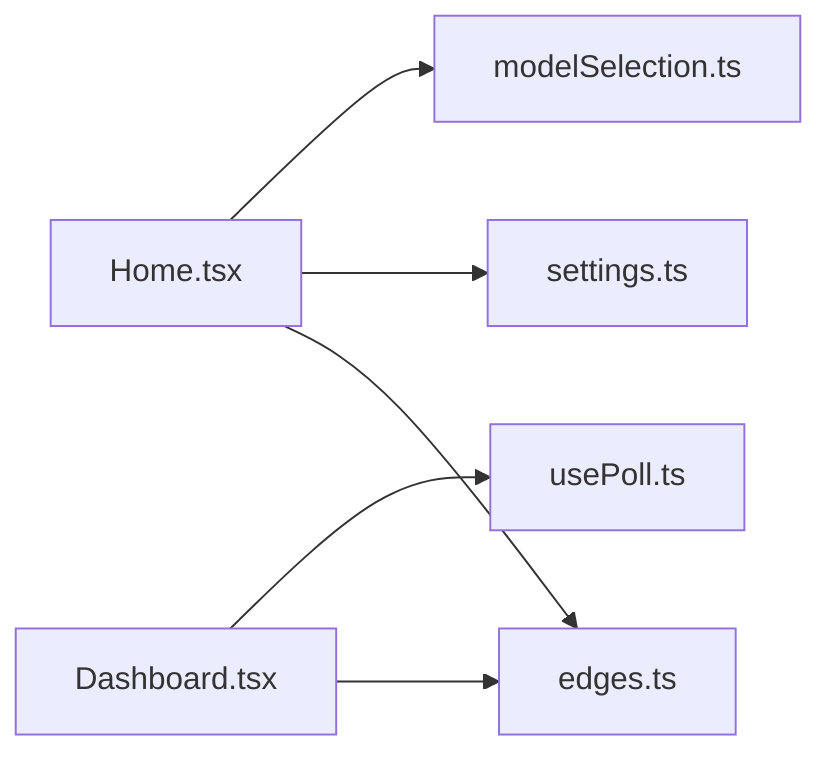

# 首页与仪表板

<cite>
**本文引用的文件**
- [Home.tsx](file://web/src/pages/Home.tsx)
- [Dashboard.tsx](file://web/src/pages/Dashboard.tsx)
- [usePoll.ts](file://web/src/lib/usePoll.ts)
- [edges.ts](file://web/src/api/edges.ts)
- [settings.ts](file://web/src/api/settings.ts)
- [modelSelection.ts](file://web/src/store/modelSelection.ts)
</cite>

## 目录
1. [简介](#简介)
2. [项目结构](#项目结构)
3. [核心组件](#核心组件)
4. [架构总览](#架构总览)
5. [详细组件分析](#详细组件分析)
6. [依赖关系分析](#依赖关系分析)
7. [性能考量](#性能考量)
8. [故障排查指南](#故障排查指南)
9. [结论](#结论)
10. [附录](#附录)

## 简介
本文件聚焦于“首页”和“仪表盘”两个关键页面的设计与实现，围绕以下目标展开：
- 系统概览数据的获取策略、关键指标展示方式与实时更新机制
- 仪表板布局设计、响应式适配与性能优化方案
- 用户个性化配置（默认模型选择）与数据缓存策略
- 页面加载优化与错误处理的最佳实践

## 项目结构
与首页与仪表板直接相关的代码位于前端 web 子工程中，主要涉及页面组件、轮询工具、API 封装与全局状态存储。

图表来源
- [Home.tsx:1-324](file://web/src/pages/Home.tsx#L1-L324)
- [Dashboard.tsx:1-800](file://web/src/pages/Dashboard.tsx#L1-L800)
- [usePoll.ts:1-46](file://web/src/lib/usePoll.ts#L1-L46)
- [edges.ts:1-253](file://web/src/api/edges.ts#L1-L253)
- [settings.ts:1-116](file://web/src/api/settings.ts#L1-L116)
- [modelSelection.ts:1-32](file://web/src/store/modelSelection.ts#L1-L32)

章节来源
- [Home.tsx:1-324](file://web/src/pages/Home.tsx#L1-L324)
- [Dashboard.tsx:1-800](file://web/src/pages/Dashboard.tsx#L1-L800)
- [usePoll.ts:1-46](file://web/src/lib/usePoll.ts#L1-L46)
- [edges.ts:1-253](file://web/src/api/edges.ts#L1-L253)
- [settings.ts:1-116](file://web/src/api/settings.ts#L1-L116)
- [modelSelection.ts:1-32](file://web/src/store/modelSelection.ts#L1-L32)

## 核心组件
- 首页 Home.tsx
  - 提供对话入口、提示词卡片、设备接入引导、LLM 模型选择与持久化
  - 挂载时拉取边缘节点总数与 LLM 模型目录，并同步服务端默认模型到本地持久化选择
- 仪表盘 Dashboard.tsx
  - 聚合在线设备数、CPU/MEM 24h 均值与趋势、在线设备历史、今日 LLM token 用量、本周会话数
  - 通过 Prometheus 批量查询 CPU/MEM/在线计数，按 device_id 维度重组为表格 sparkline 与集群趋势图
  - 使用 usePoll 定时刷新，支持手动刷新与可见性感知

章节来源
- [Home.tsx:144-324](file://web/src/pages/Home.tsx#L144-L324)
- [Dashboard.tsx:42-433](file://web/src/pages/Dashboard.tsx#L42-L433)

## 架构总览
首页与仪表盘的请求路径如下：
- 首页：调用 edges 列表接口获取设备总数；调用 chat 模型目录接口获取 provider 与默认模型；将用户选择写入系统设置并失效 LLM 路由缓存
- 仪表盘：并发拉取设备列表、Prometheus 时间序列（CPU/MEM/在线计数）、会话统计、告警事件、LLM 今日用量；在客户端按 device_id 重排矩阵并计算汇总指标

图表来源
- [Home.tsx:168-224](file://web/src/pages/Home.tsx#L168-L224)
- [Dashboard.tsx:69-210](file://web/src/pages/Dashboard.tsx#L69-L210)
- [edges.ts:239-252](file://web/src/api/edges.ts#L239-L252)
- [settings.ts:24-37](file://web/src/api/settings.ts#L24-L37)
- [modelSelection.ts:20-31](file://web/src/store/modelSelection.ts#L20-L31)

## 详细组件分析

### 首页 Home.tsx
- 问候语与提示词
  - 随机问候语与固定数量的提示词卡片，提升首次交互体验
- 设备接入引导
  - 当设备总数为 0 时显示引导按钮，跳转至设备管理页
- LLM 模型选择与持久化
  - 从 store 读取用户选择，若为空则回退到服务端目录默认值
  - 用户修改后写入系统设置 llm.default_provider 与 llm.<provider>_default_model，并触发 LLM 路由失效
- 会话创建与导航
  - 提交后创建会话并跳转到聊天线程页，初始 prompt 通过路由 state 传递

图表来源
- [Home.tsx:168-224](file://web/src/pages/Home.tsx#L168-L224)
- [Home.tsx:226-245](file://web/src/pages/Home.tsx#L226-L245)

章节来源
- [Home.tsx:144-324](file://web/src/pages/Home.tsx#L144-L324)

### 仪表盘 Dashboard.tsx
- 数据源与刷新策略
  - 使用 usePoll 以固定间隔轮询 loadAll；后台标签页自动暂停，恢复时立即补刷一次
  - 支持手动刷新，显示上次刷新时间与刷新中状态
- 指标计算与可视化
  - 并发查询 Prometheus 的 CPU、MEM、在线设备历史，step=1h，得到 24 个时间点
  - 按 device_id 对矩阵进行分组，计算每桶平均值，生成 24h 趋势与 sparkline
  - 在线设备数与角色分布、活跃告警与高频规则分栏呈现
- 错误处理与降级
  - 各数据块独立 try/catch，失败时仅影响对应区域，不阻断整体渲染
  - 针对 404 的用量接口返回空态提示，避免误报

图表来源
- [Dashboard.tsx:69-210](file://web/src/pages/Dashboard.tsx#L69-L210)
- [Dashboard.tsx:212-220](file://web/src/pages/Dashboard.tsx#L212-L220)
- [usePoll.ts:20-45](file://web/src/lib/usePoll.ts#L20-L45)

章节来源
- [Dashboard.tsx:42-433](file://web/src/pages/Dashboard.tsx#L42-L433)
- [usePoll.ts:1-46](file://web/src/lib/usePoll.ts#L1-L46)

## 依赖关系分析
- 组件对外部模块的依赖
  - Home.tsx 依赖 edges.ts（设备清单）、settings.ts（系统设置）、modelSelection.ts（模型选择持久化）
  - Dashboard.tsx 依赖 edges.ts（设备清单与 promQueryRange）、usePoll.ts（轮询）、alerts/chat 等（此处不展开）
- 内部状态与外部服务耦合
  - 模型选择跨页面共享且持久化，保证会话继承一致
  - 仪表盘通过 Prometheus query_range 获取时序数据，按 device_id 维度重组，降低 N+1 请求开销

图表来源
- [Home.tsx:168-224](file://web/src/pages/Home.tsx#L168-L224)
- [Dashboard.tsx:69-210](file://web/src/pages/Dashboard.tsx#L69-L210)
- [modelSelection.ts:20-31](file://web/src/store/modelSelection.ts#L20-L31)

章节来源
- [Home.tsx:168-224](file://web/src/pages/Home.tsx#L168-L224)
- [Dashboard.tsx:69-210](file://web/src/pages/Dashboard.tsx#L69-L210)
- [modelSelection.ts:1-32](file://web/src/store/modelSelection.ts#L1-L32)

## 性能考量
- 并发与批量化
  - 仪表盘在同一轮次内并发发起多个请求，PromQL 使用 range 查询并按 label 分组，避免逐设备多次往返
- 轮询节流与可见性感知
  - usePoll 在标签页不可见时暂停轮询，恢复时立即执行一次，减少无效网络开销并保持 UI 新鲜
- 计算复杂度
  - 趋势计算为 O(N×B)，N 为可见设备数，B 为时间桶数（24），内存占用与渲染成本可控
- 渲染优化
  - 使用 useMemo 缓存派生数据，避免重复计算；KPI 与图表仅在数据变化时更新

[本节为通用性能建议，不直接分析具体文件]

## 故障排查指南
- 设备列表加载失败
  - 现象：设备相关区域显示错误提示或空态
  - 定位：检查 listEdges 的 catch 分支与错误状态变量
  - 参考路径：[Dashboard.tsx:83-85](file://web/src/pages/Dashboard.tsx#L83-L85)
- Prometheus 查询异常
  - 现象：趋势图无数据或报错
  - 定位：检查 promQueryRange 的错误处理与表达式是否正确
  - 参考路径：[Dashboard.tsx:116-120](file://web/src/pages/Dashboard.tsx#L116-L120)
- 用量接口 404
  - 现象：LLM token 今日用量显示“暂无统计”
  - 定位：区分 404 与其他错误，避免误报
  - 参考路径：[Dashboard.tsx:194-205](file://web/src/pages/Dashboard.tsx#L194-L205)
- 模型选择未生效
  - 现象：会话仍使用旧模型
  - 定位：确认 setSetting 与 invalidateLLMRouter 是否成功
  - 参考路径：[Home.tsx:212-224](file://web/src/pages/Home.tsx#L212-L224), [settings.ts:108-115](file://web/src/api/settings.ts#L108-L115)

章节来源
- [Dashboard.tsx:83-85](file://web/src/pages/Dashboard.tsx#L83-L85)
- [Dashboard.tsx:116-120](file://web/src/pages/Dashboard.tsx#L116-L120)
- [Dashboard.tsx:194-205](file://web/src/pages/Dashboard.tsx#L194-L205)
- [Home.tsx:212-224](file://web/src/pages/Home.tsx#L212-L224)
- [settings.ts:108-115](file://web/src/api/settings.ts#L108-L115)

## 结论
- 首页侧重“对话驱动”的入口体验，结合设备接入引导与模型选择持久化，确保会话上下文一致性
- 仪表盘通过并发与批量化查询、可见性感知的轮询、以及稳健的错误隔离，提供稳定实时的系统概览
- 推荐继续强化：
  - 首屏骨架屏与渐进式加载
  - 错误重试与指数退避
  - 更细粒度的缓存策略（如基于时间的局部缓存）

[本节为总结性内容，不直接分析具体文件]

## 附录
- 关键 API 与类型
  - 设备列表与 PromQL 透传：[edges.ts:145-160](file://web/src/api/edges.ts#L145-L160), [edges.ts:239-252](file://web/src/api/edges.ts#L239-L252)
  - 系统设置读写与 LLM 路由失效：[settings.ts:24-37](file://web/src/api/settings.ts#L24-L37), [settings.ts:108-115](file://web/src/api/settings.ts#L108-L115)
  - 模型选择持久化：[modelSelection.ts:20-31](file://web/src/store/modelSelection.ts#L20-L31)
  - 轮询 Hook：[usePoll.ts:20-45](file://web/src/lib/usePoll.ts#L20-L45)

章节来源
- [edges.ts:145-160](file://web/src/api/edges.ts#L145-L160)
- [edges.ts:239-252](file://web/src/api/edges.ts#L239-L252)
- [settings.ts:24-37](file://web/src/api/settings.ts#L24-L37)
- [settings.ts:108-115](file://web/src/api/settings.ts#L108-L115)
- [modelSelection.ts:20-31](file://web/src/store/modelSelection.ts#L20-L31)
- [usePoll.ts:20-45](file://web/src/lib/usePoll.ts#L20-L45)