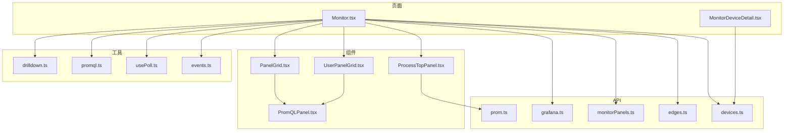
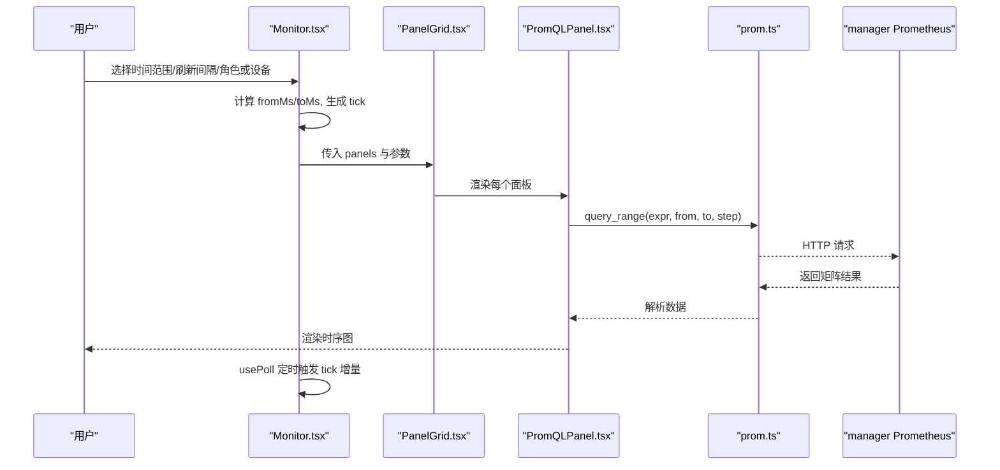
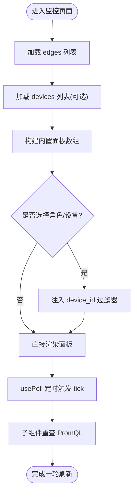
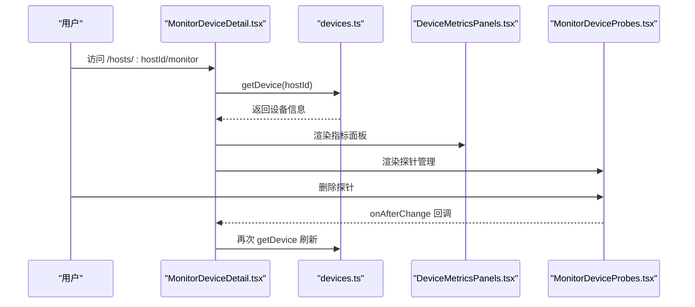
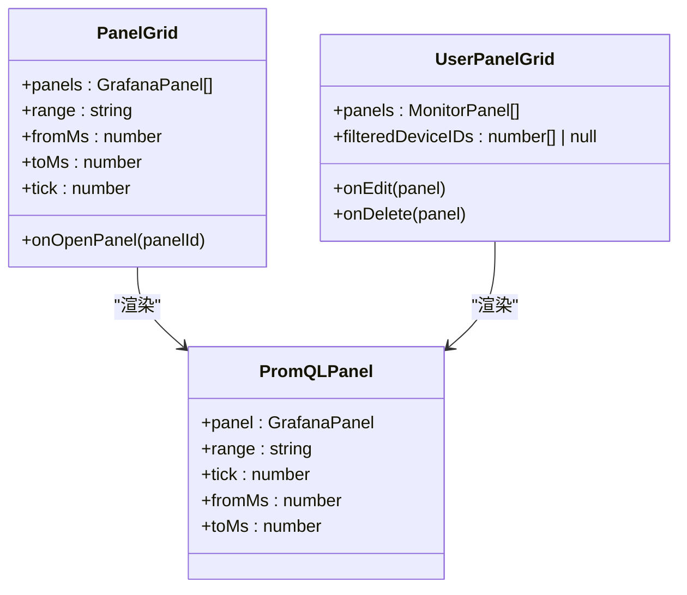
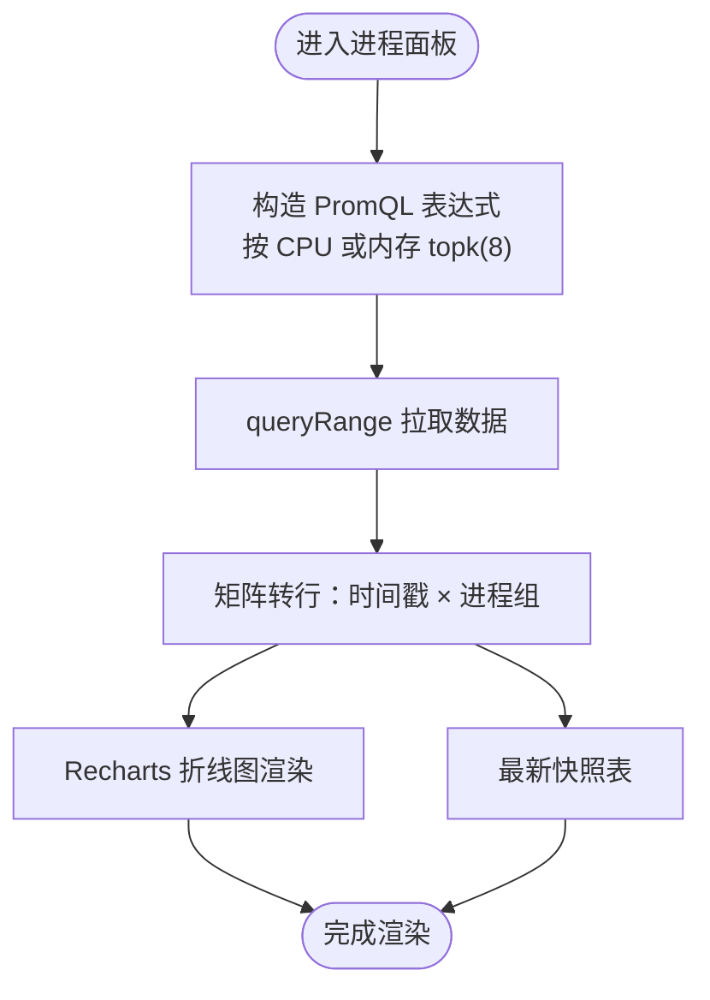
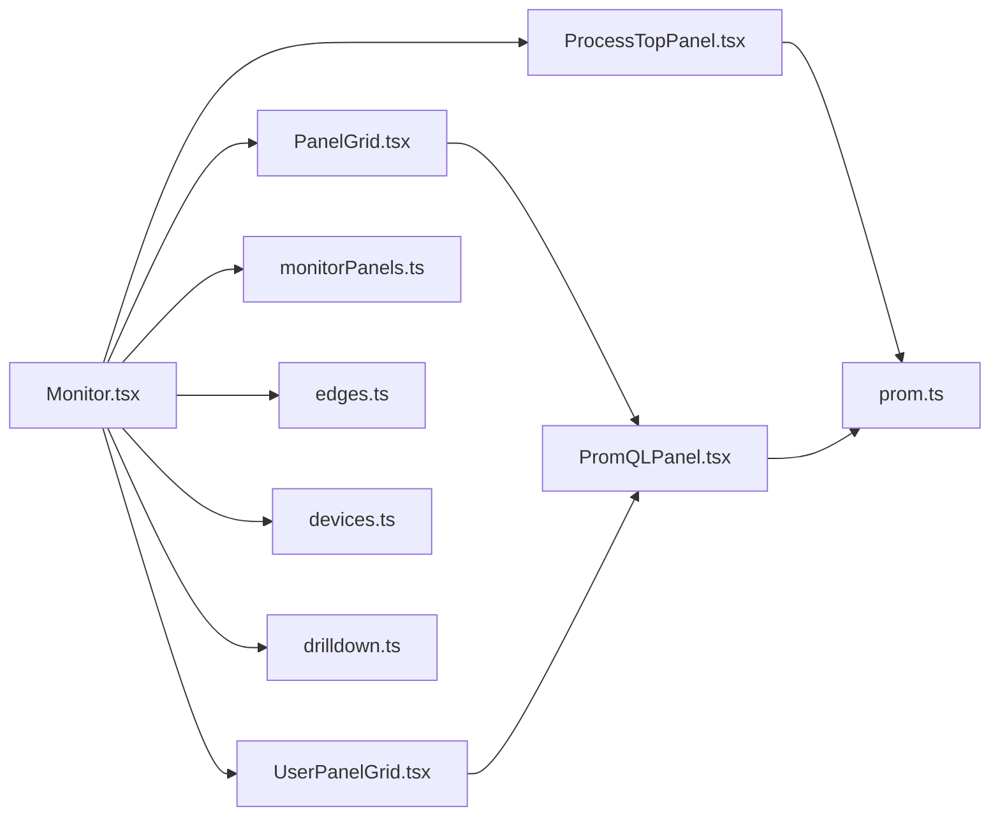

# 监控相关页面

<cite>
**本文引用的文件**   
- [Monitor.tsx](file://web/src/pages/Monitor.tsx)
- [MonitorDeviceDetail.tsx](file://web/src/pages/MonitorDeviceDetail.tsx)
- [PanelGrid.tsx](file://web/src/components/monitor/PanelGrid.tsx)
- [UserPanelGrid.tsx](file://web/src/components/monitor/UserPanelGrid.tsx)
- [ProcessTopPanel.tsx](file://web/src/components/monitor/ProcessTopPanel.tsx)
- [prom.ts](file://web/src/api/prom.ts)
- [grafana.ts](file://web/src/api/grafana.ts)
- [drilldown.ts](file://web/src/lib/drilldown.ts)
- [promql.ts](file://web/src/lib/promql.ts)
- [usePoll.ts](file://web/src/lib/usePoll.ts)
- [edges.ts](file://web/src/api/edges.ts)
- [devices.ts](file://web/src/api/devices.ts)
- [events.ts](file://web/src/lib/events.ts)
- [monitorPanels.ts](file://web/src/api/monitorPanels.ts)
- [PromQLPanel.tsx](file://web/src/components/PromQLPanel.tsx)
</cite>

## 目录
1. [简介](#简介)
2. [项目结构](#项目结构)
3. [核心组件](#核心组件)
4. [架构总览](#架构总览)
5. [详细组件分析](#详细组件分析)
6. [依赖关系分析](#依赖关系分析)
7. [性能与实时性](#性能与实时性)
8. [故障排查指南](#故障排查指南)
9. [结论](#结论)
10. [附录：自定义监控面板开发指南](#附录自定义监控面板开发指南)

## 简介
本文件面向开发者，系统化梳理监控系统的前端页面与组件实现，覆盖以下能力：
- 监控主页面：内置集群级指标面板、时间范围与刷新控制、角色/设备筛选、Grafana 联动。
- 设备详情（监控视角）：按设备维度查看指标、探针与元数据。
- 主机管理：通过角色与设备筛选在监控主页面进行聚合视图切换。
- 拓扑图：作为“主机详情”的一部分，提供设备拓扑可视化入口（本节为概念说明）。
- 实时监控数据展示与更新机制：基于 PromQL 的轮询刷新与 tick 驱动。
- 图表组件与数据可视化方案：PromQLPanel + Recharts 渲染时序图；进程 Top-N 使用独立折线图。
- 设备状态与健康检查：在线/离线状态、最后心跳、探针列表等。
- 监控数据的查询与过滤：角色筛选、设备筛选、PromQL 注入 device_id 过滤器。
- 自定义监控面板：创建/编辑/删除用户面板，并同步到 Grafana ongrid-monitor 仪表盘。

## 项目结构
监控相关的前端代码主要位于 web/src 下，关键路径如下：
- 页面层：web/src/pages/Monitor.tsx、web/src/pages/MonitorDeviceDetail.tsx
- 组件层：web/src/components/monitor/*、web/src/components/PromQLPanel.tsx
- API 层：web/src/api/prom.ts、web/src/api/grafana.ts、web/src/api/monitorPanels.ts、web/src/api/edges.ts、web/src/api/devices.ts
- 工具库：web/src/lib/promql.ts、web/src/lib/drilldown.ts、web/src/lib/usePoll.ts、web/src/lib/events.ts

图示来源
- [Monitor.tsx:1-719](file://web/src/pages/Monitor.tsx#L1-L719)
- [MonitorDeviceDetail.tsx:1-306](file://web/src/pages/MonitorDeviceDetail.tsx#L1-L306)
- [PanelGrid.tsx:1-78](file://web/src/components/monitor/PanelGrid.tsx#L1-L78)
- [UserPanelGrid.tsx:1-156](file://web/src/components/monitor/UserPanelGrid.tsx#L1-L156)
- [ProcessTopPanel.tsx:1-277](file://web/src/components/monitor/ProcessTopPanel.tsx#L1-L277)
- [prom.ts](file://web/src/api/prom.ts)
- [grafana.ts](file://web/src/api/grafana.ts)
- [monitorPanels.ts](file://web/src/api/monitorPanels.ts)
- [edges.ts](file://web/src/api/edges.ts)
- [devices.ts](file://web/src/api/devices.ts)
- [drilldown.ts](file://web/src/lib/drilldown.ts)
- [promql.ts](file://web/src/lib/promql.ts)
- [usePoll.ts](file://web/src/lib/usePoll.ts)
- [events.ts](file://web/src/lib/events.ts)

章节来源
- [Monitor.tsx:1-719](file://web/src/pages/Monitor.tsx#L1-L719)
- [MonitorDeviceDetail.tsx:1-306](file://web/src/pages/MonitorDeviceDetail.tsx#L1-L306)

## 核心组件
- 监控主页面（Monitor.tsx）
  - 内置 10 个集群级面板（CPU、内存、磁盘、网络、Top 进程 CPU/内存、负载饱和度、磁盘 I/O、conntrack、TCP 连接数），直接以 PromQL 查询 manager 的 Prometheus 接口。
  - 支持时间范围、自动刷新、角色筛选、单设备筛选；将筛选条件转换为 device_id 过滤器注入到每个目标 PromQL。
  - 用户自定义面板：从 /v1/monitor/panels 加载，CRUD 后异步同步到 Grafana ongrid-monitor 仪表盘。
  - 顶部操作：添加面板、在 Grafana 中打开、刷新所有图表。
- 设备监控详情页（MonitorDeviceDetail.tsx）
  - 路由 /hosts/:hostId/monitor，提供“指标/探针/元数据”三个 Tab。
  - 指标 Tab 复用设备级指标面板组件；探针 Tab 展示与管理探针；元数据 Tab 展示设备元信息。
- 网格布局（PanelGrid.tsx）
  - 基于 24 列网格布局，窄屏自动折叠为单列，适配不同屏幕尺寸。
- 用户面板网格（UserPanelGrid.tsx）
  - 渲染用户创建的 PromQL 面板，支持编辑/删除悬浮按钮，显示是否受角色筛选影响的状态标签。
- 进程 Top-N 面板（ProcessTopPanel.tsx）
  - 仅当选择单设备时出现，展示该设备 Top 8 进程的 CPU/内存趋势，并提供最新快照表。
- 通用 PromQL 面板（PromQLPanel.tsx）
  - 统一封装 PromQL 查询、错误处理、阈值高亮、Grafana 跳转等能力。

章节来源
- [Monitor.tsx:1-719](file://web/src/pages/Monitor.tsx#L1-L719)
- [MonitorDeviceDetail.tsx:1-306](file://web/src/pages/MonitorDeviceDetail.tsx#L1-L306)
- [PanelGrid.tsx:1-78](file://web/src/components/monitor/PanelGrid.tsx#L1-L78)
- [UserPanelGrid.tsx:1-156](file://web/src/components/monitor/UserPanelGrid.tsx#L1-L156)
- [ProcessTopPanel.tsx:1-277](file://web/src/components/monitor/ProcessTopPanel.tsx#L1-L277)
- [PromQLPanel.tsx](file://web/src/components/PromQLPanel.tsx)

## 架构总览
监控主页面采用“前端直连 Prometheus”的方案：不依赖 Grafana Dashboard JSON，直接在浏览器侧发起 PromQL 查询，由 Recharts 渲染时序图。同时保留与 Grafana 的深度链接能力，用于更丰富的分析与自定义面板。

图示来源
- [Monitor.tsx:1-719](file://web/src/pages/Monitor.tsx#L1-L719)
- [PanelGrid.tsx:1-78](file://web/src/components/monitor/PanelGrid.tsx#L1-L78)
- [PromQLPanel.tsx](file://web/src/components/PromQLPanel.tsx)
- [prom.ts](file://web/src/api/prom.ts)

## 详细组件分析

### 监控主页面（Monitor.tsx）
- 内置面板定义
  - 通过函数构建一组 GrafanaPanel 描述对象，包含 id、type、title、gridPos、targets（expr）、fieldConfig（单位等）。
  - 这些面板均为集群级聚合视图，按 device_id 分组着色，便于多设备对比。
- 筛选与过滤
  - 角色筛选：根据 edges 的 roles 字段匹配，得到匹配的 device_id 集合。
  - 设备筛选：URL 参数 device 指定单台设备，优先级高于角色筛选。
  - 过滤器注入：对每个 target.expr 调用 injectDeviceIDFilter，将 device_id=~"..." 插入到带 {} 锚点的表达式中。
- 时间窗口与刷新
  - range 决定 fromMs/toMs；tick 每轮递增，驱动子组件重新拉取数据。
  - usePoll 控制刷新频率，并在页面不可见时暂停，避免后台持续请求。
- 用户面板
  - 从 /v1/monitor/panels 获取用户面板列表，支持新增/编辑/删除，并提示 Grafana 同步状态。
- Grafana 联动
  - 通过 drilldown 提供的 openObservabilityUrl 打开 ongrid-monitor 仪表盘或单面板视图。

图示来源
- [Monitor.tsx:1-719](file://web/src/pages/Monitor.tsx#L1-L719)
- [promql.ts](file://web/src/lib/promql.ts)
- [usePoll.ts](file://web/src/lib/usePoll.ts)

章节来源
- [Monitor.tsx:1-719](file://web/src/pages/Monitor.tsx#L1-L719)
- [promql.ts](file://web/src/lib/promql.ts)
- [usePoll.ts](file://web/src/lib/usePoll.ts)
- [drilldown.ts](file://web/src/lib/drilldown.ts)
- [monitorPanels.ts](file://web/src/api/monitorPanels.ts)
- [edges.ts](file://web/src/api/edges.ts)
- [devices.ts](file://web/src/api/devices.ts)
- [events.ts](file://web/src/lib/events.ts)

### 设备监控详情页（MonitorDeviceDetail.tsx）
- 路由与导航
  - 路由 /hosts/:hostId/monitor，头部提供返回“主机详情”的快捷入口，形成明确的视角切换。
- 数据加载
  - 使用 getDevice 获取设备信息，失败时展示错误提示。
- 功能分区
  - 指标：复用设备级指标面板组件。
  - 探针：展示与管理探针，支持删除后回调刷新设备信息。
  - 元数据：以 JSON 卡片形式展示设备元信息。

图示来源
- [MonitorDeviceDetail.tsx:1-306](file://web/src/pages/MonitorDeviceDetail.tsx#L1-L306)
- [devices.ts](file://web/src/api/devices.ts)

章节来源
- [MonitorDeviceDetail.tsx:1-306](file://web/src/pages/MonitorDeviceDetail.tsx#L1-L306)
- [devices.ts](file://web/src/api/devices.ts)

### 网格布局与用户面板（PanelGrid.tsx / UserPanelGrid.tsx）
- PanelGrid
  - 将 GrafanaPanel 映射到 CSS Grid 坐标，宽屏 24 列，窄屏单列自适应。
- UserPanelGrid
  - 将 MonitorPanel 转换为 GrafanaPanel 格式，若 PromQL 引用了 device_id 且当前有筛选，则注入过滤器。
  - 悬浮显示编辑/删除按钮，显示“已筛选/全集群”状态标签，以及 Grafana 同步失败提示。

图示来源
- [PanelGrid.tsx:1-78](file://web/src/components/monitor/PanelGrid.tsx#L1-L78)
- [UserPanelGrid.tsx:1-156](file://web/src/components/monitor/UserPanelGrid.tsx#L1-L156)
- [PromQLPanel.tsx](file://web/src/components/PromQLPanel.tsx)

章节来源
- [PanelGrid.tsx:1-78](file://web/src/components/monitor/PanelGrid.tsx#L1-L78)
- [UserPanelGrid.tsx:1-156](file://web/src/components/monitor/UserPanelGrid.tsx#L1-L156)

### 进程 Top-N 面板（ProcessTopPanel.tsx）
- 数据源
  - 基于 process-exporter 上报的 namedprocess_namegroup_* 指标，经 edge 的 procmetrics plugin 采集到 Prometheus。
- 交互
  - 支持按 CPU/内存排序，展示 Top 8 进程的时间线，并提供最新快照表格。
- 查询策略
  - 根据时间跨度动态计算 step，确保与主面板一致的采样节奏。

图示来源
- [ProcessTopPanel.tsx:1-277](file://web/src/components/monitor/ProcessTopPanel.tsx#L1-L277)
- [prom.ts](file://web/src/api/prom.ts)

章节来源
- [ProcessTopPanel.tsx:1-277](file://web/src/components/monitor/ProcessTopPanel.tsx#L1-L277)
- [prom.ts](file://web/src/api/prom.ts)

## 依赖关系分析
- 页面与组件
  - Monitor.tsx 组合 PanelGrid、UserPanelGrid、ProcessTopPanel，并通过 API 模块加载 edges/devices/monitorPanels。
  - MonitorDeviceDetail.tsx 依赖 devices.ts 获取设备信息，并组合 DeviceMetricsPanels 与 MonitorDeviceProbes。
- 数据流
  - PromQL 查询经由 prom.ts 的 queryRange 发起，返回矩阵数据供 PromQLPanel 与 ProcessTopPanel 渲染。
  - 筛选逻辑通过 promql.ts 的 injectDeviceIDFilter 与 referencesDeviceID 实现。
- 外部集成
  - Grafana 深度链接通过 drilldown.ts 的 openObservabilityUrl 打开 ongrid-monitor 仪表盘。

图示来源
- [Monitor.tsx:1-719](file://web/src/pages/Monitor.tsx#L1-L719)
- [PanelGrid.tsx:1-78](file://web/src/components/monitor/PanelGrid.tsx#L1-L78)
- [UserPanelGrid.tsx:1-156](file://web/src/components/monitor/UserPanelGrid.tsx#L1-L156)
- [ProcessTopPanel.tsx:1-277](file://web/src/components/monitor/ProcessTopPanel.tsx#L1-L277)
- [prom.ts](file://web/src/api/prom.ts)
- [monitorPanels.ts](file://web/src/api/monitorPanels.ts)
- [edges.ts](file://web/src/api/edges.ts)
- [devices.ts](file://web/src/api/devices.ts)
- [drilldown.ts](file://web/src/lib/drilldown.ts)

章节来源
- [Monitor.tsx:1-719](file://web/src/pages/Monitor.tsx#L1-L719)
- [PanelGrid.tsx:1-78](file://web/src/components/monitor/PanelGrid.tsx#L1-L78)
- [UserPanelGrid.tsx:1-156](file://web/src/components/monitor/UserPanelGrid.tsx#L1-L156)
- [ProcessTopPanel.tsx:1-277](file://web/src/components/monitor/ProcessTopPanel.tsx#L1-L277)
- [prom.ts](file://web/src/api/prom.ts)
- [monitorPanels.ts](file://web/src/api/monitorPanels.ts)
- [edges.ts](file://web/src/api/edges.ts)
- [devices.ts](file://web/src/api/devices.ts)
- [drilldown.ts](file://web/src/lib/drilldown.ts)

## 性能与实时性
- 首次渲染优化
  - 内置面板硬编码，无需等待 Grafana Dashboard JSON，首屏快速。
- 刷新策略
  - usePoll 控制刷新周期，默认 60 秒，可配置关闭/30s/1min/5min。
  - 页面不可见时自动暂停，减少后台请求。
- 查询步长
  - 根据时间跨度动态计算 step，保证曲线密度与可读性。
- 网格布局
  - 窄屏自动折叠为单列，提升移动端可读性。
- 建议
  - 大时间范围（如 7d）适当增大 step，避免数据点过多导致渲染卡顿。
  - 多设备聚合视图优先使用 avg/sum by(device_id)，降低噪声。

[本节为通用指导，不涉及具体文件分析]

## 故障排查指南
- 无进程数据
  - 现象：进程 Top-N 面板显示“该设备没有进程数据”。
  - 可能原因：edge 上 process_exporter 二进制缺失或 procmetrics 插件未启用。
  - 处理：在该设备上重新安装最新版 install-edge.sh，或在“设备 → Plugins”检查 procmetrics 状态。
- Grafana 同步失败
  - 现象：用户面板底部显示“Grafana 同步失败 — 本地仍可用”。
  - 处理：检查 Grafana 连通性与权限，确认 ongrid-monitor 仪表盘存在且可写。
- 筛选无效
  - 现象：选择角色或设备后，部分面板未变化。
  - 原因：用户面板的 PromQL 未引用 device_id，不会被注入过滤器。
  - 处理：在面板编辑器中添加 device_id 标签匹配，或理解其为“全集群”视图。
- 刷新频繁导致卡顿
  - 处理：调大刷新间隔或缩小时间范围；必要时关闭自动刷新手动刷新。

章节来源
- [ProcessTopPanel.tsx:1-277](file://web/src/components/monitor/ProcessTopPanel.tsx#L1-L277)
- [UserPanelGrid.tsx:1-156](file://web/src/components/monitor/UserPanelGrid.tsx#L1-L156)

## 结论
监控系统以“内置面板 + 用户面板”的双轨模式提供开箱即用的观测能力，并通过 PromQL 直连 Prometheus 实现低延迟的首屏与灵活的二次分析。角色/设备筛选与 Grafana 深度链接进一步增强了运维效率。建议在扩展新面板时遵循统一的 PromQL 规范与设备标识约定，以保证筛选与可视化的正确性。

[本节为总结，不涉及具体文件分析]

## 附录：自定义监控面板开发指南
- 创建/编辑/删除
  - 在监控主页面点击“添加面板”，填写标题、PromQL、单位与图例格式，提交后持久化至 /v1/monitor/panels。
  - 编辑/删除通过悬浮按钮触发，删除会同步移除 Grafana 对应面板。
- PromQL 编写要点
  - 如需受角色/设备筛选影响，请在表达式中使用 device_id 标签（例如 device_id="X" 或 device_id=~"a|b"）。
  - 若表达式不包含 device_id，将被视为“全集群”视图，不会受筛选影响。
- 与 Grafana 同步
  - 新建/修改面板后，系统会异步将面板推送到 Grafana ongrid-monitor 仪表盘。
  - 若同步失败，本地仍可正常渲染，但 Grafana 中的版本可能不一致。
- 最佳实践
  - 使用合理的单位与 legendFormat，提升可读性。
  - 对于跨设备聚合，优先使用 avg/sum by(device_id)。
  - 避免过于密集的 step，合理设置时间范围。

章节来源
- [Monitor.tsx:1-719](file://web/src/pages/Monitor.tsx#L1-L719)
- [UserPanelGrid.tsx:1-156](file://web/src/components/monitor/UserPanelGrid.tsx#L1-L156)
- [monitorPanels.ts](file://web/src/api/monitorPanels.ts)
- [promql.ts](file://web/src/lib/promql.ts)
- [drilldown.ts](file://web/src/lib/drilldown.ts)