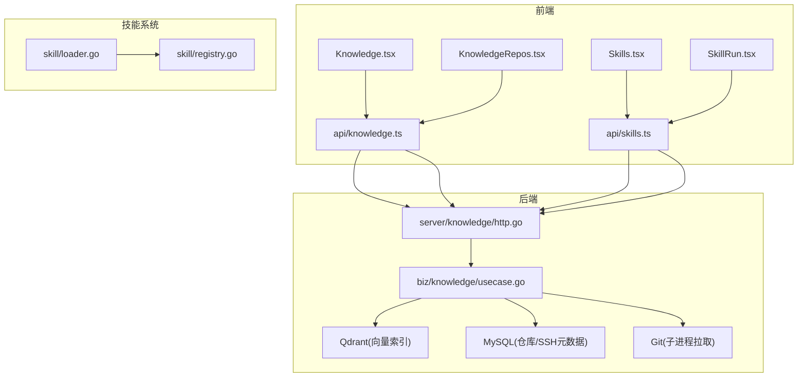
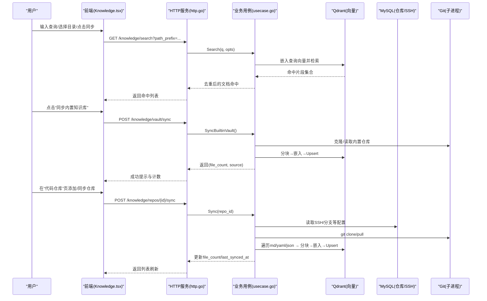
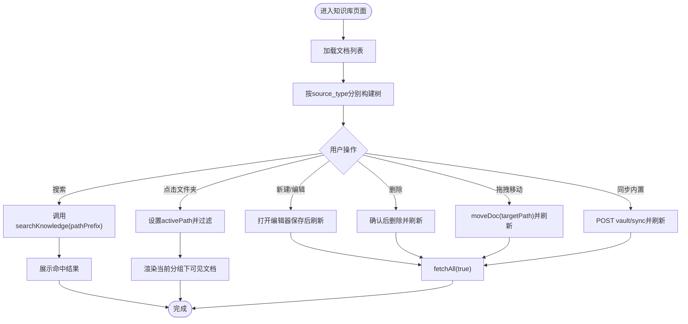
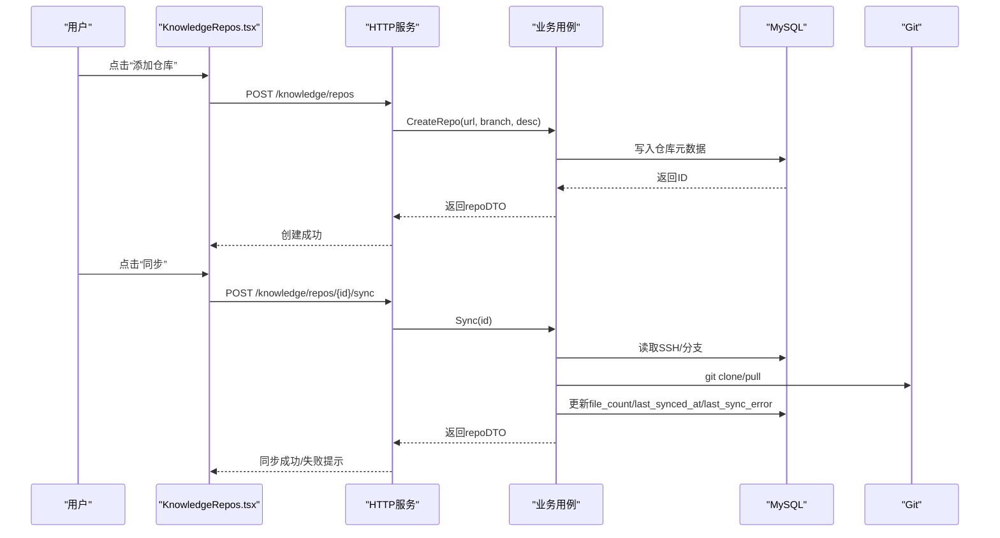
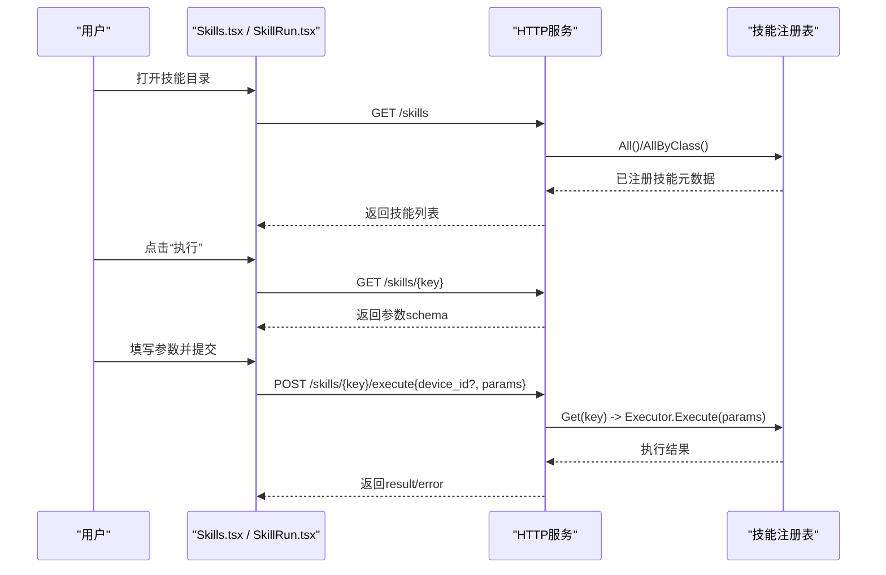
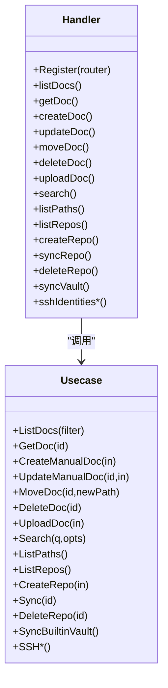
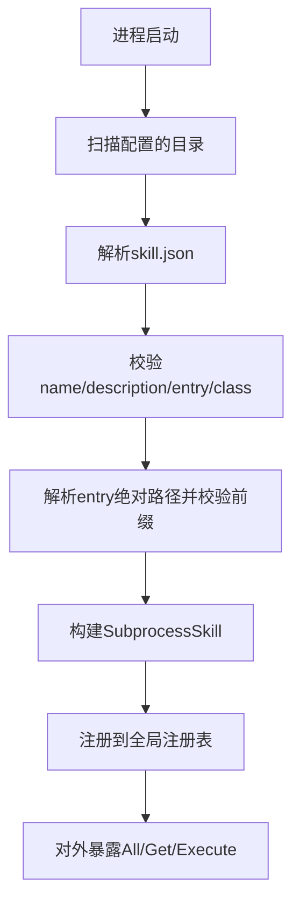
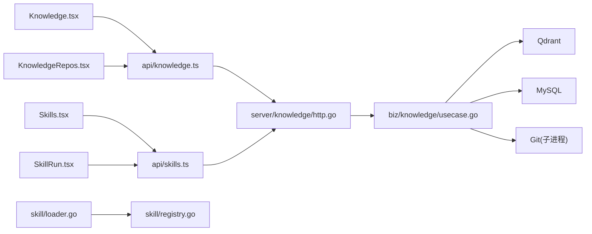

# 知识库页面

<cite>
**本文引用的文件**
- [web/src/pages/Knowledge.tsx](file://web/src/pages/Knowledge.tsx)
- [web/src/pages/KnowledgeRepos.tsx](file://web/src/pages/KnowledgeRepos.tsx)
- [web/src/api/knowledge.ts](file://web/src/api/knowledge.ts)
- [internal/manager/server/knowledge/http.go](file://internal/manager/server/knowledge/http.go)
- [internal/manager/biz/knowledge/usecase.go](file://internal/manager/biz/knowledge/usecase.go)
- [web/src/pages/Skills.tsx](file://web/src/pages/Skills.tsx)
- [web/src/pages/SkillRun.tsx](file://web/src/pages/SkillRun.tsx)
- [web/src/api/skills.ts](file://web/src/api/skills.ts)
- [internal/skill/loader.go](file://internal/skill/loader.go)
- [internal/skill/registry.go](file://internal/skill/registry.go)
</cite>

## 目录
1. [简介](#简介)
2. [项目结构](#项目结构)
3. [核心组件](#核心组件)
4. [架构总览](#架构总览)
5. [详细组件分析](#详细组件分析)
6. [依赖关系分析](#依赖关系分析)
7. [性能考虑](#性能考虑)
8. [故障排查指南](#故障排查指南)
9. [结论](#结论)
10. [附录](#附录)

## 简介
本文件面向开发者与运维人员，系统化梳理“知识库”相关页面的实现与能力，包括：
- 知识管理：文档的创建、编辑、删除、移动、上传、分类与检索。
- 仓库管理：Git 仓库的添加、同步、移除及 SSH 凭证管理。
- 技能库与执行：技能的注册、展示、参数化执行与结果查看。
- 版本管理与协作：内置知识库（平台种子）与组织自有内容的隔离与协同；仓库同步带来的内容更新。
- 自定义集成：如何扩展知识源与开发新技能。

## 项目结构
前端以 React 页面为核心，后端以 HTTP 服务 + 业务用例 + 向量数据库（Qdrant）+ Git 子进程拉取为链路。关键路径如下：
- 前端页面：Knowledge.tsx、KnowledgeRepos.tsx、Skills.tsx、SkillRun.tsx
- 前端 API 封装：knowledge.ts、skills.ts
- 后端路由与服务：server/knowledge/http.go
- 业务逻辑：biz/knowledge/usecase.go
- 技能系统：skill/loader.go、skill/registry.go

图表来源
- [web/src/pages/Knowledge.tsx](file://web/src/pages/Knowledge.tsx)
- [web/src/pages/KnowledgeRepos.tsx](file://web/src/pages/KnowledgeRepos.tsx)
- [web/src/pages/Skills.tsx](file://web/src/pages/Skills.tsx)
- [web/src/pages/SkillRun.tsx](file://web/src/pages/SkillRun.tsx)
- [web/src/api/knowledge.ts](file://web/src/api/knowledge.ts)
- [web/src/api/skills.ts](file://web/src/api/skills.ts)
- [internal/manager/server/knowledge/http.go](file://internal/manager/server/knowledge/http.go)
- [internal/manager/biz/knowledge/usecase.go](file://internal/manager/biz/knowledge/usecase.go)
- [internal/skill/loader.go](file://internal/skill/loader.go)
- [internal/skill/registry.go](file://internal/skill/registry.go)

章节来源
- [web/src/pages/Knowledge.tsx](file://web/src/pages/Knowledge.tsx)
- [web/src/pages/KnowledgeRepos.tsx](file://web/src/pages/KnowledgeRepos.tsx)
- [web/src/api/knowledge.ts](file://web/src/api/knowledge.ts)
- [internal/manager/server/knowledge/http.go](file://internal/manager/server/knowledge/http.go)
- [internal/manager/biz/knowledge/usecase.go](file://internal/manager/biz/knowledge/usecase.go)
- [web/src/pages/Skills.tsx](file://web/src/pages/Skills.tsx)
- [web/src/pages/SkillRun.tsx](file://web/src/pages/SkillRun.tsx)
- [web/src/api/skills.ts](file://web/src/api/skills.ts)
- [internal/skill/loader.go](file://internal/skill/loader.go)
- [internal/skill/registry.go](file://internal/skill/registry.go)

## 核心组件
- 知识库页面（Knowledge.tsx）
  - 双树视图：组织知识库（手动/上传）与内置知识库（平台种子）。
  - 搜索栏：调用语义检索接口，支持按路径前缀过滤。
  - 文档卡片：支持新建、编辑、删除、拖拽移动到目标文件夹。
  - 内置知识库同步：一键从云端或离线内置源同步。
- 代码仓库页面（KnowledgeRepos.tsx）
  - 仓库列表：增删改查、触发同步、显示错误提示与原始输出。
  - SSH 凭证管理：生成密钥对或粘贴私钥，绑定 hosts 模式。
- 技能目录与执行（Skills.tsx / SkillRun.tsx）
  - 技能清单：分组、筛选、详情弹窗、仅 AI 调用标记。
  - 执行页：动态表单、设备选择（host 范围）、结果与历史。
- 后端服务（http.go + usecase.go）
  - 文档 CRUD、上传、移动、搜索、路径统计。
  - 仓库注册、同步（git clone/pull + 解析文本 + 向量化入库）。
  - 内置知识库同步（云端优先，不可达回退离线内置）。
  - SSH 身份管理。
- 技能加载与注册（loader.go + registry.go）
  - 外部技能包通过 skill.json 描述，启动时扫描并注册到全局注册表。

章节来源
- [web/src/pages/Knowledge.tsx](file://web/src/pages/Knowledge.tsx)
- [web/src/pages/KnowledgeRepos.tsx](file://web/src/pages/KnowledgeRepos.tsx)
- [web/src/pages/Skills.tsx](file://web/src/pages/Skills.tsx)
- [web/src/pages/SkillRun.tsx](file://web/src/pages/SkillRun.tsx)
- [web/src/api/knowledge.ts](file://web/src/api/knowledge.ts)
- [web/src/api/skills.ts](file://web/src/api/skills.ts)
- [internal/manager/server/knowledge/http.go](file://internal/manager/server/knowledge/http.go)
- [internal/manager/biz/knowledge/usecase.go](file://internal/manager/biz/knowledge/usecase.go)
- [internal/skill/loader.go](file://internal/skill/loader.go)
- [internal/skill/registry.go](file://internal/skill/registry.go)

## 架构总览
知识库与技能系统的端到端流程如下：

图表来源
- [web/src/pages/Knowledge.tsx](file://web/src/pages/Knowledge.tsx)
- [web/src/pages/KnowledgeRepos.tsx](file://web/src/pages/KnowledgeRepos.tsx)
- [web/src/api/knowledge.ts](file://web/src/api/knowledge.ts)
- [internal/manager/server/knowledge/http.go](file://internal/manager/server/knowledge/http.go)
- [internal/manager/biz/knowledge/usecase.go](file://internal/manager/biz/knowledge/usecase.go)

## 详细组件分析

### 知识库页面（Knowledge.tsx）
- 功能要点
  - 双树视图：组织知识库（manual/upload）与内置知识库（vault），各自独立构建文件夹树。
  - 搜索：支持 path_prefix 精确前缀过滤，命中数展示。
  - 文档操作：新建、编辑、删除、拖拽移动至目标文件夹。
  - 内置同步：一键同步，显示来源（cloud/embedded）与文件数。
- 交互流程
  - 初始化：获取文档列表，计算 counts，渲染左右分区。
  - 搜索：提交 query + pathPrefix，展示命中卡片。
  - 同步内置：调用专用接口，成功后静默刷新。
  - 拖拽移动：将可编辑文档拖入目标文件夹，调用 moveDoc 后刷新。

图表来源
- [web/src/pages/Knowledge.tsx](file://web/src/pages/Knowledge.tsx)
- [web/src/api/knowledge.ts](file://web/src/api/knowledge.ts)

章节来源
- [web/src/pages/Knowledge.tsx](file://web/src/pages/Knowledge.tsx)
- [web/src/api/knowledge.ts](file://web/src/api/knowledge.ts)

### 代码仓库页面（KnowledgeRepos.tsx）
- 功能要点
  - 仓库管理：新增、同步、删除；显示上次同步时间与文件数；失败时提供本地化提示与原始输出。
  - SSH 凭证：支持生成 ed25519 密钥对（推荐）或粘贴现有私钥；hosts 支持通配；记录 last_used_at。
- 交互流程
  - 列表加载：过滤掉平台内置 vault 行。
  - 同步：逐个触发，成功后刷新列表。
  - 删除：二次确认，清理本地 clone 与导入文档。
  - SSH 管理：展开/收起、新增、删除。

图表来源
- [web/src/pages/KnowledgeRepos.tsx](file://web/src/pages/KnowledgeRepos.tsx)
- [web/src/api/knowledge.ts](file://web/src/api/knowledge.ts)
- [internal/manager/server/knowledge/http.go](file://internal/manager/server/knowledge/http.go)
- [internal/manager/biz/knowledge/usecase.go](file://internal/manager/biz/knowledge/usecase.go)

章节来源
- [web/src/pages/KnowledgeRepos.tsx](file://web/src/pages/KnowledgeRepos.tsx)
- [web/src/api/knowledge.ts](file://web/src/api/knowledge.ts)
- [internal/manager/server/knowledge/http.go](file://internal/manager/server/knowledge/http.go)
- [internal/manager/biz/knowledge/usecase.go](file://internal/manager/biz/knowledge/usecase.go)

### 技能目录与执行（Skills.tsx / SkillRun.tsx）
- 技能目录
  - 聚合内置技能与 MCP 工具，统一分组与筛选（运行位置、类别）。
  - 详情弹窗：展示名称、类别、参数表、返回示意；inventory_only 的技能仅 AI 调用。
- 执行页
  - 根据参数 schema 动态渲染表单（string/int/float/bool/duration/enum）。
  - host 范围技能需选择设备；manager 范围无需设备。
  - 执行后展示结果与最近历史。

图表来源
- [web/src/pages/Skills.tsx](file://web/src/pages/Skills.tsx)
- [web/src/pages/SkillRun.tsx](file://web/src/pages/SkillRun.tsx)
- [web/src/api/skills.ts](file://web/src/api/skills.ts)
- [internal/skill/registry.go](file://internal/skill/registry.go)

章节来源
- [web/src/pages/Skills.tsx](file://web/src/pages/Skills.tsx)
- [web/src/pages/SkillRun.tsx](file://web/src/pages/SkillRun.tsx)
- [web/src/api/skills.ts](file://web/src/api/skills.ts)
- [internal/skill/registry.go](file://internal/skill/registry.go)

### 后端服务与业务逻辑（http.go + usecase.go）
- HTTP 层
  - 文档：list/get/create/update/delete/move/upload/search/paths。
  - 仓库：list/create/sync/delete；内置 vault 同步专用端点。
  - SSH 身份：list/create/generate/update/delete。
- 业务层
  - 文档：分块策略、去重（head chunk 优先）、路径前缀严格匹配、标签规范化。
  - 仓库：git clone/pull → 解析 .md/.yaml/.json 等 → 分块嵌入 → Upsert。
  - 内置 vault：云端优先，不可达回退离线内置；审计事件记录。
  - 搜索：嵌入查询向量 → MustMatch 过滤（path/path_prefixes/tags）→ over-fetch 去重 → 返回 top-K。

图表来源
- [internal/manager/server/knowledge/http.go](file://internal/manager/server/knowledge/http.go)
- [internal/manager/biz/knowledge/usecase.go](file://internal/manager/biz/knowledge/usecase.go)

章节来源
- [internal/manager/server/knowledge/http.go](file://internal/manager/server/knowledge/http.go)
- [internal/manager/biz/knowledge/usecase.go](file://internal/manager/biz/knowledge/usecase.go)

### 技能加载与注册（loader.go + registry.go）
- 加载器
  - 扫描指定目录下的 skill.json，校验 name/description/entry/class/category/timeout/env_allow。
  - 安全约束：entry 必须位于允许根目录下，解析符号链接后校验前缀。
  - 构建 SubprocessSkill 并注册到全局注册表。
- 注册表
  - 全局单例，线程安全读写；提供 All/AllByClass/Get 等查询。
  - 重复 Key 或无效元数据会 panic，确保作者期错误尽早暴露。

图表来源
- [internal/skill/loader.go](file://internal/skill/loader.go)
- [internal/skill/registry.go](file://internal/skill/registry.go)

章节来源
- [internal/skill/loader.go](file://internal/skill/loader.go)
- [internal/skill/registry.go](file://internal/skill/registry.go)

## 依赖关系分析
- 前端依赖
  - Knowledge.tsx / KnowledgeRepos.tsx 依赖 api/knowledge.ts 提供的 REST 客户端。
  - Skills.tsx / SkillRun.tsx 依赖 api/skills.ts 提供的技能清单与执行接口。
- 后端依赖
  - server/knowledge/http.go 依赖 biz/knowledge/usecase.go 的业务能力。
  - usecase.go 依赖 Qdrant（向量检索）、MySQL（仓库/SSH 元数据）、Git（子进程拉取）。
- 技能系统
  - loader.go 负责发现与注册，registry.go 提供运行时查询与执行分发。

图表来源
- [web/src/pages/Knowledge.tsx](file://web/src/pages/Knowledge.tsx)
- [web/src/pages/KnowledgeRepos.tsx](file://web/src/pages/KnowledgeRepos.tsx)
- [web/src/pages/Skills.tsx](file://web/src/pages/Skills.tsx)
- [web/src/pages/SkillRun.tsx](file://web/src/pages/SkillRun.tsx)
- [web/src/api/knowledge.ts](file://web/src/api/knowledge.ts)
- [web/src/api/skills.ts](file://web/src/api/skills.ts)
- [internal/manager/server/knowledge/http.go](file://internal/manager/server/knowledge/http.go)
- [internal/manager/biz/knowledge/usecase.go](file://internal/manager/biz/knowledge/usecase.go)
- [internal/skill/loader.go](file://internal/skill/loader.go)
- [internal/skill/registry.go](file://internal/skill/registry.go)

章节来源
- [web/src/pages/Knowledge.tsx](file://web/src/pages/Knowledge.tsx)
- [web/src/pages/KnowledgeRepos.tsx](file://web/src/pages/KnowledgeRepos.tsx)
- [web/src/pages/Skills.tsx](file://web/src/pages/Skills.tsx)
- [web/src/pages/SkillRun.tsx](file://web/src/pages/SkillRun.tsx)
- [web/src/api/knowledge.ts](file://web/src/api/knowledge.ts)
- [web/src/api/skills.ts](file://web/src/api/skills.ts)
- [internal/manager/server/knowledge/http.go](file://internal/manager/server/knowledge/http.go)
- [internal/manager/biz/knowledge/usecase.go](file://internal/manager/biz/knowledge/usecase.go)
- [internal/skill/loader.go](file://internal/skill/loader.go)
- [internal/skill/registry.go](file://internal/skill/registry.go)

## 性能考虑
- 向量检索
  - 搜索采用 over-fetch 再在前端/后端去重，避免长文档多片段抢占 Top-K。
  - 使用 keyword 类型 payload 索引（source_type/repo_id/path/path_prefixes/tags）提升过滤效率。
- 列表与分页
  - ListDocs 使用 Scroll 并放大 scanLimit，保证去重后仍满足 limit。
- 上传与分块
  - 上传文件限制大小，分块批量嵌入与 Upsert，减少单次开销。
- 仓库同步
  - 增量 pull + 遍历受控文件类型，限制每仓库文件数量上限，控制索引成本。

[本节为通用指导，不直接分析具体文件]

## 故障排查指南
- 搜索无结果
  - 检查是否启用了 path_prefix 过滤导致范围过窄。
  - 确认 embedder 已配置且 Qdrant 集合存在。
- 内置知识库同步失败
  - 观察返回 source 字段（cloud/embedded），确认网络连通性。
  - 查看 UI 中的错误提示与最后同步时间。
- 仓库同步失败
  - 查看“原始输出”，结合本地化提示定位 SSH 认证、DNS、限流等问题。
  - 确认 SSH 凭证 hosts 模式与目标仓库一致。
- 技能执行失败
  - 检查参数必填项与类型；host 范围技能需选择设备。
  - 查看最近执行历史中的 error 信息。

章节来源
- [web/src/pages/Knowledge.tsx](file://web/src/pages/Knowledge.tsx)
- [web/src/pages/KnowledgeRepos.tsx](file://web/src/pages/KnowledgeRepos.tsx)
- [web/src/pages/SkillRun.tsx](file://web/src/pages/SkillRun.tsx)
- [internal/manager/server/knowledge/http.go](file://internal/manager/server/knowledge/http.go)
- [internal/manager/biz/knowledge/usecase.go](file://internal/manager/biz/knowledge/usecase.go)

## 结论
知识库与技能系统通过前后端分层清晰、职责明确的设计，实现了：
- 知识的多源汇聚（手动/上传/Git/内置）与高效检索。
- 仓库与凭证的安全管理与可视化排障。
- 技能的统一注册、展示与参数化执行。
- 良好的可扩展性与安全性（路径白名单、权限中间件、审计事件）。

[本节为总结，不直接分析具体文件]

## 附录

### 知识检索机制说明
- 关键词与语义混合：query 经 Embedder 转为向量，与 Qdrant 中存储的文档片段进行相似度匹配。
- 过滤条件：path（精确）、path_prefixes（严格前缀数组）、tags（包含匹配）。
- 去重策略：按 parent_url/url/id 去重，保留最高分片段，保证每个逻辑文档只出现一次。

章节来源
- [internal/manager/biz/knowledge/usecase.go](file://internal/manager/biz/knowledge/usecase.go)
- [web/src/api/knowledge.ts](file://web/src/api/knowledge.ts)

### 技能开发与集成指南
- 外部技能包
  - 在允许目录放置 skill.json，声明 name/description/schema/entry/class/category/timeout/env_allow。
  - entry 必须位于允许根目录下，解析符号链接后校验前缀。
  - 启动时自动扫描并注册，可通过 /skills 与 /skills/{key}/execute 访问。
- 内建技能
  - 通过 Go 代码注册到全局注册表，遵循相同元数据规范。
- 调试建议
  - 使用日志输出（Loader 的 Logger 回调）确认加载情况。
  - 通过注册表的 All/AllByClass 验证可见性与分类。

章节来源
- [internal/skill/loader.go](file://internal/skill/loader.go)
- [internal/skill/registry.go](file://internal/skill/registry.go)
- [web/src/api/skills.ts](file://web/src/api/skills.ts)