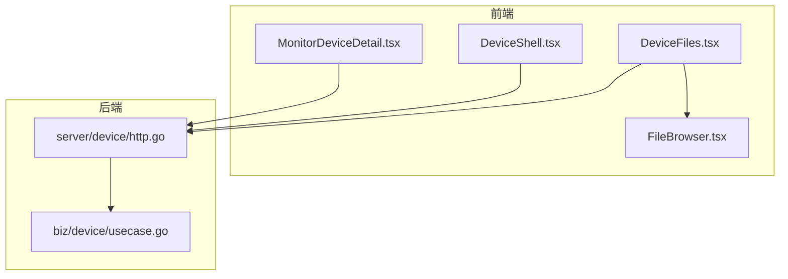
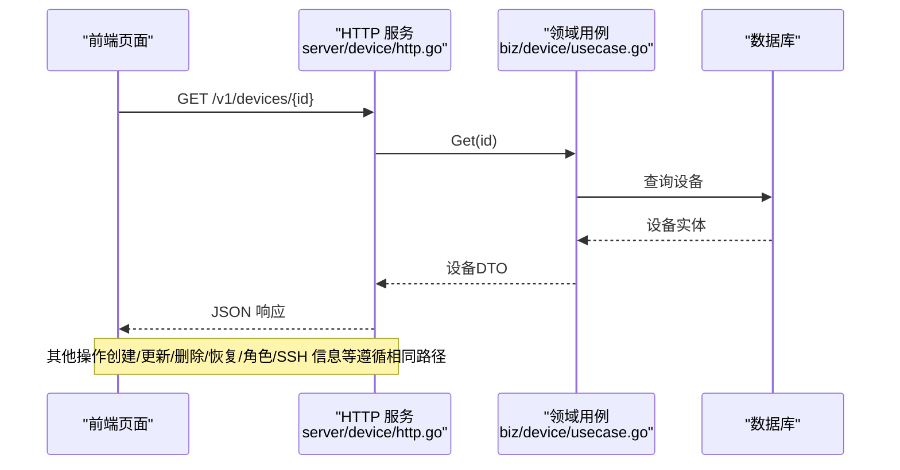
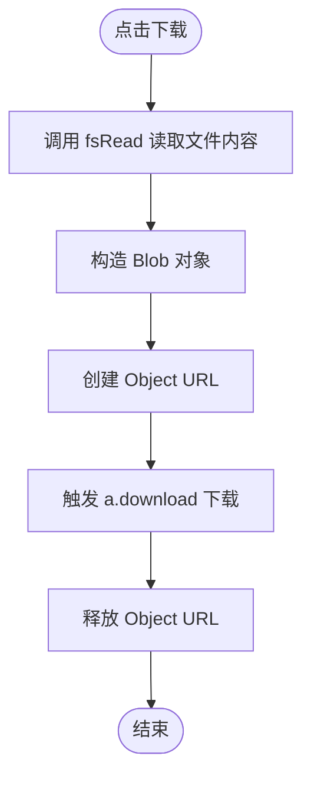
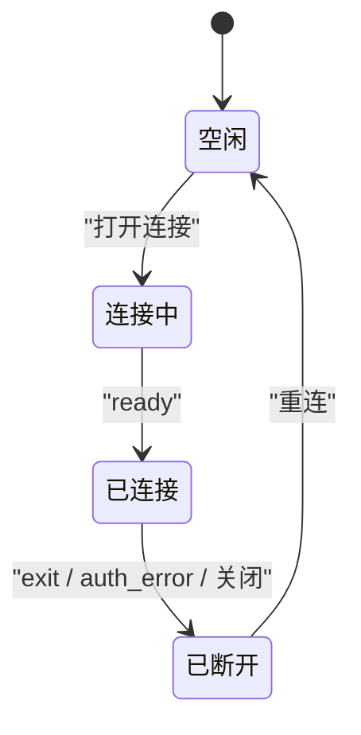
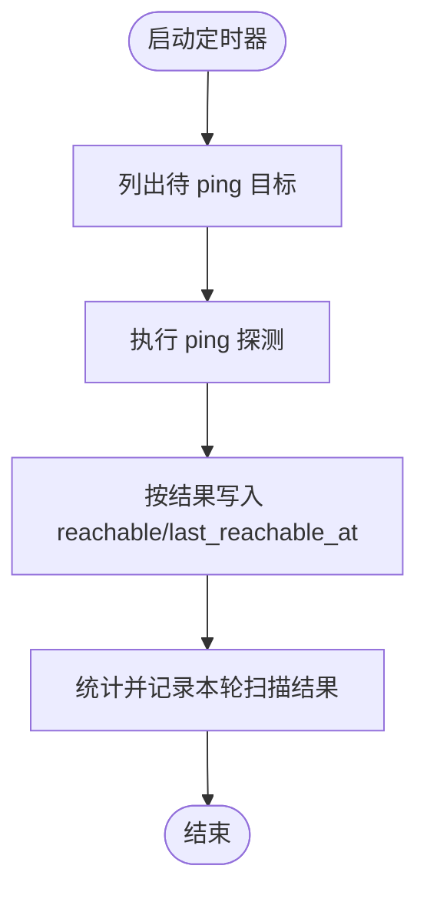
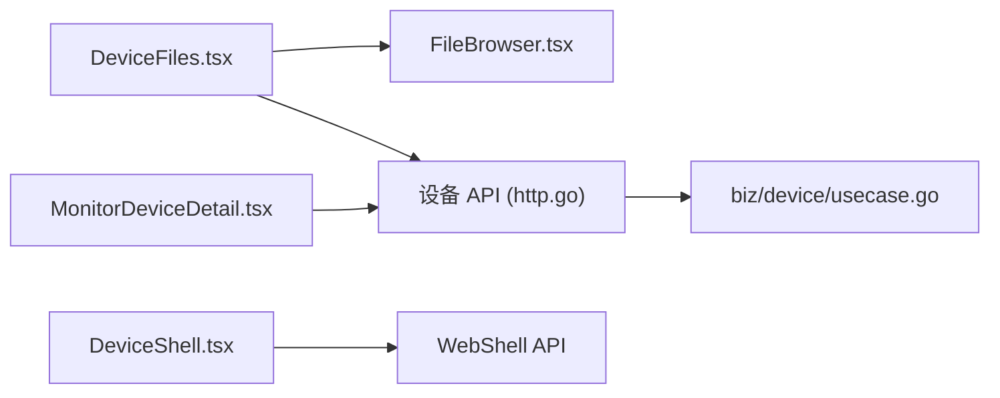

# 设备管理页面

<cite>
**本文引用的文件**
- [DeviceFiles.tsx](file://web/src/pages/DeviceFiles.tsx)
- [FileBrowser.tsx](file://web/src/components/FileBrowser.tsx)
- [DeviceShell.tsx](file://web/src/pages/DeviceShell.tsx)
- [MonitorDeviceDetail.tsx](file://web/src/pages/MonitorDeviceDetail.tsx)
- [usecase.go](file://internal/manager/biz/device/usecase.go)
- [http.go](file://internal/manager/server/device/http.go)
</cite>

## 目录
1. [简介](#简介)
2. [项目结构](#项目结构)
3. [核心组件](#核心组件)
4. [架构总览](#架构总览)
5. [详细组件分析](#详细组件分析)
6. [依赖关系分析](#依赖关系分析)
7. [性能考虑](#性能考虑)
8. [故障排查指南](#故障排查指南)
9. [结论](#结论)
10. [附录：API 集成与使用指南](#附录api-集成与使用指南)

## 简介
本文件面向开发者，系统化梳理“设备管理”相关页面的实现与交互，包括：
- 边缘设备详情（监控视角）
- 设备文件管理（SFTP 风格浏览、上传、编辑、下载）
- 远程 Shell（WebSSH，实时通信、权限控制、会话生命周期）
- 事件/状态监控（在线/可达性、心跳时间等）
- 审计日志记录机制（连接成功/失败、关闭等）
- 面向开发者的设备管理 API 集成与使用建议

文档同时提供架构图、时序图与流程图，帮助快速理解前后端协作与安全策略。

## 项目结构
围绕设备管理的页面与后端能力主要分布在以下位置：
- 前端页面与组件
  - web/src/pages/DeviceFiles.tsx：设备文件页入口
  - web/src/components/FileBrowser.tsx：文件浏览器组件
  - web/src/pages/DeviceShell.tsx：WebSSH 终端页
  - web/src/pages/MonitorDeviceDetail.tsx：监控设备详情页（指标/探针/元数据）
- 后端业务与接口
  - internal/manager/biz/device/usecase.go：设备领域用例（创建、更新、可达性、SSH 凭据、软删除/恢复等）
  - internal/manager/server/device/http.go：设备 HTTP 路由与 DTO 映射（列表、详情、角色、SSH 信息、软删除/恢复等）

图表来源
- [DeviceFiles.tsx:1-111](file://web/src/pages/DeviceFiles.tsx#L1-L111)
- [FileBrowser.tsx:1-678](file://web/src/components/FileBrowser.tsx#L1-L678)
- [DeviceShell.tsx:1-723](file://web/src/pages/DeviceShell.tsx#L1-L723)
- [MonitorDeviceDetail.tsx:1-306](file://web/src/pages/MonitorDeviceDetail.tsx#L1-L306)
- [http.go:1-658](file://internal/manager/server/device/http.go#L1-L658)
- [usecase.go:1-524](file://internal/manager/biz/device/usecase.go#L1-L524)

章节来源
- [DeviceFiles.tsx:1-111](file://web/src/pages/DeviceFiles.tsx#L1-L111)
- [FileBrowser.tsx:1-678](file://web/src/components/FileBrowser.tsx#L1-L678)
- [DeviceShell.tsx:1-723](file://web/src/pages/DeviceShell.tsx#L1-L723)
- [MonitorDeviceDetail.tsx:1-306](file://web/src/pages/MonitorDeviceDetail.tsx#L1-L306)
- [http.go:1-658](file://internal/manager/server/device/http.go#L1-L658)
- [usecase.go:1-524](file://internal/manager/biz/device/usecase.go#L1-L524)

## 核心组件
- 设备文件页（DeviceFiles.tsx）
  - 负责加载设备基本信息并渲染 FileBrowser 组件，支持返回主机详情与显示在线状态。
- 文件浏览器（FileBrowser.tsx）
  - 通过设备侧 SFTP 代理完成文件浏览、上传、新建文件夹、重命名、chmod、剪切/粘贴、删除、查看/编辑文本文件、下载等操作；所有操作均经过认证通道。
- WebShell 终端（DeviceShell.tsx）
  - 基于 WebSocket 的 WebSSH 终端，支持直连或隧道模式；具备预检、错误提示、会话生命周期管理与审计友好型关闭。
- 监控设备详情（MonitorDeviceDetail.tsx）
  - 展示设备的指标、探针与元数据，提供与主机详情的双向跳转，便于区分“主机视角”和“监控视角”。

章节来源
- [DeviceFiles.tsx:1-111](file://web/src/pages/DeviceFiles.tsx#L1-L111)
- [FileBrowser.tsx:1-678](file://web/src/components/FileBrowser.tsx#L1-L678)
- [DeviceShell.tsx:1-723](file://web/src/pages/DeviceShell.tsx#L1-L723)
- [MonitorDeviceDetail.tsx:1-306](file://web/src/pages/MonitorDeviceDetail.tsx#L1-L306)

## 架构总览
设备管理页面采用“前端页面 + 可复用组件 + 后端 HTTP 服务 + 领域用例”的分层结构。前端通过 REST 与 WebSocket 与后端交互；后端将请求委派给领域用例，由用例协调持久化与外部探测（如 ping）。

图表来源
- [http.go:1-658](file://internal/manager/server/device/http.go#L1-L658)
- [usecase.go:1-524](file://internal/manager/biz/device/usecase.go#L1-L524)

## 详细组件分析

### 设备文件管理（DeviceFiles + FileBrowser）
- 功能要点
  - 页面级 DeviceFiles.tsx 负责获取设备信息并承载 FileBrowser 组件。
  - FileBrowser.tsx 提供完整的文件树导航与常用操作（上传、新建、重命名、chmod、剪切/粘贴、删除、查看/编辑、下载）。
  - 下载通过认证后的读取接口生成 Blob 触发下载，避免绕过鉴权。
- 安全机制
  - 所有文件操作均通过已认证的 API 调用，不依赖浏览器原生下载行为。
  - 敏感操作（删除、chmod）需二次确认或输入校验。
- 用户体验
  - 面包屑导航、批量上传、空目录/加载中状态、错误提示。
- 关键流程（下载）

图表来源
- [DeviceFiles.tsx:1-111](file://web/src/pages/DeviceFiles.tsx#L1-L111)
- [FileBrowser.tsx:1-678](file://web/src/components/FileBrowser.tsx#L1-L678)

章节来源
- [DeviceFiles.tsx:1-111](file://web/src/pages/DeviceFiles.tsx#L1-L111)
- [FileBrowser.tsx:1-678](file://web/src/components/FileBrowser.tsx#L1-L678)

### 远程 Shell（DeviceShell）
- 功能要点
  - 支持两种传输模式：tunnel（默认）与 direct（直连），由路由后缀决定。
  - 连接前进行 HTTP 预检，将 429/503/403/401/404 等状态转换为中文提示。
  - 密码仅存在于内存中，不持久化；可选记住用户名（本地存储）。
  - 会话关闭时发送 close 控制帧，便于服务端及时清理资源并完善审计。
- 权限控制
  - 只读账号无法进入终端；页面在渲染前即拦截。
- 实时通信
  - 使用 WebSocket 建立会话，二进制帧用于 stdout/stderr，JSON 控制帧用于 ready/auth_error/exit 等。
- 会话生命周期

图表来源
- [DeviceShell.tsx:1-723](file://web/src/pages/DeviceShell.tsx#L1-L723)

章节来源
- [DeviceShell.tsx:1-723](file://web/src/pages/DeviceShell.tsx#L1-L723)

### 监控设备详情（MonitorDeviceDetail）
- 功能要点
  - 独立于主机详情的“监控视角”，包含指标、探针、元数据三个标签页。
  - 头部展示设备名、在线/可达状态、角色、最后心跳时间等。
  - 与主机详情页面提供双向跳转，明确语义边界。
- 数据来源
  - 通过设备 API 拉取设备信息，并在探针变更后刷新以保持一致性。

章节来源
- [MonitorDeviceDetail.tsx:1-306](file://web/src/pages/MonitorDeviceDetail.tsx#L1-L306)

### 设备生命周期与状态监控（后端用例）
- 生命周期
  - 创建：管理员注册逻辑主机与 SSH 凭据，生成唯一指纹，记录创建者。
  - 更新：支持更新名称/描述/主机名与 SSH 连接块（合并语义，避免误清空）。
  - 软删除/恢复：默认软删除，支持恢复；硬删除不可恢复。
  - 关联：维护 edge ↔ device 的 host 类型关联。
- 状态监控
  - 在线：由 edge 上报驱动。
  - 可达性：定时 ping 任务扫描有 ssh_host 的设备，回填 reachable 与 last_reachable_at。
  - SSH 交互结果：成功/失败分别记录最近一次成功时间与错误信息。
- 关键流程（可达性巡检）

图表来源
- [usecase.go:1-524](file://internal/manager/biz/device/usecase.go#L1-L524)

章节来源
- [usecase.go:1-524](file://internal/manager/biz/device/usecase.go#L1-L524)

### 设备管理 API（HTTP 路由与 DTO）
- 路由概览
  - POST /v1/devices：创建设备（管理员）
  - GET /v1/devices：列表（支持过滤、分页、是否包含已删除）
  - GET /v1/devices/{id}：详情
  - PATCH /v1/devices/{id}：更新名称/描述/主机名与 SSH 连接块（合并语义）
  - PATCH /v1/devices/{id}/roles：更新角色位集
  - DELETE /v1/devices/{id}?hard=true：软删除（默认）/硬删除
  - POST /v1/devices/{id}/restore：恢复软删除
  - GET /v1/devices/{id}/edges：设备关联的 edge 列表
  - PUT /v1/devices/{id}/ssh-credentials：设置 SSH 凭据（管理员）
  - GET /v1/devices/{id}/ssh-info：获取 SSH 信息（含 agent 可达性）
  - DELETE /v1/devices/{id}/ssh-credentials：清除 SSH 凭据（管理员）
- 权限控制
  - 写操作要求管理员角色；读操作仅需已认证用户。
- DTO 设计
  - 列表项包含基础信息、CPU/内存/磁盘用量百分比、角色、在线/可达状态、SSH 上下文字段、拓扑节点 ID 等。
  - 更新请求体为可选字段集合，未提供的字段不会覆盖现有值。

章节来源
- [http.go:1-658](file://internal/manager/server/device/http.go#L1-L658)

## 依赖关系分析
- 前端到后端
  - DeviceFiles.tsx → FileBrowser.tsx：页面承载组件
  - DeviceFiles.tsx → 设备 API：获取设备信息
  - DeviceShell.tsx → WebShell API：预检与 WebSocket 连接
  - MonitorDeviceDetail.tsx → 设备 API：获取设备信息与刷新
- 后端分层
  - server/device/http.go：HTTP 路由与 DTO 映射，鉴权中间件
  - biz/device/usecase.go：领域用例（创建/更新/删除/恢复/角色/SSH/可达性/TouchSSH*）
  - data/store/*：持久化（不在本文重点展开）
- 耦合与内聚
  - 页面职责单一，组件可复用；HTTP 层薄封装，领域逻辑集中在 usecase，利于扩展与维护。

图表来源
- [DeviceFiles.tsx:1-111](file://web/src/pages/DeviceFiles.tsx#L1-L111)
- [FileBrowser.tsx:1-678](file://web/src/components/FileBrowser.tsx#L1-L678)
- [DeviceShell.tsx:1-723](file://web/src/pages/DeviceShell.tsx#L1-L723)
- [MonitorDeviceDetail.tsx:1-306](file://web/src/pages/MonitorDeviceDetail.tsx#L1-L306)
- [http.go:1-658](file://internal/manager/server/device/http.go#L1-L658)
- [usecase.go:1-524](file://internal/manager/biz/device/usecase.go#L1-L524)

## 性能考虑
- 文件浏览
  - 列表按需加载，避免一次性拉取大量条目；大文件下载通过流式读取与 Blob 处理，减少内存峰值。
- WebShell
  - 预检优先，避免无意义的 WebSocket 升级；resize 事件仅在窗口变化时发送，降低带宽占用。
- 设备列表与详情
  - 支持分页与过滤参数，减少不必要的数据传输；软删除行默认隐藏，可按需开启。

## 故障排查指南
- WebShell 连接异常
  - 现象：WebSocket 异常断开（code=1006）
  - 处理：页面会发起后诊断预检，若返回 429/503/403/401/404 等，会在终端中以中文提示；必要时引导用户重试或检查权限与会话上限。
- 文件操作失败
  - 现象：上传/删除/重命名/读写报错
  - 处理：组件统一捕获错误并以红色提示条展示；请检查网络、权限与路径合法性。
- 设备状态不一致
  - 现象：在线但不可达，或反之
  - 处理：关注 reachable 与 last_reachable_at 字段；等待下一轮 ping 周期或手动刷新。

章节来源
- [DeviceShell.tsx:1-723](file://web/src/pages/DeviceShell.tsx#L1-L723)
- [FileBrowser.tsx:1-678](file://web/src/components/FileBrowser.tsx#L1-L678)
- [usecase.go:1-524](file://internal/manager/biz/device/usecase.go#L1-L524)

## 结论
设备管理页面通过清晰的前后端分层与严格的权限控制，实现了安全的文件管理、可靠的远程 Shell 以及直观的设备监控视图。结合可达性巡检与 SSH 交互结果记录，运维人员可高效掌握设备生命周期与健康状况。后续可在审计日志聚合、细粒度权限与速率限制方面持续增强。

## 附录：API 集成与使用指南
- 通用约定
  - 认证：所有接口需在请求头携带有效令牌；写操作需要管理员角色。
  - 错误格式：统一返回 { error, code }，常见 code 包括 unauthorized/forbidden/invalid/not-found/internal 等。
- 常用接口
  - 创建设备（POST /v1/devices）
    - 请求体关键字段：name、ssh_host、ssh_user、ssh_auth_kind（password/key）、ssh_password 或 ssh_key
    - 响应体包含 id、name、hostname、description、ssh_* 字段与 created_at
  - 获取设备（GET /v1/devices/{id}）
    - 返回设备完整 DTO，包含 CPU/内存/磁盘用量、角色、在线/可达状态、SSH 上下文等
  - 更新设备（PATCH /v1/devices/{id}）
    - 支持 name/description/hostname 与 ssh_* 字段的合并更新；未提供的字段不会覆盖现有值
  - 更新角色（PATCH /v1/devices/{id}/roles）
    - 请求体 roles 数组，仅允许合法枚举值
  - 软删除/恢复（DELETE /v1/devices/{id}?hard=true | POST /v1/devices/{id}/restore）
    - 默认软删除，可通过 restore 恢复；hard=true 为物理删除
  - 获取关联 Edge（GET /v1/devices/{id}/edges）
    - 返回该设备关联的 edge 列表（type=host/discovered）
  - SSH 凭据（PUT/DELETE /v1/devices/{id}/ssh-credentials）
    - 管理员可设置或清除凭据；注意 password/key 明文回显是内部运维契约
  - SSH 信息（GET /v1/devices/{id}/ssh-info）
    - 返回 SSH 上下文与 agent 可达性，供前端展示与决策
- 集成建议
  - 列表页：支持按 hostname/name/roles/online 过滤与分页；根据 include_deleted 决定是否显示已删除行。
  - 详情页：结合 reachable 与 last_reachable_at 展示“可达性”状态，与 online 区分。
  - 文件管理：始终通过认证后的 API 进行文件操作；下载走 fsRead + Blob 方式，避免绕过鉴权。
  - WebShell：先做预检再建 WebSocket；在 beforeunload 时发送 close 控制帧，确保审计闭环。

章节来源
- [http.go:1-658](file://internal/manager/server/device/http.go#L1-L658)
- [usecase.go:1-524](file://internal/manager/biz/device/usecase.go#L1-L524)
- [DeviceFiles.tsx:1-111](file://web/src/pages/DeviceFiles.tsx#L1-L111)
- [FileBrowser.tsx:1-678](file://web/src/components/FileBrowser.tsx#L1-L678)
- [DeviceShell.tsx:1-723](file://web/src/pages/DeviceShell.tsx#L1-L723)