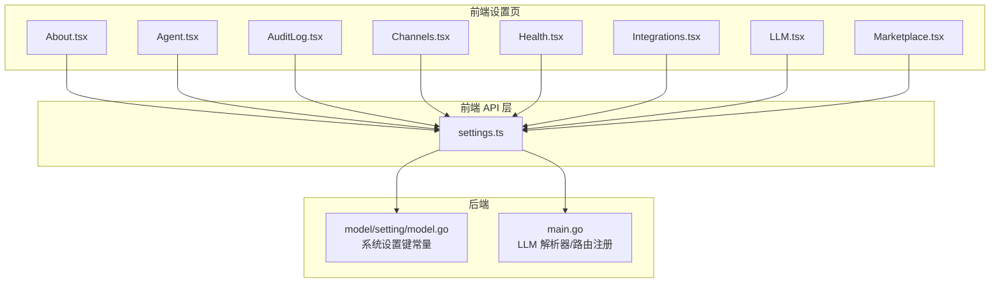
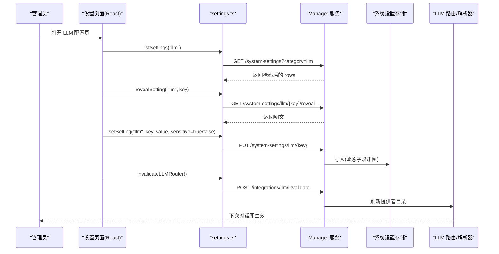
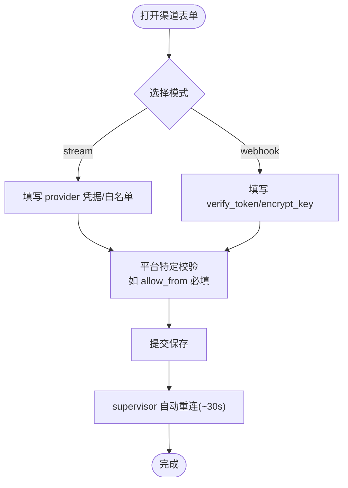
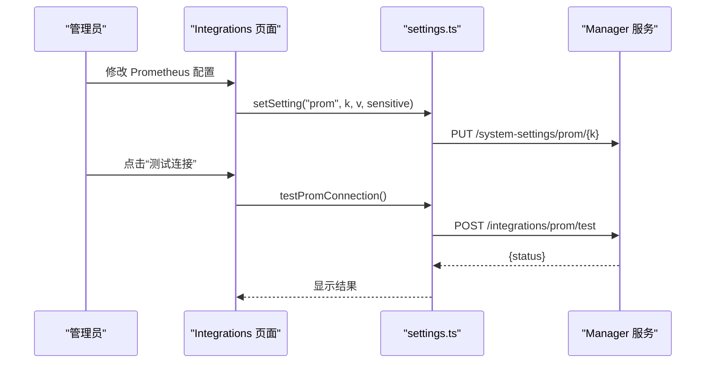
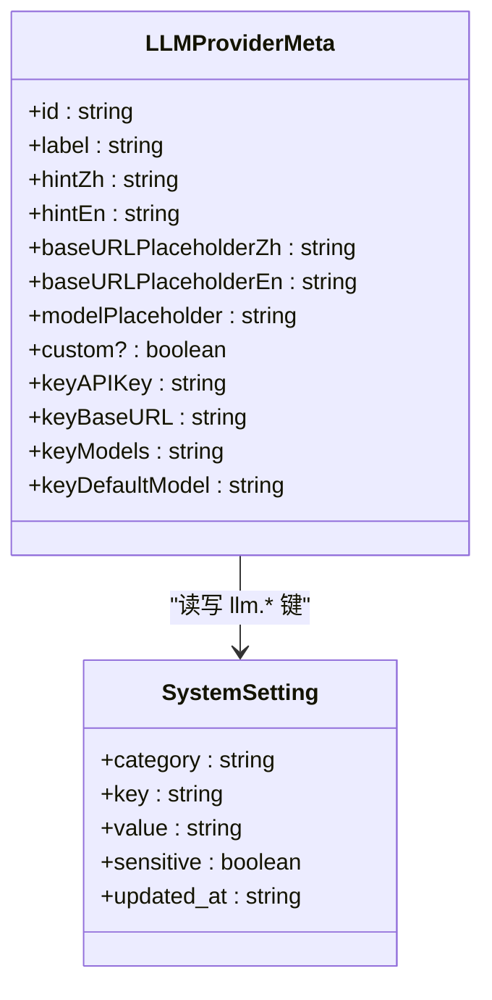
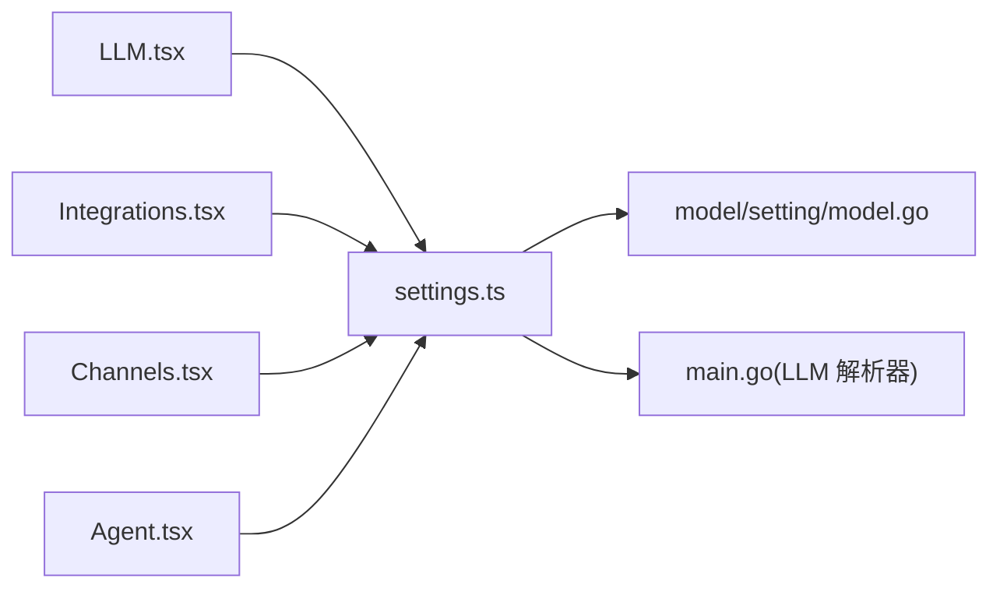

# 设置管理页面

<cite>
**本文引用的文件**   
- [web/src/pages/settings/About.tsx](file://web/src/pages/settings/About.tsx)
- [web/src/pages/settings/Agent.tsx](file://web/src/pages/settings/Agent.tsx)
- [web/src/pages/settings/AuditLog.tsx](file://web/src/pages/settings/AuditLog.tsx)
- [web/src/pages/settings/Channels.tsx](file://web/src/pages/settings/Channels.tsx)
- [web/src/pages/settings/Health.tsx](file://web/src/pages/settings/Health.tsx)
- [web/src/pages/settings/Integrations.tsx](file://web/src/pages/settings/Integrations.tsx)
- [web/src/pages/settings/LLM.tsx](file://web/src/pages/settings/LLM.tsx)
- [web/src/pages/settings/Marketplace.tsx](file://web/src/pages/settings/Marketplace.tsx)
- [web/src/api/settings.ts](file://web/src/api/settings.ts)
- [internal/manager/model/setting/model.go](file://internal/manager/model/setting/model.go)
- [cmd/ongrid/main.go](file://cmd/ongrid/main.go)
</cite>

## 目录
1. [简介](#简介)
2. [项目结构](#项目结构)
3. [核心组件](#核心组件)
4. [架构总览](#架构总览)
5. [详细组件分析](#详细组件分析)
6. [依赖关系分析](#依赖关系分析)
7. [性能与生效机制](#性能与生效机制)
8. [故障排查指南](#故障排查指南)
9. [结论](#结论)
10. [附录：扩展开发指南](#附录扩展开发指南)

## 简介
本文件面向开发者与运维人员，系统化梳理“设置管理”相关的前端页面及其后端交互，覆盖系统信息、代理与集成配置（Prometheus/Grafana/Loki/Tempo）、用户与组织（通过审计日志间接体现）、密钥管理（渠道凭证与 LLM Key）、LLM 多模型配置等。文档重点说明：
- 各项配置的验证规则与生效机制
- 敏感信息的加密存储与安全访问控制
- 变更的审计追踪与回滚能力
- 多租户权限隔离的实现要点
- 自定义配置项的扩展开发指南

## 项目结构
设置管理页面集中在 web/src/pages/settings 下，按功能拆分为多个独立页面；API 调用统一封装在 web/src/api/settings.ts。后端对系统设置的键空间定义位于 internal/manager/model/setting/model.go，并在启动时注入默认值与解析器（cmd/ongrid/main.go）。

图表来源
- [web/src/pages/settings/About.tsx:1-90](file://web/src/pages/settings/About.tsx#L1-L90)
- [web/src/pages/settings/Agent.tsx:1-133](file://web/src/pages/settings/Agent.tsx#L1-L133)
- [web/src/pages/settings/AuditLog.tsx:1-343](file://web/src/pages/settings/AuditLog.tsx#L1-L343)
- [web/src/pages/settings/Channels.tsx:1-648](file://web/src/pages/settings/Channels.tsx#L1-L648)
- [web/src/pages/settings/Health.tsx:1-388](file://web/src/pages/settings/Health.tsx#L1-L388)
- [web/src/pages/settings/Integrations.tsx:1-800](file://web/src/pages/settings/Integrations.tsx#L1-L800)
- [web/src/pages/settings/LLM.tsx:1-553](file://web/src/pages/settings/LLM.tsx#L1-L553)
- [web/src/pages/settings/Marketplace.tsx:1-800](file://web/src/pages/settings/Marketplace.tsx#L1-L800)
- [web/src/api/settings.ts:1-116](file://web/src/api/settings.ts#L1-L116)
- [internal/manager/model/setting/model.go:62-120](file://internal/manager/model/setting/model.go#L62-L120)
- [cmd/ongrid/main.go:672-720](file://cmd/ongrid/main.go#L672-L720)

章节来源
- [web/src/pages/settings/About.tsx:1-90](file://web/src/pages/settings/About.tsx#L1-L90)
- [web/src/pages/settings/Agent.tsx:1-133](file://web/src/pages/settings/Agent.tsx#L1-L133)
- [web/src/pages/settings/AuditLog.tsx:1-343](file://web/src/pages/settings/AuditLog.tsx#L1-L343)
- [web/src/pages/settings/Channels.tsx:1-648](file://web/src/pages/settings/Channels.tsx#L1-L648)
- [web/src/pages/settings/Health.tsx:1-388](file://web/src/pages/settings/Health.tsx#L1-L388)
- [web/src/pages/settings/Integrations.tsx:1-800](file://web/src/pages/settings/Integrations.tsx#L1-L800)
- [web/src/pages/settings/LLM.tsx:1-553](file://web/src/pages/settings/LLM.tsx#L1-L553)
- [web/src/pages/settings/Marketplace.tsx:1-800](file://web/src/pages/settings/Marketplace.tsx#L1-L800)
- [web/src/api/settings.ts:1-116](file://web/src/api/settings.ts#L1-L116)
- [internal/manager/model/setting/model.go:62-120](file://internal/manager/model/setting/model.go#L62-L120)
- [cmd/ongrid/main.go:672-720](file://cmd/ongrid/main.go#L672-L720)

## 核心组件
- 通用系统设置 API
  - 列表/更新/删除：GET /system-settings, PUT /system-settings/{category}/{key}, DELETE /system-settings/{category}/{key}
  - 明文揭示：GET /system-settings/{category}/{key}/reveal（仅管理员）
  - 连接测试与同步：/integrations/{grafana|prom|loki|tempo|websearch}/test，/integrations/grafana/sync，/integrations/llm/invalidate
- 页面职责
  - About：展示版本、源码、许可证
  - Agent：开关“允许写操作”（agent/write_enabled）
  - AuditLog：审计日志查看（admin-only）
  - Channels：双向 IM 渠道（飞书/钉钉/Telegram/Slack）CRUD
  - Health：系统健康检查报告
  - Integrations：Prometheus/Grafana/Loki/Tempo/WebSearch 集成配置
  - LLM：多提供商模型配置（OpenAI/Anthropic/Zhipu/Gemini/DeepSeek/Kimi/Custom）
  - Marketplace：技能包安装/卸载与回滚

章节来源
- [web/src/api/settings.ts:1-116](file://web/src/api/settings.ts#L1-L116)
- [web/src/pages/settings/About.tsx:1-90](file://web/src/pages/settings/About.tsx#L1-L90)
- [web/src/pages/settings/Agent.tsx:1-133](file://web/src/pages/settings/Agent.tsx#L1-L133)
- [web/src/pages/settings/AuditLog.tsx:1-343](file://web/src/pages/settings/AuditLog.tsx#L1-L343)
- [web/src/pages/settings/Channels.tsx:1-648](file://web/src/pages/settings/Channels.tsx#L1-L648)
- [web/src/pages/settings/Health.tsx:1-388](file://web/src/pages/settings/Health.tsx#L1-L388)
- [web/src/pages/settings/Integrations.tsx:1-800](file://web/src/pages/settings/Integrations.tsx#L1-L800)
- [web/src/pages/settings/LLM.tsx:1-553](file://web/src/pages/settings/LLM.tsx#L1-L553)
- [web/src/pages/settings/Marketplace.tsx:1-800](file://web/src/pages/settings/Marketplace.tsx#L1-L800)

## 架构总览
设置管理前后端交互遵循“分类+键值”的系统设置模型，敏感字段通过 reveal 接口单独获取明文，保存时标记 sensitive=true 以触发服务端加密存储。LLM 配置通过运行时解析器读取 system_settings.llm.* 并注入到 LLM 路由，支持即时失效缓存。

图表来源
- [web/src/pages/settings/LLM.tsx:1-553](file://web/src/pages/settings/LLM.tsx#L1-L553)
- [web/src/api/settings.ts:1-116](file://web/src/api/settings.ts#L1-L116)
- [internal/manager/model/setting/model.go:62-120](file://internal/manager/model/setting/model.go#L62-L120)
- [cmd/ongrid/main.go:672-720](file://cmd/ongrid/main.go#L672-L720)

## 详细组件分析

### 关于与系统信息（About）
- 功能：展示产品标识、当前版本、源码仓库与许可证链接
- 数据来源：调用版本接口动态获取 manager_version
- 安全：只读展示，不涉及敏感数据

章节来源
- [web/src/pages/settings/About.tsx:1-90](file://web/src/pages/settings/About.tsx#L1-L90)

### 代理与写操作权限（Agent）
- 功能：控制 AI 助理是否可执行写入/变更/执行类动作
- 配置项：category=agent, key=write_enabled（布尔字符串）
- 生效机制：保存后立即对新会话轮次生效，无需重启
- 风险提示：开启后主机命令工具将绕过命令沙箱策略

章节来源
- [web/src/pages/settings/Agent.tsx:1-133](file://web/src/pages/settings/Agent.tsx#L1-L133)

### 审计日志（AuditLog）
- 功能：管理员查看全量审计记录，支持按用户、action、资源类型、状态筛选
- 权限：仅 admin 可见
- 行为：append-only，保留期约 180 天
- 关联：setting_update/setting_delete 等行为会被记录

章节来源
- [web/src/pages/settings/AuditLog.tsx:1-343](file://web/src/pages/settings/AuditLog.tsx#L1-L343)

### 渠道管理（Channels）
- 功能：配置飞书/钉钉/Telegram/Slack 机器人，支持 stream/webhook 模式
- 关键校验
  - Telegram/Slack 必须填写 allow_from 白名单
  - Slack 需要 app_token 与 bot_token（JSON 序列化存储）
  - webhook 模式需配置 verify_token/encrypt_key（飞书）
- 安全：app_secret 通过 reveal 明文显示，编辑时留空表示不覆盖
- 生效：保存后 ~30s 内 supervisor 自动重连

图表来源
- [web/src/pages/settings/Channels.tsx:1-648](file://web/src/pages/settings/Channels.tsx#L1-L648)

章节来源
- [web/src/pages/settings/Channels.tsx:1-648](file://web/src/pages/settings/Channels.tsx#L1-L648)

### 系统健康（Health）
- 功能：一键运行健康检查，分组展示核心服务、可观测性、数据组件、自动化、边缘接入、AI 能力等
- 输出：每项检查包含状态、耗时、详情与诊断信息
- 用途：快速定位异常与配置问题

章节来源
- [web/src/pages/settings/Health.tsx:1-388](file://web/src/pages/settings/Health.tsx#L1-L388)

### 集成配置（Integrations）
- Prometheus
  - 字段：query_url、remote_write_url、bearer_token、basic_user、basic_password
  - 敏感字段：bearer_token、basic_password（type=password，eye 切换）
  - 测试：POST /integrations/prom/test（PromQL up 探针）
  - 生效：~5s 内新请求生效
- Grafana
  - 字段：root_url、sa_token、api_key、org_id
  - 敏感字段：sa_token、api_key
  - 测试：POST /integrations/grafana/test
  - 同步：POST /integrations/grafana/sync（推送数据源与 dashboard）
  - 跳转：根据 root_url 构建 Explore 深链
- Loki/Tempo
  - 字段：URL（由 system_settings.loki/tempo 驱动）
  - 测试：POST /integrations/loki/test、/integrations/tempo/test
  - 行为：浏览器直连外部 URL 不可达时回退同源路径
- WebSearch
  - 测试：POST /integrations/websearch/test（返回 provider 与 sample）

图表来源
- [web/src/pages/settings/Integrations.tsx:1-800](file://web/src/pages/settings/Integrations.tsx#L1-L800)
- [web/src/api/settings.ts:1-116](file://web/src/api/settings.ts#L1-L116)

章节来源
- [web/src/pages/settings/Integrations.tsx:1-800](file://web/src/pages/settings/Integrations.tsx#L1-L800)
- [web/src/api/settings.ts:1-116](file://web/src/api/settings.ts#L1-L116)

### LLM 配置（LLM）
- 支持提供商：OpenAI、Anthropic、Zhipu、Gemini、DeepSeek、Kimi、Custom（OpenAI 兼容）
- 键空间：system_settings.llm.<provider>_<field>（含 api_key/base_url/models/default_model）
- 敏感字段：各 provider 的 api_key（sensitive=true）
- 生效机制：保存后调用 /integrations/llm/invalidate 立即刷新路由缓存；TTL 过期也会重建
- 默认值：启动时从环境变量注入默认 provider 清单与默认模型

图表来源
- [web/src/pages/settings/LLM.tsx:1-553](file://web/src/pages/settings/LLM.tsx#L1-L553)
- [web/src/api/settings.ts:1-116](file://web/src/api/settings.ts#L1-L116)
- [internal/manager/model/setting/model.go:62-120](file://internal/manager/model/setting/model.go#L62-L120)
- [cmd/ongrid/main.go:672-720](file://cmd/ongrid/main.go#L672-L720)

章节来源
- [web/src/pages/settings/LLM.tsx:1-553](file://web/src/pages/settings/LLM.tsx#L1-L553)
- [internal/manager/model/setting/model.go:62-120](file://internal/manager/model/setting/model.go#L62-L120)
- [cmd/ongrid/main.go:672-720](file://cmd/ongrid/main.go#L672-L720)

### 市场与技能包（Marketplace）
- 功能：安装/卸载技能包，支持本地路径、Tarball URL、Git URL、上传压缩包
- 流程：先安装，弹出 Capability 摘要确认；支持“回滚卸载”
- 权限：仅 admin 可安装/卸载
- 安全：签名状态展示，失败时给出明确错误提示

章节来源
- [web/src/pages/settings/Marketplace.tsx:1-800](file://web/src/pages/settings/Marketplace.tsx#L1-L800)

## 依赖关系分析
- 前端页面均依赖 settings.ts 提供的统一 API 封装
- LLM 页面依赖 model.go 中的键名常量，确保前后端一致
- main.go 在启动时将环境变量默认值与 settingSvc 绑定为 LLM 解析器，供路由使用

图表来源
- [web/src/pages/settings/LLM.tsx:1-553](file://web/src/pages/settings/LLM.tsx#L1-L553)
- [web/src/pages/settings/Integrations.tsx:1-800](file://web/src/pages/settings/Integrations.tsx#L1-L800)
- [web/src/pages/settings/Channels.tsx:1-648](file://web/src/pages/settings/Channels.tsx#L1-L648)
- [web/src/pages/settings/Agent.tsx:1-133](file://web/src/pages/settings/Agent.tsx#L1-L133)
- [web/src/api/settings.ts:1-116](file://web/src/api/settings.ts#L1-L116)
- [internal/manager/model/setting/model.go:62-120](file://internal/manager/model/setting/model.go#L62-L120)
- [cmd/ongrid/main.go:672-720](file://cmd/ongrid/main.go#L672-L720)

章节来源
- [web/src/api/settings.ts:1-116](file://web/src/api/settings.ts#L1-L116)
- [internal/manager/model/setting/model.go:62-120](file://internal/manager/model/setting/model.go#L62-L120)
- [cmd/ongrid/main.go:672-720](file://cmd/ongrid/main.go#L672-L720)

## 性能与生效机制
- 即时生效
  - Prometheus：保存后 ~5s 新请求生效
  - LLM：保存后调用 invalidateLLMRouter 立即刷新，最长 TTL 约 60s
  - Channels：保存后 ~30s 内 supervisor 自动重连
- 前端优化
  - 差异保存：仅提交与 server 不同的字段
  - 并行 reveal：敏感字段并行拉取明文，避免阻塞
  - 最小化渲染：加载态与错误态清晰反馈

[本节为通用指导，不直接分析具体文件]

## 故障排查指南
- 连接测试失败
  - Prometheus：检查 query_url 与鉴权；使用“测试连接”按钮
  - Grafana：检查 root_url 与 sa_token/api_key；必要时“同步 dashboard”
  - Loki/Tempo：确认 URL 可达且非 docker 内部地址
- 渠道无法工作
  - Telegram/Slack：确认 allow_from 白名单正确
  - Slack：确认 app_token 与 bot_token 同时存在
  - 飞书 webhook：确认 verify_token/encrypt_key 已配置
- LLM 未生效
  - 确认已调用 invalidateLLMRouter；等待 TTL 回退
  - 检查对应 provider 的 api_key 是否为空（为空则不出现在下拉）
- 权限不足
  - 审计日志、安装/卸载技能包、渠道编辑等操作需 admin 权限

章节来源
- [web/src/pages/settings/Integrations.tsx:1-800](file://web/src/pages/settings/Integrations.tsx#L1-L800)
- [web/src/pages/settings/Channels.tsx:1-648](file://web/src/pages/settings/Channels.tsx#L1-L648)
- [web/src/pages/settings/LLM.tsx:1-553](file://web/src/pages/settings/LLM.tsx#L1-L553)
- [web/src/pages/settings/Marketplace.tsx:1-800](file://web/src/pages/settings/Marketplace.tsx#L1-L800)
- [web/src/pages/settings/AuditLog.tsx:1-343](file://web/src/pages/settings/AuditLog.tsx#L1-L343)

## 结论
设置管理页面围绕“系统设置”这一核心抽象，提供统一的增删改查与敏感字段保护，结合连接测试、即时失效与健康检查，形成闭环的配置治理体验。LLM 与集成模块通过运行时解析与缓存失效实现热更新，渠道与技能包提供完善的权限与回滚保障。整体设计兼顾易用性与安全性，便于后续扩展更多配置域。

[本节为总结，不直接分析具体文件]

## 附录：扩展开发指南
- 新增系统设置域
  - 在前端新增页面或卡片，复用 listSettings/setSetting/revealSetting
  - 若涉及敏感字段，保存时传入 sensitive=true，并通过 reveal 回填明文
  - 如需即时生效，参考 LLM 的 invalidateLLMRouter 模式，在后端暴露相应失效接口
- 新增 LLM 提供商
  - 在 model/setting/model.go 中补充键名常量（<provider>_api_key/_base_url/_models/_default_model）
  - 在 main.go 的默认解析器中注册该 provider 的环境变量默认值
  - 在前端 LLM 页面添加 ProviderMeta，保持键名与后端一致
- 新增集成测试
  - 在 settings.ts 中添加 testXxxConnection 函数，映射到 /integrations/{xxx}/test
  - 在对应页面增加“测试连接”按钮与结果展示
- 权限与审计
  - 所有写操作应受 admin 权限控制
  - 确保 setting_update/setting_delete 等动作被审计记录
- 最佳实践
  - 使用差异保存减少网络开销
  - 对敏感输入默认 type=password，并提供 eye 切换
  - 对外部 URL 做可达性判断，避免无效跳转
  - 对长耗时操作提供进度与错误提示

章节来源
- [web/src/api/settings.ts:1-116](file://web/src/api/settings.ts#L1-L116)
- [internal/manager/model/setting/model.go:62-120](file://internal/manager/model/setting/model.go#L62-L120)
- [cmd/ongrid/main.go:672-720](file://cmd/ongrid/main.go#L672-L720)
- [web/src/pages/settings/LLM.tsx:1-553](file://web/src/pages/settings/LLM.tsx#L1-L553)
- [web/src/pages/settings/Integrations.tsx:1-800](file://web/src/pages/settings/Integrations.tsx#L1-L800)
- [web/src/pages/settings/AuditLog.tsx:1-343](file://web/src/pages/settings/AuditLog.tsx#L1-L343)