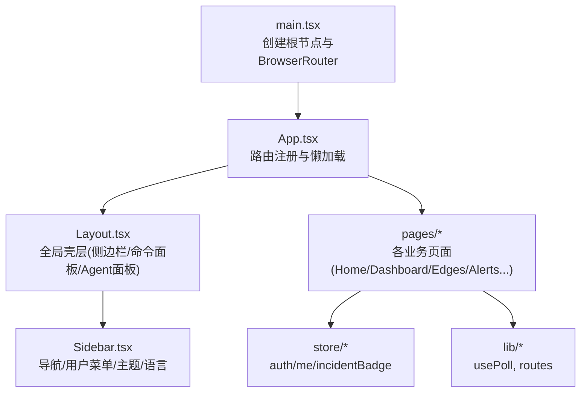
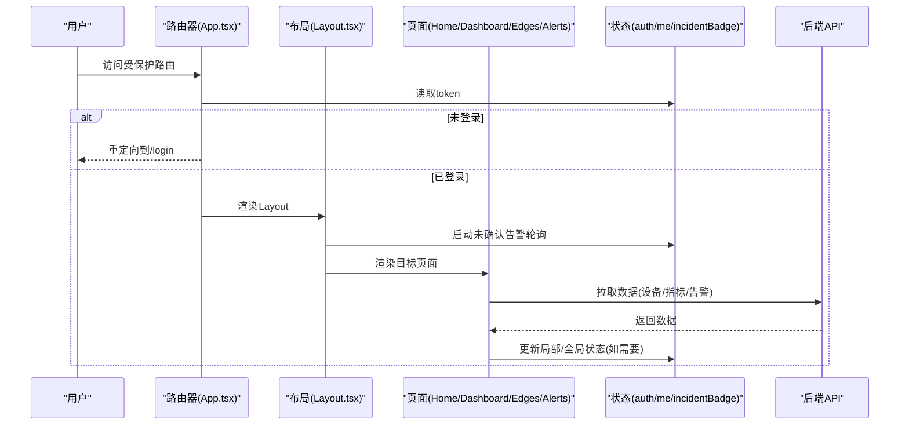
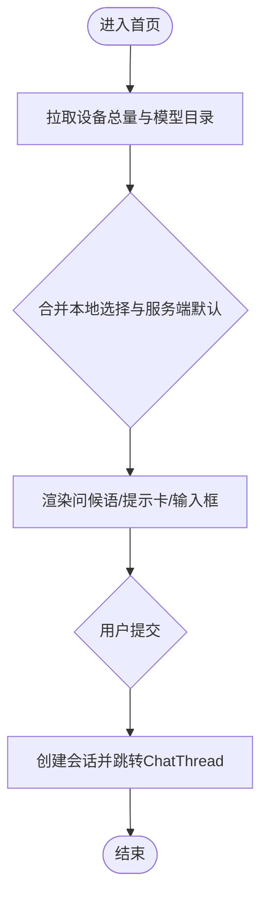
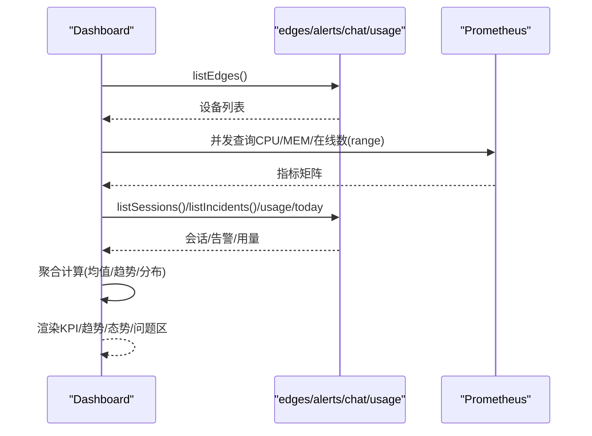
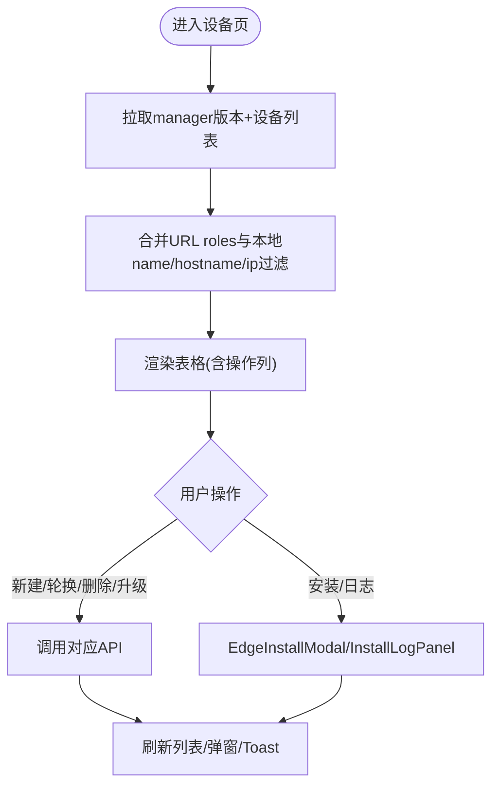
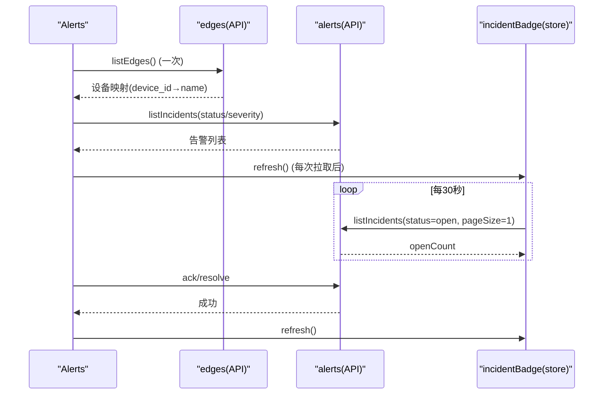
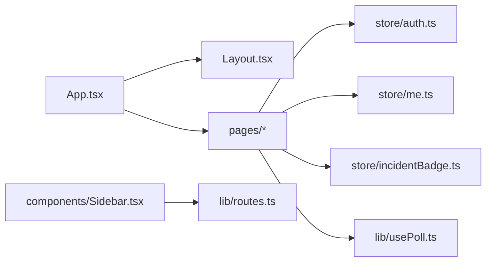

# 页面组件

<cite>
**本文引用的文件**
- [main.tsx](file://web/src/main.tsx)
- [App.tsx](file://web/src/App.tsx)
- [Layout.tsx](file://web/src/components/Layout.tsx)
- [Sidebar.tsx](file://web/src/components/Sidebar.tsx)
- [Home.tsx](file://web/src/pages/Home.tsx)
- [Dashboard.tsx](file://web/src/pages/Dashboard.tsx)
- [Edges.tsx](file://web/src/pages/Edges.tsx)
- [Alerts.tsx](file://web/src/pages/Alerts.tsx)
- [auth.ts](file://web/src/store/auth.ts)
- [me.ts](file://web/src/store/me.ts)
- [incidentBadge.ts](file://web/src/store/incidentBadge.ts)
- [usePoll.ts](file://web/src/lib/usePoll.ts)
- [routes.ts](file://web/src/lib/routes.ts)
</cite>

## 目录
1. [简介](#简介)
2. [项目结构](#项目结构)
3. [核心组件](#核心组件)
4. [架构总览](#架构总览)
5. [详细组件分析](#详细组件分析)
6. [依赖关系分析](#依赖关系分析)
7. [性能考虑](#性能考虑)
8. [故障排查指南](#故障排查指南)
9. [结论](#结论)
10. [附录：新页面开发规范与最佳实践](#附录新页面开发规范与最佳实践)

## 简介
本文件面向开发者，系统化梳理 Ongrid 前端页面组件的设计与实现，覆盖首页、仪表盘、设备管理、告警管理等核心页面；说明页面间数据传递与状态共享机制；阐述路由守卫与权限控制；总结性能优化策略（缓存、懒加载）；并提供复用模式、布局模板与新页面开发规范。

## 项目结构
- 应用入口与路由
  - 入口在 main.tsx 中创建根节点并注入 BrowserRouter，随后渲染 App。
  - App.tsx 集中声明所有页面路由，使用 React.lazy 进行页面级懒加载，并通过 RequireAuth/PublicOnly 实现登录态守卫与公开路由保护。
- 全局布局
  - Layout.tsx 提供侧边栏、命令面板、Agent 侧边面板等壳层，并在首次挂载时启动未确认告警计数轮询。
- 导航与命令面板
  - Sidebar.tsx 负责主导航、会话列表、用户菜单、主题与语言切换等。
  - routes.ts 维护命令面板的静态路由清单与模糊匹配算法。
- 状态与工具
  - auth.ts 持久化登录态（token、角色、邮箱）。
  - me.ts 提供 /v1/me 的单飞缓存与权限派生。
  - incidentBadge.ts 提供全局未确认告警计数的轮询与订阅。
  - usePoll.ts 提供基于可见性的轻量轮询 Hook。

图表来源
- [main.tsx:1-26](file://web/src/main.tsx#L1-L26)
- [App.tsx:1-234](file://web/src/App.tsx#L1-L234)
- [Layout.tsx:1-70](file://web/src/components/Layout.tsx#L1-L70)
- [Sidebar.tsx:1-800](file://web/src/components/Sidebar.tsx#L1-L800)

章节来源
- [main.tsx:1-26](file://web/src/main.tsx#L1-L26)
- [App.tsx:1-234](file://web/src/App.tsx#L1-L234)
- [Layout.tsx:1-70](file://web/src/components/Layout.tsx#L1-L70)
- [Sidebar.tsx:1-800](file://web/src/components/Sidebar.tsx#L1-L800)

## 核心组件
- 路由与守卫
  - RequireAuth：无 token 时重定向到 /login，并携带 from 以便登录后回跳。
  - PublicOnly：已登录时从 /login 重定向到首页。
  - 所有受保护页面统一包裹在 Layout 下，确保侧边栏与全局交互一致。
- 全局布局
  - Layout 启动未确认告警计数轮询，绑定 ⌘K/⌘P 快捷键打开 Agent 面板与命令面板。
- 侧边栏
  - 动态展示“设备”子项（按实际存在的角色过滤），支持折叠展开、用户菜单、主题与语言切换。
- 命令面板
  - 通过 routes.ts 中的 APP_ROUTES 与 fuzzyMatchScore/scoreRoute 实现本地模糊搜索与跳转。

章节来源
- [App.tsx:69-82](file://web/src/App.tsx#L69-L82)
- [Layout.tsx:10-44](file://web/src/components/Layout.tsx#L10-L44)
- [Sidebar.tsx:53-104](file://web/src/components/Sidebar.tsx#L53-L104)
- [routes.ts:1-111](file://web/src/lib/routes.ts#L1-L111)

## 架构总览
下图展示了认证、路由、布局与关键页面的交互关系，以及跨页面状态共享点。

图表来源
- [App.tsx:69-100](file://web/src/App.tsx#L69-L100)
- [Layout.tsx:10-20](file://web/src/components/Layout.tsx#L10-L20)
- [incidentBadge.ts:30-58](file://web/src/store/incidentBadge.ts#L30-L58)

## 详细组件分析

### 首页（Home）
- 功能要点
  - 随机问候语与提示卡，引导快速提问。
  - 选择默认模型并持久化为全局设置，影响后续聊天与会话继承。
  - 根据设备总数决定空状态引导或提示卡网格。
- 数据流
  - 初始化时拉取设备总量与模型目录，合并本地选择与服务端默认值。
  - 提交后创建会话并跳转到 ChatThread，初始提示通过路由 state 传递。
- 状态共享
  - 模型选择通过 useModelSelection 持久化，供聊天线程继承。
- 错误处理
  - 网络失败时降级显示，避免误判为空设备。

图表来源
- [Home.tsx:168-204](file://web/src/pages/Home.tsx#L168-L204)
- [Home.tsx:226-245](file://web/src/pages/Home.tsx#L226-L245)

章节来源
- [Home.tsx:144-204](file://web/src/pages/Home.tsx#L144-L204)
- [Home.tsx:226-245](file://web/src/pages/Home.tsx#L226-L245)

### 仪表盘（Dashboard）
- 功能要点
  - KPI 条：在线设备数、24h 平均 CPU/MEM、今日 LLM token、本周会话数。
  - 集群趋势图：CPU/MEM 均值与在线设备数 24h 走势。
  - 集群态势：在线占比、角色分布、在线数迷你图。
  - 问题区：严重度分布与最吵规则。
- 数据流
  - 一次性拉取设备列表，再并发查询 Prometheus 指标矩阵（CPU/MEM/在线数），按 device_id 聚合为每设备时间序列。
  - 会话列表与告警列表分别拉取，用于统计与最近会话展示。
  - 定时刷新（usePoll）与手动刷新按钮。
- 性能优化
  - 使用 Promise.all 并发请求 Prom 指标，减少往返。
  - 将多设备指标按 device_id 分组，避免 N 次单独查询。
  - 仅对前若干台设备计算明细，降低渲染压力。

图表来源
- [Dashboard.tsx:69-210](file://web/src/pages/Dashboard.tsx#L69-L210)
- [Dashboard.tsx:222-258](file://web/src/pages/Dashboard.tsx#L222-L258)

章节来源
- [Dashboard.tsx:42-210](file://web/src/pages/Dashboard.tsx#L42-L210)
- [Dashboard.tsx:222-258](file://web/src/pages/Dashboard.tsx#L222-L258)

### 设备管理（Edges）
- 功能要点
  - 设备列表：名称、任务名、所属设备、主机名/IP、角色、状态、最后心跳、Access Key、Agent 版本、操作。
  - 筛选：URL 参数 roles + 本地 name/hostname/ip 过滤。
  - 操作：新建、轮换密钥、删除、一键整包升级、触发 Agent 升级、查看 Grafana、Shell、安装日志。
- 数据流
  - 首次拉取 manager 版本与设备全量列表，用于下拉选项与版本漂移提示。
  - 后台轮询设备列表，同时并行获取每个 edge 的最新安装任务以启用“日志”按钮。
  - 创建/轮换/删除/升级等操作成功后刷新列表。
- 权限控制
  - canMutate 控制可写操作按钮显隐与可用性。
- 状态共享
  - 通过事件 onDevicesChanged 通知侧边栏动态呈现角色子项。

图表来源
- [Edges.tsx:144-177](file://web/src/pages/Edges.tsx#L144-L177)
- [Edges.tsx:183-204](file://web/src/pages/Edges.tsx#L183-L204)
- [Edges.tsx:209-230](file://web/src/pages/Edges.tsx#L209-L230)

章节来源
- [Edges.tsx:68-177](file://web/src/pages/Edges.tsx#L68-L177)
- [Edges.tsx:183-204](file://web/src/pages/Edges.tsx#L183-L204)
- [Edges.tsx:209-230](file://web/src/pages/Edges.tsx#L209-L230)

### 告警管理（Alerts）
- 功能要点
  - 列表：级别、规则、摘要、目标、状态、触发时间、最近触发、次数、操作（Ack/Resolve）。
  - 筛选：状态与严重级别。
  - 全局未确认计数：与侧边栏红点同源，30s 轮询。
- 数据流
  - 首次拉取设备清单用于 Target 列名称解析。
  - 列表分页拉取，静默轮询刷新，操作后同步刷新列表与全局计数。
- 权限控制
  - canMutate 控制 Ack/Resolve 按钮可用性与提示文案。

图表来源
- [Alerts.tsx:71-98](file://web/src/pages/Alerts.tsx#L71-L98)
- [Alerts.tsx:100-120](file://web/src/pages/Alerts.tsx#L100-L120)
- [incidentBadge.ts:30-58](file://web/src/store/incidentBadge.ts#L30-L58)

章节来源
- [Alerts.tsx:40-126](file://web/src/pages/Alerts.tsx#L40-L126)
- [incidentBadge.ts:1-59](file://web/src/store/incidentBadge.ts#L1-L59)

## 依赖关系分析
- 路由与页面
  - App.tsx 集中注册路由，使用 lazy 按需加载页面，降低首屏体积。
  - Layout.tsx 作为受保护路由的父容器，承载全局交互。
- 状态与副作用
  - auth.ts 提供持久化登录态，RequireAuth/PublicOnly 据此做路由守卫。
  - me.ts 提供 /v1/me 单飞缓存与权限派生，Sidebar 与页面据此控制可见性。
  - incidentBadge.ts 独立于页面，提供全局未确认告警计数，Layout 启动轮询。
  - usePoll.ts 被 Dashboard/Edges/Alerts 等页面复用，实现可见性感知轮询。
- 导航与命令面板
  - Sidebar.tsx 与 routes.ts 解耦，后者提供 APP_ROUTES 与模糊匹配算法，供命令面板使用。

图表来源
- [App.tsx:1-234](file://web/src/App.tsx#L1-L234)
- [Layout.tsx:1-70](file://web/src/components/Layout.tsx#L1-L70)
- [auth.ts:1-50](file://web/src/store/auth.ts#L1-L50)
- [me.ts:1-114](file://web/src/store/me.ts#L1-L114)
- [incidentBadge.ts:1-59](file://web/src/store/incidentBadge.ts#L1-L59)
- [usePoll.ts:1-46](file://web/src/lib/usePoll.ts#L1-L46)
- [Sidebar.tsx:1-800](file://web/src/components/Sidebar.tsx#L1-L800)
- [routes.ts:1-111](file://web/src/lib/routes.ts#L1-L111)

章节来源
- [App.tsx:1-234](file://web/src/App.tsx#L1-L234)
- [Layout.tsx:1-70](file://web/src/components/Layout.tsx#L1-L70)
- [auth.ts:1-50](file://web/src/store/auth.ts#L1-L50)
- [me.ts:1-114](file://web/src/store/me.ts#L1-L114)
- [incidentBadge.ts:1-59](file://web/src/store/incidentBadge.ts#L1-L59)
- [usePoll.ts:1-46](file://web/src/lib/usePoll.ts#L1-L46)
- [Sidebar.tsx:1-800](file://web/src/components/Sidebar.tsx#L1-L800)
- [routes.ts:1-111](file://web/src/lib/routes.ts#L1-L111)

## 性能考虑
- 页面级懒加载
  - 所有页面通过 React.lazy 按需加载，显著降低首屏资源体积。
- 并发与批量化
  - Dashboard 使用 Promise.all 并发拉取多个指标系列，并按 device_id 聚合，避免 N 次往返。
- 可见性感知轮询
  - usePoll 在标签页不可见时暂停轮询，恢复时立即补拉一次，减少无效请求与延迟。
- 最小化渲染
  - Dashboard 仅对前若干台设备计算明细；Edges 并行拉取最新安装任务，避免点击后再请求。
- 状态去抖与单飞
  - me.ts 的 loadMe 保证同一时刻只发一次请求，避免重复网络开销。

[本节为通用指导，不直接分析具体文件]

## 故障排查指南
- 登录态异常
  - 检查 requireAuth 是否拦截；确认 localStorage 中 ongrid.auth 是否存在有效 token。
- 未确认告警计数不更新
  - 确认 Layout 是否启动 incidentBadge 轮询；检查 token 存在性；观察浏览器控制台是否有 401。
- 设备列表不刷新
  - 检查 usePoll 是否生效（标签页可见性）；确认 refresh 函数稳定（useCallback）；查看网络请求是否被取消。
- 权限按钮不可用
  - 检查 usePermissions 派生的 canMutate；确认 /v1/me 是否成功返回 role。

章节来源
- [App.tsx:69-82](file://web/src/App.tsx#L69-L82)
- [Layout.tsx:10-20](file://web/src/components/Layout.tsx#L10-L20)
- [incidentBadge.ts:30-58](file://web/src/store/incidentBadge.ts#L30-L58)
- [usePoll.ts:20-45](file://web/src/lib/usePoll.ts#L20-L45)
- [me.ts:94-114](file://web/src/store/me.ts#L94-L114)

## 结论
本项目采用“集中路由 + 全局布局 + 页面懒加载 + 轻量状态库”的前端架构，配合 usePoll 与并发请求优化，兼顾了用户体验与性能。通过 RequireAuth/PublicOnly 与 usePermissions 实现了清晰的路由守卫与权限控制。建议在新页面开发中遵循本文档的规范与最佳实践，以保持整体一致性与可维护性。

[本节为总结，不直接分析具体文件]

## 附录：新页面开发规范与最佳实践
- 路由与懒加载
  - 在 App.tsx 中新增路由并使用 lazy(() => import(...)) 引入页面。
  - 若需登录态，将路由置于 RequireAuth 包裹的 Layout 下；公开页面使用 PublicOnly。
- 布局与交互
  - 使用 Layout 提供的 Shell；如需全局热键或面板，参考 Layout 的键盘事件绑定方式。
- 数据获取与轮询
  - 使用 usePoll 封装轮询逻辑，注意传入稳定的回调函数（useCallback）。
  - 对于多接口并发场景，优先使用 Promise.all 批量拉取。
- 状态与权限
  - 登录态与角色通过 auth.ts 与 me.ts 获取；页面内操作按钮依据 usePermissions 的 canMutate 控制。
  - 全局计数类状态（如未确认告警）放入 store，由 Layout 启动轮询，页面消费即可。
- 国际化与命令面板
  - 文本使用 i18n 的 tr()；如需加入命令面板，向 routes.ts 的 ROUTE_DEFS 追加条目。
- 错误处理与空状态
  - 明确 loading/error/empty 三种状态；错误信息尽量友好且可重试。
- 性能
  - 合理使用 useMemo/useCallback 避免不必要的重渲染；大数据列表考虑虚拟滚动或分页。
- 测试与可观测性
  - 为关键流程编写单元测试；必要时埋点记录关键操作与错误。

章节来源
- [App.tsx:1-234](file://web/src/App.tsx#L1-L234)
- [Layout.tsx:1-70](file://web/src/components/Layout.tsx#L1-L70)
- [usePoll.ts:1-46](file://web/src/lib/usePoll.ts#L1-L46)
- [me.ts:1-114](file://web/src/store/me.ts#L1-L114)
- [routes.ts:1-111](file://web/src/lib/routes.ts#L1-L111)