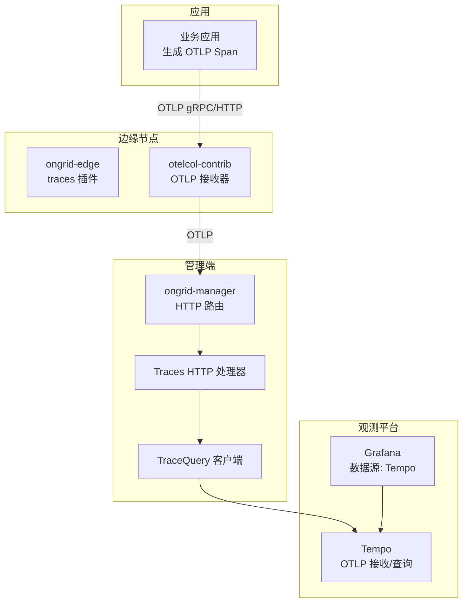
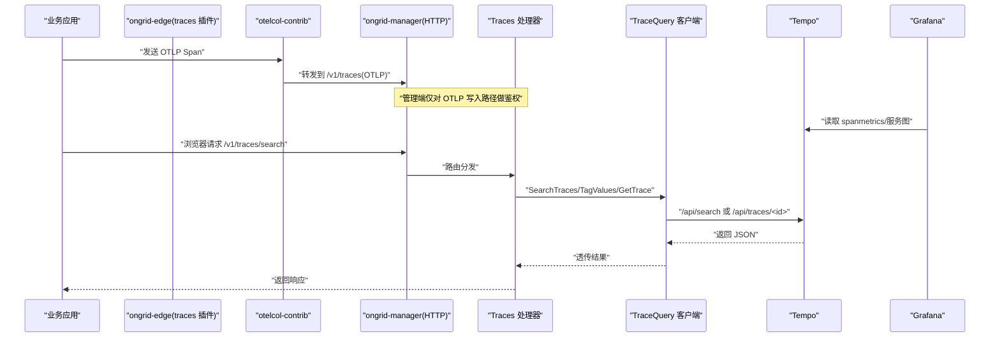
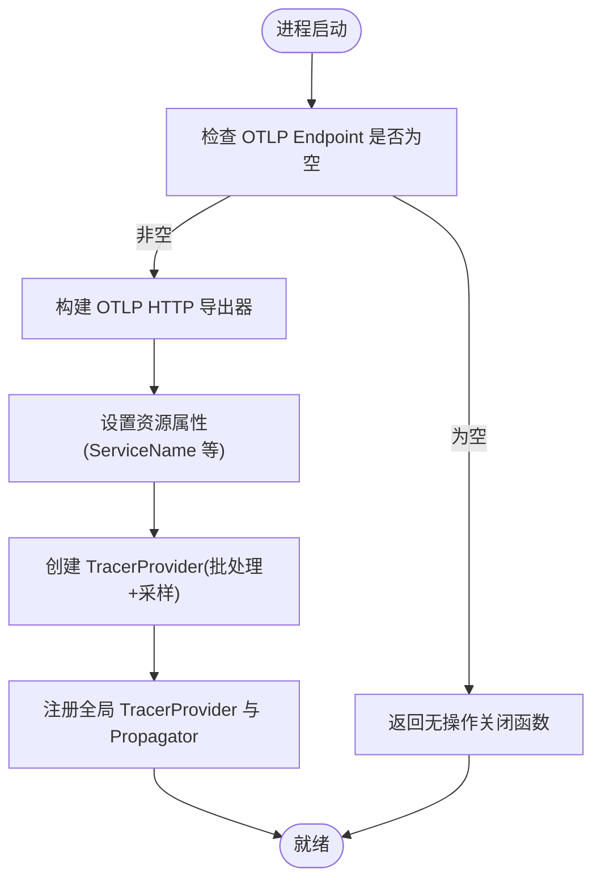
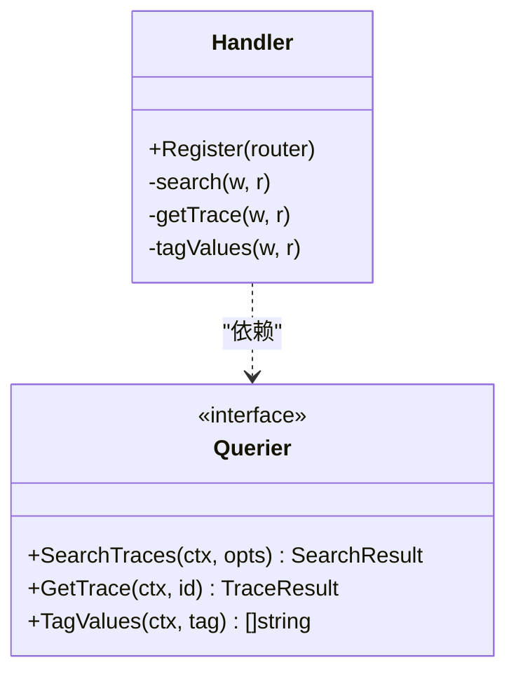
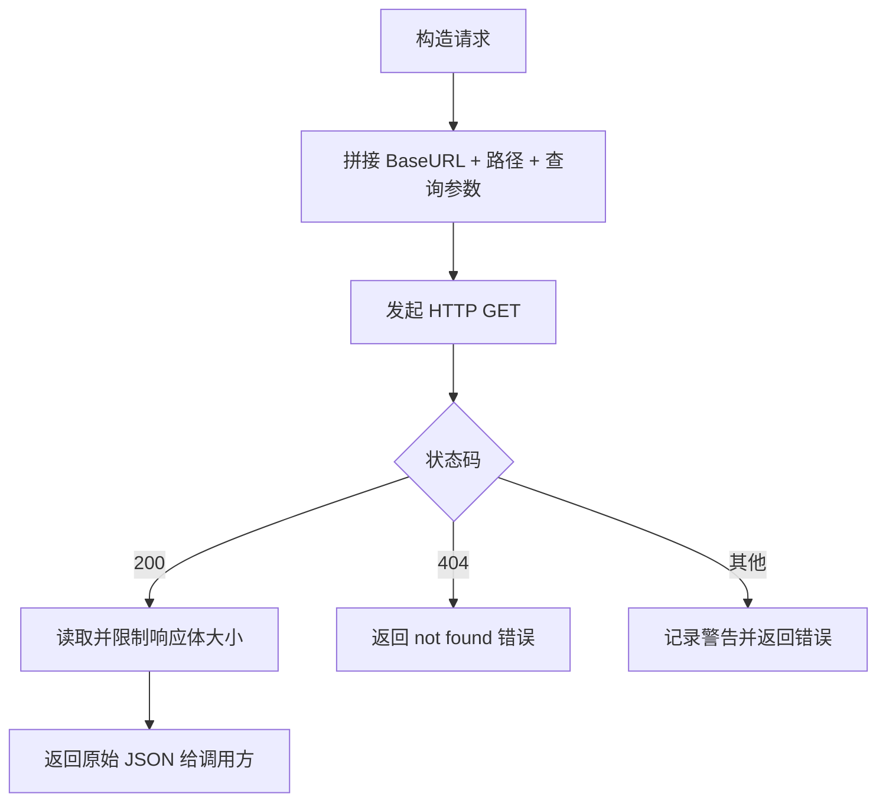
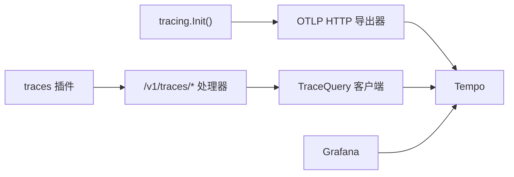

# 分布式追踪

<cite>
**本文引用的文件**   
- [cmd/ongrid/main.go](file://cmd/ongrid/main.go)
- [internal/pkg/tracing/tracing.go](file://internal/pkg/tracing/tracing.go)
- [internal/manager/server/traces/http.go](file://internal/manager/server/traces/http.go)
- [internal/pkg/tracequery/client.go](file://internal/pkg/tracequery/client.go)
- [internal/edgeagent/plugins/traces/plugin.go](file://internal/edgeagent/plugins/traces/plugin.go)
- [deploy/grafana/provisioning/datasources/tempo.yml](file://deploy/grafana/provisioning/datasources/tempo.yml)
- [internal/manager/biz/knowledge/builtin_vault/systems/observability-stack/tempo.md](file://internal/manager/biz/knowledge/builtin_vault/systems/observability-stack/tempo.md)
- [internal/manager/biz/aiops/tools/correlate_incident.go](file://internal/manager/biz/aiops/tools/correlate_incident.go)
</cite>

## 目录
1. [简介](#简介)
2. [项目结构](#项目结构)
3. [核心组件](#核心组件)
4. [架构总览](#架构总览)
5. [详细组件分析](#详细组件分析)
6. [依赖关系分析](#依赖关系分析)
7. [性能与优化](#性能与优化)
8. [故障排查指南](#故障排查指南)
9. [结论](#结论)
10. [附录](#附录)

## 简介
本文件面向开发者与运维人员，系统化阐述本项目中分布式追踪（Tempo + OpenTelemetry）的集成实现、数据流、查询与可视化方案。内容覆盖：
- 追踪数据的采集、传输、存储与查询机制
- OpenTelemetry 标准集成与自定义插桩方法
- 采样策略、压缩与查询优化建议
- TraceQL 查询语言使用指南与性能调优技巧
- Grafana 中追踪可视化的配置与自定义面板开发
- 应用埋点最佳实践与性能分析方法

## 项目结构
围绕“追踪”相关的关键代码与配置分布如下：
- 管理端进程初始化并启用 OTel 导出器，将自身 Span 推送到 Tempo
- 管理端提供受认证的 /v1/traces/* 代理接口，供前端 Traces 页面进行 TraceQL 搜索与详情获取
- 边缘侧通过 otelcol-contrib 子进程接收本地应用的 OTLP 流量，转发至管理端的 /v1/traces
- 前端通过后端代理访问 Tempo 的 /api/search 与 /api/traces/<id>
- Grafana 通过预置的数据源指向 Tempo，用于展示服务图与基于 spanmetrics 的指标

图表来源
- [internal/edgeagent/plugins/traces/plugin.go:1-48](file://internal/edgeagent/plugins/traces/plugin.go#L1-L48)
- [cmd/ongrid/main.go:198-241](file://cmd/ongrid/main.go#L198-L241)
- [internal/manager/server/traces/http.go:1-229](file://internal/manager/server/traces/http.go#L1-L229)
- [internal/pkg/tracequery/client.go:1-253](file://internal/pkg/tracequery/client.go#L1-L253)
- [deploy/grafana/provisioning/datasources/tempo.yml](file://deploy/grafana/provisioning/datasources/tempo.yml)

章节来源
- [internal/edgeagent/plugins/traces/plugin.go:1-48](file://internal/edgeagent/plugins/traces/plugin.go#L1-L48)
- [cmd/ongrid/main.go:198-241](file://cmd/ongrid/main.go#L198-L241)
- [internal/manager/server/traces/http.go:1-229](file://internal/manager/server/traces/http.go#L1-L229)
- [internal/pkg/tracequery/client.go:1-253](file://internal/pkg/tracequery/client.go#L1-L253)
- [deploy/grafana/provisioning/datasources/tempo.yml](file://deploy/grafana/provisioning/datasources/tempo.yml)

## 核心组件
- OpenTelemetry 初始化与导出器
  - 负责在进程启动时构建 TracerProvider、设置传播器、配置采样率与批量导出，将 Span 以 OTLP HTTP 方式发送到 Tempo
- 追踪查询代理（/v1/traces/*）
  - 对前端暴露受认证的路由，内部调用 TraceQuery 客户端访问 Tempo 的 /api/search 与 /api/traces/<id>
- TraceQuery 客户端
  - 封装对 Tempo 的 HTTP 调用，支持 TraceQL 查询、标签值枚举与按 trace_id 拉取完整轨迹
- 边缘 traces 插件
  - 在 ongrid-edge 中以子进程方式运行 otelcol-contrib，接收本地应用 OTLP 并转发到管理端入口

章节来源
- [internal/pkg/tracing/tracing.go:1-107](file://internal/pkg/tracing/tracing.go#L1-L107)
- [internal/manager/server/traces/http.go:1-229](file://internal/manager/server/traces/http.go#L1-L229)
- [internal/pkg/tracequery/client.go:1-253](file://internal/pkg/tracequery/client.go#L1-L253)
- [internal/edgeagent/plugins/traces/plugin.go:1-48](file://internal/edgeagent/plugins/traces/plugin.go#L1-L48)

## 架构总览
下图展示了从应用产生 Span 到 Grafana 可视化的端到端链路，以及管理端如何为前端提供安全的查询代理。

图表来源
- [internal/edgeagent/plugins/traces/plugin.go:1-48](file://internal/edgeagent/plugins/traces/plugin.go#L1-L48)
- [internal/manager/server/traces/http.go:1-229](file://internal/manager/server/traces/http.go#L1-L229)
- [internal/pkg/tracequery/client.go:1-253](file://internal/pkg/tracequery/client.go#L1-L253)
- [deploy/grafana/provisioning/datasources/tempo.yml](file://deploy/grafana/provisioning/datasources/tempo.yml)

## 详细组件分析

### OpenTelemetry 集成与导出器
- 功能要点
  - 在进程启动阶段初始化全局 TracerProvider，设置 ServiceName、采样率、批量导出超时等
  - 配置 TextMapPropagator 以跨进程传播 trace context 与 baggage
  - 当 Endpoint 为空时，Init 返回无操作关闭函数，便于统一 defer 调用
- 关键行为
  - 默认采样率为 1.0；可通过环境变量覆盖
  - 使用 OTLP HTTP 导出器，Insecure 模式适用于容器网络内明文传输
  - 批处理间隔较短，确保事故场景下延迟可见

图表来源
- [internal/pkg/tracing/tracing.go:1-107](file://internal/pkg/tracing/tracing.go#L1-L107)
- [cmd/ongrid/main.go:198-241](file://cmd/ongrid/main.go#L198-L241)

章节来源
- [internal/pkg/tracing/tracing.go:1-107](file://internal/pkg/tracing/tracing.go#L1-L107)
- [cmd/ongrid/main.go:198-241](file://cmd/ongrid/main.go#L198-L241)

### 追踪查询代理（/v1/traces/*）
- 路由设计
  - GET /v1/traces/search：代理 /api/search，支持 TraceQL 与标签过滤、时间窗、limit、min/maxDuration
  - GET /v1/traces/tags/{tag}/values：代理 /api/search/tag/{tag}/values，用于下拉填充
  - GET /v1/traces/{trace_id}：代理 /api/traces/<id>，返回 OTLP 形状 JSON
- 安全与可用性
  - 路由挂载在已鉴权的父路由器下，避免直接暴露 Tempo 的 /api/* 给外部
  - 当后端未启用时，返回 503 以便前端显示“追踪禁用”状态
- 参数校验与错误处理
  - 严格校验 limit、duration、时间格式，失败返回 400
  - 下游错误转换为 502，并附带简要错误信息

图表来源
- [internal/manager/server/traces/http.go:1-229](file://internal/manager/server/traces/http.go#L1-L229)

章节来源
- [internal/manager/server/traces/http.go:1-229](file://internal/manager/server/traces/http.go#L1-L229)

### TraceQuery 客户端
- 能力范围
  - SearchTraces：支持 TraceQL 表达式与 legacy tags 形式，限制默认 100，可指定时间窗与时长阈值
  - TagValues：枚举某标签的所有取值，供 UI 下拉选择
  - GetTrace：按 trace_id 拉取完整轨迹（OTLP JSON）
- 健壮性
  - 单次请求最大响应体限制，防止大响应导致内存膨胀
  - 兼容不同版本 Tempo 的响应结构差异，尽量保留原始 JSON 交由上层解析
  - 非 2xx 状态码记录警告日志并包装错误返回

图表来源
- [internal/pkg/tracequery/client.go:1-253](file://internal/pkg/tracequery/client.go#L1-L253)

章节来源
- [internal/pkg/tracequery/client.go:1-253](file://internal/pkg/tracequery/client.go#L1-L253)

### 边缘 traces 插件（otelcol-contrib 子进程）
- 职责
  - 根据管理器下发的 PluginConfig 渲染 otelcol.yaml
  - 以子进程方式启动 otelcol-contrib，监听本地 OTLP 端口，将 Span 推送至管理端 nginx /v1/traces
  - ongrid-edge 不触碰字节流，仅负责生命周期与配置渲染
- 关键点
  - 二进制路径与工作目录约定明确，便于隔离与排障
  - 通过 --config=... 传入单一配置文件，简化分层配置

章节来源
- [internal/edgeagent/plugins/traces/plugin.go:1-48](file://internal/edgeagent/plugins/traces/plugin.go#L1-L48)

### Grafana 数据源与可视化
- 数据源
  - 通过 provisioning YAML 预置 Tempo 数据源，使 Grafana 可直接查询 Tempo
- 典型用法
  - 使用 spanmetrics 派生的指标（如 traces_spanmetrics_*）绘制延迟、错误率
  - 使用服务图指标（traces_service_graph_request_*）绘制依赖拓扑
  - 在 Explore 中使用 TraceQL 快速定位问题

章节来源
- [deploy/grafana/provisioning/datasources/tempo.yml](file://deploy/grafana/provisioning/datasources/tempo.yml)
- [internal/manager/biz/knowledge/builtin_vault/systems/observability-stack/tempo.md:1-95](file://internal/manager/biz/knowledge/builtin_vault/systems/observability-stack/tempo.md#L1-L95)

## 依赖关系分析
- 组件耦合
  - 管理端 HTTP 层依赖 Traces 处理器；处理器依赖 TraceQuery 客户端；客户端依赖 Tempo
  - 边缘 traces 插件独立于管理端，仅通过 OTLP 协议与管理端对接
  - Grafana 直接依赖 Tempo 数据源
- 外部依赖
  - OpenTelemetry SDK 与 OTLP HTTP 导出器
  - Tempo 的 /api/search 与 /api/traces/<id> 接口
  - Grafana 的 Tempo 数据源

图表来源
- [internal/pkg/tracing/tracing.go:1-107](file://internal/pkg/tracing/tracing.go#L1-L107)
- [internal/manager/server/traces/http.go:1-229](file://internal/manager/server/traces/http.go#L1-L229)
- [internal/pkg/tracequery/client.go:1-253](file://internal/pkg/tracequery/client.go#L1-L253)
- [internal/edgeagent/plugins/traces/plugin.go:1-48](file://internal/edgeagent/plugins/traces/plugin.go#L1-L48)
- [deploy/grafana/provisioning/datasources/tempo.yml](file://deploy/grafana/provisioning/datasources/tempo.yml)

章节来源
- [internal/pkg/tracing/tracing.go:1-107](file://internal/pkg/tracing/tracing.go#L1-L107)
- [internal/manager/server/traces/http.go:1-229](file://internal/manager/server/traces/http.go#L1-L229)
- [internal/pkg/tracequery/client.go:1-253](file://internal/pkg/tracequery/client.go#L1-L253)
- [internal/edgeagent/plugins/traces/plugin.go:1-48](file://internal/edgeagent/plugins/traces/plugin.go#L1-L48)
- [deploy/grafana/provisioning/datasources/tempo.yml](file://deploy/grafana/provisioning/datasources/tempo.yml)

## 性能与优化
- 采样策略
  - Head sampling：在根 Span 决定，成本低但丢失尾部兴趣
  - Tail sampling：缓冲整条 Trace，依据错误/慢路径决策，成本高但更利于排障
  - Hybrid：低基础采样率 + 针对错误/慢路径尾采样
  - 注：Tail sampling 位于 OTel Collector 层，而非 Tempo 内部
- 压缩与存储
  - Tempo 采用块式存储，无索引扫描属性字段，按 trace_id 查找高效，宽泛属性搜索成本较高
- 查询优化
  - 优先使用 trace_id 精确查找；TraceQL 多条件组合会触发块扫描
  - 结合 spanmetrics 指标（RED）进行告警与概览，再下钻到具体 Trace
- 工程化建议
  - 合理设置 SamplingRatio，控制 Span 总量
  - 限定 UI 查询的 limit 与时间窗口，避免冷块全量扫描
  - 利用 TagValues 减少手写标签错误，提升查询命中率

章节来源
- [internal/manager/biz/knowledge/builtin_vault/systems/observability-stack/tempo.md:48-95](file://internal/manager/biz/knowledge/builtin_vault/systems/observability-stack/tempo.md#L48-L95)
- [internal/pkg/tracequery/client.go:89-157](file://internal/pkg/tracequery/client.go#L89-L157)
- [internal/manager/server/traces/http.go:66-152](file://internal/manager/server/traces/http.go#L66-L152)

## 故障排查指南
- 常见症状与定位
  - 前端 Traces 页面报错或空白：检查管理端是否启用了 traces 后端（未启用时返回 503）
  - 查询超时或无数据：确认时间窗、TraceQL 表达式、limit 与后端健康状态
  - Grafana 面板无数据：先验证数据源可达性与 UID 漂移，再用 Explore 复现查询
- 快速自检步骤
  - 通过管理端 /v1/traces/search 与 /v1/traces/tags/{tag}/values 验证连通性
  - 直接使用 curl 测试 Tempo 的 /api/search 与 /api/traces/<id>
  - 在 Grafana 数据源设置页执行“保存并测试”，或使用 API 探测后端健康
- 关联诊断
  - 使用 AIOPS 工具链中的 queryTracePanel 辅助检索特定服务的 Trace 摘要，缩小排查范围

章节来源
- [internal/manager/server/traces/http.go:66-196](file://internal/manager/server/traces/http.go#L66-L196)
- [internal/manager/biz/aiops/tools/correlate_incident.go:490-535](file://internal/manager/biz/aiops/tools/correlate_incident.go#L490-L535)

## 结论
本项目以 OpenTelemetry 为标准，构建了从应用到 Tempo 的端到端追踪链路，并通过管理端的安全代理为前端提供统一的 TraceQL 查询体验。配合 Grafana 的 spanmetrics 与服务图指标，形成“指标先行、Trace 下钻”的高效排障闭环。建议在大规模场景中引入 Tail/Hybrid 采样，并结合 RED 指标与 TraceQL 的组合策略，平衡可观测性与成本。

## 附录

### TraceQL 使用指南与示例
- 基本语法
  - 选择器 { ... } 过滤 Span
  - && 连接多个选择器表示同一 Trace 内均需匹配
  - 聚合函数 count()、avg(duration) 等
- 常用模式
  - 按服务名筛选：{ resource.service.name="api" }
  - 按状态筛选：{ status = error }
  - 按 HTTP 状态码筛选：{ span.http.status_code = 500 }
  - 组合条件：{ resource.service.name="api" } && { span.kind = client && duration > 1s }
- 注意事项
  - TraceQL 聚合能力弱于 PromQL/LogQL，复杂统计建议用 spanmetrics 指标完成

章节来源
- [internal/manager/biz/knowledge/builtin_vault/systems/observability-stack/tempo.md:63-81](file://internal/manager/biz/knowledge/builtin_vault/systems/observability-stack/tempo.md#L63-L81)

### Grafana 自定义追踪面板开发
- 数据源准备
  - 通过 provisioning 配置 Tempo 数据源，确保 Grafana 可访问
- 面板类型
  - 时序图：基于 traces_spanmetrics_latency_bucket 等指标
  - 统计/仪表盘：基于 traces_spanmetrics_calls_total 等计数指标
  - 服务图：基于 traces_service_graph_request_* 指标
- 变量与模板
  - 使用标签变量（如 service.name）驱动面板，提高复用性
- 调试技巧
  - 在 Explore 中验证查询与时间窗
  - 关注数据源 UID 一致性，避免 Dashboard 引用失效

章节来源
- [deploy/grafana/provisioning/datasources/tempo.yml](file://deploy/grafana/provisioning/datasources/tempo.yml)
- [internal/manager/biz/knowledge/builtin_vault/systems/observability-stack/tempo.md:83-95](file://internal/manager/biz/knowledge/builtin_vault/systems/observability-stack/tempo.md#L83-L95)

### 应用埋点最佳实践
- 规范
  - 为每个服务设置稳定的 ServiceName，便于 spanmetrics 拆分
  - 在关键路径创建 Span，标注语义化名称与必要属性（如 HTTP 状态码、耗时）
  - 使用上下文传播，保证跨服务链路完整性
- 采样
  - 生产环境建议开启 Head/Tail/Hybrid 采样，控制 Span 总量
- 关联
  - 在日志中注入 trace_id，便于 Loki 与 Tempo 联动
  - 在指标中携带 exemplar（trace_id），实现从指标到 Trace 的快速跳转

章节来源
- [internal/pkg/tracing/tracing.go:35-52](file://internal/pkg/tracing/tracing.go#L35-L52)
- [internal/manager/biz/knowledge/builtin_vault/systems/observability-stack/tempo.md:83-95](file://internal/manager/biz/knowledge/builtin_vault/systems/observability-stack/tempo.md#L83-L95)