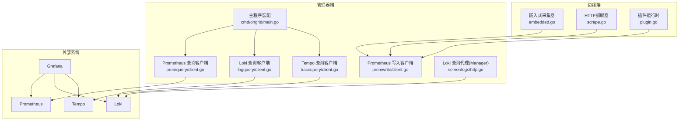
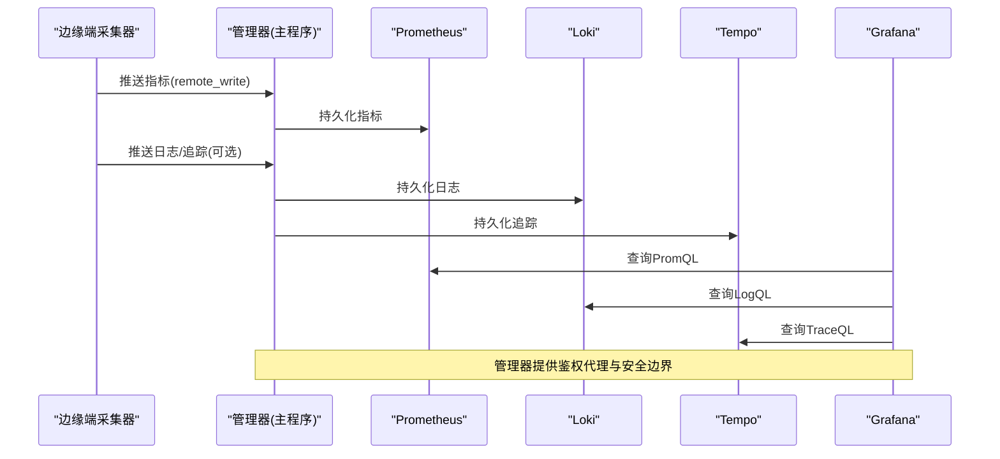
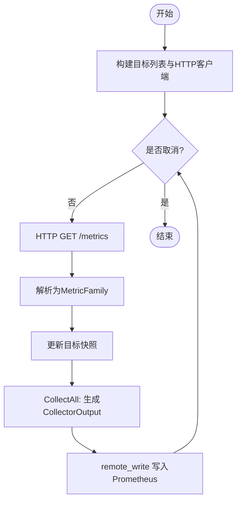
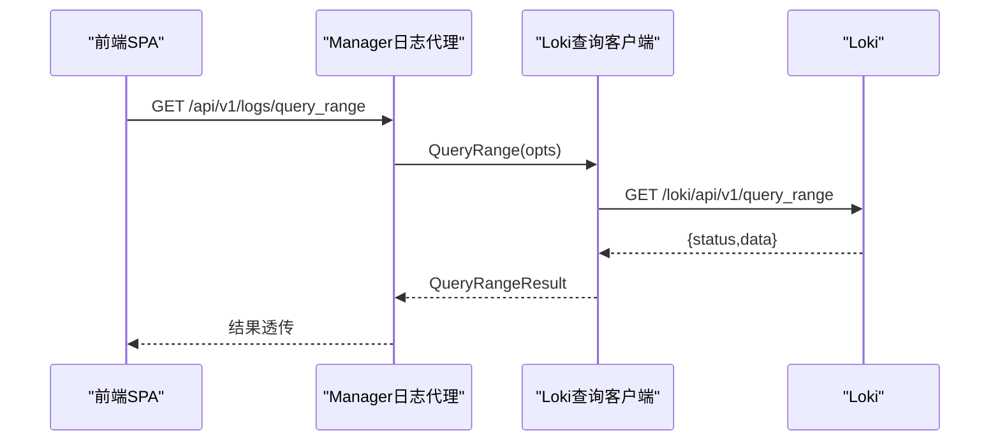
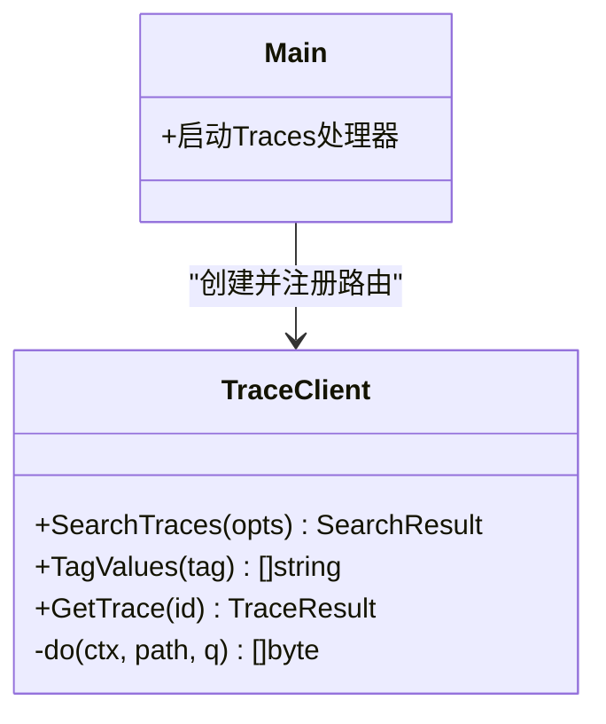
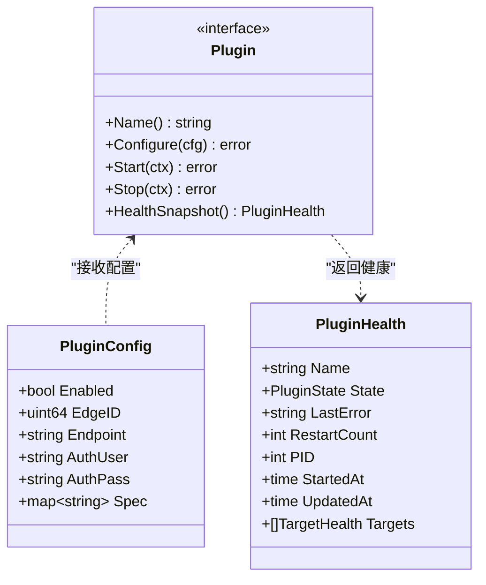
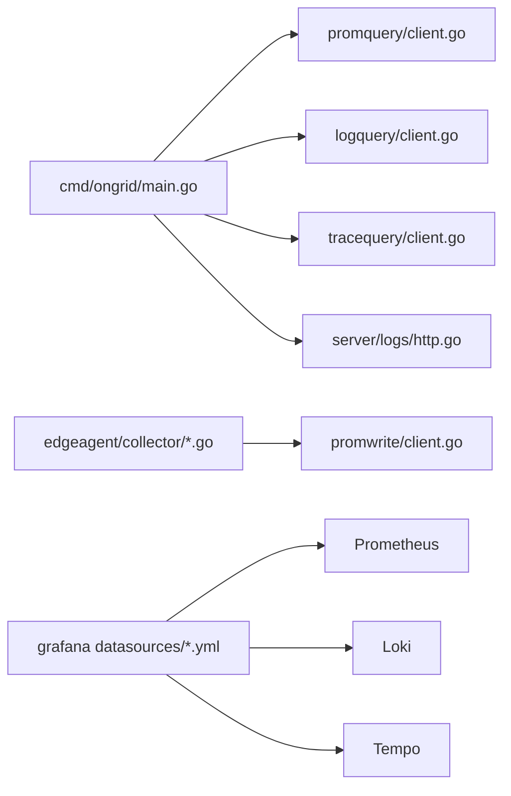

# 可观测性平台

<cite>
**本文引用的文件**
- [cmd/ongrid/main.go](file://cmd/ongrid/main.go)
- [internal/pkg/promquery/client.go](file://internal/pkg/promquery/client.go)
- [internal/pkg/logquery/client.go](file://internal/pkg/logquery/client.go)
- [internal/pkg/tracequery/client.go](file://internal/pkg/tracequery/client.go)
- [internal/pkg/promwrite/client.go](file://internal/pkg/promwrite/client.go)
- [internal/edgeagent/collector/embedded.go](file://internal/edgeagent/collector/embedded.go)
- [internal/edgeagent/collector/scrape.go](file://internal/edgeagent/collector/scrape.go)
- [internal/edgeagent/plugins/plugin.go](file://internal/edgeagent/plugins/plugin.go)
- [internal/manager/server/logs/http.go](file://internal/manager/server/logs/http.go)
- [deploy/install/prometheus-rules.yml](file://deploy/install/prometheus-rules.yml)
- [deploy/grafana/provisioning/datasources/prometheus.yml](file://deploy/grafana/provisioning/datasources/prometheus.yml)
- [deploy/grafana/provisioning/datasources/loki.yml](file://deploy/grafana/provisioning/datasources/loki.yml)
- [deploy/grafana/provisioning/datasources/tempo.yml](file://deploy/grafana/provisioning/datasources/tempo.yml)
</cite>

## 目录
1. [简介](#简介)
2. [项目结构](#项目结构)
3. [核心组件](#核心组件)
4. [架构总览](#架构总览)
5. [详细组件分析](#详细组件分析)
6. [依赖关系分析](#依赖关系分析)
7. [性能与容量规划](#性能与容量规划)
8. [故障排查指南](#故障排查指南)
9. [结论](#结论)
10. [附录](#附录)

## 简介
本文件面向运维与SRE团队，系统化阐述 Ongrid 可观测性平台的指标、日志、追踪三大信号采集、存储、查询与可视化方案，并覆盖边缘侧数据采集器设计模式（内置采集器与插件扩展）、时序数据写入与查询优化、Grafana 数据源与仪表板集成、告警规则定义与管理，以及与 IM 渠道的联动通知机制。文档以代码级事实为依据，提供架构图、序列图与流程图，帮助快速定位问题与制定最佳实践。

## 项目结构
从仓库可见，可观测性相关能力分布在以下层次：
- 边缘侧采集器：内嵌主机指标采集与 HTTP scrape 多目标采集，统一输出为 Prometheus 格式样本；同时通过插件子系统管理 metrics/logs/traces 子进程生命周期。
- 管理器侧客户端：对 Prometheus/Loki/Tempo 的查询与写入封装，提供统一的 BaseURLResolver 动态配置能力。
- 管理器侧代理：将 Loki 查询接口安全暴露给前端 SPA，避免直接暴露后端服务。
- 部署配置：Prometheus 规则、Grafana 数据源与跨信号关联配置。

图表来源
- [internal/edgeagent/collector/embedded.go:1-51](file://internal/edgeagent/collector/embedded.go#L1-L51)
- [internal/edgeagent/collector/scrape.go:1-120](file://internal/edgeagent/collector/scrape.go#L1-L120)
- [internal/edgeagent/plugins/plugin.go:1-119](file://internal/edgeagent/plugins/plugin.go#L1-L119)
- [internal/pkg/promquery/client.go:1-168](file://internal/pkg/promquery/client.go#L1-L168)
- [internal/pkg/logquery/client.go:1-120](file://internal/pkg/logquery/client.go#L1-L120)
- [internal/pkg/tracequery/client.go:1-120](file://internal/pkg/tracequery/client.go#L1-L120)
- [internal/pkg/promwrite/client.go:1-120](file://internal/pkg/promwrite/client.go#L1-L120)
- [internal/manager/server/logs/http.go:1-41](file://internal/manager/server/logs/http.go#L1-L41)
- [cmd/ongrid/main.go:1160-1187](file://cmd/ongrid/main.go#L1160-L1187)

章节来源
- [cmd/ongrid/main.go:1160-1187](file://cmd/ongrid/main.go#L1160-L1187)
- [internal/pkg/promquery/client.go:1-168](file://internal/pkg/promquery/client.go#L1-L168)
- [internal/pkg/logquery/client.go:1-120](file://internal/pkg/logquery/client.go#L1-L120)
- [internal/pkg/tracequery/client.go:1-120](file://internal/pkg/tracequery/client.go#L1-L120)
- [internal/pkg/promwrite/client.go:1-120](file://internal/pkg/promwrite/client.go#L1-L120)
- [internal/edgeagent/collector/embedded.go:1-51](file://internal/edgeagent/collector/embedded.go#L1-L51)
- [internal/edgeagent/collector/scrape.go:1-120](file://internal/edgeagent/collector/scrape.go#L1-L120)
- [internal/edgeagent/plugins/plugin.go:1-119](file://internal/edgeagent/plugins/plugin.go#L1-L119)
- [internal/manager/server/logs/http.go:1-41](file://internal/manager/server/logs/http.go#L1-L41)

## 核心组件
- 指标采集与写入
  - 嵌入式采集器：在进程内使用系统库采集 CPU/内存/磁盘/网络等指标，映射为标准 Prometheus 命名，便于统一处理。
  - HTTP 抓取器：按目标配置周期拉取任意 /metrics 端点，解析为 MetricFamily 快照，支持 Bearer Token 与 TLS。
  - 写入客户端：将样本编码为 remote_write 协议并通过 Snappy 压缩提交至 Prometheus。
- 日志聚合与查询
  - Loki 查询客户端：封装 query_range、label names/values 等接口，支持动态 BaseURL 解析与单租户 OrgID 注入。
  - Manager 侧代理：将 Loki 查询 API 经鉴权后暴露给前端，避免直接暴露后端。
- 分布式追踪
  - Tempo 查询客户端：封装 search、tag values、get trace 等接口，返回原始 JSON 以便上层灵活消费。
- 插件化采集
  - 插件接口：统一 Name/Configure/Start/Stop/HealthSnapshot 生命周期，支持 in-process 与 subprocess 两种形态。
  - Supervisor：负责配置拉取、进程守护、健康上报与重启策略。

章节来源
- [internal/edgeagent/collector/embedded.go:1-51](file://internal/edgeagent/collector/embedded.go#L1-L51)
- [internal/edgeagent/collector/scrape.go:1-120](file://internal/edgeagent/collector/scrape.go#L1-L120)
- [internal/pkg/promwrite/client.go:1-120](file://internal/pkg/promwrite/client.go#L1-L120)
- [internal/pkg/logquery/client.go:1-120](file://internal/pkg/logquery/client.go#L1-L120)
- [internal/manager/server/logs/http.go:1-41](file://internal/manager/server/logs/http.go#L1-L41)
- [internal/pkg/tracequery/client.go:1-120](file://internal/pkg/tracequery/client.go#L1-L120)
- [internal/edgeagent/plugins/plugin.go:1-119](file://internal/edgeagent/plugins/plugin.go#L1-L119)

## 架构总览
下图展示从边缘采集到管理器查询/写入，再到 Grafana 可视化的端到端链路。

图表来源
- [internal/pkg/promwrite/client.go:120-178](file://internal/pkg/promwrite/client.go#L120-L178)
- [internal/pkg/promquery/client.go:93-168](file://internal/pkg/promquery/client.go#L93-L168)
- [internal/pkg/logquery/client.go:120-200](file://internal/pkg/logquery/client.go#L120-L200)
- [internal/pkg/tracequery/client.go:111-201](file://internal/pkg/tracequery/client.go#L111-L201)
- [internal/manager/server/logs/http.go:1-41](file://internal/manager/server/logs/http.go#L1-L41)

## 详细组件分析

### 指标采集子系统（Prometheus）
- 嵌入式采集器
  - 职责：在进程内读取系统资源指标，映射为标准 Prometheus 指标名，保证与 scrape 路径一致的数据模型。
  - 关键点：Mapper 统一命名约定，便于后续 fast-path 推导与 host point 计算。
- HTTP 抓取器
  - 职责：按目标清单并发抓取 /metrics，解析为 MetricFamily 快照，支持 Bearer Token 与 TLS。
  - 关键点：每目标独立 http.Client，连接复用；失败不中断循环；快照用于后续采样与 host load 推断。
- 写入客户端
  - 职责：将样本编码为 remote_write 请求，Snappy 压缩，POST 到 Prometheus。
  - 关键点：EndpointResolver 支持动态 URL；空样本无操作；错误包含受限 body 片段便于诊断。

图表来源
- [internal/edgeagent/collector/scrape.go:79-183](file://internal/edgeagent/collector/scrape.go#L79-L183)
- [internal/edgeagent/collector/scrape.go:185-226](file://internal/edgeagent/collector/scrape.go#L185-L226)
- [internal/pkg/promwrite/client.go:126-176](file://internal/pkg/promwrite/client.go#L126-L176)

章节来源
- [internal/edgeagent/collector/embedded.go:1-51](file://internal/edgeagent/collector/embedded.go#L1-L51)
- [internal/edgeagent/collector/scrape.go:1-120](file://internal/edgeagent/collector/scrape.go#L1-L120)
- [internal/pkg/promwrite/client.go:1-120](file://internal/pkg/promwrite/client.go#L1-L120)

### 日志聚合子系统（Loki）
- 查询客户端
  - 职责：封装 query_range、labels、label values 等接口，统一超时与错误处理，支持动态 BaseURL。
  - 关键点：默认方向 backward（最新优先），限制响应体大小，单租户 OrgID 注入。
- Manager 侧代理
  - 职责：将 Loki 查询 API 经鉴权后暴露给前端，避免直接暴露 /loki/* 读路径。
  - 关键点：当底层 Querier 为空时返回 503，前端可显示“日志禁用”状态。

图表来源
- [internal/manager/server/logs/http.go:1-41](file://internal/manager/server/logs/http.go#L1-L41)
- [internal/pkg/logquery/client.go:120-171](file://internal/pkg/logquery/client.go#L120-L171)

章节来源
- [internal/pkg/logquery/client.go:1-120](file://internal/pkg/logquery/client.go#L1-L120)
- [internal/manager/server/logs/http.go:1-41](file://internal/manager/server/logs/http.go#L1-L41)

### 分布式追踪子系统（Tempo）
- 查询客户端
  - 职责：封装 search、tag values、get trace 等接口，返回原始 JSON 供上层灵活消费。
  - 关键点：SearchOptions 支持 TraceQL 或 legacy tags；默认 limit=100；非 2xx 返回错误。
- 管理器装配
  - 职责：根据配置启用/禁用 traces 处理器，未启用时路由返回 503。

图表来源
- [internal/pkg/tracequery/client.go:111-201](file://internal/pkg/tracequery/client.go#L111-L201)
- [cmd/ongrid/main.go:1160-1187](file://cmd/ongrid/main.go#L1160-L1187)

章节来源
- [internal/pkg/tracequery/client.go:1-120](file://internal/pkg/tracequery/client.go#L1-L120)
- [cmd/ongrid/main.go:1160-1187](file://cmd/ongrid/main.go#L1160-L1187)

### 插件化采集器设计（Metrics/Logs/Traces）
- 插件接口
  - 统一 Name/Configure/Start/Stop/HealthSnapshot 生命周期，支持 in-process 与 subprocess 两种形态。
  - PluginConfig 携带 edge_id、endpoint、认证信息与 spec 配置。
- Supervisor
  - 负责配置拉取、进程守护、健康上报与重启计数，向管理器周期性汇报 Targets 级别健康。

图表来源
- [internal/edgeagent/plugins/plugin.go:18-119](file://internal/edgeagent/plugins/plugin.go#L18-L119)

章节来源
- [internal/edgeagent/plugins/plugin.go:1-119](file://internal/edgeagent/plugins/plugin.go#L1-L119)

### 时序数据存储与查询优化
- 写入优化
  - remote_write 使用 Snappy 压缩，减少带宽；每个 Sample 作为独立 TimeSeries 发送，简化 manager 侧分组逻辑。
  - EndpointResolver 支持热更新，避免重启。
- 查询优化
  - 统一 30s 超时上限，限制响应体大小，避免 OOM。
  - LogQL/TraceQL 查询均支持时间窗口与分页限制，降低后端压力。
  - 标签基数控制：日志与追踪建议低基数字段作为标签，高基数内容放入行文本或 span attributes。

章节来源
- [internal/pkg/promwrite/client.go:126-176](file://internal/pkg/promwrite/client.go#L126-L176)
- [internal/pkg/logquery/client.go:120-200](file://internal/pkg/logquery/client.go#L120-L200)
- [internal/pkg/tracequery/client.go:111-201](file://internal/pkg/tracequery/client.go#L111-L201)

### Grafana 仪表板与数据源集成
- 数据源预置
  - Prometheus：默认 ongrid-prometheus，proxy 访问。
  - Loki：默认 ongrid-loki，支持环境变量覆盖。
  - Tempo：默认 ongrid-tempo，开启 tracesToLogsV2 与 tracesToMetrics，实现跨信号钻取与服务拓扑。
- 仪表板
  - 安装脚本中提供 server-detail.json 等示例仪表板，可按需导入。

章节来源
- [deploy/grafana/provisioning/datasources/prometheus.yml:1-11](file://deploy/grafana/provisioning/datasources/prometheus.yml#L1-L11)
- [deploy/grafana/provisioning/datasources/loki.yml:1-19](file://deploy/grafana/provisioning/datasources/loki.yml#L1-L19)
- [deploy/grafana/provisioning/datasources/tempo.yml:1-51](file://deploy/grafana/provisioning/datasources/tempo.yml#L1-L51)

### 告警规则与 IM 通知
- 自监控规则
  - prometheus-rules.yml 定义了 manager 自身健康、LLM 错误率、DB 池饱和、评估器停滞、HTTP 5xx 比率等规则，并标注 source="self" 便于区分业务告警。
- IM 渠道集成
  - 管理器提供通知通道抽象与 Webhook 实现，结合告警事件可推送到 Slack/Telegram/飞书/钉钉/企微等渠道（具体通道由上层编排）。

章节来源
- [deploy/install/prometheus-rules.yml:1-79](file://deploy/install/prometheus-rules.yml#L1-L79)

## 依赖关系分析
- 模块耦合
  - 管理器主程序集中装配各查询/写入客户端与路由，解耦于具体后端地址（BaseURLResolver/EndpointResolver）。
  - 边缘采集器与插件子系统松耦合，Supervisor 屏蔽进程细节。
- 外部依赖
  - Prometheus/Loki/Tempo 均为 HTTP 服务，客户端具备重试与错误降级能力（如 503 占位）。
  - Grafana 通过数据源配置与跨信号关联，形成统一体验。

图表来源
- [cmd/ongrid/main.go:1160-1187](file://cmd/ongrid/main.go#L1160-L1187)
- [internal/pkg/promquery/client.go:1-168](file://internal/pkg/promquery/client.go#L1-L168)
- [internal/pkg/logquery/client.go:1-120](file://internal/pkg/logquery/client.go#L1-L120)
- [internal/pkg/tracequery/client.go:1-120](file://internal/pkg/tracequery/client.go#L1-L120)
- [internal/manager/server/logs/http.go:1-41](file://internal/manager/server/logs/http.go#L1-L41)
- [internal/edgeagent/collector/scrape.go:1-120](file://internal/edgeagent/collector/scrape.go#L1-L120)
- [internal/pkg/promwrite/client.go:1-120](file://internal/pkg/promwrite/client.go#L1-L120)
- [deploy/grafana/provisioning/datasources/prometheus.yml:1-11](file://deploy/grafana/provisioning/datasources/prometheus.yml#L1-L11)
- [deploy/grafana/provisioning/datasources/loki.yml:1-19](file://deploy/grafana/provisioning/datasources/loki.yml#L1-L19)
- [deploy/grafana/provisioning/datasources/tempo.yml:1-51](file://deploy/grafana/provisioning/datasources/tempo.yml#L1-L51)

## 性能与容量规划
- 指标
  - remote_write 批量小但频繁，建议开启连接复用与合理超时；注意标签基数，避免高基数导致存储膨胀。
  - 抓取器每目标独立 Client，建议控制目标数量与抓取间隔。
- 日志
  - 控制 label 基数，避免 stream 爆炸；合理设置 maxLines 与超时；关注 429 与 out-of-order 错误。
- 追踪
  - 采用 head/tail/hybrid 采样策略；利用 spanmetrics 生成 RED 指标并在 Prometheus 中告警；通过 exemplar 关联 trace_id。
- 查询
  - 统一 30s 超时与响应体限制；尽量缩小时间窗口与 limit；避免全表扫描式 TraceQL。

[本节为通用指导，无需源码引用]

## 故障排查指南
- 指标不可用
  - 检查 remote_write 端点可达性与 2xx 响应；查看 manager 日志中的 non-2xx 警告；确认标签基数与采样频率。
- 日志缺失或延迟
  - 检查 Loki 429/流限制/out-of-order 错误；核对标签基数与时间单调性；必要时提升 ingestion rate/burst 或扩容 ingester。
- 追踪无法检索
  - 确认 trace_id 存在且未被采样丢弃；检查 Tempo search 与 get trace 接口状态码；验证 tracesToLogsV2 与 tracesToMetrics 配置。
- 管理器自监控异常
  - 参考 prometheus-rules.yml 中的自监控告警项，结合 manager 日志进行根因定位。

章节来源
- [internal/pkg/promwrite/client.go:164-176](file://internal/pkg/promwrite/client.go#L164-L176)
- [internal/pkg/logquery/client.go:257-272](file://internal/pkg/logquery/client.go#L257-L272)
- [internal/pkg/tracequery/client.go:232-243](file://internal/pkg/tracequery/client.go#L232-L243)
- [deploy/install/prometheus-rules.yml:1-79](file://deploy/install/prometheus-rules.yml#L1-L79)

## 结论
Ongrid 的可观测性平台以“边缘采集—管理器代理—后端存储—Grafana 可视化”的分层架构实现指标、日志、追踪的统一治理。通过插件化采集器与动态配置解析，系统在可扩展性与稳定性之间取得平衡。配合完善的自监控规则与跨信号关联能力，运维团队可在 IM 渠道获得及时告警与上下文信息，显著提升排障效率。

## 附录
- 关键配置与环境变量
  - 数据源 URL：通过环境变量覆盖 Grafana 数据源（如 ONGRID_LOG_URL、ONGRID_TRACE_QUERY_URL）。
  - 写入端点：Prometheus remote_write 可通过 EndpointResolver 动态切换。
- 最佳实践清单
  - 指标：控制标签基数、合理采样间隔、使用 exemplar 关联追踪。
  - 日志：低基数标签、限流与去重、避免时钟漂移。
  - 追踪：tail sampling 保留错误与慢请求、spanmetrics 驱动告警。
  - 告警：区分 self 与业务告警，结合 IM 渠道闭环。

[本节为补充说明，无需源码引用]