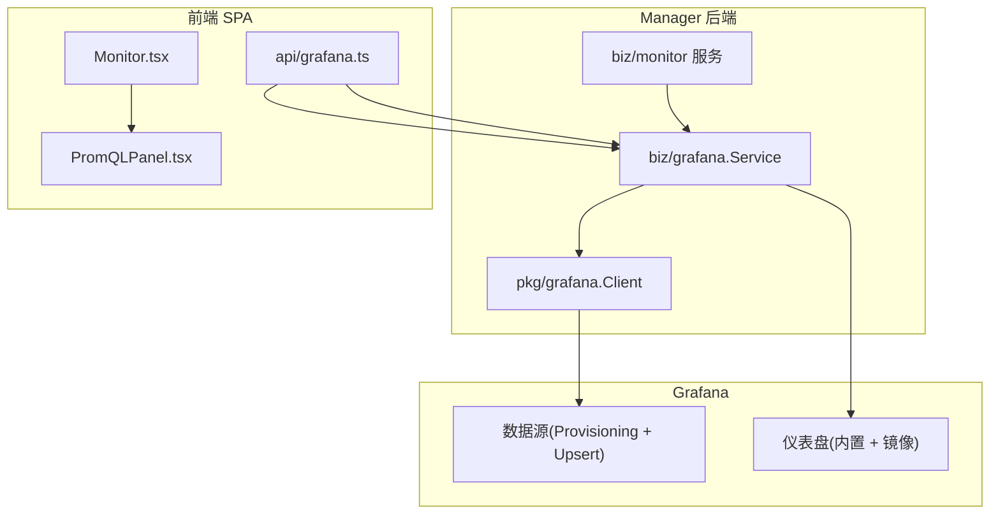
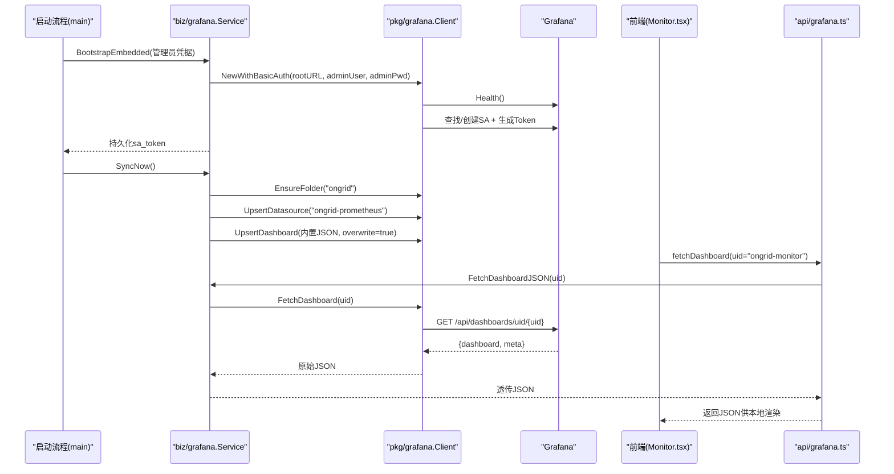
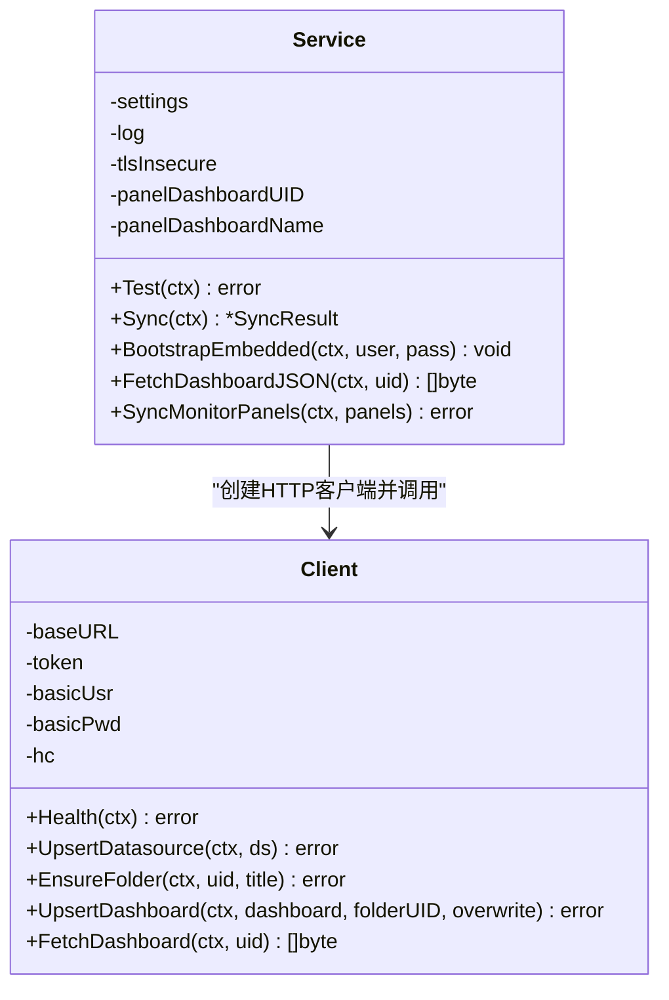
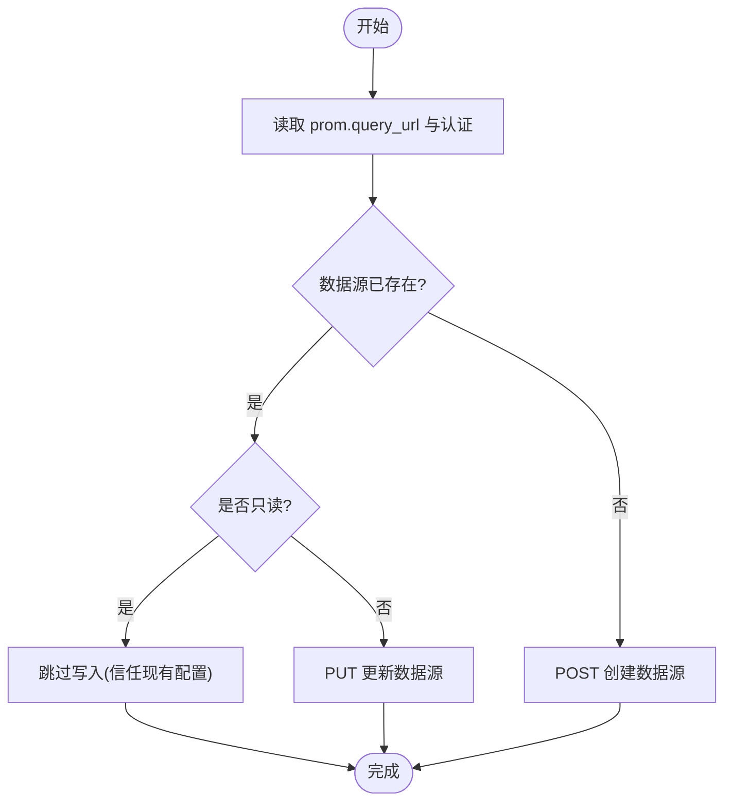
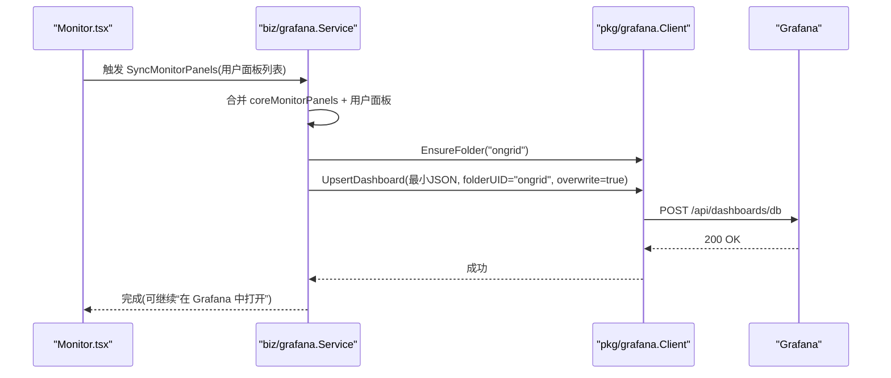
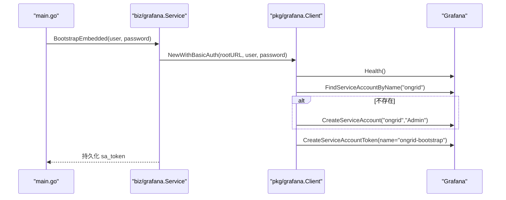
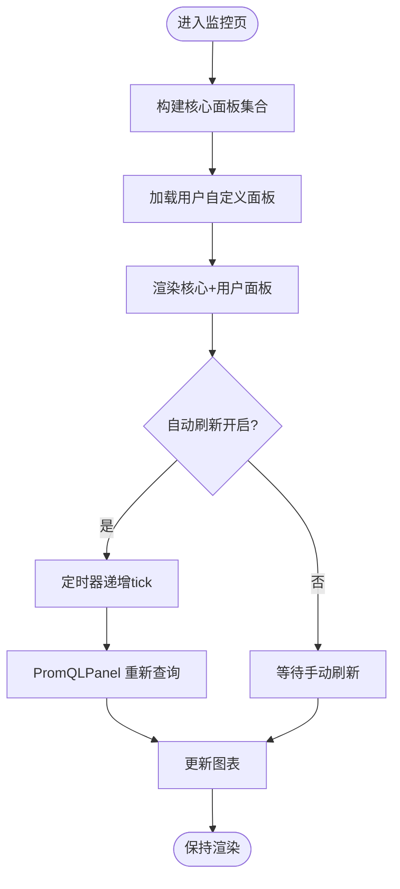
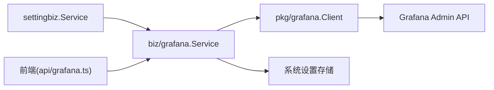

# 可视化与仪表板

<cite>
**本文引用的文件**   
- [cmd/ongrid/main.go](file://cmd/ongrid/main.go)
- [internal/manager/biz/grafana/service.go](file://internal/manager/biz/grafana/service.go)
- [internal/pkg/grafana/client.go](file://internal/pkg/grafana/client.go)
- [web/src/api/grafana.ts](file://web/src/api/grafana.ts)
- [web/src/pages/Monitor.tsx](file://web/src/pages/Monitor.tsx)
- [web/src/components/PromQLPanel.tsx](file://web/src/components/PromQLPanel.tsx)
- [deploy/grafana/provisioning/datasources/prometheus.yml](file://deploy/grafana/provisioning/datasources/prometheus.yml)
- [deploy/grafana/provisioning/datasources/loki.yml](file://deploy/grafana/provisioning/datasources/loki.yml)
- [deploy/grafana/provisioning/datasources/tempo.yml](file://deploy/grafana/provisioning/datasources/tempo.yml)
- [internal/manager/biz/knowledge/builtin_vault/diagnostics/grafana-datasource-errors.md](file://internal/manager/biz/knowledge/builtin_vault/diagnostics/grafana-datasource-errors.md)
</cite>

## 目录
1. [简介](#简介)
2. [项目结构](#项目结构)
3. [核心组件](#核心组件)
4. [架构总览](#架构总览)
5. [详细组件分析](#详细组件分析)
6. [依赖关系分析](#依赖关系分析)
7. [性能考虑](#性能考虑)
8. [故障排查指南](#故障排查指南)
9. [结论](#结论)
10. [附录](#附录)

## 简介
本文件系统化梳理可视化与仪表板子系统，重点覆盖：
- Grafana 集成实现：数据源自动配置、内置仪表盘同步、权限与安全（服务账号/令牌）
- 内置仪表盘结构与自定义面板开发方法
- 前端监控组件设计模式：实时刷新、交互式图表、响应式布局
- 仪表盘模板管理与版本控制策略
- 多租户隔离与个性化配置方案
- 面向用户与管理员的定制与分享最佳实践

## 项目结构
可视化与仪表板相关代码分布在后端 biz 层、pkg 客户端、前端页面与组件以及部署侧的 Grafana 预置配置中。整体组织方式如下：
- 后端编排：biz/grafana.Service 负责从系统设置读取 Grafana 地址与凭据，创建/更新数据源，推送内置仪表盘，并镜像“监控页”的用户自定义面板到单一 Grafana 仪表盘
- HTTP 客户端：pkg/grafana.Client 封装对 Grafana Admin API 的调用（健康检查、数据源 upsert、文件夹确保、仪表盘 upsert/fetch）
- 前端渲染：Monitor.tsx 内嵌默认面板集，PromQLPanel.tsx 将 Grafana 面板 JSON 中的 targets 转换为原生图表；grafana.ts 提供通过 Manager 代理获取仪表盘 JSON 的能力
- 部署预置：deploy/grafana/provisioning 下以 YAML 预置 Prometheus/Loki/Tempo 数据源，便于开箱即用

图示来源
- [internal/manager/biz/grafana/service.go:190-342](file://internal/manager/biz/grafana/service.go#L190-L342)
- [internal/pkg/grafana/client.go:113-303](file://internal/pkg/grafana/client.go#L113-L303)
- [web/src/pages/Monitor.tsx:277-433](file://web/src/pages/Monitor.tsx#L277-L433)
- [web/src/components/PromQLPanel.tsx:84-157](file://web/src/components/PromQLPanel.tsx#L84-L157)
- [web/src/api/grafana.ts:75-88](file://web/src/api/grafana.ts#L75-L88)

章节来源
- [cmd/ongrid/main.go:478-530](file://cmd/ongrid/main.go#L478-L530)
- [internal/manager/biz/grafana/service.go:190-342](file://internal/manager/biz/grafana/service.go#L190-L342)
- [internal/pkg/grafana/client.go:113-303](file://internal/pkg/grafana/client.go#L113-L303)
- [web/src/pages/Monitor.tsx:277-433](file://web/src/pages/Monitor.tsx#L277-L433)
- [web/src/components/PromQLPanel.tsx:84-157](file://web/src/components/PromQLPanel.tsx#L84-L157)
- [web/src/api/grafana.ts:75-88](file://web/src/api/grafana.ts#L75-L88)

## 核心组件
- Grafana 业务编排 Service
  - 职责：从系统设置读取 root_url/sa_token/api_key，构建 Client；执行 Test/Sync；BootstrapEmbedded 为嵌入式 Grafana 自动创建 SA 与 Token；SyncMonitorPanels 将用户自定义面板镜像到固定 uid 的 Grafana 仪表盘
  - 关键常量：folderUID=“ongrid”，datasourceUID=“ongrid-prometheus”，panelDashboardUID=“ongrid-monitor”
- Grafana HTTP 客户端
  - 职责：封装 /api/health、/api/datasources、/api/folders、/api/dashboards/db、/api/dashboards/uid 等调用；支持 Bearer 与 BasicAuth；处理只读数据源与 404 语义
- 前端监控页面与组件
  - Monitor.tsx：定义九块核心集群面板，支持时间范围、自动刷新、角色/设备过滤，并提供“在 Grafana 中打开”深链
  - PromQLPanel.tsx：解析 Grafana 面板 JSON 的 targets，调用后端 Prom 查询接口，使用 recharts 渲染时序/统计/仪表/列表等类型
  - api/grafana.ts：通过 Manager 代理拉取 Grafana 仪表盘 JSON，避免跨域与鉴权问题
- 部署侧数据源预置
  - prometheus.yml/loki.yml/tempo.yml：以 provisioning YAML 预置数据源，editable=false，保证重启不被 UI 覆盖

章节来源
- [internal/manager/biz/grafana/service.go:35-72](file://internal/manager/biz/grafana/service.go#L35-L72)
- [internal/manager/biz/grafana/service.go:117-168](file://internal/manager/biz/grafana/service.go#L117-L168)
- [internal/manager/biz/grafana/service.go:190-257](file://internal/manager/biz/grafana/service.go#L190-L257)
- [internal/manager/biz/grafana/service.go:370-397](file://internal/manager/biz/grafana/service.go#L370-L397)
- [internal/pkg/grafana/client.go:26-63](file://internal/pkg/grafana/client.go#L26-L63)
- [internal/pkg/grafana/client.go:113-147](file://internal/pkg/grafana/client.go#L113-L147)
- [internal/pkg/grafana/client.go:258-303](file://internal/pkg/grafana/client.go#L258-L303)
- [web/src/pages/Monitor.tsx:277-433](file://web/src/pages/Monitor.tsx#L277-L433)
- [web/src/components/PromQLPanel.tsx:84-157](file://web/src/components/PromQLPanel.tsx#L84-L157)
- [web/src/api/grafana.ts:75-88](file://web/src/api/grafana.ts#L75-L88)
- [deploy/grafana/provisioning/datasources/prometheus.yml:1-11](file://deploy/grafana/provisioning/datasources/prometheus.yml#L1-L11)
- [deploy/grafana/provisioning/datasources/loki.yml:1-19](file://deploy/grafana/provisioning/datasources/loki.yml#L1-L19)
- [deploy/grafana/provisioning/datasources/tempo.yml:1-51](file://deploy/grafana/provisioning/datasources/tempo.yml#L1-L51)

## 架构总览
下图展示从启动引导到运行时请求的关键路径：启动时自动创建服务账号与令牌，随后推送内置仪表盘；运行期前端通过 Manager 代理访问 Grafana 仪表盘 JSON，并在本地渲染图表。

图示来源
- [cmd/ongrid/main.go:506-530](file://cmd/ongrid/main.go#L506-L530)
- [internal/manager/biz/grafana/service.go:117-168](file://internal/manager/biz/grafana/service.go#L117-L168)
- [internal/manager/biz/grafana/service.go:190-257](file://internal/manager/biz/grafana/service.go#L190-L257)
- [internal/pkg/grafana/client.go:68-84](file://internal/pkg/grafana/client.go#L68-L84)
- [internal/pkg/grafana/client.go:258-303](file://internal/pkg/grafana/client.go#L258-L303)
- [web/src/api/grafana.ts:75-88](file://web/src/api/grafana.ts#L75-L88)

## 详细组件分析

### Grafana 集成服务（biz/grafana.Service）
- 自动配置数据源
  - 从系统设置读取 prom.query_url、prom.bearer/basic 认证信息，构造 Grafana 数据源对象，按 UID 幂等 upsert
  - 兼容“只读数据源”场景（provisioning 且 editable=false），跳过写入
- 内置仪表盘同步
  - 扫描嵌入的 dashboards/*.json，逐个 UpsertDashboard 到 ongrid 文件夹，overwrite=true
- 监控页面板镜像
  - 将“核心面板 + 用户自定义面板”合并，构建最小 Grafana 仪表盘 JSON，推送到固定 uid 的 ongrid-monitor 仪表盘
- 嵌入式 Grafana 引导
  - 首次启动用管理员凭据创建 SA 与 Token，持久化 sa_token，后续走 Bearer 认证

图示来源
- [internal/manager/biz/grafana/service.go:49-72](file://internal/manager/biz/grafana/service.go#L49-L72)
- [internal/manager/biz/grafana/service.go:117-168](file://internal/manager/biz/grafana/service.go#L117-L168)
- [internal/manager/biz/grafana/service.go:190-257](file://internal/manager/biz/grafana/service.go#L190-L257)
- [internal/manager/biz/grafana/service.go:370-397](file://internal/manager/biz/grafana/service.go#L370-L397)
- [internal/pkg/grafana/client.go:26-63](file://internal/pkg/grafana/client.go#L26-L63)
- [internal/pkg/grafana/client.go:113-147](file://internal/pkg/grafana/client.go#L113-L147)
- [internal/pkg/grafana/client.go:258-303](file://internal/pkg/grafana/client.go#L258-L303)

章节来源
- [internal/manager/biz/grafana/service.go:190-257](file://internal/manager/biz/grafana/service.go#L190-L257)
- [internal/manager/biz/grafana/service.go:370-397](file://internal/manager/biz/grafana/service.go#L370-L397)
- [internal/pkg/grafana/client.go:113-147](file://internal/pkg/grafana/client.go#L113-L147)
- [internal/pkg/grafana/client.go:258-303](file://internal/pkg/grafana/client.go#L258-L303)

### 数据源自动配置与只读兼容
- 数据源 UID 固定为 ongrid-prometheus，确保仪表盘引用稳定
- UpsertDatasource 先 GET 判断是否存在，若 readOnly 或 PUT 返回只读错误则视为成功（不覆盖）
- 支持 Bearer 与 Basic 两种认证注入到 secureJsonData

图示来源
- [internal/pkg/grafana/client.go:113-147](file://internal/pkg/grafana/client.go#L113-L147)
- [internal/manager/biz/grafana/service.go:218-239](file://internal/manager/biz/grafana/service.go#L218-L239)

章节来源
- [internal/pkg/grafana/client.go:113-147](file://internal/pkg/grafana/client.go#L113-L147)
- [internal/manager/biz/grafana/service.go:218-239](file://internal/manager/biz/grafana/service.go#L218-L239)

### 仪表盘同步与镜像机制
- 内置仪表盘：biz/grafana.Service.pushDashboards 遍历嵌入 JSON，统一放入 ongrid 文件夹，overwrite=true
- 监控页镜像：SyncMonitorPanels 将“核心面板 + 用户面板”组合成最小仪表盘 JSON，推送到 uid=“ongrid-monitor”
- 前端“在 Grafana 中打开”指向该固定 uid，保证一致性

图示来源
- [internal/manager/biz/grafana/service.go:370-397](file://internal/manager/biz/grafana/service.go#L370-L397)
- [internal/manager/biz/grafana/service.go:440-489](file://internal/manager/biz/grafana/service.go#L440-L489)
- [internal/pkg/grafana/client.go:281-303](file://internal/pkg/grafana/client.go#L281-L303)

章节来源
- [internal/manager/biz/grafana/service.go:370-397](file://internal/manager/biz/grafana/service.go#L370-L397)
- [internal/manager/biz/grafana/service.go:440-489](file://internal/manager/biz/grafana/service.go#L440-L489)
- [internal/pkg/grafana/client.go:281-303](file://internal/pkg/grafana/client.go#L281-L303)

### 权限控制与服务账号引导
- 引导流程：使用管理员用户名/密码创建 SA（Admin 角色），生成 Token 并持久化到系统设置
- 后续所有 Grafana 调用均使用 Bearer Token（SA 或 API Key），无需浏览器直连 Grafana
- 支持 TLS 跳过校验（仅用于自签名证书场景）

图示来源
- [cmd/ongrid/main.go:506-530](file://cmd/ongrid/main.go#L506-L530)
- [internal/manager/biz/grafana/service.go:117-168](file://internal/manager/biz/grafana/service.go#L117-L168)
- [internal/pkg/grafana/client.go:191-247](file://internal/pkg/grafana/client.go#L191-L247)

章节来源
- [cmd/ongrid/main.go:506-530](file://cmd/ongrid/main.go#L506-L530)
- [internal/manager/biz/grafana/service.go:117-168](file://internal/manager/biz/grafana/service.go#L117-L168)
- [internal/pkg/grafana/client.go:191-247](file://internal/pkg/grafana/client.go#L191-L247)

### 前端监控组件设计模式
- 实时数据更新
  - Monitor.tsx 维护 tick 状态，usePoll 定时递增，PromQLPanel 监听 tick 变化重放查询
  - 支持关闭/30s/1m/5m 多种刷新频率
- 交互式图表
  - PromQLPanel 根据 panel.type 选择渲染器：时序/统计/仪表/列表，其余类型显示“在 Grafana 中查看”
  - 支持阈值颜色映射、单位格式化、断点检测（缺失数据断开连线）
- 响应式布局
  - PanelGrid/UserPanelGrid 基于网格布局，适配不同屏幕尺寸
  - 顶部工具栏支持时间范围、刷新、角色/设备筛选，URL 参数驱动

图示来源
- [web/src/pages/Monitor.tsx:277-433](file://web/src/pages/Monitor.tsx#L277-L433)
- [web/src/components/PromQLPanel.tsx:84-157](file://web/src/components/PromQLPanel.tsx#L84-L157)

章节来源
- [web/src/pages/Monitor.tsx:277-433](file://web/src/pages/Monitor.tsx#L277-L433)
- [web/src/components/PromQLPanel.tsx:84-157](file://web/src/components/PromQLPanel.tsx#L84-L157)

### 内置仪表盘结构与自定义面板开发
- 内置仪表盘
  - 由 biz/grafana.Service 嵌入并推送，包含服务器详情、集群概览等（文件名见内部资源）
  - 数据源 UID 固定，变量如 $device_id/$datasource 由前端 grafanaVars 替换或通过 URL 参数注入
- 自定义面板
  - 用户在监控页添加面板（PromQL），后端持久化并通过 SyncMonitorPanels 镜像到 ongrid-monitor 仪表盘
  - 建议遵循：明确 unit、合理 legendFormat、避免高基数标签导致查询缓慢

章节来源
- [internal/manager/biz/grafana/service.go:316-342](file://internal/manager/biz/grafana/service.go#L316-L342)
- [web/src/pages/Monitor.tsx:499-510](file://web/src/pages/Monitor.tsx#L499-L510)

### 多租户隔离与个性化仪表板配置
- 当前实现未引入 Grafana Org 级隔离；通过固定 folderUID/UID 命名空间进行逻辑隔离
- 个性化：
  - 用户可在监控页增删改面板，自动同步到 ongrid-monitor 仪表盘
  - 可通过环境变量 ONGRID_GRAFANA_PANEL_DASHBOARD_UID 覆盖镜像仪表盘 uid，避免与已有命名空间冲突
- 未来扩展建议：
  - 结合 IAM 组织上下文，动态选择 Grafana Folder/UID 前缀，实现组织级隔离
  - 为每个组织维护独立的数据源别名与仪表盘集合

章节来源
- [cmd/ongrid/main.go:484-486](file://cmd/ongrid/main.go#L484-L486)
- [internal/manager/biz/grafana/service.go:69-83](file://internal/manager/biz/grafana/service.go#L69-L83)

### 仪表盘模板管理与版本控制策略
- 管理方式
  - 内置仪表盘以 JSON 形式嵌入二进制，随版本发布；变更需提交至仓库并随构建打包
  - 数据源通过 provisioning YAML 预置，editable=false，避免被 UI 覆盖
- 版本控制建议
  - 仪表盘 JSON 纳入 Git 管理，变更附带说明与影响评估
  - 数据源变更优先通过 provisioning 管理，必要时再回退到 API upsert
  - 对 ongrid-monitor 镜像仪表盘，保持“单源真相”（平台侧）原则，禁止在 Grafana 直接编辑

章节来源
- [internal/manager/biz/grafana/service.go:316-342](file://internal/manager/biz/grafana/service.go#L316-L342)
- [deploy/grafana/provisioning/datasources/prometheus.yml:1-11](file://deploy/grafana/provisioning/datasources/prometheus.yml#L1-L11)
- [deploy/grafana/provisioning/datasources/loki.yml:1-19](file://deploy/grafana/provisioning/datasources/loki.yml#L1-L19)
- [deploy/grafana/provisioning/datasources/tempo.yml:1-51](file://deploy/grafana/provisioning/datasources/tempo.yml#L1-L51)

### 面向用户与管理员的最佳实践
- 用户
  - 优先在监控页添加自定义面板，避免直接在 Grafana 编辑 ongrid-managed 仪表盘
  - 使用合理的 time range 与 refresh 间隔，避免高频查询造成后端压力
  - 遇到“无数据”时，先在 Explore 验证查询与时间范围
- 管理员
  - 首次安装后确认 SA token 已自动生成并可用；外部 Grafana 需正确配置 root_url 与 sa_token/api_key
  - 数据源变更后，检查仪表盘是否仍指向正确的 UID
  - 如需保留用户自定义内容，请导出 ongrid-monitor 仪表盘备份

[本节为通用指导，不直接分析具体文件]

## 依赖关系分析
- 组件耦合
  - biz/grafana.Service 强依赖 settingbiz.Service（读取系统设置）与 pkg/grafana.Client（HTTP 调用）
  - 前端通过 api/grafana.ts 间接依赖 biz/grafana.Service 的 FetchDashboardJSON
- 外部依赖
  - Grafana Admin API（健康检查、数据源、文件夹、仪表盘）
  - Prometheus/Loki/Tempo（作为数据源后端）
- 潜在循环依赖
  - 当前未发现循环导入；biz 层与 pkg 层职责清晰

图示来源
- [internal/manager/biz/grafana/service.go:267-286](file://internal/manager/biz/grafana/service.go#L267-L286)
- [web/src/api/grafana.ts:75-88](file://web/src/api/grafana.ts#L75-L88)

章节来源
- [internal/manager/biz/grafana/service.go:267-286](file://internal/manager/biz/grafana/service.go#L267-L286)
- [web/src/api/grafana.ts:75-88](file://web/src/api/grafana.ts#L75-L88)

## 性能考虑
- 查询步长与时间范围
  - 前端根据 range 计算 step，避免过细采样导致大量数据
- 断点检测
  - PromQLPanel 在时间序列中插入空值断点，避免误连缺失数据
- 图例与系列数量
  - 超过 6 条线时隐藏图例，减少渲染开销
- 刷新节流
  - usePoll 仅在页面可见时触发，降低后台负载

[本节为通用指导，不直接分析具体文件]

## 故障排查指南
- 常见症状与定位
  - 数据源报错/网关错误：检查 Grafana 能否从服务端网络访问后端（URL/TLS/认证）
  - 面板无数据：在 Explore 中运行相同查询，确认时间范围与指标名
  - 全部面板空白：数据源 UID 漂移，仪表盘仍指向旧 UID
- 快速自检步骤
  - 使用 Grafana 数据源设置页面的“保存并测试”
  - 从 Grafana 容器内 curl 后端健康端点，确认可达性
  - 检查 provisioning 文件是否覆盖 UI 修改

章节来源
- [internal/manager/biz/knowledge/builtin_vault/diagnostics/grafana-datasource-errors.md:1-87](file://internal/manager/biz/knowledge/builtin_vault/diagnostics/grafana-datasource-errors.md#L1-L87)

## 结论
本可视化与仪表板子系统以“平台即真相”为原则，通过 biz 层编排与 pkg 客户端封装，实现了数据源自动配置、内置仪表盘一键同步与监控页面板镜像。前端采用原生渲染替代 iframe，提升首屏性能与交互体验。部署侧通过 provisioning 保障数据源稳定性。建议在后续演进中引入组织级隔离与更完善的模板版本治理，进一步提升多租户与可运维性。

[本节为总结性内容，不直接分析具体文件]

## 附录
- 关键环境变量与配置项
  - ONGRID_GRAFANA_PANEL_DASHBOARD_UID：覆盖镜像仪表盘 uid
  - Grafana 根地址与 sa_token/api_key：在系统设置中配置
  - prom.query_url 与认证：用于自动创建数据源
- 参考文件
  - 数据源预置：prometheus.yml、loki.yml、tempo.yml
  - 诊断文档：grafana-datasource-errors.md

章节来源
- [cmd/ongrid/main.go:484-486](file://cmd/ongrid/main.go#L484-L486)
- [deploy/grafana/provisioning/datasources/prometheus.yml:1-11](file://deploy/grafana/provisioning/datasources/prometheus.yml#L1-L11)
- [deploy/grafana/provisioning/datasources/loki.yml:1-19](file://deploy/grafana/provisioning/datasources/loki.yml#L1-L19)
- [deploy/grafana/provisioning/datasources/tempo.yml:1-51](file://deploy/grafana/provisioning/datasources/tempo.yml#L1-L51)
- [internal/manager/biz/knowledge/builtin_vault/diagnostics/grafana-datasource-errors.md:1-87](file://internal/manager/biz/knowledge/builtin_vault/diagnostics/grafana-datasource-errors.md#L1-L87)