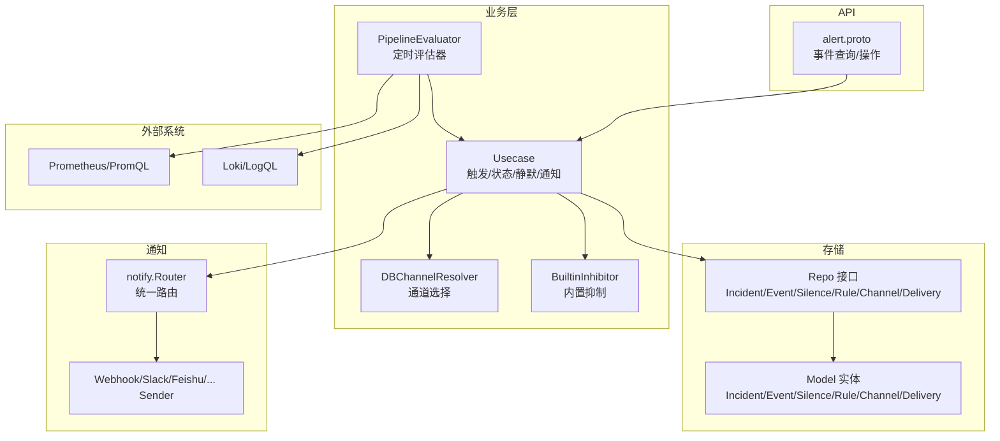
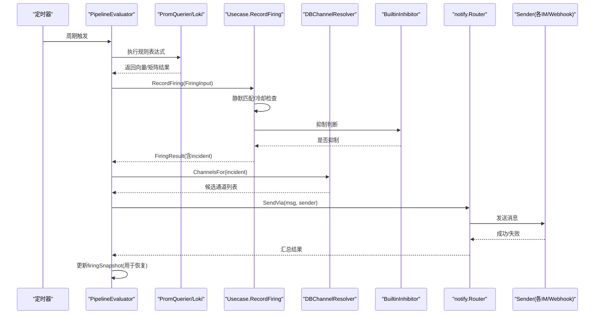
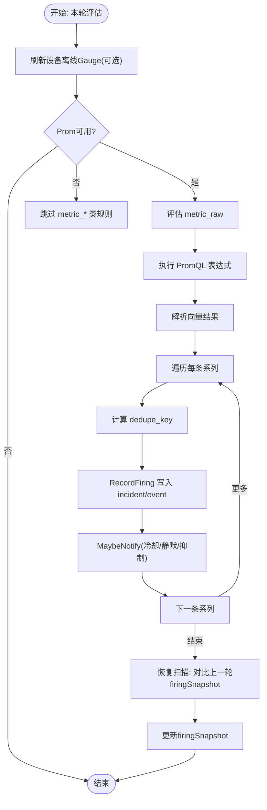
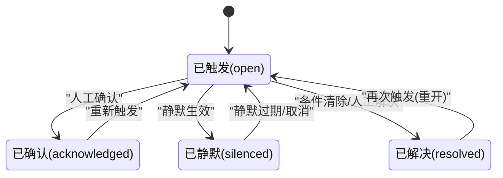
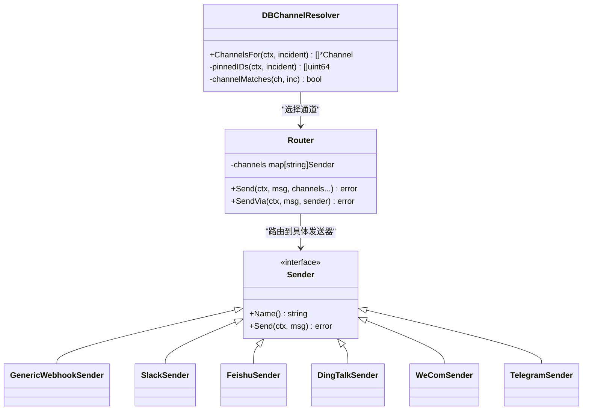
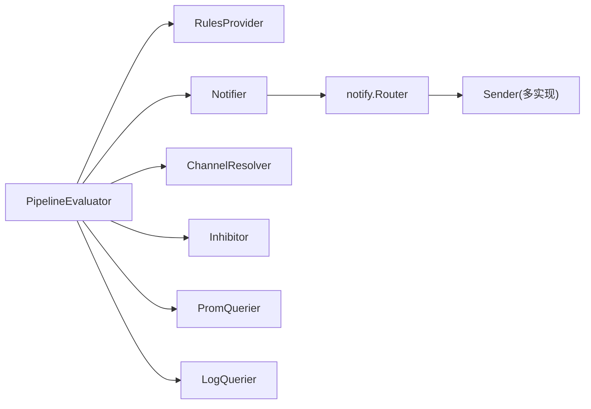

# 告警系统

<cite>
**本文引用的文件**   
- [pipeline.go](file://internal/manager/biz/alert/pipeline.go)
- [usecase.go](file://internal/manager/biz/alert/usecase.go)
- [router.go](file://internal/manager/biz/alert/router.go)
- [inhibit.go](file://internal/manager/biz/alert/inhibit.go)
- [repo.go](file://internal/manager/biz/alert/repo.go)
- [model.go](file://internal/manager/model/alert/model.go)
- [alert.proto](file://api/manager/alert/v1/alert.proto)
- [notify.go](file://internal/pkg/notify/notify.go)
- [webhook.go](file://internal/pkg/notify/webhook.go)
- [main.go](file://cmd/ongrid/main.go)
</cite>

## 目录
1. [简介](#简介)
2. [项目结构](#项目结构)
3. [核心组件](#核心组件)
4. [架构总览](#架构总览)
5. [详细组件分析](#详细组件分析)
6. [依赖关系分析](#依赖关系分析)
7. [性能与可扩展性](#性能与可扩展性)
8. [故障排查指南](#故障排查指南)
9. [结论](#结论)
10. [附录：规则编写最佳实践与风暴治理](#附录：规则编写最佳实践与风暴治理)

## 简介
本文件面向运维与平台工程团队，系统化阐述 Ongrid 告警系统的实现与使用。内容覆盖：
- 告警规则引擎的架构与执行流程（PromQL 规则解析、评估与恢复）
- 告警生命周期管理（触发、抑制、去重、恢复、确认、关闭）
- 多渠道通知机制（Webhook、Slack、飞书、钉钉、企业微信、Telegram）
- 告警路由与分发策略（基于严重度、作用域与规则级通道钉选）
- 告警升级、确认与关闭工作流
- 面向运维的规则编写最佳实践与告警风暴治理方案

## 项目结构
告警子系统位于 manager 层，采用“服务接口 + 业务用例 + 数据仓库”的分层设计：
- API 定义：gRPC 协议描述事件查询与状态变更
- 模型与仓储：Incident/Event/Silence/Rule/Channel/Delivery 等实体与持久化契约
- 业务用例：记录触发、状态迁移、静默匹配、通知投递、重试等
- 管道评估器：定时轮询 Prom/Loki，驱动 metric_raw/anomaly/forecast/burn_rate/log_match/log_volume 等规则
- 通知路由：统一消息体与多通道发送器，支持签名与模板

图表来源
- [alert.proto:1-88](file://api/manager/alert/v1/alert.proto#L1-L88)
- [pipeline.go:1-120](file://internal/manager/biz/alert/pipeline.go#L1-L120)
- [usecase.go:1-120](file://internal/manager/biz/alert/usecase.go#L1-L120)
- [router.go:1-60](file://internal/manager/biz/alert/router.go#L1-L60)
- [inhibit.go:1-40](file://internal/manager/biz/alert/inhibit.go#L1-L40)
- [repo.go:1-112](file://internal/manager/biz/alert/repo.go#L1-L112)
- [model.go:1-120](file://internal/manager/model/alert/model.go#L1-L120)
- [notify.go:1-90](file://internal/pkg/notify/notify.go#L1-L90)
- [webhook.go:1-155](file://internal/pkg/notify/webhook.go#L1-L155)

章节来源
- [alert.proto:1-88](file://api/manager/alert/v1/alert.proto#L1-L88)
- [pipeline.go:1-120](file://internal/manager/biz/alert/pipeline.go#L1-L120)
- [usecase.go:1-120](file://internal/manager/biz/alert/usecase.go#L1-L120)
- [router.go:1-60](file://internal/manager/biz/alert/router.go#L1-L60)
- [inhibit.go:1-40](file://internal/manager/biz/alert/inhibit.go#L1-L40)
- [repo.go:1-112](file://internal/manager/biz/alert/repo.go#L1-L112)
- [model.go:1-120](file://internal/manager/model/alert/model.go#L1-L120)
- [notify.go:1-90](file://internal/pkg/notify/notify.go#L1-L90)
- [webhook.go:1-155](file://internal/pkg/notify/webhook.go#L1-L155)

## 核心组件
- PipelineEvaluator：按固定间隔轮询，驱动各类规则评估；维护上次触发快照以自动恢复
- Usecase：封装触发写入、静默匹配、冷却控制、通知投递、重试与事件记录
- DBChannelResolver：根据严重度、作用域与规则级通道钉选决定目标通道
- BuiltinInhibitor：内置抑制规则（如 edge_offline 抑制同主机子项）
- notify.Router + Sender：统一消息体与多通道发送器（Webhook/Slack/飞书/钉钉/企微/Telegram）
- Repo/Model：统一的持久化契约与实体定义

章节来源
- [pipeline.go:120-220](file://internal/manager/biz/alert/pipeline.go#L120-L220)
- [usecase.go:300-520](file://internal/manager/biz/alert/usecase.go#L300-L520)
- [router.go:60-120](file://internal/manager/biz/alert/router.go#L60-L120)
- [inhibit.go:40-74](file://internal/manager/biz/alert/inhibit.go#L40-L74)
- [notify.go:90-171](file://internal/pkg/notify/notify.go#L90-L171)
- [webhook.go:1-155](file://internal/pkg/notify/webhook.go#L1-L155)
- [repo.go:28-112](file://internal/manager/biz/alert/repo.go#L28-L112)
- [model.go:209-380](file://internal/manager/model/alert/model.go#L209-L380)

## 架构总览
从规则到通知的关键路径：
- 规则加载：缓存启用规则，支持 per-rule 发送策略与通道钉选
- 评估执行：PromQL/LogQL 查询 → 生成 FiringInput → RecordFiring
- 抑制与静默：BuiltinInhibitor 与 Silence 匹配
- 路由与投递：DBChannelResolver 选择通道 → Router 调用具体 Sender
- 恢复检测：比较本次与上次触发集合，缺失即系统恢复

图表来源
- [pipeline.go:147-220](file://internal/manager/biz/alert/pipeline.go#L147-L220)
- [pipeline.go:254-380](file://internal/manager/biz/alert/pipeline.go#L254-L380)
- [usecase.go:315-479](file://internal/manager/biz/alert/usecase.go#L315-L479)
- [router.go:60-120](file://internal/manager/biz/alert/router.go#L60-L120)
- [inhibit.go:44-74](file://internal/manager/biz/alert/inhibit.go#L44-L74)
- [notify.go:92-156](file://internal/pkg/notify/notify.go#L92-L156)

## 详细组件分析

### 规则引擎与评估执行（PipelineEvaluator）
- 支持规则种类：metric_raw、metric_anomaly、metric_forecast、metric_burn_rate、log_match、log_volume、trace_latency、trace_error_rate
- 评估入口：Loop/EvaluateOnce 周期性执行 evaluate()
- PromQL 路径：evaluatePromQuery 将表达式作为谓词，Prom 过滤后返回的每个向量条目视为一次触发；通过 dedupe_key 去重；对比上一轮 firingSnapshot 进行恢复
- 设备离线信号：refreshDeviceStalenessGauge 刷新 device_last_seen_seconds_ago，供 metric_raw 规则消费
- 日志路径：evaluateLogMatch/evaluateLogVolume 通过 LogQuerier 查询最近时间窗

图表来源
- [pipeline.go:170-196](file://internal/manager/biz/alert/pipeline.go#L170-L196)
- [pipeline.go:198-252](file://internal/manager/biz/alert/pipeline.go#L198-L252)
- [pipeline.go:254-380](file://internal/manager/biz/alert/pipeline.go#L254-L380)

章节来源
- [pipeline.go:147-220](file://internal/manager/biz/alert/pipeline.go#L147-L220)
- [pipeline.go:254-380](file://internal/manager/biz/alert/pipeline.go#L254-L380)
- [pipeline.go:418-466](file://internal/manager/biz/alert/pipeline.go#L418-L466)

### 告警生命周期与状态机
- 状态：open → acknowledged/silenced → resolved
- 触发：RecordFiring 创建或重开 incident，并写入 firing/reopened 事件
- 静默：matchSilence 结合 incident.silenced_until 与 active silences
- 冷却：last_notified_at 控制重复通知频率
- 抑制：BuiltinInhibitor 在通知前判定是否屏蔽
- 恢复：PipelineEvaluator 对比 firingSnapshot，缺失则 SystemResolveIncident

图表来源
- [model.go:11-23](file://internal/manager/model/alert/model.go#L11-L23)
- [usecase.go:315-479](file://internal/manager/biz/alert/usecase.go#L315-L479)
- [pipeline.go:355-380](file://internal/manager/biz/alert/pipeline.go#L355-L380)

章节来源
- [model.go:11-23](file://internal/manager/model/alert/model.go#L11-L23)
- [usecase.go:315-479](file://internal/manager/biz/alert/usecase.go#L315-L479)
- [pipeline.go:355-380](file://internal/manager/biz/alert/pipeline.go#L355-L380)

### 渠道路由与分发（DBChannelResolver + notify.Router）
- 路由策略：
  - 严重度门槛：channel.match_severity_min
  - 作用域白名单：channel.match_scope_types
  - 规则级钉选：rule.notify_channel_ids_json 优先于全局筛选
  - 回退：无匹配时使用默认通道名（synthetic channel）
- 发送器：
  - Webhook：通用 JSON 载荷，支持 HMAC 签名
  - Slack：attachments 结构化渲染
  - 飞书：text payload，支持 timestamp+sign
  - 钉钉/企微/Telegram：对应格式与签名
- 发送流程：
  - 持久化通道：BuildSenderFromChannel 构造 Sender，经 Notifier.SendVia 发送
  - 环境变量通道：按名称查找已注册 Sender，经 Notifier.Send 发送
  - 投递记录：每通道一次 delivery 行，成功/失败均写事件

图表来源
- [router.go:31-120](file://internal/manager/biz/alert/router.go#L31-L120)
- [notify.go:39-156](file://internal/pkg/notify/notify.go#L39-L156)
- [webhook.go:18-155](file://internal/pkg/notify/webhook.go#L18-L155)

章节来源
- [router.go:31-120](file://internal/manager/biz/alert/router.go#L31-L120)
- [notify.go:39-156](file://internal/pkg/notify/notify.go#L39-L156)
- [webhook.go:18-155](file://internal/pkg/notify/webhook.go#L18-L155)

### 抑制与静默（BuiltinInhibitor + Silence）
- 内置抑制：
  - host 级别：当存在 edge_offline 活跃事件时，抑制同设备其他 host 告警
  - pipeline 级别：prom_ingest_fail 抑制 scrape_down 系列告警
- 静默：
  - incident 级别：silenced_until 未过期则不再通知
  - 规则/设备/作用域匹配：active silences 表匹配命中则抑制

章节来源
- [inhibit.go:44-74](file://internal/manager/biz/alert/inhibit.go#L44-L74)
- [usecase.go:438-479](file://internal/manager/biz/alert/usecase.go#L438-L479)
- [model.go:269-290](file://internal/manager/model/alert/model.go#L269-L290)

### API 与 HTTP 集成
- gRPC 服务：List/Get/Ack/Resolve Incident
- HTTP 层：封装为 REST 风格，透传到 usecase

章节来源
- [alert.proto:9-88](file://api/manager/alert/v1/alert.proto#L9-L88)

### 启动装配与运行参数
- 初始化：仓库、用例、规则缓存、通道解析器、抑制器、管道评估器、重试 worker
- 关键配置：
  - 评估间隔 Interval
  - 冷却 Cooldown
  - 默认通道 DefaultChannels
  - Prom/Loki 客户端可选注入

章节来源
- [main.go:1022-1050](file://cmd/ongrid/main.go#L1022-L1050)
- [main.go:2623-2662](file://cmd/ongrid/main.go#L2623-L2662)

## 依赖关系分析
- 低耦合：PipelineEvaluator 仅依赖 RulesProvider、Notifier、Resolver、Inhibitor 等窄接口
- 可测试：所有外部依赖均可替换为 fake（评测器、Prom/Loki、通知、仓库）
- 扩展点：新增规则类型只需在 PipelineEvaluator 中增加分支；新增通道只需实现 Sender 并注册

图表来源
- [pipeline.go:49-114](file://internal/manager/biz/alert/pipeline.go#L49-L114)
- [notify.go:39-90](file://internal/pkg/notify/notify.go#L39-L90)

章节来源
- [pipeline.go:49-114](file://internal/manager/biz/alert/pipeline.go#L49-L114)
- [notify.go:39-90](file://internal/pkg/notify/notify.go#L39-L90)

## 性能与可扩展性
- 评估间隔与冷却：合理设置 Interval 与 Cooldown，避免高频重复通知
- 去重键设计：labelSetKey 排除非身份标签，合并同一主体不同采集源
- 恢复检测：基于 firingSnapshot 的差集判定，无需额外状态机
- 异步调查与工作流：仅在首次触发或重开时触发，降低开销
- 重试与投递追踪：delivery 行 + 事件记录，便于观测与排障

[本节为通用指导，不直接分析具体文件]

## 故障排查指南
- 规则未触发：
  - 检查 Prom/Loki 客户端是否注入
  - 查看 evaluatePromQuery 的 WARN 日志与指标
- 通知未送达：
  - 检查通道配置与签名参数
  - 查看 delivery 记录与事件中的错误信息
- 抑制导致无通知：
  - 检查是否存在更高优先级活跃事件（edge_offline/prom_ingest_fail）
- 静默生效：
  - 检查 incident.silenced_until 与 active silences 匹配情况

章节来源
- [pipeline.go:261-380](file://internal/manager/biz/alert/pipeline.go#L261-L380)
- [usecase.go:513-573](file://internal/manager/biz/alert/usecase.go#L513-L573)
- [inhibit.go:44-74](file://internal/manager/biz/alert/inhibit.go#L44-L74)

## 结论
Ongrid 告警系统以“规则即表达式”的简洁范式为核心，通过 PipelineEvaluator 统一调度多种信号源，配合强韧的生命周期管理与灵活的路由分发，实现了高可靠、可观测、易扩展的告警能力。内置抑制与静默机制有效降噪，投递重试与事件审计保障可追溯性。

[本节为总结，不直接分析具体文件]

## 附录：规则编写最佳实践与风暴治理
- 规则编写建议
  - 使用 metric_raw 表达明确谓词，利用 PromQL 的比较运算符让数据源完成过滤
  - 对 host 级别规则务必携带 device_id 标签，确保去重与定位准确
  - 为重要规则提供 runbook_url 与 labels，提升可诊断性
  - 使用 per-rule 发送策略（窗口+最小触发次数）抑制抖动
- 风暴治理
  - 启用内置抑制：edge_offline 抑制同设备噪声；prom_ingest_fail 抑制 scrape_down 泛滥
  - 合理设置冷却时间与静默窗口，避免雪崩式通知
  - 使用通道严重度门槛与作用域白名单收敛通知面
  - 关注 alert_events_total 与 delivery 失败率，及时调优

[本节为通用指导，不直接分析具体文件]