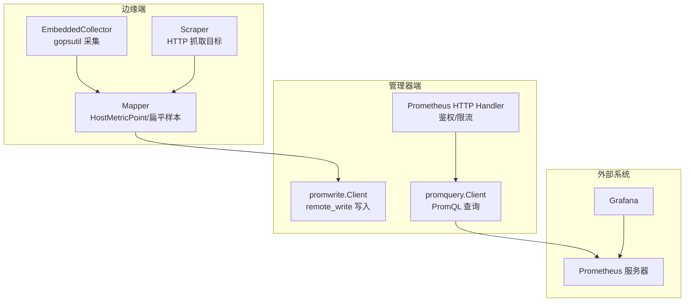
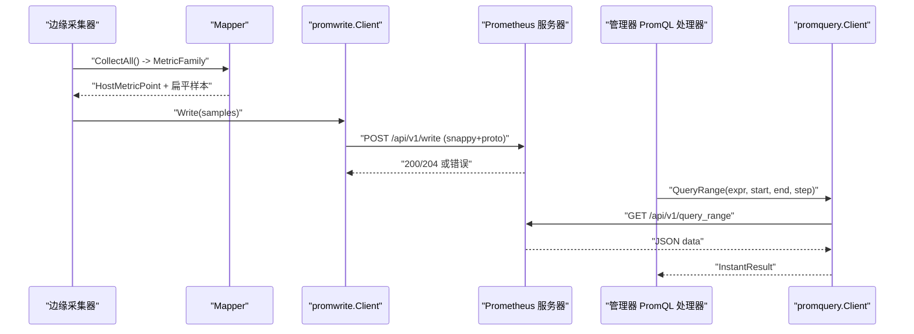
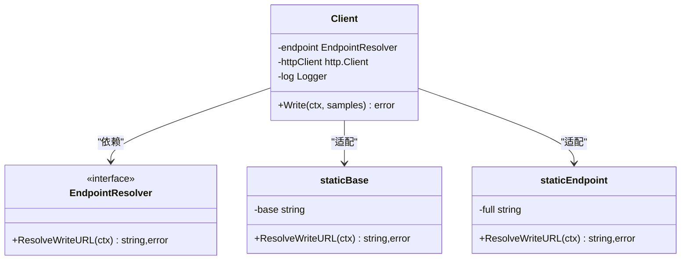
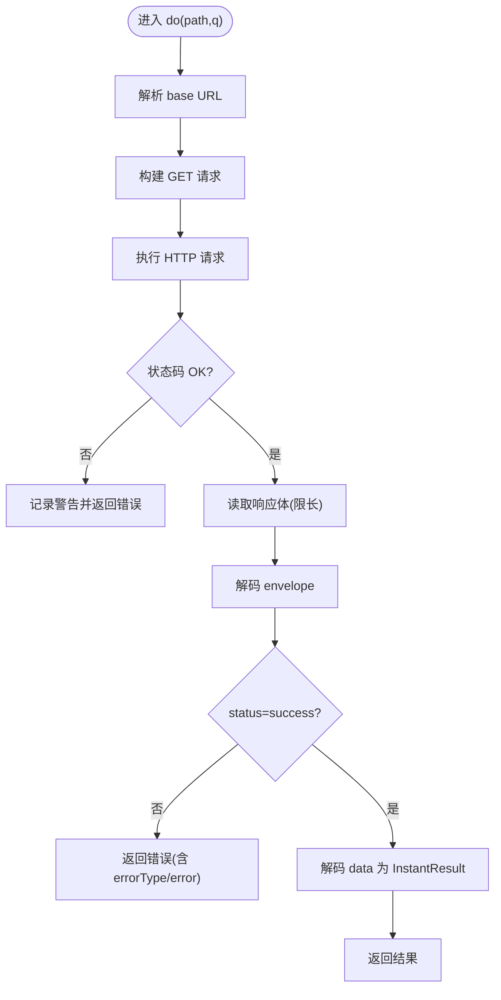
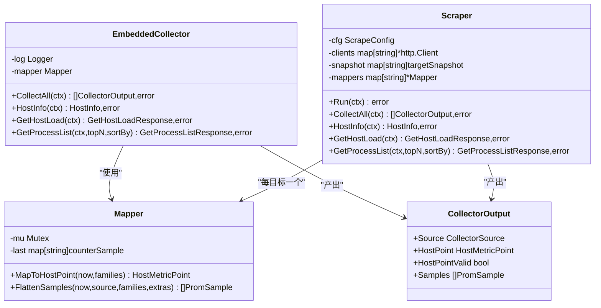
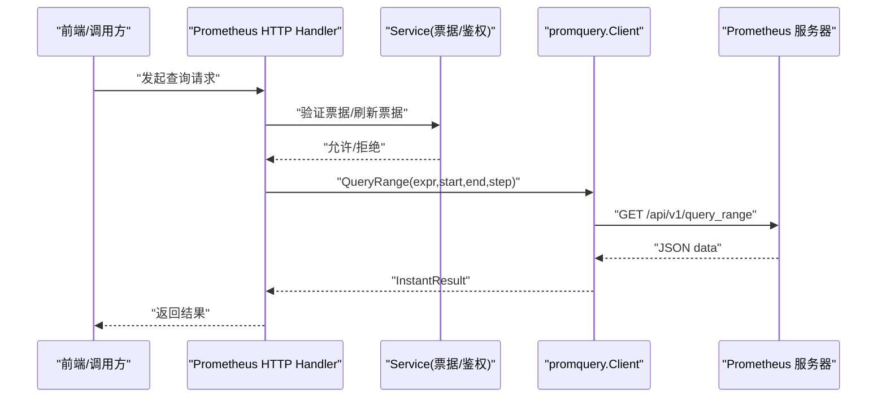
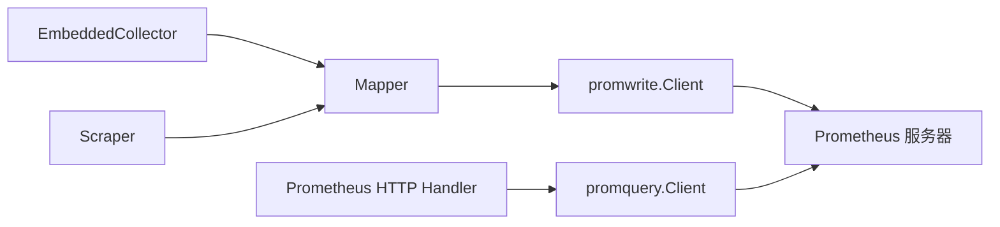

# 指标收集系统

<cite>
**本文引用的文件**   
- [internal/pkg/promwrite/client.go](file://internal/pkg/promwrite/client.go)
- [internal/pkg/promwrite/proto.go](file://internal/pkg/promwrite/proto.go)
- [internal/pkg/promquery/client.go](file://internal/pkg/promquery/client.go)
- [internal/edgeagent/collector/embedded.go](file://internal/edgeagent/collector/embedded.go)
- [internal/edgeagent/collector/scrape.go](file://internal/edgeagent/collector/scrape.go)
- [internal/edgeagent/collector/mapper.go](file://internal/edgeagent/collector/mapper.go)
- [internal/edgeagent/collector/types.go](file://internal/edgeagent/collector/types.go)
- [internal/manager/server/prometheus/http.go](file://internal/manager/server/prometheus/http.go)
- [deploy/grafana/provisioning/datasources/prometheus.yml](file://deploy/grafana/provisioning/datasources/prometheus.yml)
</cite>

## 目录
1. [简介](#简介)
2. [项目结构](#项目结构)
3. [核心组件](#核心组件)
4. [架构总览](#架构总览)
5. [详细组件分析](#详细组件分析)
6. [依赖关系分析](#依赖关系分析)
7. [性能与存储策略](#性能与存储策略)
8. [故障排查指南](#故障排查指南)
9. [结论](#结论)
10. [附录：Grafana 配置与仪表板模板](#附录grafana-配置与仪表板模板)

## 简介
本文件面向开发者与运维人员，系统化阐述指标收集系统的实现与使用。重点覆盖：
- Prometheus 集成架构：写入客户端（promwrite）与查询客户端（promquery）的设计与调用链
- 时序数据在边缘侧的采集、映射与扁平化流程
- 内置采集器（CPU、内存、网络、磁盘、负载等）与基于 HTTP 的抓取模式
- 自定义插件扩展机制与最佳实践
- PromQL 查询语法要点与性能优化技巧
- Grafana 数据源配置与仪表板模板使用指引

## 项目结构
指标相关代码主要分布在以下模块：
- internal/pkg/promwrite：Prometheus remote_write 写入客户端与手写 proto 编码
- internal/pkg/promquery：Prometheus HTTP 查询客户端（/api/v1/query、/api/v1/query_range）
- internal/edgeagent/collector：边缘侧采集器（嵌入式 gopsutil 读取 + HTTP scrape），以及将 MetricFamily 映射为 HostMetricPoint 和扁平样本
- internal/manager/server/prometheus：管理器侧对 PromQL 的轻量封装与鉴权票据流转
- deploy/grafana/provisioning/datasources：Grafana 数据源预配置

图表来源
- [internal/edgeagent/collector/embedded.go:1-120](file://internal/edgeagent/collector/embedded.go#L1-L120)
- [internal/edgeagent/collector/scrape.go:1-120](file://internal/edgeagent/collector/scrape.go#L1-L120)
- [internal/edgeagent/collector/mapper.go:1-120](file://internal/edgeagent/collector/mapper.go#L1-L120)
- [internal/pkg/promwrite/client.go:1-120](file://internal/pkg/promwrite/client.go#L1-L120)
- [internal/pkg/promquery/client.go:1-120](file://internal/pkg/promquery/client.go#L1-L120)
- [internal/manager/server/prometheus/http.go:1-45](file://internal/manager/server/prometheus/http.go#L1-L45)

章节来源
- [internal/edgeagent/collector/embedded.go:1-120](file://internal/edgeagent/collector/embedded.go#L1-L120)
- [internal/edgeagent/collector/scrape.go:1-120](file://internal/edgeagent/collector/scrape.go#L1-L120)
- [internal/edgeagent/collector/mapper.go:1-120](file://internal/edgeagent/collector/mapper.go#L1-L120)
- [internal/pkg/promwrite/client.go:1-120](file://internal/pkg/promwrite/client.go#L1-L120)
- [internal/pkg/promquery/client.go:1-120](file://internal/pkg/promquery/client.go#L1-L120)
- [internal/manager/server/prometheus/http.go:1-45](file://internal/manager/server/prometheus/http.go#L1-L45)

## 核心组件
- promwrite 客户端
  - 职责：构造并发送 Prometheus remote_write 请求（snappy 压缩、protobuf 编码）
  - 关键特性：EndpointResolver 动态解析写地址；每 Sample 作为独立 TimeSeries 发送；错误响应体截断日志
- promquery 客户端
  - 职责：封装 /api/v1/query 与 /api/v1/query_range，返回 InstantResult（保留原始 JSON）
  - 关键特性：BaseURLResolver 动态解析基础地址；范围查询参数校验；响应体大小上限保护
- 边缘采集器
  - EmbeddedCollector：通过 gopsutil 直接读取 CPU/内存/负载/网络/磁盘/时间等指标，输出 node_exporter 兼容命名
  - Scraper：按配置并发抓取多个 HTTP 目标的 text/plain 指标，维护最近快照并按目标产出 CollectorOutput
  - Mapper：从 MetricFamily 计算 8 字段 HostMetricPoint（CPU%、内存使用率、负载、网卡速率、磁盘使用率），并将 MetricFamily 扁平化为 tunnel.PromSample
- 管理器侧 PromQL 处理器
  - 提供最小 PromQL 表面，结合鉴权票据与表达式长度限制，转发到 promquery.Client

章节来源
- [internal/pkg/promwrite/client.go:1-178](file://internal/pkg/promwrite/client.go#L1-L178)
- [internal/pkg/promwrite/proto.go:1-130](file://internal/pkg/promwrite/proto.go#L1-L130)
- [internal/pkg/promquery/client.go:1-168](file://internal/pkg/promquery/client.go#L1-L168)
- [internal/edgeagent/collector/embedded.go:1-200](file://internal/edgeagent/collector/embedded.go#L1-L200)
- [internal/edgeagent/collector/scrape.go:1-200](file://internal/edgeagent/collector/scrape.go#L1-L200)
- [internal/edgeagent/collector/mapper.go:1-120](file://internal/edgeagent/collector/mapper.go#L1-L120)
- [internal/manager/server/prometheus/http.go:1-45](file://internal/manager/server/prometheus/http.go#L1-L45)

## 架构总览
下图展示从边缘采集到远程写入与查询的整体链路，以及管理器侧对 PromQL 的代理能力。

图表来源
- [internal/edgeagent/collector/embedded.go:53-73](file://internal/edgeagent/collector/embedded.go#L53-L73)
- [internal/edgeagent/collector/scrape.go:185-226](file://internal/edgeagent/collector/scrape.go#L185-L226)
- [internal/edgeagent/collector/mapper.go:64-137](file://internal/edgeagent/collector/mapper.go#L64-L137)
- [internal/pkg/promwrite/client.go:126-176](file://internal/pkg/promwrite/client.go#L126-L176)
- [internal/pkg/promquery/client.go:94-117](file://internal/pkg/promquery/client.go#L94-L117)
- [internal/manager/server/prometheus/http.go:28-45](file://internal/manager/server/prometheus/http.go#L28-L45)

## 详细组件分析

### promwrite 写入客户端
- 设计要点
  - EndpointResolver 接口支持静态 URL 与动态解析两种模式，便于热更新远端地址
  - 每个 Sample 被编码为独立 TimeSeries，简化上层聚合逻辑
  - 使用手写 proto 编码器，避免引入庞大依赖；snappy 压缩降低带宽
  - 非 2xx 响应会截取有限长度的响应体用于告警日志，防止 OOM
- 关键数据结构
  - Label、Sample、Client、EndpointResolver
- 错误处理
  - 空样本无操作；解析失败、构建请求失败、HTTP 错误均返回明确错误信息

图表来源
- [internal/pkg/promwrite/client.go:42-117](file://internal/pkg/promwrite/client.go#L42-L117)
- [internal/pkg/promwrite/client.go:56-77](file://internal/pkg/promwrite/client.go#L56-L77)

章节来源
- [internal/pkg/promwrite/client.go:1-178](file://internal/pkg/promwrite/client.go#L1-L178)
- [internal/pkg/promwrite/proto.go:1-130](file://internal/pkg/promwrite/proto.go#L1-L130)

### promquery 查询客户端
- 设计要点
  - BaseURLResolver 支持静态与动态基础地址解析
  - Query 与 QueryRange 方法分别对应瞬时与范围查询，参数严格校验
  - 返回 InstantResult，保留原始 JSON，便于上层 AI 工具直接使用
  - 响应体最大 8MiB，避免大结果导致内存压力
- 错误处理
  - 非 200/400 状态码视为传输/服务端错误；400 仍尝试解码以暴露错误类型

图表来源
- [internal/pkg/promquery/client.go:119-167](file://internal/pkg/promquery/client.go#L119-L167)

章节来源
- [internal/pkg/promquery/client.go:1-168](file://internal/pkg/promquery/client.go#L1-L168)

### 边缘采集器与映射器
- EmbeddedCollector
  - 通过 gopsutil 直接采集 CPU/内存/负载/网络/磁盘/时间等指标，输出 node_exporter 兼容命名
  - CollectAll 返回单一 CollectorOutput，包含 HostPoint 与 Samples
- Scraper
  - 多目标并发抓取，维护 per-target 快照；CollectAll 按目标返回多个 CollectorOutput
  - 支持 Bearer Token 认证与 TLS 配置
- Mapper
  - 将 MetricFamily 转换为 8 字段 HostMetricPoint（CPU%、内存使用率、负载、网卡速率、磁盘使用率）
  - FlattenSamples 将 MetricFamily 扁平化为 tunnel.PromSample，支持 Gauge/Counter/Summary/Histogram 展开
  - 内部缓存计数器值，计算差值与速率，首调用返回 0

图表来源
- [internal/edgeagent/collector/embedded.go:35-73](file://internal/edgeagent/collector/embedded.go#L35-L73)
- [internal/edgeagent/collector/scrape.go:39-77](file://internal/edgeagent/collector/scrape.go#L39-L77)
- [internal/edgeagent/collector/mapper.go:22-62](file://internal/edgeagent/collector/mapper.go#L22-L62)
- [internal/edgeagent/collector/types.go:21-58](file://internal/edgeagent/collector/types.go#L21-L58)

章节来源
- [internal/edgeagent/collector/embedded.go:1-200](file://internal/edgeagent/collector/embedded.go#L1-L200)
- [internal/edgeagent/collector/scrape.go:1-200](file://internal/edgeagent/collector/scrape.go#L1-L200)
- [internal/edgeagent/collector/mapper.go:1-120](file://internal/edgeagent/collector/mapper.go#L1-L120)
- [internal/edgeagent/collector/types.go:1-58](file://internal/edgeagent/collector/types.go#L1-L58)

### 管理器侧 PromQL 处理器
- 职责
  - 提供最小 PromQL 表面，结合鉴权票据与表达式长度限制，转发到 promquery.Client
- 安全与限流
  - 表达式长度上限（4KiB），避免恶意大表达式
  - 票据刷新与校验接口，确保访问受控

图表来源
- [internal/manager/server/prometheus/http.go:28-45](file://internal/manager/server/prometheus/http.go#L28-L45)
- [internal/pkg/promquery/client.go:104-117](file://internal/pkg/promquery/client.go#L104-L117)

章节来源
- [internal/manager/server/prometheus/http.go:1-45](file://internal/manager/server/prometheus/http.go#L1-L45)
- [internal/pkg/promquery/client.go:94-117](file://internal/pkg/promquery/client.go#L94-L117)

## 依赖关系分析
- 组件耦合
  - promwrite 与 promquery 均为独立包，仅依赖标准库与少量第三方库（snappy、expfmt、client_model）
  - 边缘采集器通过 Mapper 解耦具体指标格式与上层推送逻辑
  - 管理器侧处理器仅依赖 promquery.Client 的最小接口，便于测试替换
- 外部依赖
  - Prometheus 服务器：remote_write 写入与 HTTP 查询
  - Grafana：通过数据源连接 Prometheus 进行可视化

图表来源
- [internal/edgeagent/collector/embedded.go:53-73](file://internal/edgeagent/collector/embedded.go#L53-L73)
- [internal/edgeagent/collector/scrape.go:185-226](file://internal/edgeagent/collector/scrape.go#L185-L226)
- [internal/edgeagent/collector/mapper.go:64-137](file://internal/edgeagent/collector/mapper.go#L64-L137)
- [internal/pkg/promwrite/client.go:126-176](file://internal/pkg/promwrite/client.go#L126-L176)
- [internal/pkg/promquery/client.go:94-117](file://internal/pkg/promquery/client.go#L94-L117)
- [internal/manager/server/prometheus/http.go:28-45](file://internal/manager/server/prometheus/http.go#L28-L45)

章节来源
- [internal/edgeagent/collector/embedded.go:1-200](file://internal/edgeagent/collector/embedded.go#L1-L200)
- [internal/edgeagent/collector/scrape.go:1-200](file://internal/edgeagent/collector/scrape.go#L1-L200)
- [internal/edgeagent/collector/mapper.go:1-120](file://internal/edgeagent/collector/mapper.go#L1-L120)
- [internal/pkg/promwrite/client.go:1-178](file://internal/pkg/promwrite/client.go#L1-L178)
- [internal/pkg/promquery/client.go:1-168](file://internal/pkg/promquery/client.go#L1-L168)
- [internal/manager/server/prometheus/http.go:1-45](file://internal/manager/server/prometheus/http.go#L1-L45)

## 性能与存储策略
- 写入路径
  - 每 Sample 作为独立 TimeSeries 发送，减少上层聚合开销；snappy 压缩降低网络占用
  - 默认单次写入超时较短（适合小批量），可注入自定义 http.Client 调整
- 查询路径
  - 范围查询默认 30s 超时，适合 Prom 侧常见上限；响应体限制 8MiB
  - 表达式长度限制（4KiB）避免过大查询
- 边缘侧性能
  - EmbeddedCollector 使用 gopsutil 直接读取内核信息，避免额外进程开销
  - Scraper 并发抓取，per-target 快照缓存，避免重复解析
  - Mapper 缓存计数器值，计算差值与速率，首调用返回 0 以避免误判
- 存储与降采样
  - 本项目未实现本地时序存储与降采样算法；数据由 Prometheus 负责持久化与降采样
  - 建议通过 Prometheus 的 retention 与规则进行长期存储与降采样策略配置

[本节为通用指导，不直接分析具体文件]

## 故障排查指南
- promwrite 写入失败
  - 检查 EndpointResolver 返回的 URL 是否正确
  - 关注非 2xx 响应的日志（已截取部分响应体）
  - 确认 snappy 压缩与 Content-Type 头设置正确
- promquery 查询失败
  - 检查 BaseURLResolver 返回的基础地址
  - 范围查询需保证 step > 0 且 end > start
  - 400 状态码可能为 PromQL 解析错误，查看返回的 errorType 与 error
- 边缘采集问题
  - EmbeddedCollector：检查 gopsutil 权限与内核接口可用性
  - Scraper：检查目标可达性、TLS 配置与 Bearer Token 文件内容
  - Mapper：首次调用速率类字段为 0 属正常；若持续为 0，检查上游指标名是否符合 node_exporter 约定

章节来源
- [internal/pkg/promwrite/client.go:126-176](file://internal/pkg/promwrite/client.go#L126-L176)
- [internal/pkg/promquery/client.go:119-167](file://internal/pkg/promquery/client.go#L119-L167)
- [internal/edgeagent/collector/scrape.go:117-183](file://internal/edgeagent/collector/scrape.go#L117-L183)
- [internal/edgeagent/collector/mapper.go:233-307](file://internal/edgeagent/collector/mapper.go#L233-L307)

## 结论
本指标收集系统通过轻量化的 promwrite/promquery 客户端与灵活的边缘采集器，实现了从主机与外部目标的高效指标采集与写入，并在管理器侧提供安全的 PromQL 查询入口。配合 Grafana 的数据源与仪表板模板，可快速搭建端到端的监控体系。对于大规模部署，建议结合 Prometheus 的存储与降采样策略，以及合理的采集间隔与标签基数控制，以获得稳定与高性能的观测体验。

[本节为总结，不直接分析具体文件]

## 附录：Grafana 配置与仪表板模板
- 数据源配置
  - 位置：deploy/grafana/provisioning/datasources/prometheus.yml
  - 说明：预配置 Prometheus 数据源，供 Grafana 启动时自动加载
- 仪表板模板
  - 位置：deploy/grafana/provisioning/dashboards/json/server-detail.json
  - 说明：提供服务器详情仪表板模板，可直接导入使用

章节来源
- [deploy/grafana/provisioning/datasources/prometheus.yml](file://deploy/grafana/provisioning/datasources/prometheus.yml)
- [deploy/grafana/provisioning/dashboards/json/server-detail.json](file://deploy/grafana/provisioning/dashboards/json/server-detail.json)