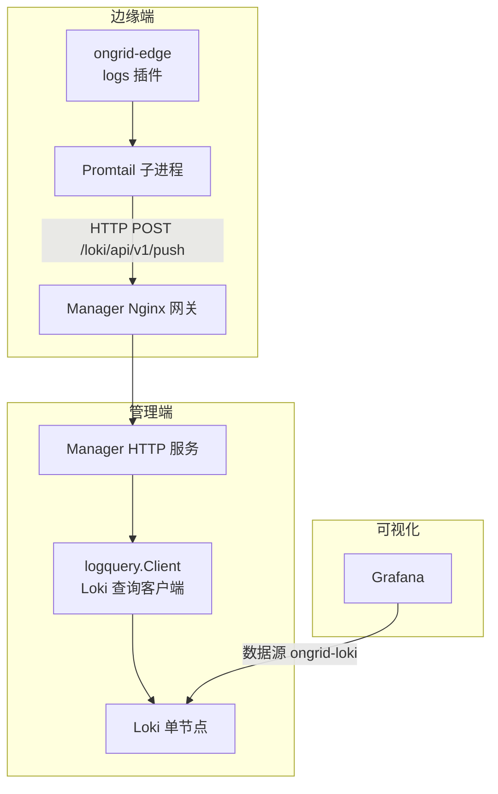
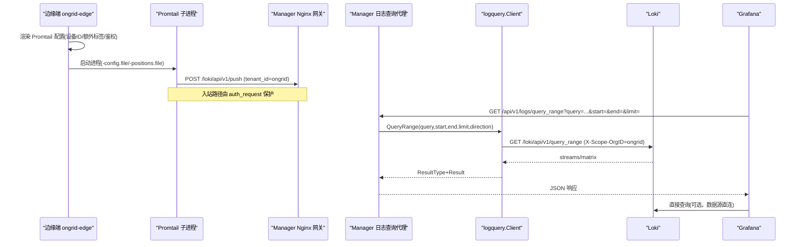
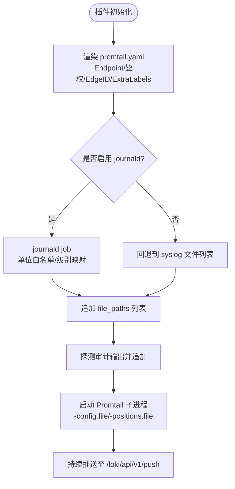
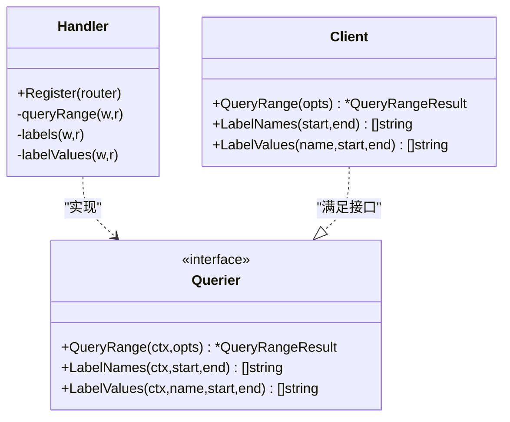
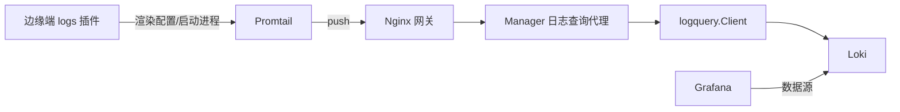

# 日志聚合分析

<cite>
**本文引用的文件**   
- [internal/manager/server/logs/http.go](file://internal/manager/server/logs/http.go)
- [internal/pkg/logquery/client.go](file://internal/pkg/logquery/client.go)
- [internal/edgeagent/plugins/logs/plugin.go](file://internal/edgeagent/plugins/logs/plugin.go)
- [internal/edgeagent/plugins/logs/render.go](file://internal/edgeagent/plugins/logs/render.go)
- [deploy/install/loki-config.yaml](file://deploy/install/loki-config.yaml)
- [deploy/grafana/provisioning/datasources/loki.yml](file://deploy/grafana/provisioning/datasources/loki.yml)
- [cmd/ongrid/main.go](file://cmd/ongrid/main.go)
- [internal/manager/biz/knowledge/builtin_vault/diagnostics/loki-ingestion-backpressure.md](file://internal/manager/biz/knowledge/builtin_vault/diagnostics/loki-ingestion-backpressure.md)
</cite>

## 目录
1. [简介](#简介)
2. [项目结构](#项目结构)
3. [核心组件](#核心组件)
4. [架构总览](#架构总览)
5. [详细组件分析](#详细组件分析)
6. [依赖关系分析](#依赖关系分析)
7. [性能与容量规划](#性能与容量规划)
8. [故障排查指南](#故障排查指南)
9. [结论](#结论)
10. [附录：LogQL 使用与优化、索引与分片、保留策略、Grafana 可视化](#附录logql-使用与优化索引与分片保留策略grafana-可视化)

## 简介
本文件面向运维人员，系统化梳理本项目中基于 Loki 的日志聚合分析方案。内容覆盖采集（边缘端 Promtail）、传输（Nginx 网关 + Manager 代理）、存储与查询（Loki + Grafana），并给出 LogQL 使用建议、索引与分片策略、数据保留策略配置要点，以及 Grafana 数据源与面板集成方法。

## 项目结构
围绕日志子系统的关键代码与配置分布如下：
- 边缘端采集插件：负责生成 Promtail 配置、启动进程、推送日志到 Manager 侧入口
- Manager 侧日志查询代理：将受认证的 SPA 请求转发到 Loki 查询接口
- Loki 客户端库：封装 /query_range、/labels、/label/{name}/values 等 API
- Loki 单节点配置：索引、分片、保留、限流、未来时间戳容忍度等
- Grafana 数据源：通过环境变量注入 Loki URL，默认以代理方式访问

图表来源
- [internal/edgeagent/plugins/logs/plugin.go:1-54](file://internal/edgeagent/plugins/logs/plugin.go#L1-L54)
- [internal/edgeagent/plugins/logs/render.go:30-95](file://internal/edgeagent/plugins/logs/render.go#L30-L95)
- [internal/manager/server/logs/http.go:1-55](file://internal/manager/server/logs/http.go#L1-L55)
- [internal/pkg/logquery/client.go:120-171](file://internal/pkg/logquery/client.go#L120-L171)
- [deploy/install/loki-config.yaml:1-67](file://deploy/install/loki-config.yaml#L1-L67)
- [deploy/grafana/provisioning/datasources/loki.yml:1-19](file://deploy/grafana/provisioning/datasources/loki.yml#L1-L19)

章节来源
- [internal/edgeagent/plugins/logs/plugin.go:1-54](file://internal/edgeagent/plugins/logs/plugin.go#L1-L54)
- [internal/edgeagent/plugins/logs/render.go:30-95](file://internal/edgeagent/plugins/logs/render.go#L30-L95)
- [internal/manager/server/logs/http.go:1-55](file://internal/manager/server/logs/http.go#L1-L55)
- [internal/pkg/logquery/client.go:120-171](file://internal/pkg/logquery/client.go#L120-L171)
- [deploy/install/loki-config.yaml:1-67](file://deploy/install/loki-config.yaml#L1-L67)
- [deploy/grafana/provisioning/datasources/loki.yml:1-19](file://deploy/grafana/provisioning/datasources/loki.yml#L1-L19)

## 核心组件
- 边缘端 logs 插件：根据 Manager 下发的 PluginConfig 渲染 Promtail 配置，启动 Promtail 子进程，按设备维度附加标签后推送至 Manager 的 /loki/api/v1/push
- Manager 日志查询代理：提供认证后的 /v1/logs/* 路由，仅转发查询类 API（不暴露原始 /loki/*）
- logquery 客户端：统一封装 Loki 查询 API，支持 query_range、labels、label values，带超时与结果大小限制
- Loki 单节点：采用 TSDB v13 索引、文件系统后端、compactor 启用保留清理；设置合理的限流、最大流数、未来时间戳容忍窗口
- Grafana 数据源：通过环境变量注入 Loki URL，默认 proxy 模式访问

章节来源
- [internal/edgeagent/plugins/logs/plugin.go:1-54](file://internal/edgeagent/plugins/logs/plugin.go#L1-L54)
- [internal/edgeagent/plugins/logs/render.go:30-95](file://internal/edgeagent/plugins/logs/render.go#L30-L95)
- [internal/manager/server/logs/http.go:1-55](file://internal/manager/server/logs/http.go#L1-L55)
- [internal/pkg/logquery/client.go:120-171](file://internal/pkg/logquery/client.go#L120-L171)
- [deploy/install/loki-config.yaml:1-67](file://deploy/install/loki-config.yaml#L1-L67)
- [deploy/grafana/provisioning/datasources/loki.yml:1-19](file://deploy/grafana/provisioning/datasources/loki.yml#L1-L19)

## 架构总览
下图展示从采集到可视化的端到端流程，包括认证边界与关键参数。

图表来源
- [internal/edgeagent/plugins/logs/render.go:30-95](file://internal/edgeagent/plugins/logs/render.go#L30-L95)
- [internal/manager/server/logs/http.go:51-124](file://internal/manager/server/logs/http.go#L51-L124)
- [internal/pkg/logquery/client.go:120-171](file://internal/pkg/logquery/client.go#L120-L171)
- [deploy/grafana/provisioning/datasources/loki.yml:1-19](file://deploy/grafana/provisioning/datasources/loki.yml#L1-L19)

## 详细组件分析

### 边缘端日志采集器（Promtail 子进程）
- 设计模式：SubprocessPlugin 模板渲染 + 进程托管
- 配置来源：Manager 下发的 PluginConfig（Endpoint、AuthUser/AuthPass、EdgeID、Spec）
- 采集源：
  - journald（默认开启，可按 unit 白名单过滤）
  - 文件路径（file_paths，如应用日志）
  - 审计输出（自动探测 audit.jsonl 并追加）
- 标签策略：device_id、ondir_source、job、unit、identifier、level 等低基数字段
- 推送目标：Manager Nginx 的 /loki/api/v1/push，tenant_id=ongrid

图表来源
- [internal/edgeagent/plugins/logs/plugin.go:27-53](file://internal/edgeagent/plugins/logs/plugin.go#L27-L53)
- [internal/edgeagent/plugins/logs/render.go:97-189](file://internal/edgeagent/plugins/logs/render.go#L97-L189)

章节来源
- [internal/edgeagent/plugins/logs/plugin.go:1-54](file://internal/edgeagent/plugins/logs/plugin.go#L1-L54)
- [internal/edgeagent/plugins/logs/render.go:30-95](file://internal/edgeagent/plugins/logs/render.go#L30-L95)
- [internal/edgeagent/plugins/logs/render.go:97-189](file://internal/edgeagent/plugins/logs/render.go#L97-L189)

### Manager 日志查询代理
- 路由：/v1/logs/query_range、/v1/logs/labels、/v1/logs/labels/{name}/values
- 校验：时间范围解析、limit 范围限制、direction 枚举校验
- 转发：调用 logquery.Client.QueryRange/LabelNames/LabelValues
- 安全：仅对认证用户开放，不暴露原始 /loki/* 查询路径

图表来源
- [internal/manager/server/logs/http.go:28-55](file://internal/manager/server/logs/http.go#L28-L55)
- [internal/pkg/logquery/client.go:120-230](file://internal/pkg/logquery/client.go#L120-L230)

章节来源
- [internal/manager/server/logs/http.go:51-167](file://internal/manager/server/logs/http.go#L51-L167)
- [internal/pkg/logquery/client.go:120-230](file://internal/pkg/logquery/client.go#L120-L230)

### Loki 客户端（logquery.Client）
- 能力：/query_range、/labels、/label/{name}/values
- 参数：query、start/end（纳秒时间戳字符串）、limit、step、direction
- 安全：X-Scope-OrgID=ongrid（与 ingest 侧一致）
- 健壮性：单次请求超时、响应体上限、非 200 状态码告警

章节来源
- [internal/pkg/logquery/client.go:120-230](file://internal/pkg/logquery/client.go#L120-L230)

### Loki 单节点配置（索引/分片/保留/限流）
- 索引与分片：schema v13，TSDB 存储，index_ 前缀，period=24h
- 保留：compactor 启用，retention_period=720h（约30天）
- 限流：ingestion_rate_mb、ingestion_burst_size_mb、max_global_streams_per_user
- 时钟漂移：creation_grace_period=1h，避免未来样本被拒导致 DNS 不可用级联问题

章节来源
- [deploy/install/loki-config.yaml:21-51](file://deploy/install/loki-config.yaml#L21-L51)
- [deploy/install/loki-config.yaml:52-67](file://deploy/install/loki-config.yaml#L52-L67)

### Grafana 数据源与可视化
- 数据源名称：ongrid-loki，access=proxy，URL 由环境变量注入
- 默认 maxLines=5000，timeout=60s
- 可通过环境变量切换外部 Loki 地址或保持内置

章节来源
- [deploy/grafana/provisioning/datasources/loki.yml:1-19](file://deploy/grafana/provisioning/datasources/loki.yml#L1-L19)

## 依赖关系分析
- 边缘端 logs 插件依赖 Manager 下发的 PluginConfig（Endpoint、鉴权、EdgeID、Spec）
- Manager 日志查询代理依赖 logquery.Client，后者依赖 Loki 查询 API
- Grafana 数据源依赖 Loki URL（可内嵌或外部）
- Manager 启动时注入 Loki/Tempo 基础 URL 到系统设置，供动态解析

图表来源
- [internal/edgeagent/plugins/logs/render.go:30-95](file://internal/edgeagent/plugins/logs/render.go#L30-L95)
- [internal/manager/server/logs/http.go:51-124](file://internal/manager/server/logs/http.go#L51-L124)
- [internal/pkg/logquery/client.go:120-171](file://internal/pkg/logquery/client.go#L120-L171)
- [deploy/grafana/provisioning/datasources/loki.yml:1-19](file://deploy/grafana/provisioning/datasources/loki.yml#L1-L19)

章节来源
- [cmd/ongrid/main.go:457-476](file://cmd/ongrid/main.go#L457-L476)
- [cmd/ongrid/main.go:478-530](file://cmd/ongrid/main.go#L478-L530)

## 性能与容量规划
- 采集侧
  - 控制 label 基数：device_id、service、host 等低基数字段；高基数信息放入日志正文
  - 合理划分 job：按文件或 unit 拆分，避免过多细粒度 job
  - 批处理：Promtail batchsize/batchwait 已内置，结合网络带宽调整
- 传输侧
  - Nginx 网关需具备足够并发与连接池；确保 /loki/api/v1/push 路径鉴权不影响吞吐
- 存储与查询
  - 限制 limit（代理层已做 1..5000 校验），避免大窗口全量扫描
  - 使用 direction=backward 优先返回最新行，提升排障效率
  - 合理设置 retention_period 与 compactor 工作目录空间
- 资源与限流
  - ingestion_rate_mb/ingestion_burst_size_mb 按实际峰值设定
  - max_global_streams_per_user 作为 cardinality 守门

[本节为通用指导，无需源码引用]

## 故障排查指南
- 现象：日志缺失、Promtail 报 429、Loki 内存增长
- 定位步骤
  - 确认失败点：查看 Promtail 日志中的 429/out of order/error；查看 Loki metrics 中 loki_discarded_samples_total 的 reason
  - 速率/突发限制：若单一噪声源打满，优先在源头限流；否则提高 ingestion_rate_mb/ingestion_burst_size_mb
  - 基数爆炸：降低 label 基数，将高基数数据下沉到日志正文
  - 时序错乱：保证每个 stream 的时间戳单调递增，修复时钟漂移
- 常见错误对照
  - 429 Too Many Requests → 租户/流速率或突发超限
  - entry out of order/too far behind → 同一 stream 多写入者或时钟偏移
  - stream limit/max streams → label 基数过大
  - 连接拒绝/5xx → distributor/ingester 宕机或过载

章节来源
- [internal/manager/biz/knowledge/builtin_vault/diagnostics/loki-ingestion-backpressure.md:1-76](file://internal/manager/biz/knowledge/builtin_vault/diagnostics/loki-ingestion-backpressure.md#L1-L76)

## 结论
本方案以“边缘 Promtail + Manager 查询代理 + 单节点 Loki + Grafana”为核心链路，兼顾易用性与可扩展性。通过严格的 label 基数治理、合理的保留与限流策略、以及安全的查询代理，可在中小规模场景稳定运行。后续如需横向扩展，可平滑迁移至分布式 Loki 集群并保持上层 API 不变。

[本节为总结，无需源码引用]

## 附录：LogQL 使用与优化、索引与分片、保留策略、Grafana 可视化

### LogQL 使用方法与最佳实践
- 常用操作
  - 文本匹配：|= "error"、|~ "(?i)panic|oom|fatal"
  - 标签选择：{device_id="1"}、{unit="nginx"}
  - 方向与分页：direction=backward、limit=200
- 性能优化
  - 先标签过滤再文本匹配，缩小扫描面
  - 限定时间窗口，避免长尾查询
  - 使用 backward 优先获取最近日志，减少不必要的数据加载
  - 避免在 label 中使用高基数字段，必要时改为正文 grep

[本节为概念性说明，无需源码引用]

### 索引策略与分片管理
- schema v13 + TSDB 索引，index_ 前缀，period=24h
- 建议：
  - 控制 label 数量与基数
  - 合理划分 job，避免过细粒度的 path/unit 组合
  - 监控 index 目录磁盘占用与 compactor 进度

章节来源
- [deploy/install/loki-config.yaml:21-30](file://deploy/install/loki-config.yaml#L21-L30)

### 数据保留策略
- retention_period=720h（约30天）
- compactor 启用，delete_request_store=filesystem
- 建议：
  - 根据合规要求与成本权衡调整 retention_period
  - 预留足够的磁盘空间给 chunks 与 compactor 工作目录

章节来源
- [deploy/install/loki-config.yaml:31-38](file://deploy/install/loki-config.yaml#L31-L38)
- [deploy/install/loki-config.yaml:52-56](file://deploy/install/loki-config.yaml#L52-L56)

### Grafana 可视化与自定义面板
- 数据源：ongrid-loki，access=proxy，URL 由环境变量注入
- 面板开发
  - 使用 Explore 编写并验证 LogQL
  - 将常用查询保存为 Dashboard 面板，复用变量（如 device_id）
  - 注意 maxLines 与 timeout 设置，避免大数据量导致超时
- 常见问题
  - No data：检查时间范围、标签值是否正确、是否存在数据
  - 数据源 UID 漂移：重建数据源后需重新绑定面板

章节来源
- [deploy/grafana/provisioning/datasources/loki.yml:1-19](file://deploy/grafana/provisioning/datasources/loki.yml#L1-L19)