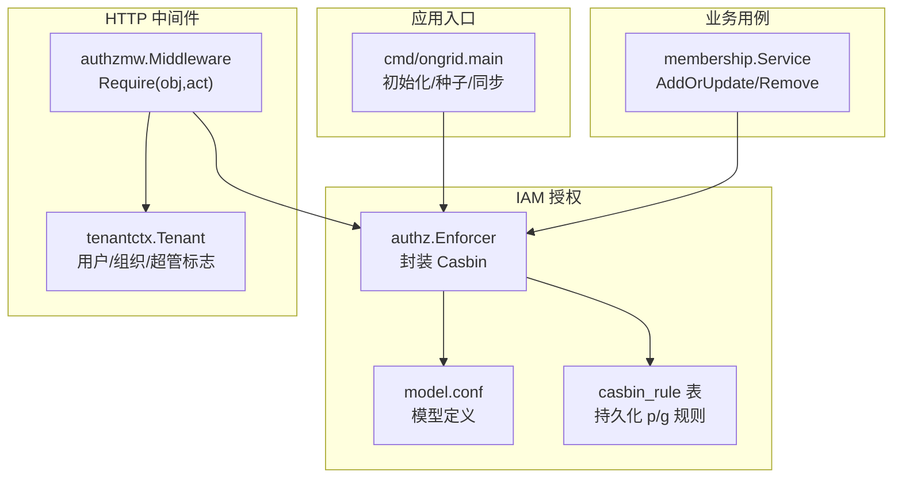
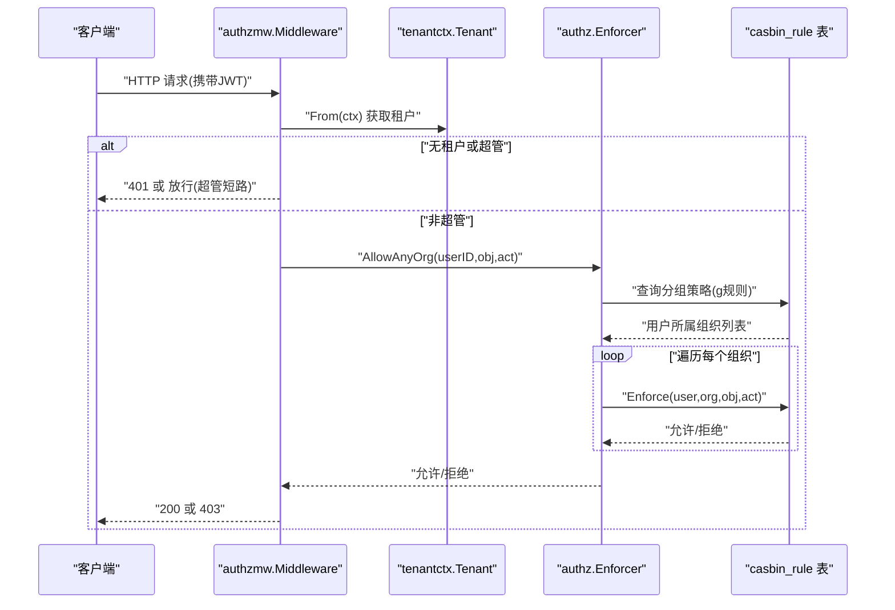
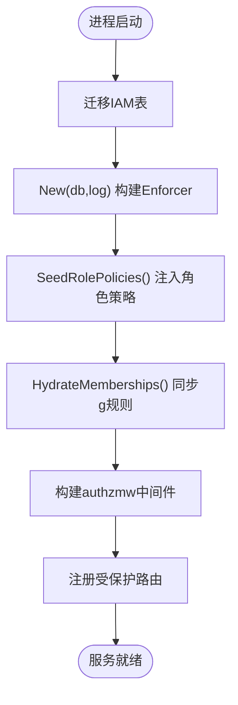
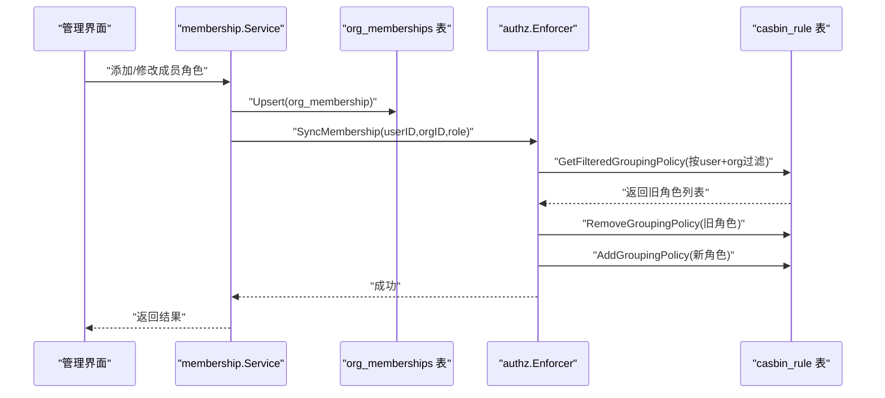
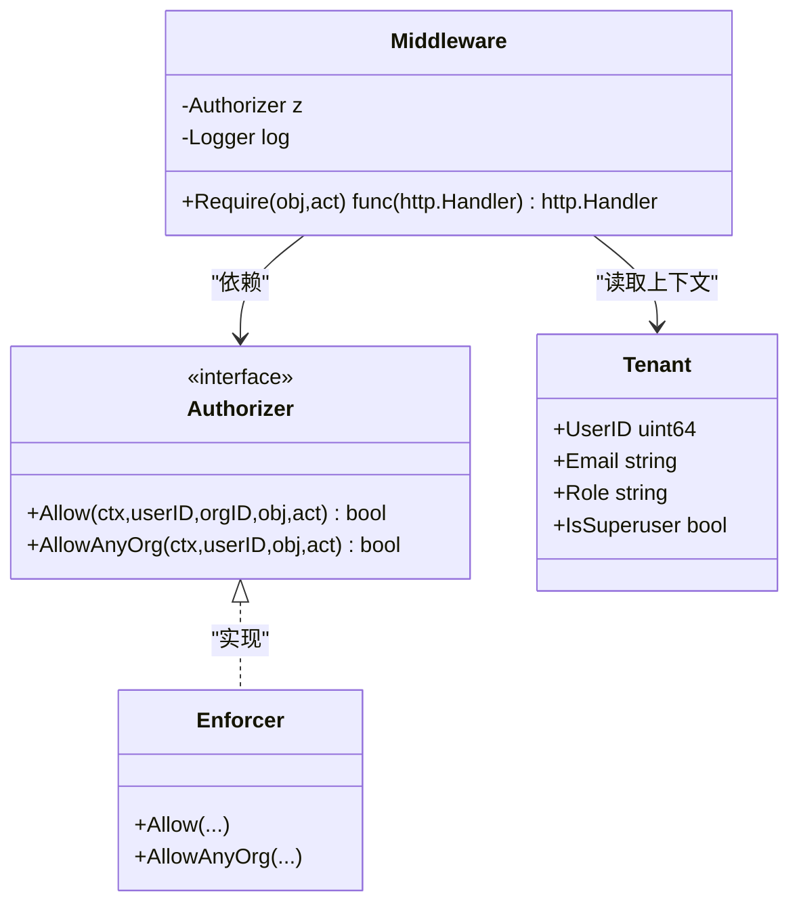
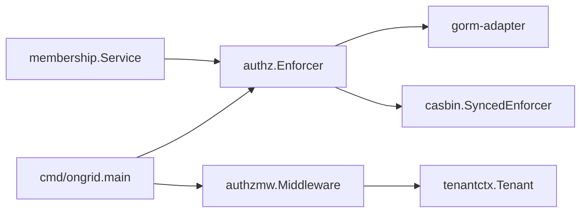

# Casbin集成实现

<cite>
**本文引用的文件**   
- [internal/iam/biz/authz/model.conf](file://internal/iam/biz/authz/model.conf)
- [internal/iam/biz/authz/authz.go](file://internal/iam/biz/authz/authz.go)
- [internal/pkg/authzmw/middleware.go](file://internal/pkg/authzmw/middleware.go)
- [cmd/ongrid/main.go](file://cmd/ongrid/main.go)
- [internal/iam/biz/membership/usecase.go](file://internal/iam/biz/membership/usecase.go)
- [internal/pkg/tenantctx/tenantctx.go](file://internal/pkg/tenantctx/tenantctx.go)
</cite>

## 目录
1. [简介](#简介)
2. [项目结构](#项目结构)
3. [核心组件](#核心组件)
4. [架构总览](#架构总览)
5. [详细组件分析](#详细组件分析)
6. [依赖关系分析](#依赖关系分析)
7. [性能考虑](#性能考虑)
8. [故障排查指南](#故障排查指南)
9. [结论](#结论)
10. [附录](#附录)

## 简介
本文件系统化梳理项目中基于 Casbin 的权限引擎集成方案，覆盖 Enforcer 初始化、模型与策略配置、p/g 规则语义、多租户域隔离、同步加载流程、运行时更新机制、自定义策略编写建议、冲突解决与调试方法，以及性能优化要点。目标是帮助读者快速理解并正确扩展该权限子系统。

## 项目结构
Casbin 相关代码集中在 IAM 子域与通用中间件层：
- 模型与策略定义位于 iam/biz/authz 包内，包含嵌入的 model.conf 与 Enforcer 封装。
- HTTP 鉴权中间件位于 pkg/authzmw，负责从请求上下文提取租户信息并调用 Enforcer 进行决策。
- 启动引导在 cmd/ongrid/main.go 中完成 Enforcer 构建、角色策略注入、成员关系同步等。
- 成员关系变更通过 iam/biz/membership 用例触发 g 规则的增删改，保证数据库与策略一致。
- 租户上下文由 pkg/tenantctx 提供，贯穿认证与鉴权链路。



图表来源
- [internal/iam/biz/authz/authz.go:64-84](file://internal/iam/biz/authz/authz.go#L64-L84)
- [internal/iam/biz/authz/model.conf:1-15](file://internal/iam/biz/authz/model.conf#L1-L15)
- [internal/pkg/authzmw/middleware.go:70-97](file://internal/pkg/authzmw/middleware.go#L70-L97)
- [internal/pkg/tenantctx/tenantctx.go:21-49](file://internal/pkg/tenantctx/tenantctx.go#L21-L49)
- [internal/iam/biz/membership/usecase.go:44-73](file://internal/iam/biz/membership/usecase.go#L44-L73)
- [cmd/ongrid/main.go:305-333](file://cmd/ongrid/main.go#L305-L333)

章节来源
- [internal/iam/biz/authz/authz.go:1-316](file://internal/iam/biz/authz/authz.go#L1-L316)
- [internal/iam/biz/authz/model.conf:1-15](file://internal/iam/biz/authz/model.conf#L1-L15)
- [internal/pkg/authzmw/middleware.go:1-98](file://internal/pkg/authzmw/middleware.go#L1-L98)
- [internal/pkg/tenantctx/tenantctx.go:1-87](file://internal/pkg/tenantctx/tenantctx.go#L1-L87)
- [internal/iam/biz/membership/usecase.go:1-88](file://internal/iam/biz/membership/usecase.go#L1-L88)
- [cmd/ongrid/main.go:305-333](file://cmd/ongrid/main.go#L305-L333)

## 核心组件
- authz.Enforcer：对 casbin.SyncedEnforcer 的轻量封装，提供 Allow/AllowAnyOrg、成员同步、批量撤销等能力；内部使用 gorm-adapter 将策略持久化到 casbin_rule 表。
- model.conf：定义请求、策略、角色、效果与匹配器，支持 domain（组织）维度隔离与资源路径 keyMatch 匹配。
- authzmw.Middleware：HTTP 中间件，从请求上下文读取租户信息，执行超管短路，再调用 Enforcer 做最终决策。
- membership.Service：成员关系用例，任何成员关系变更都会同步到 Casbin g 规则，保持数据源与策略一致。
- tenantctx.Tenant：承载用户 ID、邮箱、角色与是否超管标志，贯穿认证与鉴权链路。

章节来源
- [internal/iam/biz/authz/authz.go:46-84](file://internal/iam/biz/authz/authz.go#L46-L84)
- [internal/iam/biz/authz/model.conf:1-15](file://internal/iam/biz/authz/model.conf#L1-L15)
- [internal/pkg/authzmw/middleware.go:35-97](file://internal/pkg/authzmw/middleware.go#L35-L97)
- [internal/iam/biz/membership/usecase.go:27-73](file://internal/iam/biz/membership/usecase.go#L27-L73)
- [internal/pkg/tenantctx/tenantctx.go:21-49](file://internal/pkg/tenantctx/tenantctx.go#L21-L49)

## 架构总览
下图展示一次受保护 API 请求的完整鉴权流程，包括上下文解析、中间件短路、Enforcer 决策与结果返回。



图表来源
- [internal/pkg/authzmw/middleware.go:70-97](file://internal/pkg/authzmw/middleware.go#L70-L97)
- [internal/iam/biz/authz/authz.go:234-271](file://internal/iam/biz/authz/authz.go#L234-L271)
- [internal/pkg/tenantctx/tenantctx.go:43-49](file://internal/pkg/tenantctx/tenantctx.go#L43-L49)

## 详细组件分析

### 模型与策略定义（model.conf）
- 请求定义 r = sub, dom, obj, act：主体为用户ID字符串，域为组织ID字符串，对象为资源路径，动作为操作类型。
- 策略定义 p = sub, dom, obj, act：与请求一一对应。
- 角色定义 g = _, _, _：表示 (user, role, domain) 三元组。
- 效果 e = some(where (p.eft == allow))：任一匹配即允许。
- 匹配器 m：
  - 要求主体属于指定域的角色：g(r.sub, p.sub, r.dom)
  - 域匹配：p.dom 为通配符或等于 r.dom
  - 资源匹配：p.obj 为通配符或使用 keyMatch 匹配 r.obj
  - 动作匹配：p.act 为通配符或等于 r.act

实践要点
- 使用 "*" 作为域通配可简化全局角色策略（如 superuser）。
- 资源路径建议使用统一前缀（如 edge:*、knowledge:doc），配合 keyMatch 实现层级匹配。
- 动作词汇建议收敛为 read/write/delete/manage/exec 等，便于管理。

章节来源
- [internal/iam/biz/authz/model.conf:1-15](file://internal/iam/biz/authz/model.conf#L1-L15)

### Enforcer 初始化与启动流程
- 构造适配器：通过 gorm-adapter 连接现有数据库，自动创建 casbin_rule 表。
- 加载模型：从嵌入的 model.conf 构建模型。
- 创建 Enforcer：使用 NewSyncedEnforcer 创建线程安全实例。
- 加载策略：LoadPolicy 从 casbin_rule 表载入已有策略。
- 种子角色策略：SeedRolePolicies 幂等写入内置角色矩阵（如 org_admin/member/viewer/superuser）。
- 同步成员关系：HydrateMemberships 将当前所有 OrgMembership 映射为 g 规则。

启动顺序（应用入口）
- 迁移 IAM 表
- 构建 Enforcer
- 注入角色策略
- 同步成员关系
- 构建中间件并挂载路由



图表来源
- [internal/iam/biz/authz/authz.go:64-84](file://internal/iam/biz/authz/authz.go#L64-L84)
- [internal/iam/biz/authz/authz.go:112-143](file://internal/iam/biz/authz/authz.go#L112-L143)
- [cmd/ongrid/main.go:305-333](file://cmd/ongrid/main.go#L305-L333)

章节来源
- [internal/iam/biz/authz/authz.go:64-84](file://internal/iam/biz/authz/authz.go#L64-L84)
- [cmd/ongrid/main.go:305-333](file://cmd/ongrid/main.go#L305-L333)

### 策略存储机制（p 规则与 g 规则）
- p 规则（权限规则）：由 SeedRolePolicies 注入，描述角色在特定域对资源的动作权限。例如：
  - 管理员可在其域内管理成员与资源
  - 普通成员具备读/写与设备 shell 执行权限
  - 观察者仅具备只读权限
  - 超级用户拥有全量访问
- g 规则（分组规则）：由成员关系驱动，将用户映射到角色与组织，形成 (user, role, org) 三元组。

一致性保障
- 成员关系变更时，membership.Service 会调用 Enforcer 的 SyncMembership/RevokeMembership，确保 casbin_rule 与数据库一致。
- 删除组织/用户时，使用 RevokeAllForOrg/RevokeAllForUser 清理对应 g 规则。

章节来源
- [internal/iam/biz/authz/authz.go:86-110](file://internal/iam/biz/authz/authz.go#L86-L110)
- [internal/iam/biz/authz/authz.go:145-210](file://internal/iam/biz/authz/authz.go#L145-L210)
- [internal/iam/biz/membership/usecase.go:44-73](file://internal/iam/biz/membership/usecase.go#L44-L73)

### 同步策略加载过程（启动注入与运行时更新）
- 启动时：
  - LoadPolicy 从 casbin_rule 表加载历史策略
  - SeedRolePolicies 幂等写入内置角色矩阵
  - HydrateMemberships 将全部成员关系映射为 g 规则
- 运行时：
  - AddOrUpdate：先落库，再调用 SyncMembership 替换旧角色并插入新角色
  - Remove：先落库，再调用 RevokeMembership 删除对应 g 规则
  - 删除组织/用户：批量清理 g 规则



图表来源
- [internal/iam/biz/membership/usecase.go:44-73](file://internal/iam/biz/membership/usecase.go#L44-L73)
- [internal/iam/biz/authz/authz.go:145-169](file://internal/iam/biz/authz/authz.go#L145-L169)

章节来源
- [internal/iam/biz/authz/authz.go:112-143](file://internal/iam/biz/authz/authz.go#L112-L143)
- [internal/iam/biz/membership/usecase.go:44-73](file://internal/iam/biz/membership/usecase.go#L44-L73)

### 多租户域隔离（domain 参数与资源路径匹配）
- 模型中 r/dom/p.dom 参与匹配，支持“*”通配与精确匹配。
- 匹配器要求主体必须在目标域具有角色（g(r.sub, p.sub, r.dom)），从而实现域级隔离。
- 资源路径采用 keyMatch 匹配，适合以冒号分隔的资源命名空间（如 edge:*、knowledge:doc）。
- 中间件在未显式指定组织时使用 AllowAnyOrg，遍历用户所属组织，首个允许即放行。

```mermaid
flowchart TD
A["r.sub=r.user<br/>r.dom=r.org<br/>r.obj=resource<br/>r.act=action"] --> B["g(r.sub,p.sub,r.dom)<br/>角色归属校验"]
B --> C{"p.dom==\"*\" 或 p.dom==r.dom?"}
C -- 否 --> Deny["拒绝"]
C -- 是 --> D{"p.obj==\"*\" 或 keyMatch(r.obj,p.obj)?"}
D -- 否 --> Deny
D -- 是 --> E{"p.act==\"*\" 或 p.act==r.act?"}
E -- 否 --> Deny
E -- 是 --> Allow["允许"]
```

图表来源
- [internal/iam/biz/authz/model.conf:13-15](file://internal/iam/biz/authz/model.conf#L13-L15)
- [internal/iam/biz/authz/authz.go:249-271](file://internal/iam/biz/authz/authz.go#L249-L271)

章节来源
- [internal/iam/biz/authz/model.conf:1-15](file://internal/iam/biz/authz/model.conf#L1-L15)
- [internal/iam/biz/authz/authz.go:249-271](file://internal/iam/biz/authz/authz.go#L249-L271)

### 中间件与上下文（authzmw + tenantctx）
- 中间件 Require(obj, act) 从上下文中读取 Tenant，若缺失则返回未认证；若为超管则直接放行；否则调用 Enforcer.AllowAnyOrg 进行跨组织判定。
- 失败时记录日志并返回禁止访问。
- Tenant 由认证中间件填充，包含用户ID、邮箱、角色与是否超管标志。



图表来源
- [internal/pkg/authzmw/middleware.go:35-97](file://internal/pkg/authzmw/middleware.go#L35-L97)
- [internal/iam/biz/authz/authz.go:234-271](file://internal/iam/biz/authz/authz.go#L234-L271)
- [internal/pkg/tenantctx/tenantctx.go:21-49](file://internal/pkg/tenantctx/tenantctx.go#L21-L49)

章节来源
- [internal/pkg/authzmw/middleware.go:1-98](file://internal/pkg/authzmw/middleware.go#L1-L98)
- [internal/pkg/tenantctx/tenantctx.go:1-87](file://internal/pkg/tenantctx/tenantctx.go#L1-L87)

### 自定义策略编写指南
- 资源命名规范：建议采用“模块:资源”形式，如 edge:*、knowledge:repo、alert:rule、monitor:panel 等，便于 keyMatch 匹配。
- 动作词汇：建议限定为 read/write/delete/manage/exec，避免过于细粒度导致策略爆炸。
- 角色设计：优先使用角色聚合（如 org_admin/member/viewer），再通过 g 规则绑定用户与组织。
- 域策略：尽量使用 "*" 作为域通配，结合 g 规则限定用户所在组织，减少重复策略。
- 新增策略步骤：
  - 在 SeedRolePolicies 中添加新的 p 规则（幂等）
  - 通过 membership 用例维护 g 规则
  - 在中间件中声明所需 (obj, act)

章节来源
- [internal/iam/biz/authz/authz.go:86-110](file://internal/iam/biz/authz/authz.go#L86-L110)
- [internal/pkg/authzmw/middleware.go:11-24](file://internal/pkg/authzmw/middleware.go#L11-L24)

### 策略冲突解决
- 冲突场景：同一用户对同一资源存在多条 p 规则，可能产生允/拒不一致。
- 解决原则：
  - 明确优先级：更具体的资源/动作规则优先于通配规则
  - 合并同类项：将相近规则合并，减少冗余
  - 审计与回归：变更记录与测试用例，确保变更影响可控
- 工具辅助：
  - 使用 Enforcer 的 GetFilteredGroupingPolicy 与 Add/RemoveGroupingPolicy 进行增量调整
  - 利用中间件的日志输出定位被拒绝的请求

章节来源
- [internal/iam/biz/authz/authz.go:145-210](file://internal/iam/biz/authz/authz.go#L145-L210)
- [internal/pkg/authzmw/middleware.go:90-94](file://internal/pkg/authzmw/middleware.go#L90-L94)

### 调试工具与方法
- 启用日志：中间件在拒绝时会记录用户、对象、动作等信息，便于问题定位。
- 检查策略：
  - 查看 casbin_rule 表中 p/g 规则是否与预期一致
  - 使用 Enforcer 提供的过滤接口查询用户分组策略
- 模拟决策：
  - 通过 Allow/AllowAnyOrg 在测试环境中验证策略组合
  - 针对关键路径编写单元测试，覆盖边界条件

章节来源
- [internal/pkg/authzmw/middleware.go:90-94](file://internal/pkg/authzmw/middleware.go#L90-L94)
- [internal/iam/biz/authz/authz.go:234-271](file://internal/iam/biz/authz/authz.go#L234-L271)

## 依赖关系分析
- authz.Enforcer 依赖 gorm-adapter 与 casbin 核心库，负责策略持久化与决策。
- authzmw.Middleware 依赖 Authorizer 接口与 tenantctx，解耦具体实现。
- membership.Service 依赖 Repo 与 CasbinHook，保证数据与策略一致性。
- 应用入口 cmd/ongrid.main 编排初始化顺序，确保策略在请求处理前就绪。



图表来源
- [cmd/ongrid/main.go:305-333](file://cmd/ongrid/main.go#L305-L333)
- [internal/iam/biz/authz/authz.go:64-84](file://internal/iam/biz/authz/authz.go#L64-L84)
- [internal/pkg/authzmw/middleware.go:35-97](file://internal/pkg/authzmw/middleware.go#L35-L97)
- [internal/iam/biz/membership/usecase.go:44-73](file://internal/iam/biz/membership/usecase.go#L44-L73)

章节来源
- [cmd/ongrid/main.go:305-333](file://cmd/ongrid/main.go#L305-L333)
- [internal/iam/biz/authz/authz.go:64-84](file://internal/iam/biz/authz/authz.go#L64-L84)
- [internal/pkg/authzmw/middleware.go:35-97](file://internal/pkg/authzmw/middleware.go#L35-L97)
- [internal/iam/biz/membership/usecase.go:44-73](file://internal/iam/biz/membership/usecase.go#L44-L73)

## 性能考虑
- 策略规模控制：
  - 使用角色聚合与通配符减少 p 规则数量
  - 限制 g 规则规模，避免大规模成员关系导致查询开销
- 决策路径优化：
  - 优先使用 AllowAnyOrg 在组织维度短路，减少不必要的 Enforce 调用
  - 对热点资源/动作建立缓存（应用层）以降低重复决策成本
- 数据库交互：
  - 批量同步成员关系时采用一次性加载与去重，避免频繁往返
  - 监控 casbin_rule 表增长趋势，定期清理无效规则

[本节为通用指导，不直接分析具体文件]

## 故障排查指南
- 常见症状：
  - 请求被拒绝但策略看似合理：检查中间件日志中的 user/obj/act 字段
  - 超管无法访问：确认 JWT 中 IsSuperuser 标志是否正确设置
  - 成员变更后权限未生效：检查 SyncMembership/RevokeMembership 是否成功
- 定位步骤：
  - 查看 casbin_rule 表中的 p/g 规则是否符合预期
  - 使用 Enforcer 的过滤接口查询用户分组策略
  - 在测试环境复现并打印决策路径

章节来源
- [internal/pkg/authzmw/middleware.go:90-94](file://internal/pkg/authzmw/middleware.go#L90-L94)
- [internal/iam/biz/authz/authz.go:145-210](file://internal/iam/biz/authz/authz.go#L145-L210)

## 结论
本项目通过清晰的模型定义、稳健的初始化流程、一致的同步机制与灵活的中间件设计，构建了可扩展的多租户 RBAC 系统。遵循本文档的实践建议，可在保证安全性的同时提升策略管理与运维效率。

[本节为总结性内容，不直接分析具体文件]

## 附录
- 资源命名约定示例：edge:*、knowledge:doc、alert:rule、agent:custom、monitor:panel、org:*、user:*
- 动作词汇建议：read、write、delete、manage、exec
- 角色建议：org_admin、member、viewer、superuser

[本节为补充说明，不直接分析具体文件]