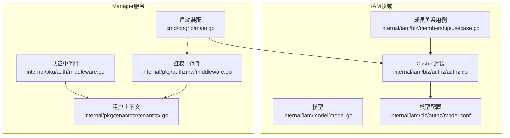
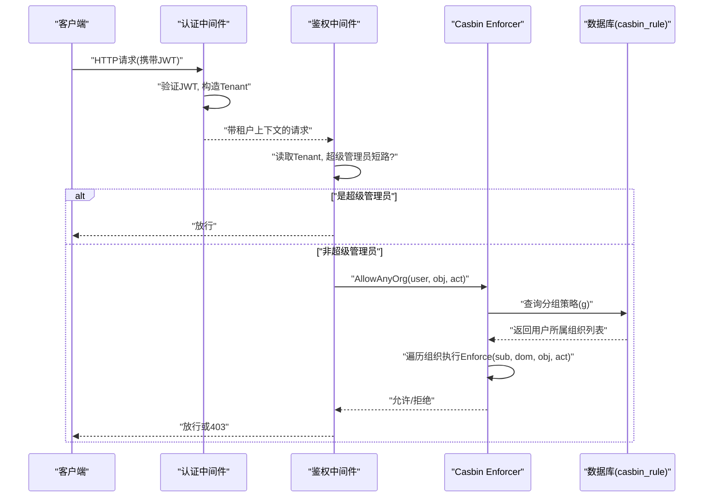
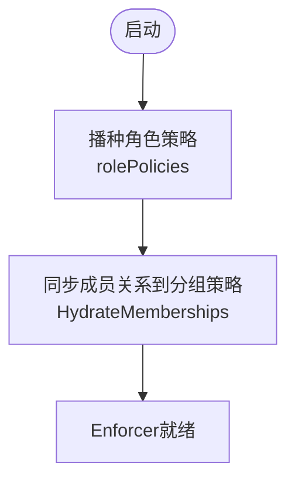
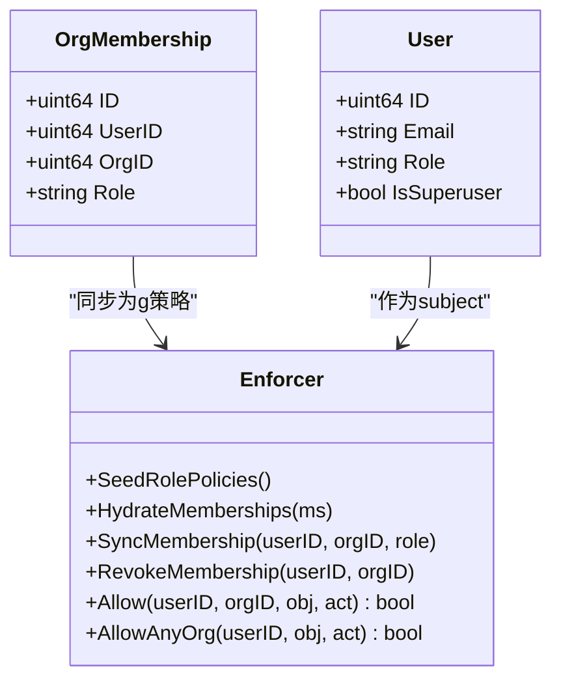
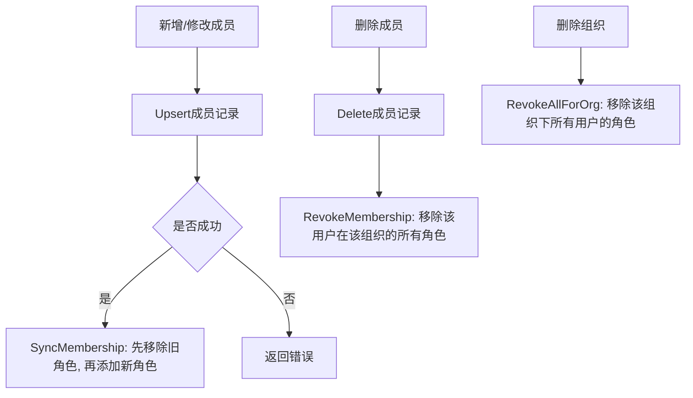
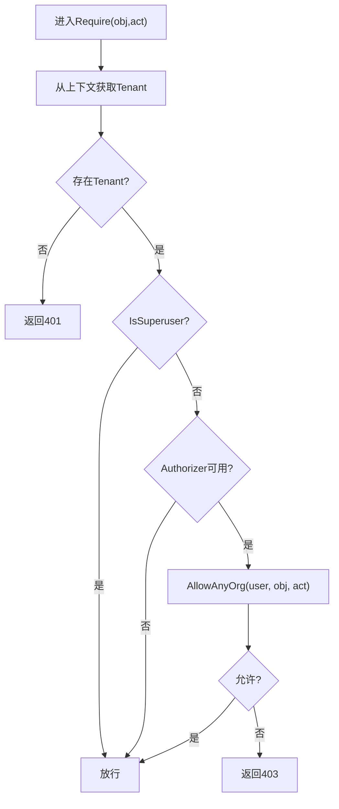
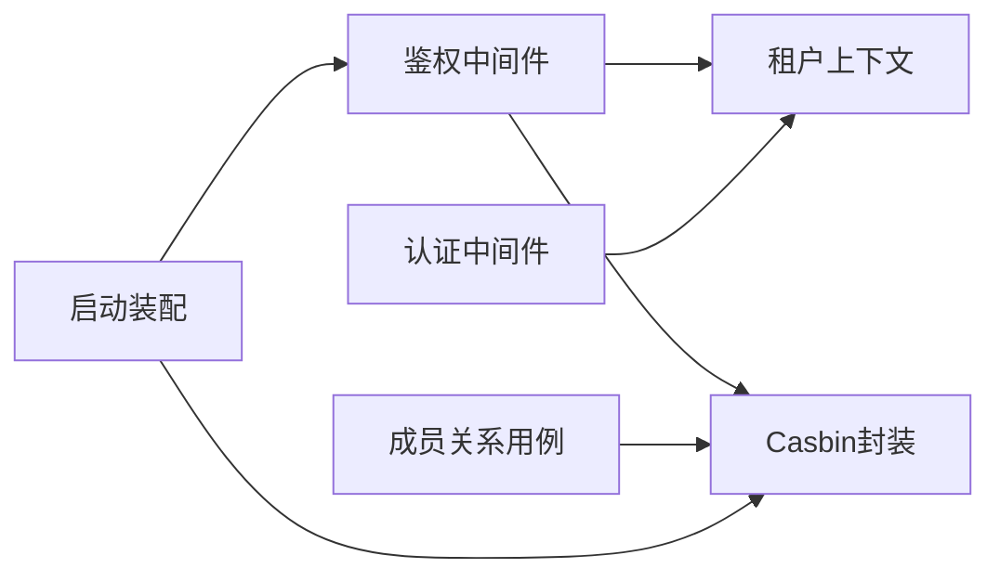

# RBAC权限控制

<cite>
**本文引用的文件**
- [internal/iam/biz/authz/authz.go](file://internal/iam/biz/authz/authz.go)
- [internal/iam/biz/authz/model.conf](file://internal/iam/biz/authz/model.conf)
- [internal/pkg/authzmw/middleware.go](file://internal/pkg/authzmw/middleware.go)
- [internal/pkg/auth/middleware.go](file://internal/pkg/auth/middleware.go)
- [internal/pkg/tenantctx/tenantctx.go](file://internal/pkg/tenantctx/tenantctx.go)
- [internal/iam/model/model.go](file://internal/iam/model/model.go)
- [internal/iam/biz/membership/usecase.go](file://internal/iam/biz/membership/usecase.go)
- [cmd/ongrid/main.go](file://cmd/ongrid/main.go)
</cite>

## 目录
1. [简介](#简介)
2. [项目结构](#项目结构)
3. [核心组件](#核心组件)
4. [架构总览](#架构总览)
5. [详细组件分析](#详细组件分析)
6. [依赖关系分析](#依赖关系分析)
7. [性能考虑](#性能考虑)
8. [故障排查指南](#故障排查指南)
9. [结论](#结论)
10. [附录](#附录)

## 简介
本文件系统性梳理并说明本项目中的基于角色的访问控制（RBAC）体系，重点覆盖：
- 角色定义与权限矩阵（组织级三角色：org_admin、member、viewer）
- Casbin集成实现（模型、策略、规则引擎与决策流程）
- 组织级租户隔离机制
- 权限检查中间件（资源路径匹配、动作类型判断、决策流程）
- 自定义角色与权限扩展指南
- 权限审计与调试工具使用方法

## 项目结构
RBAC相关代码主要分布在以下模块：
- IAM业务域：模型与用例（用户、组织、成员关系），以及Casbin封装
- Manager侧鉴权中间件：将Casbin能力以HTTP中间件形式暴露给路由
- 认证中间件：JWT校验与上下文注入
- 启动装配：在应用启动时初始化Casbin、注入策略与成员关系

**图表来源**
- [internal/iam/biz/authz/authz.go:1-316](file://internal/iam/biz/authz/authz.go#L1-L316)
- [internal/iam/biz/authz/model.conf:1-15](file://internal/iam/biz/authz/model.conf#L1-L15)
- [internal/pkg/authzmw/middleware.go:1-98](file://internal/pkg/authzmw/middleware.go#L1-L98)
- [internal/pkg/auth/middleware.go:1-68](file://internal/pkg/auth/middleware.go#L1-L68)
- [internal/pkg/tenantctx/tenantctx.go:1-87](file://internal/pkg/tenantctx/tenantctx.go#L1-L87)
- [internal/iam/model/model.go:1-140](file://internal/iam/model/model.go#L1-L140)
- [internal/iam/biz/membership/usecase.go:1-88](file://internal/iam/biz/membership/usecase.go#L1-L88)
- [cmd/ongrid/main.go:380-420](file://cmd/ongrid/main.go#L380-L420)

**章节来源**
- [internal/iam/biz/authz/authz.go:1-316](file://internal/iam/biz/authz/authz.go#L1-L316)
- [internal/iam/biz/authz/model.conf:1-15](file://internal/iam/biz/authz/model.conf#L1-L15)
- [internal/pkg/authzmw/middleware.go:1-98](file://internal/pkg/authzmw/middleware.go#L1-L98)
- [internal/pkg/auth/middleware.go:1-68](file://internal/pkg/auth/middleware.go#L1-L68)
- [internal/pkg/tenantctx/tenantctx.go:1-87](file://internal/pkg/tenantctx/tenantctx.go#L1-L87)
- [internal/iam/model/model.go:1-140](file://internal/iam/model/model.go#L1-L140)
- [internal/iam/biz/membership/usecase.go:1-88](file://internal/iam/biz/membership/usecase.go#L1-L88)
- [cmd/ongrid/main.go:380-420](file://cmd/ongrid/main.go#L380-L420)

## 核心组件
- 模型与角色常量
  - 系统级角色：admin、user、viewer（用于用户表列，兼容旧版JWT）
  - 组织成员角色：org_admin、member、viewer（作为Casbin主体名）
- Casbin封装
  - 提供Enforcer实例，管理策略加载、角色策略播种、成员关系同步与授权判定
  - 支持按组织域进行权限判定，并提供“任意组织”判定接口
- 鉴权中间件
  - 从请求上下文中提取用户身份，超级管理员短路放行，否则调用Casbin判定
- 认证中间件
  - 解析JWT，填充租户上下文（用户ID、邮箱、角色、是否超级管理员）
- 成员关系用例
  - 增删改成员时，同步更新Casbin分组策略，保证数据源与策略一致

**章节来源**
- [internal/iam/model/model.go:31-78](file://internal/iam/model/model.go#L31-L78)
- [internal/iam/biz/authz/authz.go:86-125](file://internal/iam/biz/authz/authz.go#L86-L125)
- [internal/iam/biz/authz/authz.go:127-210](file://internal/iam/biz/authz/authz.go#L127-L210)
- [internal/iam/biz/authz/authz.go:233-271](file://internal/iam/biz/authz/authz.go#L233-L271)
- [internal/pkg/authzmw/middleware.go:57-97](file://internal/pkg/authzmw/middleware.go#L57-L97)
- [internal/pkg/auth/middleware.go:21-53](file://internal/pkg/auth/middleware.go#L21-L53)
- [internal/iam/biz/membership/usecase.go:44-73](file://internal/iam/biz/membership/usecase.go#L44-L73)

## 架构总览
RBAC整体流程：
- 客户端携带JWT访问API
- 认证中间件验证JWT并写入租户上下文
- 鉴权中间件读取上下文，若为超级管理员则直接放行；否则调用Casbin进行授权判定
- Casbin根据模型与策略（包含角色-资源-动作矩阵与用户-角色-组织分组）做出允许或拒绝决策
- 成员关系变更通过用例层触发Casbin分组策略同步，确保策略与数据库一致

**图表来源**
- [internal/pkg/auth/middleware.go:21-53](file://internal/pkg/auth/middleware.go#L21-L53)
- [internal/pkg/authzmw/middleware.go:70-97](file://internal/pkg/authzmw/middleware.go#L70-L97)
- [internal/iam/biz/authz/authz.go:233-271](file://internal/iam/biz/authz/authz.go#L233-L271)

## 详细组件分析

### Casbin模型与策略
- 模型定义
  - 请求定义：sub, dom, obj, act
  - 策略定义：p = sub, dom, obj, act
  - 角色定义：g = _, _, _（用户-角色-组织）
  - 匹配器：支持通配符与keyMatch资源匹配
- 内置角色策略矩阵（启动时播种）
  - org_admin：对所在组织内所有资源具备读写与管理能力
  - member：读、写、设备shell执行
  - viewer：仅读
  - superuser：全局全权限（由中间件短路保障）

**图表来源**
- [internal/iam/biz/authz/model.conf:1-15](file://internal/iam/biz/authz/model.conf#L1-L15)
- [internal/iam/biz/authz/authz.go:86-125](file://internal/iam/biz/authz/authz.go#L86-L125)
- [internal/iam/biz/authz/authz.go:127-143](file://internal/iam/biz/authz/authz.go#L127-L143)

**章节来源**
- [internal/iam/biz/authz/model.conf:1-15](file://internal/iam/biz/authz/model.conf#L1-L15)
- [internal/iam/biz/authz/authz.go:86-125](file://internal/iam/biz/authz/authz.go#L86-L125)

### 角色定义与权限矩阵
- 组织成员角色
  - org_admin：可管理组织与成员，拥有组织内全部资源的读写与管理权限
  - member：可对资源进行读、写，并可执行设备shell
  - viewer：只读，不可执行设备shell
- 系统级角色（兼容旧版JWT）
  - admin、user、viewer（影响前端展示与部分逻辑，但实际权限由成员关系+Casbin决定）

**图表来源**
- [internal/iam/model/model.go:80-140](file://internal/iam/model/model.go#L80-L140)
- [internal/iam/biz/authz/authz.go:112-143](file://internal/iam/biz/authz/authz.go#L112-L143)
- [internal/iam/biz/authz/authz.go:145-210](file://internal/iam/biz/authz/authz.go#L145-L210)
- [internal/iam/biz/authz/authz.go:233-271](file://internal/iam/biz/authz/authz.go#L233-L271)

**章节来源**
- [internal/iam/model/model.go:61-78](file://internal/iam/model/model.go#L61-L78)
- [internal/iam/biz/authz/authz.go:86-125](file://internal/iam/biz/authz/authz.go#L86-L125)

### 组织级权限隔离机制
- 使用Casbin的domain字段表示组织ID，所有策略与判定均绑定具体组织
- 成员关系（用户-角色-组织）映射为Casbin分组策略g，确保跨组织的严格隔离
- 当删除组织或用户时，批量清理对应分组策略，避免残留权限

**图表来源**
- [internal/iam/biz/membership/usecase.go:44-73](file://internal/iam/biz/membership/usecase.go#L44-L73)
- [internal/iam/biz/authz/authz.go:145-210](file://internal/iam/biz/authz/authz.go#L145-L210)

**章节来源**
- [internal/iam/biz/membership/usecase.go:44-73](file://internal/iam/biz/membership/usecase.go#L44-L73)
- [internal/iam/biz/authz/authz.go:145-210](file://internal/iam/biz/authz/authz.go#L145-L210)

### 权限检查中间件实现
- 资源命名约定（示例）
  - edge:*、knowledge:doc、knowledge:repo、alert:rule、alert:incident、agent:custom、monitor:panel、org:*、user:*
- 动作词汇
  - read、write、delete、manage、exec（如device:shell）
- 决策流程
  - 无租户上下文 → 401
  - 超级管理员 → 放行
  - Authorizer未注入（兼容模式）→ 放行
  - AllowAnyOrg(user, obj, act) → 允许
  - 其他 → 403

**图表来源**
- [internal/pkg/authzmw/middleware.go:57-97](file://internal/pkg/authzmw/middleware.go#L57-L97)

**章节来源**
- [internal/pkg/authzmw/middleware.go:1-98](file://internal/pkg/authzmw/middleware.go#L1-L98)

### 三种内置角色的权限矩阵与访问级别
- org_admin
  - 组织内资源：读、写、管理
  - 成员管理：可增删改成员
  - 设备shell：可执行
- member
  - 组织内资源：读、写
  - 设备shell：可执行
  - 成员管理：不可
- viewer
  - 组织内资源：仅读
  - 设备shell：不可
  - 成员管理：不可

**章节来源**
- [internal/iam/biz/authz/authz.go:86-125](file://internal/iam/biz/authz/authz.go#L86-L125)

### 自定义角色与权限扩展开发指南
- 新增角色步骤
  - 在模型中定义新的成员角色常量
  - 在角色策略矩阵中添加对应策略行（对象与作用域）
  - 在成员关系用例中增加对该角色的校验
- 扩展资源与动作
  - 在鉴权中间件注释中补充资源命名约定与动作词汇
  - 在路由注册处使用Require("资源:子资源", "动作")进行保护
- 注意事项
  - 保持对象命名规范与动作语义一致性
  - 谨慎授予exec类动作，避免越权风险

**章节来源**
- [internal/iam/model/model.go:61-78](file://internal/iam/model/model.go#L61-L78)
- [internal/iam/biz/authz/authz.go:86-125](file://internal/iam/biz/authz/authz.go#L86-L125)
- [internal/pkg/authzmw/middleware.go:1-24](file://internal/pkg/authzmw/middleware.go#L1-L24)

### 权限审计与调试工具使用方法
- 审计日志
  - 启动阶段构建审计仓储与用例，支持保留天数配置
  - 认证中间件可将登录尝试等事件写入审计
- 调试建议
  - 关注鉴权中间件的拒绝日志（包含用户、对象、动作）
  - 检查Casbin分组策略是否正确同步（用户-角色-组织）
  - 确认资源命名与动作是否符合约定

**章节来源**
- [cmd/ongrid/main.go:409-423](file://cmd/ongrid/main.go#L409-L423)
- [internal/pkg/authzmw/middleware.go:90-97](file://internal/pkg/authzmw/middleware.go#L90-L97)

## 依赖关系分析
- 组件耦合
  - 鉴权中间件依赖租户上下文与Casbin封装
  - 成员关系用例依赖Casbin封装进行策略同步
  - 启动装配负责串联各组件
- 外部依赖
  - Casbin与GORM适配器用于持久化策略
  - JWT签名器用于认证

**图表来源**
- [internal/pkg/authzmw/middleware.go:1-98](file://internal/pkg/authzmw/middleware.go#L1-L98)
- [internal/pkg/auth/middleware.go:1-68](file://internal/pkg/auth/middleware.go#L1-L68)
- [internal/iam/biz/membership/usecase.go:1-88](file://internal/iam/biz/membership/usecase.go#L1-L88)
- [cmd/ongrid/main.go:380-420](file://cmd/ongrid/main.go#L380-L420)

**章节来源**
- [internal/pkg/authzmw/middleware.go:1-98](file://internal/pkg/authzmw/middleware.go#L1-L98)
- [internal/pkg/auth/middleware.go:1-68](file://internal/pkg/auth/middleware.go#L1-L68)
- [internal/iam/biz/membership/usecase.go:1-88](file://internal/iam/biz/membership/usecase.go#L1-L88)
- [cmd/ongrid/main.go:380-420](file://cmd/ongrid/main.go#L380-L420)

## 性能考虑
- Casbin策略加载与同步
  - 启动时一次性播种角色策略与同步成员关系，避免运行时频繁IO
  - 分组策略去重插入，重复操作为幂等
- 授权判定
  - AllowAnyOrg按用户组织列表逐一判定，组织数量通常较小，开销可控
- 建议
  - 合理划分资源粒度，避免过度细粒度的策略导致匹配成本上升
  - 定期清理无效成员关系，减少分组策略规模

[本节为通用指导，不直接分析具体文件]

## 故障排查指南
- 常见问题
  - 401未认证：检查JWT是否有效、是否被认证中间件正确解析
  - 403禁止访问：检查资源命名与动作是否与策略匹配，确认用户是否属于目标组织
  - 策略不一致：检查成员关系变更后是否成功同步到Casbin分组策略
- 定位方法
  - 查看鉴权中间件的拒绝日志
  - 检查Casbin分组策略（用户-角色-组织）
  - 核对资源命名约定与动作词汇

**章节来源**
- [internal/pkg/authzmw/middleware.go:90-97](file://internal/pkg/authzmw/middleware.go#L90-L97)
- [internal/iam/biz/authz/authz.go:145-210](file://internal/iam/biz/authz/authz.go#L145-L210)

## 结论
本项目采用Casbin作为策略引擎，结合组织级成员关系实现严格的RBAC权限控制。通过认证与鉴权中间件的分层设计，既保证了安全性，又提供了灵活的扩展能力。建议在后续演进中持续优化资源与动作的抽象，完善审计与监控，提升可观测性与可维护性。

[本节为总结性内容，不直接分析具体文件]

## 附录
- 资源命名约定（示例）
  - edge:*、knowledge:doc、knowledge:repo、alert:rule、alert:incident、agent:custom、monitor:panel、org:*、user:*
- 动作词汇（示例）
  - read、write、delete、manage、exec

**章节来源**
- [internal/pkg/authzmw/middleware.go:11-24](file://internal/pkg/authzmw/middleware.go#L11-L24)