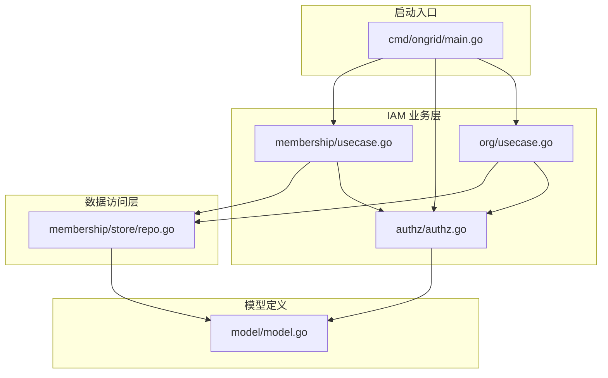
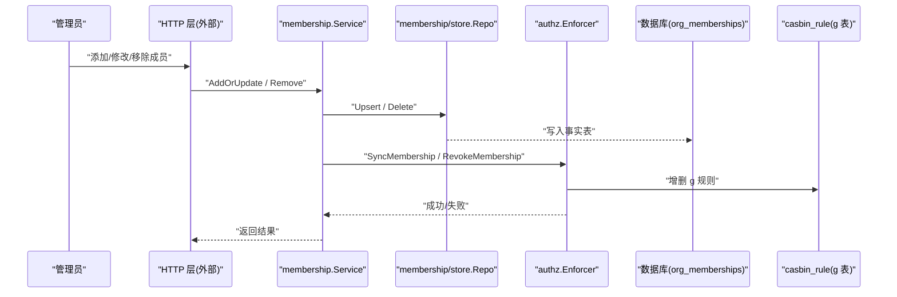
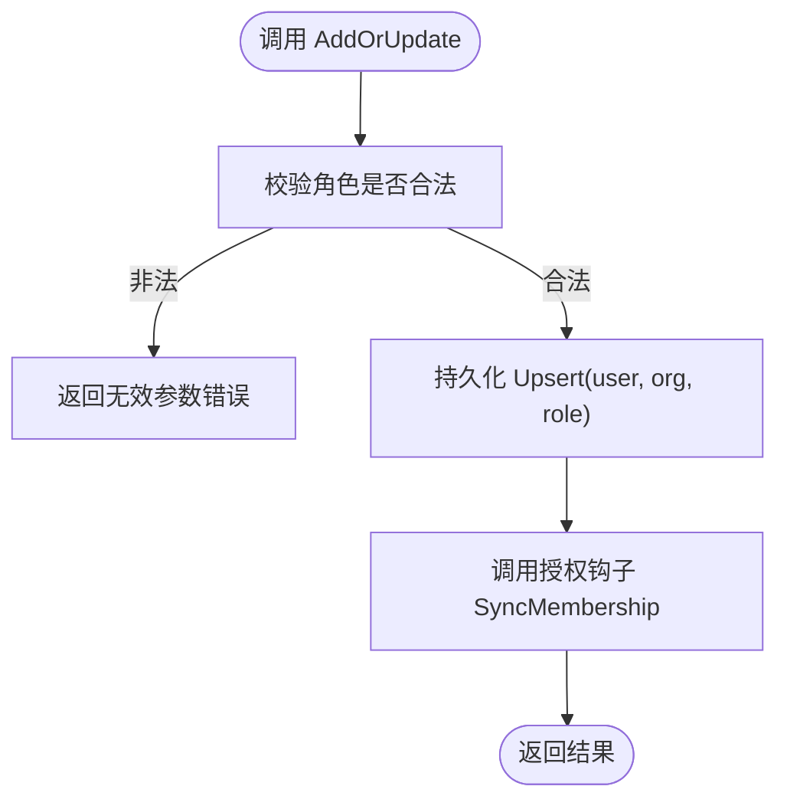
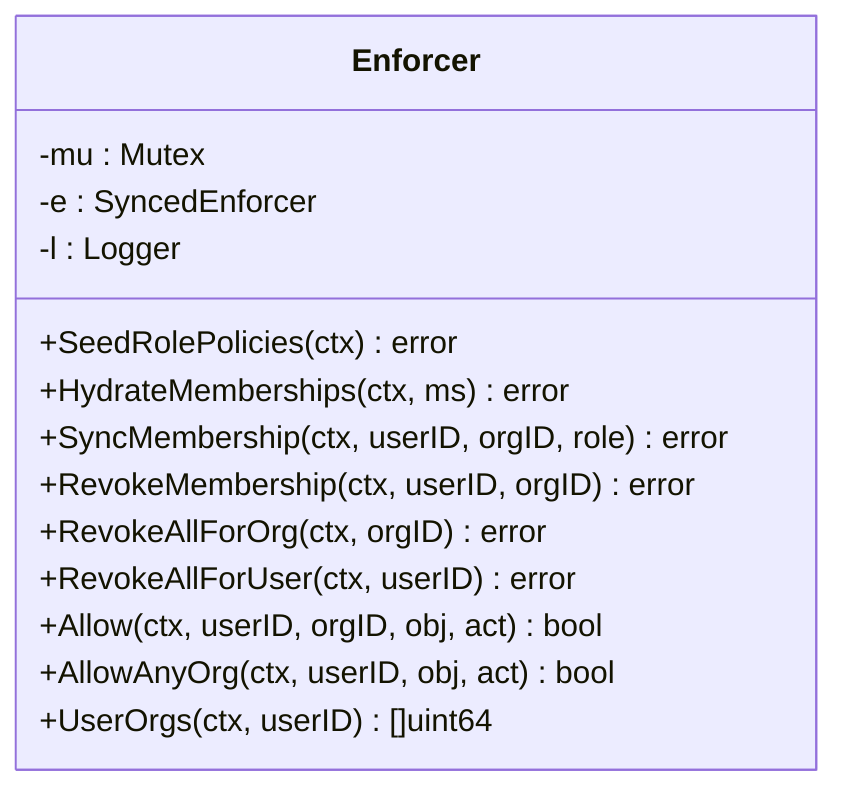
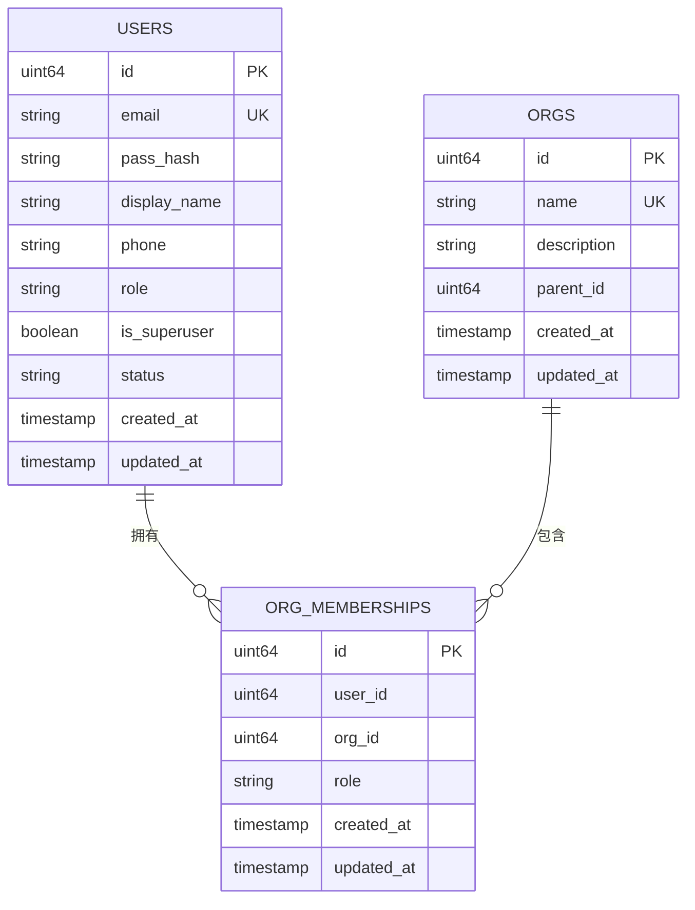
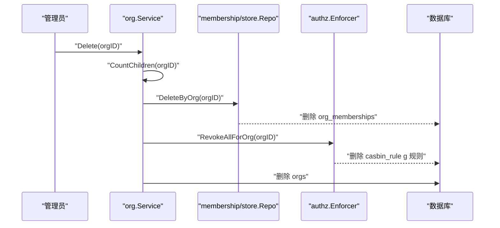
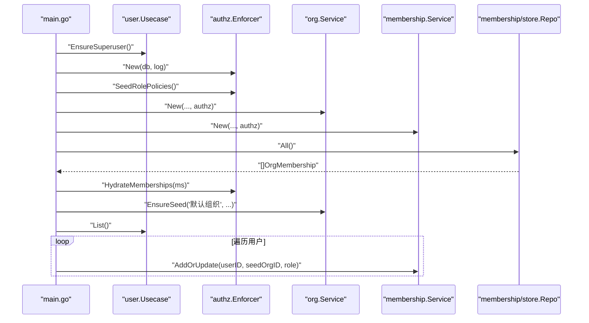
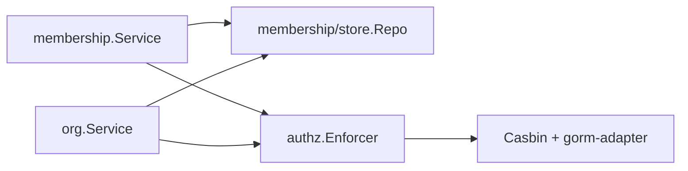

# 成员关系同步

<cite>
**本文引用的文件**
- [internal/iam/biz/membership/usecase.go](file://internal/iam/biz/membership/usecase.go)
- [internal/iam/biz/authz/authz.go](file://internal/iam/biz/authz/authz.go)
- [internal/iam/data/membership/store/repo.go](file://internal/iam/data/membership/store/repo.go)
- [internal/iam/model/model.go](file://internal/iam/model/model.go)
- [internal/iam/biz/org/usecase.go](file://internal/iam/biz/org/usecase.go)
- [cmd/ongrid/main.go](file://cmd/ongrid/main.go)
</cite>

## 目录
1. [简介](#简介)
2. [项目结构](#项目结构)
3. [核心组件](#核心组件)
4. [架构总览](#架构总览)
5. [详细组件分析](#详细组件分析)
6. [依赖分析](#依赖分析)
7. [性能考虑](#性能考虑)
8. [故障排查指南](#故障排查指南)
9. [结论](#结论)

## 简介
本文件聚焦于“成员关系同步机制”，系统性阐述用户与组织关系的维护流程，包括添加成员、修改角色、移除成员等操作对权限系统的影响；深入解析 HydrateMemberships 的批量同步逻辑与 SyncMembership 的增量更新机制；说明组成员关系的缓存策略与一致性保证；解释组织删除和用户删除时的级联清理逻辑；并提供成员权限变更的审计追踪与错误处理建议，以及面向大规模用户组织的性能优化与排障指南。

## 项目结构
与成员关系同步相关的代码主要分布在 IAM 业务层（biz）、数据访问层（data）和模型定义（model），并在启动阶段由主程序完成初始化与回填。

图表来源
- [internal/iam/biz/membership/usecase.go:1-89](file://internal/iam/biz/membership/usecase.go#L1-L89)
- [internal/iam/biz/authz/authz.go:1-316](file://internal/iam/biz/authz/authz.go#L1-L316)
- [internal/iam/data/membership/store/repo.go:1-164](file://internal/iam/data/membership/store/repo.go#L1-L164)
- [internal/iam/model/model.go:1-140](file://internal/iam/model/model.go#L1-L140)
- [internal/iam/biz/org/usecase.go:1-226](file://internal/iam/biz/org/usecase.go#L1-L226)
- [cmd/ongrid/main.go:305-385](file://cmd/ongrid/main.go#L305-L385)

章节来源
- [internal/iam/biz/membership/usecase.go:1-89](file://internal/iam/biz/membership/usecase.go#L1-L89)
- [internal/iam/biz/authz/authz.go:1-316](file://internal/iam/biz/authz/authz.go#L1-L316)
- [internal/iam/data/membership/store/repo.go:1-164](file://internal/iam/data/membership/store/repo.go#L1-L164)
- [internal/iam/model/model.go:1-140](file://internal/iam/model/model.go#L1-L140)
- [internal/iam/biz/org/usecase.go:1-226](file://internal/iam/biz/org/usecase.go#L1-L226)
- [cmd/ongrid/main.go:305-385](file://cmd/ongrid/main.go#L305-L385)

## 核心组件
- 成员关系用例服务（membership.Service）：提供 AddOrUpdate、Remove、ListByOrg、ListByUser、All 等能力，并在每次写入后调用授权钩子以同步 Casbin 分组策略。
- 授权执行器（authz.Enforcer）：封装 Casbin，负责将成员关系映射为 casbin_rule 中的 g 规则，支持批量填充（HydrateMemberships）与单条增量同步（SyncMembership/RevokeMembership）。
- 成员关系存储仓库（membership/store.Repo）：基于 GORM 持久化 org_memberships 表，提供 Upsert、Delete、DeleteByOrg、DeleteByUser、All 等方法。
- 模型（model.OrgMembership 等）：定义用户-组织-角色的三元组及约束，作为“事实表”驱动授权引擎。
- 组织用例服务（org.Service）：在组织删除时级联清理成员关系与授权规则。
- 启动引导（cmd/ongrid/main.go）：按序完成迁移、授权策略播种、成员关系填充、默认组织创建与现有用户回填。

章节来源
- [internal/iam/biz/membership/usecase.go:1-89](file://internal/iam/biz/membership/usecase.go#L1-L89)
- [internal/iam/biz/authz/authz.go:1-316](file://internal/iam/biz/authz/authz.go#L1-L316)
- [internal/iam/data/membership/store/repo.go:1-164](file://internal/iam/data/membership/store/repo.go#L1-L164)
- [internal/iam/model/model.go:1-140](file://internal/iam/model/model.go#L1-L140)
- [internal/iam/biz/org/usecase.go:1-226](file://internal/iam/biz/org/usecase.go#L1-L226)
- [cmd/ongrid/main.go:305-385](file://cmd/ongrid/main.go#L305-L385)

## 架构总览
成员关系同步采用“事实表 + 授权引擎镜像”的架构：org_memberships 是权威事实表，authz.Enforcer 将其镜像到 casbin_rule 的 g 表中，从而让 Casbin 快速决策。

图表来源
- [internal/iam/biz/membership/usecase.go:44-73](file://internal/iam/biz/membership/usecase.go#L44-L73)
- [internal/iam/biz/authz/authz.go:149-189](file://internal/iam/biz/authz/authz.go#L149-L189)
- [internal/iam/data/membership/store/repo.go:23-77](file://internal/iam/data/membership/store/repo.go#L23-L77)

## 详细组件分析

### 成员关系用例服务（membership.Service）
职责与行为
- AddOrUpdate：校验角色有效性，持久化 upsert，随后调用授权钩子进行增量同步。
- Remove：删除成员关系后，调用授权钩子撤销对应 g 规则。
- ListByOrg/ListByUser：返回带关联信息的列表，便于前端展示。
- All：用于启动期批量填充授权规则。

关键设计点
- 角色校验：仅允许 model.MembershipRole* 常量值，避免脏数据进入事实表。
- 幂等性：Upsert 对同一 (user_id, org_id) 只保留一条记录，角色变更时更新。
- 同步时机：所有写操作均触发授权同步，确保事实表与授权规则一致。

图表来源
- [internal/iam/biz/membership/usecase.go:44-60](file://internal/iam/biz/membership/usecase.go#L44-L60)
- [internal/iam/model/model.go:61-78](file://internal/iam/model/model.go#L61-L78)

章节来源
- [internal/iam/biz/membership/usecase.go:1-89](file://internal/iam/biz/membership/usecase.go#L1-L89)
- [internal/iam/model/model.go:61-78](file://internal/iam/model/model.go#L61-L78)

### 授权执行器（authz.Enforcer）
职责与行为
- SeedRolePolicies：启动时注入角色-资源-动作矩阵（p 规则）。
- HydrateMemberships：从事实表批量读取成员关系，向 casbin_rule 插入 g 规则。
- SyncMembership：增量更新单个成员的 g 规则，先删除旧角色再添加新角色。
- RevokeMembership：撤销指定用户在指定组织的 g 规则。
- RevokeAllForOrg / RevokeAllForUser：按组织或用户维度批量撤销 g 规则。
- Allow / AllowAnyOrg：运行时鉴权入口。

关键设计点
- 互斥锁：Enforcer 内部使用互斥保护 casbin 状态变更，避免并发竞争。
- 字符串化 ID：统一 uidStr/oidStr 转换，避免规则形状不一致。
- 幂等策略：HydrateMemberships 直接 AddGroupingPolicy，重复行会被底层忽略，适合启动期全量填充。

图表来源
- [internal/iam/biz/authz/authz.go:46-51](file://internal/iam/biz/authz/authz.go#L46-L51)
- [internal/iam/biz/authz/authz.go:112-143](file://internal/iam/biz/authz/authz.go#L112-L143)
- [internal/iam/biz/authz/authz.go:149-189](file://internal/iam/biz/authz/authz.go#L149-L189)
- [internal/iam/biz/authz/authz.go:191-231](file://internal/iam/biz/authz/authz.go#L191-L231)
- [internal/iam/biz/authz/authz.go:233-289](file://internal/iam/biz/authz/authz.go#L233-L289)

章节来源
- [internal/iam/biz/authz/authz.go:1-316](file://internal/iam/biz/authz/authz.go#L1-L316)

### 成员关系存储仓库（membership/store.Repo）
职责与行为
- Upsert：若存在则更新角色，否则插入新记录，保证 (user_id, org_id) 唯一。
- Delete/DeleteByOrg/DeleteByUser：精确删除与批量删除。
- ListByOrg/ListByUser：两阶段查询并组装关联信息，减少 N+1 问题。
- All：返回全部成员关系，供启动期填充授权规则。

关键设计点
- 唯一索引：通过 uniqueIndex 保证事实表一致性。
- 批量加载：ListByX 方法先取 IDs，再 IN 查询，最后内存组装，提升性能。

图表来源
- [internal/iam/model/model.go:126-140](file://internal/iam/model/model.go#L126-L140)
- [internal/iam/data/membership/store/repo.go:1-164](file://internal/iam/data/membership/store/repo.go#L1-L164)

章节来源
- [internal/iam/data/membership/store/repo.go:1-164](file://internal/iam/data/membership/store/repo.go#L1-L164)
- [internal/iam/model/model.go:126-140](file://internal/iam/model/model.go#L126-L140)

### 组织删除与用户删除的级联清理
- 组织删除：org.Service.Delete 会先检查是否存在子组织，然后调用 membership.Repo.DeleteByOrg 清理事实表，再调用 authz.Enforcer.RevokeAllForOrg 清理授权规则，最后删除组织本身。
- 用户删除：当前用户删除接口未显式调用成员关系清理，但可通过 membership.Repo.DeleteByUser 与 authz.Enforcer.RevokeAllForUser 实现清理；建议在用户删除流程中补充该步骤以保证一致性。

图表来源
- [internal/iam/biz/org/usecase.go:198-220](file://internal/iam/biz/org/usecase.go#L198-L220)
- [internal/iam/data/membership/store/repo.go:63-77](file://internal/iam/data/membership/store/repo.go#L63-L77)
- [internal/iam/biz/authz/authz.go:191-210](file://internal/iam/biz/authz/authz.go#L191-L210)

章节来源
- [internal/iam/biz/org/usecase.go:198-220](file://internal/iam/biz/org/usecase.go#L198-L220)
- [internal/iam/data/membership/store/repo.go:63-77](file://internal/iam/data/membership/store/repo.go#L63-L77)
- [internal/iam/biz/authz/authz.go:191-210](file://internal/iam/biz/authz/authz.go#L191-L210)

### 启动期批量同步与默认组织回填
启动顺序要点
- 迁移超级用户标志（EnsureSuperuser）。
- 构建授权执行器并播种角色策略（SeedRolePolicies）。
- 构建组织与成员关系服务，并将授权执行器注入。
- 读取所有成员关系（All），批量填充授权规则（HydrateMemberships）。
- 确保默认组织存在，并对现有用户回填成员关系（管理员映射为 org_admin，普通用户为 member）。

图表来源
- [cmd/ongrid/main.go:305-385](file://cmd/ongrid/main.go#L305-L385)
- [internal/iam/biz/authz/authz.go:127-143](file://internal/iam/biz/authz/authz.go#L127-L143)
- [internal/iam/biz/membership/usecase.go:44-60](file://internal/iam/biz/membership/usecase.go#L44-L60)

章节来源
- [cmd/ongrid/main.go:305-385](file://cmd/ongrid/main.go#L305-L385)
- [internal/iam/biz/authz/authz.go:127-143](file://internal/iam/biz/authz/authz.go#L127-L143)
- [internal/iam/biz/membership/usecase.go:44-60](file://internal/iam/biz/membership/usecase.go#L44-L60)

## 依赖分析
- 耦合关系
  - membership.Service 依赖 membership/store.Repo 与 authz.Enforcer，形成“事实表 + 授权镜像”的双写路径。
  - org.Service 依赖 membership/store.Repo 与 authz.Enforcer，在组织删除时触发级联清理。
  - authz.Enforcer 依赖 Casbin 与数据库适配器，承担策略持久化与决策。
- 潜在循环依赖
  - 当前分层清晰，未见循环依赖。
- 外部依赖
  - Casbin 与 gorm-adapter 作为授权策略持久化后端。

图表来源
- [internal/iam/biz/membership/usecase.go:33-42](file://internal/iam/biz/membership/usecase.go#L33-L42)
- [internal/iam/biz/org/usecase.go:49-59](file://internal/iam/biz/org/usecase.go#L49-L59)
- [internal/iam/biz/authz/authz.go:64-84](file://internal/iam/biz/authz/authz.go#L64-L84)

章节来源
- [internal/iam/biz/membership/usecase.go:33-42](file://internal/iam/biz/membership/usecase.go#L33-L42)
- [internal/iam/biz/org/usecase.go:49-59](file://internal/iam/biz/org/usecase.go#L49-L59)
- [internal/iam/biz/authz/authz.go:64-84](file://internal/iam/biz/authz/authz.go#L64-L84)

## 性能考虑
- 批量填充（HydrateMemberships）
  - 启动期一次性读取所有成员关系并批量写入 casbin_rule，避免逐条 diff 带来的额外开销；对于现实规模（成员关系远小于 10k）是可接受的权衡。
- 增量同步（SyncMembership）
  - 先过滤并删除旧角色 g 规则，再添加新角色，保证幂等与一致性；注意在高并发场景下，Enforcer 内部已加锁，避免竞态。
- 列表查询优化
  - ListByOrg/ListByUser 采用两阶段查询与内存组装，避免 N+1 问题，降低数据库往返次数。
- 大规模优化建议
  - 分批次回填：当成员关系规模显著增长时，可将 HydrateMemberships 拆分为多批提交，降低单次事务压力。
  - 异步回填：对非关键路径的回填可考虑异步任务队列，缩短启动时间。
  - 索引与统计：确保 org_memberships 的 (user_id, org_id) 唯一索引有效，定期收集统计信息以提升查询计划质量。
  - 读写分离：如部署了读副本，可将 HydrateMemberships 的读取路由至只读实例，减少主库压力。

[本节为通用性能指导，不直接分析具体文件]

## 故障排查指南
- 常见问题定位
  - 权限不一致：检查事实表 org_memberships 与 casbin_rule 的 g 规则是否匹配；必要时重新执行 HydrateMemberships。
  - 启动失败：确认 SeedRolePolicies 与 HydrateMemberships 是否成功；查看日志中相关警告与错误。
  - 组织删除失败：确认目标组织无子组织；检查 DeleteByOrg 与 RevokeAllForOrg 的执行结果。
- 错误处理现状
  - membership.Service 在授权同步失败时会包装错误返回，便于上层感知。
  - authz.Enforcer 在 Allow 时遇到错误会记录告警并拒绝访问，保障安全优先。
- 审计追踪建议
  - 当前系统具备审计日志基础设施（manager 层的审计模块），建议在成员关系变更的关键路径上追加审计事件（例如：添加成员、修改角色、移除成员、组织删除），以便事后追溯。
  - 审计字段应包含操作者、时间戳、受影响的用户/组织、变更前后的角色等信息。

章节来源
- [internal/iam/biz/membership/usecase.go:44-73](file://internal/iam/biz/membership/usecase.go#L44-L73)
- [internal/iam/biz/authz/authz.go:233-247](file://internal/iam/biz/authz/authz.go#L233-L247)
- [cmd/ongrid/main.go:305-385](file://cmd/ongrid/main.go#L305-L385)

## 结论
成员关系同步机制以 org_memberships 为权威事实表，通过 membership.Service 在每次写操作后调用 authz.Enforcer 的增量同步接口，确保授权规则与事实表保持一致；启动期通过 HydrateMemberships 完成批量填充，结合默认组织与现有用户的回填，保证系统可用性与一致性。组织删除实现了级联清理，用户删除建议补充相应清理逻辑。整体设计简洁可靠，配合合理的性能优化与审计增强，可在大规模场景下稳定运行。