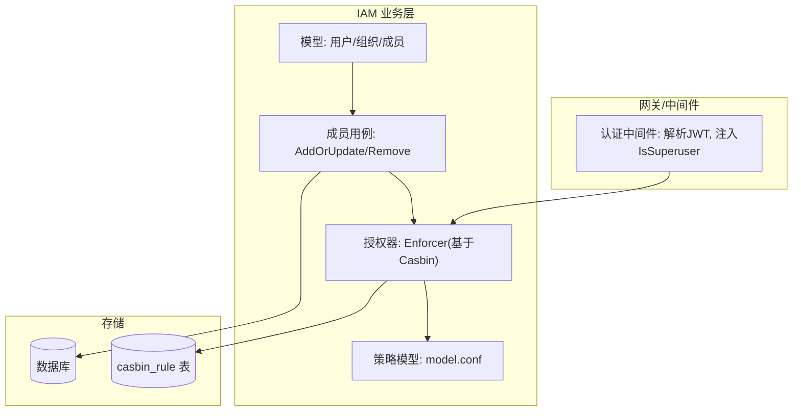
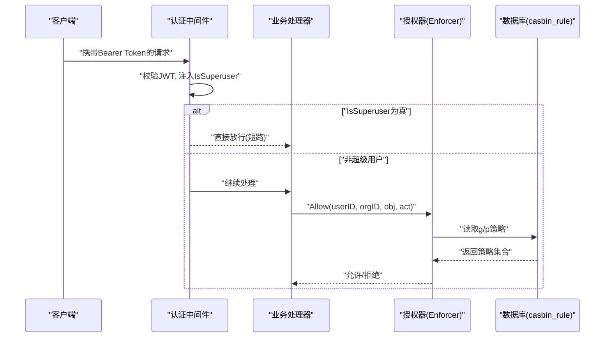
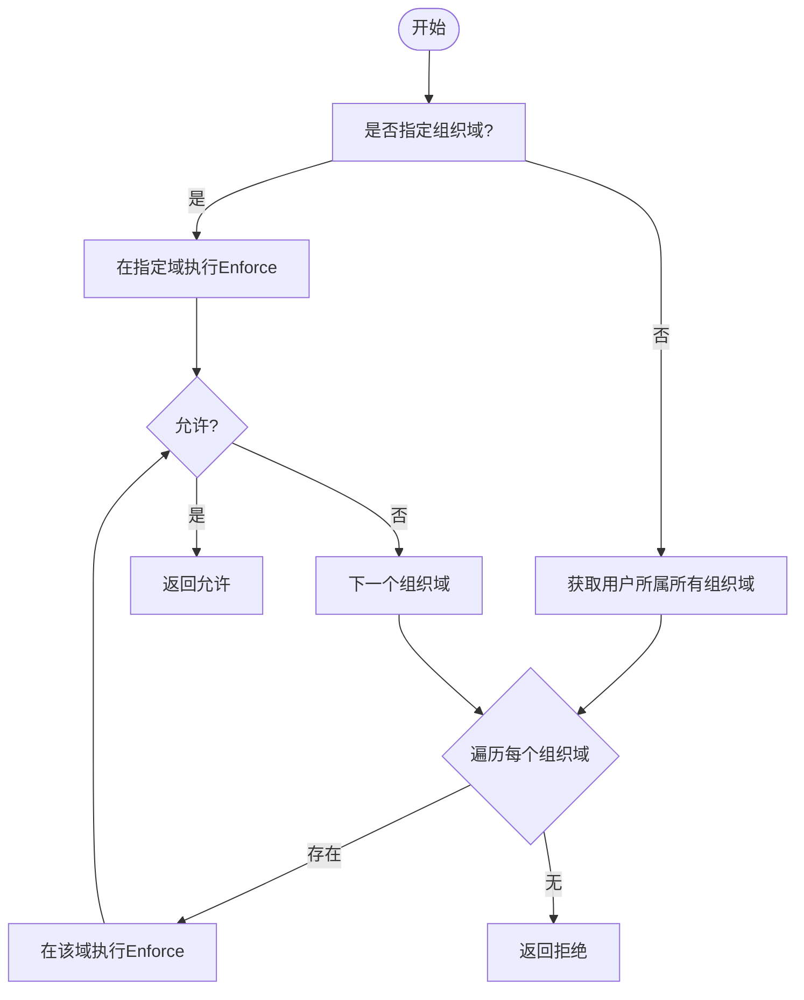
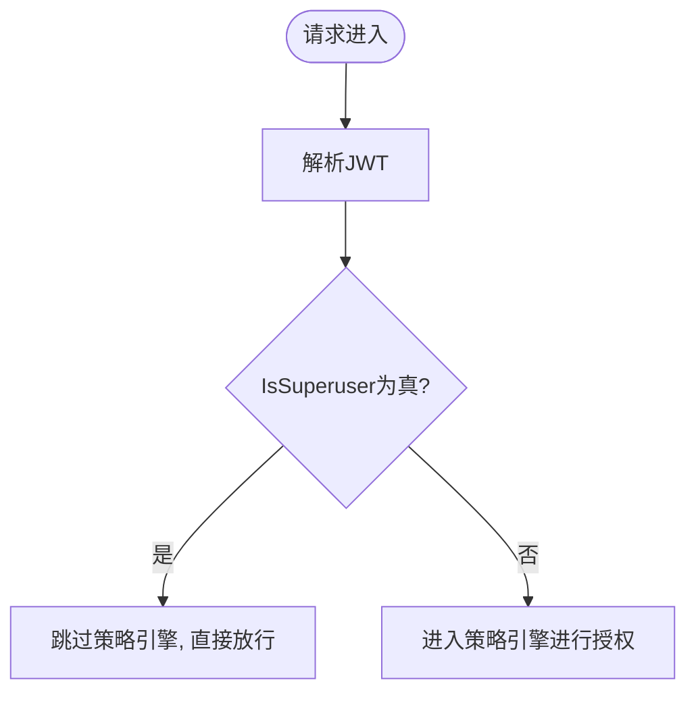
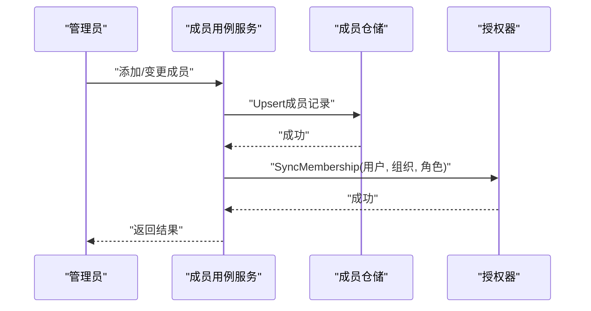
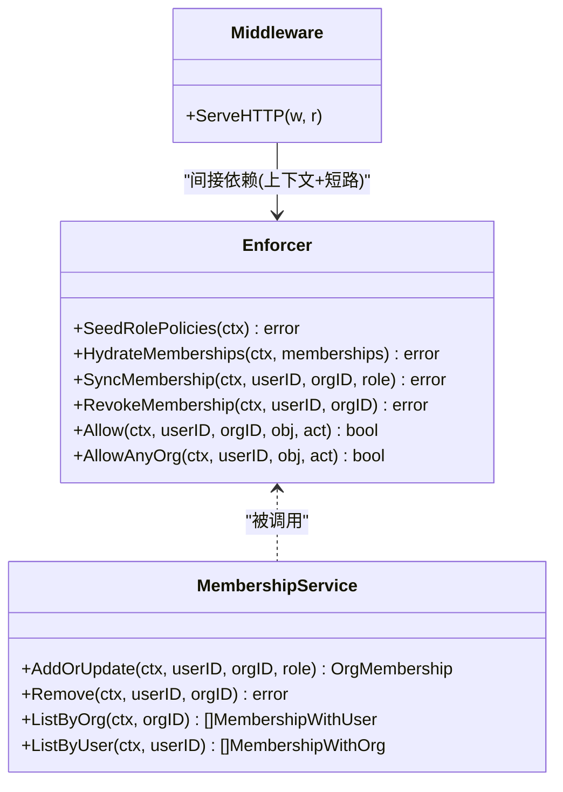

# 角色模型设计

<cite>
**本文引用的文件列表**
- [internal/iam/biz/authz/authz.go](file://internal/iam/biz/authz/authz.go)
- [internal/iam/biz/authz/model.conf](file://internal/iam/biz/authz/model.conf)
- [internal/iam/model/model.go](file://internal/iam/model/model.go)
- [internal/iam/biz/membership/usecase.go](file://internal/iam/biz/membership/usecase.go)
- [internal/pkg/auth/middleware.go](file://internal/pkg/auth/middleware.go)
- [tests/e2e/auth_rbac_test.go](file://tests/e2e/auth_rbac_test.go)
</cite>

## 目录
1. [引言](#引言)
2. [项目结构](#项目结构)
3. [核心组件](#核心组件)
4. [架构总览](#架构总览)
5. [详细组件分析](#详细组件分析)
6. [依赖关系分析](#依赖关系分析)
7. [性能考量](#性能考量)
8. [故障排查指南](#故障排查指南)
9. [结论](#结论)
10. [附录](#附录)

## 引言
本文件聚焦于 RBAC 角色模型的实现与使用，围绕三种内置角色（组织管理员 org_admin、成员 member、查看者 viewer）展开，说明其权限矩阵、资源访问级别、操作类型限制、设备管理相关权限边界，以及超级用户角色的特殊处理与安全考虑。同时提供角色变更最佳实践、扩展新角色的开发指南，以及角色权限验证的测试用例与调试方法。

## 项目结构
RBAC 能力由 IAM 业务层与鉴权中间件共同构成：
- 策略定义与执行：基于 Casbin，策略模型与匹配规则内嵌在配置中；启动时注入角色策略，运行时同步成员身份到分组策略。
- 成员关系：用户与组织的归属关系持久化在组织成员表中，并在每次变更后同步至策略引擎。
- 请求入口：HTTP 中间件负责 JWT 校验并注入租户上下文，包含是否超级用户的标志位；具体路由再结合组织域进行授权判断。

图表来源
- [internal/iam/biz/authz/authz.go:64-84](file://internal/iam/biz/authz/authz.go#L64-L84)
- [internal/iam/biz/authz/model.conf:1-15](file://internal/iam/biz/authz/model.conf#L1-L15)
- [internal/iam/model/model.go:126-140](file://internal/iam/model/model.go#L126-L140)
- [internal/iam/biz/membership/usecase.go:44-73](file://internal/iam/biz/membership/usecase.go#L44-L73)
- [internal/pkg/auth/middleware.go:21-52](file://internal/pkg/auth/middleware.go#L21-L52)

章节来源
- [internal/iam/biz/authz/authz.go:1-316](file://internal/iam/biz/authz/authz.go#L1-L316)
- [internal/iam/biz/authz/model.conf:1-15](file://internal/iam/biz/authz/model.conf#L1-L15)
- [internal/iam/model/model.go:1-140](file://internal/iam/model/model.go#L1-L140)
- [internal/iam/biz/membership/usecase.go:1-89](file://internal/iam/biz/membership/usecase.go#L1-L89)
- [internal/pkg/auth/middleware.go:1-68](file://internal/pkg/auth/middleware.go#L1-L68)

## 核心组件
- 策略模型与匹配器：定义请求、策略、角色定义、效果与匹配逻辑，支持通配符与对象前缀匹配。
- 角色策略矩阵：在启动时以幂等方式注入，覆盖三类内置角色与一个“超级用户”兜底策略。
- 成员关系同步：对成员的增删改会同步更新分组策略，保证策略表与真实成员关系一致。
- 认证中间件：从 JWT 提取 IsSuperuser 标志，用于超管短路放行。

章节来源
- [internal/iam/biz/authz/model.conf:1-15](file://internal/iam/biz/authz/model.conf#L1-L15)
- [internal/iam/biz/authz/authz.go:86-125](file://internal/iam/biz/authz/authz.go#L86-L125)
- [internal/iam/biz/membership/usecase.go:44-73](file://internal/iam/biz/membership/usecase.go#L44-L73)
- [internal/pkg/auth/middleware.go:21-52](file://internal/pkg/auth/middleware.go#L21-L52)

## 架构总览
下图展示了从 HTTP 请求进入，到最终授权决策的关键路径，包括超级用户短路、按组织域匹配、对象与动作匹配等。

图表来源
- [internal/pkg/auth/middleware.go:21-52](file://internal/pkg/auth/middleware.go#L21-L52)
- [internal/iam/biz/authz/authz.go:235-247](file://internal/iam/biz/authz/authz.go#L235-L247)
- [internal/iam/biz/authz/authz.go:114-125](file://internal/iam/biz/authz/authz.go#L114-L125)

## 详细组件分析

### 内置角色与权限矩阵
- 组织管理员（org_admin）
  - 范围：在其所属组织域内拥有完整读写与执行权限，并可管理成员与组织资源。
  - 关键行为：可创建/修改/删除成员，具备对所有资源的读、写与执行能力。
- 成员（member）
  - 范围：可在其所属组织域内对资源进行读、写与特定执行操作（如设备 Shell）。
  - 关键行为：不可管理成员；可对设备执行 shell 操作（受策略控制）。
- 查看者（viewer）
  - 范围：仅只读访问，不能执行设备 Shell 等操作。
  - 关键行为：适合审计与观察场景，无法触发写入或高危操作。

上述权限通过启动时注入的策略矩阵生效，策略中的对象与动作采用通配符与前缀匹配，确保最小必要原则与可扩展性。

章节来源
- [internal/iam/biz/authz/authz.go:86-110](file://internal/iam/biz/authz/authz.go#L86-L110)
- [internal/iam/model/model.go:61-78](file://internal/iam/model/model.go#L61-L78)

### 角色继承与权限叠加机制
- 继承关系：当前未启用层级继承，角色之间不存在显式继承链。
- 权限叠加：同一用户在多个组织可能拥有不同角色，授权器会在对应组织域内进行匹配；若请求未指定组织，则遍历该用户所有组织域，任一允许即放行。
- 分组策略：成员关系映射为分组策略，将用户与角色绑定到组织域，从而驱动匹配器完成决策。

图表来源
- [internal/iam/biz/authz/authz.go:255-271](file://internal/iam/biz/authz/authz.go#L255-L271)
- [internal/iam/biz/authz/authz.go:235-247](file://internal/iam/biz/authz/authz.go#L235-L247)

章节来源
- [internal/iam/biz/authz/authz.go:255-271](file://internal/iam/biz/authz/authz.go#L255-L271)
- [internal/iam/biz/authz/authz.go:275-289](file://internal/iam/biz/authz/authz.go#L275-L289)

### 超级用户角色的特殊处理与安全考虑
- 短路放行：当 JWT 中包含 IsSuperuser 标志（或兼容旧 token 的 Role=admin），认证中间件会将该标志写入上下文，后续授权流程可直接短路放行，不经过策略引擎。
- 安全兜底：策略矩阵仍保留“superuser”的兜底策略，即使未来调用绕过短路逻辑，也能在策略层面得到允许，形成纵深防御。
- 风险点：超级用户不受策略约束，需严格管控其签发与使用范围，避免滥用。

图表来源
- [internal/pkg/auth/middleware.go:21-52](file://internal/pkg/auth/middleware.go#L21-L52)
- [internal/iam/biz/authz/authz.go:105-110](file://internal/iam/biz/authz/authz.go#L105-L110)

章节来源
- [internal/pkg/auth/middleware.go:21-52](file://internal/pkg/auth/middleware.go#L21-L52)
- [internal/iam/biz/authz/authz.go:105-110](file://internal/iam/biz/authz/authz.go#L105-L110)

### 设备管理权限边界
- 设备 Shell 访问：成员角色具备 device:shell 的执行权限；查看者不具备此权限，因此无法通过 Shell 直接操作设备。
- 设备角色（前端展示）：前端对设备显示“服务器/存储/网络/数据库”等多角色标签，这些属于设备分类角色，与用户 RBAC 角色不同，不影响后端授权决策。

章节来源
- [internal/iam/biz/authz/authz.go:96-103](file://internal/iam/biz/authz/authz.go#L96-L103)

### 成员关系与策略同步
- 新增/变更成员：在持久化成员关系后，立即同步对应的分组策略，确保策略表与真实成员关系一致。
- 移除成员：删除成员记录后，撤销其在策略表中的所有分组策略。
- 全量初始化：启动时将现有成员关系批量同步到策略表，保证冷启动一致性。

图表来源
- [internal/iam/biz/membership/usecase.go:44-73](file://internal/iam/biz/membership/usecase.go#L44-L73)
- [internal/iam/biz/authz/authz.go:149-169](file://internal/iam/biz/authz/authz.go#L149-L169)

章节来源
- [internal/iam/biz/membership/usecase.go:44-73](file://internal/iam/biz/membership/usecase.go#L44-L73)
- [internal/iam/biz/authz/authz.go:134-143](file://internal/iam/biz/authz/authz.go#L134-L143)

## 依赖关系分析
- 策略模型与匹配器：model.conf 定义了请求、策略、角色定义、效果与匹配规则，支撑对象前缀匹配与通配符。
- 授权器：封装 Casbin，提供幂等的策略注入与成员同步接口，内部维护锁以保证并发安全。
- 成员用例：对外暴露成员管理的用例，内部依赖仓储与授权器，保证数据与策略的一致性。
- 认证中间件：负责 JWT 校验与上下文注入，为上层提供 IsSuperuser 标志。

图表来源
- [internal/iam/biz/authz/authz.go:114-169](file://internal/iam/biz/authz/authz.go#L114-L169)
- [internal/iam/biz/membership/usecase.go:44-73](file://internal/iam/biz/membership/usecase.go#L44-L73)
- [internal/pkg/auth/middleware.go:21-52](file://internal/pkg/auth/middleware.go#L21-L52)

章节来源
- [internal/iam/biz/authz/authz.go:1-316](file://internal/iam/biz/authz/authz.go#L1-L316)
- [internal/iam/biz/membership/usecase.go:1-89](file://internal/iam/biz/membership/usecase.go#L1-L89)
- [internal/pkg/auth/middleware.go:1-68](file://internal/pkg/auth/middleware.go#L1-L68)

## 性能考量
- 策略加载与注入：启动阶段一次性注入角色策略与成员分组策略，幂等且开销可控。
- 运行时决策：Allow/AllowAnyOrg 在内存中执行匹配，必要时查询分组策略；对于多组织场景，AllowAnyOrg 会遍历用户的所有组织域，建议在高频路径尽量显式传入组织域以减少遍历。
- 并发安全：授权器内部加锁保护策略写入，避免并发冲突。

章节来源
- [internal/iam/biz/authz/authz.go:114-143](file://internal/iam/biz/authz/authz.go#L114-L143)
- [internal/iam/biz/authz/authz.go:255-271](file://internal/iam/biz/authz/authz.go#L255-L271)

## 故障排查指南
- 常见问题
  - 策略不一致：检查成员变更是否成功同步到策略表；确认 Upsert/Remove 后是否调用了 SyncMembership/RevokeMembership。
  - 多组织误判：确认请求是否携带正确的组织域；若未携带，AllowAnyOrg 会遍历所有组织域，可能导致预期外的允许或拒绝。
  - 超级用户短路：确认 JWT 中 IsSuperuser 标志是否正确设置；若出现意外放行，检查中间件逻辑与上游签发方。
- 定位步骤
  - 查看策略表 casbin_rule 中 p/g 行是否与成员关系一致。
  - 在授权器日志中查找 enforce 错误与警告信息。
  - 使用 e2e 测试用例复现问题，对比期望状态码与实际响应。

章节来源
- [internal/iam/biz/membership/usecase.go:44-73](file://internal/iam/biz/membership/usecase.go#L44-L73)
- [internal/iam/biz/authz/authz.go:235-247](file://internal/iam/biz/authz/authz.go#L235-L247)
- [tests/e2e/auth_rbac_test.go:22-111](file://tests/e2e/auth_rbac_test.go#L22-L111)

## 结论
本 RBAC 模型以 Casbin 为核心，结合组织域与成员关系，实现了细粒度的资源访问控制。三种内置角色覆盖了管理、操作与只读三类典型场景，并通过超级用户短路保障运维可达性。通过严格的成员同步与幂等策略注入，系统在一致性与可用性之间取得平衡。建议在生产环境中严格控制超级用户的使用范围，并为敏感操作增加二次审批与审计。

## 附录

### 角色权限变更最佳实践
- 最小权限原则：为新角色分配最小必要的对象与动作，逐步放开。
- 灰度发布：先在小范围组织内试点，观察策略匹配与日志后再推广。
- 变更审计：所有成员变更必须记录审计日志，并与策略同步保持一致。
- 回滚预案：保留变更前后的策略快照，以便快速回滚。

### 扩展新角色的开发指南
- 定义角色常量：在模型层添加新的成员角色常量，并确保校验函数接受新值。
- 注入策略：在启动阶段向策略矩阵追加新角色的 p 行，明确对象与作用域。
- 同步策略：在成员用例中保持幂等同步逻辑，确保新增角色能正确映射到 g 行。
- 测试覆盖：补充 e2e 用例，覆盖新角色的允许与拒绝路径。

章节来源
- [internal/iam/model/model.go:61-78](file://internal/iam/model/model.go#L61-L78)
- [internal/iam/biz/authz/authz.go:114-125](file://internal/iam/biz/authz/authz.go#L114-L125)
- [internal/iam/biz/membership/usecase.go:44-73](file://internal/iam/biz/membership/usecase.go#L44-L73)
- [tests/e2e/auth_rbac_test.go:22-111](file://tests/e2e/auth_rbac_test.go#L22-L111)

### 角色权限验证的测试用例与调试方法
- 端到端测试
  - 三角色三角验证：admin/user/viewer 在受限接口与公开接口的行为差异。
  - 自定义 Agent 创建：验证 viewer 被拒绝，admin/user 允许。
- 调试方法
  - 使用 e2e 环境快速复现问题，关注状态码与响应体。
  - 在授权器中打印 enforce 参数与错误，辅助定位匹配失败原因。

章节来源
- [tests/e2e/auth_rbac_test.go:22-111](file://tests/e2e/auth_rbac_test.go#L22-L111)
- [internal/iam/biz/authz/authz.go:235-247](file://internal/iam/biz/authz/authz.go#L235-L247)