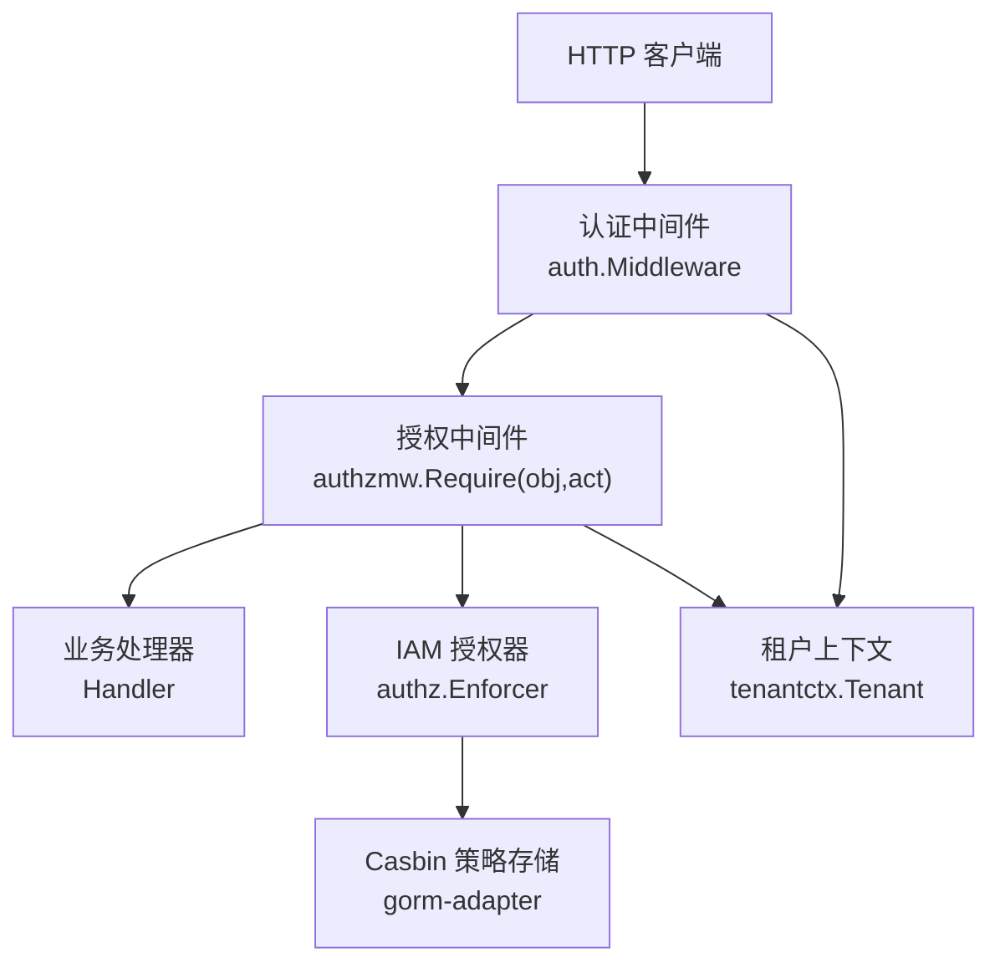
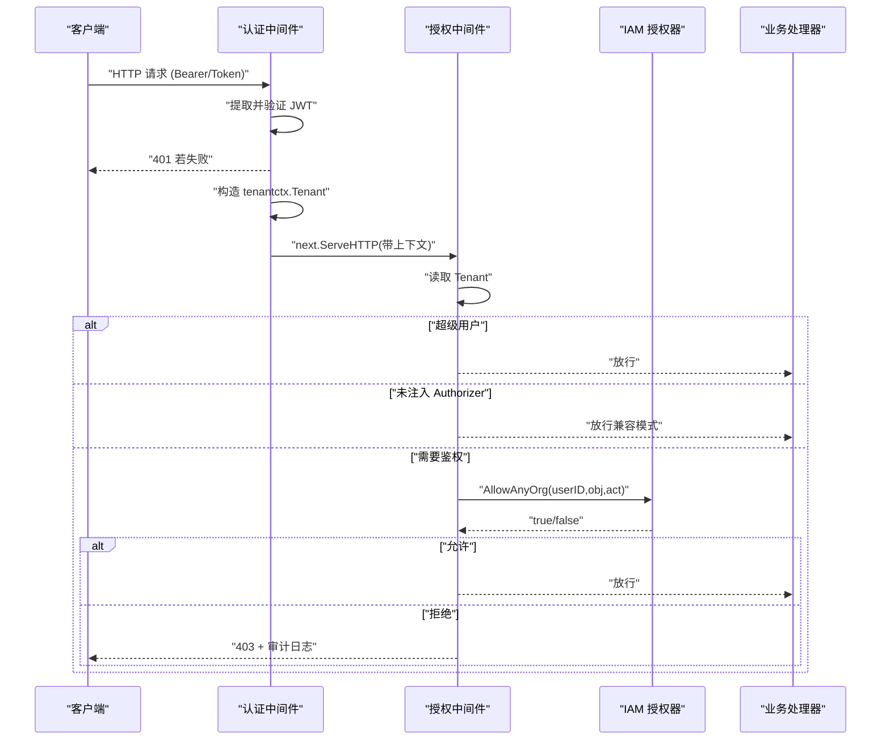
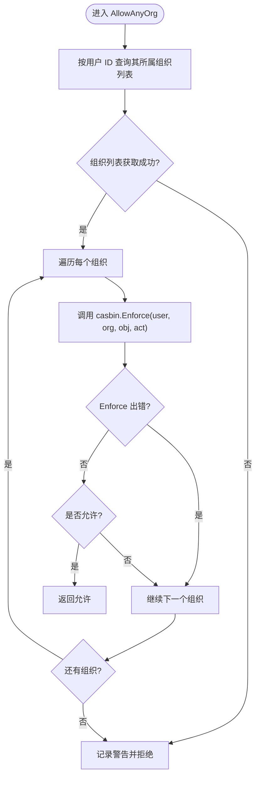
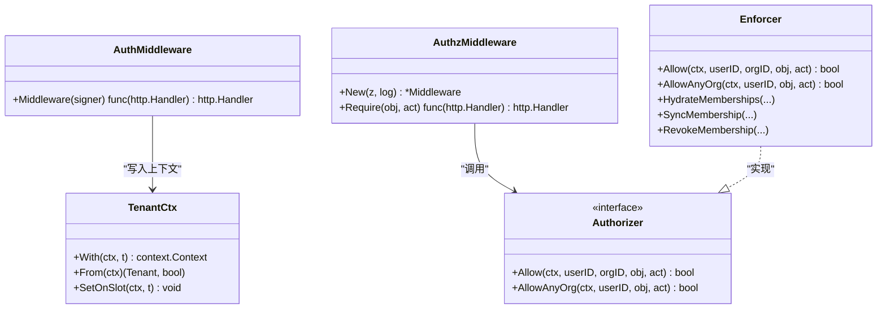

# 认证中间件

<cite>
**本文引用的文件**   
- [internal/pkg/auth/middleware.go](file://internal/pkg/auth/middleware.go)
- [internal/pkg/tenantctx/tenantctx.go](file://internal/pkg/tenantctx/tenantctx.go)
- [internal/pkg/authzmw/middleware.go](file://internal/pkg/authzmw/middleware.go)
- [internal/iam/biz/authz/authz.go](file://internal/iam/biz/authz/authz.go)
- [internal/pkg/errs/errs.go](file://internal/pkg/errs/errs.go)
- [cmd/ongrid/main.go](file://cmd/ongrid/main.go)
</cite>

## 目录
1. [简介](#简介)
2. [项目结构](#项目结构)
3. [核心组件](#核心组件)
4. [架构总览](#架构总览)
5. [详细组件分析](#详细组件分析)
6. [依赖关系分析](#依赖关系分析)
7. [性能考量](#性能考量)
8. [故障排查指南](#故障排查指南)
9. [结论](#结论)
10. [附录](#附录)

## 简介
本文件聚焦于认证与授权中间件的实现与使用，覆盖以下关键主题：
- HTTP 请求的权限检查流程：用户身份解析、组织上下文提取、权限决策执行。
- AllowAnyOrg 的多组织权限检查逻辑与默认组织选择机制。
- 资源路径匹配算法与动作类型判断规则（对象命名约定与动作词汇）。
- 权限检查失败的处理流程与错误响应格式。
- 自定义权限检查器的扩展方法与中间件链配置。
- 权限审计日志记录与性能监控指标。
- 常见权限问题的诊断工具与调试技巧。

## 项目结构
认证与授权相关代码主要分布在如下包中：
- internal/pkg/auth：JWT 认证中间件，负责从请求中提取并校验令牌，将租户信息写入上下文。
- internal/pkg/tenantctx：请求级租户上下文载体，提供 With/From 等读写方法以及“可写槽位”以支持外层中间件读取内层写入的租户信息。
- internal/pkg/authzmw：基于 IAM 的 RBAC 授权中间件，封装 Authorizer 接口，提供 Require(obj, act) 装饰器。
- internal/iam/biz/authz：基于 Casbin 的策略引擎，维护角色策略与成员关系，提供 Allow/AllowAnyOrg 等方法。
- internal/pkg/errs：统一错误哨兵与 HTTP 状态码映射。
- cmd/ongrid/main.go：应用启动时注册路由与中间件，包括认证与鉴权中间件的装配位置。

图表来源
- [internal/pkg/auth/middleware.go:1-68](file://internal/pkg/auth/middleware.go#L1-L68)
- [internal/pkg/authzmw/middleware.go:1-98](file://internal/pkg/authzmw/middleware.go#L1-L98)
- [internal/iam/biz/authz/authz.go:1-316](file://internal/iam/biz/authz/authz.go#L1-L316)
- [internal/pkg/tenantctx/tenantctx.go:1-87](file://internal/pkg/tenantctx/tenantctx.go#L1-L87)

章节来源
- [internal/pkg/auth/middleware.go:1-68](file://internal/pkg/auth/middleware.go#L1-L68)
- [internal/pkg/tenantctx/tenantctx.go:1-87](file://internal/pkg/tenantctx/tenantctx.go#L1-L87)
- [internal/pkg/authzmw/middleware.go:1-98](file://internal/pkg/authzmw/middleware.go#L1-L98)
- [internal/iam/biz/authz/authz.go:1-316](file://internal/iam/biz/authz/authz.go#L1-L316)
- [cmd/ongrid/main.go:2376-2416](file://cmd/ongrid/main.go#L2376-L2416)

## 核心组件
- 认证中间件（auth.Middleware）
  - 职责：从 Authorization: Bearer <token> 或 ?token=<jwt> 查询参数中提取 JWT；调用 Signer.Verify 校验；将 tenantctx.Tenant 写入请求上下文；失败返回 401。
  - 关键点：兼容 WebSocket 场景下的 token 传递；IsSuperuser 优先来自 JWT 声明，否则回退到 Role=="admin"。
- 租户上下文（tenantctx）
  - 职责：在请求上下文中携带 UserID、Email、Role、IsSuperuser；提供 From/With 访问；通过“可写槽位”让外层中间件也能读到内层写入的 Tenant。
- 授权中间件（authzmw）
  - 职责：包装 Authorizer 接口，提供 Require(obj, act) 装饰器；对超级用户短路放行；当未注入 Authorizer 时允许（兼容无 IAM 部署）；否则调用 AllowAnyOrg 进行多组织判定；拒绝时记录审计日志并返回 403。
- 授权器（authz.Enforcer）
  - 职责：基于 Casbin 的策略引擎；维护角色策略矩阵与成员分组策略；提供 Allow(orgID) 与 AllowAnyOrg() 两种决策入口；支持按用户列出所属域（组织）。

章节来源
- [internal/pkg/auth/middleware.go:1-68](file://internal/pkg/auth/middleware.go#L1-L68)
- [internal/pkg/tenantctx/tenantctx.go:1-87](file://internal/pkg/tenantctx/tenantctx.go#L1-L87)
- [internal/pkg/authzmw/middleware.go:1-98](file://internal/pkg/authzmw/middleware.go#L1-L98)
- [internal/iam/biz/authz/authz.go:1-316](file://internal/iam/biz/authz/authz.go#L1-L316)

## 架构总览
下图展示一次受保护 API 请求的完整认证与授权流程，包括上下文传播与决策点。

图表来源
- [internal/pkg/auth/middleware.go:1-68](file://internal/pkg/auth/middleware.go#L1-L68)
- [internal/pkg/authzmw/middleware.go:1-98](file://internal/pkg/authzmw/middleware.go#L1-L98)
- [internal/iam/biz/authz/authz.go:1-316](file://internal/iam/biz/authz/authz.go#L1-L316)

## 详细组件分析

### 认证中间件：用户身份解析与上下文注入
- 输入来源
  - Authorization: Bearer <token>
  - 查询参数 ?token=<jwt>（用于 WebSocket 升级等浏览器限制场景）
- 校验与上下文
  - 调用 Signer.Verify 校验 JWT；失败返回 401。
  - 根据 claims 构造 tenantctx.Tenant，其中 IsSuperuser 优先取 claims.IsSuperuser，否则回退 Role=="admin"。
  - 将 Tenant 同时写入外层“可写槽位”与请求上下文，确保外层中间件（如审计）能读取。
- 错误处理
  - 缺失 token → 401
  - 无效 token → 401

章节来源
- [internal/pkg/auth/middleware.go:1-68](file://internal/pkg/auth/middleware.go#L1-L68)
- [internal/pkg/tenantctx/tenantctx.go:1-87](file://internal/pkg/tenantctx/tenantctx.go#L1-L87)

### 授权中间件：权限决策与组织上下文
- 决策流程
  - 从上下文读取 Tenant；不存在则返回 401。
  - 若 IsSuperuser → 直接放行。
  - 若 Authorizer 为 nil（兼容旧部署）→ 放行。
  - 否则调用 Authorizer.AllowAnyOrg(userID, obj, act)。
  - 拒绝时记录审计日志并返回 403。
- 组织上下文
  - Phase 1 默认不要求 X-Active-Org 头，采用 AllowAnyOrg 遍历用户所有组织进行判定。
  - Phase 2 计划引入 X-Active-Org 并使用 Allow(userID, orgID, obj, act) 精确到组织。

章节来源
- [internal/pkg/authzmw/middleware.go:1-98](file://internal/pkg/authzmw/middleware.go#L1-L98)

### 授权器：AllowAnyOrg 多组织检查与默认组织选择
- AllowAnyOrg 逻辑
  - 获取用户所属的所有组织（域），逐一调用 casbin.Enforce(user, org, obj, act)，任一允许即放行。
  - 若枚举组织或执行 Enforce 出错，记录警告并视为拒绝。
- 默认组织选择机制
  - 当前中间件未显式选择“默认组织”，而是采用“任意组织允许即放行”的策略。
  - 未来可通过 X-Active-Org 指定组织，走 Allow(userID, orgID, obj, act) 的精确路径。
- 成员关系同步
  - HydrateMemberships/SyncMembership/RevokeMembership 等方法将 iam.OrgMembership 同步至 Casbin g 策略，保证策略与数据库一致。

图表来源
- [internal/iam/biz/authz/authz.go:249-271](file://internal/iam/biz/authz/authz.go#L249-L271)
- [internal/iam/biz/authz/authz.go:291-310](file://internal/iam/biz/authz/authz.go#L291-L310)

章节来源
- [internal/iam/biz/authz/authz.go:1-316](file://internal/iam/biz/authz/authz.go#L1-L316)

### 资源路径匹配算法与动作类型判断规则
- 对象命名约定（Phase 1）
  - edge:* — 边缘设备 CRUD 与插件配置
  - knowledge:doc — 文档变更
  - knowledge:repo — Git 仓库注册
  - alert:rule — 告警规则 CRUD
  - alert:incident — 事件确认/解决/静默
  - agent:custom — 自定义 Agent CRUD
  - monitor:panel — 监控面板 CRUD
  - org:* — 组织管理（/v1/orgs）
  - user:* — 用户管理（/v1/users）
- 动作词汇
  - read / write / delete / manage
- 匹配方式
  - 中间件 Require(obj, act) 由路由注册处传入具体对象与动作字符串，交由 Authorizer 决策。
  - 当前未实现通配符解析或路径到对象的自动映射，需由路由层明确绑定。

章节来源
- [internal/pkg/authzmw/middleware.go:1-24](file://internal/pkg/authzmw/middleware.go#L1-L24)

### 权限检查失败处理与错误响应格式
- 认证失败
  - 缺少或无效 token → 401 Unauthorized
- 授权失败
  - 未满足策略 → 403 Forbidden，并记录审计日志（包含 user、obj、act）
- 错误码映射
  - errs.HTTPStatus 将内部错误哨兵映射为标准 HTTP 状态码（例如 unauthorized → 401，forbidden → 403，invalid → 400，not-wired-yet → 501 等）

章节来源
- [internal/pkg/authzmw/middleware.go:70-98](file://internal/pkg/authzmw/middleware.go#L70-L98)
- [internal/pkg/errs/errs.go:1-54](file://internal/pkg/errs/errs.go#L1-L54)

### 自定义权限检查器与中间件链配置
- 自定义 Authorizer
  - 实现 internal/pkg/authzmw.Authorizer 接口（Allow、AllowAnyOrg），即可替换默认 IAM 授权器。
  - 当 Authorizer 为 nil 时，中间件会放行（兼容无 IAM 部署）。
- 中间件链装配
  - 在路由组上先安装 auth.Middleware(signer)，再按需安装 authzmw.New(authzEnf, log).Require(obj, act)。
  - 示例装配位置见主程序中的 protected 路由组。

章节来源
- [internal/pkg/authzmw/middleware.go:35-55](file://internal/pkg/authzmw/middleware.go#L35-L55)
- [cmd/ongrid/main.go:2376-2416](file://cmd/ongrid/main.go#L2376-L2416)

### 权限审计日志记录
- 授权拒绝日志
  - 当授权被拒绝时，记录 user、obj、act 等信息，便于追踪与审计。
- 审计数据持久化
  - 系统启动阶段初始化审计仓储与保留策略，结合环境变量控制保留天数。

章节来源
- [internal/pkg/authzmw/middleware.go:90-95](file://internal/pkg/authzmw/middleware.go#L90-L95)
- [cmd/ongrid/main.go:409-421](file://cmd/ongrid/main.go#L409-L421)

### 性能监控指标
- 认证与授权路径
  - 认证中间件与授权中间件本身未暴露专用 Prometheus 指标；建议在上层统一埋点（例如统计 401/403 比率、平均耗时）。
- 通用指标
  - 系统健康检查与子系统探针通过独立服务暴露；认证/授权链路可作为观测维度之一纳入统一监控。

章节来源
- [internal/manager/service/systemhealth/service.go:60-117](file://internal/manager/service/systemhealth/service.go#L60-L117)

## 依赖关系分析
- 组件耦合
  - auth.Middleware 依赖 Signer 与 tenantctx。
  - authzmw.Middleware 依赖 Authorizer 接口与 tenantctx。
  - iam.authz.Enforcer 依赖 Casbin 与 gorm-adapter，维护策略与成员关系。
- 外部依赖
  - Casbin 策略模型与规则表（casbin_rule）由 gorm-adapter 管理。
- 潜在循环依赖
  - 当前分层清晰，未见循环依赖；Authorizer 接口解耦了上层中间件与底层策略实现。

图表来源
- [internal/pkg/auth/middleware.go:1-68](file://internal/pkg/auth/middleware.go#L1-L68)
- [internal/pkg/tenantctx/tenantctx.go:1-87](file://internal/pkg/tenantctx/tenantctx.go#L1-L87)
- [internal/pkg/authzmw/middleware.go:1-98](file://internal/pkg/authzmw/middleware.go#L1-L98)
- [internal/iam/biz/authz/authz.go:1-316](file://internal/iam/biz/authz/authz.go#L1-L316)

章节来源
- [internal/pkg/auth/middleware.go:1-68](file://internal/pkg/auth/middleware.go#L1-L68)
- [internal/pkg/authzmw/middleware.go:1-98](file://internal/pkg/authzmw/middleware.go#L1-L98)
- [internal/iam/biz/authz/authz.go:1-316](file://internal/iam/biz/authz/authz.go#L1-L316)

## 性能考量
- 多组织遍历开销
  - AllowAnyOrg 会枚举用户所属组织并逐个 Enforce；在用户组织较多时可能带来额外延迟。建议：
    - 合理划分组织规模，避免单用户跨过多组织。
    - 必要时引入缓存（如最近一次决策结果短缓存）以降低重复计算。
- 策略加载与同步
  - 启动阶段一次性加载策略与同步成员关系；运行时增量更新（SyncMembership/RevokeMembership）应批量合并以减少频繁 IO。
- 鉴权短路
  - 超级用户短路放行，避免不必要的策略查询。

[本节为通用指导，无需特定文件引用]

## 故障排查指南
- 常见问题定位
  - 401 未认证：检查 Authorization 头或 ?token 参数是否正确；确认 JWT 签名与有效期。
  - 403 未授权：检查用户是否具备对应对象与动作的权限；确认成员关系已同步至策略库。
  - 未生效的组织权限：确认 HydrateMemberships/SyncMembership 是否执行成功；查看策略表中是否存在对应的 g 规则。
- 日志与指标
  - 关注授权拒绝日志（user、obj、act）；结合审计日志进行回溯。
  - 在网关或上游代理层统计 401/403 比例，辅助定位问题范围。
- 调试技巧
  - 临时启用宽松策略（仅测试环境）验证是否为策略配置问题。
  - 使用最小复现用例（单一对象+动作）逐步缩小范围。
  - 核对路由层 Require(obj, act) 的参数是否与策略定义一致。

章节来源
- [internal/pkg/authzmw/middleware.go:90-95](file://internal/pkg/authzmw/middleware.go#L90-L95)
- [internal/iam/biz/authz/authz.go:127-189](file://internal/iam/biz/authz/authz.go#L127-L189)

## 结论
本认证与授权中间件体系通过 JWT 认证、租户上下文传播与基于 Casbin 的 RBAC 策略，实现了清晰的权限边界与可扩展的授权能力。AllowAnyOrg 提供了多组织场景下的默认行为，配合明确的对象命名与动作词汇，使权限策略易于理解与维护。建议在后续版本中引入 X-Active-Org 以支持更细粒度的组织上下文，并结合统一的监控与审计增强可观测性。

[本节为总结，无需特定文件引用]

## 附录
- 路由装配参考
  - 在受保护路由组上先安装认证中间件，再按需安装授权中间件。
- 错误码速查
  - unauthorized → 401
  - forbidden → 403
  - invalid → 400
  - not-wired-yet → 501
  - conflict → 409
  - too many attempts → 429

章节来源
- [cmd/ongrid/main.go:2376-2416](file://cmd/ongrid/main.go#L2376-L2416)
- [internal/pkg/errs/errs.go:1-54](file://internal/pkg/errs/errs.go#L1-L54)