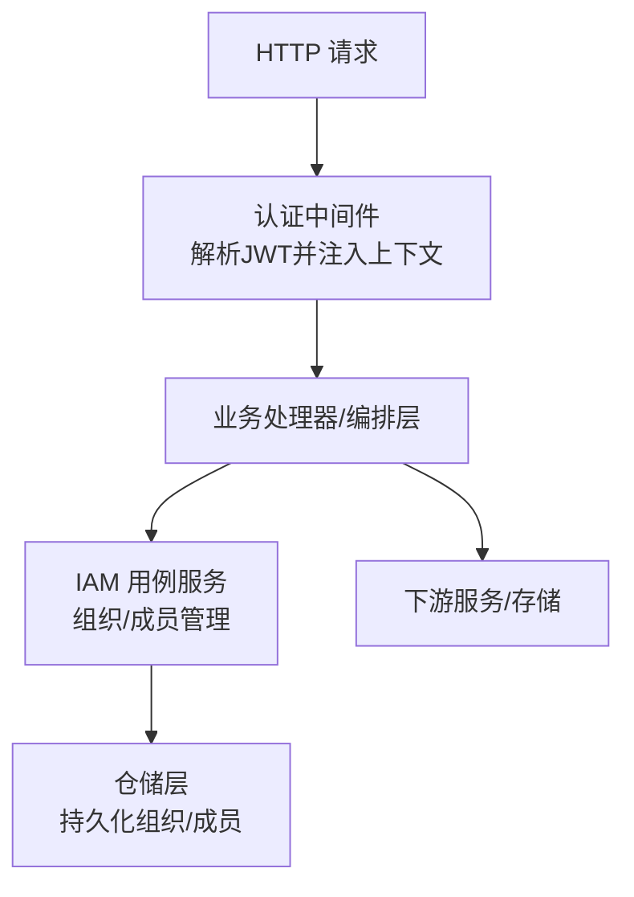
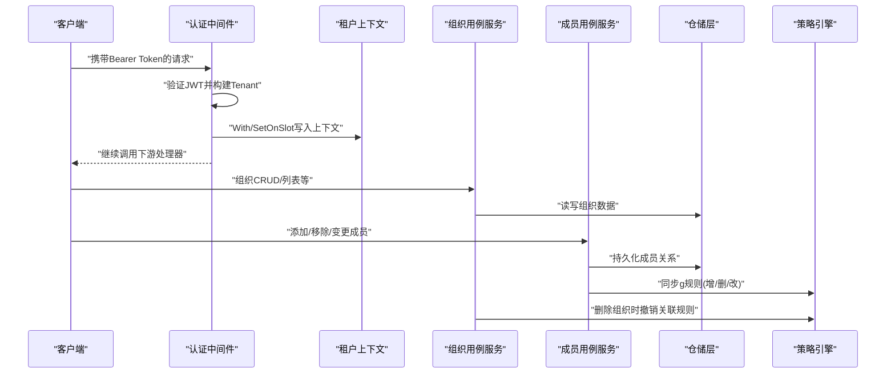
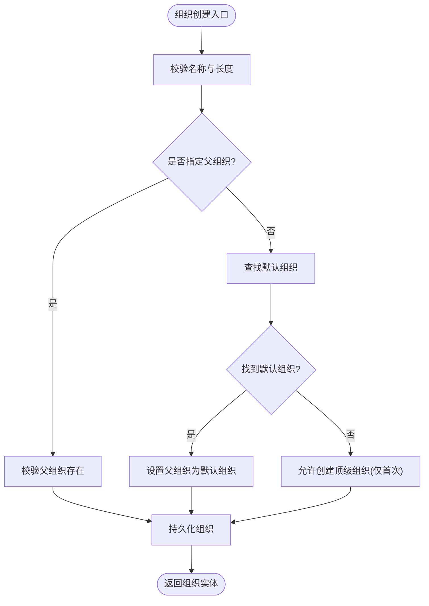
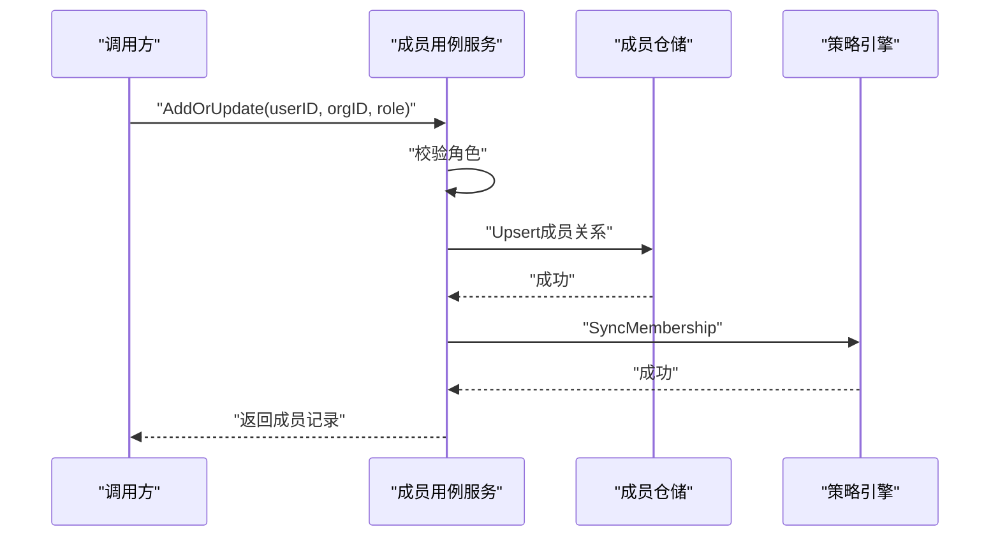
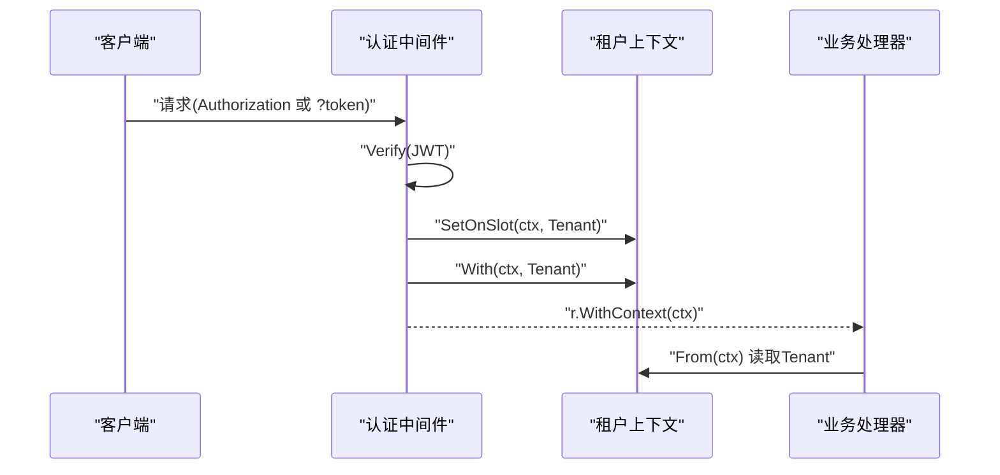
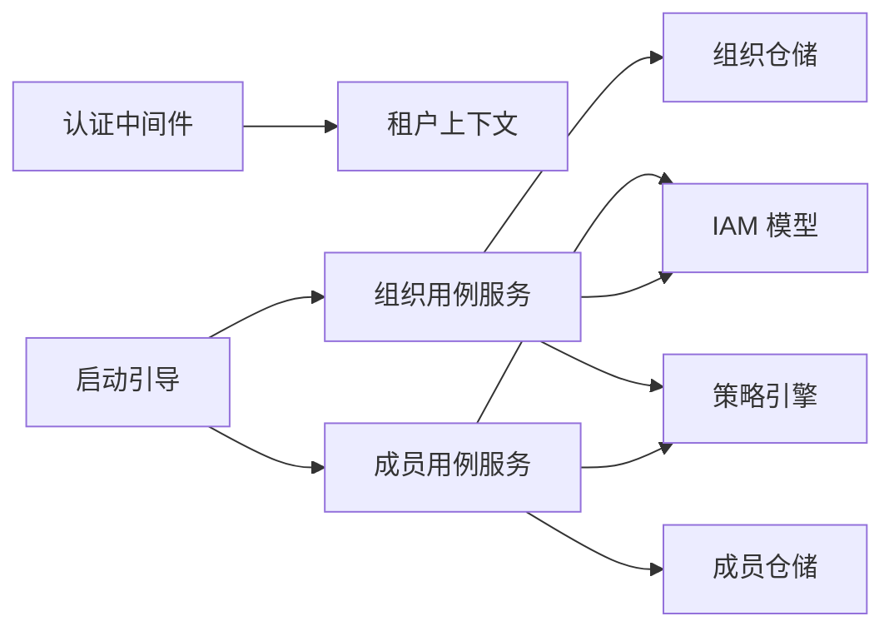

# 多租户隔离

<cite>
**本文引用的文件**   
- [internal/iam/model/model.go](file://internal/iam/model/model.go)
- [internal/iam/biz/org/usecase.go](file://internal/iam/biz/org/usecase.go)
- [internal/iam/biz/membership/usecase.go](file://internal/iam/biz/membership/usecase.go)
- [internal/pkg/auth/middleware.go](file://internal/pkg/auth/middleware.go)
- [internal/pkg/tenantctx/tenantctx.go](file://internal/pkg/tenantctx/tenantctx.go)
- [cmd/ongrid/main.go](file://cmd/ongrid/main.go)
</cite>

## 目录
1. [引言](#引言)
2. [项目结构](#项目结构)
3. [核心组件](#核心组件)
4. [架构总览](#架构总览)
5. [详细组件分析](#详细组件分析)
6. [依赖关系分析](#依赖关系分析)
7. [性能与监控](#性能与监控)
8. [故障排查指南](#故障排查指南)
9. [结论](#结论)
10. [附录](#附录)

## 引言
本文件面向“多租户隔离”主题，围绕组织（Organization）概念、成员关系、上下文传递、数据与资源边界控制展开，结合仓库中 IAM 与认证中间件实现进行说明。当前代码库处于单租户私有 MVP 阶段，但已为后续多租户扩展预留了清晰的模型与上下文机制：通过 JWT 注入用户身份到请求上下文，配合组织与成员模型及策略引擎，可在业务层按组织维度实施访问控制与数据过滤。

## 项目结构
与多租户相关的关键位置如下：
- 领域模型：internal/iam/model/model.go
- 用例服务：internal/iam/biz/org/usecase.go、internal/iam/biz/membership/usecase.go
- 认证与上下文：internal/pkg/auth/middleware.go、internal/pkg/tenantctx/tenantctx.go
- 启动引导与默认组织初始化：cmd/ongrid/main.go



图表来源
- [internal/pkg/auth/middleware.go:1-68](file://internal/pkg/auth/middleware.go#L1-L68)
- [internal/pkg/tenantctx/tenantctx.go:1-87](file://internal/pkg/tenantctx/tenantctx.go#L1-L87)
- [internal/iam/biz/org/usecase.go:1-226](file://internal/iam/biz/org/usecase.go#L1-L226)
- [internal/iam/biz/membership/usecase.go:1-89](file://internal/iam/biz/membership/usecase.go#L1-L89)

章节来源
- [cmd/ongrid/main.go:305-363](file://cmd/ongrid/main.go#L305-L363)

## 核心组件
- 组织与成员模型
  - 组织：扁平层级设计，支持父节点引用；名称全局唯一。
  - 成员关系：用户-组织-角色三元组，角色映射到策略主体。
  - 系统角色与成员角色分离：系统级 admin/user/viewer 与组织级 org_admin/member/viewer 并存。
- 认证与上下文
  - 认证中间件从 Authorization 或查询参数提取 JWT，校验后构造 Tenant 对象写入请求上下文。
  - 提供可替换的“外部槽位”，使外层中间件也能读取内层写入的身份信息。
- 用例服务
  - 组织服务：创建/更新/删除/列表/计数，保证“默认组织”作为唯一顶级根，防止出现多个顶级组织。
  - 成员服务：增删改查成员关系，并在每次变更时同步策略引擎规则，确保策略表与事实表一致。

章节来源
- [internal/iam/model/model.go:1-140](file://internal/iam/model/model.go#L1-L140)
- [internal/iam/biz/org/usecase.go:1-226](file://internal/iam/biz/org/usecase.go#L1-L226)
- [internal/iam/biz/membership/usecase.go:1-89](file://internal/iam/biz/membership/usecase.go#L1-L89)
- [internal/pkg/auth/middleware.go:1-68](file://internal/pkg/auth/middleware.go#L1-L68)
- [internal/pkg/tenantctx/tenantctx.go:1-87](file://internal/pkg/tenantctx/tenantctx.go#L1-L87)

## 架构总览
下图展示了从 HTTP 请求进入、身份解析、上下文传播到 IAM 用例服务的整体流程，以及组织与成员在策略引擎中的同步点。



图表来源
- [internal/pkg/auth/middleware.go:1-68](file://internal/pkg/auth/middleware.go#L1-L68)
- [internal/pkg/tenantctx/tenantctx.go:1-87](file://internal/pkg/tenantctx/tenantctx.go#L1-L87)
- [internal/iam/biz/org/usecase.go:1-226](file://internal/iam/biz/org/usecase.go#L1-L226)
- [internal/iam/biz/membership/usecase.go:1-89](file://internal/iam/biz/membership/usecase.go#L1-L89)

## 详细组件分析

### 组织与成员模型
- 组织（Org）
  - 字段：ID、Name（全局唯一）、Description、ParentID（顶层为nil）。
  - 约束：名称长度限制、层级完整性由业务层维护。
- 成员关系（OrgMembership）
  - 字段：ID、UserID、OrgID、Role（org_admin/member/viewer）。
  - 约束：同一用户对同一组织的角色唯一；角色值受枚举约束。
- 系统角色（User.Role）
  - admin/user/viewer，用于平台级权限与工具集能力区分。
  - IsSuperuser 独立于成员关系，绕过策略引擎以保障运维可达性。

```mermaid
classDiagram
class User {
+uint64 ID
+string Email
+string PassHash
+string DisplayName
+string Phone
+string Role
+bool IsSuperuser
+string Status
+time CreatedAt
+time UpdatedAt
}
class Org {
+uint64 ID
+string Name
+string Description
+*uint64 ParentID
+time CreatedAt
+time UpdatedAt
}
class OrgMembership {
+uint64 ID
+uint64 UserID
+uint64 OrgID
+string Role
+time CreatedAt
+time UpdatedAt
}
User "1" --o{ OrgMembership : "拥有"
Org "1" --o{ OrgMembership : "包含"
```

图表来源
- [internal/iam/model/model.go:80-140](file://internal/iam/model/model.go#L80-L140)

章节来源
- [internal/iam/model/model.go:1-140](file://internal/iam/model/model.go#L1-L140)

### 组织生命周期管理
- 默认组织（“默认组织”）
  - 启动时确保存在且为唯一顶级组织；新组织若无显式父节点则自动挂在其下。
- 创建
  - 校验名称非空与长度；若未指定父节点则尝试挂载到默认组织。
- 更新
  - 支持提升为顶级或移动到某组织之下；含环检测，避免循环父子关系。
- 删除
  - 拒绝删除仍有子组织的组织；级联清理成员关系与策略规则。



图表来源
- [internal/iam/biz/org/usecase.go:69-114](file://internal/iam/biz/org/usecase.go#L69-L114)
- [internal/iam/biz/org/usecase.go:116-131](file://internal/iam/biz/org/usecase.go#L116-L131)

章节来源
- [internal/iam/biz/org/usecase.go:1-226](file://internal/iam/biz/org/usecase.go#L1-L226)
- [cmd/ongrid/main.go:305-363](file://cmd/ongrid/main.go#L305-L363)

### 成员关系维护与策略同步
- 新增/更新成员
  - 校验角色合法性；持久化成员关系；随后同步策略引擎 g 规则。
- 移除成员
  - 删除成员关系；撤销对应策略规则。
- 列举
  - 按组织/用户维度列出成员详情（含关联用户/组织信息）。



图表来源
- [internal/iam/biz/membership/usecase.go:44-60](file://internal/iam/biz/membership/usecase.go#L44-L60)

章节来源
- [internal/iam/biz/membership/usecase.go:1-89](file://internal/iam/biz/membership/usecase.go#L1-L89)

### 租户上下文传递机制
- 请求头解析
  - 优先从 Authorization: Bearer <token> 提取；WebSocket 场景回退到 ?token=<jwt>。
- 上下文注入
  - 认证中间件校验 JWT 后构造 Tenant（包含 UserID、Email、Role、IsSuperuser），并通过 With 写入请求上下文。
  - 同时通过 SetOnSlot 写入外层可观察槽位，便于审计等外层中间件获取。
- 跨服务传播
  - 当前 HTTP 链路通过 context 传递；跨进程/跨服务需在上层网关或 RPC 调用处显式透传（例如将 tenant 信息放入 gRPC metadata 或消息头）。



图表来源
- [internal/pkg/auth/middleware.go:1-68](file://internal/pkg/auth/middleware.go#L1-L68)
- [internal/pkg/tenantctx/tenantctx.go:1-87](file://internal/pkg/tenantctx/tenantctx.go#L1-L87)

章节来源
- [internal/pkg/auth/middleware.go:1-68](file://internal/pkg/auth/middleware.go#L1-L68)
- [internal/pkg/tenantctx/tenantctx.go:1-87](file://internal/pkg/tenantctx/tenantctx.go#L1-L87)

### 数据层面的租户隔离实现建议
当前仓库在 IAM 层提供了组织与成员模型，以及策略引擎集成点。针对数据层隔离，建议在现有基础上采用以下模式（概念性指导）：
- 数据库查询过滤
  - 在数据访问层统一拦截写/读操作，基于上下文中的组织/成员信息附加 WHERE 条件（如 org_id = ?），确保所有查询均限定在当前租户范围。
- 表级隔离
  - 对高敏感数据可采用分库分表或 schema 级隔离（每个租户一个 schema 或表前缀），降低误访问风险。
- 视图层处理
  - 使用数据库视图封装常用查询，并在视图中强制附加租户过滤条件，减少业务侧遗漏风险。
- 索引与性能
  - 为 org_id 等高频过滤列建立合适索引，避免全表扫描；对热点查询考虑物化视图或缓存。

[本节为通用实践建议，不直接分析具体源码文件]

### 资源访问的租户边界控制
- 策略引擎集成
  - 成员变更时同步策略规则，确保“谁在哪个组织具备何种角色”的事实与策略表一致。
- 超级管理员豁免
  - IsSuperuser 标志绕过策略检查，用于平台运维；需谨慎使用并保留审计日志。
- 组织树与权限不继承
  - 组织层级仅为管理便利，权限不随层级继承，必须显式授予。

章节来源
- [internal/iam/model/model.go:1-140](file://internal/iam/model/model.go#L1-L140)
- [internal/iam/biz/membership/usecase.go:1-89](file://internal/iam/biz/membership/usecase.go#L1-L89)
- [internal/iam/biz/org/usecase.go:1-226](file://internal/iam/biz/org/usecase.go#L1-L226)

### 租户配置与管理最佳实践
- 启动期初始化
  - 确保“默认组织”存在，并将现有用户回填为成员（管理员赋予 org_admin）。
- 组织命名规范
  - 名称全局唯一，建议使用可读性强且稳定的标识符；描述字段用于解释用途。
- 成员管理
  - 最小权限原则：默认 member，必要时升级为 org_admin；定期审计成员清单。
- 策略一致性
  - 任何成员变更必须同步策略引擎；失败应回滚或告警，避免事实与策略不一致。
- 审计与可观测性
  - 借助外层中间件的槽位机制，记录关键操作的租户上下文，便于追踪与排障。

章节来源
- [cmd/ongrid/main.go:305-363](file://cmd/ongrid/main.go#L305-L363)
- [internal/iam/biz/org/usecase.go:1-226](file://internal/iam/biz/org/usecase.go#L1-L226)
- [internal/iam/biz/membership/usecase.go:1-89](file://internal/iam/biz/membership/usecase.go#L1-L89)
- [internal/pkg/tenantctx/tenantctx.go:1-87](file://internal/pkg/tenantctx/tenantctx.go#L1-L87)

## 依赖关系分析
- 认证中间件依赖租户上下文包，负责将身份注入请求上下文。
- IAM 用例服务依赖仓储接口与策略钩子，完成组织/成员的 CRUD 与策略同步。
- 启动脚本负责初始化策略引擎、默认组织与成员回填。



图表来源
- [internal/pkg/auth/middleware.go:1-68](file://internal/pkg/auth/middleware.go#L1-L68)
- [internal/pkg/tenantctx/tenantctx.go:1-87](file://internal/pkg/tenantctx/tenantctx.go#L1-L87)
- [internal/iam/biz/org/usecase.go:1-226](file://internal/iam/biz/org/usecase.go#L1-L226)
- [internal/iam/biz/membership/usecase.go:1-89](file://internal/iam/biz/membership/usecase.go#L1-L89)
- [cmd/ongrid/main.go:305-363](file://cmd/ongrid/main.go#L305-L363)

章节来源
- [internal/pkg/auth/middleware.go:1-68](file://internal/pkg/auth/middleware.go#L1-L68)
- [internal/pkg/tenantctx/tenantctx.go:1-87](file://internal/pkg/tenantctx/tenantctx.go#L1-L87)
- [internal/iam/biz/org/usecase.go:1-226](file://internal/iam/biz/org/usecase.go#L1-L226)
- [internal/iam/biz/membership/usecase.go:1-89](file://internal/iam/biz/membership/usecase.go#L1-L89)
- [cmd/ongrid/main.go:305-363](file://cmd/ongrid/main.go#L305-L363)

## 性能与监控
- 策略同步开销
  - 成员变更会触发策略引擎同步，应在批量操作时合并同步以减少频繁 IO。
- 查询性能
  - 数据层增加 org_id 过滤时，确保相应索引；对高频聚合查询考虑缓存或物化结果。
- 监控指标建议
  - 认证失败率、JWT 校验耗时、策略同步成功率与延迟、组织/成员变更事件数、上下文缺失请求比例。
- 可观测性
  - 利用外层中间件槽位记录租户上下文，结合日志与追踪系统形成端到端可观测链路。

[本节为通用指导，不直接分析具体源码文件]

## 故障排查指南
- 认证失败
  - 检查 Authorization 或 ?token 是否正确携带；确认 JWT 签名与过期时间。
- 上下文缺失
  - 确认认证中间件已正确安装并执行；外层中间件如需读取租户上下文，需先安装槽位。
- 策略不一致
  - 核查成员变更是否成功同步策略；必要时重新加载/刷新策略引擎。
- 组织树异常
  - 检查是否存在多个顶级组织；确认默认组织存在且新组织挂载正确；移动父节点时注意环检测。

章节来源
- [internal/pkg/auth/middleware.go:1-68](file://internal/pkg/auth/middleware.go#L1-L68)
- [internal/pkg/tenantctx/tenantctx.go:1-87](file://internal/pkg/tenantctx/tenantctx.go#L1-L87)
- [internal/iam/biz/org/usecase.go:1-226](file://internal/iam/biz/org/usecase.go#L1-L226)
- [internal/iam/biz/membership/usecase.go:1-89](file://internal/iam/biz/membership/usecase.go#L1-L89)

## 结论
当前代码库在 IAM 层构建了组织与成员模型，并通过认证中间件将用户身份注入请求上下文，为多租户隔离奠定了坚实基础。下一步可在数据访问层引入统一的租户过滤与表级隔离策略，结合策略引擎与审计机制，形成覆盖“身份—权限—数据”的全链路租户边界控制。

## 附录
- 术语
  - 租户：在本项目中体现为组织及其成员集合。
  - 上下文：请求级上下文，承载当前调用者身份与角色。
  - 策略引擎：用于根据成员关系与角色进行访问控制的规则引擎。

[本节为概念性补充，不直接分析具体源码文件]