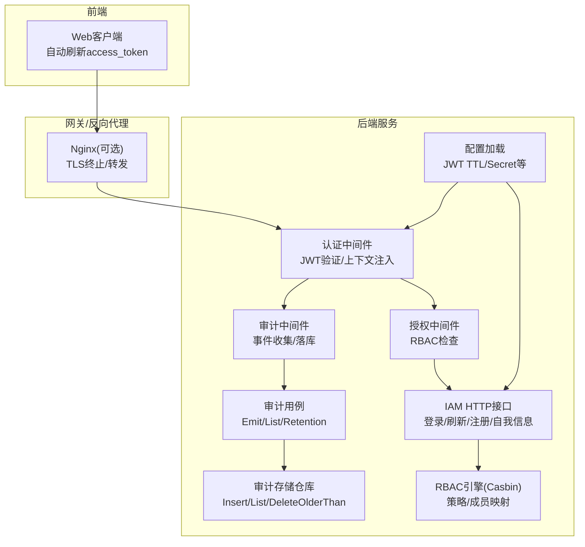
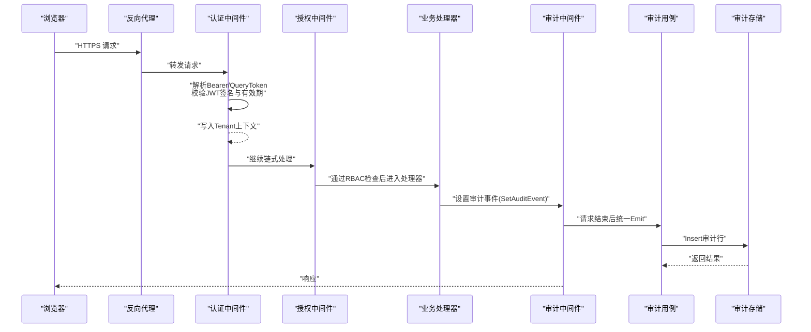
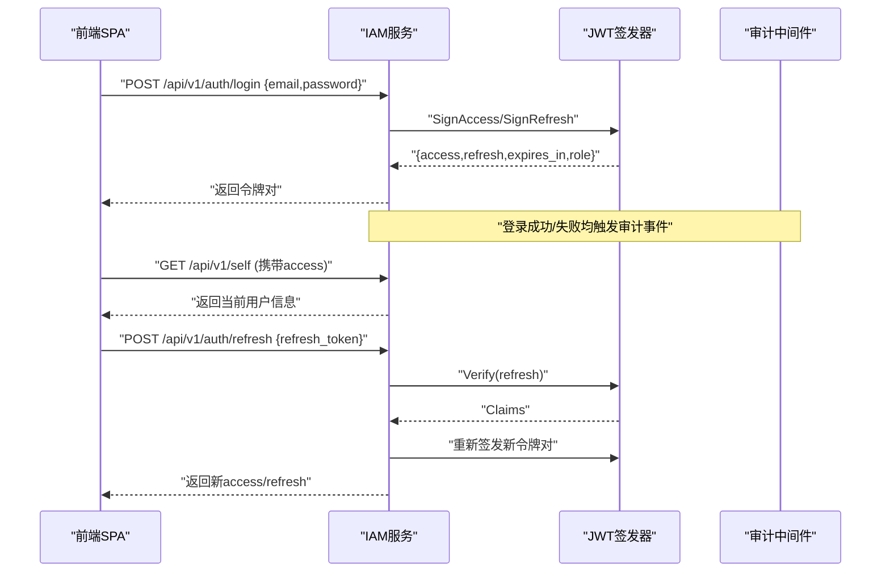
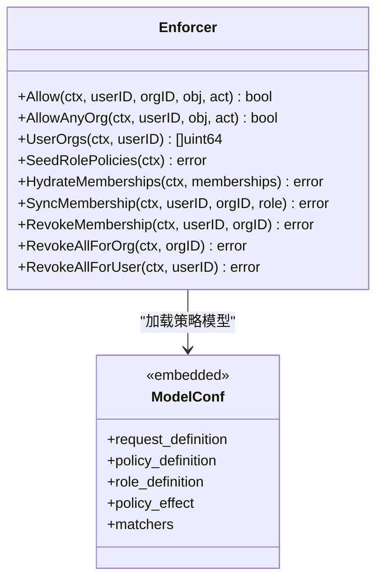
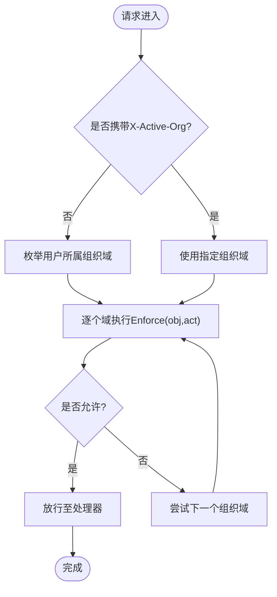
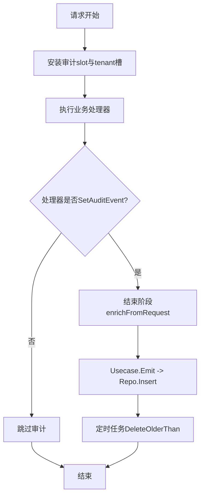
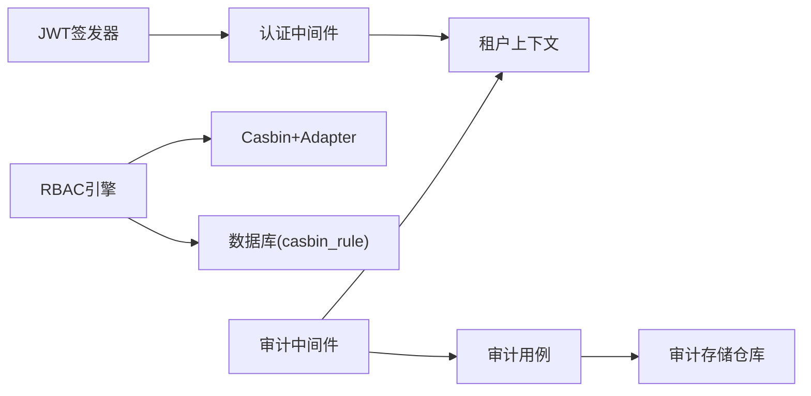

# 安全与认证

<cite>
**本文引用的文件**   
- [internal/pkg/auth/jwt.go](file://internal/pkg/auth/jwt.go)
- [internal/pkg/auth/middleware.go](file://internal/pkg/auth/middleware.go)
- [internal/iam/biz/user/usecase.go](file://internal/iam/biz/user/usecase.go)
- [internal/iam/server/http.go](file://internal/iam/server/http.go)
- [internal/manager/server/middleware/audit.go](file://internal/manager/server/middleware/audit.go)
- [internal/manager/biz/audit/usecase.go](file://internal/manager/biz/audit/usecase.go)
- [internal/manager/data/audit/store/repo.go](file://internal/manager/data/audit/store/repo.go)
- [internal/iam/biz/authz/authz.go](file://internal/iam/biz/authz/authz.go)
- [internal/iam/biz/authz/model.conf](file://internal/iam/biz/authz/model.conf)
- [internal/pkg/config/config.go](file://internal/pkg/config/config.go)
- [cmd/ongrid/main.go](file://cmd/ongrid/main.go)
- [web/src/api/client.ts](file://web/src/api/client.ts)
- [tests/e2e/auth_refresh_test.go](file://tests/e2e/auth_refresh_test.go)
</cite>

## 目录
1. [简介](#简介)
2. [项目结构](#项目结构)
3. [核心组件](#核心组件)
4. [架构总览](#架构总览)
5. [详细组件分析](#详细组件分析)
6. [依赖关系分析](#依赖关系分析)
7. [性能与安全特性](#性能与安全特性)
8. [故障排查指南](#故障排查指南)
9. [结论](#结论)
10. [附录](#附录)

## 简介
本文件面向安全管理员与平台运维人员，系统化梳理并说明本项目的安全与认证体系，包括：
- 用户认证流程（登录、令牌签发、刷新）
- JWT 令牌管理与会话处理
- RBAC 权限控制模型（角色、策略、资源访问）
- 多租户隔离方案（组织域与成员关系）
- 审计日志系统（关键操作轨迹）
- 网络安全架构（零信任原则、加密传输、访问控制）
- 密钥管理与敏感信息保护最佳实践
- 合规性与风险评估建议

## 项目结构
围绕安全与认证的关键代码分布在以下模块：
- 认证与鉴权中间件：JWT 签发/校验、请求上下文注入
- IAM 业务层：用户管理、登录/刷新、RBAC 策略同步
- 管理器审计中间件与用例：审计事件采集、持久化与保留清理
- 配置中心：JWT 生命周期、服务地址等运行时参数
- 前端客户端：自动刷新 access_token 的无感续期逻辑
- E2E 测试：覆盖 access 过期与 refresh 流程

图表来源
- [internal/pkg/auth/middleware.go:1-68](file://internal/pkg/auth/middleware.go#L1-L68)
- [internal/iam/biz/authz/authz.go:1-316](file://internal/iam/biz/authz/authz.go#L1-L316)
- [internal/manager/server/middleware/audit.go:1-169](file://internal/manager/server/middleware/audit.go#L1-L169)
- [internal/manager/biz/audit/usecase.go:1-191](file://internal/manager/biz/audit/usecase.go#L1-L191)
- [internal/manager/data/audit/store/repo.go:1-102](file://internal/manager/data/audit/store/repo.go#L1-L102)
- [internal/pkg/config/config.go:274-279](file://internal/pkg/config/config.go#L274-L279)
- [web/src/api/client.ts:114-162](file://web/src/api/client.ts#L114-L162)

章节来源
- [internal/pkg/auth/middleware.go:1-68](file://internal/pkg/auth/middleware.go#L1-L68)
- [internal/iam/biz/authz/authz.go:1-316](file://internal/iam/biz/authz/authz.go#L1-L316)
- [internal/manager/server/middleware/audit.go:1-169](file://internal/manager/server/middleware/audit.go#L1-L169)
- [internal/manager/biz/audit/usecase.go:1-191](file://internal/manager/biz/audit/usecase.go#L1-L191)
- [internal/manager/data/audit/store/repo.go:1-102](file://internal/manager/data/audit/store/repo.go#L1-L102)
- [internal/pkg/config/config.go:274-279](file://internal/pkg/config/config.go#L274-L279)
- [web/src/api/client.ts:114-162](file://web/src/api/client.ts#L114-L162)

## 核心组件
- JWT 签发与校验：提供短生命周期 access token 与长生命周期 refresh token；支持自定义 TTL 的内部票据。
- 认证中间件：从 Authorization 或查询参数提取 Bearer Token，校验签名与有效期，将调用者身份写入请求上下文。
- RBAC 引擎：基于 Casbin，硬编码角色矩阵 + 动态成员映射，实现按组织域的细粒度访问控制。
- 审计系统：以“谁在何时对何资源做了什么”为核心，记录成功/失败/拒绝三类状态，支持时间范围过滤与保留清理。
- 配置项：集中管理 JWT Secret、Access/Refresh TTL、外部服务 URL 等。
- 前端续期：当 access 过期时自动使用 refresh 换取新 access，保持用户体验无中断。

章节来源
- [internal/pkg/auth/jwt.go:1-100](file://internal/pkg/auth/jwt.go#L1-L100)
- [internal/pkg/auth/middleware.go:1-68](file://internal/pkg/auth/middleware.go#L1-L68)
- [internal/iam/biz/authz/authz.go:1-316](file://internal/iam/biz/authz/authz.go#L1-L316)
- [internal/manager/server/middleware/audit.go:1-169](file://internal/manager/server/middleware/audit.go#L1-L169)
- [internal/manager/biz/audit/usecase.go:1-191](file://internal/manager/biz/audit/usecase.go#L1-L191)
- [internal/manager/data/audit/store/repo.go:1-102](file://internal/manager/data/audit/store/repo.go#L1-L102)
- [internal/pkg/config/config.go:274-279](file://internal/pkg/config/config.go#L274-L279)
- [web/src/api/client.ts:114-162](file://web/src/api/client.ts#L114-L162)

## 架构总览
下图展示了从浏览器到后端的完整认证与授权路径，以及审计事件的生成与持久化。

图表来源
- [internal/pkg/auth/middleware.go:1-68](file://internal/pkg/auth/middleware.go#L1-L68)
- [internal/manager/server/middleware/audit.go:1-169](file://internal/manager/server/middleware/audit.go#L1-L169)
- [internal/manager/biz/audit/usecase.go:1-191](file://internal/manager/biz/audit/usecase.go#L1-L191)
- [internal/manager/data/audit/store/repo.go:1-102](file://internal/manager/data/audit/store/repo.go#L1-L102)

## 详细组件分析

### 用户认证与令牌管理（登录/刷新）
- 登录流程：
  - 校验邮箱与密码，命中则签发 access/refresh 令牌对，返回 access_token、refresh_token、expires_in、role。
  - 登录成功后由审计中间件记录登录动作（成功/失败）。
- 刷新流程：
  - 使用 refresh_token 校验通过后签发新的 access/refresh 对。
  - 前端在 access 过期时自动调用 /auth/refresh 续期，避免用户感知中断。
- 令牌结构：
  - Claims 包含 user_id、email、role、is_superuser 及标准 JWT 字段。
  - Access TTL 较短，Refresh TTL 较长；可通过环境变量调整。

图表来源
- [internal/iam/biz/user/usecase.go:80-123](file://internal/iam/biz/user/usecase.go#L80-L123)
- [internal/iam/biz/user/usecase.go:362-387](file://internal/iam/biz/user/usecase.go#L362-L387)
- [internal/iam/server/http.go:271-288](file://internal/iam/server/http.go#L271-L288)
- [internal/pkg/auth/jwt.go:56-79](file://internal/pkg/auth/jwt.go#L56-L79)
- [web/src/api/client.ts:114-162](file://web/src/api/client.ts#L114-L162)
- [tests/e2e/auth_refresh_test.go:20-54](file://tests/e2e/auth_refresh_test.go#L20-L54)

章节来源
- [internal/iam/biz/user/usecase.go:80-123](file://internal/iam/biz/user/usecase.go#L80-L123)
- [internal/iam/biz/user/usecase.go:362-387](file://internal/iam/biz/user/usecase.go#L362-L387)
- [internal/iam/server/http.go:271-288](file://internal/iam/server/http.go#L271-L288)
- [internal/pkg/auth/jwt.go:56-79](file://internal/pkg/auth/jwt.go#L56-L79)
- [web/src/api/client.ts:114-162](file://web/src/api/client.ts#L114-L162)
- [tests/e2e/auth_refresh_test.go:20-54](file://tests/e2e/auth_refresh_test.go#L20-L54)

### RBAC 权限控制模型
- 角色定义：
  - 内置角色：org_admin、member、viewer、superuser（超级管理员）。
  - 策略矩阵在启动时注入，不可运行时编辑。
- 成员映射：
  - 用户-组织-角色的三元组映射存储在 casbin_rule 表，随 org_memberships 变更同步。
- 决策规则：
  - 匹配子句支持通配符与对象前缀匹配，结合 domain（组织ID）进行隔离。
- 超级管理员短路：
  - 若 JWT 中 is_superuser=true 或 role=admin，鉴权中间件可短路绕过 casbin 直接放行。

图表来源
- [internal/iam/biz/authz/authz.go:1-316](file://internal/iam/biz/authz/authz.go#L1-L316)
- [internal/iam/biz/authz/model.conf:1-15](file://internal/iam/biz/authz/model.conf#L1-L15)

章节来源
- [internal/iam/biz/authz/authz.go:1-316](file://internal/iam/biz/authz/authz.go#L1-L316)
- [internal/iam/biz/authz/model.conf:1-15](file://internal/iam/biz/authz/model.conf#L1-L15)

### 多租户隔离方案
- 组织域（domain）：
  - 每个组织对应一个 domain（字符串化的 orgID），策略与成员映射均以 domain 为维度。
- 成员关系：
  - OrgMembership 驱动 casbin g 规则，确保用户仅能访问其所属组织的资源。
- 默认域选择：
  - 当请求未显式指定 X-Active-Org 时，中间件会遍历用户所有组织域，首个允许即放行（Phase 1 默认行为）。
- 数据隔离：
  - 上层业务根据 tenantctx 中的 UserID/OrgID 构造查询条件，确保跨组织数据不可见。

图表来源
- [internal/iam/biz/authz/authz.go:249-271](file://internal/iam/biz/authz/authz.go#L249-L271)
- [internal/iam/biz/authz/authz.go:273-289](file://internal/iam/biz/authz/authz.go#L273-L289)

章节来源
- [internal/iam/biz/authz/authz.go:249-271](file://internal/iam/biz/authz/authz.go#L249-L271)
- [internal/iam/biz/authz/authz.go:273-289](file://internal/iam/biz/authz/authz.go#L273-L289)

### 审计日志系统
- 事件采集：
  - 审计中间件在安装阶段创建可变 slot，处理器通过 SetAuditEvent 标注期望审计的动作。
  - 请求结束后，中间件从上下文填充 IP、UA、RequestID、状态桶等信息，统一 Emit。
- 事件内容：
  - 包含 Actor（UserID/Email/Role/IP/UA）、Action、ResourceType/ID/Name、Status、Payload 等。
- 持久化与保留：
  - 插入审计行；支持按时间范围过滤列表；每日定时清理超过保留期的旧记录。
- 与鉴权的协作：
  - 登录成功/失败、资源访问拒绝等均纳入审计，形成闭环。

图表来源
- [internal/manager/server/middleware/audit.go:72-104](file://internal/manager/server/middleware/audit.go#L72-L104)
- [internal/manager/server/middleware/audit.go:106-144](file://internal/manager/server/middleware/audit.go#L106-L144)
- [internal/manager/biz/audit/usecase.go:74-116](file://internal/manager/biz/audit/usecase.go#L74-L116)
- [internal/manager/biz/audit/usecase.go:149-183](file://internal/manager/biz/audit/usecase.go#L149-L183)
- [internal/manager/data/audit/store/repo.go:31-33](file://internal/manager/data/audit/store/repo.go#L31-L33)
- [internal/manager/data/audit/store/repo.go:96-101](file://internal/manager/data/audit/store/repo.go#L96-L101)

章节来源
- [internal/manager/server/middleware/audit.go:72-104](file://internal/manager/server/middleware/audit.go#L72-L104)
- [internal/manager/server/middleware/audit.go:106-144](file://internal/manager/server/middleware/audit.go#L106-L144)
- [internal/manager/biz/audit/usecase.go:74-116](file://internal/manager/biz/audit/usecase.go#L74-L116)
- [internal/manager/biz/audit/usecase.go:149-183](file://internal/manager/biz/audit/usecase.go#L149-L183)
- [internal/manager/data/audit/store/repo.go:31-33](file://internal/manager/data/audit/store/repo.go#L31-L33)
- [internal/manager/data/audit/store/repo.go:96-101](file://internal/manager/data/audit/store/repo.go#L96-L101)

### 网络安全架构（零信任、加密传输、访问控制）
- 零信任原则：
  - 每次请求均需携带有效 JWT，服务端不信任任何前置网络边界。
  - 中间件严格校验签名与有效期，失败即拒绝。
- 加密传输：
  - 建议部署 TLS 终止于反向代理（如 Nginx），后端服务间通信建议使用内网加密通道。
- 访问控制列表：
  - 基于 RBAC 的策略矩阵与成员映射构成 ACL 语义，结合 domain 实现组织级隔离。
- 内部票据：
  - 支持用相同签名算法签发带 TTL 的内部票据，用于反向代理子请求等场景。

章节来源
- [internal/pkg/auth/middleware.go:10-53](file://internal/pkg/auth/middleware.go#L10-L53)
- [internal/iam/biz/authz/authz.go:86-125](file://internal/iam/biz/authz/authz.go#L86-L125)
- [internal/manager/service/prometheus/service.go:84-108](file://internal/manager/service/prometheus/service.go#L84-L108)

### 密钥管理与敏感信息保护
- JWT 密钥：
  - 通过环境变量配置，生产环境必须替换默认值，禁止硬编码。
- 密码哈希：
  - 使用强哈希算法对用户密码进行加盐哈希存储，登录时比对。
- 敏感字段脱敏：
  - 审计 Payload 需由调用方负责脱敏，避免泄露密钥、口令、令牌等。
- 配置最小暴露：
  - 仅暴露必要的环境变量，避免将密钥写入日志或错误消息。

章节来源
- [internal/pkg/config/config.go:386-388](file://internal/pkg/config/config.go#L386-L388)
- [internal/iam/biz/user/usecase.go:61-77](file://internal/iam/biz/user/usecase.go#L61-L77)
- [internal/manager/biz/audit/usecase.go:52-56](file://internal/manager/biz/audit/usecase.go#L52-L56)

## 依赖关系分析
- 组件耦合：
  - 认证中间件依赖 JWT 签发器与租户上下文包。
  - RBAC 引擎依赖 Casbin 与数据库适配器，策略与成员映射双向同步。
  - 审计中间件依赖审计用例与存储仓库，且与认证中间件共享租户上下文槽。
- 外部依赖：
  - JWT 库、Casbin、GORM 适配器等。
- 潜在循环依赖：
  - 各层通过接口与上下文传递解耦，未发现直接循环导入。

图表来源
- [internal/pkg/auth/jwt.go:1-100](file://internal/pkg/auth/jwt.go#L1-L100)
- [internal/pkg/auth/middleware.go:1-68](file://internal/pkg/auth/middleware.go#L1-L68)
- [internal/iam/biz/authz/authz.go:1-316](file://internal/iam/biz/authz/authz.go#L1-L316)
- [internal/manager/server/middleware/audit.go:1-169](file://internal/manager/server/middleware/audit.go#L1-L169)
- [internal/manager/biz/audit/usecase.go:1-191](file://internal/manager/biz/audit/usecase.go#L1-L191)
- [internal/manager/data/audit/store/repo.go:1-102](file://internal/manager/data/audit/store/repo.go#L1-L102)

章节来源
- [internal/pkg/auth/jwt.go:1-100](file://internal/pkg/auth/jwt.go#L1-L100)
- [internal/pkg/auth/middleware.go:1-68](file://internal/pkg/auth/middleware.go#L1-L68)
- [internal/iam/biz/authz/authz.go:1-316](file://internal/iam/biz/authz/authz.go#L1-L316)
- [internal/manager/server/middleware/audit.go:1-169](file://internal/manager/server/middleware/audit.go#L1-L169)
- [internal/manager/biz/audit/usecase.go:1-191](file://internal/manager/biz/audit/usecase.go#L1-L191)
- [internal/manager/data/audit/store/repo.go:1-102](file://internal/manager/data/audit/store/repo.go#L1-L102)

## 性能与安全特性
- 令牌校验开销低：
  - JWT 校验为纯内存计算，无需额外 DB 查询，适合高并发。
- 策略缓存：
  - Casbin 使用 SyncedEnforcer 并在内存中维护策略，提升决策性能。
- 审计写入非阻塞：
  - 审计失败仅告警，不影响主业务流程。
- 前端续期防抖：
  - 并发刷新请求去重，避免重复刷新造成风暴。

章节来源
- [internal/pkg/auth/jwt.go:81-99](file://internal/pkg/auth/jwt.go#L81-L99)
- [internal/iam/biz/authz/authz.go:64-84](file://internal/iam/biz/authz/authz.go#L64-L84)
- [internal/manager/biz/audit/usecase.go:72-116](file://internal/manager/biz/audit/usecase.go#L72-L116)
- [web/src/api/client.ts:114-162](file://web/src/api/client.ts#L114-L162)

## 故障排查指南
- 登录失败：
  - 检查邮箱/密码是否正确，确认用户状态为活跃；查看审计日志中的登录失败事件。
- 401 未授权：
  - 确认请求携带有效 Bearer Token；检查 JWT Secret 配置一致；核对 access 是否过期。
- 刷新失败：
  - 确认 refresh_token 未过期且未被撤销；检查用户状态；查看刷新接口返回。
- 权限不足：
  - 检查用户是否在目标组织拥有相应角色；确认策略矩阵与成员映射已同步。
- 审计缺失：
  - 确认处理器调用了 SetAuditEvent；检查审计中间件是否安装；查看审计存储是否可用。

章节来源
- [internal/iam/biz/user/usecase.go:80-123](file://internal/iam/biz/user/usecase.go#L80-L123)
- [internal/pkg/auth/middleware.go:21-53](file://internal/pkg/auth/middleware.go#L21-L53)
- [internal/manager/server/middleware/audit.go:72-104](file://internal/manager/server/middleware/audit.go#L72-L104)
- [internal/manager/biz/audit/usecase.go:74-116](file://internal/manager/biz/audit/usecase.go#L74-L116)

## 结论
本项目实现了以 JWT 为核心的无状态认证、基于 Casbin 的 RBAC 权限控制、组织域隔离的多租户模型，以及完善的审计日志体系。配合前端自动续期与严格的中间件校验，形成了端到端的安全闭环。建议在生产环境中强化密钥管理、启用 TLS、完善速率限制与异常检测，以满足更严格的合规要求。

## 附录

### 配置与环境变量（与安全相关）
- JWT 密钥与生命周期：
  - ONGRID_JWT_SECRET：JWT 签名密钥（生产环境必须替换默认值）
  - ONGRID_JWT_ACCESS_TTL：access token 有效期
  - ONGRID_JWT_REFRESH_TTL：refresh token 有效期
- 审计保留：
  - ONGRID_AUDIT_RETENTION_DAYS：审计日志保留天数（0 表示禁用自动清理）

章节来源
- [internal/pkg/config/config.go:386-388](file://internal/pkg/config/config.go#L386-L388)
- [cmd/ongrid/main.go:409-436](file://cmd/ongrid/main.go#L409-L436)