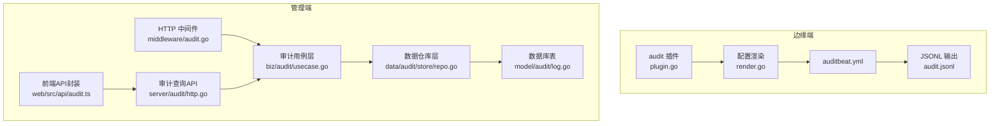
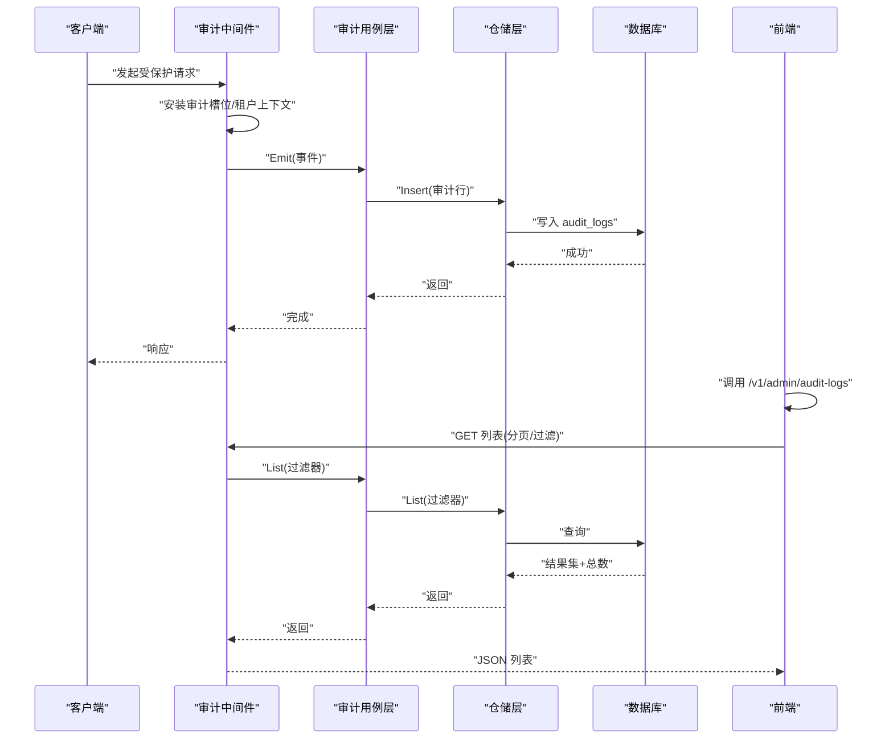
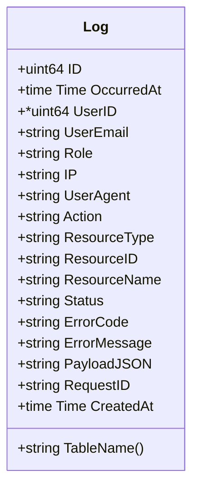
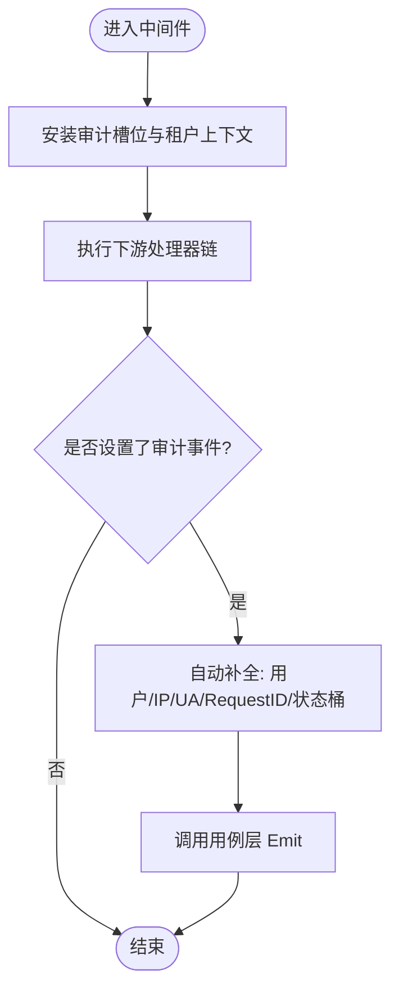
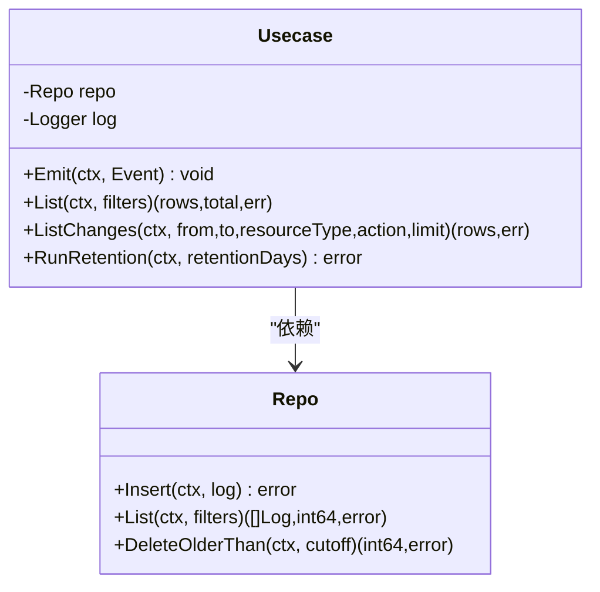
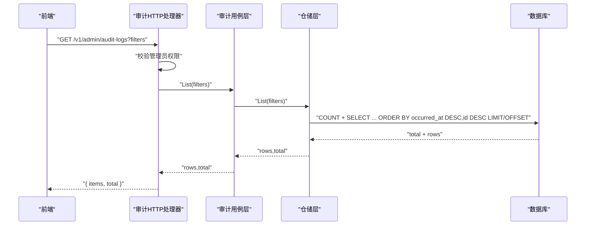
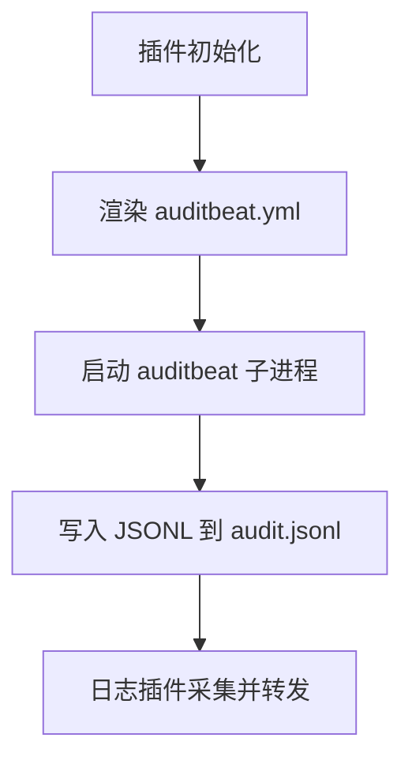
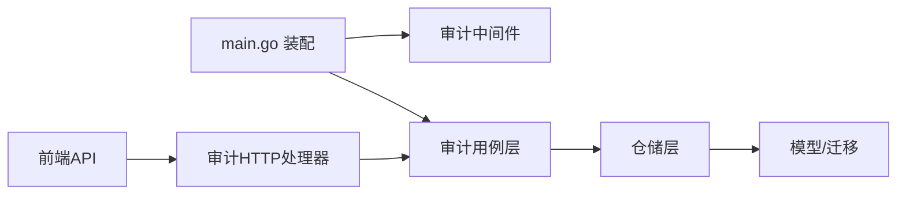

# 审计日志系统

<cite>
**本文引用的文件**   
- [cmd/ongrid/main.go](file://cmd/ongrid/main.go)
- [internal/manager/server/middleware/audit.go](file://internal/manager/server/middleware/audit.go)
- [internal/manager/biz/audit/usecase.go](file://internal/manager/biz/audit/usecase.go)
- [internal/manager/data/audit/store/repo.go](file://internal/manager/data/audit/store/repo.go)
- [internal/manager/data/audit/store/migrate.go](file://internal/manager/data/audit/store/migrate.go)
- [internal/manager/model/audit/log.go](file://internal/manager/model/audit/log.go)
- [internal/manager/server/audit/http.go](file://internal/manager/server/audit/http.go)
- [web/src/api/audit.ts](file://web/src/api/audit.ts)
- [internal/edgeagent/plugins/audit/plugin.go](file://internal/edgeagent/plugins/audit/plugin.go)
- [internal/edgeagent/plugins/audit/render.go](file://internal/edgeagent/plugins/audit/render.go)
</cite>

## 目录
1. [简介](#简介)
2. [项目结构](#项目结构)
3. [核心组件](#核心组件)
4. [架构总览](#架构总览)
5. [详细组件分析](#详细组件分析)
6. [依赖关系分析](#依赖关系分析)
7. [性能与索引优化](#性能与索引优化)
8. [检索与分析能力](#检索与分析能力)
9. [合规报告与归档清理](#合规报告与归档清理)
10. [故障排查指南](#故障排查指南)
11. [结论](#结论)

## 简介
本文件面向安全管理员与运维人员，系统化阐述审计日志系统的设计原则、记录策略、事件捕获机制、持久化存储、检索分析、合规报告生成以及清理归档策略。系统围绕“谁在何时对什么资源做了什么”的不可篡改轨迹展开，兼顾高可用写入（失败不阻塞业务）、可观测性（请求ID关联）与可查询性（分页过滤）。

## 项目结构
审计日志系统由边缘侧采集与管理侧持久化两部分组成：
- 边缘侧：通过插件子进程方式运行 auditbeat，输出 JSONL 到本地文件，供日志采集器后续处理。
- 管理侧：HTTP 中间件捕获显式标注的业务操作，使用用例层统一写入数据库表，并提供只读查询接口给前端。

图表来源
- [internal/edgeagent/plugins/audit/plugin.go:1-92](file://internal/edgeagent/plugins/audit/plugin.go#L1-L92)
- [internal/edgeagent/plugins/audit/render.go:1-461](file://internal/edgeagent/plugins/audit/render.go#L1-L461)
- [internal/manager/server/middleware/audit.go:1-169](file://internal/manager/server/middleware/audit.go#L1-L169)
- [internal/manager/biz/audit/usecase.go:1-191](file://internal/manager/biz/audit/usecase.go#L1-L191)
- [internal/manager/data/audit/store/repo.go:1-102](file://internal/manager/data/audit/store/repo.go#L1-L102)
- [internal/manager/model/audit/log.go:1-136](file://internal/manager/model/audit/log.go#L1-L136)
- [internal/manager/server/audit/http.go:1-172](file://internal/manager/server/audit/http.go#L1-L172)
- [web/src/api/audit.ts:1-55](file://web/src/api/audit.ts#L1-L55)

章节来源
- [cmd/ongrid/main.go:409-436](file://cmd/ongrid/main.go#L409-L436)
- [cmd/ongrid/main.go:2533](file://cmd/ongrid/main.go#L2533)

## 核心组件
- 模型与常量：定义审计行结构与动作/资源类型枚举，约束字段长度与非空语义，确保可读性与一致性。
- 中间件：基于请求上下文的可变槽位收集审计事件，自动补全用户、IP、UA、请求ID与状态桶。
- 用例层：提供 Emit/List/ListChanges/RunRetention 等能力，保证写入失败不阻塞业务，支持变更窗口查询。
- 仓储层：薄封装插入、分页列表、按时间删除；列表默认限制上限以控制响应体大小。
- HTTP API：仅管理员可读，参数解析与错误码映射清晰。
- 边缘插件：渲染 auditbeat 配置并启动子进程，输出 JSONL 到固定路径，便于日志链路串联。

章节来源
- [internal/manager/model/audit/log.go:1-136](file://internal/manager/model/audit/log.go#L1-L136)
- [internal/manager/server/middleware/audit.go:1-169](file://internal/manager/server/middleware/audit.go#L1-L169)
- [internal/manager/biz/audit/usecase.go:1-191](file://internal/manager/biz/audit/usecase.go#L1-L191)
- [internal/manager/data/audit/store/repo.go:1-102](file://internal/manager/data/audit/store/repo.go#L1-L102)
- [internal/manager/server/audit/http.go:1-172](file://internal/manager/server/audit/http.go#L1-L172)
- [internal/edgeagent/plugins/audit/plugin.go:1-92](file://internal/edgeagent/plugins/audit/plugin.go#L1-L92)
- [internal/edgeagent/plugins/audit/render.go:1-461](file://internal/edgeagent/plugins/audit/render.go#L1-L461)

## 架构总览
审计日志在两条路径上协同工作：
- 管理面审计：HTTP 请求经中间件收集显式标注的操作，落库后通过只读 API 暴露给前端。
- 边缘面审计：auditbeat 子进程将系统级事件输出为 JSONL，供日志采集链路消费。

图表来源
- [internal/manager/server/middleware/audit.go:1-169](file://internal/manager/server/middleware/audit.go#L1-L169)
- [internal/manager/biz/audit/usecase.go:1-191](file://internal/manager/biz/audit/usecase.go#L1-L191)
- [internal/manager/data/audit/store/repo.go:1-102](file://internal/manager/data/audit/store/repo.go#L1-L102)
- [internal/manager/server/audit/http.go:1-172](file://internal/manager/server/audit/http.go#L1-L172)

## 详细组件分析

### 模型与常量设计
- 主键自增 ID，发生时间 OccurredAt 用于排序与范围筛选。
- 用户维度：UserID（可为空，兼容匿名场景）、UserEmail、Role。
- 请求维度：IP、UserAgent、RequestID（与结构化日志关联）。
- 行为维度：Action、ResourceType、ResourceID、ResourceName。
- 结果维度：Status（success/failure/denied）、ErrorCode、ErrorMessage。
- 扩展维度：PayloadJSON（自由格式，需在上游脱敏）。
- 审计视图：TableName 固定为 audit_logs，避免迁移漂移。

图表来源
- [internal/manager/model/audit/log.go:1-136](file://internal/manager/model/audit/log.go#L1-L136)

章节来源
- [internal/manager/model/audit/log.go:1-136](file://internal/manager/model/audit/log.go#L1-L136)

### 中间件与事件捕获
- 审计槽位：在请求上下文中注入可变 slot，允许下游 handler 设置审计事件。
- 自动补全：从租户上下文填充用户信息；从请求头/连接信息提取 IP、UA；从 chi 中间件获取 RequestID；根据响应状态映射 status 桶。
- 非侵入：未显式 SetAuditEvent 的请求不会被审计，避免噪音。

图表来源
- [internal/manager/server/middleware/audit.go:1-169](file://internal/manager/server/middleware/audit.go#L1-L169)

章节来源
- [internal/manager/server/middleware/audit.go:1-169](file://internal/manager/server/middleware/audit.go#L1-L169)

### 用例层与持久化
- Emit：构造行对象，序列化 PayloadJSON，插入失败仅告警不抛错，确保业务不受影响。
- List：支持多条件过滤与分页，默认 limit 上限 500，防止大响应体。
- ListChanges：面向 RCA 的便捷方法，返回指定时间窗内的变更事件。
- RunRetention：每日 03:00 触发，删除早于保留期的行；环境变量可关闭自动清理。

图表来源
- [internal/manager/biz/audit/usecase.go:1-191](file://internal/manager/biz/audit/usecase.go#L1-L191)
- [internal/manager/data/audit/store/repo.go:1-102](file://internal/manager/data/audit/store/repo.go#L1-L102)

章节来源
- [internal/manager/biz/audit/usecase.go:1-191](file://internal/manager/biz/audit/usecase.go#L1-L191)
- [internal/manager/data/audit/store/repo.go:1-102](file://internal/manager/data/audit/store/repo.go#L1-L102)

### HTTP 查询接口
- 路由：/v1/admin/audit-logs，仅管理员或超级用户可访问。
- 过滤参数：user_email、action、resource_type、status、from/to（RFC3339）、limit、offset。
- 响应：items 数组与 total 计数，便于前端分页展示。
- 错误码：unauthorized/forbidden/invalid/not_found/internal 等。

图表来源
- [internal/manager/server/audit/http.go:1-172](file://internal/manager/server/audit/http.go#L1-L172)
- [internal/manager/biz/audit/usecase.go:1-191](file://internal/manager/biz/audit/usecase.go#L1-L191)
- [internal/manager/data/audit/store/repo.go:1-102](file://internal/manager/data/audit/store/repo.go#L1-L102)

章节来源
- [internal/manager/server/audit/http.go:1-172](file://internal/manager/server/audit/http.go#L1-L172)
- [web/src/api/audit.ts:1-55](file://web/src/api/audit.ts#L1-L55)

### 边缘侧审计插件
- 插件生命周期：构建子进程，渲染配置，启动 auditbeat，输出 JSONL 到 workDir/audit/audit.jsonl。
- 配置渲染：两种模式——raw_config 透传或结构化模板渲染；自动注入设备标识、字段裁剪与内部路径。
- 输出契约：OutputPath 稳定，供日志插件自动发现与采集。

图表来源
- [internal/edgeagent/plugins/audit/plugin.go:1-92](file://internal/edgeagent/plugins/audit/plugin.go#L1-L92)
- [internal/edgeagent/plugins/audit/render.go:1-461](file://internal/edgeagent/plugins/audit/render.go#L1-L461)

章节来源
- [internal/edgeagent/plugins/audit/plugin.go:1-92](file://internal/edgeagent/plugins/audit/plugin.go#L1-L92)
- [internal/edgeagent/plugins/audit/render.go:1-461](file://internal/edgeagent/plugins/audit/render.go#L1-L461)

## 依赖关系分析
- 中间件依赖用例层，用例层依赖仓储层，仓储层依赖 GORM 与模型。
- 启动阶段组装审计仓库与用例，注册中间件，并在后台任务中启动保留期清理协程。
- 前端通过 API 封装调用后端查询接口。

图表来源
- [cmd/ongrid/main.go:409-436](file://cmd/ongrid/main.go#L409-L436)
- [cmd/ongrid/main.go:2533](file://cmd/ongrid/main.go#L2533)
- [internal/manager/server/middleware/audit.go:1-169](file://internal/manager/server/middleware/audit.go#L1-L169)
- [internal/manager/biz/audit/usecase.go:1-191](file://internal/manager/biz/audit/usecase.go#L1-L191)
- [internal/manager/data/audit/store/repo.go:1-102](file://internal/manager/data/audit/store/repo.go#L1-L102)
- [internal/manager/data/audit/store/migrate.go:1-15](file://internal/manager/data/audit/store/migrate.go#L1-L15)
- [internal/manager/server/audit/http.go:1-172](file://internal/manager/server/audit/http.go#L1-L172)
- [web/src/api/audit.ts:1-55](file://web/src/api/audit.ts#L1-L55)

章节来源
- [cmd/ongrid/main.go:409-436](file://cmd/ongrid/main.go#L409-L436)
- [cmd/ongrid/main.go:2533](file://cmd/ongrid/main.go#L2533)

## 性能与索引优化
- 写入路径：Emit 失败仅告警，不阻塞业务；PayloadJSON 序列化失败降级为空，保障稳定性。
- 查询路径：
  - 列表查询按 occurred_at DESC, id DESC 排序，结合分页参数 limit/offset。
  - 过滤条件包含 user_email、action、resource_type、status、from/to。
  - 默认 limit 上限 500，避免过大响应体。
- 索引建议（基于模型注释与查询模式）：
  - 已声明索引：occurred_at、user_id、action、resource(resource_type+resource_id)、status。
  - 组合查询频繁时，可在 occurred_at + resource_type 或 occurred_at + action 上考虑复合索引以提升范围扫描性能。
  - 注意：索引越多写入越慢，应依据实际查询热点评估新增。

章节来源
- [internal/manager/biz/audit/usecase.go:1-191](file://internal/manager/biz/audit/usecase.go#L1-L191)
- [internal/manager/data/audit/store/repo.go:1-102](file://internal/manager/data/audit/store/repo.go#L1-L102)
- [internal/manager/model/audit/log.go:1-136](file://internal/manager/model/audit/log.go#L1-L136)

## 检索与分析能力
- 时间范围筛选：from/to 支持 RFC3339 字符串，适合仪表盘与报表导出。
- 用户行为追踪：按 user_email、role、ip、user_agent 定位特定用户会话与来源。
- 操作影响分析：按 action、resource_type、resource_id 聚合变更事件，结合 payload_json 查看具体字段变化。
- 变更窗口查询：ListChanges 提供时间窗内变更事件，辅助根因分析。
- 前端集成：web/src/api/audit.ts 封装了查询参数拼接与响应结构，便于页面渲染。

章节来源
- [internal/manager/biz/audit/usecase.go:1-191](file://internal/manager/biz/audit/usecase.go#L1-L191)
- [internal/manager/server/audit/http.go:1-172](file://internal/manager/server/audit/http.go#L1-L172)
- [web/src/api/audit.ts:1-55](file://web/src/api/audit.ts#L1-L55)

## 合规报告与归档清理
- 保留期策略：
  - 默认保留 180 天，可通过环境变量 ONGRID_AUDIT_RETENTION_DAYS 调整；设为 0 则禁用自动清理，交由外部归档流程管理。
  - 清理任务每天 03:00 触发，删除早于截止时间的行，并记录清理行数。
- 合规报告：
  - 利用审计查询接口导出指定时间窗与条件的审计记录，结合 payload_json 形成变更清单。
  - 结合 RequestID 与结构化日志进行跨系统关联，满足取证需求。
- 边缘侧归档：
  - auditbeat 输出 JSONL 至本地文件，可按主机/租户标签归档至集中日志平台，便于长期留存与离线分析。

章节来源
- [cmd/ongrid/main.go:409-436](file://cmd/ongrid/main.go#L409-L436)
- [cmd/ongrid/main.go:2533](file://cmd/ongrid/main.go#L2533)
- [internal/manager/biz/audit/usecase.go:1-191](file://internal/manager/biz/audit/usecase.go#L1-L191)
- [internal/edgeagent/plugins/audit/plugin.go:1-92](file://internal/edgeagent/plugins/audit/plugin.go#L1-L92)
- [internal/edgeagent/plugins/audit/render.go:1-461](file://internal/edgeagent/plugins/audit/render.go#L1-L461)

## 故障排查指南
- 审计写入失败：
  - 现象：业务正常但无审计行。
  - 排查：检查用例层 Emit 的 warn 日志；确认仓储层 Insert 是否报错；验证数据库连接与表结构。
- 查询无结果：
  - 现象：前端列表为空。
  - 排查：确认过滤条件是否正确；检查 occurred_at 范围；确认分页 limit/offset 是否合理。
- 权限拒绝：
  - 现象：403/401。
  - 排查：确认当前用户角色是否为 admin 或 superuser；检查认证中间件是否生效。
- 边缘审计无输出：
  - 现象：audit.jsonl 不存在或为空。
  - 排查：确认插件二进制存在；检查渲染配置中的 path.home/data/logs 是否落在可写目录；核对 output_file 名称与 OutputPath 契约。

章节来源
- [internal/manager/biz/audit/usecase.go:1-191](file://internal/manager/biz/audit/usecase.go#L1-L191)
- [internal/manager/server/audit/http.go:1-172](file://internal/manager/server/audit/http.go#L1-L172)
- [internal/edgeagent/plugins/audit/plugin.go:1-92](file://internal/edgeagent/plugins/audit/plugin.go#L1-L92)
- [internal/edgeagent/plugins/audit/render.go:1-461](file://internal/edgeagent/plugins/audit/render.go#L1-L461)

## 结论
本审计日志系统以“最小噪声、最大价值”为原则，聚焦关键操作的不可篡改记录，采用中间件+用例层+仓储层的分层设计，确保写入高可用与查询高效。配合边缘侧 auditbeat 的系统级事件采集，形成覆盖应用与系统的完整审计闭环。通过合理的索引设计与保留期策略，系统在合规性与可维护性之间取得平衡，并为安全分析与事件响应提供了坚实基础。