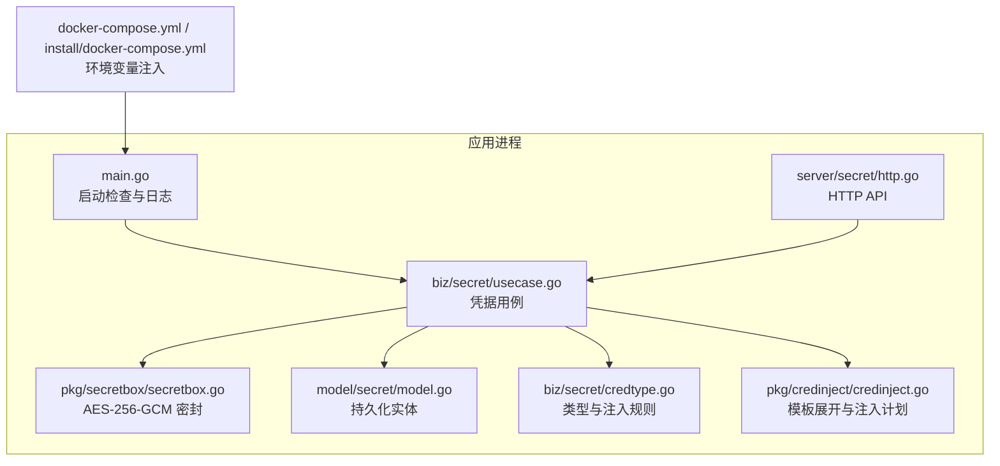
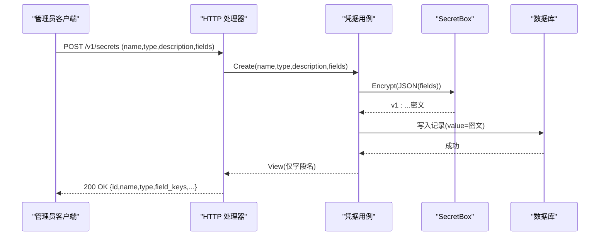
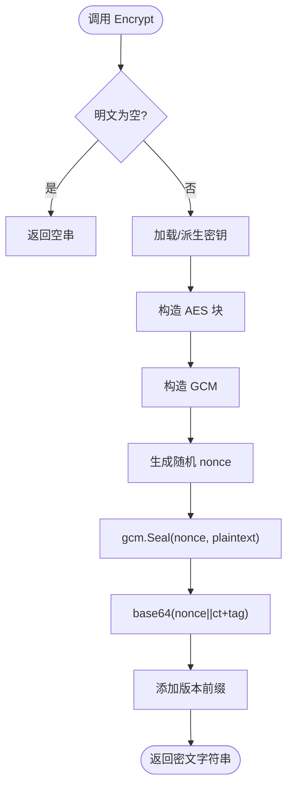
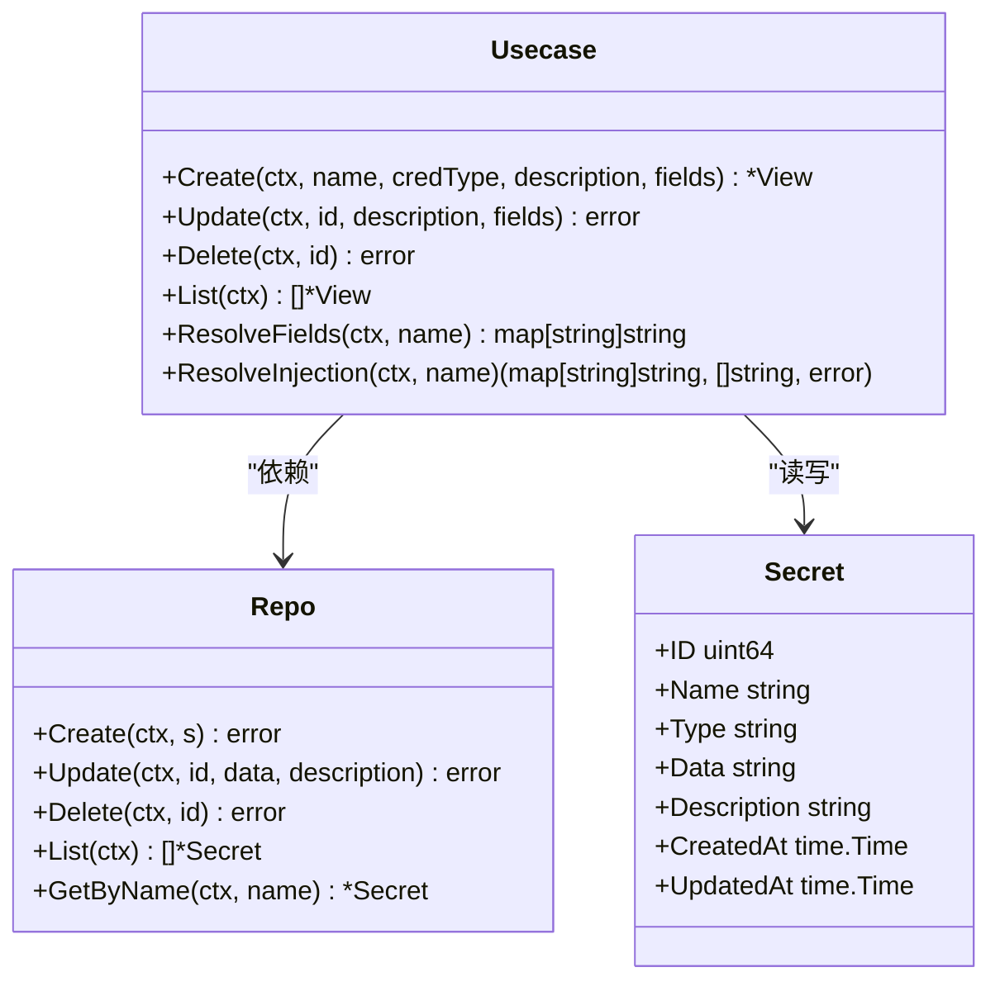
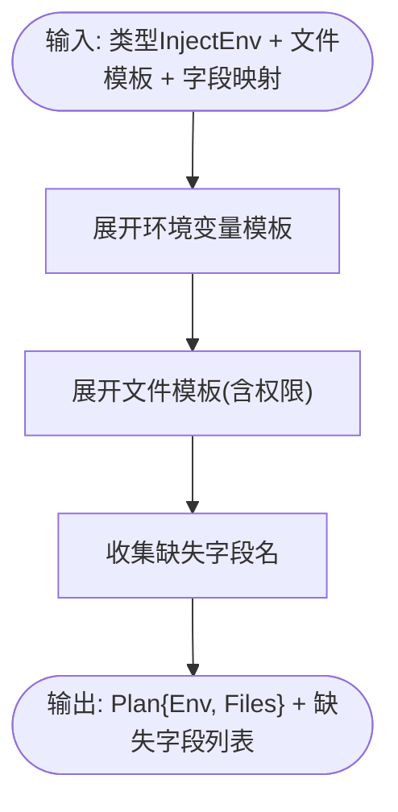
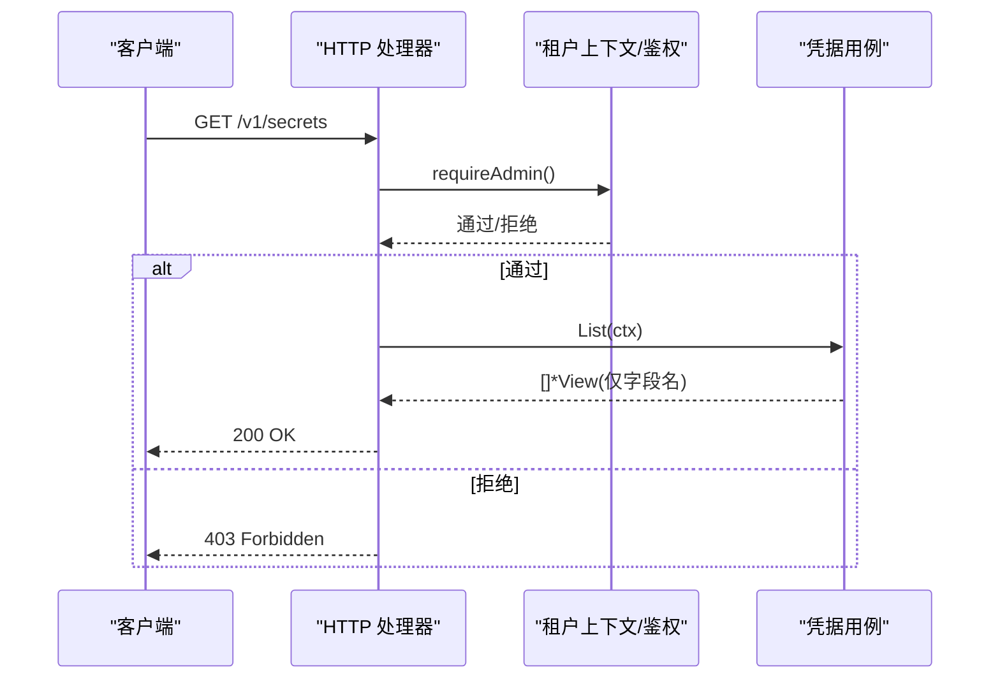
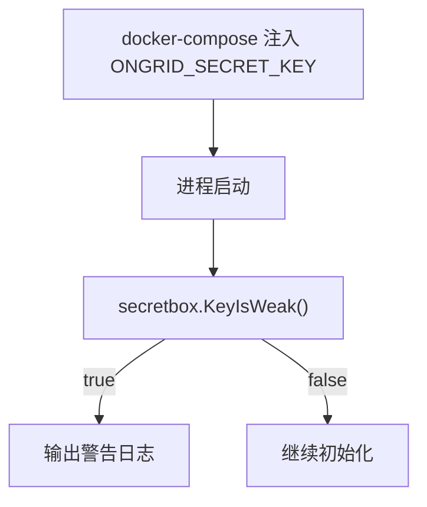
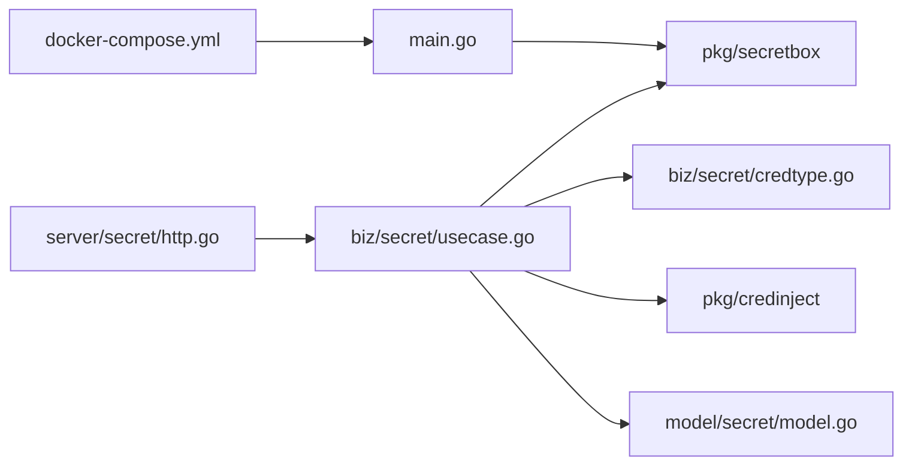

# 密钥管理

<cite>
**本文引用的文件**   
- [internal/pkg/secretbox/secretbox.go](file://internal/pkg/secretbox/secretbox.go)
- [internal/manager/biz/secret/usecase.go](file://internal/manager/biz/secret/usecase.go)
- [internal/manager/model/secret/model.go](file://internal/manager/model/secret/model.go)
- [internal/manager/server/secret/http.go](file://internal/manager/server/secret/http.go)
- [internal/manager/biz/secret/credtype.go](file://internal/manager/biz/secret/credtype.go)
- [internal/pkg/credinject/credinject.go](file://internal/pkg/credinject/credinject.go)
- [cmd/ongrid/main.go](file://cmd/ongrid/main.go)
- [deploy/docker-compose.yml](file://deploy/docker-compose.yml)
- [deploy/install/docker-compose.yml](file://deploy/install/docker-compose.yml)
- [ROADMAP.md](file://ROADMAP.md)
</cite>

## 目录
1. [简介](#简介)
2. [项目结构](#项目结构)
3. [核心组件](#核心组件)
4. [架构总览](#架构总览)
5. [详细组件分析](#详细组件分析)
6. [依赖关系分析](#依赖关系分析)
7. [性能与安全特性](#性能与安全特性)
8. [故障排查指南](#故障排查指南)
9. [结论](#结论)
10. [附录：运维最佳实践与外部集成建议](#附录运维最佳实践与外部集成建议)

## 简介
本文件面向运维与平台工程团队，系统化说明本项目中的“密钥管理系统”（凭证库）设计、实现与使用方式。重点覆盖：
- 加密存储机制：对称算法选择、密钥派生、密文保护策略
- SecretBox 实现原理：加解密流程、密钥轮换与安全存储方案
- 敏感信息生命周期管理：创建、更新、删除与访问控制
- 运行时注入机制：如何将凭据安全注入到进程环境
- 外部密钥管理服务集成：Vault、KMS 等扩展思路
- 备份恢复与灾难恢复策略
- 运维最佳实践与安全配置建议

## 项目结构
凭证库相关代码按分层组织：
- 横切工具层：提供 AES-256-GCM 密封能力（SecretBox）
- 业务层：凭据的创建、更新、列表、解析与注入规则
- 模型层：持久化实体定义
- 服务层：HTTP API 暴露（仅管理员可写，值只写不读）
- 启动期：主进程对弱密钥告警与环境变量注入

图表来源
- [cmd/ongrid/main.go:2238-2241](file://cmd/ongrid/main.go#L2238-L2241)
- [internal/manager/biz/secret/usecase.go:1-202](file://internal/manager/biz/secret/usecase.go#L1-L202)
- [internal/pkg/secretbox/secretbox.go:1-110](file://internal/pkg/secretbox/secretbox.go#L1-L110)
- [internal/manager/model/secret/model.go:1-46](file://internal/manager/model/secret/model.go#L1-L46)
- [internal/manager/server/secret/http.go:1-189](file://internal/manager/server/secret/http.go#L1-L189)
- [internal/manager/biz/secret/credtype.go:1-116](file://internal/manager/biz/secret/credtype.go#L1-L116)
- [internal/pkg/credinject/credinject.go:1-100](file://internal/pkg/credinject/credinject.go#L1-L100)
- [deploy/docker-compose.yml:67](file://deploy/docker-compose.yml#L67)
- [deploy/install/docker-compose.yml:102](file://deploy/install/docker-compose.yml#L102)

章节来源
- [cmd/ongrid/main.go:2238-2241](file://cmd/ongrid/main.go#L2238-L2241)
- [internal/manager/biz/secret/usecase.go:1-202](file://internal/manager/biz/secret/usecase.go#L1-L202)
- [internal/pkg/secretbox/secretbox.go:1-110](file://internal/pkg/secretbox/secretbox.go#L1-L110)
- [internal/manager/model/secret/model.go:1-46](file://internal/manager/model/secret/model.go#L1-L46)
- [internal/manager/server/secret/http.go:1-189](file://internal/manager/server/secret/http.go#L1-L189)
- [internal/manager/biz/secret/credtype.go:1-116](file://internal/manager/biz/secret/credtype.go#L1-L116)
- [internal/pkg/credinject/credinject.go:1-100](file://internal/pkg/credinject/credinject.go#L1-L100)
- [deploy/docker-compose.yml:67](file://deploy/docker-compose.yml#L67)
- [deploy/install/docker-compose.yml:102](file://deploy/install/docker-compose.yml#L102)

## 核心组件
- SecretBox（在途密封）
  - 算法：AES-256-GCM
  - 密钥派生：从环境变量 ONGRID_SECRET_KEY 经 SHA-256 得到 32 字节密钥；未设置时使用固定盐派生的默认键并标记为“弱密钥”
  - 密文格式：版本前缀 + base64(nonce || ciphertext+tag)，便于未来演进
  - 空输入处理：空字符串直接返回空，避免无意义噪声
- 凭据用例（Usecase）
  - 创建/更新：将字段映射 JSON 编码后密封入库；列表接口仅返回字段名，不返回值
  - 解析与注入：根据凭据类型与注入规则生成环境变量/文件写入计划
- 凭据类型（CredType）
  - 内置类型：腾讯云、AWS、阿里云、GitHub、自定义
  - 注入规则：声明式映射 {{field}} → ENV_VAR，支持自定义类型“同名即注入”
- HTTP API
  - 路由：/v1/secrets（CRUD）、/v1/credential-types（类型清单）
  - 鉴权：仅管理员角色可用；值只写不读
- 启动期检查
  - 若未设置强密钥，启动时输出警告日志，提示设置真实密钥

章节来源
- [internal/pkg/secretbox/secretbox.go:1-110](file://internal/pkg/secretbox/secretbox.go#L1-L110)
- [internal/manager/biz/secret/usecase.go:1-202](file://internal/manager/biz/secret/usecase.go#L1-L202)
- [internal/manager/biz/secret/credtype.go:1-116](file://internal/manager/biz/secret/credtype.go#L1-L116)
- [internal/manager/server/secret/http.go:1-189](file://internal/manager/server/secret/http.go#L1-L189)
- [cmd/ongrid/main.go:2238-2241](file://cmd/ongrid/main.go#L2238-L2241)

## 架构总览
凭证库采用“值只写不读”的设计：API 仅返回元数据与字段名，实际明文仅在进程内用于注入路径。

图表来源
- [internal/manager/server/secret/http.go:56-76](file://internal/manager/server/secret/http.go#L56-L76)
- [internal/manager/biz/secret/usecase.go:48-72](file://internal/manager/biz/secret/usecase.go#L48-L72)
- [internal/pkg/secretbox/secretbox.go:53-75](file://internal/pkg/secretbox/secretbox.go#L53-L75)
- [internal/manager/model/secret/model.go:17-46](file://internal/manager/model/secret/model.go#L17-L46)

## 详细组件分析

### SecretBox 加密封装
- 密钥加载与弱密钥检测
  - 首次加载时读取环境变量，未设置则使用固定派生键并标记弱密钥
  - KeyIsWeak() 供启动期告警
- 加密/解密
  - 加密：随机 nonce + AES-GCM Seal，拼接版本前缀与 base64
  - 解密：校验长度、GCM Open；兼容旧明文行（无前缀）以便迁移
- 复杂度与安全性
  - 时间复杂度 O(n)，空间复杂度 O(n)（n 为明文长度）
  - 每次加密使用独立随机 nonce，满足 GCM 安全要求

图表来源
- [internal/pkg/secretbox/secretbox.go:31-75](file://internal/pkg/secretbox/secretbox.go#L31-L75)

章节来源
- [internal/pkg/secretbox/secretbox.go:1-110](file://internal/pkg/secretbox/secretbox.go#L1-L110)

### 凭据用例（Usecase）
- 创建/更新
  - 清理空白键值，JSON 序列化后密封入库
  - 更新支持仅改描述或同时刷新 fields
- 列表
  - 尽力解密以收集字段名；即使解密失败也返回行（仅字段名）
- 解析与注入
  - ResolveFields：按名称获取并解密字段映射（进程内）
  - ResolveInjection：结合 CredType 的 InjectEnv 规则，生成最终环境变量计划与缺失字段提示

图表来源
- [internal/manager/biz/secret/usecase.go:21-146](file://internal/manager/biz/secret/usecase.go#L21-L146)
- [internal/manager/model/secret/model.go:17-46](file://internal/manager/model/secret/model.go#L17-L46)

章节来源
- [internal/manager/biz/secret/usecase.go:1-202](file://internal/manager/biz/secret/usecase.go#L1-L202)
- [internal/manager/model/secret/model.go:1-46](file://internal/manager/model/secret/model.go#L1-L46)

### 凭据类型与注入规则（CredType + credinject）
- 类型注册
  - 内置类型包含字段定义与注入映射（如 AWS/TencentCloud/GitHub）
  - 自定义类型：每个字段作为同名环境变量注入
- 注入解析
  - 支持 env 模板与文件模板，{{field}} 占位符展开
  - 返回缺失字段列表，便于前端/上层告警

图表来源
- [internal/manager/biz/secret/credtype.go:65-116](file://internal/manager/biz/secret/credtype.go#L65-L116)
- [internal/pkg/credinject/credinject.go:41-90](file://internal/pkg/credinject/credinject.go#L41-L90)

章节来源
- [internal/manager/biz/secret/credtype.go:1-116](file://internal/manager/biz/secret/credtype.go#L1-L116)
- [internal/pkg/credinject/credinject.go:1-100](file://internal/pkg/credinject/credinject.go#L1-L100)

### HTTP API 与访问控制
- 路由
  - GET /v1/secrets：列出凭据（仅字段名）
  - POST /v1/secrets：创建凭据
  - PUT /v1/secrets/{id}：更新凭据
  - DELETE /v1/secrets/{id}：删除凭据
  - GET /v1/credential-types：类型清单
- 鉴权
  - 仅 admin 角色可访问；非管理员返回 403
- 错误码映射
  - 统一错误体与状态码映射

图表来源
- [internal/manager/server/secret/http.go:27-54](file://internal/manager/server/secret/http.go#L27-L54)
- [internal/manager/server/secret/http.go:125-136](file://internal/manager/server/secret/http.go#L125-L136)

章节来源
- [internal/manager/server/secret/http.go:1-189](file://internal/manager/server/secret/http.go#L1-L189)

### 启动期密钥强度检查
- 主进程启动时检测弱密钥并输出警告，提醒设置真实密钥
- 环境变量由部署编排注入

图表来源
- [cmd/ongrid/main.go:2238-2241](file://cmd/ongrid/main.go#L2238-L2241)
- [deploy/docker-compose.yml:67](file://deploy/docker-compose.yml#L67)
- [deploy/install/docker-compose.yml:102](file://deploy/install/docker-compose.yml#L102)

章节来源
- [cmd/ongrid/main.go:2238-2241](file://cmd/ongrid/main.go#L2238-L2241)
- [deploy/docker-compose.yml:67](file://deploy/docker-compose.yml#L67)
- [deploy/install/docker-compose.yml:102](file://deploy/install/docker-compose.yml#L102)

## 依赖关系分析
- 模块耦合
  - server/secret 依赖 biz/secret
  - biz/secret 依赖 pkg/secretbox、pkg/credinject、model/secret
  - main.go 在启动期依赖 secretbox 进行弱密钥检查
- 外部依赖
  - 部署编排通过环境变量注入密钥材料
  - 数据库持久化（secrets 表）

图表来源
- [cmd/ongrid/main.go:2238-2241](file://cmd/ongrid/main.go#L2238-L2241)
- [internal/manager/server/secret/http.go:1-189](file://internal/manager/server/secret/http.go#L1-L189)
- [internal/manager/biz/secret/usecase.go:1-202](file://internal/manager/biz/secret/usecase.go#L1-L202)
- [internal/pkg/secretbox/secretbox.go:1-110](file://internal/pkg/secretbox/secretbox.go#L1-L110)
- [internal/manager/biz/secret/credtype.go:1-116](file://internal/manager/biz/secret/credtype.go#L1-L116)
- [internal/pkg/credinject/credinject.go:1-100](file://internal/pkg/credinject/credinject.go#L1-L100)
- [internal/manager/model/secret/model.go:1-46](file://internal/manager/model/secret/model.go#L1-L46)
- [deploy/docker-compose.yml:67](file://deploy/docker-compose.yml#L67)

章节来源
- [internal/manager/server/secret/http.go:1-189](file://internal/manager/server/secret/http.go#L1-L189)
- [internal/manager/biz/secret/usecase.go:1-202](file://internal/manager/biz/secret/usecase.go#L1-L202)
- [internal/pkg/secretbox/secretbox.go:1-110](file://internal/pkg/secretbox/secretbox.go#L1-L110)
- [internal/manager/biz/secret/credtype.go:1-116](file://internal/manager/biz/secret/credtype.go#L1-L116)
- [internal/pkg/credinject/credinject.go:1-100](file://internal/pkg/credinject/credinject.go#L1-L100)
- [internal/manager/model/secret/model.go:1-46](file://internal/manager/model/secret/model.go#L1-L46)
- [cmd/ongrid/main.go:2238-2241](file://cmd/ongrid/main.go#L2238-L2241)
- [deploy/docker-compose.yml:67](file://deploy/docker-compose.yml#L67)

## 性能与安全特性
- 性能
  - 加解密为轻量级操作，O(n) 时间与内存开销，适合高频小对象
  - 列表接口尽力解密以展示字段名，不影响可用性
- 安全
  - 值只写不读：API 不返回明文
  - 密钥外置：ONGRID_SECRET_KEY 不在数据库中
  - 弱密钥检测：启动期告警
  - 兼容旧明文：迁移期间可读，但需尽快完成迁移

[本节为通用指导，无需特定文件引用]

## 故障排查指南
- 无法解密或报错“wrong key”
  - 检查运行环境的 ONGRID_SECRET_KEY 是否与加密时一致
  - 确认密文是否带有版本前缀且未被截断
- 列表接口看不到字段名
  - 可能是历史明文数据尚未迁移；系统会返回行但字段名为空
- 启动告警“弱密钥”
  - 在部署编排中设置真实的 ONGRID_SECRET_KEY（建议 32+ 随机字符）

章节来源
- [internal/pkg/secretbox/secretbox.go:80-109](file://internal/pkg/secretbox/secretbox.go#L80-L109)
- [cmd/ongrid/main.go:2238-2241](file://cmd/ongrid/main.go#L2238-L2241)

## 结论
凭证库以“值只写不读”为核心原则，结合 AES-256-GCM 密封与密钥外置策略，实现了安全的静态数据保护。通过类型化的注入规则与进程内解析，既保证了灵活性，又降低了密钥泄露面。配合启动期弱密钥检查与部署编排的环境变量注入，形成了端到端的安全闭环。

[本节为总结性内容，无需特定文件引用]

## 附录：运维最佳实践与外部集成建议

### 密钥注入机制（运行时）
- 环境变量注入
  - 通过 docker-compose 等编排注入 ONGRID_SECRET_KEY
  - 凭据类型定义的 InjectEnv 将 {{field}} 展开为目标环境变量
- 文件注入
  - 支持将敏感内容写入临时文件（严格权限），执行后清理
- 进程隔离
  - 子进程不应继承敏感环境变量；确保最小暴露面

章节来源
- [deploy/docker-compose.yml:67](file://deploy/docker-compose.yml#L67)
- [deploy/install/docker-compose.yml:102](file://deploy/install/docker-compose.yml#L102)
- [internal/manager/biz/secret/credtype.go:65-116](file://internal/manager/biz/secret/credtype.go#L65-L116)
- [internal/pkg/credinject/credinject.go:41-90](file://internal/pkg/credinject/credinject.go#L41-L90)

### 密钥轮换与安全存储方案
- 应用侧轮换
  - 更新凭据记录（重新密封），下游消费方按需重启以拉取新值
- 密钥材料轮换（根密钥）
  - 更换 ONGRID_SECRET_KEY 后，需批量重加密历史数据（离线批处理）
  - 迁移期间保持兼容旧明文，逐步过渡
- 安全存储
  - 密钥材料通过受控的密钥管理服务或硬件安全模块（HSM）下发
  - 容器镜像不包含密钥，仅通过编排注入

章节来源
- [internal/manager/biz/secret/usecase.go:74-89](file://internal/manager/biz/secret/usecase.go#L74-L89)
- [internal/pkg/secretbox/secretbox.go:31-51](file://internal/pkg/secretbox/secretbox.go#L31-L51)

### 外部密钥管理服务集成（Vault/KMS）
- 目标
  - 将根密钥（或 KMS 包装密钥）托管于 Vault/KMS，应用仅持有包装后的密文
- 集成思路
  - 启动阶段从 Vault/KMS 动态获取根密钥，缓存于进程内存
  - 定期自动续期与异常告警
  - 多实例共享同一根密钥，保证加解密一致性
- 注意
  - 当前仓库未内置 Vault/KMS 客户端，可按上述模式扩展

[本节为概念性建议，无需特定文件引用]

### 备份恢复与灾难恢复
- 现状与规划
  - 路线图包含管理器状态快照、一键恢复、异地复制与演练
- 关键要点
  - 备份需包含数据库与对象存储
  - 恢复时需验证 schema 版本与边缘节点握手计划
  - 定期演练以评估 MTTR

章节来源
- [ROADMAP.md:316-327](file://ROADMAP.md#L316-L327)

### 运维最佳实践与安全配置建议
- 强制设置强密钥
  - 生产环境必须设置 ONGRID_SECRET_KEY（32+ 随机字符）
- 最小权限
  - 仅管理员可访问凭据 API
  - 子进程最小化暴露敏感环境变量
- 审计与监控
  - 结合审计中间件记录变更与访问
  - 对弱密钥告警纳入监控告警
- 合规证据
  - 利用路线图中的合规证据包导出能力，支撑 SOC2/ISO27001/等保

章节来源
- [internal/manager/server/secret/http.go:125-136](file://internal/manager/server/secret/http.go#L125-L136)
- [cmd/ongrid/main.go:2238-2241](file://cmd/ongrid/main.go#L2238-L2241)
- [ROADMAP.md:497-509](file://ROADMAP.md#L497-L509)