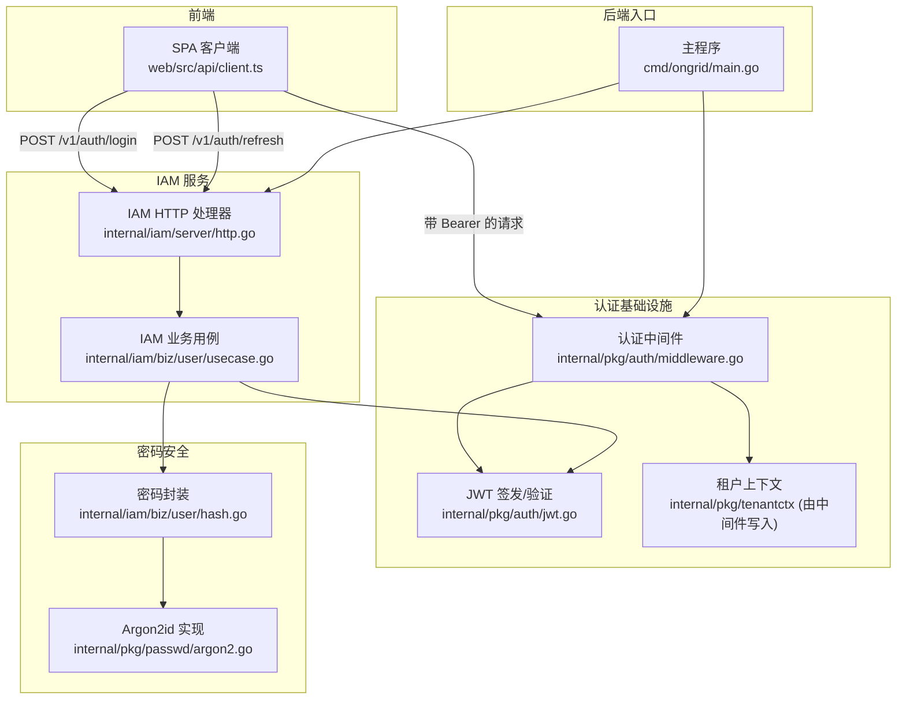
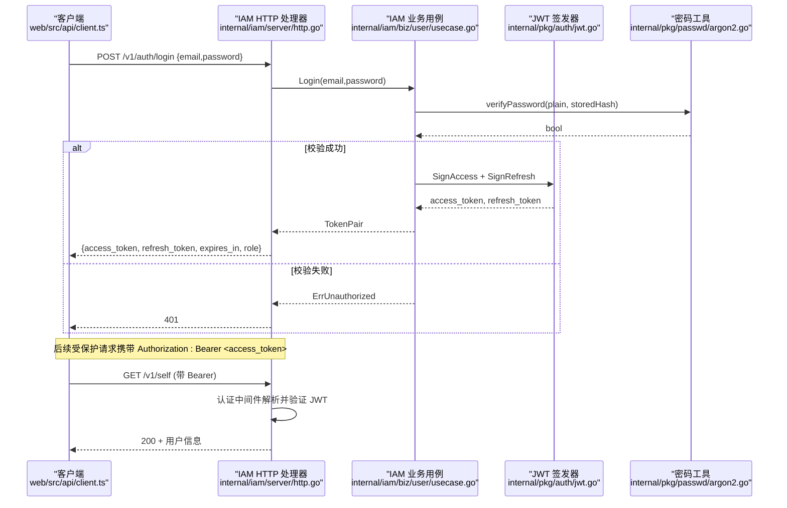
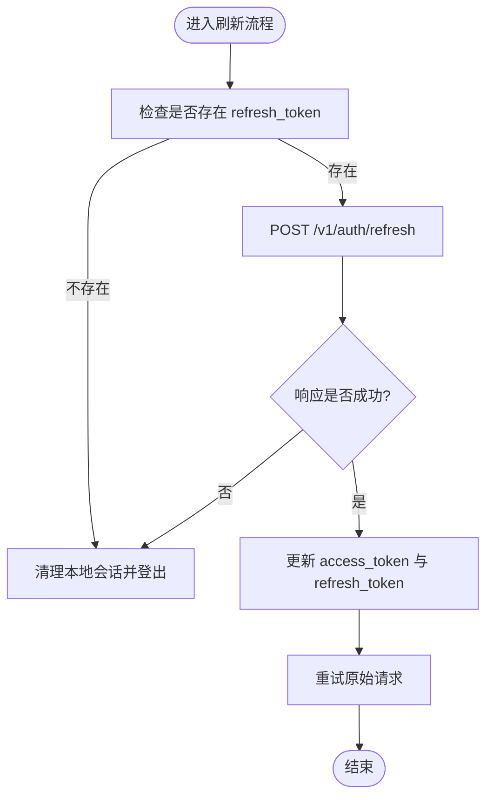
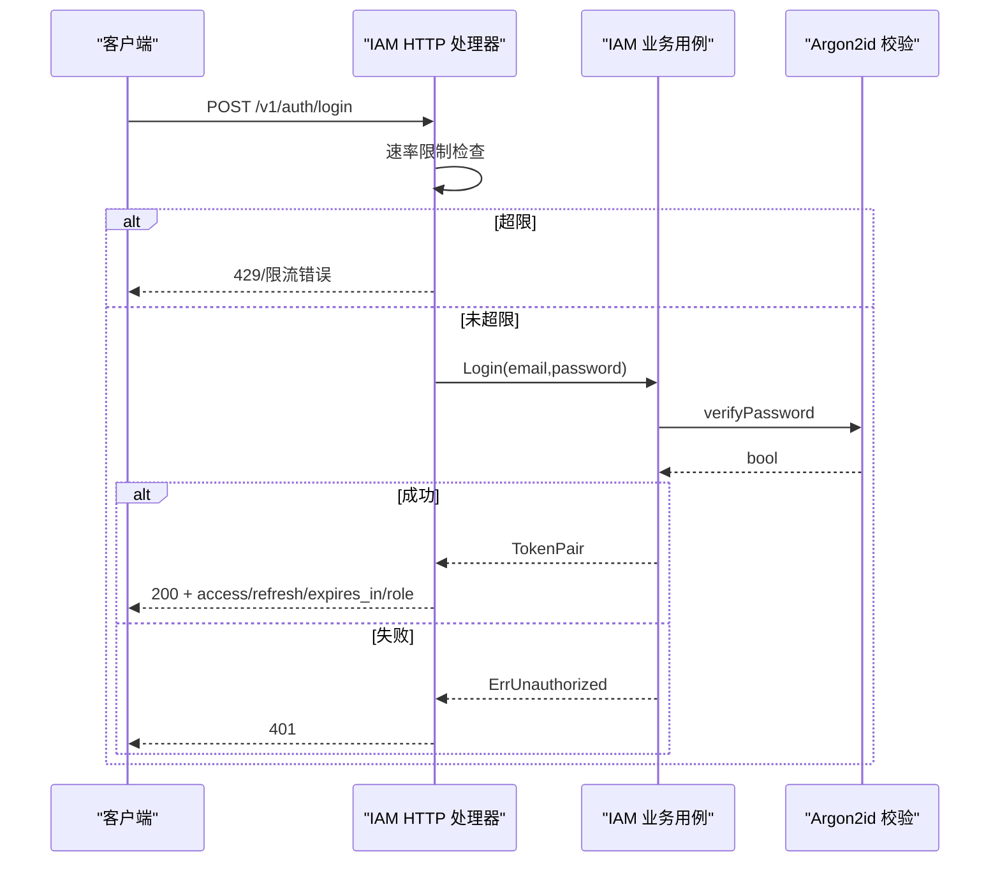
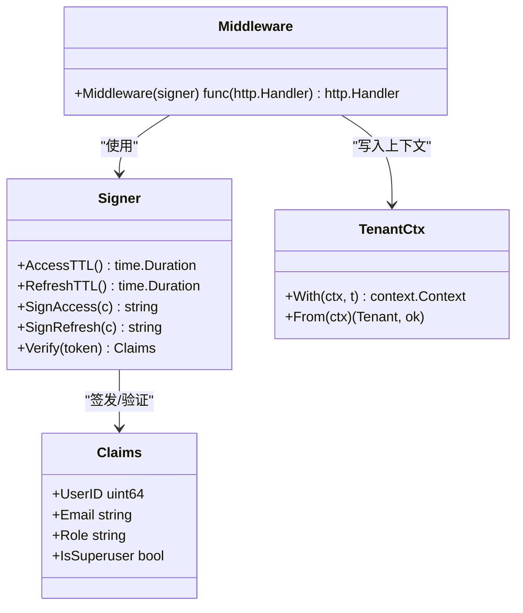
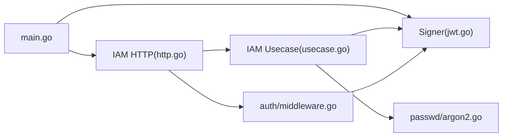

# 用户认证系统

<cite>
**本文引用的文件列表**
- [internal/pkg/auth/jwt.go](file://internal/pkg/auth/jwt.go)
- [internal/pkg/auth/middleware.go](file://internal/pkg/auth/middleware.go)
- [internal/iam/biz/user/usecase.go](file://internal/iam/biz/user/usecase.go)
- [internal/iam/server/http.go](file://internal/iam/server/http.go)
- [internal/pkg/passwd/argon2.go](file://internal/pkg/passwd/argon2.go)
- [internal/iam/biz/user/hash.go](file://internal/iam/biz/user/hash.go)
- [cmd/ongrid/main.go](file://cmd/ongrid/main.go)
- [web/src/api/client.ts](file://web/src/api/client.ts)
- [tests/e2e/auth_login_test.go](file://tests/e2e/auth_login_test.go)
- [tests/e2e/auth_refresh_test.go](file://tests/e2e/auth_refresh_test.go)
</cite>

## 目录
1. [简介](#简介)
2. [项目结构](#项目结构)
3. [核心组件](#核心组件)
4. [架构总览](#架构总览)
5. [详细组件分析](#详细组件分析)
6. [依赖关系分析](#依赖关系分析)
7. [性能与安全考量](#性能与安全考量)
8. [故障排查指南](#故障排查指南)
9. [结论](#结论)
10. [附录：API 使用示例与集成指南](#附录api-使用示例与集成指南)

## 简介
本文件面向开发者，系统化阐述本仓库的用户认证体系，重点覆盖以下方面：
- JWT 令牌管理机制：生成、验证、刷新与过期处理
- 登录认证流程：从密码校验到令牌发放的完整链路
- 会话管理与状态保持：多设备登录支持与前端自动刷新策略
- 密码安全策略：Argon2id 哈希、盐值生成与强度约束
- 认证中间件：请求拦截、令牌解析与用户上下文注入
- 错误处理与重试机制：401 场景下的前端自动刷新与失败降级
- API 使用示例与集成指引：前后端如何协作完成认证

## 项目结构
认证相关代码主要分布在如下模块：
- 通用认证包 internal/pkg/auth：JWT 签发与验证、HTTP 中间件
- IAM 业务层 internal/iam/biz/user：登录、注册、刷新等用例
- IAM HTTP 服务 internal/iam/server/http：公开接口（登录/刷新）与受保护接口路由
- 密码安全 internal/pkg/passwd：基于 Argon2id 的哈希与校验
- 应用启动 cmd/ongrid/main.go：JWT 密钥强制检查、Signer 初始化与鉴权中间件挂载
- 前端客户端 web/src/api/client.ts：Bearer 头注入、401 自动刷新与重试
- E2E 测试 tests/e2e/*：登录与刷新端到端验证

图表来源
- [cmd/ongrid/main.go:282-300](file://cmd/ongrid/main.go#L282-L300)
- [internal/iam/server/http.go:152-155](file://internal/iam/server/http.go#L152-L155)
- [internal/pkg/auth/middleware.go:21-53](file://internal/pkg/auth/middleware.go#L21-L53)
- [internal/pkg/auth/jwt.go:32-79](file://internal/pkg/auth/jwt.go#L32-L79)
- [internal/iam/biz/user/usecase.go:80-123](file://internal/iam/biz/user/usecase.go#L80-L123)
- [internal/pkg/passwd/argon2.go:26-45](file://internal/pkg/passwd/argon2.go#L26-L45)

章节来源
- [cmd/ongrid/main.go:282-300](file://cmd/ongrid/main.go#L282-L300)
- [internal/iam/server/http.go:152-155](file://internal/iam/server/http.go#L152-L155)
- [internal/pkg/auth/middleware.go:21-53](file://internal/pkg/auth/middleware.go#L21-L53)
- [internal/pkg/auth/jwt.go:32-79](file://internal/pkg/auth/jwt.go#L32-L79)
- [internal/iam/biz/user/usecase.go:80-123](file://internal/iam/biz/user/usecase.go#L80-L123)
- [internal/pkg/passwd/argon2.go:26-45](file://internal/pkg/passwd/argon2.go#L26-L45)

## 核心组件
- JWT 签发与验证器 Signer：提供 Access Token 与 Refresh Token 的签发、统一验证入口；支持自定义 TTL 的内部票据。
- 认证中间件 Middleware：从 Authorization 或查询参数提取 Bearer Token，调用 Signer.Verify 校验并写入 tenantctx.Tenant 到请求上下文。
- IAM 业务用例 Usecase：实现 Login、Refresh、Register 等用例，组合数据库访问与 Signer 签发。
- 密码工具 passwd：基于 Argon2id 的哈希与校验，参数内嵌于编码字符串中，具备向后兼容能力。
- IAM HTTP 处理器：暴露 /v1/auth/login 与 /v1/auth/refresh 公开接口，以及需要鉴权的受保护接口。
- 前端客户端 client.ts：自动注入 Bearer 头，遇到 401 时触发 refreshAccessToken 并发刷新，成功后重试原请求。

章节来源
- [internal/pkg/auth/jwt.go:32-79](file://internal/pkg/auth/jwt.go#L32-L79)
- [internal/pkg/auth/middleware.go:21-53](file://internal/pkg/auth/middleware.go#L21-L53)
- [internal/iam/biz/user/usecase.go:80-123](file://internal/iam/biz/user/usecase.go#L80-L123)
- [internal/pkg/passwd/argon2.go:26-45](file://internal/pkg/passwd/argon2.go#L26-L45)
- [internal/iam/server/http.go:152-155](file://internal/iam/server/http.go#L152-L155)
- [web/src/api/client.ts:97-112](file://web/src/api/client.ts#L97-L112)

## 架构总览
下图展示了从浏览器发起登录到获取令牌，再到后续受保护资源访问的整体流程。

图表来源
- [internal/iam/server/http.go:221-269](file://internal/iam/server/http.go#L221-L269)
- [internal/iam/biz/user/usecase.go:80-100](file://internal/iam/biz/user/usecase.go#L80-L100)
- [internal/pkg/passwd/argon2.go:50-78](file://internal/pkg/passwd/argon2.go#L50-L78)
- [internal/pkg/auth/jwt.go:56-79](file://internal/pkg/auth/jwt.go#L56-L79)
- [internal/pkg/auth/middleware.go:21-53](file://internal/pkg/auth/middleware.go#L21-L53)

## 详细组件分析

### JWT 令牌管理（生成、验证、刷新、过期）
- 签发器 Signer
  - 提供 AccessTTL 与 RefreshTTL 配置，分别用于短生命周期访问令牌与长生命周期刷新令牌。
  - SignAccess/SignRefresh 内部设置 iat/exp 并使用 HS256 签名。
  - Verify 仅做签名与声明校验，不查库，保证无状态鉴权。
- 令牌结构 Claims
  - 包含 user_id、email、role、is_superuser 及标准 RegisteredClaims。
  - is_superuser 为系统管理员标志，旧令牌可通过 Role=="admin" 回退兼容。
- 刷新流程
  - 服务端在 /v1/auth/refresh 接收 refresh_token，验证后重新签发新的 access+refresh 对。
  - 前端在 401 时触发 refreshAccessToken，并发去重避免风暴，成功后重试原请求。

图表来源
- [web/src/api/client.ts:117-162](file://web/src/api/client.ts#L117-L162)
- [internal/iam/server/http.go:271-288](file://internal/iam/server/http.go#L271-L288)
- [internal/iam/biz/user/usecase.go:102-123](file://internal/iam/biz/user/usecase.go#L102-L123)
- [internal/pkg/auth/jwt.go:81-99](file://internal/pkg/auth/jwt.go#L81-L99)

章节来源
- [internal/pkg/auth/jwt.go:32-99](file://internal/pkg/auth/jwt.go#L32-L99)
- [internal/iam/biz/user/usecase.go:102-123](file://internal/iam/biz/user/usecase.go#L102-L123)
- [internal/iam/server/http.go:271-288](file://internal/iam/server/http.go#L271-L288)
- [web/src/api/client.ts:97-162](file://web/src/api/client.ts#L97-L162)

### 用户登录认证流程（密码验证到令牌发放）
- 公开接口 /v1/auth/login
  - 输入 email/password，进行速率限制（IP 与邮箱维度），防止暴力破解。
  - 调用业务用例 Login，内部通过 Argon2id 校验密码。
  - 成功后签发 access_token 与 refresh_token，返回 expires_in 与 role。
- 失败路径
  - 记录审计事件（auth_login_failed），便于检测密码喷洒攻击。
  - 返回 401 并附带错误码。

图表来源
- [internal/iam/server/http.go:221-269](file://internal/iam/server/http.go#L221-L269)
- [internal/iam/biz/user/usecase.go:80-100](file://internal/iam/biz/user/usecase.go#L80-L100)
- [internal/pkg/passwd/argon2.go:50-78](file://internal/pkg/passwd/argon2.go#L50-L78)

章节来源
- [internal/iam/server/http.go:221-269](file://internal/iam/server/http.go#L221-L269)
- [internal/iam/biz/user/usecase.go:80-100](file://internal/iam/biz/user/usecase.go#L80-L100)
- [internal/pkg/passwd/argon2.go:50-78](file://internal/pkg/passwd/argon2.go#L50-L78)

### 会话管理与状态保持（多设备登录与同步）
- 无状态鉴权：鉴权中间件仅验证 JWT 签名与有效期，不做数据库查找，天然支持多设备并行登录。
- 上下文注入：中间件将 tenantctx.Tenant 写入请求上下文，下游处理器可读取当前用户身份与角色。
- 前端会话保持：
  - 每次请求自动附加 Authorization: Bearer。
  - 401 时触发 refreshAccessToken，并发控制避免重复刷新。
  - 刷新成功后更新本地存储并重试原请求；若刷新失败则登出。

图表来源
- [internal/pkg/auth/jwt.go:32-99](file://internal/pkg/auth/jwt.go#L32-L99)
- [internal/pkg/auth/middleware.go:21-53](file://internal/pkg/auth/middleware.go#L21-L53)
- [internal/pkg/tenantctx/tenantctx.go:21-35](file://internal/pkg/tenantctx/tenantctx.go#L21-L35)

章节来源
- [internal/pkg/auth/middleware.go:21-53](file://internal/pkg/auth/middleware.go#L21-L53)
- [internal/pkg/tenantctx/tenantctx.go:21-35](file://internal/pkg/tenantctx/tenantctx.go#L21-L35)
- [web/src/api/client.ts:97-162](file://web/src/api/client.ts#L97-L162)

### 密码安全策略（Argon2id、盐值与强度）
- 算法选择：采用 Argon2id，兼顾抗 GPU 与内存攻击能力。
- 参数与盐值：
  - 时间、内存、线程数固定，盐值随机生成，编码格式遵循 PHC 规范，参数随哈希串存储，升级无需重置。
- 强度校验：
  - 业务层 Register/Login 要求非空密码；前端 UI 提示最小长度建议（至少 8 位）。
- 封装层：
  - internal/iam/biz/user/hash.go 提供薄封装，复用 internal/pkg/passwd 的 Hash/Verify。

章节来源
- [internal/pkg/passwd/argon2.go:14-45](file://internal/pkg/passwd/argon2.go#L14-L45)
- [internal/iam/biz/user/hash.go:1-17](file://internal/iam/biz/user/hash.go#L1-L17)
- [internal/iam/biz/user/usecase.go:43-78](file://internal/iam/biz/user/usecase.go#L43-L78)

### 认证中间件实现细节（请求拦截、令牌解析、上下文注入）
- 令牌来源：
  - Authorization: Bearer <token> 优先；WebSocket 场景回退到 ?token=<jwt>。
- 校验逻辑：
  - 调用 Signer.Verify 进行签名与过期校验；失败直接返回 401。
- 上下文注入：
  - 根据 claims 构造 tenantctx.Tenant，写入外层 slot 与请求上下文，供下游读取。
- 兼容性：
  - 旧令牌缺失 is_superuser 字段时，以 Role=="admin" 作为回退，确保升级后权限一致。

章节来源
- [internal/pkg/auth/middleware.go:21-68](file://internal/pkg/auth/middleware.go#L21-L68)
- [internal/pkg/auth/jwt.go:81-99](file://internal/pkg/auth/jwt.go#L81-L99)

### 错误处理与重试机制
- 服务端错误映射：
  - 非法请求体、未授权、冲突等错误统一映射为 HTTP 状态码。
  - 登录失败记录审计事件，便于安全分析。
- 前端重试策略：
  - 401 时尝试刷新；刷新成功则重试原请求；刷新失败则登出。
  - 并发刷新防抖：同一时刻只允许一次刷新请求。

章节来源
- [internal/iam/server/http.go:435-438](file://internal/iam/server/http.go#L435-L438)
- [web/src/api/client.ts:97-112](file://web/src/api/client.ts#L97-L112)
- [web/src/api/client.ts:117-162](file://web/src/api/client.ts#L117-L162)

## 依赖关系分析
- 启动期依赖
  - main.go 强制检查 JWT_SECRET 是否为默认值，拒绝启动以避免安全风险。
  - 初始化 Signer 并注入 IAM 业务层。
- 运行时依赖
  - IAM HTTP 处理器依赖业务用例与审计中间件。
  - 业务用例依赖数据库仓储与密码工具。
  - 认证中间件依赖 JWT 签发器与租户上下文。

图表来源
- [cmd/ongrid/main.go:282-300](file://cmd/ongrid/main.go#L282-L300)
- [internal/iam/server/http.go:152-155](file://internal/iam/server/http.go#L152-L155)
- [internal/iam/biz/user/usecase.go:80-123](file://internal/iam/biz/user/usecase.go#L80-L123)
- [internal/pkg/auth/middleware.go:21-53](file://internal/pkg/auth/middleware.go#L21-L53)
- [internal/pkg/auth/jwt.go:32-79](file://internal/pkg/auth/jwt.go#L32-L79)
- [internal/pkg/passwd/argon2.go:26-45](file://internal/pkg/passwd/argon2.go#L26-L45)

章节来源
- [cmd/ongrid/main.go:282-300](file://cmd/ongrid/main.go#L282-L300)
- [internal/iam/server/http.go:152-155](file://internal/iam/server/http.go#L152-L155)
- [internal/iam/biz/user/usecase.go:80-123](file://internal/iam/biz/user/usecase.go#L80-L123)
- [internal/pkg/auth/middleware.go:21-53](file://internal/pkg/auth/middleware.go#L21-L53)
- [internal/pkg/auth/jwt.go:32-79](file://internal/pkg/auth/jwt.go#L32-L79)
- [internal/pkg/passwd/argon2.go:26-45](file://internal/pkg/passwd/argon2.go#L26-L45)

## 性能与安全考量
- 性能
  - 鉴权中间件无数据库访问，纯内存计算，延迟极低。
  - Argon2id 单次哈希约数十毫秒，适合登录/注册路径；可通过环境变量调整参数（当前已内置合理默认值）。
- 安全
  - 强制要求生产环境设置强随机 JWT_SECRET，否则拒绝启动。
  - 登录速率限制同时针对 IP 与邮箱，降低暴力破解风险。
  - 失败登录记录审计事件，便于检测异常模式。
  - 前端仅在必要时携带 Bearer 头，且 401 自动刷新减少敏感令牌驻留时间。

[本节为通用指导，不直接分析具体文件]

## 故障排查指南
- 常见 401 原因
  - 缺少或错误的 Bearer Token：检查请求头是否正确注入。
  - Token 过期：确认前端是否触发刷新流程并成功更新令牌。
  - 用户被禁用或不存在：检查账号状态与 ID 对应关系。
- 调试步骤
  - 查看服务端日志中的审计事件（登录失败、限流）。
  - 检查 JWT_SECRET 配置是否为默认值导致启动失败。
  - 使用 E2E 用例复现问题：登录与刷新路径已在测试套件中覆盖。

章节来源
- [internal/iam/server/http.go:221-269](file://internal/iam/server/http.go#L221-L269)
- [cmd/ongrid/main.go:282-287](file://cmd/ongrid/main.go#L282-L287)
- [tests/e2e/auth_login_test.go:15-43](file://tests/e2e/auth_login_test.go#L15-L43)
- [tests/e2e/auth_refresh_test.go:20-54](file://tests/e2e/auth_refresh_test.go#L20-L54)

## 结论
本认证体系以无状态 JWT 为核心，结合 Argon2id 密码哈希与严格的速率限制，实现了高可用、可扩展的登录与会话管理。前端通过自动刷新与重试机制提升用户体验，后端通过中间件与上下文注入简化了鉴权与权限判断。整体设计在保证安全性的同时，具备良好的性能与可维护性。

[本节为总结，不直接分析具体文件]

## 附录：API 使用示例与集成指南

### 登录
- 请求
  - 方法：POST
  - 路径：/api/v1/auth/login
  - 请求体：{ "email": "...", "password": "..." }
- 响应
  - 200：{ "access_token": "...", "refresh_token": "...", "expires_in": 秒, "role": "user/admin" }
  - 401：认证失败
  - 429：限流

章节来源
- [internal/iam/server/http.go:152-155](file://internal/iam/server/http.go#L152-L155)
- [internal/iam/server/http.go:221-269](file://internal/iam/server/http.go#L221-L269)

### 刷新令牌
- 请求
  - 方法：POST
  - 路径：/api/v1/auth/refresh
  - 请求体：{ "refresh_token": "..." }
- 响应
  - 200：新 access_token 与 refresh_token
  - 401：刷新失败

章节来源
- [internal/iam/server/http.go:271-288](file://internal/iam/server/http.go#L271-L288)
- [internal/iam/biz/user/usecase.go:102-123](file://internal/iam/biz/user/usecase.go#L102-L123)

### 受保护接口访问
- 请求头
  - Authorization: Bearer <access_token>
- 示例
  - GET /api/v1/self 返回当前用户信息

章节来源
- [internal/pkg/auth/middleware.go:21-53](file://internal/pkg/auth/middleware.go#L21-L53)
- [internal/iam/server/http.go:315-327](file://internal/iam/server/http.go#L315-L327)

### 前端集成要点
- 自动注入 Bearer 头
- 401 时触发刷新并重试
- 刷新失败则登出并引导重新登录

章节来源
- [web/src/api/client.ts:43-46](file://web/src/api/client.ts#L43-L46)
- [web/src/api/client.ts:97-112](file://web/src/api/client.ts#L97-L112)
- [web/src/api/client.ts:117-162](file://web/src/api/client.ts#L117-L162)