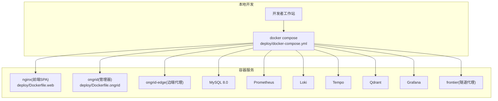
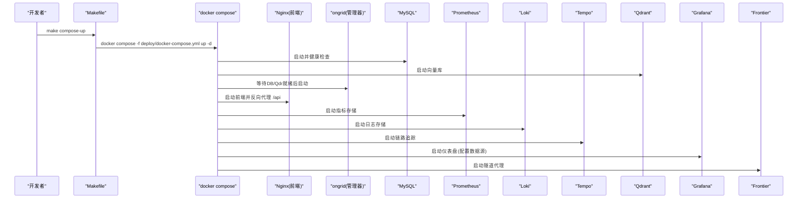
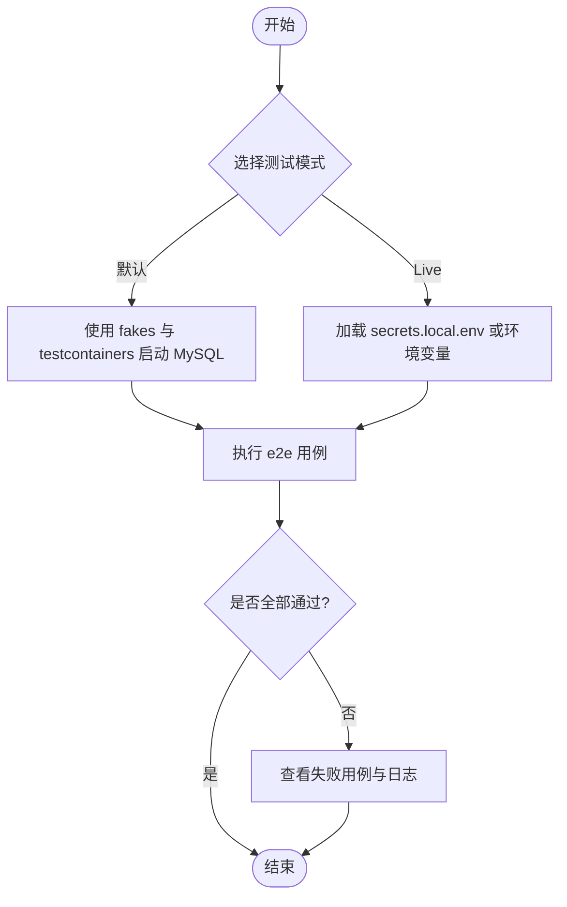
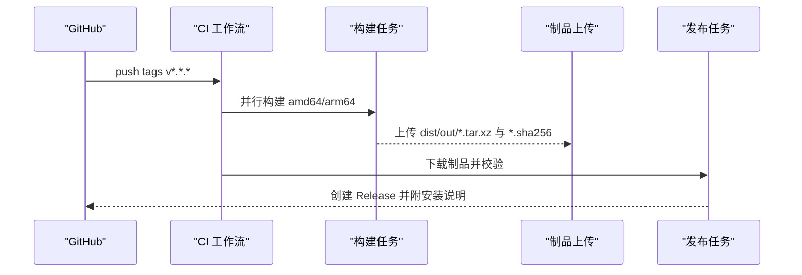
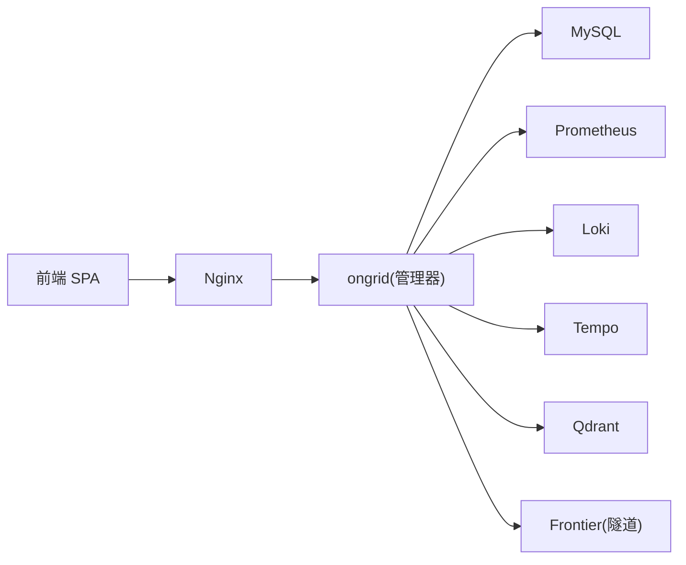

# 开发指南

<cite>
**本文引用的文件**   
- [README.md](file://README.md)
- [CONTRIBUTING.md](file://CONTRIBUTING.md)
- [.tool-versions](file://.tool-versions)
- [go.mod](file://go.mod)
- [Makefile](file://Makefile)
- [.golangci.yml](file://.golangci.yml)
- [web/package.json](file://web/package.json)
- [web/tsconfig.json](file://web/tsconfig.json)
- [web/.eslintrc.cjs](file://web/.eslintrc.cjs)
- [web/vitest.config.ts](file://web/vitest.config.ts)
- [.github/workflows/ci.yml](file://.github/workflows/ci.yml)
- [.github/workflows/release.yml](file://.github/workflows/release.yml)
- [tests/e2e/README.md](file://tests/e2e/README.md)
- [deploy/docker-compose.yml](file://deploy/docker-compose.yml)
- [deploy/Dockerfile.ongrid](file://deploy/Dockerfile.ongrid)
- [deploy/Dockerfile.web](file://deploy/Dockerfile.web)
- [deploy/Dockerfile.ongrid-edge](file://deploy/Dockerfile.ongrid-edge)
- [api/README.md](file://api/README.md)
</cite>

## 目录
1. [简介](#简介)
2. [项目结构](#项目结构)
3. [核心组件](#核心组件)
4. [架构总览](#架构总览)
5. [详细组件分析](#详细组件分析)
6. [依赖关系分析](#依赖关系分析)
7. [性能与构建优化](#性能与构建优化)
8. [故障排查指南](#故障排查指南)
9. [结论](#结论)
10. [附录](#附录)

## 简介
本指南面向贡献者与开发者，覆盖从环境搭建、代码规范、测试策略、CI/CD流水线到发布流程的完整实践。仓库采用 Go 后端 + TypeScript/React 前端的双栈架构，提供云端管理器（manager）、边端代理（edge agent）与 Web 前端 SPA，并通过 Docker Compose 在本地一键拉起全栈。

## 项目结构
- 后端：Go 模块位于根目录，入口为 cmd/ongrid 与 cmd/ongrid-edge，业务逻辑集中在 internal/ 下按领域划分。
- 前端：TypeScript/React SPA 位于 web/，使用 Vite 构建、Vitest 测试、ESLint 校验。
- 部署：Docker 镜像定义在 deploy/ 下，本地开发编排见 deploy/docker-compose.yml。
- API 契约：Proto 定义位于 api/，通过 buf 或 protoc 生成 Go 存根。
- 测试：单元测试与集成测试随源码分布；端到端测试位于 tests/e2e/。
- CI/CD：GitHub Actions 工作流位于 .github/workflows/。

图表来源
- [deploy/docker-compose.yml:1-397](file://deploy/docker-compose.yml#L1-L397)
- [deploy/Dockerfile.ongrid:1-231](file://deploy/Dockerfile.ongrid#L1-L231)
- [deploy/Dockerfile.web:1-79](file://deploy/Dockerfile.web#L1-L79)
- [deploy/Dockerfile.ongrid-edge:1-71](file://deploy/Dockerfile.ongrid-edge#L1-L71)

章节来源
- [README.md:1-96](file://README.md#L1-L96)
- [CONTRIBUTING.md:1-61](file://CONTRIBUTING.md#L1-L61)

## 核心组件
- 管理器（ongrid）：提供 HTTP API、AIops 能力、设备/边缘管理、通知、知识库检索等。
- 边端代理（ongrid-edge）：运行在目标主机上，主动拨号连接云侧隧道，采集指标/日志/追踪并上报。
- 前端 SPA：基于 React/Vite/Tailwind，提供可视化控制台与交互能力。
- 基础设施：MySQL、Prometheus、Loki、Tempo、Qdrant、Grafana、Frontier 等由 docker compose 编排。

章节来源
- [deploy/docker-compose.yml:1-397](file://deploy/docker-compose.yml#L1-L397)
- [deploy/Dockerfile.ongrid:1-231](file://deploy/Dockerfile.ongrid#L1-L231)
- [deploy/Dockerfile.web:1-79](file://deploy/Dockerfile.web#L1-L79)
- [deploy/Dockerfile.ongrid-edge:1-71](file://deploy/Dockerfile.ongrid-edge#L1-L71)

## 架构总览
下图展示本地开发时各服务的启动顺序与关键端口映射关系。

图表来源
- [deploy/docker-compose.yml:1-397](file://deploy/docker-compose.yml#L1-L397)
- [Makefile:158-163](file://Makefile#L158-L163)

## 详细组件分析

### 开发环境与工具链
- 语言与版本
  - Go：建议使用 .tool-versions 指定的版本（如 1.25.x），也可参考 go.mod 中的 go 版本要求。
  - Node.js：前端使用 node:20-alpine 作为构建基础镜像，建议本地安装 Node 20+。
- 依赖管理
  - Go：go mod download/build/test 均由 Makefile 统一封装。
  - 前端：npm ci/npm run build 由 Makefile 与 Dockerfile 共同保证一致性。
- 本地快速启动
  - 使用 Makefile 的 compose 目标一键拉起全栈。
  - 构建二进制：make build 或分别构建 ongrid 与 ongrid-edge。
  - 前端构建：cd web && npm install && npm run build。

章节来源
- [.tool-versions:1-6](file://.tool-versions#L1-L6)
- [go.mod:1-10](file://go.mod#L1-L10)
- [Makefile:65-75](file://Makefile#L65-L75)
- [Makefile:158-163](file://Makefile#L158-L163)
- [CONTRIBUTING.md:17-30](file://CONTRIBUTING.md#L17-L30)

### 代码规范与提交约定
- Go 代码风格
  - 使用 golangci-lint，启用 gofmt/goimports/govet/staticcheck/errcheck/revive/gosec/sqlclosecheck/misspell/ineffassign/unused/gocyclo 等规则。
  - 复杂度阈值、命名规范、上下文参数传递、错误返回命名等均有约束。
  - 测试文件对部分规则放宽，避免过度干扰测试可读性。
- TypeScript/React 规范
  - ESLint 基于 @typescript-eslint/recommended 与 react-hooks/recommended，关闭严格 unused-vars 报错但保留警告。
  - tsconfig 开启 strict 模式，使用 ESNext 模块解析与 React JSX transform。
- Git 工作流
  - 遵循 Conventional Commits（feat/fix/docs/chore）。
  - main 分支受保护，所有变更走 PR；保持每个 PR 聚焦单一逻辑变更。
  - 作者邮箱需关联 GitHub 账号以正确署名。

章节来源
- [.golangci.yml:1-64](file://.golangci.yml#L1-L64)
- [web/.eslintrc.cjs:1-19](file://web/.eslintrc.cjs#L1-L19)
- [web/tsconfig.json:1-29](file://web/tsconfig.json#L1-L29)
- [CONTRIBUTING.md:32-50](file://CONTRIBUTING.md#L32-L50)

### 测试策略与用例编写
- 分层测试
  - 单元测试：go test ./...，默认不包含 e2e。
  - 集成测试：带 integration build tag 的用例。
  - 端到端测试：tests/e2e 目录，使用 e2e build tag，默认使用 fakes，无需外部凭据。
- E2E 运行方式
  - 默认模式：make test-e2e（无外部凭据，使用 fake LLM/Slack/Telegram/Prom/Loki）。
  - Live 模式：make test-e2e-live，通过环境变量或 secrets.local.env 注入真实外部服务凭据。
- 测试环境
  - 使用 testcontainers-go 启动 MySQL；Manager 进程内启动 fake 外部服务；Frontier 通过 edgesim 直接调用处理函数，无需真实 WS。
- 安全与可观测性
  - 严禁将真实凭据入库；支持 RequireSecret 模式自动跳过缺失凭据的用例。
  - 日志中敏感信息需脱敏。

图表来源
- [tests/e2e/README.md:1-161](file://tests/e2e/README.md#L1-L161)
- [Makefile:80-95](file://Makefile#L80-L95)

章节来源
- [tests/e2e/README.md:1-161](file://tests/e2e/README.md#L1-L161)
- [Makefile:80-95](file://Makefile#L80-L95)

### CI/CD 流水线与自动化构建
- CI（PR/合并到 main）
  - 触发条件：push 到 main 或创建 PR。
  - 步骤：设置 Go 1.25.x → go build → go vet → go test。
  - 目的：快速编译与单测门禁，避免回归问题进入 release。
- Release（打标签 vMAJOR.MINOR.PATCH）
  - 并行构建 linux/amd64 与 linux/arm64 安装包。
  - 拉取上游 frontier 源码，预拉嵌入模型，执行 make package 产出 tar.xz 与 sha256。
  - 上传制品并发布 GitHub Release，附带安装说明与 latest.json。

图表来源
- [.github/workflows/ci.yml:1-46](file://.github/workflows/ci.yml#L1-L46)
- [.github/workflows/release.yml:1-233](file://.github/workflows/release.yml#L1-L233)
- [Makefile:596-621](file://Makefile#L596-L621)

章节来源
- [.github/workflows/ci.yml:1-46](file://.github/workflows/ci.yml#L1-L46)
- [.github/workflows/release.yml:1-233](file://.github/workflows/release.yml#L1-L233)
- [Makefile:596-621](file://Makefile#L596-L621)

### 调试技巧与性能分析方法
- 本地调试
  - 使用 make run-ongrid 或 make run-ongrid-edge 直接运行二进制。
  - 使用 docker compose 启动全栈，便于联调前后端与外部依赖。
- 指标与追踪
  - ongrid 暴露 /metrics（默认 9100），Prometheus 抓取；Loki/Tempo 用于日志与链路追踪。
  - 前端可通过 Grafana 面板进行可视化分析。
- 性能优化
  - Go 构建：-trimpath -ldflags "-s -w" 减小体积；启用 CGO 缓存与模块缓存加速构建。
  - 前端构建：Vite 缓存与 npm 缓存层分离，减少重复构建时间。
  - 网络代理：Dockerfile 支持 HTTP_PROXY/HTTPS_PROXY/NO_PROXY，适配企业网络。

章节来源
- [Makefile:65-75](file://Makefile#L65-L75)
- [deploy/docker-compose.yml:176-179](file://deploy/docker-compose.yml#L176-L179)
- [deploy/Dockerfile.ongrid:81-86](file://deploy/Dockerfile.ongrid#L81-L86)
- [deploy/Dockerfile.web:53-65](file://deploy/Dockerfile.web#L53-L65)

### 发布流程与版本管理
- 版本来源
  - VERSION 文件与 git describe 组合决定版本号；Release 流程强制 tag 与 VERSION 一致。
- 打包产物
  - 单包：make package（指定 TARGET_ARCH/PLATFORM）。
  - 全架构：make package-all（同时产出 amd64 与 arm64）。
  - 增量补丁：make patch（仅包含差异的前后端/edge/sql 变更）。
- 发布步骤
  - 推送 vMAJOR.MINOR.PATCH 标签触发 release 工作流。
  - 构建产物包含 tar.xz 与 sha256，并生成 latest.json 供客户端查询。

章节来源
- [Makefile:596-621](file://Makefile#L596-L621)
- [.github/workflows/release.yml:47-62](file://.github/workflows/release.yml#L47-L62)
- [.github/workflows/release.yml:165-190](file://.github/workflows/release.yml#L165-L190)

### 贡献者参与指南
- 代码位置
  - 后端：internal/ 与 cmd/；前端：web/；文档：docs/。
- 提交流程
  - Fork 仓库，从 main 切出 topic 分支；提交 PR，遵循 Conventional Commits。
  - 确保本地通过 go test ./... 与前端构建；必要时运行 e2e。
- 行为准则与安全
  - 遵守社区行为准则；安全问题通过 SECURITY.md 渠道报告，不公开 issue。

章节来源
- [CONTRIBUTING.md:7-16](file://CONTRIBUTING.md#L7-L16)
- [CONTRIBUTING.md:32-50](file://CONTRIBUTING.md#L32-L50)
- [CONTRIBUTING.md:56-61](file://CONTRIBUTING.md#L56-L61)

## 依赖关系分析
- Go 依赖
  - 核心框架与中间件：chi、gorm、prometheus client、otel、casbin、jwt 等。
  - 数据库驱动：mysql/postgres/sqlserver/sqlite。
  - 其他：protobuf/grpc、cron、websocket、pdf 处理、embedding 模型等。
- 前端依赖
  - React、react-router-dom、zustand、recharts、xterm、@xyflow/react 等。
  - 开发依赖：vite、vitest、eslint、tailwindcss、postcss、msw 等。

图表来源
- [deploy/docker-compose.yml:1-397](file://deploy/docker-compose.yml#L1-L397)
- [go.mod:1-175](file://go.mod#L1-L175)
- [web/package.json:1-53](file://web/package.json#L1-L53)

章节来源
- [go.mod:1-175](file://go.mod#L1-L175)
- [web/package.json:1-53](file://web/package.json#L1-L53)

## 性能与构建优化
- Go 构建
  - 使用 -trimpath 与 -ldflags "-s -w" 去除路径与符号表，减小二进制体积。
  - 利用 --mount=type=cache 缓存 go module 与编译产物，显著降低重复构建时间。
- 前端构建
  - 分离依赖安装与源码构建层，结合 npm 与 vite 缓存，提升增量构建速度。
- 网络代理
  - Dockerfile 与 Makefile 均支持 HTTP_PROXY/HTTPS_PROXY/NO_PROXY，适配企业网络与 CN 镜像。
- 资源裁剪
  - edge 插件默认仅打包 linux-amd64 与 linux-arm64，避免不必要的平台开销。

章节来源
- [Makefile:8-8](file://Makefile#L8-L8)
- [deploy/Dockerfile.ongrid:81-86](file://deploy/Dockerfile.ongrid#L81-L86)
- [deploy/Dockerfile.web:53-65](file://deploy/Dockerfile.web#L53-L65)
- [Makefile:35-35](file://Makefile#L35-L35)

## 故障排查指南
- 常见问题
  - 构建失败：检查 Go/Node 版本与代理设置；确认 GOPROXY 与 npm 代理配置。
  - 数据库连接：验证 docker compose 中 MySQL 健康检查与 DSN 配置。
  - E2E 超时：确保 Docker Desktop 内存 ≥ 4GiB，必要时调整容器启动超时。
- 日志与指标
  - 查看 ongrid 的 /metrics 与容器日志；通过 Grafana 面板定位异常。
- 安全与凭据
  - 确保 secrets.local.env 未被提交；使用 RequireSecret 模式避免泄露。

章节来源
- [deploy/docker-compose.yml:14-38](file://deploy/docker-compose.yml#L14-L38)
- [tests/e2e/README.md:18-30](file://tests/e2e/README.md#L18-L30)
- [tests/e2e/README.md:57-110](file://tests/e2e/README.md#L57-L110)

## 结论
本项目提供了完善的本地开发、测试、CI/CD 与发布体系。遵循本文档的环境搭建、代码规范与测试策略，可高效参与开发与维护。建议在每次提交前运行 lint 与测试，并在需要时使用 live e2e 验证外部集成。

## 附录
- API 契约与生成
  - Proto 定义位于 api/，通过 make proto 重新生成 Go 存根；生成的文件不纳入版本控制。
  - 包命名、字段类型与 org_id 来源等约定详见 api/README.md。

章节来源
- [api/README.md:1-41](file://api/README.md#L1-L41)
- [Makefile:112-128](file://Makefile#L112-L128)