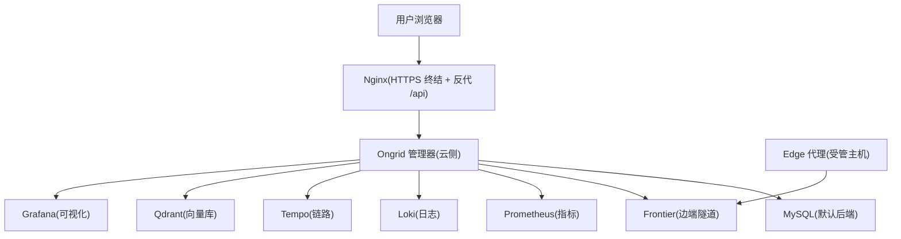
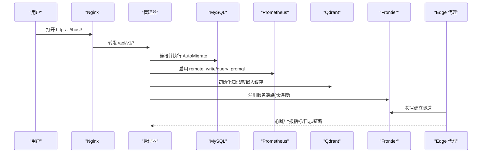
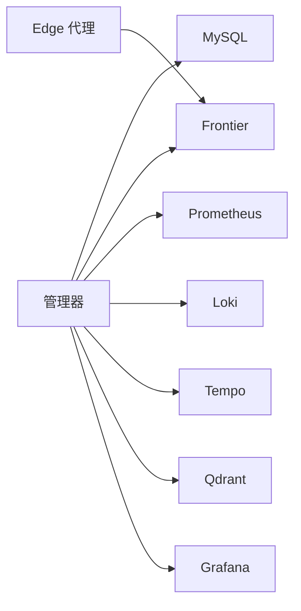

# 快速开始

<cite>
**本文引用的文件**   
- [README.md](file://README.md)
- [deploy/README.md](file://deploy/README.md)
- [deploy/install/README.md](file://deploy/install/README.md)
- [deploy/install/.env.example](file://deploy/install/.env.example)
- [deploy/install/docker-compose.yml](file://deploy/install/docker-compose.yml)
- [deploy/docker-compose.yml](file://deploy/docker-compose.yml)
- [cmd/ongrid/main.go](file://cmd/ongrid/main.go)
</cite>

## 目录
1. [简介](#简介)
2. [项目结构](#项目结构)
3. [核心组件](#核心组件)
4. [架构总览](#架构总览)
5. [详细组件分析](#详细组件分析)
6. [依赖关系分析](#依赖关系分析)
7. [性能与资源建议](#性能与资源建议)
8. [故障排查指南](#故障排查指南)
9. [结论](#结论)
10. [附录：一键安装与使用示例](#附录一键安装与使用示例)

## 简介
本指南面向新用户，目标是在 30 分钟内完成 Ongrid 的一键安装、首次登录、设备注册与基础操作。提供 AMD64 与 ARM64 两种架构的安装命令；说明开发环境搭建（依赖、构建、运行）；给出 Docker Compose 方式的本地快速部署方案；并覆盖常见安装问题与网络配置要点。

## 项目结构
仓库包含云端管理器、边缘代理、前端 SPA 以及多种可观测性后端（Prometheus/Loki/Tempo/Grafana/Qdrant）。生产级安装资产位于 deploy/install，本地开发 compose 位于 deploy。

图表来源
- [deploy/install/docker-compose.yml:51-610](file://deploy/install/docker-compose.yml#L51-L610)
- [deploy/docker-compose.yml:13-397](file://deploy/docker-compose.yml#L13-L397)
- [cmd/ongrid/main.go:195-240](file://cmd/ongrid/main.go#L195-L240)

章节来源
- [deploy/README.md:1-20](file://deploy/README.md#L1-L20)
- [deploy/install/README.md:1-20](file://deploy/install/README.md#L1-L20)

## 核心组件
- 云侧管理器（onGrid Manager）：对外暴露 HTTP API、指标采集、AI 能力编排、设备与边端管理、告警与通知等。
- 边端代理（Edge Agent）：在受管主机上运行，通过 Frontier 与云端建立反向隧道，上报指标/日志/链路，执行只读或受限写操作。
- 前端 SPA：由 Nginx 提供 HTTPS 访问，统一鉴权后反代到管理器 API。
- 可观测性栈：Prometheus（指标）、Loki（日志）、Tempo（链路）、Grafana（可视化）、Qdrant（知识库/RAG）。

章节来源
- [cmd/ongrid/main.go:195-240](file://cmd/ongrid/main.go#L195-L240)
- [deploy/install/docker-compose.yml:83-312](file://deploy/install/docker-compose.yml#L83-L312)

## 架构总览
下图展示了“一键安装”后的服务拓扑与数据流向。管理器启动时加载配置、初始化数据库迁移、连接 LLM/嵌入模型、对接 Grafana 与 Prometheus，并通过 Frontier 与 Edge 通信。

图表来源
- [cmd/ongrid/main.go:246-276](file://cmd/ongrid/main.go#L246-L276)
- [deploy/install/docker-compose.yml:83-112](file://deploy/install/docker-compose.yml#L83-L112)
- [deploy/install/docker-compose.yml:314-334](file://deploy/install/docker-compose.yml#L314-L334)

## 详细组件分析

### 一键安装（生产形态）
- 支持 Linux amd64/arm64，要求 Docker >= 24 与 docker compose v2。
- 安装脚本会：
  - 自动检测并可选安装 Docker（优先官方脚本，失败回退到发行版包管理器）。
  - 创建统一安装目录（默认 /opt/ongrid），复制 compose 与配置文件。
  - 生成自签 TLS 证书（首次安装且未提供真实证书时）。
  - 加载镜像并拉起 MySQL + ongrid + frontier + nginx + prometheus。
  - 轮询健康检查并输出 Web URL 与管理员密码提示。

章节来源
- [deploy/install/README.md:212-251](file://deploy/install/README.md#L212-L251)
- [deploy/install/README.md:241-251](file://deploy/install/README.md#L241-L251)

### 环境变量与端口
- 所有运行时配置集中在 .env（权限 600），包括数据库、JWT、管理员账号、LLM 密钥、Grafana 集成、Prometheus/Loki/Tempo/qdrant 地址等。
- 关键端口：
  - HTTPS：默认 443（可通过 ONGRID_HTTP_PORT 修改）
  - HTTP→HTTPS 重定向：默认 80（可通过 ONGRID_HTTP_REDIRECT_PORT 修改）
  - Edge 隧道：默认 40012（可通过 ONGRID_TUNNEL_PORT 修改）
  - 指标抓取：默认 9100（可通过 ONGRID_METRICS_PORT 修改）

章节来源
- [deploy/install/.env.example:78-116](file://deploy/install/.env.example#L78-L116)
- [deploy/install/docker-compose.yml:339-387](file://deploy/install/docker-compose.yml#L339-L387)

### 代理与内网域名 NO_PROXY
- 安装时会探测宿主机的 HTTP_PROXY/HTTPS_PROXY/NO_PROXY，并写入 .env 的对应变量，仅对需要外联的服务生效（如管理器与 SearXNG）。
- 自动收集内部域名（/etc/hosts、/etc/resolv.conf、hostname/FQDN）追加到 NO_PROXY，避免误走企业代理。

章节来源
- [deploy/install/README.md:76-123](file://deploy/install/README.md#L76-L123)
- [deploy/install/docker-compose.yml:38-49](file://deploy/install/docker-compose.yml#L38-L49)

### 升级与卸载
- 升级前需将已安装的 .env 拷贝至新版本包目录，再运行 upgrade.sh。
- 卸载支持保留数据或彻底清除（--purge --yes）。

章节来源
- [deploy/install/README.md:261-326](file://deploy/install/README.md#L261-L326)

### 本地开发（Docker Compose）
- 使用 deploy/docker-compose.yml 可快速拉起完整开发栈（含 MySQL、Frontier、Nginx、Prometheus、Loki、Tempo、Qdrant、Grafana、SearXNG）。
- 适合本地调试与演示，不建议直接用于生产。

章节来源
- [deploy/README.md:14-20](file://deploy/README.md#L14-L20)
- [deploy/docker-compose.yml:1-12](file://deploy/docker-compose.yml#L1-L12)

## 依赖关系分析
- 管理器依赖：
  - 数据库：默认 MySQL（也可选 SQLite 用于本地实验）
  - 消息/隧道：Frontier（边端拨号入站）
  - 可观测性：Prometheus/Loki/Tempo/Grafana/Qdrant
  - 外部模型：OpenAI/Anthropic/GLM/Gemini/DeepSeek/Kimi（按配置启用）
- 边端代理依赖：
  - 仅需出站到 Frontiers 的公网可达端口（默认 40012）

图表来源
- [deploy/install/docker-compose.yml:51-610](file://deploy/install/docker-compose.yml#L51-L610)

章节来源
- [deploy/install/docker-compose.yml:51-610](file://deploy/install/docker-compose.yml#L51-L610)

## 性能与资源建议
- 最低内存 2 GB、磁盘 10 GB（生产建议更高）。
- 将数据目录（MySQL/Prometheus/Loki/Tempo/Qdrant/Grafana）指向独立 SSD/NVMe/NFS，提升吞吐与可靠性。
- 合理设置 Prometheus 保留策略（时间/大小），避免磁盘打满。

章节来源
- [deploy/install/README.md:5-11](file://deploy/install/README.md#L5-L11)
- [deploy/install/docker-compose.yml:394-434](file://deploy/install/docker-compose.yml#L394-L434)

## 故障排查指南
- 端口冲突：编辑 .env 中的端口变量并重起相关服务。
- host-gateway 错误：旧版 Docker 不支持 host-gateway，安装脚本会自动回填 bridge 网关 IP；若仍失败，手动设置 ONGRID_HOST_GATEWAY。
- MySQL 健康检查超时：冷启动较慢，观察容器日志；安装脚本会等待健康。
- /healthz 不通：检查 JWT 密钥与数据库 DSN 是否正确。
- AI Chat 接口 500：未配置 LLM 密钥或未启用相应 Provider。
- Edge 连不上：检查云端防火墙是否放行 40012，查看 edge 侧日志是否有 dial timeout。

章节来源
- [deploy/install/README.md:564-577](file://deploy/install/README.md#L564-L577)

## 结论
通过一键安装与 Docker Compose 两种方式，Ongrid 可在短时间内完成部署与验证。配合内置的可观测性与 AI 能力，用户可快速完成设备接入、仪表板查看与简单运维操作。生产环境建议结合已有观测栈与证书管理进行加固。

## 附录：一键安装与使用示例

### 一键安装（AMD64/ARM64）
- 下载对应架构的发布包并解压，进入目录后以 root 执行安装脚本。
- 中国大陆可使用 CDN 镜像加速下载。

章节来源
- [README.md:44-72](file://README.md#L44-L72)

### 开发环境搭建（Docker Compose）
- 复制 .env.example 为 .env，按需调整密码与端口。
- 使用 make compose-up 或直接 docker compose up -d 拉起开发栈。

章节来源
- [deploy/README.md:14-20](file://deploy/README.md#L14-L20)
- [deploy/docker-compose.yml:1-12](file://deploy/docker-compose.yml#L1-L12)

### 基本使用示例
- 登录验证：使用安装脚本输出的管理员账号与密码访问 Web UI 或通过 API 获取 Token。
- 设备注册：通过 CreateEdge API 注册边端节点，获得 access_key 与 secret_key。
- 安装 Edge：在受管主机上执行 install-edge.sh，传入云端地址与凭据。
- 查看仪表板：通过 https://host/grafana/ 访问 Grafana，或使用内置 Monitor 页面。

章节来源
- [deploy/install/README.md:518-562](file://deploy/install/README.md#L518-L562)
- [deploy/install/README.md:469-476](file://deploy/install/README.md#L469-L476)