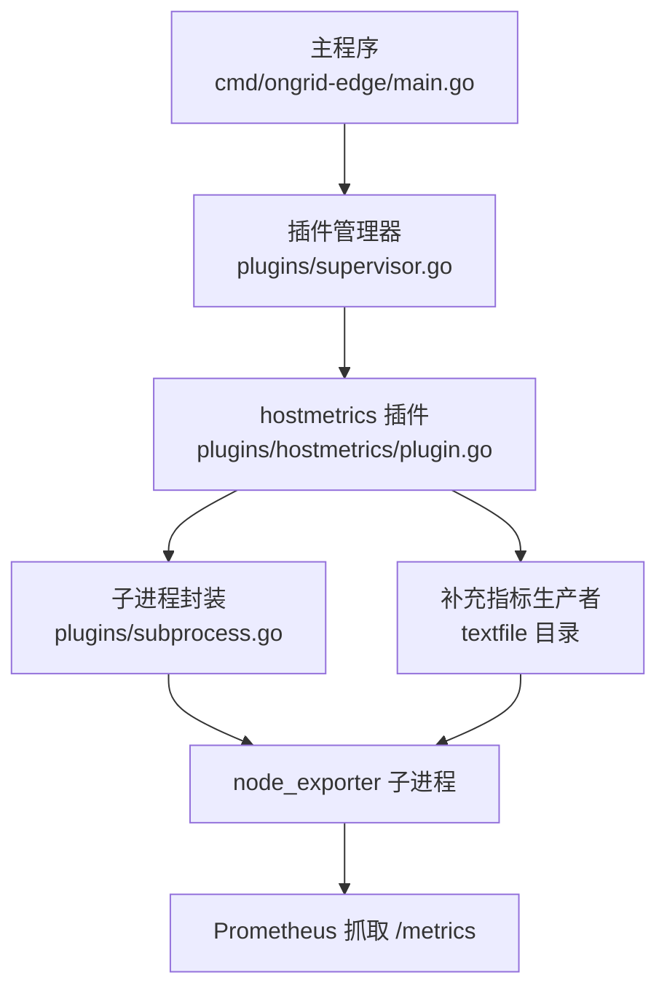
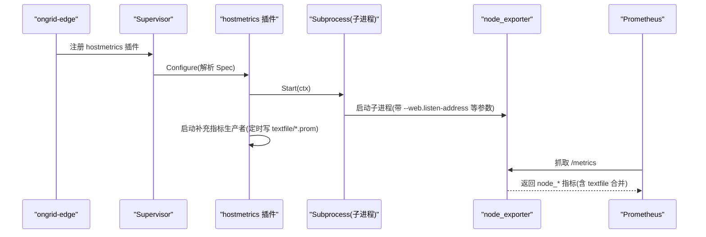
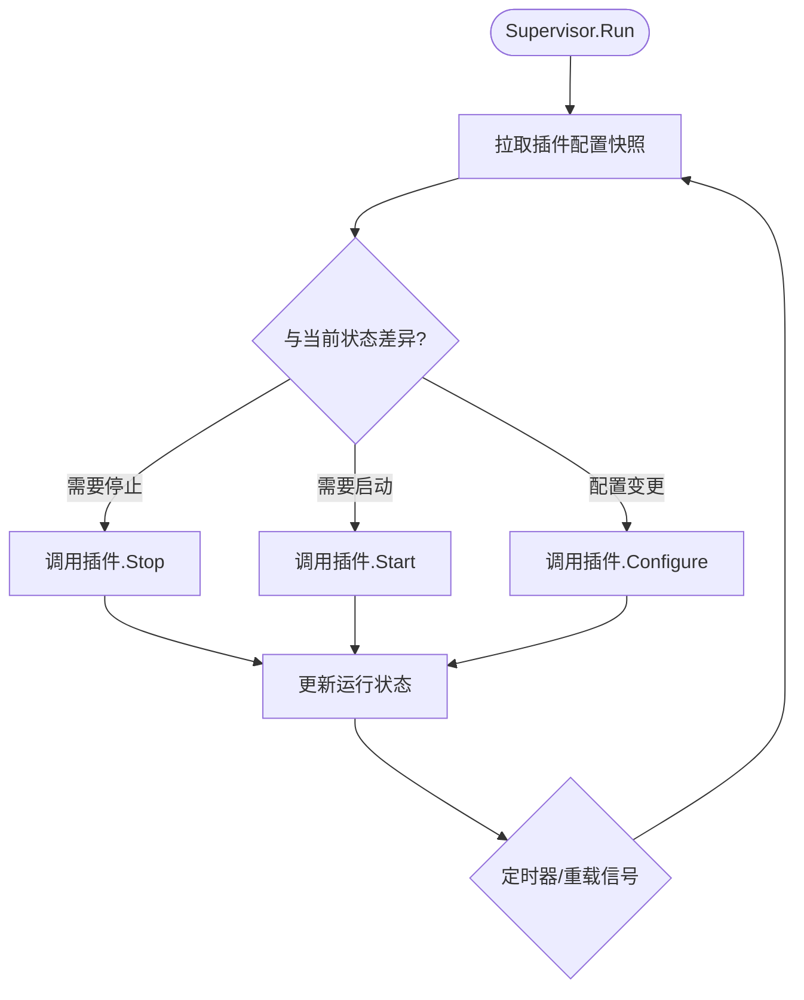
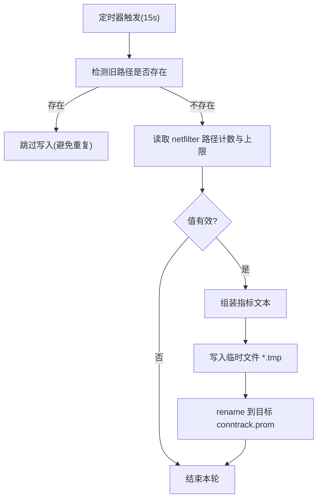

# 主机指标收集插件

<cite>
**本文引用的文件**   
- [internal/edgeagent/plugins/hostmetrics/plugin.go](file://internal/edgeagent/plugins/hostmetrics/plugin.go)
- [internal/edgeagent/plugins/subprocess.go](file://internal/edgeagent/plugins/subprocess.go)
- [internal/edgeagent/plugins/supervisor.go](file://internal/edgeagent/plugins/supervisor.go)
- [cmd/ongrid-edge/main.go](file://cmd/ongrid-edge/main.go)
- [Makefile](file://Makefile)
</cite>

## 目录
1. [简介](#简介)
2. [项目结构](#项目结构)
3. [核心组件](#核心组件)
4. [架构总览](#架构总览)
5. [详细组件分析](#详细组件分析)
6. [依赖关系分析](#依赖关系分析)
7. [性能与调优](#性能与调优)
8. [故障排查指南](#故障排查指南)
9. [结论](#结论)
10. [附录：配置项说明与示例](#附录配置项说明与示例)

## 简介
本文件面向运维人员，系统性介绍 ongrid-edge 中的“主机指标收集插件”（hostmetrics）。该插件通过子进程方式运行 node_exporter，暴露标准 Prometheus 格式的 node_* 指标；同时内置一个补充指标生产者，将内核连接跟踪（conntrack）等系统级指标以 textfile collector 的形式写入本地目录，从而补齐部分内核路径变更导致的兼容性问题。文档涵盖架构设计、子进程管理、supplementary producer 与 textfile collector 的协作机制、conntrack 兼容性方案、完整配置项说明、性能调优建议与常见问题排查方法。

## 项目结构
与主机指标收集插件直接相关的代码位于 edge-agent 的插件子系统内，并通过 ongrid-edge 主程序注册与启动。关键位置如下：
- 插件实现：internal/edgeagent/plugins/hostmetrics/plugin.go
- 子进程通用封装：internal/edgeagent/plugins/subprocess.go
- 插件生命周期编排器：internal/edgeagent/plugins/supervisor.go
- 主程序注册与运行：cmd/ongrid-edge/main.go
- 构建期下载 node_exporter 二进制：Makefile



图表来源
- [cmd/ongrid-edge/main.go:199-237](file://cmd/ongrid-edge/main.go#L199-L237)
- [internal/edgeagent/plugins/supervisor.go:114-133](file://internal/edgeagent/plugins/supervisor.go#L114-L133)
- [internal/edgeagent/plugins/hostmetrics/plugin.go:62-93](file://internal/edgeagent/plugins/hostmetrics/plugin.go#L62-L93)
- [internal/edgeagent/plugins/subprocess.go:137-156](file://internal/edgeagent/plugins/subprocess.go#L137-L156)

章节来源
- [cmd/ongrid-edge/main.go:199-237](file://cmd/ongrid-edge/main.go#L199-L237)
- [internal/edgeagent/plugins/supervisor.go:114-133](file://internal/edgeagent/plugins/supervisor.go#L114-L133)
- [internal/edgeagent/plugins/hostmetrics/plugin.go:62-93](file://internal/edgeagent/plugins/hostmetrics/plugin.go#L62-L93)
- [internal/edgeagent/plugins/subprocess.go:137-156](file://internal/edgeagent/plugins/subprocess.go#L137-L156)

## 核心组件
- hostmetrics 插件：负责构造并启动 node_exporter 子进程，注入监听地址、采集器开关与额外参数；同时维护 textfile 目录，供 node_exporter 的 textfile collector 读取。
- 子进程封装：提供统一的子进程生命周期管理、崩溃重启退避、日志输出与健康状态上报。
- 插件管理器（Supervisor）：从远端拉取插件配置，按启用/禁用与配置变更驱动插件 Configure/Start/Stop。
- 补充指标生产者：在插件内部以固定周期写入 conntrack 相关指标到 textfile 目录，解决新版内核路径变化导致 node_exporter 内置采集器无数据的问题。

章节来源
- [internal/edgeagent/plugins/hostmetrics/plugin.go:1-28](file://internal/edgeagent/plugins/hostmetrics/plugin.go#L1-L28)
- [internal/edgeagent/plugins/hostmetrics/plugin.go:62-93](file://internal/edgeagent/plugins/hostmetrics/plugin.go#L62-L93)
- [internal/edgeagent/plugins/hostmetrics/plugin.go:150-231](file://internal/edgeagent/plugins/hostmetrics/plugin.go#L150-L231)
- [internal/edgeagent/plugins/subprocess.go:17-50](file://internal/edgeagent/plugins/subprocess.go#L17-L50)
- [internal/edgeagent/plugins/supervisor.go:12-47](file://internal/edgeagent/plugins/supervisor.go#L12-L47)

## 架构总览
hostmetrics 插件采用“子进程 + 补充生产者 + textfile collector”的组合模式：
- 子进程：以 CLI 参数驱动 node_exporter，暴露 /metrics。
- 补充生产者：周期性读取内核路径，生成 .prom 文本文件，由 node_exporter 的 textfile collector 自动发现并合并进 /metrics。
- 插件管理器：统一调度插件启停与热更新。



图表来源
- [cmd/ongrid-edge/main.go:199-237](file://cmd/ongrid-edge/main.go#L199-L237)
- [internal/edgeagent/plugins/supervisor.go:114-133](file://internal/edgeagent/plugins/supervisor.go#L114-L133)
- [internal/edgeagent/plugins/hostmetrics/plugin.go:62-93](file://internal/edgeagent/plugins/hostmetrics/plugin.go#L62-L93)
- [internal/edgeagent/plugins/hostmetrics/plugin.go:114-134](file://internal/edgeagent/plugins/hostmetrics/plugin.go#L114-L134)
- [internal/edgeagent/plugins/subprocess.go:239-287](file://internal/edgeagent/plugins/subprocess.go#L239-L287)

## 详细组件分析

### 子进程管理（SubprocessPlugin）
- 职责：为任意外部二进制（如 node_exporter）提供统一的生命周期管理，包括工作目录、配置渲染、命令行参数组装、崩溃重启退避、优雅退出与 PID/健康状态记录。
- 关键行为：
  - Configure：根据插件配置渲染配置文件（可选），保存至工作目录。
  - Start：检查二进制存在后启动 runLoop，runOnce 中创建进程、重定向 stdout/stderr 到日志文件、等待退出。
  - 崩溃恢复：非期望退出时指数退避重启，最大间隔有上限。
  - Stop：取消上下文并等待进程退出，设置超时保护。

```mermaid
classDiagram
class SubprocessPlugin {
-name string
-binary string
-workDir string
-configFile string
-configRender func
-args func
-log Logger
-cfg PluginConfig
-cmd *exec.Cmd
-cancelRun context.CancelFunc
-health PluginHealth
-wantRunning bool
-stoppedCh chan struct{}
+Name() string
+Configure(cfg) error
+Start(ctx) error
+Stop(ctx) error
+HealthSnapshot() PluginHealth
-runLoop(ctx, stopped)
-runOnce(ctx) error
-setState(st, err, pid)
-bumpRestart()
}
```

图表来源
- [internal/edgeagent/plugins/subprocess.go:32-102](file://internal/edgeagent/plugins/subprocess.go#L32-L102)
- [internal/edgeagent/plugins/subprocess.go:137-183](file://internal/edgeagent/plugins/subprocess.go#L137-L183)
- [internal/edgeagent/plugins/subprocess.go:194-235](file://internal/edgeagent/plugins/subprocess.go#L194-L235)
- [internal/edgeagent/plugins/subprocess.go:239-287](file://internal/edgeagent/plugins/subprocess.go#L239-L287)

章节来源
- [internal/edgeagent/plugins/subprocess.go:17-50](file://internal/edgeagent/plugins/subprocess.go#L17-L50)
- [internal/edgeagent/plugins/subprocess.go:137-183](file://internal/edgeagent/plugins/subprocess.go#L137-L183)
- [internal/edgeagent/plugins/subprocess.go:194-235](file://internal/edgeagent/plugins/subprocess.go#L194-L235)
- [internal/edgeagent/plugins/subprocess.go:239-287](file://internal/edgeagent/plugins/subprocess.go#L239-L287)

### 插件管理器（Supervisor）
- 职责：从配置源拉取插件配置快照，对比当前状态进行差异应用（新增启用、停止、热更新）。
- 关键行为：
  - Run：初始拉取并应用，随后周期性拉取或响应外部重载信号。
  - reconcile：对每个已注册插件执行“应运行 vs 实际运行”的差异处理，必要时调用 Configure/Stop/Start。
  - HealthSnapshots：汇总各插件健康信息，供心跳上报。



图表来源
- [internal/edgeagent/plugins/supervisor.go:114-133](file://internal/edgeagent/plugins/supervisor.go#L114-L133)
- [internal/edgeagent/plugins/supervisor.go:138-230](file://internal/edgeagent/plugins/supervisor.go#L138-L230)

章节来源
- [internal/edgeagent/plugins/supervisor.go:12-47](file://internal/edgeagent/plugins/supervisor.go#L12-L47)
- [internal/edgeagent/plugins/supervisor.go:114-133](file://internal/edgeagent/plugins/supervisor.go#L114-L133)
- [internal/edgeagent/plugins/supervisor.go:138-230](file://internal/edgeagent/plugins/supervisor.go#L138-L230)

### hostmetrics 插件与补充指标生产者
- 子进程参数构建：
  - listen_address：默认 :9102，避免与容器代理端口冲突。
  - collectors_enabled/collectors_disabled：分别转换为 --collector.<name> 与 --no-collector.<name>。
  - extra_args：透传用户自定义参数，追加在末尾，允许覆盖 textfile 目录（谨慎使用）。
  - 强制追加 --collector.textfile.directory=...，确保补充指标可被采集。
- 补充指标生产者：
  - 周期：约 15s，与典型抓取间隔匹配。
  - 功能：读取现代内核路径 /proc/sys/net/netfilter/nf_conntrack_count 与 nf_conntrack_max，生成 node_nf_conntrack_entries 与 node_nf_conntrack_entries_limit 两条 gauge 指标，写入 <workDir>/textfile/conntrack.prom。
  - 兼容策略：若旧路径 /proc/sys/net/nf_conntrack_count 存在，则跳过写入，避免与 node_exporter 内置采集器重复输出导致冲突。
  - 原子写入：先写临时文件再 rename，防止 textfile collector 读到半写文件而失败。



图表来源
- [internal/edgeagent/plugins/hostmetrics/plugin.go:150-231](file://internal/edgeagent/plugins/hostmetrics/plugin.go#L150-L231)
- [internal/edgeagent/plugins/hostmetrics/plugin.go:233-246](file://internal/edgeagent/plugins/hostmetrics/plugin.go#L233-L246)

章节来源
- [internal/edgeagent/plugins/hostmetrics/plugin.go:1-28](file://internal/edgeagent/plugins/hostmetrics/plugin.go#L1-L28)
- [internal/edgeagent/plugins/hostmetrics/plugin.go:62-93](file://internal/edgeagent/plugins/hostmetrics/plugin.go#L62-L93)
- [internal/edgeagent/plugins/hostmetrics/plugin.go:114-134](file://internal/edgeagent/plugins/hostmetrics/plugin.go#L114-L134)
- [internal/edgeagent/plugins/hostmetrics/plugin.go:150-231](file://internal/edgeagent/plugins/hostmetrics/plugin.go#L150-L231)
- [internal/edgeagent/plugins/hostmetrics/plugin.go:233-246](file://internal/edgeagent/plugins/hostmetrics/plugin.go#L233-L246)

### 主程序集成与节点导出器二进制
- 主程序在启动时注册 hostmetrics 插件，并交由 Supervisor 管理。
- Makefile 提供 fetch-node-exporter 目标，用于在构建阶段下载对应平台的 node_exporter 二进制，便于边缘侧直接运行。

章节来源
- [cmd/ongrid-edge/main.go:199-237](file://cmd/ongrid-edge/main.go#L199-L237)
- [Makefile:414-451](file://Makefile#L414-L451)

## 依赖关系分析
- 组件耦合：
  - hostmetrics 插件依赖 SubprocessPlugin 管理 node_exporter 子进程。
  - hostmetrics 插件依赖 Supervisor 完成配置拉取与启停协调。
  - 主程序负责注册插件与启动 Supervisor。
- 外部依赖：
  - node_exporter 二进制（由 Makefile 构建期下载）。
  - 内核路径 /proc/sys/net/netfilter/*（conntrack 指标来源）。
  - Prometheus 通过 docker 桥接抓取 node_exporter 的 /metrics。


图表来源
- [cmd/ongrid-edge/main.go:199-237](file://cmd/ongrid-edge/main.go#L199-L237)
- [internal/edgeagent/plugins/supervisor.go:114-133](file://internal/edgeagent/plugins/supervisor.go#L114-L133)
- [internal/edgeagent/plugins/hostmetrics/plugin.go:62-93](file://internal/edgeagent/plugins/hostmetrics/plugin.go#L62-L93)
- [internal/edgeagent/plugins/subprocess.go:137-156](file://internal/edgeagent/plugins/subprocess.go#L137-L156)

章节来源
- [cmd/ongrid-edge/main.go:199-237](file://cmd/ongrid-edge/main.go#L199-L237)
- [internal/edgeagent/plugins/supervisor.go:114-133](file://internal/edgeagent/plugins/supervisor.go#L114-L133)
- [internal/edgeagent/plugins/hostmetrics/plugin.go:62-93](file://internal/edgeagent/plugins/hostmetrics/plugin.go#L62-L93)
- [internal/edgeagent/plugins/subprocess.go:137-156](file://internal/edgeagent/plugins/subprocess.go#L137-L156)

## 性能与调优
- 抓取频率与补充生产者周期：
  - 补充生产者周期约 15s，与常见 Prometheus 抓取间隔一致，避免过多 I/O 与过高的指标陈旧风险。
- 文本文件写入策略：
  - 使用临时文件 + rename 的原子写入，避免 textfile collector 解析到不完整文件导致整体采集失败。
- 采集器开关：
  - 通过 collectors_enabled/collectors_disabled 精细控制 node_exporter 采集器集合，减少不必要指标带来的存储与计算开销。
- 端口与网络：
  - 默认监听 :9102，避免与容器代理端口冲突；如需调整，可通过 listen_address 指定。
- 额外参数透传：
  - extra_args 支持透传 node_exporter 原生参数，但需谨慎，避免覆盖 textfile 目录或引入不稳定选项。

[本节为通用指导，不直接分析具体文件]

## 故障排查指南
- 插件未启动或频繁重启：
  - 检查 node_exporter 二进制是否存在于插件二进制目录。
  - 查看插件日志与工作目录下的子进程日志，关注崩溃信息与退出码。
  - 确认 Supervisor 是否收到配置变更并正确应用。
- 指标缺失（尤其是 conntrack）：
  - 确认内核路径 /proc/sys/net/netfilter/nf_conntrack_count 与 nf_conntrack_max 可读。
  - 若旧路径 /proc/sys/net/nf_conntrack_count 存在，补充生产者会跳过写入以避免重复；此时应检查 node_exporter 内置采集器是否正常。
  - 检查 textfile 目录下 conntrack.prom 是否按时更新。
- 端口冲突：
  - 若本机已有服务占用 9102，请通过 listen_address 修改监听地址。
- 配置未生效：
  - 确认 Manager 推送的配置包含 enabled=true 且 Spec 字段正确。
  - 观察 Supervisor 的重载日志与插件健康状态。

章节来源
- [internal/edgeagent/plugins/hostmetrics/plugin.go:150-231](file://internal/edgeagent/plugins/hostmetrics/plugin.go#L150-L231)
- [internal/edgeagent/plugins/hostmetrics/plugin.go:233-246](file://internal/edgeagent/plugins/hostmetrics/plugin.go#L233-L246)
- [internal/edgeagent/plugins/subprocess.go:137-183](file://internal/edgeagent/plugins/subprocess.go#L137-L183)
- [internal/edgeagent/plugins/supervisor.go:138-230](file://internal/edgeagent/plugins/supervisor.go#L138-L230)

## 结论
hostmetrics 插件通过子进程方式运行 node_exporter，结合补充指标生产者与 textfile collector，解决了内核路径变更导致的 conntrack 指标缺失问题，并提供灵活的采集器开关与参数透传能力。配合 Supervisor 的统一编排，实现了插件的可观测性与高可用。对于运维场景，建议优先使用 off/scrape 模式并结合 hostmetrics 插件，以获得更稳定、可扩展的主机指标采集体验。

[本节为总结性内容，不直接分析具体文件]

## 附录：配置项说明与示例
- 配置来源：Manager 通过插件配置接口推送 Spec 给 ongrid-edge 的 hostmetrics 插件。
- 支持的 Spec 键：
  - listen_address：字符串，node_exporter 监听地址，默认 :9102。
  - collectors_enabled：字符串数组，逐项转换为 --collector.<name>。
  - collectors_disabled：字符串数组，逐项转换为 --no-collector.<name>。
  - extra_args：字符串数组，原样追加到 node_exporter 命令行。
- 行为要点：
  - 插件始终追加 --collector.textfile.directory=<workDir>/textfile，确保补充指标可被采集。
  - 当旧路径存在时，补充生产者跳过写入，避免与内置采集器重复。
  - 文本文件采用原子写入，降低采集失败风险。

章节来源
- [internal/edgeagent/plugins/hostmetrics/plugin.go:23-27](file://internal/edgeagent/plugins/hostmetrics/plugin.go#L23-L27)
- [internal/edgeagent/plugins/hostmetrics/plugin.go:233-246](file://internal/edgeagent/plugins/hostmetrics/plugin.go#L233-L246)
- [internal/edgeagent/plugins/hostmetrics/plugin.go:77-85](file://internal/edgeagent/plugins/hostmetrics/plugin.go#L77-L85)
- [internal/edgeagent/plugins/hostmetrics/plugin.go:150-231](file://internal/edgeagent/plugins/hostmetrics/plugin.go#L150-L231)