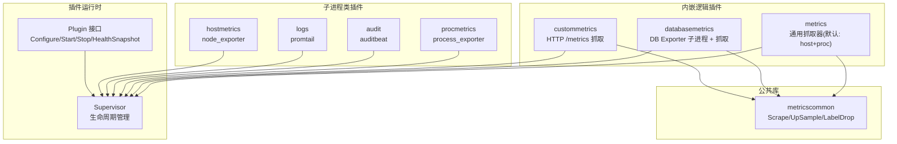
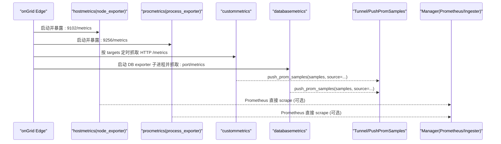
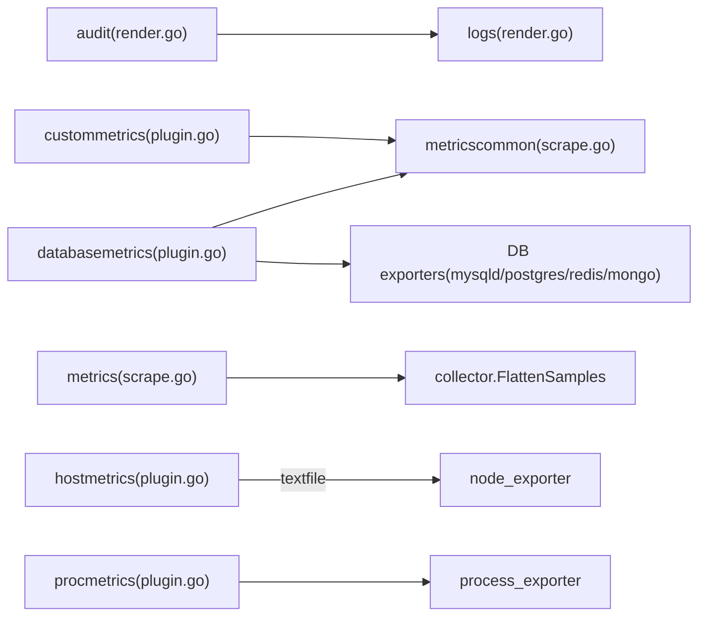

# 内置插件详解

<cite>
**本文引用的文件**   
- [plugin.go](file://internal/edgeagent/plugins/plugin.go)
- [hostmetrics/plugin.go](file://internal/edgeagent/plugins/hostmetrics/plugin.go)
- [logs/plugin.go](file://internal/edgeagent/plugins/logs/plugin.go)
- [logs/render.go](file://internal/edgeagent/plugins/logs/render.go)
- [audit/plugin.go](file://internal/edgeagent/plugins/audit/plugin.go)
- [audit/render.go](file://internal/edgeagent/plugins/audit/render.go)
- [custommetrics/plugin.go](file://internal/edgeagent/plugins/custommetrics/plugin.go)
- [custommetrics/spec.go](file://internal/edgeagent/plugins/custommetrics/spec.go)
- [databasemetrics/plugin.go](file://internal/edgeagent/plugins/databasemetrics/plugin.go)
- [databasemetrics/spec.go](file://internal/edgeagent/plugins/databasemetrics/spec.go)
- [procmetrics/plugin.go](file://internal/edgeagent/plugins/procmetrics/plugin.go)
- [metrics/scrape.go](file://internal/edgeagent/plugins/metrics/scrape.go)
- [metricscommon/scrape.go](file://internal/edgeagent/plugins/metricscommon/scrape.go)
</cite>

## 目录
1. [简介](#简介)
2. [项目结构](#项目结构)
3. [核心组件](#核心组件)
4. [架构总览](#架构总览)
5. [详细组件分析](#详细组件分析)
6. [依赖关系分析](#依赖关系分析)
7. [性能考量](#性能考量)
8. [故障排查指南](#故障排查指南)
9. [结论](#结论)
10. [附录：配置与使用示例](#附录配置与使用示例)

## 简介
本文件面向运维与开发者，系统化梳理 ongrid-edge 的内置插件体系，覆盖主机指标、日志采集、审计日志、自定义指标、数据库监控与进程监控等插件。文档从接口契约、配置项、数据采集方式、输出格式、性能特征、协作关系与数据流等方面展开，并提供常见问题定位与调优建议，帮助快速落地生产实践。

## 项目结构
内置插件位于 internal/edgeagent/plugins 下，采用“按能力分目录”的组织方式：每个插件一个子包，统一实现 plugins.Plugin 接口并由 Supervisor 管理生命周期。部分插件为子进程（如 node_exporter、promtail、auditbeat、process_exporter），部分为内嵌逻辑（如 custommetrics、databasemetrics）。

图表来源
- [plugin.go:18-52](file://internal/edgeagent/plugins/plugin.go#L18-L52)
- [hostmetrics/plugin.go:62-93](file://internal/edgeagent/plugins/hostmetrics/plugin.go#L62-L93)
- [logs/plugin.go:27-53](file://internal/edgeagent/plugins/logs/plugin.go#L27-L53)
- [audit/plugin.go:46-74](file://internal/edgeagent/plugins/audit/plugin.go#L46-L74)
- [procmetrics/plugin.go:32-42](file://internal/edgeagent/plugins/procmetrics/plugin.go#L32-L42)
- [custommetrics/plugin.go:45-63](file://internal/edgeagent/plugins/custommetrics/plugin.go#L45-L63)
- [databasemetrics/plugin.go:53-73](file://internal/edgeagent/plugins/databasemetrics/plugin.go#L53-L73)
- [metrics/scrape.go:46-49](file://internal/edgeagent/plugins/metrics/scrape.go#L46-L49)
- [metricscommon/scrape.go:25-51](file://internal/edgeagent/plugins/metricscommon/scrape.go#L25-L51)

章节来源
- [plugin.go:18-52](file://internal/edgeagent/plugins/plugin.go#L18-L52)

## 核心组件
- Plugin 接口：所有插件必须实现的统一契约，包含 Name、Configure、Start、Stop、HealthSnapshot。Supervisor 负责调用顺序、重启与健康上报。
- PluginConfig：统一的配置载体，包含启用开关、EdgeID、Endpoint、认证信息以及各插件特定的 Spec JSON。
- TargetHealth：多目标插件（如 custommetrics、databasemetrics）用于上报每个目标的运行状态、样本数与最近成功时间。

章节来源
- [plugin.go:18-106](file://internal/edgeagent/plugins/plugin.go#L18-L106)

## 架构总览
下图展示典型的数据流：子进程或内嵌逻辑采集数据后，通过隧道将 Prometheus 样本推送到管理器侧；日志则经由 promtail 直接推送至 Loki。

图表来源
- [hostmetrics/plugin.go:62-93](file://internal/edgeagent/plugins/hostmetrics/plugin.go#L62-L93)
- [procmetrics/plugin.go:32-42](file://internal/edgeagent/plugins/procmetrics/plugin.go#L32-L42)
- [custommetrics/plugin.go:187-229](file://internal/edgeagent/plugins/custommetrics/plugin.go#L187-L229)
- [databasemetrics/plugin.go:276-324](file://internal/edgeagent/plugins/databasemetrics/plugin.go#L276-L324)
- [metrics/scrape.go:46-49](file://internal/edgeagent/plugins/metrics/scrape.go#L46-L49)

## 详细组件分析

### 主机指标插件（hostmetrics）
- 功能概述
  - 以子进程方式运行 node_exporter，默认监听 :9102，暴露 node_* 系列指标。
  - 内嵌补充指标生产者，周期性写入 textfile 目录，由 node_exporter 的 textfile collector 自动采集，解决内核路径变更导致的 conntrack 指标缺失问题。
- 关键配置（Spec）
  - listen_address：字符串，默认 ":9102"
  - collectors_enabled：[]string，传递 --collector.<name>
  - collectors_disabled：[]string，传递 --no-collector.<name>
  - extra_args：[]string，追加到命令行
- 数据采集方式
  - 子进程 node_exporter 在本地提供 /metrics；manager 侧 Prometheus 可通过 docker 桥接抓取。
  - 补充指标以 .prom 文本文件形式写入 <workDir>/textfile，被 textfile collector 拉取。
- 输出格式
  - Prometheus 文本协议，标准 node_* 指标族。
- 性能特征
  - 补充指标刷新周期约 15s，与常见 scrape 间隔匹配，避免多余 I/O。
  - 仅当旧内核路径不存在时才写入 conntrack 指标，避免重复采样冲突。
- 健康与错误
  - 通过 SubprocessPlugin 上报 PID、状态与错误信息。

章节来源
- [hostmetrics/plugin.go:1-277](file://internal/edgeagent/plugins/hostmetrics/plugin.go#L1-L277)

### 日志采集插件（logs）
- 功能概述
  - 以子进程方式运行 promtail，根据 manager 下发的配置渲染 promtail.yaml，直接推送至 manager nginx 的 /loki/api/v1/push。
  - 支持 journald 采集与文件日志 tail；当 audit 插件启用时，自动发现并 tail 审计 JSONL 输出。
- 关键配置（Spec）
  - enable_journald：布尔，默认 true
  - journald_units：[]string，过滤 systemd unit
  - file_paths：[]string，应用日志文件路径列表
  - extra_labels：map[string]string，附加标签
  - tls_insecure_skip_verify：布尔，默认 true（自签证书场景）
- 数据采集方式
  - journald：基于 journal 模块，支持按 unit 过滤与优先级映射 level。
  - 文件：static_configs 指定 __path__，job_name 安全化。
  - 审计：若存在 audit.OutputPath(workDir)，自动追加到 file_paths。
- 输出格式
  - Promtail 推送至 Loki，携带 device_id、ongrid_source 等外部标签。
- 性能特征
  - 客户端具备退避与批处理参数（batchsize/batchwait），降低网络抖动影响。
- 健康与错误
  - 子进程管理，错误可追溯至 plugin workdir 下的日志。

章节来源
- [logs/plugin.go:1-54](file://internal/edgeagent/plugins/logs/plugin.go#L1-L54)
- [logs/render.go:1-273](file://internal/edgeagent/plugins/logs/render.go#L1-L273)
- [audit/plugin.go:76-92](file://internal/edgeagent/plugins/audit/plugin.go#L76-L92)

### 审计日志插件（audit）
- 功能概述
  - 以子进程方式运行 auditbeat，输出 JSONL 到 <workDir>/audit/<output_file>，供 logs 插件自动 tail 入 Loki。
  - 支持 raw_config 透传模式与结构化模板模式；结构化模式下注入 ongrid.device_id 并丢弃高基数 host.* 字段。
- 关键配置（Spec，结构化模式）
  - modules：["auditd","file_integrity","system"] 的子集
  - fim_paths：[]string，文件完整性监控路径
  - output_file：文件名前缀，默认 "audit.jsonl"
  - auditd_rule_files/glob、auditd_rules：规则集合
  - system_package_period、system_state_datasets、system_state_period 等
  - raw_config：非空时进入透传模式，忽略其他结构化字段
- 数据采集方式
  - auditbeat 读取内核审计子系统与系统状态，输出 JSONL。
- 输出格式
  - JSONL，带 ongrid.device_id、ongrid.source 等字段。
- 性能特征
  - 内部 path.home/data/logs 固定于插件工作目录，避免 EROFS 崩溃。
- 健康与错误
  - 子进程管理；严格权限检查已关闭以避免误报。

章节来源
- [audit/plugin.go:1-92](file://internal/edgeagent/plugins/audit/plugin.go#L1-L92)
- [audit/render.go:1-461](file://internal/edgeagent/plugins/audit/render.go#L1-L461)

### 自定义指标插件（custommetrics）
- 功能概述
  - 内嵌抓取器，按 targets 列表定时抓取任意 HTTP /metrics 端点，经 label 控制与限流后，通过 tunnel 推送样本。
- 关键配置（Spec）
  - targets：数组，每项包含 id、target_url、scrape_interval、scrape_timeout、enabled、source_label、auth、extra_labels、sample_limit、label_drop、resource 等
  - resource.category/type：用于标注资源类别与类型（当前支持 database 及若干 db_type）
- 数据采集方式
  - 并发为每个 target 起协程，按 interval 定时抓取，失败时推送 up=0，成功时附带 up=1。
- 输出格式
  - Prometheus 文本协议解析后的扁平样本，附带 plugin/target_id/target_name/kind 等标签。
- 性能特征
  - 支持 sample_limit 与 label_drop 控制基数；超时不超过间隔，避免重叠抓取。
- 健康与错误
  - 维护每个 target 的健康状态与最近成功时间，panic 恢复并记录堆栈。

章节来源
- [custommetrics/plugin.go:1-291](file://internal/edgeagent/plugins/custommetrics/plugin.go#L1-L291)
- [custommetrics/spec.go:1-295](file://internal/edgeagent/plugins/custommetrics/spec.go#L1-L295)
- [metricscommon/scrape.go:25-126](file://internal/edgeagent/plugins/metricscommon/scrape.go#L25-L126)

### 数据库监控插件（databasemetrics）
- 功能概述
  - 为每个数据库源启动对应 exporter 子进程（mysqld_exporter/postgres_exporter/redis_exporter/mongodb_exporter），本地抓取后推送样本。
  - 连接凭据通过 edge-local 受管 secret 文件注入，避免明文配置。
- 关键配置（Spec）
  - sources：数组，每项包含 id、db_type、listen_address、connection.type/path、tls、exporter、scrape_interval、scrape_timeout、source_label、extra_labels、sample_limit、label_drop 等
  - db_type：mysql/postgresql/redis/mongodb
  - connection.type：managed；connection.path：secret 文件路径（0600 权限校验）
  - exporter.collectors/bool/string/int/list：按 db_type 白名单校验并转换为命令行参数
- 数据采集方式
  - 启动 exporter 子进程，监听 127.0.0.1:port，定时抓取 /metrics，失败指数退避重试。
- 输出格式
  - Prometheus 文本协议解析后的扁平样本，附带 plugin/source 等标签。
- 性能特征
  - 端口冲突检测与保留端口保护；默认 label_drop 抑制高基数查询相关标签。
- 健康与错误
  - 维护每个 source 的健康状态与样本计数；panic 恢复并记录堆栈。

章节来源
- [databasemetrics/plugin.go:1-403](file://internal/edgeagent/plugins/databasemetrics/plugin.go#L1-L403)
- [databasemetrics/spec.go:1-800](file://internal/edgeagent/plugins/databasemetrics/spec.go#L1-L800)
- [metricscommon/scrape.go:53-91](file://internal/edgeagent/plugins/metricscommon/scrape.go#L53-L91)

### 进程监控插件（procmetrics）
- 功能概述
  - 以子进程方式运行 process_exporter，默认监听 :9256，按 comm/cmdline 分组暴露进程级指标。
- 关键配置（Spec）
  - listen_address：字符串，默认 ":9256"
  - process_names：[]map，透传给 process-exporter YAML，支持默认 catch-all 行为
- 数据采集方式
  - 子进程 process_exporter 暴露 /metrics，manager 侧 Prometheus 可直接抓取。
- 输出格式
  - Prometheus 文本协议，进程级指标族。
- 性能特征
  - 默认进程名分组策略保证最小可用观测面。
- 健康与错误
  - 子进程管理，错误可追溯至 plugin workdir 下的日志。

章节来源
- [procmetrics/plugin.go:1-128](file://internal/edgeagent/plugins/procmetrics/plugin.go#L1-L128)

### 通用抓取器（metrics）
- 功能概述
  - 内嵌抓取器，默认同时抓取 hostmetrics(:9102) 与 procmetrics(:9256)，也可配置单个或多个 URL。
- 关键配置（Spec）
  - target_urls/target_url：目标地址列表或兼容单值
  - scrape_interval/scrape_timeout：抓取周期与超时
  - bearer_token/tls_insecure/extra_labels/source_label：鉴权、TLS 与标签
- 数据采集方式
  - 对每个 URL 独立抓取，解析 Prometheus 文本响应，合并 extra_labels，生成扁平样本并通过 tunnel 推送。
- 输出格式
  - Prometheus 文本协议解析后的扁平样本。
- 性能特征
  - 短 dial 超时，避免 TCP 背压主导整体耗时；URL 合法性在 Configure 阶段校验。

章节来源
- [metrics/scrape.go:1-293](file://internal/edgeagent/plugins/metrics/scrape.go#L1-L293)

## 依赖关系分析
- 插件间协作
  - logs 插件在渲染时探测 audit.OutputPath(workDir)，若存在则自动追加到 file_paths，形成单向依赖：logs → audit。
  - databasemetrics 与 custommetrics 共享 metricscommon.Scrape 与 ScrapeUpSample，统一抓取与 up 指标语义。
  - hostmetrics 与 procmetrics 作为本地 exporter，既可由 manager 侧 Prometheus 直接抓取，也可被 metrics 插件统一抓取推送。
- 依赖图

图表来源
- [audit/render.go:1-461](file://internal/edgeagent/plugins/audit/render.go#L1-L461)
- [logs/render.go:151-161](file://internal/edgeagent/plugins/logs/render.go#L151-L161)
- [custommetrics/plugin.go:187-229](file://internal/edgeagent/plugins/custommetrics/plugin.go#L187-L229)
- [databasemetrics/plugin.go:276-324](file://internal/edgeagent/plugins/databasemetrics/plugin.go#L276-L324)
- [metrics/scrape.go:170-182](file://internal/edgeagent/plugins/metrics/scrape.go#L170-L182)
- [hostmetrics/plugin.go:150-231](file://internal/edgeagent/plugins/hostmetrics/plugin.go#L150-L231)
- [procmetrics/plugin.go:32-42](file://internal/edgeagent/plugins/procmetrics/plugin.go#L32-L42)
- [databasemetrics/spec.go:168-203](file://internal/edgeagent/plugins/databasemetrics/spec.go#L168-L203)

## 性能考量
- 抓取频率与超时
  - 合理设置 scrape_interval 与 scrape_timeout，确保 timeout ≤ interval，避免重叠抓取导致目标压力增大。
- 基数控制
  - 使用 label_drop 与 sample_limit 限制高基数标签与样本量，防止存储与查询压力。
- 本地直采 vs 推送
  - hostmetrics/procmetrics 适合本地直采；custommetrics/databasemetrics 通过 tunnel 推送，减少跨网段 scrape 复杂度。
- 子进程健壮性
  - 子进程异常退出会触发指数退避重试（databasemetrics）或自动重启（SubprocessPlugin），保障可用性。
- I/O 优化
  - hostmetrics 的 textfile 写入采用 tmp+rename 原子替换，避免半写污染。

[本节为通用指导，不直接分析具体文件]

## 故障排查指南
- 日志无数据
  - 确认 logs 插件 endpoint 与认证正确；检查 enable_journald/file_paths 是否生效；查看 plugin workdir 下 promtail.yaml 与 positions.yaml。
  - 若期望采集审计日志，确认 audit 插件已启用且 OutputPath 存在。
- 审计插件启动失败
  - 检查 structured 模式下 path.home/data/logs 是否指向插件工作目录；raw_config 模式下需自行设置上述路径。
- 数据库指标不可用
  - 验证 connection.path 指向的 secret 文件权限为 0600 且内容非空；检查 exporter 二进制是否存在；关注端口冲突与保留端口。
- 自定义指标抓取失败
  - 检查 target_url 合法性、鉴权头与 TLS 设置；观察 HealthSnapshot 中 last_error 与 last_success_at。
- 主机/进程指标缺失
  - 确认 node_exporter/process_exporter 已启动并监听预期端口；检查 hostmetrics 的 textfile 目录是否可写。

章节来源
- [logs/render.go:109-189](file://internal/edgeagent/plugins/logs/render.go#L109-L189)
- [audit/render.go:197-234](file://internal/edgeagent/plugins/audit/render.go#L197-L234)
- [databasemetrics/plugin.go:326-349](file://internal/edgeagent/plugins/databasemetrics/plugin.go#L326-L349)
- [custommetrics/plugin.go:187-229](file://internal/edgeagent/plugins/custommetrics/plugin.go#L187-L229)
- [hostmetrics/plugin.go:191-231](file://internal/edgeagent/plugins/hostmetrics/plugin.go#L191-L231)

## 结论
内置插件围绕统一 Plugin 接口与 Supervisor 生命周期管理构建，兼顾子进程与内嵌逻辑两种形态。通过标准化的 Spec 与渲染机制，实现了灵活的配置下发与稳定的运行态。结合 metricscommon 的统一抓取与推送能力，形成了可扩展、低耦合的观测数据接入体系。

[本节为总结性内容，不直接分析具体文件]

## 附录：配置与使用示例
以下给出各插件的典型配置要点与使用场景说明（以字段与流程为主，不粘贴具体代码片段）。

- hostmetrics
  - 场景：采集 CPU、内存、网络、conntrack 等主机指标。
  - 关键点：listen_address 默认 :9102；collectors_enabled/disabled 控制采集器；textfile 目录自动启用。
  - 参考路径
    - [hostmetrics/plugin.go:22-28](file://internal/edgeagent/plugins/hostmetrics/plugin.go#L22-L28)
    - [hostmetrics/plugin.go:233-246](file://internal/edgeagent/plugins/hostmetrics/plugin.go#L233-L246)

- logs
  - 场景：journald 与文件日志统一入 Loki；自动 tail 审计 JSONL。
  - 关键点：enable_journald=true 为默认；file_paths 添加业务日志；extra_labels 增加维度；tls_insecure_skip_verify 适配自签。
  - 参考路径
    - [logs/render.go:97-189](file://internal/edgeagent/plugins/logs/render.go#L97-L189)
    - [logs/render.go:151-161](file://internal/edgeagent/plugins/logs/render.go#L151-L161)

- audit
  - 场景：Linux 审计事件与系统状态采集，输出 JSONL 供日志插件消费。
  - 关键点：structured 模式自动注入 device_id 并丢弃 host.*；raw_config 模式全量透传；output_file 默认 audit.jsonl。
  - 参考路径
    - [audit/render.go:130-234](file://internal/edgeagent/plugins/audit/render.go#L130-L234)
    - [audit/render.go:298-386](file://internal/edgeagent/plugins/audit/render.go#L298-L386)

- custommetrics
  - 场景：对接任意 HTTP /metrics 端点（含第三方 exporter）。
  - 关键点：targets[].id/target_url 必填；scrape_interval/timeout 合理设置；sample_limit/label_drop 控制基数；resource 标注数据库类型时自动附加 kind/db_type。
  - 参考路径
    - [custommetrics/spec.go:48-112](file://internal/edgeagent/plugins/custommetrics/spec.go#L48-L112)
    - [custommetrics/plugin.go:187-229](file://internal/edgeagent/plugins/custommetrics/plugin.go#L187-L229)

- databasemetrics
  - 场景：MySQL/PostgreSQL/Redis/MongoDB 指标采集。
  - 关键点：sources[].db_type 选择导出器；connection.path 指向 0600 权限的 secret；exporter 字段按白名单校验；默认 label_drop 抑制高基数标签。
  - 参考路径
    - [databasemetrics/spec.go:95-166](file://internal/edgeagent/plugins/databasemetrics/spec.go#L95-L166)
    - [databasemetrics/plugin.go:276-324](file://internal/edgeagent/plugins/databasemetrics/plugin.go#L276-L324)

- procmetrics
  - 场景：进程级指标采集，默认按 comm 分组。
  - 关键点：listen_address 默认 :9256；process_names 透传给 process-exporter YAML。
  - 参考路径
    - [procmetrics/plugin.go:44-101](file://internal/edgeagent/plugins/procmetrics/plugin.go#L44-L101)

- metrics（通用抓取器）
  - 场景：统一抓取 hostmetrics 与 procmetrics，或自定义多个 URL。
  - 关键点：target_urls 或 target_url；bearer_token/tls_insecure/extra_labels/source_label。
  - 参考路径
    - [metrics/scrape.go:64-133](file://internal/edgeagent/plugins/metrics/scrape.go#L64-L133)
    - [metrics/scrape.go:146-182](file://internal/edgeagent/plugins/metrics/scrape.go#L146-L182)