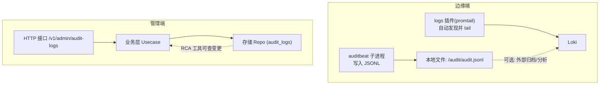
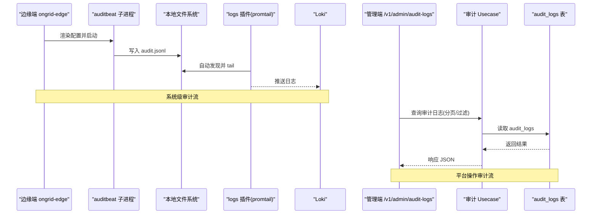
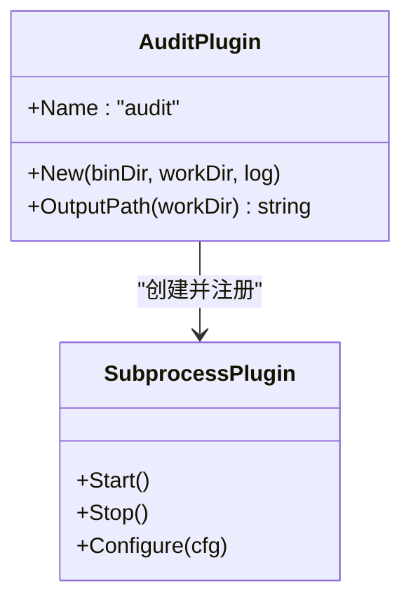
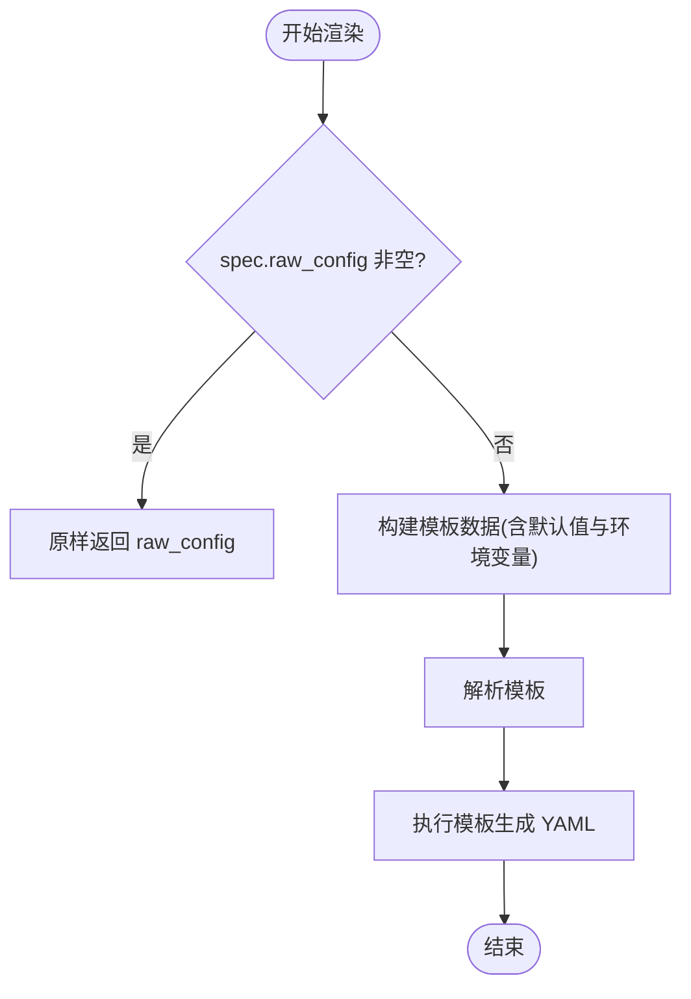
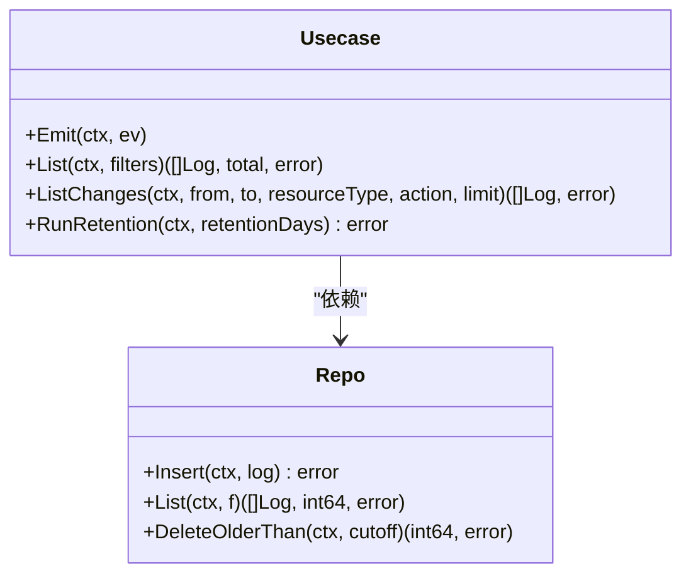
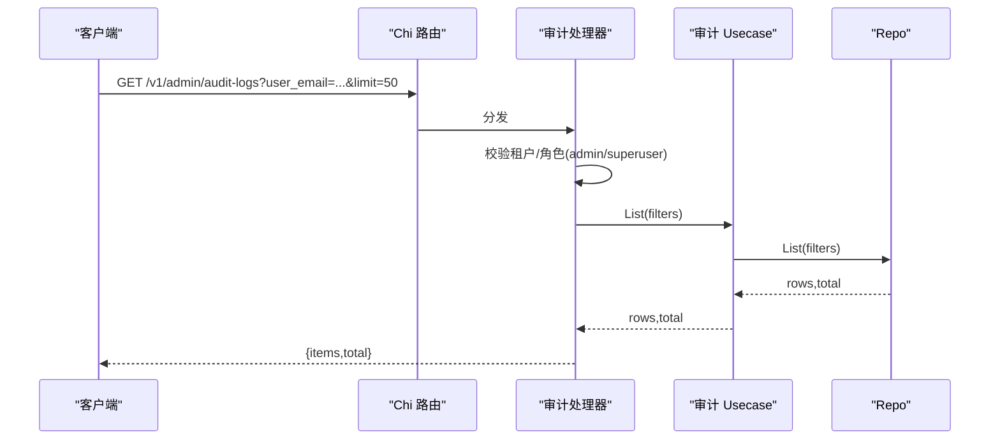
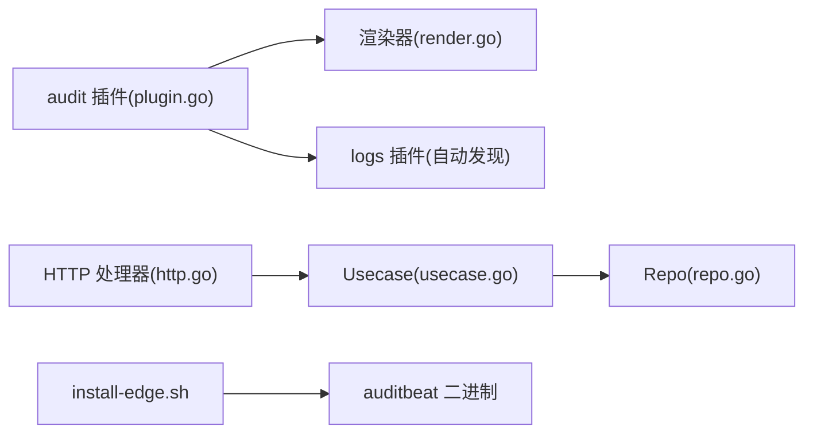

# 审计日志插件

<cite>
**本文引用的文件**   
- [internal/edgeagent/plugins/audit/plugin.go](file://internal/edgeagent/plugins/audit/plugin.go)
- [internal/edgeagent/plugins/audit/render.go](file://internal/edgeagent/plugins/audit/render.go)
- [cmd/ongrid/main.go](file://cmd/ongrid/main.go)
- [internal/manager/biz/audit/usecase.go](file://internal/manager/biz/audit/usecase.go)
- [internal/manager/model/audit/log.go](file://internal/manager/model/audit/log.go)
- [internal/manager/server/audit/http.go](file://internal/manager/server/audit/http.go)
- [internal/manager/data/audit/store/repo.go](file://internal/manager/data/audit/store/repo.go)
- [deploy/install/edge/install-edge.sh](file://deploy/install/edge/install-edge.sh)
</cite>

## 目录
1. [简介](#简介)
2. [项目结构](#项目结构)
3. [核心组件](#核心组件)
4. [架构总览](#架构总览)
5. [详细组件分析](#详细组件分析)
6. [依赖关系分析](#依赖关系分析)
7. [性能与容量规划](#性能与容量规划)
8. [故障排查指南](#故障排查指南)
9. [结论](#结论)
10. [附录：配置示例与合规要点](#附录配置示例与合规要点)

## 简介
本文件面向安全管理员与合规人员，系统化说明“审计日志插件”的实现原理、功能特性与使用方式。内容覆盖：
- 系统调用审计（Linux auditd）、文件完整性监控（FIM）、系统状态采集（system）
- 用户操作审计与安全事件记录（Manager 侧 HLD-010）
- 审计规则配置方法与自定义策略编写
- 审计数据存储格式、查询接口与分析工具集成
- 保留策略、隐私保护与合规性要求
- 常见安全审计场景的完整配置示例

## 项目结构
审计能力由两部分组成：
- 边缘端插件：在 Linux 节点上通过子进程运行 auditbeat，采集系统调用、文件完整性与系统状态，输出 JSONL 到本地文件，再由日志插件自动发现并推送至 Loki。
- 管理端审计：对平台内“谁做了什么”的操作进行不可篡改的追加式记录，提供分页查询与保留清理。

图表来源
- [internal/edgeagent/plugins/audit/plugin.go:76-92](file://internal/edgeagent/plugins/audit/plugin.go#L76-L92)
- [internal/manager/server/audit/http.go:30-34](file://internal/manager/server/audit/http.go#L30-L34)
- [internal/manager/biz/audit/usecase.go:118-124](file://internal/manager/biz/audit/usecase.go#L118-L124)
- [internal/manager/data/audit/store/repo.go:52-94](file://internal/manager/data/audit/store/repo.go#L52-L94)

章节来源
- [internal/edgeagent/plugins/audit/plugin.go:1-92](file://internal/edgeagent/plugins/audit/plugin.go#L1-L92)
- [internal/manager/server/audit/http.go:1-172](file://internal/manager/server/audit/http.go#L1-L172)
- [internal/manager/biz/audit/usecase.go:1-191](file://internal/manager/biz/audit/usecase.go#L1-L191)
- [internal/manager/data/audit/store/repo.go:1-102](file://internal/manager/data/audit/store/repo.go#L1-L102)

## 核心组件
- 边缘端审计插件
  - 负责渲染 auditbeat.yml、启动 auditbeat 子进程、约定 JSONL 输出路径，供 logs 插件自动发现。
- 审计模板渲染器
  - 将 Manager 下发的 PluginConfig 渲染为 auditbeat 配置；支持结构化字段与 raw_config 透传两种模式。
- 管理端审计用例（Usecase）
  - 统一写入“谁做了什么”的审计事件，提供列表与变更查询，以及每日保留清理任务。
- 审计数据模型与常量
  - 定义审计行结构与标准动作/资源类型枚举。
- 审计 HTTP 接口
  - 暴露 /v1/admin/audit-logs，仅管理员可读，支持多条件过滤与分页。
- 审计存储仓库（Repo）
  - 基于 GORM 的增删改查封装，仅允许追加写入与按时间删除。

章节来源
- [internal/edgeagent/plugins/audit/plugin.go:29-74](file://internal/edgeagent/plugins/audit/plugin.go#L29-L74)
- [internal/edgeagent/plugins/audit/render.go:130-234](file://internal/edgeagent/plugins/audit/render.go#L130-L234)
- [internal/manager/biz/audit/usecase.go:58-116](file://internal/manager/biz/audit/usecase.go#L58-L116)
- [internal/manager/model/audit/log.go:29-136](file://internal/manager/model/audit/log.go#L29-L136)
- [internal/manager/server/audit/http.go:22-34](file://internal/manager/server/audit/http.go#L22-L34)
- [internal/manager/data/audit/store/repo.go:14-33](file://internal/manager/data/audit/store/repo.go#L14-L33)

## 架构总览
审计体系分为两条主线：
- 系统级审计（边缘端）：auditbeat 采集系统调用、文件完整性与系统状态，输出 JSONL 到本地文件，promtail 自动发现并推送到 Loki，便于集中检索与告警。
- 平台操作审计（管理端）：所有关键写操作以追加式写入 audit_logs 表，提供只读查询与保留清理，满足合规与 RCA 需求。

图表来源
- [internal/edgeagent/plugins/audit/plugin.go:76-92](file://internal/edgeagent/plugins/audit/plugin.go#L76-L92)
- [internal/manager/server/audit/http.go:60-110](file://internal/manager/server/audit/http.go#L60-L110)
- [internal/manager/biz/audit/usecase.go:118-124](file://internal/manager/biz/audit/usecase.go#L118-L124)
- [internal/manager/data/audit/store/repo.go:52-94](file://internal/manager/data/audit/store/repo.go#L52-L94)

## 详细组件分析

### 边缘端审计插件（auditbeat 子进程）
- 职责
  - 构造并注册 SubprocessPlugin，指定二进制、工作目录、配置文件路径。
  - 通过 ConfigRender 渲染 auditbeat.yml，Args 注入参数。
  - 暴露 OutputPath 用于 logs 插件自动发现 JSONL 输出。
- 关键点
  - 仅 Linux 可用（依赖内核 audit 子系统）。
  - 通过 path.Join 保证跨平台 Go 边界一致的路径契约。
  - 默认关闭 strict.perms 检查以避免不必要的启动失败。

图表来源
- [internal/edgeagent/plugins/audit/plugin.go:24-74](file://internal/edgeagent/plugins/audit/plugin.go#L24-L74)
- [internal/edgeagent/plugins/audit/plugin.go:76-92](file://internal/edgeagent/plugins/audit/plugin.go#L76-L92)

章节来源
- [internal/edgeagent/plugins/audit/plugin.go:1-92](file://internal/edgeagent/plugins/audit/plugin.go#L1-L92)

### 审计模板渲染器（render.go）
- 两种模式
  - 模式 1（raw_config）：直接透传 operator 提供的完整 YAML，不注入任何内置字段。
  - 模式 2（structured）：根据结构化字段渲染模板，自动注入 device_id、drop_fields 等，并固定 path.home/data/logs 到插件工作目录避免 EROFS。
- 支持的模块
  - auditd（系统调用审计）
  - file_integrity（文件完整性监控）
  - system（包信息、主机状态、登录、进程、套接字、用户等数据集）
- 关键配置项（结构化模式）
  - modules、fim_paths、output_file、auditd_rule_files、auditd_rules
  - system_package_period、system_state_datasets、system_state_period
  - system_user_detect_password_changes、system_login_wtmp_pattern、system_login_btmp_pattern
- 环境变量
  - ONGRID_EDGE_AUDIT_FIM_PATHS：逗号分隔的 FIM 路径列表，优先级低于 spec，高于默认值。

图表来源
- [internal/edgeagent/plugins/audit/render.go:130-234](file://internal/edgeagent/plugins/audit/render.go#L130-L234)
- [internal/edgeagent/plugins/audit/render.go:298-386](file://internal/edgeagent/plugins/audit/render.go#L298-L386)

章节来源
- [internal/edgeagent/plugins/audit/render.go:1-461](file://internal/edgeagent/plugins/audit/render.go#L1-L461)

### 管理端审计用例（Usecase）
- 写入语义
  - Emit 方法将 Event 持久化为不可变审计行；失败仅告警，绝不阻塞业务。
  - 自动填充 OccurredAt，Payload 经 JSON 序列化后存入 PayloadJSON。
- 查询语义
  - List 支持按用户、动作、资源类型、状态、时间范围、分页过滤。
  - ListChanges 为 RCA 提供“某时间段内变更事件”的便捷查询。
- 保留策略
  - RunRetention 每天 03:00 执行一次，删除早于 cutoff 的记录；retentionDays<=0 则禁用清理。

图表来源
- [internal/manager/biz/audit/usecase.go:58-183](file://internal/manager/biz/audit/usecase.go#L58-L183)
- [internal/manager/data/audit/store/repo.go:14-101](file://internal/manager/data/audit/store/repo.go#L14-L101)

章节来源
- [internal/manager/biz/audit/usecase.go:1-191](file://internal/manager/biz/audit/usecase.go#L1-L191)
- [internal/manager/data/audit/store/repo.go:1-102](file://internal/manager/data/audit/store/repo.go#L1-L102)

### 审计数据模型与常量
- 数据模型
  - Log 包含发生时间、主体信息（用户/角色/IP/UA）、动作、资源标识、结果、错误信息、负载 JSON、请求 ID 等。
- 标准动作与资源类型
  - 动作采用动词_资源的蛇形命名，保持精简；具体差异放入 payload。
  - 资源类型采用扁平分组，便于 UI 聚合展示。

章节来源
- [internal/manager/model/audit/log.go:29-136](file://internal/manager/model/audit/log.go#L29-L136)

### 审计 HTTP 接口
- 路由
  - GET /v1/admin/audit-logs
- 鉴权
  - 仅 admin 或超级用户可访问；非授权直接返回 403，且不再自审（避免噪音）。
- 查询参数
  - user_email、action、resource_type、status、from、to、limit、offset
- 返回
  - items 数组与 total 总数，便于前端分页。

图表来源
- [internal/manager/server/audit/http.go:30-34](file://internal/manager/server/audit/http.go#L30-L34)
- [internal/manager/server/audit/http.go:60-110](file://internal/manager/server/audit/http.go#L60-L110)
- [internal/manager/biz/audit/usecase.go:118-124](file://internal/manager/biz/audit/usecase.go#L118-L124)
- [internal/manager/data/audit/store/repo.go:52-94](file://internal/manager/data/audit/store/repo.go#L52-L94)

章节来源
- [internal/manager/server/audit/http.go:1-172](file://internal/manager/server/audit/http.go#L1-L172)

## 依赖关系分析
- 边缘端
  - audit 插件依赖 SubprocessPlugin 生命周期管理与路径契约；logs 插件通过 OutputPath 自动发现 JSONL。
- 管理端
  - HTTP 层依赖 biz 层；biz 层依赖 store 层；store 层依赖 GORM。
- 安装与部署
  - install-edge.sh 负责安装 auditbeat 二进制（可选），并在自检中提示缺失情况。

图表来源
- [internal/edgeagent/plugins/audit/plugin.go:29-74](file://internal/edgeagent/plugins/audit/plugin.go#L29-L74)
- [internal/edgeagent/plugins/audit/render.go:130-234](file://internal/edgeagent/plugins/audit/render.go#L130-L234)
- [internal/manager/server/audit/http.go:30-34](file://internal/manager/server/audit/http.go#L30-L34)
- [internal/manager/biz/audit/usecase.go:58-116](file://internal/manager/biz/audit/usecase.go#L58-L116)
- [internal/manager/data/audit/store/repo.go:14-33](file://internal/manager/data/audit/store/repo.go#L14-L33)
- [deploy/install/edge/install-edge.sh:252-264](file://deploy/install/edge/install-edge.sh#L252-L264)

章节来源
- [deploy/install/edge/install-edge.sh:250-449](file://deploy/install/edge/install-edge.sh#L250-L449)

## 性能与容量规划
- 边缘端
  - auditbeat 输出为本地 JSONL，rotate_every_kb 与 number_of_files 控制轮转大小与数量，避免磁盘暴涨。
  - promtail 自动 tail 文件，建议确保磁盘 IO 与网络带宽满足峰值吞吐。
- 管理端
  - 查询限制：Limit 上限 500，默认 50；建议结合时间窗口与关键字段过滤减少扫描量。
  - 保留策略：默认 180 天，可通过环境变量调整或禁用（交由外部归档）。
- 索引与排序
  - 按 occurred_at 倒序+id 倒序，适合最近事件优先查看；可按需扩展数据库索引。

[本节为通用指导，无需代码引用]

## 故障排查指南
- 边缘端
  - auditbeat 未安装：install-edge.sh 会给出警告，插件将无法启动；需在打包阶段补齐二进制。
  - 权限问题：ProtectSystem=strict 下必须将 path.home/data/logs 指向可写目录（插件已固定到工作目录）。
  - 无数据上报：确认 state 目录可写、journald 可读、数据平面可达。
- 管理端
  - 无法查询审计日志：确认当前用户具备 admin 或 superuser 角色；检查 from/to 时间范围是否合理。
  - 写入失败：Usecase 不会阻断业务，但会在日志中告警；检查数据库连接与磁盘空间。

章节来源
- [deploy/install/edge/install-edge.sh:252-264](file://deploy/install/edge/install-edge.sh#L252-L264)
- [internal/manager/biz/audit/usecase.go:72-116](file://internal/manager/biz/audit/usecase.go#L72-L116)
- [internal/manager/server/audit/http.go:60-73](file://internal/manager/server/audit/http.go#L60-L73)

## 结论
该审计方案将“系统级审计”和“平台操作审计”解耦设计：前者聚焦内核与文件系统行为，后者聚焦平台关键写操作的不可变记录。通过标准化动作与资源类型、严格的保留策略与最小化敏感信息，既满足日常运维与 RCA 需求，也兼顾合规与隐私保护。

[本节为总结性内容，无需代码引用]

## 附录：配置示例与合规要点

### 配置入口与键名
- 边缘端 PluginConfig（结构化模式）
  - modules: ["auditd","file_integrity","system"]
  - fim_paths: ["/bin","/usr/bin","/sbin","/usr/sbin","/etc"]
  - output_file: "audit.jsonl"
  - auditd_rule_files: "${path.config}/audit.rules.d/*.conf"
  - auditd_rules: 多行文本块（默认注释样例）
  - system_package_period: "2m"
  - system_state_datasets: ["host","login","process","socket","user"]
  - system_state_period: "12h"
  - system_user_detect_password_changes: true
  - system_login_wtmp_pattern: "/var/log/wtmp*"
  - system_login_btmp_pattern: "/var/log/btmp*"
- 环境变量
  - ONGRID_EDGE_AUDIT_FIM_PATHS：逗号分隔路径列表
- 管理端保留策略
  - ONGRID_AUDIT_RETENTION_DAYS：天数，0 表示禁用内部清理

章节来源
- [internal/edgeagent/plugins/audit/render.go:151-189](file://internal/edgeagent/plugins/audit/render.go#L151-L189)
- [internal/edgeagent/plugins/audit/render.go:319-386](file://internal/edgeagent/plugins/audit/render.go#L319-L386)
- [cmd/ongrid/main.go:409-420](file://cmd/ongrid/main.go#L409-L420)

### 自定义审计策略（raw_config 模式）
- 当需要启用非标准模块或高级处理器时，可在 spec.raw_config 中提供完整的 auditbeat YAML。注意：
  - 此时不会注入 device_id/drop_fields 等内置字段。
  - 需要自行设置 path.home/data/logs 为可写目录，避免 EROFS。

章节来源
- [internal/edgeagent/plugins/audit/render.go:130-149](file://internal/edgeagent/plugins/audit/render.go#L130-L149)

### 查询接口与筛选
- 接口：GET /v1/admin/audit-logs
- 常用参数
  - user_email、action、resource_type、status、from、to、limit、offset
- 返回字段
  - id、occurred_at、user_email、role、ip、user_agent、action、resource_type、resource_id、resource_name、status、error_code、error_message、payload_json、request_id

章节来源
- [internal/manager/server/audit/http.go:30-34](file://internal/manager/server/audit/http.go#L30-L34)
- [internal/manager/server/audit/http.go:75-110](file://internal/manager/server/audit/http.go#L75-L110)

### 常见安全审计场景示例
- 检测异常登录尝试
  - 开启 system.login 数据集，关注 status=failure 的 auth_login_failed 事件。
- 监控敏感文件变更
  - 启用 file_integrity，watch /etc 与关键二进制目录，结合告警规则。
- 追踪系统调用异常
  - 启用 auditd，按需取消默认规则中的注释，聚焦 execve、权限拒绝等关键 syscall。
- 审计平台配置变更
  - 通过 action=setting_update 与 payload 中的 key/category 定位敏感配置修改。

[本节为概念性示例，无需代码引用]

### 保留策略、隐私保护与合规性
- 保留策略
  - 默认 180 天；可通过环境变量调整或禁用，交由外部归档系统处理。
- 隐私保护
  - 管理端审计的 payload 必须由调用方在写入前脱敏（如 LLM Key、密码、Token）。
  - 边缘端模板默认 drop host.* 元数据以降低基数与隐私风险。
- 合规性
  - 审计日志为追加式不可变记录；除保留清理外，禁止就地修改或删除。
  - 建议结合 SIEM/SOAR 与外部归档以满足留存期与取证需求。

章节来源
- [cmd/ongrid/main.go:409-420](file://cmd/ongrid/main.go#L409-L420)
- [internal/manager/model/audit/log.go:21-28](file://internal/manager/model/audit/log.go#L21-L28)
- [internal/edgeagent/plugins/audit/render.go:107-128](file://internal/edgeagent/plugins/audit/render.go#L107-L128)