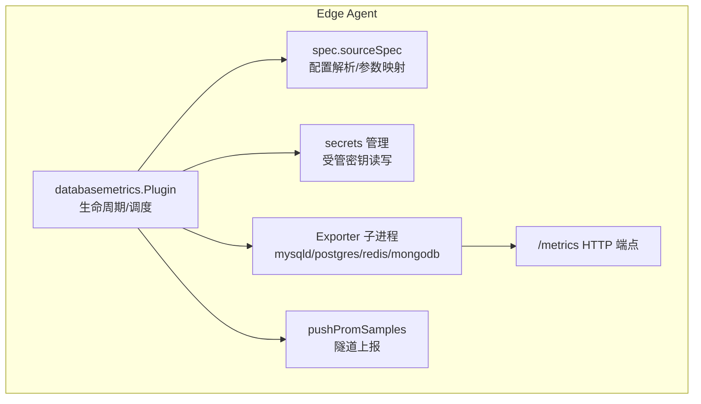
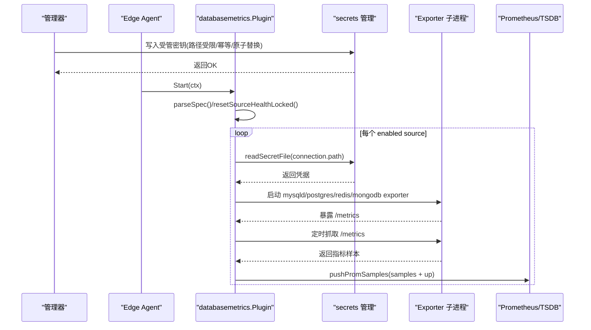
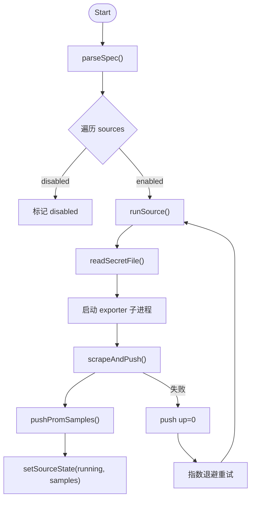
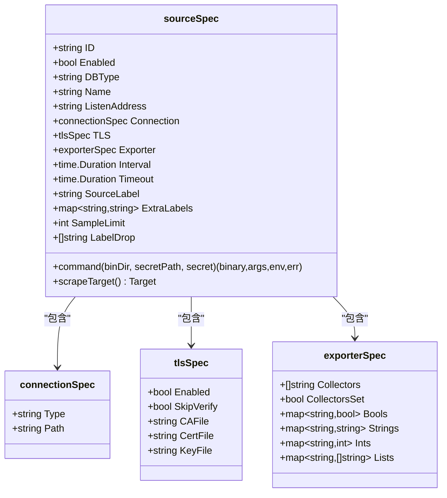
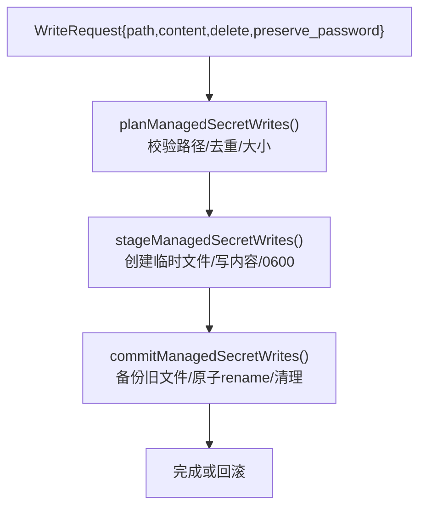
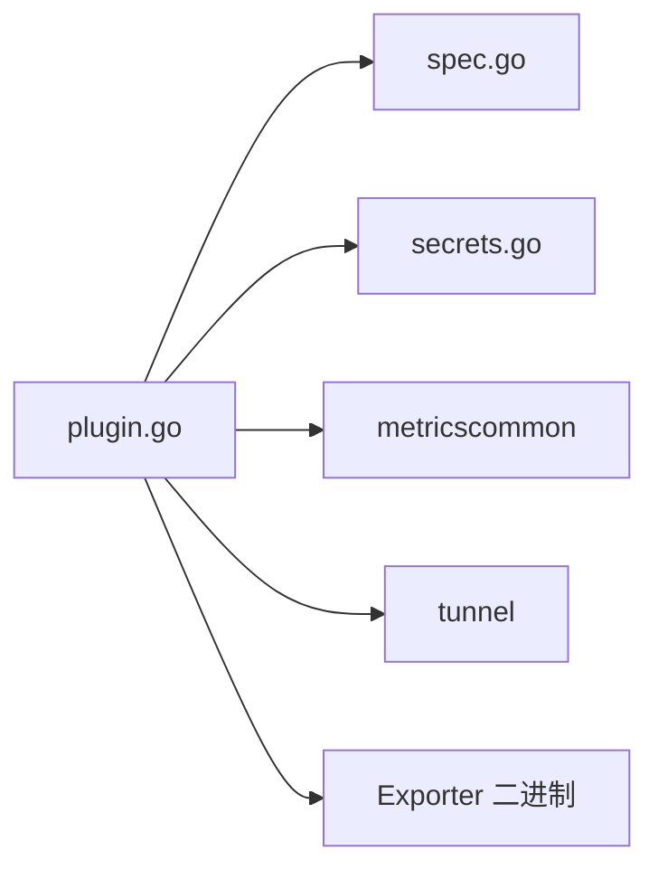

# 数据库监控插件

<cite>
**本文引用的文件**   
- [plugin.go](file://internal/edgeagent/plugins/databasemetrics/plugin.go)
- [spec.go](file://internal/edgeagent/plugins/databasemetrics/spec.go)
- [secrets.go](file://internal/edgeagent/plugins/databasemetrics/secrets.go)
- [plugin_test.go](file://internal/edgeagent/plugins/databasemetrics/plugin_test.go)
- [spec_test.go](file://internal/edgeagent/plugins/databasemetrics/spec_test.go)
- [secrets_test.go](file://internal/edgeagent/plugins/databasemetrics/secrets_test.go)
</cite>

## 目录
1. [简介](#简介)
2. [项目结构](#项目结构)
3. [核心组件](#核心组件)
4. [架构总览](#架构总览)
5. [详细组件分析](#详细组件分析)
6. [依赖关系分析](#依赖关系分析)
7. [性能与调优建议](#性能与调优建议)
8. [故障诊断指南](#故障诊断指南)
9. [结论](#结论)
10. [附录：配置示例与最佳实践](#附录配置示例与最佳实践)

## 简介
本插件为边缘侧“数据库监控”子插件，负责在每台边缘节点上按配置启动对应数据库的 Exporter 子进程（mysqld_exporter、postgres_exporter、redis_exporter、mongodb_exporter），周期性抓取指标并通过隧道推送至管理器。其设计要点包括：
- 多数据库支持：MySQL、PostgreSQL、Redis、MongoDB
- 安全认证：通过受管密钥文件写入与读取，严格权限校验，避免凭据泄露到命令行参数
- 指标采集：基于各官方 Exporter 能力，覆盖连接池状态、查询性能、锁等待、复制延迟等关键维度
- 可观测性：统一健康快照、Up 样本、错误日志与回退重试机制

## 项目结构
该插件位于 edgeagent 插件体系下，采用“插件 + 规范解析 + 安全管理”的分层组织方式：
- plugin.go：插件生命周期管理、Exporter 进程编排、定时抓取与推送、健康状态维护
- spec.go：配置解析、Exporter 参数映射、监听地址与端口冲突检测、默认标签与丢弃规则
- secrets.go：受管密钥文件的创建、更新、删除、保留密码策略、路径白名单与原子替换
- *_test.go：单元测试覆盖关键行为（权限、参数生成、Up 样本、路径校验等）

图表来源
- [plugin.go:145-274](file://internal/edgeagent/plugins/databasemetrics/plugin.go#L145-L274)
- [spec.go:168-203](file://internal/edgeagent/plugins/databasemetrics/spec.go#L168-L203)
- [secrets.go:28-51](file://internal/edgeagent/plugins/databasemetrics/secrets.go#L28-L51)

章节来源
- [plugin.go:1-106](file://internal/edgeagent/plugins/databasemetrics/plugin.go#L1-L106)
- [spec.go:54-166](file://internal/edgeagent/plugins/databasemetrics/spec.go#L54-L166)
- [secrets.go:1-51](file://internal/edgeagent/plugins/databasemetrics/secrets.go#L1-L51)

## 核心组件
- 插件主循环与进程管理
  - 启动后解析配置，为每个 enabled 的 source 启动一个独立的 Exporter 子进程
  - 每轮抓取前检查 exporter 是否存活，失败则标记 failed 并指数退避重启
  - 每次抓取成功追加 up 样本并推送；失败时仅推送 up=0 以反映不可用
- 配置解析与参数映射
  - 支持 sources 数组，唯一 id、db_type、listen_address、connection.path、exporter 高级选项
  - 自动注入 db_type/service 标签，默认丢弃 query/statement/collection 等高基数标签
  - 监听端口冲突与保留端口保护
- 受管密钥与安全
  - 管理器通过 RPC 将凭据写入 /var/lib/ongrid-edge/secrets 下的目标文件
  - 插件读取时强制 0600 权限、拒绝空内容、拒绝目录路径
  - 支持“保留密码”策略，在不覆盖密码的前提下更新其他字段

章节来源
- [plugin.go:145-274](file://internal/edgeagent/plugins/databasemetrics/plugin.go#L145-L274)
- [plugin.go:276-324](file://internal/edgeagent/plugins/databasemetrics/plugin.go#L276-L324)
- [spec.go:95-166](file://internal/edgeagent/plugins/databasemetrics/spec.go#L95-L166)
- [spec.go:374-423](file://internal/edgeagent/plugins/databasemetrics/spec.go#L374-L423)
- [secrets.go:326-349](file://internal/edgeagent/plugins/databasemetrics/secrets.go#L326-L349)

## 架构总览
下图展示了从配置下发到指标落库的整体流程，以及关键的安全边界与回退策略。

图表来源
- [plugin.go:145-274](file://internal/edgeagent/plugins/databasemetrics/plugin.go#L145-L274)
- [secrets.go:28-51](file://internal/edgeagent/plugins/databasemetrics/secrets.go#L28-L51)
- [secrets.go:326-349](file://internal/edgeagent/plugins/databasemetrics/secrets.go#L326-L349)

## 详细组件分析

### 插件主循环与进程管理（plugin.go）
- 生命周期
  - Configure：解析配置并初始化目标健康信息
  - Start：开启 run 协程，按源并行启动 exporter
  - Stop：取消上下文并等待停止，超时告警
- 运行模型
  - run：遍历 sources，跳过 disabled，逐个 goroutine 调用 runSource
  - runSource：封装 panic 恢复、指数退避、failed 状态上报
  - runExporterAndScraper：读取受管密钥、构造命令与环境变量、启动子进程、记录日志、定时抓取
  - scrapeAndPush：抓取指标、追加 up 样本、推送、更新健康
- 健康与错误
  - HealthSnapshot：聚合所有 target 的健康快照
  - setPluginState/setSourceState：维护插件级与源级状态、最近成功时间、错误消息

图表来源
- [plugin.go:145-274](file://internal/edgeagent/plugins/databasemetrics/plugin.go#L145-L274)
- [plugin.go:276-324](file://internal/edgeagent/plugins/databasemetrics/plugin.go#L276-L324)

章节来源
- [plugin.go:77-130](file://internal/edgeagent/plugins/databasemetrics/plugin.go#L77-L130)
- [plugin.go:145-274](file://internal/edgeagent/plugins/databasemetrics/plugin.go#L145-L274)
- [plugin.go:276-324](file://internal/edgeagent/plugins/databasemetrics/plugin.go#L276-L324)
- [plugin.go:330-403](file://internal/edgeagent/plugins/databasemetrics/plugin.go#L330-L403)

### 配置解析与参数映射（spec.go）
- 支持的数据库类型：mysql、postgresql、redis、mongodb
- 关键字段
  - id/db_type/listen_address/connection.type=path/exporter.*
  - scrape_interval/scrape_timeout/source_label/sample_limit/label_drop
  - extra_labels 自动注入 db_type/service
- 监听地址与端口
  - 默认端口：MySQL 19104、PostgreSQL 19187、Redis 19121、MongoDB 19216
  - 冲突检测：重复端口、保留端口（如 hostmetrics/procmetrics）
- Exporter 参数映射
  - 按数据库类型分别映射布尔、字符串、整数、列表参数
  - MySQL：collectors、perf_schema 限制、慢查询过滤、心跳表等
  - PostgreSQL：自动发现、stat_statements 限制、include/exclude 列表
  - Redis：集群模式、键扫描、模块指标、客户端名等
  - MongoDB：collectors 集合、兼容模式、连接池、分片等
- 高基数标签丢弃
  - MySQL/PostgreSQL 默认丢弃 query/statement
  - MongoDB 默认丢弃 collection/query

图表来源
- [spec.go:15-52](file://internal/edgeagent/plugins/databasemetrics/spec.go#L15-L52)
- [spec.go:168-203](file://internal/edgeagent/plugins/databasemetrics/spec.go#L168-L203)
- [spec.go:374-423](file://internal/edgeagent/plugins/databasemetrics/spec.go#L374-L423)

章节来源
- [spec.go:54-166](file://internal/edgeagent/plugins/databasemetrics/spec.go#L54-L166)
- [spec.go:390-423](file://internal/edgeagent/plugins/databasemetrics/spec.go#L390-L423)
- [spec.go:560-774](file://internal/edgeagent/plugins/databasemetrics/spec.go#L560-L774)

### 受管密钥与安全（secrets.go）
- 写入接口
  - RegisterSecretHandler：注册 manager->edge 的一次性写密钥 RPC
  - writeManagedSecretsInBase：计划-暂存-提交三阶段写入，支持批量与删除
- 安全约束
  - 路径白名单：仅允许 /var/lib/ongrid-edge/secrets 下绝对路径
  - 拒绝符号链接、拒绝越界路径
  - 临时文件 0600 权限，原子 rename 安装，失败回滚
  - 最大内容大小限制
- 读取约束
  - readSecretFile：必须存在、非空、非目录、权限不宽于 0600
- 保留密码策略
  - PreservePassword=true 时，若未显式提供 password，则从现有文件中提取并保留
  - 针对 MySQL .my.cnf 与 DSN URI 分别解析
- 凭据构建
  - buildEdgeDatabaseMetricsSecret：根据 db_type 生成对应格式（MySQL my.cnf、PostgreSQL DSN、Redis URI、MongoDB URI）
  - 自动处理 TLS 开关、证书路径、sslmode/tls 参数

图表来源
- [secrets.go:28-51](file://internal/edgeagent/plugins/databasemetrics/secrets.go#L28-L51)
- [secrets.go:398-414](file://internal/edgeagent/plugins/databasemetrics/secrets.go#L398-L414)
- [secrets.go:431-476](file://internal/edgeagent/plugins/databasemetrics/secrets.go#L431-L476)
- [secrets.go:496-637](file://internal/edgeagent/plugins/databasemetrics/secrets.go#L496-L637)
- [secrets.go:326-349](file://internal/edgeagent/plugins/databasemetrics/secrets.go#L326-L349)

章节来源
- [secrets.go:71-108](file://internal/edgeagent/plugins/databasemetrics/secrets.go#L71-L108)
- [secrets.go:153-228](file://internal/edgeagent/plugins/databasemetrics/secrets.go#L153-L228)
- [secrets.go:243-338](file://internal/edgeagent/plugins/databasemetrics/secrets.go#L243-L338)
- [secrets.go:398-637](file://internal/edgeagent/plugins/databasemetrics/secrets.go#L398-L637)

### 指标采集与导出器能力
- MySQL
  - 连接池与进程：processlist、global_status
  - 查询性能：perf_schema.eventsstatements、query_response_time
  - 锁等待：exporter.enable_lock_wait_timeout、tablelocks
  - 复制延迟：replication_group_members、slave_status、info_schema.replica_host
  - InnoDB/RocksDB：innodb_metrics、rocksdb_perf_context
- PostgreSQL
  - 连接与活动：stat_activity、postmaster
  - 查询性能：stat_statements（limit、include_query）
  - 锁等待：collector.locks
  - 复制：collector.replication、collector.stat_wal_receiver
  - WAL/归档：collector.wal、collector.xlog_location
- Redis
  - 连接与内存：info、memory、clients
  - 集群与哨兵：is-cluster、include-sentinel-peer-info
  - 键扫描：check-keys/check_single_keys/count-keys
  - Streams/模块：streams、modules-metrics
- MongoDB
  - 连接池：mongodb.global-conn-pool
  - 统计与索引：collstats/indexstats/topmetrics
  - 副本集：replicasetstatus、shards
  - 诊断：diagnosticdata、fcv

说明：以上能力由 spec.go 中各数据库类型的 collectors 与 flags 映射控制，可通过 exporter.collectors 与 exporter.* 字段精细裁剪。

章节来源
- [spec.go:560-774](file://internal/edgeagent/plugins/databasemetrics/spec.go#L560-L774)
- [spec.go:205-249](file://internal/edgeagent/plugins/databasemetrics/spec.go#L205-L249)

## 依赖关系分析
- 内部依赖
  - metricscommon：统一的抓取与 up 样本生成逻辑
  - tunnel：PushPromSamples 上报通道
- 外部依赖
  - 各数据库官方 Exporter 二进制（mysqld_exporter、postgres_exporter、redis_exporter、mongodb_exporter）
- 耦合与内聚
  - plugin.go 聚焦进程与调度，spec.go 专注配置与参数映射，secrets.go 专注安全写入，职责清晰
  - 通过 Target 抽象解耦抓取与上报

图表来源
- [plugin.go:145-274](file://internal/edgeagent/plugins/databasemetrics/plugin.go#L145-L274)
- [spec.go:168-203](file://internal/edgeagent/plugins/databasemetrics/spec.go#L168-L203)
- [secrets.go:28-51](file://internal/edgeagent/plugins/databasemetrics/secrets.go#L28-L51)

章节来源
- [plugin.go:1-106](file://internal/edgeagent/plugins/databasemetrics/plugin.go#L1-L106)
- [spec.go:54-166](file://internal/edgeagent/plugins/databasemetrics/spec.go#L54-L166)
- [secrets.go:1-51](file://internal/edgeagent/plugins/databasemetrics/secrets.go#L1-L51)

## 性能与调优建议
- 抓取间隔与超时
  - scrape_interval 与 scrape_timeout 需合理设置，确保 timeout <= interval
  - 对高负载实例适当增大 interval，降低 Exporter 压力
- 指标裁剪
  - 使用 exporter.collectors 与各类 flag 仅启用必要收集项，减少 CPU/IO 开销
  - MySQL 的 perf_schema eventsstatements 建议限制 limit/timelimit/digest_text_limit
  - PostgreSQL 的 stat_statements.limit 与 include_query 按需开启
  - Redis 的 check-keys 与 batch size 控制扫描范围与频率
  - MongoDB 的 collstats/indexstats 限定集合列表
- 标签治理
  - 利用 label_drop 丢弃高基数标签（query/statement/collection），避免存储膨胀
  - 使用 sample_limit 限制单次抓取样本量
- 资源隔离
  - 每个 source 独立 exporter 进程，避免相互影响
  - 监听地址建议使用 127.0.0.1，避免对外暴露

[本节为通用指导，无需源码引用]

## 故障诊断指南
- 常见问题定位
  - 密钥文件权限过宽：readSecretFile 会拒绝非 0600 的文件
  - 路径不在白名单或被拒绝为符号链接：writeManagedSecretsInBase 会报错
  - 监听端口冲突：parseSpec 会提示与已有 source 或保留端口冲突
  - Exporter 二进制缺失：runExporterAndScraper 会报告 missing binary
  - 抓取失败：scrapeAndPush 会推送 up=0 并记录错误
- 快速自检步骤
  - 确认 /var/lib/ongrid-edge/secrets 下文件存在且权限正确
  - 检查 listen_address 端口未被占用且不冲突
  - 查看工作目录下 <source_id>.log 中的 exporter 输出
  - 验证 Prometheus 是否收到 up 样本与指标
- 测试用例参考
  - 插件测试覆盖了 up 样本推送、启动失败场景、stopped 通道关闭等行为
  - 规格测试覆盖了参数生成、保留密码、路径校验、端口冲突等

章节来源
- [plugin.go:220-274](file://internal/edgeagent/plugins/databasemetrics/plugin.go#L220-L274)
- [plugin.go:276-324](file://internal/edgeagent/plugins/databasemetrics/plugin.go#L276-L324)
- [plugin_test.go:50-135](file://internal/edgeagent/plugins/databasemetrics/plugin_test.go#L50-L135)
- [spec_test.go:317-357](file://internal/edgeagent/plugins/databasemetrics/spec_test.go#L317-L357)
- [secrets_test.go:13-62](file://internal/edgeagent/plugins/databasemetrics/secrets_test.go#L13-L62)

## 结论
数据库监控插件通过“插件+规范解析+受管密钥”的架构，实现了对主流数据库的统一监控接入。其优势在于：
- 安全可控：凭据不落盘明文、路径白名单、原子替换与回滚
- 灵活可扩展：按数据库类型精细化控制 collectors 与参数
- 健壮可靠：进程级隔离、指数退避、up 样本与健康快照
- 易于运维：默认端口与标签、高基数标签丢弃、丰富的测试覆盖

面向 DBA 与运维人员，建议在生产环境遵循最小权限原则、合理裁剪指标、定期审计密钥文件与端口占用，并结合 Prometheus/Grafana 建立告警与可视化面板。

[本节为总结，无需源码引用]

## 附录：配置示例与最佳实践

- 配置结构要点
  - sources：数组，每项包含 id、db_type、listen_address、connection、exporter、scrape_interval、scrape_timeout、source_label、sample_limit、label_drop、extra_labels、tls
  - connection.type 固定为 managed，connection.path 指向受管密钥文件
  - exporter 字段按数据库类型区分，支持 collectors、布尔/字符串/整数/列表参数
- 典型场景
  - MySQL：启用 processlist、eventsstatements、tablelocks、replication_group_members，限制事件语句数量与文本长度
  - PostgreSQL：启用 stat_statements、locks、replication，配置 include_databases/stat_statements.exclude_users
  - Redis：启用 is-cluster、include-sentinel-peer-info，配置 check-keys 与 count-keys
  - MongoDB：启用 diagnosticdata、replicasetstatus、fcv，限定 collstats/indexstats 集合
- 安全最佳实践
  - 密钥文件权限 0600，路径位于 /var/lib/ongrid-edge/secrets
  - 使用 preserve_password 更新非敏感字段，避免覆盖密码
  - 禁用 skip_verify 或使用可信 CA/Cert/Key 进行双向 TLS
- 性能最佳实践
  - 合理设置 scrape_interval 与 timeout
  - 使用 label_drop 丢弃高基数标签
  - 限制 sample_limit 与 exporters 的 collectors

[本节为概念性指引，无需源码引用]