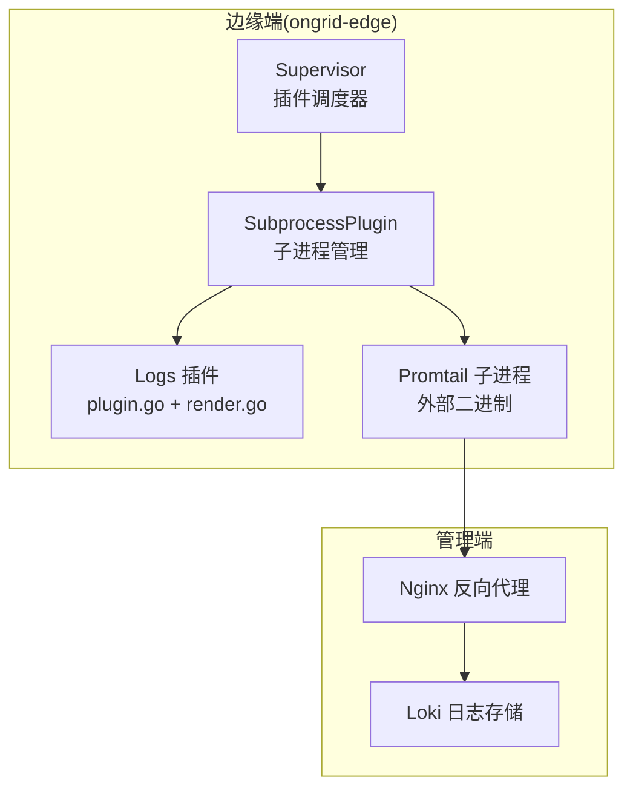
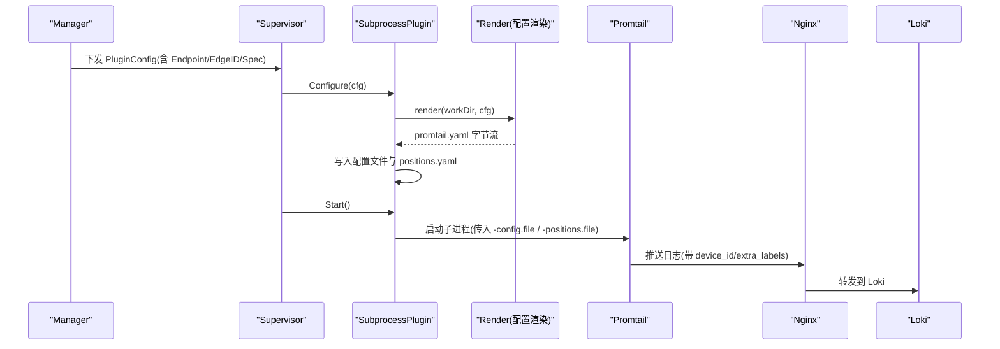
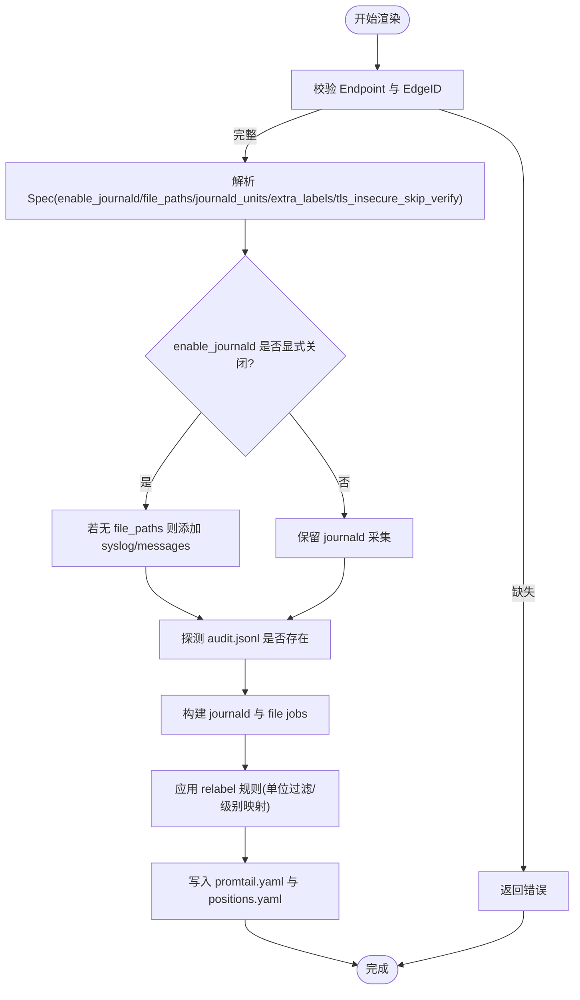
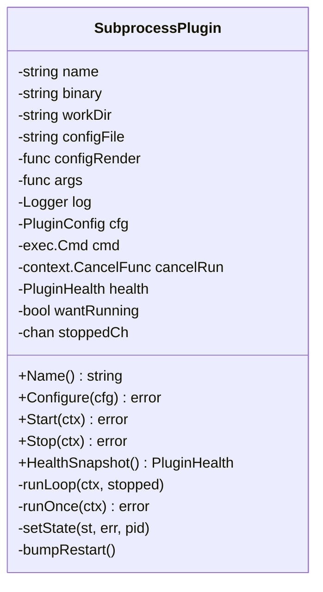
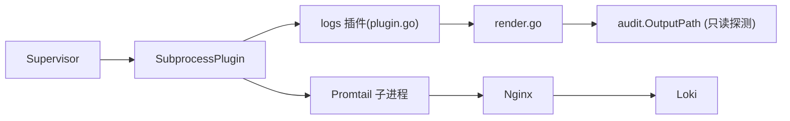

# 日志采集插件

<cite>
**本文引用的文件**   
- [internal/edgeagent/plugins/logs/plugin.go](file://internal/edgeagent/plugins/logs/plugin.go)
- [internal/edgeagent/plugins/logs/render.go](file://internal/edgeagent/plugins/logs/render.go)
- [internal/edgeagent/plugins/logs/render_test.go](file://internal/edgeagent/plugins/logs/render_test.go)
- [internal/edgeagent/plugins/subprocess.go](file://internal/edgeagent/plugins/subprocess.go)
- [internal/edgeagent/plugins/supervisor.go](file://internal/edgeagent/plugins/supervisor.go)
- [internal/skill/builtin/read_journal.go](file://internal/skill/builtin/read_journal.go)
</cite>

## 目录
1. [简介](#简介)
2. [项目结构](#项目结构)
3. [核心组件](#核心组件)
4. [架构总览](#架构总览)
5. [详细组件分析](#详细组件分析)
6. [依赖关系分析](#依赖关系分析)
7. [性能与内存优化](#性能与内存优化)
8. [配置示例与最佳实践](#配置示例与最佳实践)
9. [故障排查指南](#故障排查指南)
10. [结论](#结论)

## 简介
本文件面向运维人员，系统化说明 ongrid-edge 的“日志采集插件”能力与实现。该插件在边缘侧通过子进程方式运行 Promtail，将 journald、系统文件与应用自定义日志源统一采集并推送至管理端的 Loki（经 nginx 暴露）。插件支持：
- journald 日志采集（默认开启）
- 文件日志采集（可配置任意路径）
- 自动发现审计插件输出（audit.jsonl）
- 字段提取与过滤（基于 relabel_configs 与标签注入）
- 批量发送、位置持久化、崩溃重启等稳定性保障

## 项目结构
日志采集插件位于 edge-agent 的插件体系内，由 Supervisor 统一管理生命周期，SubprocessPlugin 负责子进程编排，logs 插件仅关注配置渲染与二进制参数拼装。

图表来源
- [internal/edgeagent/plugins/supervisor.go:114-133](file://internal/edgeagent/plugins/supervisor.go#L114-L133)
- [internal/edgeagent/plugins/subprocess.go:137-156](file://internal/edgeagent/plugins/subprocess.go#L137-L156)
- [internal/edgeagent/plugins/logs/plugin.go:27-53](file://internal/edgeagent/plugins/logs/plugin.go#L27-L53)
- [internal/edgeagent/plugins/logs/render.go:30-95](file://internal/edgeagent/plugins/logs/render.go#L30-L95)

章节来源
- [internal/edgeagent/plugins/logs/plugin.go:1-54](file://internal/edgeagent/plugins/logs/plugin.go#L1-L54)
- [internal/edgeagent/plugins/logs/render.go:1-273](file://internal/edgeagent/plugins/logs/render.go#L1-L273)
- [internal/edgeagent/plugins/subprocess.go:1-318](file://internal/edgeagent/plugins/subprocess.go#L1-L318)
- [internal/edgeagent/plugins/supervisor.go:1-276](file://internal/edgeagent/plugins/supervisor.go#L1-L276)

## 核心组件
- logs 插件（plugin.go）：定义插件名、构造 SubprocessPlugin、提供配置渲染函数与命令行参数（包含 positions 文件路径）。
- 配置渲染器（render.go）：根据 manager 下发的 PluginConfig 生成 Promtail YAML，包含客户端、scrape jobs、relabel 规则与额外标签。
- 子进程管理器（subprocess.go）：负责写配置、启动/停止子进程、捕获输出、崩溃指数退避重启、健康状态上报。
- 插件调度器（supervisor.go）：周期性拉取配置、对比差异、按需 Configure/Start/Stop，保证幂等与自愈。

章节来源
- [internal/edgeagent/plugins/logs/plugin.go:27-53](file://internal/edgeagent/plugins/logs/plugin.go#L27-L53)
- [internal/edgeagent/plugins/logs/render.go:97-189](file://internal/edgeagent/plugins/logs/render.go#L97-L189)
- [internal/edgeagent/plugins/subprocess.go:110-133](file://internal/edgeagent/plugins/subprocess.go#L110-L133)
- [internal/edgeagent/plugins/supervisor.go:138-230](file://internal/edgeagent/plugins/supervisor.go#L138-L230)

## 架构总览
从端到端视角，日志采集流程如下：

图表来源
- [internal/edgeagent/plugins/supervisor.go:138-230](file://internal/edgeagent/plugins/supervisor.go#L138-L230)
- [internal/edgeagent/plugins/subprocess.go:110-156](file://internal/edgeagent/plugins/subprocess.go#L110-L156)
- [internal/edgeagent/plugins/logs/plugin.go:40-52](file://internal/edgeagent/plugins/logs/plugin.go#L40-L52)
- [internal/edgeagent/plugins/logs/render.go:30-95](file://internal/edgeagent/plugins/logs/render.go#L30-L95)

## 详细组件分析

### 组件A：logs 插件与配置渲染
- 插件标识与入口
  - 插件名为 logs，用于注册与目录隔离。
  - 构造时绑定 promtail 二进制路径与工作目录，并提供 ConfigRender 与 Args 回调。
- 配置渲染要点
  - 模板生成 server.disable=true（无需本地 HTTP API），clients 指向管理端 /loki/api/v1/push。
  - 认证支持 basic_auth 或 bearer_token；TLS 默认跳过校验以适配自签证书，可通过 spec 关闭。
  - scrape_configs 包含：
    - journald job（默认启用），支持按 unit 白名单 keep 过滤，并将 systemd_unit/syslog_identifier/priority 映射为标签。
    - file job（每个 file_paths 条目一个 job），设置 __path__ 与 ongrid_source/job 标签。
  - 自动追加 audit 插件 JSONL 输出路径（若存在），无需人工配置。
  - 当 enable_journald=false 且未配置 file_paths 时，回退到 /var/log/syslog 与 /var/log/messages，确保至少有一个 job。
- 安全与健壮性
  - job_name 使用安全函数对路径进行清洗，避免非法字符。
  - 强制要求 Endpoint 与 EdgeID，否则拒绝渲染。

图表来源
- [internal/edgeagent/plugins/logs/render.go:97-189](file://internal/edgeagent/plugins/logs/render.go#L97-L189)
- [internal/edgeagent/plugins/logs/render.go:140-161](file://internal/edgeagent/plugins/logs/render.go#L140-L161)
- [internal/edgeagent/plugins/logs/render.go:260-272](file://internal/edgeagent/plugins/logs/render.go#L260-L272)

章节来源
- [internal/edgeagent/plugins/logs/plugin.go:27-53](file://internal/edgeagent/plugins/logs/plugin.go#L27-L53)
- [internal/edgeagent/plugins/logs/render.go:30-95](file://internal/edgeagent/plugins/logs/render.go#L30-L95)
- [internal/edgeagent/plugins/logs/render.go:97-189](file://internal/edgeagent/plugins/logs/render.go#L97-L189)
- [internal/edgeagent/plugins/logs/render_test.go:18-58](file://internal/edgeagent/plugins/logs/render_test.go#L18-L58)
- [internal/edgeagent/plugins/logs/render_test.go:120-149](file://internal/edgeagent/plugins/logs/render_test.go#L120-L149)

### 组件B：子进程管理与崩溃恢复
- 生命周期
  - Configure：创建 workDir，调用 ConfigRender 生成配置并落盘。
  - Start：检查二进制存在后进入 runLoop，启动子进程并记录 PID/时间戳。
  - Stop：取消上下文并等待退出，最长等待 15s。
- 崩溃恢复
  - runOnce 中捕获子进程退出码，非正常退出视为崩溃。
  - runLoop 采用指数退避重启（1s→2s→…上限 5min），并在每次重启计数递增。
  - 子进程标准输出/错误重定向到工作目录下的 <name>.log。
- 健康状态
  - 维护 State/LastError/PID/RestartCount/UpdatedAt，供心跳上报与诊断。

图表来源
- [internal/edgeagent/plugins/subprocess.go:32-102](file://internal/edgeagent/plugins/subprocess.go#L32-L102)
- [internal/edgeagent/plugins/subprocess.go:137-183](file://internal/edgeagent/plugins/subprocess.go#L137-L183)
- [internal/edgeagent/plugins/subprocess.go:194-235](file://internal/edgeagent/plugins/subprocess.go#L194-L235)
- [internal/edgeagent/plugins/subprocess.go:237-287](file://internal/edgeagent/plugins/subprocess.go#L237-L287)

章节来源
- [internal/edgeagent/plugins/subprocess.go:110-133](file://internal/edgeagent/plugins/subprocess.go#L110-L133)
- [internal/edgeagent/plugins/subprocess.go:137-183](file://internal/edgeagent/plugins/subprocess.go#L137-L183)
- [internal/edgeagent/plugins/subprocess.go:194-235](file://internal/edgeagent/plugins/subprocess.go#L194-L235)
- [internal/edgeagent/plugins/subprocess.go:237-287](file://internal/edgeagent/plugins/subprocess.go#L237-L287)

### 组件C：插件调度器（Supervisor）
- 职责
  - 周期拉取配置快照，计算差异，执行 Configure/Start/Stop。
  - 支持外部触发重载信号，合并多次触发。
  - 关闭时有序停止所有插件。
- 关键行为
  - 首次运行即执行一次 reconcile。
  - 每 60s 轮询一次作为安全网。
  - 配置变更检测基于语义比较，避免无意义重启。

章节来源
- [internal/edgeagent/plugins/supervisor.go:114-133](file://internal/edgeagent/plugins/supervisor.go#L114-L133)
- [internal/edgeagent/plugins/supervisor.go:138-230](file://internal/edgeagent/plugins/supervisor.go#L138-L230)
- [internal/edgeagent/plugins/supervisor.go:232-251](file://internal/edgeagent/plugins/supervisor.go#L232-L251)
- [internal/edgeagent/plugins/supervisor.go:253-275](file://internal/edgeagent/plugins/supervisor.go#L253-L275)

### 辅助能力：journald 读取技能（ReadJournal）
- 作用
  - 提供 Linux 上通过 journalctl 读取最近日志的能力，便于排障与诊断。
- 特性
  - 只读调用，限制超时 30s，支持 unit/since/lines 参数。
  - 非 Linux 平台返回结构化错误。

章节来源
- [internal/skill/builtin/read_journal.go:18-47](file://internal/skill/builtin/read_journal.go#L18-L47)
- [internal/skill/builtin/read_journal.go:62-112](file://internal/skill/builtin/read_journal.go#L62-L112)

## 依赖关系分析
- 组件耦合
  - logs 插件依赖 SubprocessPlugin 的生命周期管理能力。
  - render.go 依赖 audit 插件的输出路径常量，形成单向依赖（logs 感知 audit）。
  - supervisor 与 plugins 接口解耦，通过统一接口协调多插件。
- 外部依赖
  - Promtail 二进制（由 release 包提供）。
  - 管理端 Nginx/Loki（HTTP 推送目标）。
- 潜在循环依赖
  - 无直接循环；logs 对 audit 的依赖为运行时探测，不存在编译期循环。

图表来源
- [internal/edgeagent/plugins/supervisor.go:138-230](file://internal/edgeagent/plugins/supervisor.go#L138-L230)
- [internal/edgeagent/plugins/subprocess.go:137-156](file://internal/edgeagent/plugins/subprocess.go#L137-L156)
- [internal/edgeagent/plugins/logs/plugin.go:27-53](file://internal/edgeagent/plugins/logs/plugin.go#L27-L53)
- [internal/edgeagent/plugins/logs/render.go:157-161](file://internal/edgeagent/plugins/logs/render.go#L157-L161)

章节来源
- [internal/edgeagent/plugins/logs/render.go:157-161](file://internal/edgeagent/plugins/logs/render.go#L157-L161)

## 性能与内存优化
- 批量与缓冲
  - 客户端 batchsize 与 batchwait 已内置于渲染模板，控制批大小与等待时间，减少网络往返。
- 位置持久化
  - positions.yaml 与配置文件同目录，避免工作目录重建导致游标丢失，提升断点续采效率。
- 崩溃重启与退避
  - 指数退避重启降低瞬时风暴风险，保护下游 Loki 与管理端。
- 标签基数控制
  - 通过 relabel 规则与 extra_labels 白名单，避免高基数字段污染查询与存储。
- 最小化本地服务
  - 禁用本地 HTTP server，减少资源占用与攻击面。

章节来源
- [internal/edgeagent/plugins/logs/render.go:53-63](file://internal/edgeagent/plugins/logs/render.go#L53-L63)
- [internal/edgeagent/plugins/logs/plugin.go:43-52](file://internal/edgeagent/plugins/logs/plugin.go#L43-L52)
- [internal/edgeagent/plugins/subprocess.go:194-235](file://internal/edgeagent/plugins/subprocess.go#L194-L235)

## 配置示例与最佳实践
以下示例均基于 render.go 模板与测试用例中的断言，展示不同场景的配置要点。为避免泄露敏感信息，示例仅列出关键字段与行为说明。

- 基础场景（启用 journald + 指定文件）
  - 必填：Endpoint、EdgeID
  - Spec：
    - enable_journald: true（默认即为 true）
    - file_paths: ["/var/log/syslog", "/var/log/auth.log"]
    - journald_units: ["sshd", "ongrid-edge"]（可选，用于 keep 过滤）
    - extra_labels: {"service":"edge","env":"test"}（可选）
  - 效果：
    - 生成 journald job，并按 unit 白名单过滤
    - 生成多个 file jobs，job_name 由路径安全转换而来
    - 附加 device_id 与 extra_labels 作为 external_labels

- 关闭 journald 并回退到系统日志
  - Spec：
    - enable_journald: false
    - file_paths: ["/var/log/x.log"]
  - 效果：
    - 不生成 journald job
    - 若未配置 file_paths，则自动回退到 /var/log/syslog 与 /var/log/messages

- TLS 与认证
  - 支持 basic_auth 或 bearer_token
  - TLS 默认 insecure_skip_verify=true（适配自签证书），可通过 tls_insecure_skip_verify=false 关闭

- 审计日志自动采集
  - 若工作目录下存在 audit.jsonl，render 会自动将其加入 file_paths，无需人工干预

- 字段提取与过滤
  - journald：
    - 将 __journal__systemd_unit 映射为 unit 标签
    - 将 __journal_syslog_identifier 映射为 identifier 标签
    - 将 __journal_priority 映射为 level 标签
    - 可按 unit 列表 keep 过滤
  - 文件：
    - 通过 __path__ 指定采集路径
    - 通过 ongrid_source/job 区分来源类型

- 最佳实践
  - 优先使用 journald，利用 unit 维度隔离服务日志
  - 谨慎使用 extra_labels，避免引入高基数键值
  - 合理设置 file_paths，避免扫描过大目录
  - 生产环境建议配置真实证书并关闭 insecure_skip_verify
  - 定期观察 Prometheus/Loki 指标与 ongrid-edge 插件健康状态

章节来源
- [internal/edgeagent/plugins/logs/render_test.go:18-58](file://internal/edgeagent/plugins/logs/render_test.go#L18-L58)
- [internal/edgeagent/plugins/logs/render_test.go:74-95](file://internal/edgeagent/plugins/logs/render_test.go#L74-L95)
- [internal/edgeagent/plugins/logs/render_test.go:120-149](file://internal/edgeagent/plugins/logs/render_test.go#L120-L149)
- [internal/edgeagent/plugins/logs/render.go:65-95](file://internal/edgeagent/plugins/logs/render.go#L65-L95)
- [internal/edgeagent/plugins/logs/render.go:140-161](file://internal/edgeagent/plugins/logs/render.go#L140-L161)

## 故障排查指南
- 常见现象与定位
  - 无日志到达 Loki：检查 Endpoint 是否正确、认证是否生效、TLS 策略是否符合实际证书情况。
  - 缺少 journald 数据：确认 enable_journald 是否为 true；如为 false，检查 file_paths 是否覆盖所需路径。
  - 特定 unit 未采集：核对 journald_units 白名单是否匹配目标 unit。
  - 文件未采集：确认 __path__ 对应路径存在且可读；注意 job_name 安全转换后的命名。
- 子进程异常
  - 查看工作目录下的 logs.log，了解 Promtail 启动/运行期错误。
  - 关注 RestartCount 与 LastError，判断是否频繁崩溃重启。
- 配置未生效
  - 确认 Supervisor 是否收到新配置（reconcile snapshot 日志），以及是否触发了重新 Configure/Start。
- 排障工具
  - 使用 ReadJournal 技能快速拉取最近 journald 日志，验证系统层日志可用性。

章节来源
- [internal/edgeagent/plugins/subprocess.go:237-287](file://internal/edgeagent/plugins/subprocess.go#L237-L287)
- [internal/edgeagent/plugins/supervisor.go:138-230](file://internal/edgeagent/plugins/supervisor.go#L138-L230)
- [internal/skill/builtin/read_journal.go:62-112](file://internal/skill/builtin/read_journal.go#L62-L112)

## 结论
日志采集插件以“配置即代码”的方式，将 journald 与文件日志统一接入 Loki，并通过 SubprocessPlugin 与 Supervisor 提供稳定的生命周期管理与自愈能力。通过合理的 relabel 与标签治理、批处理与位置持久化，可在保证稳定性的同时获得良好的吞吐与低延迟表现。建议在生产环境中结合证书与鉴权策略、严格控制标签基数，并持续监控插件健康与后端链路质量。