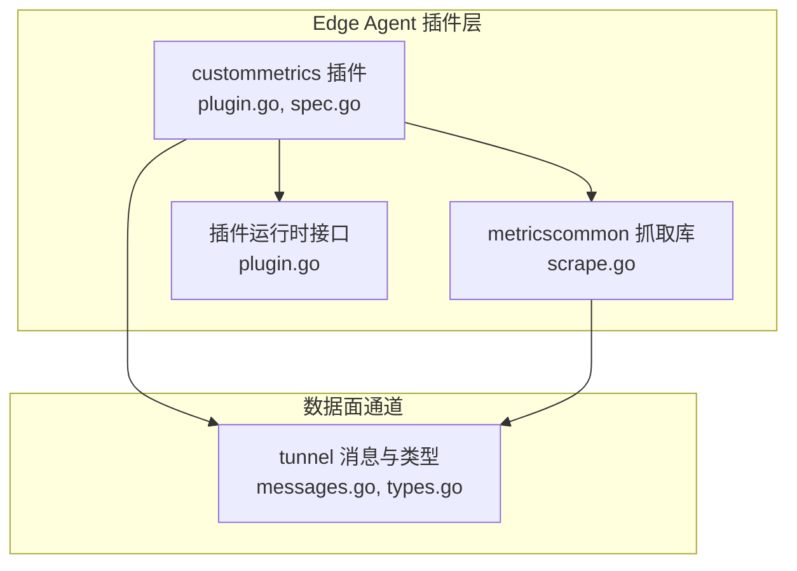
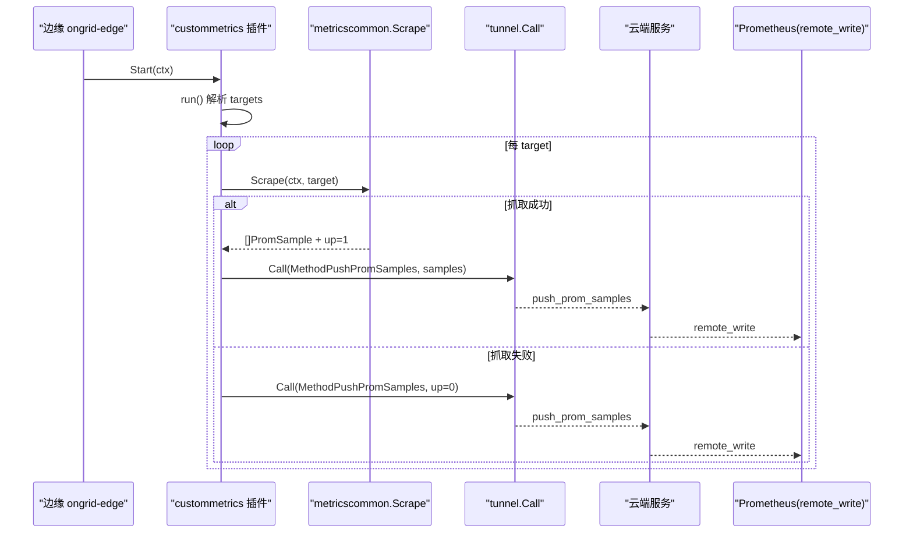
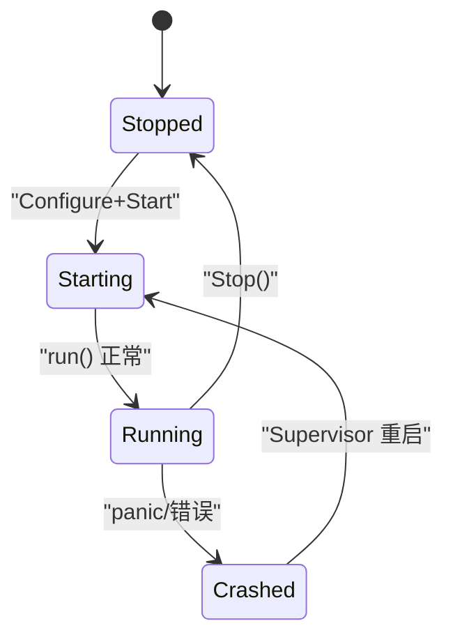
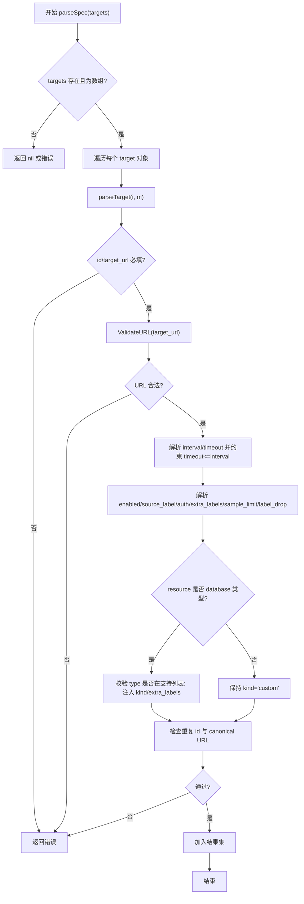
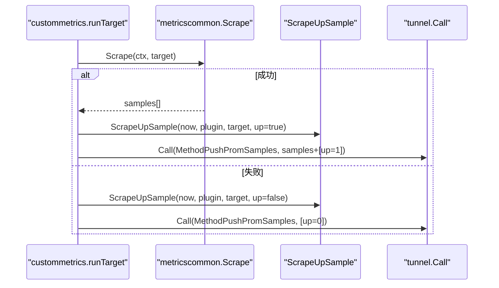
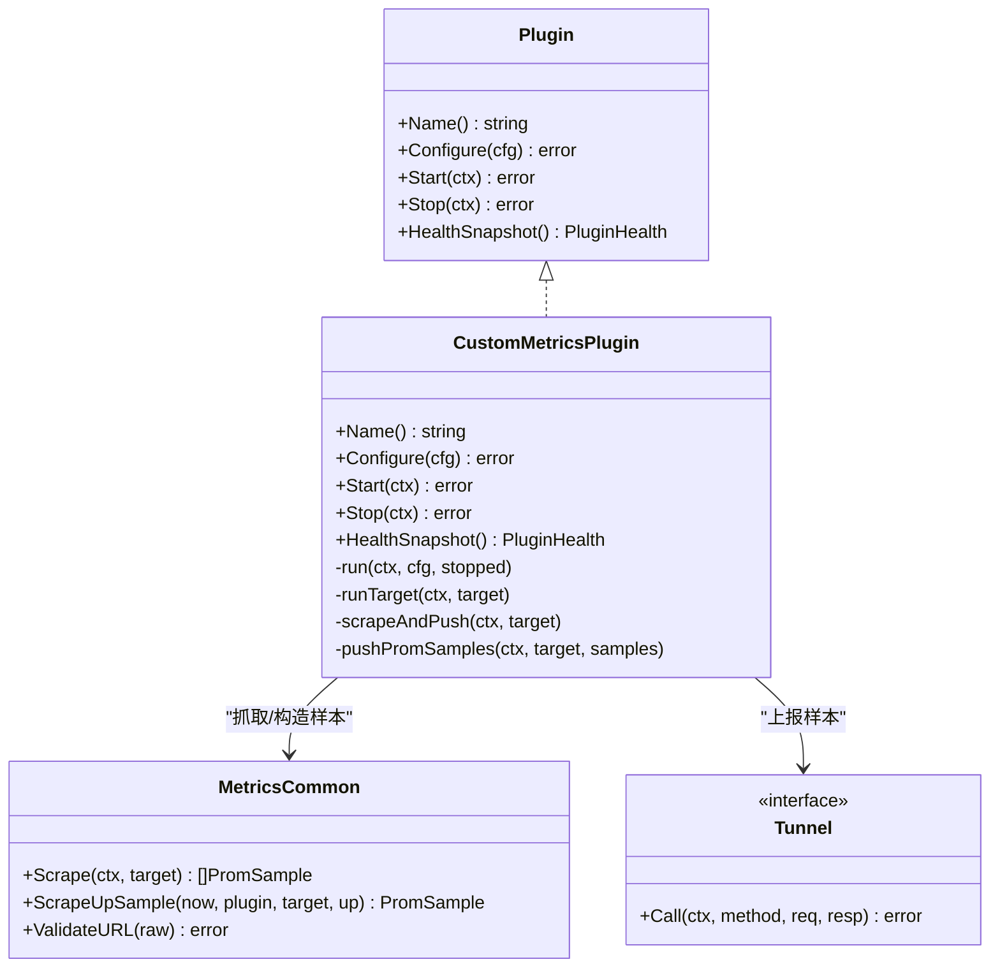

# 自定义指标插件

<cite>
**本文引用的文件列表**
- [internal/edgeagent/plugins/custommetrics/plugin.go](file://internal/edgeagent/plugins/custommetrics/plugin.go)
- [internal/edgeagent/plugins/custommetrics/spec.go](file://internal/edgeagent/plugins/custommetrics/spec.go)
- [internal/edgeagent/plugins/custommetrics/plugin_test.go](file://internal/edgeagent/plugins/custommetrics/plugin_test.go)
- [internal/edgeagent/plugins/custommetrics/spec_test.go](file://internal/edgeagent/plugins/custommetrics/spec_test.go)
- [internal/edgeagent/plugins/metricscommon/scrape.go](file://internal/edgeagent/plugins/metricscommon/scrape.go)
- [internal/edgeagent/plugins/metricscommon/scrape_test.go](file://internal/edgeagent/plugins/metricscommon/scrape_test.go)
- [internal/edgeagent/plugins/plugin.go](file://internal/edgeagent/plugins/plugin.go)
- [internal/pkg/tunnel/types.go](file://internal/pkg/tunnel/types.go)
- [internal/pkg/tunnel/messages.go](file://internal/pkg/tunnel/messages.go)
</cite>

## 目录
1. [简介](#简介)
2. [项目结构](#项目结构)
3. [核心组件](#核心组件)
4. [架构总览](#架构总览)
5. [详细组件分析](#详细组件分析)
6. [依赖关系分析](#依赖关系分析)
7. [性能与容量控制](#性能与容量控制)
8. [错误处理与可观测性](#错误处理与可观测性)
9. [与 Prometheus 生态集成规范](#与-prometheus-生态集成规范)
10. [开发示例与最佳实践](#开发示例与最佳实践)
11. [测试、调试与部署](#测试调试与部署)
12. [结论](#结论)

## 简介
本文件面向开发者，系统性阐述“自定义指标插件”的扩展机制与开发框架。该插件用于在边缘侧定时抓取一个或多个已有的 Prometheus /metrics 端点，将样本通过隧道推送至云端，再由云端转发到 Prometheus（remote_write）。它不管理导出器子进程或数据库凭据，仅负责抓取、清洗、限流与上报。文档涵盖：
- 指标定义规范与输出格式标准
- 数据采集脚本编写与配置项说明
- 插件生命周期管理与健康状态
- 错误处理与性能监控
- 与 Prometheus 生态的集成约定（命名、标签）
- 完整开发示例与常见问题排查
- 测试、调试与部署最佳实践

## 项目结构
自定义指标插件位于 edge agent 的插件子系统内，围绕以下关键路径组织：
- 插件实现与配置解析：internal/edgeagent/plugins/custommetrics
- 通用抓取逻辑与工具：internal/edgeagent/plugins/metricscommon
- 插件运行时接口与健康模型：internal/edgeagent/plugins
- 数据面消息与 RPC 方法：internal/pkg/tunnel

图表来源
- [internal/edgeagent/plugins/custommetrics/plugin.go:1-291](file://internal/edgeagent/plugins/custommetrics/plugin.go#L1-L291)
- [internal/edgeagent/plugins/custommetrics/spec.go:1-295](file://internal/edgeagent/plugins/custommetrics/spec.go#L1-L295)
- [internal/edgeagent/plugins/metricscommon/scrape.go:1-196](file://internal/edgeagent/plugins/metricscommon/scrape.go#L1-L196)
- [internal/edgeagent/plugins/plugin.go:1-119](file://internal/edgeagent/plugins/plugin.go#L1-L119)
- [internal/pkg/tunnel/messages.go:1-514](file://internal/pkg/tunnel/messages.go#L1-514)
- [internal/pkg/tunnel/types.go:1-120](file://internal/pkg/tunnel/types.go#L1-120)

章节来源
- [internal/edgeagent/plugins/custommetrics/plugin.go:1-291](file://internal/edgeagent/plugins/custommetrics/plugin.go#L1-L291)
- [internal/edgeagent/plugins/custommetrics/spec.go:1-295](file://internal/edgeagent/plugins/custommetrics/spec.go#L1-L295)
- [internal/edgeagent/plugins/metricscommon/scrape.go:1-196](file://internal/edgeagent/plugins/metricscommon/scrape.go#L1-L196)
- [internal/edgeagent/plugins/plugin.go:1-119](file://internal/edgeagent/plugins/plugin.go#L1-L119)
- [internal/pkg/tunnel/messages.go:1-514](file://internal/pkg/tunnel/messages.go#L1-514)
- [internal/pkg/tunnel/types.go:1-120](file://internal/pkg/tunnel/types.go#L1-120)

## 核心组件
- 插件实现 custommetrics.Plugin
  - 职责：解析配置、启动/停止循环、并发抓取多个目标、生成 up 样本、调用 push_prom_samples 上报、维护健康快照。
- 配置解析 spec
  - 职责：校验 targets 数组、字段必填与约束、去重、资源分类与 kind 推导、默认值填充。
- 抓取库 metricscommon
  - 职责：HTTP GET /metrics、认证头设置、文本协议解析、标签裁剪与基数限制、up 样本构造。
- 插件运行时接口 plugins.Plugin
  - 职责：统一 Configure/Start/Stop/HealthSnapshot 生命周期契约。
- 数据面 tunnel
  - 职责：push_prom_samples 请求/响应结构、RPC 方法常量、客户端 Call 抽象。

章节来源
- [internal/edgeagent/plugins/custommetrics/plugin.go:1-291](file://internal/edgeagent/plugins/custommetrics/plugin.go#L1-L291)
- [internal/edgeagent/plugins/custommetrics/spec.go:1-295](file://internal/edgeagent/plugins/custommetrics/spec.go#L1-L295)
- [internal/edgeagent/plugins/metricscommon/scrape.go:1-196](file://internal/edgeagent/plugins/metricscommon/scrape.go#L1-L196)
- [internal/edgeagent/plugins/plugin.go:1-119](file://internal/edgeagent/plugins/plugin.go#L1-L119)
- [internal/pkg/tunnel/messages.go:1-514](file://internal/pkg/tunnel/messages.go#L1-514)

## 架构总览
自定义指标插件在边缘侧运行，按如下流程工作：
- 从 manager 下发或本地回退获取 PluginConfig.Spec
- 解析 targets 列表，为每个目标创建独立 goroutine 周期性抓取
- 抓取失败时仍推送 up=0，成功则追加 up=1
- 通过 tunnel.Call(MethodPushPromSamples) 批量上报样本

图表来源
- [internal/edgeagent/plugins/custommetrics/plugin.go:135-229](file://internal/edgeagent/plugins/custommetrics/plugin.go#L135-L229)
- [internal/edgeagent/plugins/metricscommon/scrape.go:53-126](file://internal/edgeagent/plugins/metricscommon/scrape.go#L53-L126)
- [internal/pkg/tunnel/messages.go:355-377](file://internal/pkg/tunnel/messages.go#L355-L377)

## 详细组件分析

### 插件接口与生命周期
- 插件接口
  - Name(): 返回信号名 "custommetrics"
  - Configure(cfg): 解析 Spec.targets，重置目标健康映射
  - Start(ctx): 启动主循环，按目标并发执行抓取任务
  - Stop(ctx): 取消上下文并等待 goroutine 退出，更新健康状态
  - HealthSnapshot(): 返回插件及所有目标的健康快照
- 状态机
  - stopped → starting → running → crashed（异常恢复后可能再次进入 running）

图表来源
- [internal/edgeagent/plugins/plugin.go:18-52](file://internal/edgeagent/plugins/plugin.go#L18-L52)
- [internal/edgeagent/plugins/custommetrics/plugin.go:65-120](file://internal/edgeagent/plugins/custommetrics/plugin.go#L65-L120)

章节来源
- [internal/edgeagent/plugins/plugin.go:18-52](file://internal/edgeagent/plugins/plugin.go#L18-L52)
- [internal/edgeagent/plugins/custommetrics/plugin.go:65-120](file://internal/edgeagent/plugins/custommetrics/plugin.go#L65-L120)

### 配置解析与目标约束
- 必填字段
  - id、target_url
- 可选字段与默认值
  - name（默认同 id）、enabled（默认 true）、scrape_interval（默认 30s）、scrape_timeout（默认 5s，且不得大于 interval）
  - source_label（默认 "custom:<id>"）、tls_insecure（默认 false）、sample_limit（默认 5000）
  - label_drop（字符串数组）、extra_labels（键值对）
  - auth.bearer_token/basic username/password
- 资源分类
  - resource.category 目前仅支持 "database"；resource.type 需为受支持的数据库类型之一（如 mysql/postgresql/redis/mongodb），否则报错
  - 当 category=database 时，kind 自动设为 db_type，并注入 extra_labels["resource_category"]="database" 与 ["db_type"]=type
- 唯一性与校验
  - id 全局唯一；canonicalized URL 全局唯一；URL scheme 必须 http/https；host 非空；duration 必须 > 0

图表来源
- [internal/edgeagent/plugins/custommetrics/spec.go:13-112](file://internal/edgeagent/plugins/custommetrics/spec.go#L13-L112)
- [internal/edgeagent/plugins/custommetrics/spec.go:114-170](file://internal/edgeagent/plugins/custommetrics/spec.go#L114-L170)
- [internal/edgeagent/plugins/metricscommon/scrape.go:128-141](file://internal/edgeagent/plugins/metricscommon/scrape.go#L128-L141)

章节来源
- [internal/edgeagent/plugins/custommetrics/spec.go:13-112](file://internal/edgeagent/plugins/custommetrics/spec.go#L13-L112)
- [internal/edgeagent/plugins/custommetrics/spec.go:114-170](file://internal/edgeagent/plugins/custommetrics/spec.go#L114-L170)
- [internal/edgeagent/plugins/metricscommon/scrape.go:128-141](file://internal/edgeagent/plugins/metricscommon/scrape.go#L128-L141)

### 抓取与上报流程
- 抓取
  - 使用 HTTP GET 拉取 text/plain; version=0.0.4
  - 支持 Bearer Token 与 Basic Auth
  - 解析为 MetricFamily 后展平为样本集合
  - 应用 label_drop 过滤高基数字段
  - 若样本数超过 sample_limit 则直接报错
- 健康样本
  - 无论成功与否均推送 up 样本：成功 up=1，失败 up=0
  - up 样本仅包含低基数字段：plugin、target_id、target_name、kind 以及 extra_labels
- 上报
  - 通过 tunnel.Call(MethodPushPromSamples) 发送 PushPromSamplesRequest
  - 要求 edge_id 已注册（非 0），否则拒绝上报

图表来源
- [internal/edgeagent/plugins/custommetrics/plugin.go:187-229](file://internal/edgeagent/plugins/custommetrics/plugin.go#L187-L229)
- [internal/edgeagent/plugins/metricscommon/scrape.go:53-91](file://internal/edgeagent/plugins/metricscommon/scrape.go#L53-L91)
- [internal/edgeagent/plugins/metricscommon/scrape.go:93-126](file://internal/edgeagent/plugins/metricscommon/scrape.go#L93-L126)
- [internal/pkg/tunnel/messages.go:355-377](file://internal/pkg/tunnel/messages.go#L355-L377)

章节来源
- [internal/edgeagent/plugins/custommetrics/plugin.go:187-229](file://internal/edgeagent/plugins/custommetrics/plugin.go#L187-L229)
- [internal/edgeagent/plugins/metricscommon/scrape.go:53-126](file://internal/edgeagent/plugins/metricscommon/scrape.go#L53-L126)
- [internal/pkg/tunnel/messages.go:355-377](file://internal/pkg/tunnel/messages.go#L355-L377)

### 健康快照与目标级状态
- 插件级健康
  - State、LastError、StartedAt、UpdatedAt
- 目标级健康
  - ID/Name/Kind、State（running/disabled/failed）、Samples、LastSuccessAt、LastError、UpdatedAt
- 排序与一致性
  - 健康快照中的 Targets 按 ID 排序，便于 UI 稳定展示

章节来源
- [internal/edgeagent/plugins/plugin.go:81-106](file://internal/edgeagent/plugins/plugin.go#L81-L106)
- [internal/edgeagent/plugins/custommetrics/plugin.go:122-133](file://internal/edgeagent/plugins/custommetrics/plugin.go#L122-L133)
- [internal/edgeagent/plugins/custommetrics/plugin.go:231-290](file://internal/edgeagent/plugins/custommetrics/plugin.go#L231-L290)

## 依赖关系分析
- 模块耦合
  - custommetrics 依赖 metricscommon 进行抓取与样本构造
  - 两者共同依赖 tunnel 的消息结构与 RPC 方法
  - 插件遵循 plugins.Plugin 接口，由 Supervisor 统一管理
- 外部依赖
  - Prometheus 文本协议解析（expfmt）
  - 标准库 net/http、crypto/tls、time、sync 等

图表来源
- [internal/edgeagent/plugins/plugin.go:18-52](file://internal/edgeagent/plugins/plugin.go#L18-L52)
- [internal/edgeagent/plugins/custommetrics/plugin.go:25-63](file://internal/edgeagent/plugins/custommetrics/plugin.go#L25-L63)
- [internal/edgeagent/plugins/metricscommon/scrape.go:25-51](file://internal/edgeagent/plugins/metricscommon/scrape.go#L25-L51)
- [internal/pkg/tunnel/types.go:68-106](file://internal/pkg/tunnel/types.go#L68-L106)

章节来源
- [internal/edgeagent/plugins/plugin.go:18-52](file://internal/edgeagent/plugins/plugin.go#L18-L52)
- [internal/edgeagent/plugins/custommetrics/plugin.go:25-63](file://internal/edgeagent/plugins/custommetrics/plugin.go#L25-L63)
- [internal/edgeagent/plugins/metricscommon/scrape.go:25-51](file://internal/edgeagent/plugins/metricscommon/scrape.go#L25-L51)
- [internal/pkg/tunnel/types.go:68-106](file://internal/pkg/tunnel/types.go#L68-L106)

## 性能与容量控制
- 并发与隔离
  - 每个 target 独立 goroutine，互不影响；单个目标 panic 被 recover 并记录，不会导致其他目标崩溃
- 超时与重试
  - scrape_timeout 限制单次抓取耗时；每次抓取前创建带超时的 context
  - 失败路径会推送 up=0，保证可观测性
- 基数与样本量控制
  - label_drop 用于删除高基数字段（如 SQL 查询语句）
  - sample_limit 限制单次抓取的样本数量，超限即报错
- 连接复用
  - 内部 HTTP 客户端复用少量空闲连接，TLS 最小版本 1.2，Dial 超时 2s

章节来源
- [internal/edgeagent/plugins/custommetrics/plugin.go:164-185](file://internal/edgeagent/plugins/custommetrics/plugin.go#L164-L185)
- [internal/edgeagent/plugins/metricscommon/scrape.go:143-161](file://internal/edgeagent/plugins/metricscommon/scrape.go#L143-L161)
- [internal/edgeagent/plugins/metricscommon/scrape.go:85-91](file://internal/edgeagent/plugins/metricscommon/scrape.go#L85-L91)

## 错误处理与可观测性
- 插件级错误
  - 配置解析失败、panic 恢复、stop 超时等场景会设置 LastError 并切换为 crashed/running 状态
- 目标级错误
  - 抓取失败或 push 失败会记录 LastError，并将目标状态置为 failed
- 健康上报
  - HealthSnapshot 定期刷新，包含 Targets 列表，供心跳上报与前端展示

章节来源
- [internal/edgeagent/plugins/custommetrics/plugin.go:135-147](file://internal/edgeagent/plugins/custommetrics/plugin.go#L135-L147)
- [internal/edgeagent/plugins/custommetrics/plugin.go:250-280](file://internal/edgeagent/plugins/custommetrics/plugin.go#L250-L280)
- [internal/edgeagent/plugins/plugin.go:81-106](file://internal/edgeagent/plugins/plugin.go#L81-L106)

## 与 Prometheus 生态集成规范
- 指标命名
  - 直接使用上游 exporter 暴露的指标名，不做转换
- 标签规范
  - 保留低基数字段，避免将 URL、错误信息等写入标签
  - 自动注入的标签包括：
    - plugin="custommetrics"
    - target_id、target_name、kind
    - extra_labels 中定义的任意键值对
  - 可通过 label_drop 删除高基数字段
- 健康指标
  - 使用 up 指标表示目标可用性，值为 0 或 1
- 时间戳
  - 样本时间戳以毫秒为单位（ts_ms）

章节来源
- [internal/edgeagent/plugins/metricscommon/scrape.go:93-126](file://internal/edgeagent/plugins/metricscommon/scrape.go#L93-L126)
- [internal/pkg/tunnel/messages.go:355-377](file://internal/pkg/tunnel/messages.go#L355-L377)

## 开发示例与最佳实践

### 配置示例要点
- 基本目标
  - id、name、target_url、scrape_interval、scrape_timeout、source_label
- 认证
  - 顶层 bearer_token 或 auth.bearer_token；basic auth 使用 auth.username/auth.password
- 标签与基数控制
  - extra_labels 添加业务维度；label_drop 删除高基数字段
- 资源分类（可选）
  - resource.category="database" 且 resource.type 为受支持的数据库类型时，kind 自动设置为 db_type，并注入额外标签

章节来源
- [internal/edgeagent/plugins/custommetrics/spec.go:48-112](file://internal/edgeagent/plugins/custommetrics/spec.go#L48-L112)
- [internal/edgeagent/plugins/custommetrics/spec.go:114-170](file://internal/edgeagent/plugins/custommetrics/spec.go#L114-L170)

### 常见业务指标采集场景
- 应用自暴露 /metrics
  - 直接配置 target_url 指向应用端口，必要时添加 service/team 等 extra_labels
- 数据库导出器
  - 指定 resource.category="database" 与 resource.type（如 postgresql/mysql/redis/mongodb），以便后端统一归类
- 第三方中间件导出器
  - 使用 label_drop 清理 query/sql 等高基数字段，防止 cardinality 爆炸

章节来源
- [internal/edgeagent/plugins/custommetrics/spec.go:114-170](file://internal/edgeagent/plugins/custommetrics/spec.go#L114-L170)
- [internal/edgeagent/plugins/metricscommon/scrape.go:176-195](file://internal/edgeagent/plugins/metricscommon/scrape.go#L176-L195)

## 测试、调试与部署

### 单元测试与验证
- 插件行为
  - 验证成功/失败抓取路径均推送 up 样本
  - 验证多目标隔离与并发安全
  - 验证 run 关闭 start-scoped stopped channel
- 配置解析
  - 校验必填字段、URL 合法性、重复 id/url 检测
  - 校验数据库类型支持与不支持类型的错误信息
- 抓取库
  - 验证 label_drop 生效、sample_limit 超限报错、up 样本标签完整性

章节来源
- [internal/edgeagent/plugins/custommetrics/plugin_test.go:49-91](file://internal/edgeagent/plugins/custommetrics/plugin_test.go#L49-L91)
- [internal/edgeagent/plugins/custommetrics/plugin_test.go:93-111](file://internal/edgeagent/plugins/custommetrics/plugin_test.go#L93-L111)
- [internal/edgeagent/plugins/custommetrics/plugin_test.go:113-181](file://internal/edgeagent/plugins/custommetrics/plugin_test.go#L113-L181)
- [internal/edgeagent/plugins/custommetrics/spec_test.go:8-36](file://internal/edgeagent/plugins/custommetrics/spec_test.go#L8-L36)
- [internal/edgeagent/plugins/custommetrics/spec_test.go:38-98](file://internal/edgeagent/plugins/custommetrics/spec_test.go#L38-L98)
- [internal/edgeagent/plugins/custommetrics/spec_test.go:100-119](file://internal/edgeagent/plugins/custommetrics/spec_test.go#L100-L119)
- [internal/edgeagent/plugins/metricscommon/scrape_test.go:11-48](file://internal/edgeagent/plugins/metricscommon/scrape_test.go#L11-L48)
- [internal/edgeagent/plugins/metricscommon/scrape_test.go:50-71](file://internal/edgeagent/plugins/metricscommon/scrape_test.go#L50-L71)
- [internal/edgeagent/plugins/metricscommon/scrape_test.go:73-98](file://internal/edgeagent/plugins/metricscommon/scrape_test.go#L73-L98)

### 调试建议
- 关注日志关键字：
  - "custommetrics scrape failed"、"custommetrics push failed"、"custommetrics stop timeout"
- 检查健康快照：
  - 查看插件与各目标的 State、LastError、Samples、LastSuccessAt
- 网络与认证：
  - 确认 target_url 可达、Bearer/Basic 认证正确、TLS 策略符合预期

章节来源
- [internal/edgeagent/plugins/custommetrics/plugin.go:195-211](file://internal/edgeagent/plugins/custommetrics/plugin.go#L195-L211)
- [internal/edgeagent/plugins/custommetrics/plugin.go:115-120](file://internal/edgeagent/plugins/custommetrics/plugin.go#L115-L120)
- [internal/edgeagent/plugins/plugin.go:81-106](file://internal/edgeagent/plugins/plugin.go#L81-L106)

### 部署要点
- 确保 edge_id 已完成注册（非 0），否则 push 会被拒绝
- 合理设置 scrape_interval 与 scrape_timeout，避免频繁抓取造成拥塞
- 使用 label_drop 与 sample_limit 控制基数与样本量
- 对于数据库类目标，正确填写 resource.category/type，以获得一致的 kind 与标签

章节来源
- [internal/edgeagent/plugins/custommetrics/plugin.go:213-229](file://internal/edgeagent/plugins/custommetrics/plugin.go#L213-L229)
- [internal/edgeagent/plugins/custommetrics/spec.go:60-70](file://internal/edgeagent/plugins/custommetrics/spec.go#L60-L70)
- [internal/edgeagent/plugins/metricscommon/scrape.go:85-91](file://internal/edgeagent/plugins/metricscommon/scrape.go#L85-L91)

## 结论
自定义指标插件提供了轻量、可扩展的边缘侧 Prometheus 抓取能力。通过严格的配置校验、基数控制与健壮的错误处理，结合统一的插件生命周期与健康上报，能够稳定地将各类业务指标纳入 Prometheus 生态。开发者只需提供稳定的 /metrics 端点与合理的配置，即可快速接入监控体系。