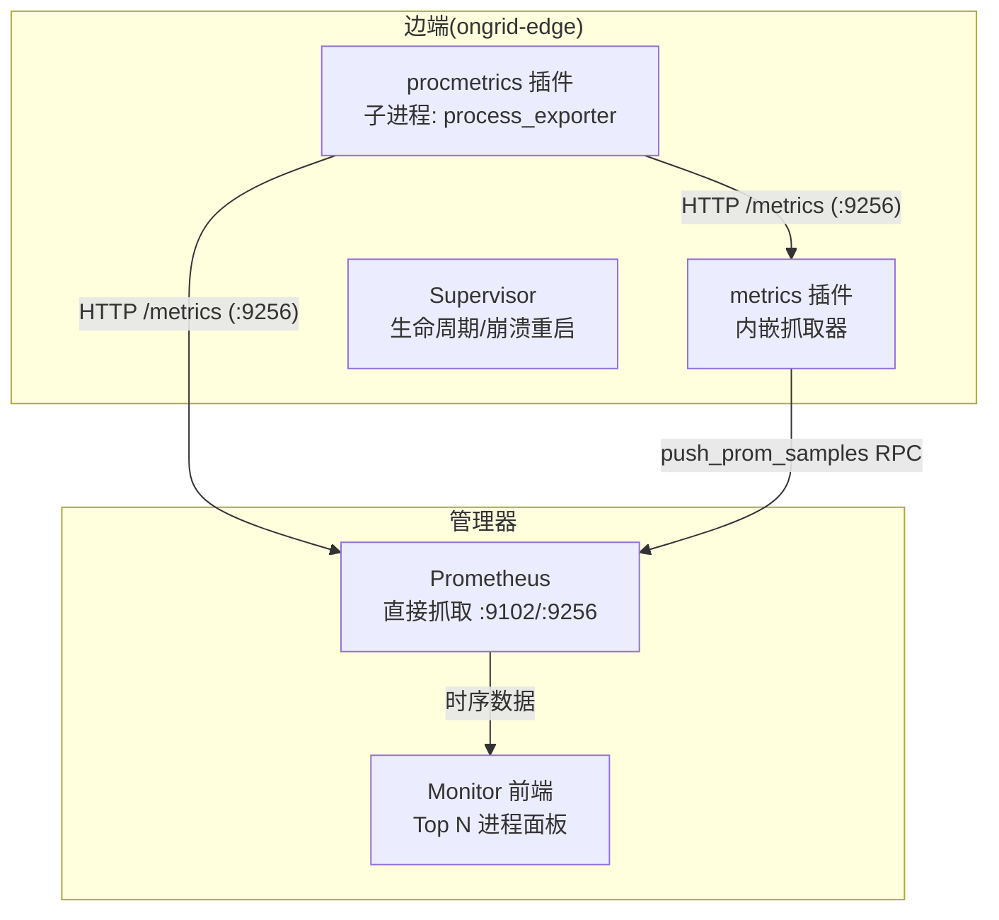
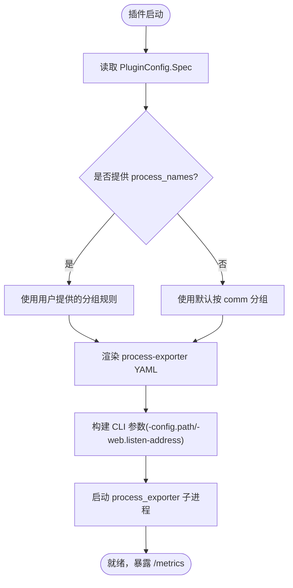
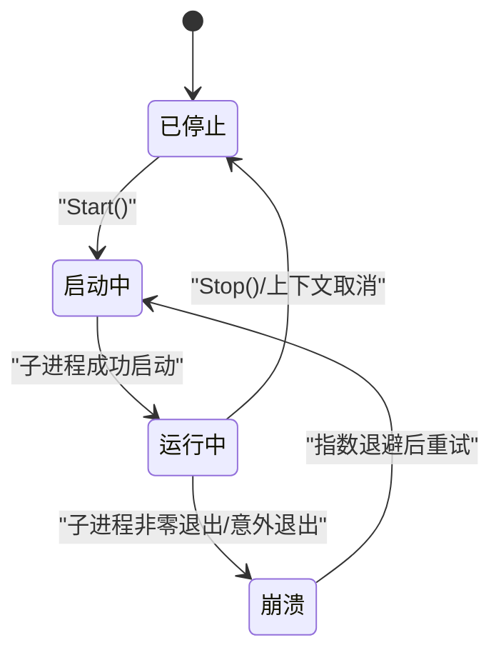
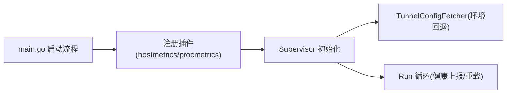

# 进程监控插件

<cite>
**本文引用的文件**   
- [internal/edgeagent/plugins/procmetrics/plugin.go](file://internal/edgeagent/plugins/procmetrics/plugin.go)
- [internal/edgeagent/plugins/subprocess.go](file://internal/edgeagent/plugins/subprocess.go)
- [internal/edgeagent/plugins/plugin.go](file://internal/edgeagent/plugins/plugin.go)
- [cmd/ongrid-edge/main.go](file://cmd/ongrid-edge/main.go)
- [internal/edgeagent/plugins/metrics/scrape.go](file://internal/edgeagent/plugins/metrics/scrape.go)
- [web/src/components/monitor/ProcessTopPanel.tsx](file://web/src/components/monitor/ProcessTopPanel.tsx)
- [internal/manager/biz/edge/plugin_config.go](file://internal/manager/biz/edge/plugin_config.go)
- [internal/edgeagent/collector/scrape_config.example.yaml](file://internal/edgeagent/collector/scrape_config.example.yaml)
</cite>

## 目录
1. [简介](#简介)
2. [项目结构](#项目结构)
3. [核心组件](#核心组件)
4. [架构总览](#架构总览)
5. [详细组件分析](#详细组件分析)
6. [依赖关系分析](#依赖关系分析)
7. [性能与容量规划](#性能与容量规划)
8. [故障排查指南](#故障排查指南)
9. [结论](#结论)
10. [附录：配置与使用示例](#附录配置与使用示例)

## 简介
本文件面向运维人员，系统化说明“进程监控插件”的实现原理、功能特性与使用方法。该插件在边端以子进程方式运行 process-exporter，按 comm 或命令行正则将进程分组，暴露 per-process 指标（如 CPU、内存、句柄、网络连接等），并通过 Prometheus 标准 /metrics 接口输出。管理器侧可通过内置的 metrics 插件拉取这些指标并推送至后端存储；前端 Monitor 页面提供“Top N 进程”时间线面板，直接基于 PromQL 查询 process-exporter 系列进行可视化。

## 项目结构
- 边端插件运行时负责统一生命周期管理（配置渲染、启动、崩溃重启、健康上报）。
- procmetrics 插件封装 process-exporter 子进程，默认监听 :9256，支持通过 Spec 自定义 listen_address 和 process_names 分组规则。
- 内置 metrics 插件默认同时拉取 node_exporter(:9102) 与 process_exporter(:9256)，也可按需替换为 scrape 模式下的外部配置文件。
- 前端 ProcessTopPanel 通过 PromQL 直接查询 namedprocess_namegroup_* 系列，展示 Top N 进程趋势。



图表来源
- [internal/edgeagent/plugins/procmetrics/plugin.go:32-42](file://internal/edgeagent/plugins/procmetrics/plugin.go#L32-L42)
- [internal/edgeagent/plugins/metrics/scrape.go:46-49](file://internal/edgeagent/plugins/metrics/scrape.go#L46-L49)
- [cmd/ongrid-edge/main.go:230-236](file://cmd/ongrid-edge/main.go#L230-L236)
- [web/src/components/monitor/ProcessTopPanel.tsx:1-10](file://web/src/components/monitor/ProcessTopPanel.tsx#L1-L10)

章节来源
- [cmd/ongrid-edge/main.go:230-236](file://cmd/ongrid-edge/main.go#L230-L236)
- [internal/edgeagent/plugins/procmetrics/plugin.go:32-42](file://internal/edgeagent/plugins/procmetrics/plugin.go#L32-L42)
- [internal/edgeagent/plugins/metrics/scrape.go:46-49](file://internal/edgeagent/plugins/metrics/scrape.go#L46-L49)
- [web/src/components/monitor/ProcessTopPanel.tsx:1-10](file://web/src/components/monitor/ProcessTopPanel.tsx#L1-L10)

## 核心组件
- 插件接口与状态模型：定义统一的 Configure/Start/Stop/HealthSnapshot 生命周期与健康上报结构。
- 子进程插件框架：封装二进制路径、工作目录、配置渲染、参数构建、崩溃指数退避重启、日志落盘等。
- procmetrics 插件：包装 process-exporter，生成 process-exporter YAML 配置，设置监听地址与进程分组规则。
- metrics 插件：默认同时抓取本机 node_exporter 与 process_exporter，或将 URL 列表作为目标源，解析并推送样本。
- 前端面板：基于 PromQL 直接查询 process-exporter 指标，展示 Top N 进程。

章节来源
- [internal/edgeagent/plugins/plugin.go:25-106](file://internal/edgeagent/plugins/plugin.go#L25-L106)
- [internal/edgeagent/plugins/subprocess.go:32-102](file://internal/edgeagent/plugins/subprocess.go#L32-L102)
- [internal/edgeagent/plugins/procmetrics/plugin.go:26-42](file://internal/edgeagent/plugins/procmetrics/plugin.go#L26-L42)
- [internal/edgeagent/plugins/metrics/scrape.go:23-49](file://internal/edgeagent/plugins/metrics/scrape.go#L23-L49)
- [web/src/components/monitor/ProcessTopPanel.tsx:1-10](file://web/src/components/monitor/ProcessTopPanel.tsx#L1-L10)

## 架构总览
进程监控插件采用“子进程 + 标准指标协议”的解耦设计：
- 边端 ongrid-edge 通过 Supervisor 管理插件生命周期。
- procmetrics 插件以子进程方式运行 process-exporter，暴露 /metrics。
- 管理器侧 Prometheus 可直接抓取 process-exporter 指标；同时边端 metrics 插件也支持主动抓取并推送到后端。
- 前端通过 PromQL 直接查询过程级指标，形成“Top N 进程”时间线视图。

```mermaid
sequenceDiagram
participant Edge as "边端 ongrid-edge"
participant Sup as "Supervisor"
participant Proc as "procmetrics 插件"
subgraph "子进程"
PE as "process_exporter"
end
participant Prom as "Prometheus"
participant Front as "Monitor 前端"
Edge->>Sup : 注册插件(procmetrics, hostmetrics, ...)
Sup->>Proc : Configure(Spec)
Proc->>Proc : 渲染 process-exporter YAML
Sup->>Proc : Start()
Proc->>PE : 启动子进程(带 -config.path/-web.listen-address)
Prom->>PE : GET /metrics( : 9256)
Front->>Prom : PromQL(namedprocess_namegroup_*)
Prom-->>Front : 时序结果
```

图表来源
- [cmd/ongrid-edge/main.go:230-236](file://cmd/ongrid-edge/main.go#L230-L236)
- [internal/edgeagent/plugins/procmetrics/plugin.go:68-114](file://internal/edgeagent/plugins/procmetrics/plugin.go#L68-L114)
- [internal/edgeagent/plugins/subprocess.go:137-156](file://internal/edgeagent/plugins/subprocess.go#L137-L156)
- [web/src/components/monitor/ProcessTopPanel.tsx:1-10](file://web/src/components/monitor/ProcessTopPanel.tsx#L1-L10)

## 详细组件分析

### 进程发现与分组
- 默认策略：按内核 comm（16 字符）对可见进程进行 catch-all 分组，保证新装 edge 在未收到 manager 推送时也能产出可用序列。
- 自定义策略：通过 Spec.process_names 传入 process-exporter 匹配规则（name + cmdline 正则），由插件原样透传到渲染后的 YAML。
- 监听端口：默认 :9256，避免与主机指标端口冲突；可通过 Spec.listen_address 覆盖。



图表来源
- [internal/edgeagent/plugins/procmetrics/plugin.go:48-53](file://internal/edgeagent/plugins/procmetrics/plugin.go#L48-L53)
- [internal/edgeagent/plugins/procmetrics/plugin.go:68-101](file://internal/edgeagent/plugins/procmetrics/plugin.go#L68-L101)
- [internal/edgeagent/plugins/procmetrics/plugin.go:103-114](file://internal/edgeagent/plugins/procmetrics/plugin.go#L103-L114)

章节来源
- [internal/edgeagent/plugins/procmetrics/plugin.go:48-53](file://internal/edgeagent/plugins/procmetrics/plugin.go#L48-L53)
- [internal/edgeagent/plugins/procmetrics/plugin.go:68-114](file://internal/edgeagent/plugins/procmetrics/plugin.go#L68-L114)

### 资源使用监控与指标采集
- 指标来源：process-exporter 暴露的 namedprocess_namegroup_* 系列，包含 CPU、内存、文件句柄、网络连接等进程级指标。
- 采集方式一（推荐）：管理器侧 Prometheus 直接抓取 process-exporter :9256/metrics。
- 采集方式二（兼容）：边端 metrics 插件默认同时抓取 :9102 与 :9256，并将样本通过 push_prom_samples 推送至后端。
- 前端展示：Monitor 页面的“Top N 进程”面板直接基于 PromQL 查询 namedprocess_namegroup_* 系列。

章节来源
- [internal/edgeagent/plugins/metrics/scrape.go:46-49](file://internal/edgeagent/plugins/metrics/scrape.go#L46-L49)
- [web/src/components/monitor/ProcessTopPanel.tsx:1-10](file://web/src/components/monitor/ProcessTopPanel.tsx#L1-L10)

### 异常检测与自动重启
- 子进程崩溃检测：当 process_exporter 非零退出或意外退出，Supervisor 将其标记为 crashed，记录 LastError 并递增 RestartCount。
- 自动重启策略：指数退避（1s→2s→4s…上限 5min），直到被显式停止或配置变更重新启用。
- 健康上报：Supervisor 周期性收集各插件 HealthSnapshot（含 PID、StartedAt、UpdatedAt、Targets 等），随心跳上报给管理器。



图表来源
- [internal/edgeagent/plugins/subprocess.go:197-235](file://internal/edgeagent/plugins/subprocess.go#L197-L235)
- [internal/edgeagent/plugins/subprocess.go:289-311](file://internal/edgeagent/plugins/subprocess.go#L289-L311)
- [internal/edgeagent/plugins/plugin.go:71-106](file://internal/edgeagent/plugins/plugin.go#L71-L106)

章节来源
- [internal/edgeagent/plugins/subprocess.go:197-235](file://internal/edgeagent/plugins/subprocess.go#L197-L235)
- [internal/edgeagent/plugins/subprocess.go:289-311](file://internal/edgeagent/plugins/subprocess.go#L289-L311)
- [internal/edgeagent/plugins/plugin.go:71-106](file://internal/edgeagent/plugins/plugin.go#L71-L106)

### 进程过滤规则与自定义监控策略
- 过滤规则：通过 Spec.process_names 指定 name 与 cmdline 正则，实现进程分组与过滤。
- 监听地址：通过 Spec.listen_address 调整 process-exporter 监听端口，避免冲突。
- 多目标抓取：metrics 插件支持 target_urls/target_url 与 extra_labels/source_label 等选项，便于扩展更多 exporter。

章节来源
- [internal/edgeagent/plugins/procmetrics/plugin.go:68-114](file://internal/edgeagent/plugins/procmetrics/plugin.go#L68-L114)
- [internal/edgeagent/plugins/metrics/scrape.go:64-133](file://internal/edgeagent/plugins/metrics/scrape.go#L64-L133)

### 健康检查与可观测性
- 边端健康：Supervisor 定期汇总插件健康快照，包括状态、错误信息、重启次数、PID、时间戳等。
- 管理器健康：系统健康检查 API 聚合平台自检项，辅助定位问题。
- 前端诊断：ProcessTopPanel 在无数据时会提示可能原因（如缺少 process_exporter 二进制），指导重跑安装脚本或在 Plugins 界面检查状态。

章节来源
- [internal/edgeagent/plugins/plugin.go:81-106](file://internal/edgeagent/plugins/plugin.go#L81-L106)
- [web/src/components/monitor/ProcessTopPanel.tsx:163-174](file://web/src/components/monitor/ProcessTopPanel.tsx#L163-L174)

## 依赖关系分析
- 插件注册：主程序在启动时注册 hostmetrics 与 procmetrics 插件，并创建 Supervisor 与 Tunnel 配置拉取器。
- 配置来源：Tunnel 驱动的配置拉取优先，隧道不可用时回退到环境变量，确保插件在断网期间仍可运行。
- 端口约定：hostmetrics 默认 :9102，procmetrics 默认 :9256，避免端口冲突。



图表来源
- [cmd/ongrid-edge/main.go:230-236](file://cmd/ongrid-edge/main.go#L230-L236)
- [cmd/ongrid-edge/main.go:242-252](file://cmd/ongrid-edge/main.go#L242-L252)
- [internal/manager/biz/edge/plugin_config.go:107-108](file://internal/manager/biz/edge/plugin_config.go#L107-L108)

章节来源
- [cmd/ongrid-edge/main.go:230-236](file://cmd/ongrid-edge/main.go#L230-L236)
- [cmd/ongrid-edge/main.go:242-252](file://cmd/ongrid-edge/main.go#L242-L252)
- [internal/manager/biz/edge/plugin_config.go:107-108](file://internal/manager/biz/edge/plugin_config.go#L107-L108)

## 性能与容量规划
- 抓取间隔与超时：metrics 插件默认抓取间隔 15s、超时 5s；建议根据业务规模调优，避免超时超过间隔导致重叠抓取。
- 进程分组基数：process_names 的正则组合会直接影响指标基数，建议仅对关键进程组开启精细分组，避免高基数导致存储压力。
- 端口与并发：process-exporter 默认单实例监听单一端口，避免在同一设备重复启动造成端口冲突。
- 磁盘与日志：子进程日志写入工作目录，注意磁盘空间与轮转策略。

[本节为通用指导，不直接分析具体文件]

## 故障排查指南
- 无进程数据
  - 现象：Monitor “Top N 进程”面板显示无数据。
  - 可能原因：process_exporter 二进制缺失或 procmetrics 未启用。
  - 处理：在设备上重跑最新安装脚本，或在「设备 → Plugins」检查 procmetrics 状态。
- 子进程频繁重启
  - 现象：插件健康状态为 crashed，RestartCount 持续增加。
  - 处理：查看插件日志与工作目录日志，确认 process-exporter 配置是否正确、端口是否冲突。
- 指标未被采集
  - 现象：Prometheus 未看到 namedprocess_namegroup_* 系列。
  - 处理：确认 :9256 可达；若使用 metrics 插件抓取，检查 target_urls 与网络连通性。

章节来源
- [web/src/components/monitor/ProcessTopPanel.tsx:163-174](file://web/src/components/monitor/ProcessTopPanel.tsx#L163-L174)
- [internal/edgeagent/plugins/subprocess.go:197-235](file://internal/edgeagent/plugins/subprocess.go#L197-L235)
- [internal/edgeagent/plugins/metrics/scrape.go:64-133](file://internal/edgeagent/plugins/metrics/scrape.go#L64-L133)

## 结论
进程监控插件通过轻量化的子进程方案与标准指标协议，实现了高效的进程级可观测能力。结合管理器侧 Prometheus 的直接抓取与边端 metrics 插件的灵活抓取，既能满足日常监控需求，又具备良好扩展性。配合前端“Top N 进程”面板与完善的健康上报机制，运维人员可以快速定位异常进程并进行处置。

[本节为总结性内容，不直接分析具体文件]

## 附录：配置与使用示例

### 基本配置（procmetrics）
- 监听地址：通过 Spec.listen_address 指定（默认 :9256）。
- 进程分组：通过 Spec.process_names 传入 process-exporter 匹配规则（name + cmdline 正则）。
- 默认行为：未提供 process_names 时，按 comm 进行 catch-all 分组。

章节来源
- [internal/edgeagent/plugins/procmetrics/plugin.go:68-114](file://internal/edgeagent/plugins/procmetrics/plugin.go#L68-L114)

### 应用进程监控场景
- 目标：针对特定应用进程（如 nginx、java）进行精细化分组与监控。
- 方法：在 Spec.process_names 中添加对应正则规则，仅保留关键进程组，降低基数。
- 验证：在 Prometheus 中查询 namedprocess_namegroup_* 系列，确认标签与指标符合预期。

章节来源
- [internal/edgeagent/plugins/procmetrics/plugin.go:48-53](file://internal/edgeagent/plugins/procmetrics/plugin.go#L48-L53)
- [web/src/components/monitor/ProcessTopPanel.tsx:1-10](file://web/src/components/monitor/ProcessTopPanel.tsx#L1-L10)

### 资源限制场景
- 目标：在高基数环境下控制指标数量，避免存储压力。
- 方法：精简 process_names 规则，仅对热点进程组启用；必要时调整抓取间隔。
- 监控：关注 Prometheus 的 cardinality 与存储增长曲线，结合告警阈值进行容量预警。

[本节为通用指导，不直接分析具体文件]

### 进程崩溃检测与自动重启
- 机制：子进程非零退出或意外退出即触发崩溃态，Supervisor 指数退避重启。
- 观察：通过插件健康快照查看 State、LastError、RestartCount、PID、StartedAt、UpdatedAt。
- 恢复：修正配置或修复二进制后，插件将自动恢复运行。

章节来源
- [internal/edgeagent/plugins/subprocess.go:197-235](file://internal/edgeagent/plugins/subprocess.go#L197-L235)
- [internal/edgeagent/plugins/plugin.go:81-106](file://internal/edgeagent/plugins/plugin.go#L81-L106)

### 健康检查与集成
- 边端健康：Supervisor 周期上报插件健康快照，供管理器与前端展示。
- 管理器健康：系统健康检查 API 聚合平台自检项，辅助整体健康评估。
- 前端面板：Monitor 页面直接基于 PromQL 展示进程级指标，无需额外缓冲层。

章节来源
- [internal/edgeagent/plugins/plugin.go:81-106](file://internal/edgeagent/plugins/plugin.go#L81-L106)
- [web/src/components/monitor/ProcessTopPanel.tsx:1-10](file://web/src/components/monitor/ProcessTopPanel.tsx#L1-L10)

### 抓取模式与示例配置
- 默认抓取：metrics 插件默认同时抓取 :9102 与 :9256。
- 自定义抓取：通过 Spec.target_urls 或 Spec.target_url 指定目标；支持 bearer_token、tls_insecure、extra_labels、source_label 等。
- scrape 模式：使用外部 scrape 配置文件，适合更复杂的采集拓扑。

章节来源
- [internal/edgeagent/plugins/metrics/scrape.go:46-49](file://internal/edgeagent/plugins/metrics/scrape.go#L46-L49)
- [internal/edgeagent/plugins/metrics/scrape.go:64-133](file://internal/edgeagent/plugins/metrics/scrape.go#L64-L133)
- [internal/edgeagent/collector/scrape_config.example.yaml:1-30](file://internal/edgeagent/collector/scrape_config.example.yaml#L1-L30)