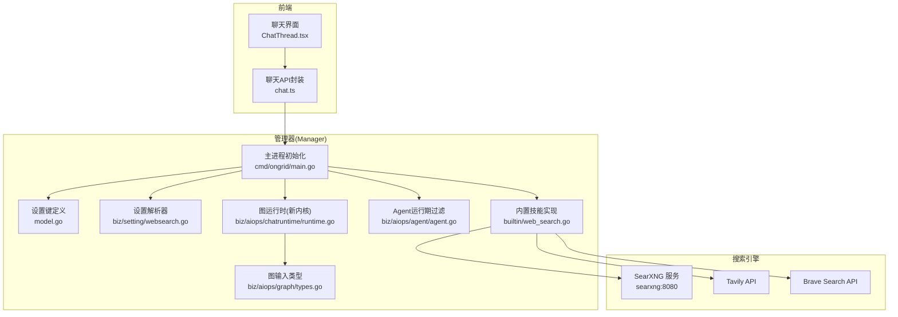
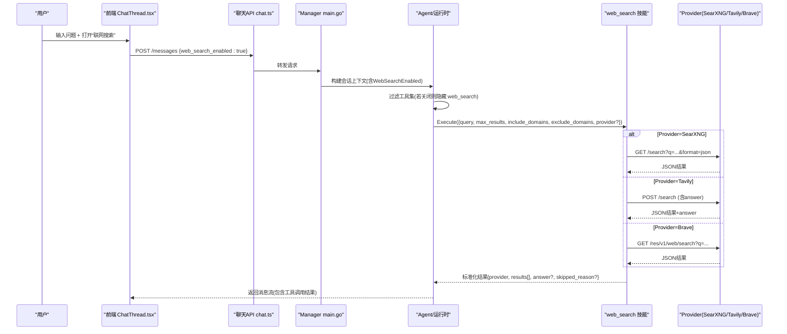
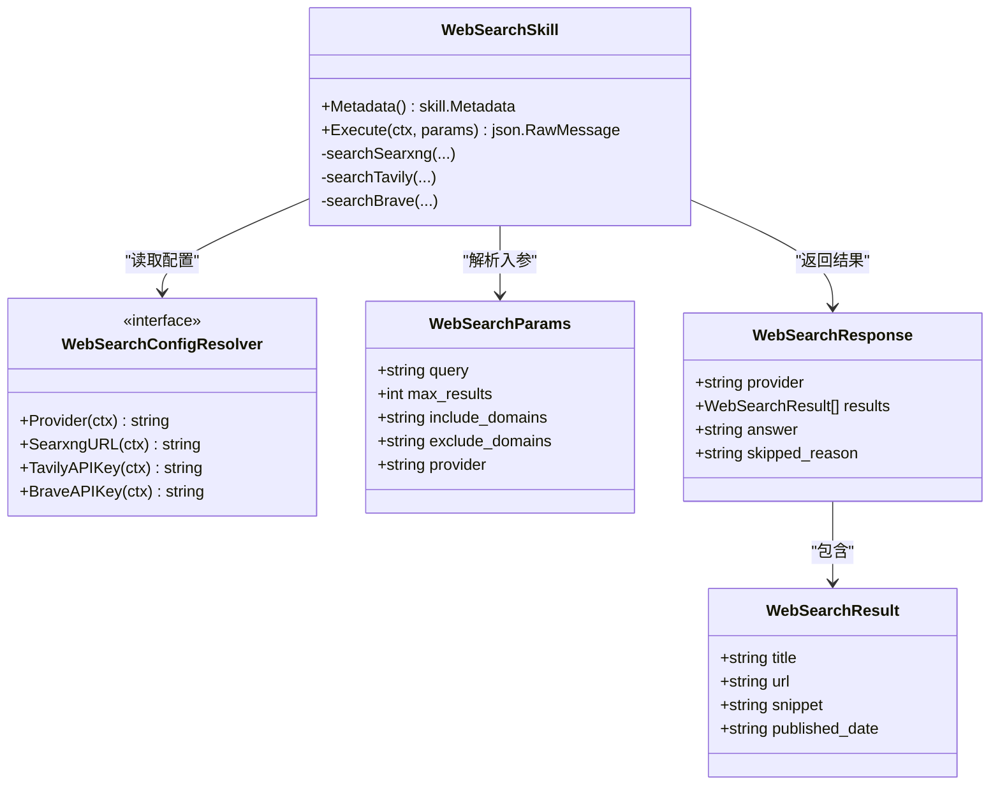
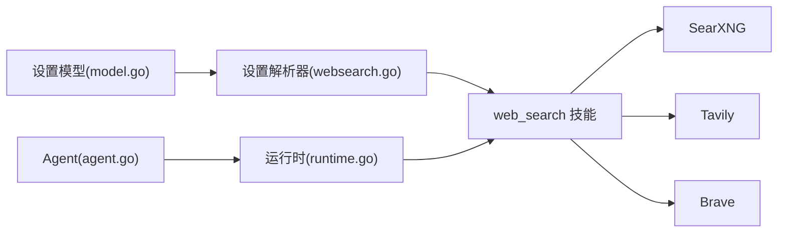

# Web搜索技能

<cite>
**本文引用的文件**   
- [web_search.go](file://internal/skill/builtin/web_search.go)
- [model.go](file://internal/manager/model/setting/model.go)
- [websearch.go](file://internal/manager/biz/setting/websearch.go)
- [main.go](file://cmd/ongrid/main.go)
- [agent.go](file://internal/manager/biz/aiops/agent/agent.go)
- [runtime.go](file://internal/manager/biz/aiops/chatruntime/runtime.go)
- [types.go](file://internal/manager/biz/aiops/graph/types.go)
- [chat.ts](file://web/src/api/chat.ts)
- [ChatThread.tsx](file://web/src/pages/ChatThread.tsx)
- [settings.yml](file://deploy/searxng/settings.yml)
</cite>

## 目录
1. [简介](#简介)
2. [项目结构](#项目结构)
3. [核心组件](#核心组件)
4. [架构总览](#架构总览)
5. [详细组件分析](#详细组件分析)
6. [依赖关系分析](#依赖关系分析)
7. [性能与可用性](#性能与可用性)
8. [故障排查指南](#故障排查指南)
9. [结论](#结论)
10. [附录：使用示例与最佳实践](#附录使用示例与最佳实践)

## 简介
本文件面向AI助手、自动化流程与平台使用者，系统化说明“联网搜索”技能的集成方式、搜索策略、参数配置、结果处理与输出格式，并提供面向生产环境的排障与优化建议。该技能支持三种后端：
- SearXNG（默认，自托管、零密钥）
- Tavily（商业API，需密钥）
- Brave Search（商业API，需密钥）

通过系统设置动态选择Provider，并在Agent会话中按开关控制是否暴露给模型调用，从而在“内部数据优先”的前提下按需扩展外部知识检索能力。

## 项目结构
Web搜索技能位于内置技能集合中，由Manager进程启动时注册并注入到工具包；Agent运行时根据会话选项决定是否向LLM暴露该工具的Schema与执行权限。前端提供“联网搜索”开关以控制每次对话的可见性与可调用性。

图表来源
- [main.go:461-470](file://cmd/ongrid/main.go#L461-L470)
- [model.go:189-229](file://internal/manager/model/setting/model.go#L189-L229)
- [websearch.go:1-94](file://internal/manager/biz/setting/websearch.go#L1-L94)
- [web_search.go:1-195](file://internal/skill/builtin/web_search.go#L1-L195)
- [agent.go:180-206](file://internal/manager/biz/aiops/agent/agent.go#L180-L206)
- [runtime.go:150-173](file://internal/manager/biz/aiops/chatruntime/runtime.go#L150-L173)
- [types.go:60-108](file://internal/manager/biz/aiops/graph/types.go#L60-L108)

章节来源
- [main.go:461-470](file://cmd/ongrid/main.go#L461-L470)
- [model.go:189-229](file://internal/manager/model/setting/model.go#L189-L229)
- [websearch.go:1-94](file://internal/manager/biz/setting/websearch.go#L1-L94)
- [web_search.go:1-195](file://internal/skill/builtin/web_search.go#L1-L195)
- [agent.go:180-206](file://internal/manager/biz/aiops/agent/agent.go#L180-L206)
- [runtime.go:150-173](file://internal/manager/biz/aiops/chatruntime/runtime.go#L150-L173)
- [types.go:60-108](file://internal/manager/biz/aiops/graph/types.go#L60-L108)

## 核心组件
- 内置技能实现：负责统一参数解析、Provider路由、HTTP请求、响应归一化与错误包装。
- 设置模型与解析器：定义Provider选择与每Provider配置项，提供只读读取路径。
- Agent与运行时：控制工具Schema对模型的可见性与执行门控。
- 前端开关：将“联网搜索”开关透传到服务端，影响当次会话的工具集。

章节来源
- [web_search.go:150-195](file://internal/skill/builtin/web_search.go#L150-L195)
- [model.go:189-229](file://internal/manager/model/setting/model.go#L189-L229)
- [websearch.go:40-94](file://internal/manager/biz/setting/websearch.go#L40-L94)
- [agent.go:180-206](file://internal/manager/biz/aiops/agent/agent.go#L180-L206)
- [runtime.go:150-173](file://internal/manager/biz/aiops/chatruntime/runtime.go#L150-L173)
- [types.go:60-108](file://internal/manager/biz/aiops/graph/types.go#L60-L108)

## 架构总览
下图展示一次“联网搜索”从前端到后端的完整调用链，以及Provider分发与结果归一化的关键节点。

图表来源
- [ChatThread.tsx:77-80](file://web/src/pages/ChatThread.tsx#L77-L80)
- [chat.ts:151-160](file://web/src/api/chat.ts#L151-L160)
- [main.go:2250-2258](file://cmd/ongrid/main.go#L2250-L2258)
- [agent.go:360-370](file://internal/manager/biz/aiops/agent/agent.go#L360-L370)
- [web_search.go:225-283](file://internal/skill/builtin/web_search.go#L225-L283)

## 详细组件分析

### 内置技能：web_search
- 职责
  - 解析入参：query、max_results、include/exclude_domains、provider
  - Provider选择优先级：显式传入 > 系统设置 > 默认SearXNG
  - 调用具体Provider并归一化为统一结果结构
  - 对不可用/未配置场景返回skipped_reason而非抛出错误，便于上层提示修复
- 关键数据结构
  - 输入参数对象：包含查询、数量限制、域名过滤、强制Provider
  - 输出结果对象：包含provider、results[]、可选answer、可选skipped_reason
- 行为要点
  - max_results范围限制为1~10，默认5
  - include/exclude_domains仅Tavily生效
  - SearXNG默认地址来自Docker内部网络，可通过设置覆盖
  - 所有HTTP客户端超时默认30s

图表来源
- [web_search.go:150-224](file://internal/skill/builtin/web_search.go#L150-L224)
- [web_search.go:197-223](file://internal/skill/builtin/web_search.go#L197-L223)

章节来源
- [web_search.go:150-283](file://internal/skill/builtin/web_search.go#L150-L283)
- [web_search.go:285-374](file://internal/skill/builtin/web_search.go#L285-L374)
- [web_search.go:389-478](file://internal/skill/builtin/web_search.go#L389-L478)
- [web_search.go:480-558](file://internal/skill/builtin/web_search.go#L480-L558)

### 设置模型与解析器
- 设置键（CategoryWebSearch下）
  - provider：选择“searxng”|“tavily”|“brave”，空值回退到“searxng”
  - searxng_url：SearXNG实例地址，留空使用默认
  - tavily_api_key：Tavily密钥
  - brave_api_key：Brave密钥
- 解析器逻辑
  - Provider选择：显式设置优先；否则回退到“searxng”
  - URL/密钥读取：trim空白，缺失返回空串或默认值

章节来源
- [model.go:189-229](file://internal/manager/model/setting/model.go#L189-L229)
- [websearch.go:40-94](file://internal/manager/biz/setting/websearch.go#L40-L94)

### 运行时与Agent门控
- Agent侧
  - RunOptions.WebSearchEnabled：控制本次会话是否向模型暴露web_search工具Schema与执行权
  - 若关闭，则在工具Schema列表与执行阶段均屏蔽web_search
- 图运行时
  - Request/WebSearchEnabled字段贯穿至图输入，用于生成系统提醒与一致性校验
- 前端
  - 聊天页面维护本地状态，发送请求时将web_search_enabled透传

章节来源
- [agent.go:180-206](file://internal/manager/biz/aiops/agent/agent.go#L180-L206)
- [agent.go:360-370](file://internal/manager/biz/aiops/agent/agent.go#L360-L370)
- [runtime.go:150-173](file://internal/manager/biz/aiops/chatruntime/runtime.go#L150-L173)
- [types.go:60-108](file://internal/manager/biz/aiops/graph/types.go#L60-L108)
- [chat.ts:151-160](file://web/src/api/chat.ts#L151-L160)
- [ChatThread.tsx:77-80](file://web/src/pages/ChatThread.tsx#L77-L80)

### 启动装配与默认值
- 启动时写入默认Provider与SearXNG地址（若不存在）
- 将WebSearchResolver注入到内置技能，使其能读取系统设置
- 将web_search作为内置工具注册到工具包

章节来源
- [main.go:461-470](file://cmd/ongrid/main.go#L461-L470)
- [main.go:2250-2258](file://cmd/ongrid/main.go#L2250-L2258)

## 依赖关系分析
- 层间依赖
  - 内置技能不直接依赖Manager业务层，通过接口WebSearchConfigResolver解耦
  - Manager侧biz/setting实现该接口，读取system_settings
  - Agent/运行时仅在会话层控制工具可见性，不参与具体搜索逻辑
- 外部依赖
  - SearXNG：容器内服务，默认http://searxng:8080
  - Tavily/Brave：第三方REST API，需要密钥

图表来源
- [model.go:189-229](file://internal/manager/model/setting/model.go#L189-L229)
- [websearch.go:1-94](file://internal/manager/biz/setting/websearch.go#L1-L94)
- [web_search.go:150-195](file://internal/skill/builtin/web_search.go#L150-L195)
- [runtime.go:150-173](file://internal/manager/biz/aiops/chatruntime/runtime.go#L150-L173)
- [agent.go:180-206](file://internal/manager/biz/aiops/agent/agent.go#L180-L206)

## 性能与可用性
- 超时与限流
  - HTTP客户端默认超时30s，避免长尾阻塞
  - 建议在生产环境结合网关/代理层做重试与熔断
- 结果大小
  - 响应体限制读取上限，防止大响应拖慢链路
- Provider选择
  - 默认SearXNG无配额限制，适合日常使用
  - 商业Provider具备免费额度，注意用量监控与告警
- 并发与缓存
  - 设置解析器通常带缓存，避免频繁DB访问
  - 建议在高频调用场景增加本地短TTL缓存（如适用）

[本节为通用指导，无需代码引用]

## 故障排查指南
- SearXNG不可达
  - 现象：返回skipped_reason提示不可达
  - 排查：确认docker-compose已拉起searxng服务；检查DNS与端口；必要时在设置中切换Provider
- 商业Provider未配置密钥
  - 现象：返回skipped_reason提示未配置key
  - 排查：在设置中填入对应API Key并保存；验证网络可达与配额
- 搜索结果异常
  - 现象：返回非2xx状态码
  - 排查：查看返回摘要；检查Provider健康与鉴权；必要时切换Provider临时恢复
- 前端开关无效
  - 现象：开启后仍无法调用web_search
  - 排查：确认请求体包含web_search_enabled=true；检查Agent/运行时是否正确传递

章节来源
- [web_search.go:326-351](file://internal/skill/builtin/web_search.go#L326-L351)
- [web_search.go:402-408](file://internal/skill/builtin/web_search.go#L402-L408)
- [web_search.go:496-502](file://internal/skill/builtin/web_search.go#L496-L502)
- [chat.ts:151-160](file://web/src/api/chat.ts#L151-L160)
- [ChatThread.tsx:77-80](file://web/src/pages/ChatThread.tsx#L77-L80)

## 结论
Web搜索技能以“默认可用、按需启用”为原则，通过系统设置灵活选择Provider，并通过Agent/运行时门控确保模型仅在必要时访问公网。统一的响应结构与清晰的错误提示，使上层应用与自动化流程能够稳定消费搜索结果并进行二次加工。

[本节为总结，无需代码引用]

## 附录：使用示例与最佳实践

### 参数配置清单
- 必填
  - query：自然语言或精确关键词
- 可选
  - max_results：1~10，默认5
  - include_domains：逗号分隔，仅Tavily有效
  - exclude_domains：逗号分隔，仅Tavily有效
  - provider：强制指定“searxng”|“tavily”|“brave”，留空走系统设置

章节来源
- [web_search.go:170-195](file://internal/skill/builtin/web_search.go#L170-L195)

### 搜索策略与结果处理
- 相关性排序
  - 由上游Provider决定；本技能保持原始顺序
- 内容摘要
  - 每个结果包含title、url、snippet；Tavily额外返回answer字段
- 链接提取
  - 直接从结果中取url字段即可

章节来源
- [web_search.go:205-223](file://internal/skill/builtin/web_search.go#L205-L223)
- [web_search.go:440-454](file://internal/skill/builtin/web_search.go#L440-L454)

### 典型用例
- 技术文档搜索
  - 使用query描述具体技术点，max_results设为5~10，provider默认SearXNG
- 故障解决方案查找
  - 在query中加入错误关键字与版本信息；必要时限定include_domains缩小范围（Tavily）
- 最佳实践检索
  - 使用更宽泛的关键词组合，适当提高max_results以获得更多候选

章节来源
- [web_search.go:170-195](file://internal/skill/builtin/web_search.go#L170-L195)

### AI助手与自动化集成指南
- 会话级开关
  - 前端通过web_search_enabled控制是否暴露web_search工具
  - 自动化流程可在构造请求时携带该字段，按需启用
- 结果验证方法
  - 检查返回provider是否为预期
  - 校验results长度与字段完整性
  - 若存在skipped_reason，应提示用户或自动切换Provider并重试

章节来源
- [chat.ts:151-160](file://web/src/api/chat.ts#L151-L160)
- [ChatThread.tsx:77-80](file://web/src/pages/ChatThread.tsx#L77-L80)
- [web_search.go:213-223](file://internal/skill/builtin/web_search.go#L213-L223)

### 部署与配置要点
- SearXNG
  - 默认监听http://searxng:8080，需在compose中启动
  - settings.yml需启用JSON输出格式以满足技能需求
- 商业Provider
  - 在设置中配置对应API Key；注意配额与费用

章节来源
- [main.go:461-470](file://cmd/ongrid/main.go#L461-L470)
- [settings.yml:40-60](file://deploy/searxng/settings.yml#L40-L60)