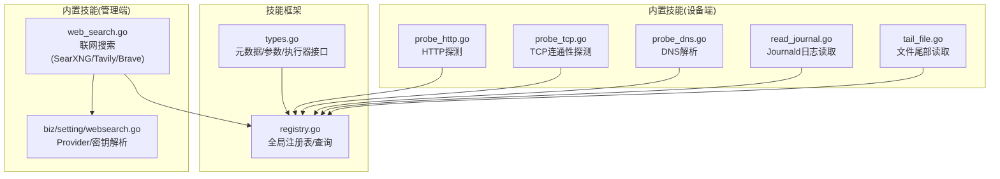
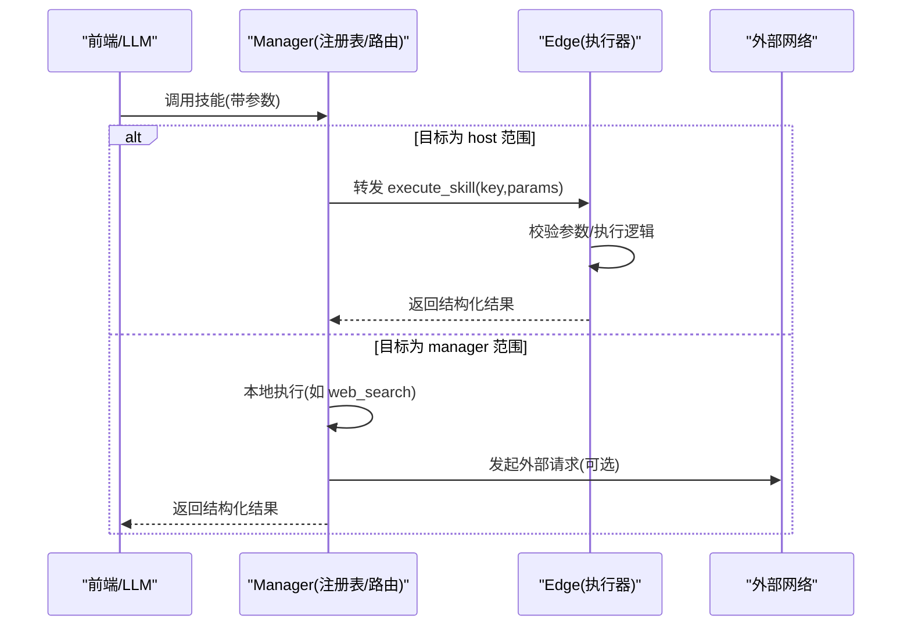
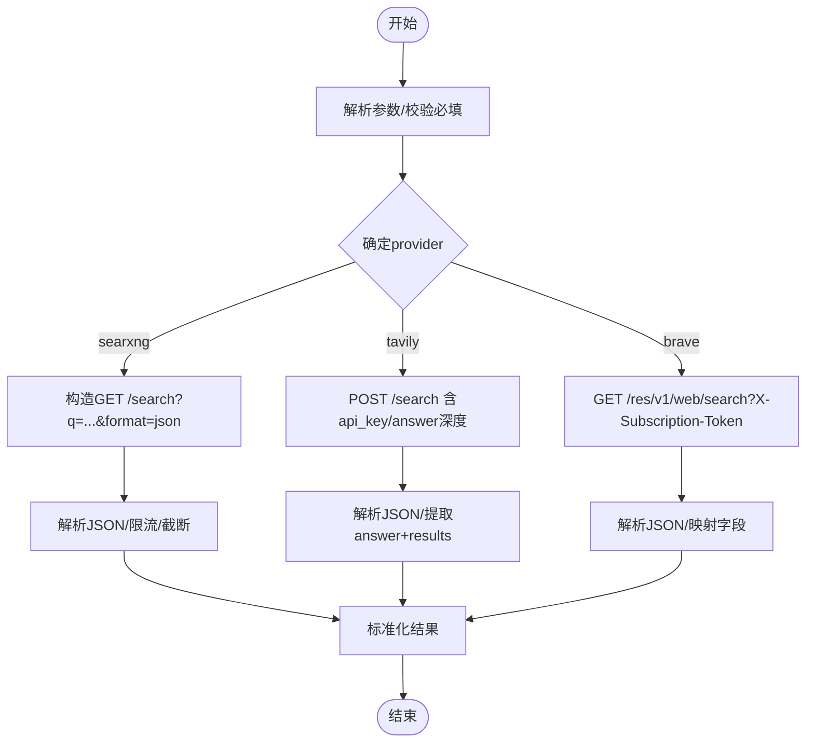
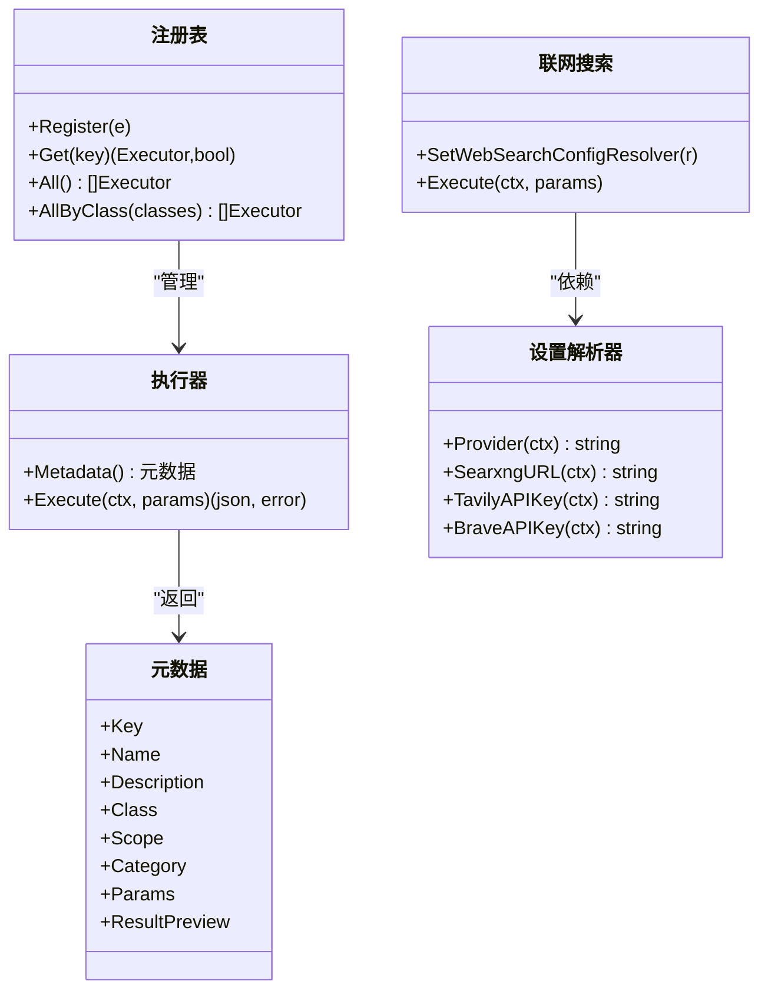

# 内置技能详解

<cite>
**本文引用的文件**
- [internal/skill/types.go](file://internal/skill/types.go)
- [internal/skill/registry.go](file://internal/skill/registry.go)
- [internal/skill/builtin/probe_http.go](file://internal/skill/builtin/probe_http.go)
- [internal/skill/builtin/probe_tcp.go](file://internal/skill/builtin/probe_tcp.go)
- [internal/skill/builtin/probe_dns.go](file://internal/skill/builtin/probe_dns.go)
- [internal/skill/builtin/read_journal.go](file://internal/skill/builtin/read_journal.go)
- [internal/skill/builtin/tail_file.go](file://internal/skill/builtin/tail_file.go)
- [internal/skill/builtin/web_search.go](file://internal/skill/builtin/web_search.go)
- [internal/manager/biz/setting/websearch.go](file://internal/manager/biz/setting/websearch.go)
</cite>

## 目录
1. [简介](#简介)
2. [项目结构](#项目结构)
3. [核心组件](#核心组件)
4. [架构总览](#架构总览)
5. [详细组件分析](#详细组件分析)
6. [依赖关系分析](#依赖关系分析)
7. [性能与容量规划](#性能与容量规划)
8. [故障排查指南](#故障排查指南)
9. [结论](#结论)
10. [附录：调用示例与错误处理](#附录调用示例与错误处理)

## 简介
本文件面向运维人员，系统化梳理 ongrid 的“内置技能”体系，覆盖网络探测（HTTP/TCP/DNS）、系统诊断（读取 journald、文件尾部跟踪）以及联网搜索三大类。文档从框架元数据、执行范围、权限分级出发，深入解释每个技能的工作原理、参数含义、输出格式、典型使用场景与错误处理策略，并提供可操作的调用示例与排障建议。

## 项目结构
- 技能框架位于 internal/skill，提供统一的注册、调度与元数据描述能力。
- 内置技能实现位于 internal/skill/builtin，按功能分文件组织。
- 联网搜索在 manager 侧运行，通过设置服务解析 provider 与密钥。

图表来源
- [internal/skill/types.go:1-241](file://internal/skill/types.go#L1-L241)
- [internal/skill/registry.go:1-127](file://internal/skill/registry.go#L1-L127)
- [internal/skill/builtin/probe_http.go:1-120](file://internal/skill/builtin/probe_http.go#L1-L120)
- [internal/skill/builtin/probe_tcp.go:1-83](file://internal/skill/builtin/probe_tcp.go#L1-L83)
- [internal/skill/builtin/probe_dns.go:1-85](file://internal/skill/builtin/probe_dns.go#L1-L85)
- [internal/skill/builtin/read_journal.go:1-112](file://internal/skill/builtin/read_journal.go#L1-L112)
- [internal/skill/builtin/tail_file.go:1-133](file://internal/skill/builtin/tail_file.go#L1-L133)
- [internal/skill/builtin/web_search.go:1-593](file://internal/skill/builtin/web_search.go#L1-L593)
- [internal/manager/biz/setting/websearch.go:1-94](file://internal/manager/biz/setting/websearch.go#L1-L94)

章节来源
- [internal/skill/types.go:1-241](file://internal/skill/types.go#L1-L241)
- [internal/skill/registry.go:1-127](file://internal/skill/registry.go#L1-L127)

## 核心组件
- 元数据与参数模型
  - 元数据包含键名、名称、描述、权限等级、执行范围、分类、参数模式与结果预览等。
  - 参数支持 string/int/float/bool/duration/enum/array 等类型，并支持默认值与必填约束。
- 执行器接口
  - 每个技能实现一个执行器，暴露 Metadata() 与 Execute(ctx, params)。
  - 可选 RawSchemaProvider 用于自定义 JSON Schema。
- 注册表
  - 进程级全局注册表，启动时完成注册，运行时并发安全地查询与枚举。
- 权限与范围
  - 权限等级：safe/mutating/dangerous；默认 safe。
  - 执行范围：host（边缘设备）或 manager（管理端），影响是否需 edge_id 及外部访问能力。

章节来源
- [internal/skill/types.go:35-175](file://internal/skill/types.go#L35-L175)
- [internal/skill/types.go:190-224](file://internal/skill/types.go#L190-L224)
- [internal/skill/registry.go:10-127](file://internal/skill/registry.go#L10-L127)

## 架构总览
技能以“声明式元数据 + 执行器实现”的方式注册到全局注册表。Manager 侧根据元数据生成 LLM 工具定义与 HTTP API；Edge 侧通过统一 RPC 分发到对应 Key 的执行器。联网搜索为 manager 侧技能，直接访问外部搜索服务。

图表来源
- [internal/skill/types.go:47-61](file://internal/skill/types.go#L47-L61)
- [internal/skill/registry.go:31-74](file://internal/skill/registry.go#L31-L74)
- [internal/skill/builtin/web_search.go:228-283](file://internal/skill/builtin/web_search.go#L228-L283)

## 详细组件分析

### 网络探测技能

#### HTTP 探针(host_probe_http)
- 功能特性
  - 对指定 URL 发起 HEAD 或 GET 请求，返回状态码、延迟与内容长度。
  - TLS 证书校验关闭，便于探测内部自签证书服务。
- 适用场景
  - 快速验证 Web 服务可达性与响应质量。
  - 健康检查与拨测。
- 参数说明
  - url(string, 必填): 完整 URL。
  - method(enum, 默认HEAD): GET/HEAD。
  - timeout_ms(int, 默认5000): 请求超时毫秒。
- 输出字段
  - status_code(int), latency_ms(int64), content_length(int64), error?(string)。
- 关键行为
  - GET 会丢弃响应体但统计字节数；HEAD 直接使用 Content-Length。
  - 非 2xx 仍视为成功返回，错误信息写入 error 字段。
- 调用示例
  - 参数示例: {url:"https://example.com/health", method:"GET", timeout_ms:5000}
  - 预期返回: {status_code:200, latency_ms:42, content_length:1234}
- 错误处理
  - 参数缺失/非法将返回解码错误或提示。
  - 网络错误/超时会在 error 中记录，latency_ms 反映实际耗时。

章节来源
- [internal/skill/builtin/probe_http.go:24-47](file://internal/skill/builtin/probe_http.go#L24-L47)
- [internal/skill/builtin/probe_http.go:65-119](file://internal/skill/builtin/probe_http.go#L65-L119)

#### TCP 探针(host_probe_tcp)
- 功能特性
  - 对 host:port 发起单次 TCP 连接，立即关闭，返回连通性与延迟。
- 适用场景
  - 端口可达性检测、防火墙/ACL 连通性验证。
- 参数说明
  - target(string, 必填): 目标地址，形如 host:port。
  - timeout_ms(int, 默认3000): 拨号超时毫秒。
- 输出字段
  - ok(bool), latency_ms(int64), error?(string)。
- 调用示例
  - 参数示例: {target:"10.0.0.1:443", timeout_ms:3000}
  - 预期返回: {ok:true, latency_ms:12}
- 错误处理
  - 无法建立连接或超时：ok=false，error 携带底层错误文本。

章节来源
- [internal/skill/builtin/probe_tcp.go:20-39](file://internal/skill/builtin/probe_tcp.go#L20-L39)
- [internal/skill/builtin/probe_tcp.go:55-82](file://internal/skill/builtin/probe_tcp.go#L55-L82)

#### DNS 探针(host_probe_dns)
- 功能特性
  - 基于系统解析器进行 A/AAAA 解析，返回 IP 列表与延迟。
- 适用场景
  - 域名解析链路诊断、DNS 服务器可用性验证。
- 参数说明
  - host(string, 必填): 要解析的主机名。
  - timeout_ms(int, 默认3000): 解析超时毫秒。
- 输出字段
  - addrs([]string), latency_ms(int64), error?(string)。
- 调用示例
  - 参数示例: {host:"example.com", timeout_ms:3000}
  - 预期返回: {addrs:["93.184.216.34"], latency_ms:15}
- 错误处理
  - 解析失败或超时：error 携带错误信息，latency_ms 反映实际耗时。

章节来源
- [internal/skill/builtin/probe_dns.go:20-39](file://internal/skill/builtin/probe_dns.go#L20-L39)
- [internal/skill/builtin/probe_dns.go:55-84](file://internal/skill/builtin/probe_dns.go#L55-L84)

### 系统诊断技能

#### 读取 journald 日志(host_read_journal)
- 功能特性
  - 包装 journalctl 读取 systemd-journald 日志，仅 Linux 支持。
- 适用场景
  - 快速定位最近服务异常、系统事件回溯。
- 参数说明
  - unit(string, 可选): 过滤 systemd unit。
  - since(duration, 默认10m): 时间窗口，journalctl --since 语法。
  - lines(int, 默认200): 最大行数。
- 输出字段
  - lines([]string), total_lines(int), command(string), error?(string)。
- 调用示例
  - 参数示例: {unit:"ongrid-edge", since:"5m", lines:100}
  - 预期返回: {lines:[...], total_lines:100, command:"journalctl ..."}
- 错误处理
  - 非 Linux 平台：返回 error 提示不支持。
  - 命令执行失败：error 携带错误文本。

章节来源
- [internal/skill/builtin/read_journal.go:24-47](file://internal/skill/builtin/read_journal.go#L24-L47)
- [internal/skill/builtin/read_journal.go:65-111](file://internal/skill/builtin/read_journal.go#L65-L111)

#### 文件尾部跟踪(host_tail_file)
- 功能特性
  - 读取文件最后 N 行，类似 tail -n，限制最大读取字节数，防止大文件 OOM。
- 适用场景
  - 查看应用日志尾部、快速确认最新错误。
- 参数说明
  - path(string, 必填): 绝对路径，禁止包含 ..。
  - lines(int, 默认100): 返回行数。
  - max_bytes(int, 默认1MiB): 最多读取的尾部字节数。
- 输出字段
  - lines([]string), total_lines_returned(int), file_size(int64), truncated(bool), error?(string)。
- 调用示例
  - 参数示例: {path:"/var/log/app.log", lines:50, max_bytes:524288}
  - 预期返回: {lines:[...], total_lines_returned:50, truncated:false}
- 错误处理
  - 路径非绝对或包含 ..：拒绝访问。
  - 文件不存在/无权限：error 携带错误文本。

章节来源
- [internal/skill/builtin/tail_file.go:23-46](file://internal/skill/builtin/tail_file.go#L23-L46)
- [internal/skill/builtin/tail_file.go:64-132](file://internal/skill/builtin/tail_file.go#L64-L132)

### 联网搜索(web_search)
- 功能特性
  - 聚合多个搜索引擎后端：SearXNG（默认，无需密钥）、Tavily、Brave Search。
  - 返回标准化结果集，部分后端提供 AI 摘要 answer。
- 集成方式
  - 通过 WebSearchConfigResolver 动态获取 provider 与密钥；未配置时回退默认。
  - Manager 侧设置服务提供 Provider/SearxngURL/TavilyAPIKey/BraveAPIKey 的读取。
- 参数说明
  - query(string, 必填): 搜索关键词。
  - max_results(int, 默认5, 上限10): 返回结果数量。
  - include_domains(string, 可选): 限定域，逗号分隔（仅 Tavily）。
  - exclude_domains(string, 可选): 排除域（仅 Tavily）。
  - provider(enum, 可选): 强制选择 searxng/tavily/brave，留空走系统设置。
- 输出字段
  - provider(string), results[{title,url,snippet,published_date}], answer?(string), skipped_reason?(string)。
- 调用示例
  - 参数示例: {query:"Kubernetes 内存泄漏排查", max_results:5, provider:"searxng"}
  - 预期返回: {provider:"searxng", results:[...]}
- 错误处理
  - 未配置 provider 密钥：返回 skipped_reason 提示如何配置。
  - 不可达或返回非 2xx：SearXNG 返回 skipped_reason；其他后端返回错误。

图表来源
- [internal/skill/builtin/web_search.go:162-195](file://internal/skill/builtin/web_search.go#L162-L195)
- [internal/skill/builtin/web_search.go:228-283](file://internal/skill/builtin/web_search.go#L228-L283)
- [internal/skill/builtin/web_search.go:294-374](file://internal/skill/builtin/web_search.go#L294-L374)
- [internal/skill/builtin/web_search.go:391-455](file://internal/skill/builtin/web_search.go#L391-L455)
- [internal/skill/builtin/web_search.go:485-543](file://internal/skill/builtin/web_search.go#L485-L543)
- [internal/manager/biz/setting/websearch.go:54-93](file://internal/manager/biz/setting/websearch.go#L54-L93)

章节来源
- [internal/skill/builtin/web_search.go:162-195](file://internal/skill/builtin/web_search.go#L162-L195)
- [internal/skill/builtin/web_search.go:228-283](file://internal/skill/builtin/web_search.go#L228-L283)
- [internal/manager/biz/setting/websearch.go:1-94](file://internal/manager/biz/setting/websearch.go#L1-L94)

## 依赖关系分析
- 框架层
  - types.go 定义元数据、参数、执行器接口与有效性校验。
  - registry.go 提供全局注册、查询与按权限筛选。
- 技能实现
  - 各技能在 init() 中调用 skill.Register 完成注册。
  - 所有技能均实现 Executor 接口，并通过 Metadata 暴露能力。
- 联网搜索
  - web_search.go 通过 WebSearchConfigResolver 解耦设置服务，避免跨包耦合。
  - biz/setting/websearch.go 实现解析器，从系统设置读取 provider 与密钥。

图表来源
- [internal/skill/types.go:99-175](file://internal/skill/types.go#L99-L175)
- [internal/skill/types.go:190-224](file://internal/skill/types.go#L190-L224)
- [internal/skill/registry.go:31-116](file://internal/skill/registry.go#L31-L116)
- [internal/skill/builtin/web_search.go:78-128](file://internal/skill/builtin/web_search.go#L78-L128)
- [internal/manager/biz/setting/websearch.go:19-93](file://internal/manager/biz/setting/websearch.go#L19-L93)

章节来源
- [internal/skill/types.go:99-175](file://internal/skill/types.go#L99-L175)
- [internal/skill/registry.go:31-116](file://internal/skill/registry.go#L31-L116)
- [internal/skill/builtin/web_search.go:78-128](file://internal/skill/builtin/web_search.go#L78-L128)
- [internal/manager/biz/setting/websearch.go:19-93](file://internal/manager/biz/setting/websearch.go#L19-L93)

## 性能与容量规划
- 网络探测
  - 合理设置 timeout_ms，避免长尾阻塞；建议默认 3~5s。
  - HTTP GET 会读取并丢弃响应体，注意带宽与 CPU 开销。
- 日志读取
  - read_journal 有硬超时保护（约 30s），建议限制 lines 与时间窗口。
  - tail_file 通过 max_bytes 控制内存占用，避免大文件导致 OOM。
- 联网搜索
  - 默认 30s 客户端超时；SearXNG 返回体限制读取大小。
  - 建议 max_results 控制在 5~10，减少下游处理压力。

[本节为通用指导，不直接分析具体文件]

## 故障排查指南
- 参数校验失败
  - 现象：返回解码错误或提示缺少必填项。
  - 处理：核对参数类型与必填项，参考各技能的参数说明。
- 权限与范围
  - host 范围技能需要目标 edge；manager 范围技能在管理端执行。
  - 若出现未知 key 或 404，检查技能是否已注册且 key 拼写正确。
- 网络问题
  - HTTP/TCP/DNS 探针：关注 error 字段与 latency_ms，结合网络拓扑与防火墙策略。
  - 联网搜索：SearXNG 不可达时返回 skipped_reason，检查 docker-compose 是否启动 searxng。
- 平台限制
  - read_journal 仅 Linux 支持；在非 Linux 环境会返回不支持的错误。
- 路径安全
  - tail_file 要求绝对路径且不包含 ..，否则拒绝访问。

章节来源
- [internal/skill/builtin/probe_http.go:65-119](file://internal/skill/builtin/probe_http.go#L65-L119)
- [internal/skill/builtin/probe_tcp.go:55-82](file://internal/skill/builtin/probe_tcp.go#L55-L82)
- [internal/skill/builtin/probe_dns.go:55-84](file://internal/skill/builtin/probe_dns.go#L55-L84)
- [internal/skill/builtin/read_journal.go:81-111](file://internal/skill/builtin/read_journal.go#L81-L111)
- [internal/skill/builtin/tail_file.go:71-132](file://internal/skill/builtin/tail_file.go#L71-L132)
- [internal/skill/builtin/web_search.go:294-374](file://internal/skill/builtin/web_search.go#L294-L374)

## 结论
内置技能以统一元数据驱动，兼顾安全性与可扩展性。网络探测与系统诊断技能适合一线排障；联网搜索提供多后端聚合与友好错误提示。运维人员可按权限与范围选择合适的技能，并结合参数与输出字段进行自动化编排与告警联动。

[本节为总结，不直接分析具体文件]

## 附录：调用示例与错误处理

- HTTP 探针
  - 输入: {url:"https://example.com/health", method:"GET", timeout_ms:5000}
  - 输出: {status_code:200, latency_ms:42, content_length:1234}
  - 常见错误: 超时/连接失败 -> error 字段填充；方法非法 -> 参数错误。
  - 参考实现: [internal/skill/builtin/probe_http.go:24-47](file://internal/skill/builtin/probe_http.go#L24-L47), [internal/skill/builtin/probe_http.go:65-119](file://internal/skill/builtin/probe_http.go#L65-L119)

- TCP 探针
  - 输入: {target:"10.0.0.1:443", timeout_ms:3000}
  - 输出: {ok:true, latency_ms:12}
  - 常见错误: 无法连接/超时 -> ok=false, error 填充。
  - 参考实现: [internal/skill/builtin/probe_tcp.go:20-39](file://internal/skill/builtin/probe_tcp.go#L20-L39), [internal/skill/builtin/probe_tcp.go:55-82](file://internal/skill/builtin/probe_tcp.go#L55-L82)

- DNS 探针
  - 输入: {host:"example.com", timeout_ms:3000}
  - 输出: {addrs:["93.184.216.34"], latency_ms:15}
  - 常见错误: 解析失败/超时 -> error 填充。
  - 参考实现: [internal/skill/builtin/probe_dns.go:20-39](file://internal/skill/builtin/probe_dns.go#L20-L39), [internal/skill/builtin/probe_dns.go:55-84](file://internal/skill/builtin/probe_dns.go#L55-L84)

- 读取 journald
  - 输入: {unit:"ongrid-edge", since:"5m", lines:100}
  - 输出: {lines:[...], total_lines:100, command:"journalctl ..."}
  - 常见错误: 非 Linux -> 不支持；命令失败 -> error 填充。
  - 参考实现: [internal/skill/builtin/read_journal.go:24-47](file://internal/skill/builtin/read_journal.go#L24-L47), [internal/skill/builtin/read_journal.go:65-111](file://internal/skill/builtin/read_journal.go#L65-L111)

- 文件尾部读取
  - 输入: {path:"/var/log/app.log", lines:50, max_bytes:524288}
  - 输出: {lines:[...], total_lines_returned:50, truncated:false}
  - 常见错误: 路径非绝对/包含 .. -> 拒绝；IO 错误 -> error 填充。
  - 参考实现: [internal/skill/builtin/tail_file.go:23-46](file://internal/skill/builtin/tail_file.go#L23-L46), [internal/skill/builtin/tail_file.go:64-132](file://internal/skill/builtin/tail_file.go#L64-L132)

- 联网搜索
  - 输入: {query:"Kubernetes 内存泄漏排查", max_results:5, provider:"searxng"}
  - 输出: {provider:"searxng", results:[{title,url,snippet,...}]}
  - 常见错误: 未配置密钥 -> skipped_reason；不可达/非 2xx -> 错误提示。
  - 参考实现: [internal/skill/builtin/web_search.go:162-195](file://internal/skill/builtin/web_search.go#L162-L195), [internal/skill/builtin/web_search.go:228-283](file://internal/skill/builtin/web_search.go#L228-L283), [internal/manager/biz/setting/websearch.go:54-93](file://internal/manager/biz/setting/websearch.go#L54-L93)