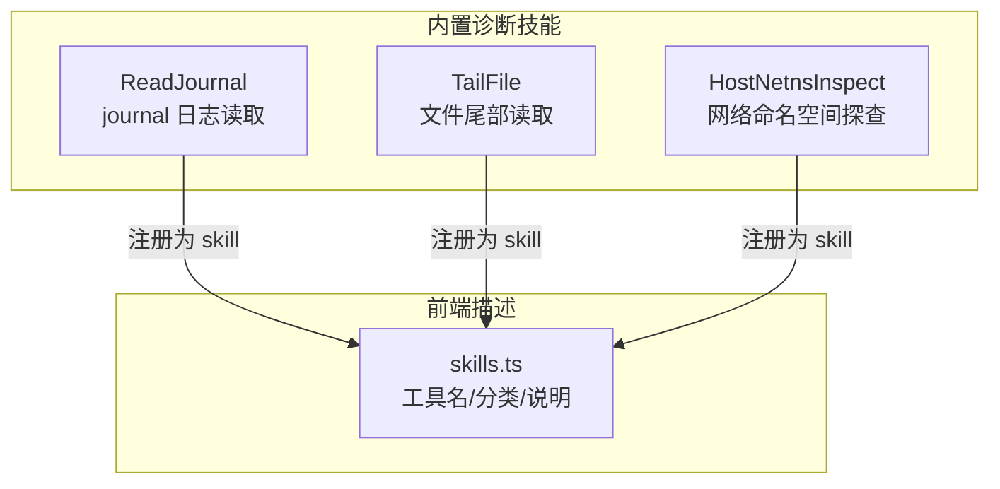
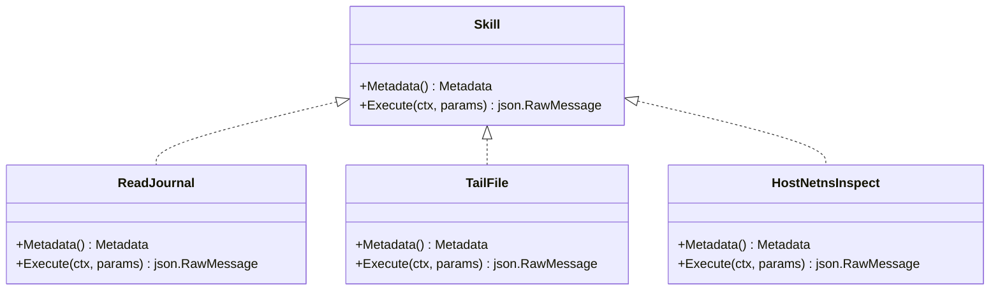
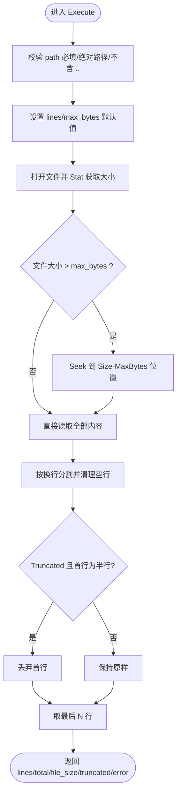
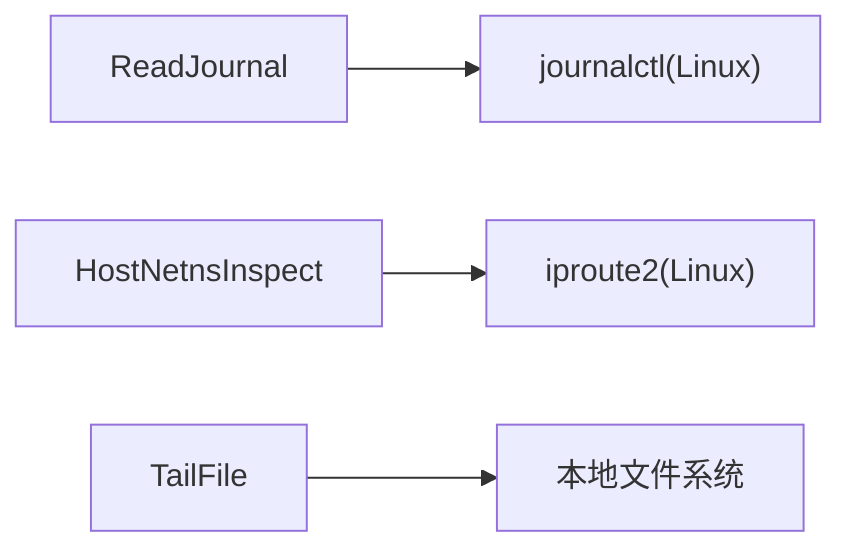

# 系统诊断技能

<cite>
**本文引用的文件**   
- [internal/skill/builtin/read_journal.go](file://internal/skill/builtin/read_journal.go)
- [internal/skill/builtin/tail_file.go](file://internal/skill/builtin/tail_file.go)
- [internal/skill/builtin/host_netns_inspect.go](file://internal/skill/builtin/host_netns_inspect.go)
- [web/src/api/skills.ts](file://web/src/api/skills.ts)
</cite>

## 目录
1. [简介](#简介)
2. [项目结构](#项目结构)
3. [核心组件](#核心组件)
4. [架构总览](#架构总览)
5. [详细组件分析](#详细组件分析)
6. [依赖关系分析](#依赖关系分析)
7. [性能与调优建议](#性能与调优建议)
8. [故障排查指南](#故障排查指南)
9. [结论](#结论)

## 简介
本文件面向运维人员，系统化梳理并文档化三类“系统诊断技能”：
- journal 日志读取：基于 systemd-journald 的只读日志查询能力
- 文件尾部跟踪：安全地读取指定文件的最后 N 行（类似 tail -n）
- 网络命名空间检查：枚举 /var/run/netns 下的所有网络命名空间，并输出每个命名空间的 IP、路由与可选接口信息

这些技能以结构化 JSON 返回结果，便于上层编排、AI 助手或自动化流程消费。文档同时覆盖参数配置、使用示例、输出格式解析方法以及常见问题定位与性能优化建议。

## 项目结构
与本次主题相关的实现位于 internal/skill/builtin 目录，前端描述在 web/src/api/skills.ts 中用于展示工具名称与分类。

图表来源
- [internal/skill/builtin/read_journal.go:16-47](file://internal/skill/builtin/read_journal.go#L16-L47)
- [internal/skill/builtin/tail_file.go:15-46](file://internal/skill/builtin/tail_file.go#L15-L46)
- [internal/skill/builtin/host_netns_inspect.go:48-81](file://internal/skill/builtin/host_netns_inspect.go#L48-L81)
- [web/src/api/skills.ts:108-147](file://web/src/api/skills.ts#L108-L147)

章节来源
- [internal/skill/builtin/read_journal.go:16-47](file://internal/skill/builtin/read_journal.go#L16-L47)
- [internal/skill/builtin/tail_file.go:15-46](file://internal/skill/builtin/tail_file.go#L15-L46)
- [internal/skill/builtin/host_netns_inspect.go:48-81](file://internal/skill/builtin/host_netns_inspect.go#L48-L81)
- [web/src/api/skills.ts:108-147](file://web/src/api/skills.ts#L108-L147)

## 核心组件
- ReadJournal：封装 journalctl，支持按 unit、since、lines 过滤，返回结构化日志行列表与元信息
- TailFile：安全读取文件末尾 N 行，限制绝对路径、禁止 .. 穿越，支持 max_bytes 预算控制
- HostNetnsInspect：列出所有 network namespace，并对每个 ns 输出地址、路由与可选 link 信息；对 namespace 名称进行严格白名单校验

章节来源
- [internal/skill/builtin/read_journal.go:18-47](file://internal/skill/builtin/read_journal.go#L18-L47)
- [internal/skill/builtin/tail_file.go:17-46](file://internal/skill/builtin/tail_file.go#L17-L46)
- [internal/skill/builtin/host_netns_inspect.go:50-81](file://internal/skill/builtin/host_netns_inspect.go#L50-L81)

## 架构总览
三个技能均以“Skill”形式注册，提供 Metadata 描述参数与结果预览，并在 Execute 中执行具体逻辑。对外暴露统一的 JSON 输入/输出契约，便于上层调用。

图表来源
- [internal/skill/builtin/read_journal.go:23-47](file://internal/skill/builtin/read_journal.go#L23-L47)
- [internal/skill/builtin/tail_file.go:23-46](file://internal/skill/builtin/tail_file.go#L23-46)
- [internal/skill/builtin/host_netns_inspect.go:54-81](file://internal/skill/builtin/host_netns_inspect.go#L54-81)

## 详细组件分析

### ReadJournal：Journald 日志读取
- 功能特性
  - 仅 Linux 平台可用
  - 支持 unit 过滤、since 时间回溯、lines 行数限制
  - 通过 context 超时保护（默认 30s），避免长时间阻塞
  - 返回 lines 数组、total_lines、command 等元信息，错误统一放入 error 字段
- 参数配置
  - unit：string，可选，systemd unit 名
  - since：duration，默认 10m，journalctl --since 形式
  - lines：int，默认 200，最大返回行数
- 输出格式
  - lines：字符串数组，每行一条日志
  - total_lines：实际返回的行数
  - command：执行的命令拼接串
  - error：非空表示失败原因
- 使用示例
  - 查询 ongrid-edge 单元最近 5 分钟最多 50 行日志
  - 查询全部单元最近 1 小时最多 100 行日志
- 数据解析要点
  - 若 total_lines 为 0，表示无匹配日志
  - 关注 error 字段判断是否因权限或缺少 journalctl 导致失败
  - 可通过 unit 精确缩小范围，提升检索效率

图表来源
- [internal/skill/builtin/read_journal.go:65-111](file://internal/skill/builtin/read_journal.go#L65-L111)

章节来源
- [internal/skill/builtin/read_journal.go:23-47](file://internal/skill/builtin/read_journal.go#L23-L47)
- [internal/skill/builtin/read_journal.go:65-111](file://internal/skill/builtin/read_journal.go#L65-L111)

### TailFile：文件尾部读取
- 功能特性
  - 只读访问，强制绝对路径且禁止包含 ..，防止路径穿越
  - 支持 max_bytes 预算控制，超过时从尾部截取，标记 truncated=true
  - 返回 lines 数组、total_lines_returned、file_size、truncated 等元信息
- 参数配置
  - path：string，必填，必须以 / 开头且不包含 ..
  - lines：int，默认 100，返回行数
  - max_bytes：int，默认 1MiB，最大读取字节数
- 输出格式
  - lines：字符串数组，每行一条日志
  - total_lines_returned：实际返回的行数
  - file_size：文件大小
  - truncated：是否因预算截断
  - error：非空表示失败原因
- 使用示例
  - 读取 /var/log/app.log 最后 200 行
  - 读取大文件 /var/log/big.log 最后 50 行，限制读取 2MiB
- 数据解析要点
  - truncated=true 时，首行可能是不完整片段，已自动丢弃以保证整行语义
  - 若 file_size 远大于 max_bytes，建议增大 max_bytes 或分批次读取

图表来源
- [internal/skill/builtin/tail_file.go:64-132](file://internal/skill/builtin/tail_file.go#L64-L132)

章节来源
- [internal/skill/builtin/tail_file.go:23-46](file://internal/skill/builtin/tail_file.go#L23-46)
- [internal/skill/builtin/tail_file.go:64-132](file://internal/skill/builtin/tail_file.go#L64-L132)

### HostNetnsInspect：网络命名空间探查
- 功能特性
  - 列举 /var/run/netns 下所有命名空间，或按 name 精确查询单个
  - 对每个命名空间输出地址、路由与可选 link 信息
  - 对 namespace 名称进行严格白名单校验，拒绝 shell 元字符注入
  - 仅 Linux 平台可用
- 参数配置
  - namespace：string，可选，精确匹配一个命名空间名（允许 a-zA-Z0-9_.-，最长 64）
  - include_routes：bool，默认 true，是否带回路由表
  - include_links：bool，默认 false，是否带回 link 列表（含 MAC/state）
- 输出格式
  - namespaces：数组，每项包含 name、addrs、routes、links、error
  - addrs：{iface, family, addr, prefix}
  - routes：{dst, gateway?, iface}
  - links：{iface, state, mac}
  - error：单条记录级错误，不影响其他命名空间
- 使用示例
  - 列出所有命名空间及其地址与路由
  - 仅查看名为 “container-abc” 的命名空间，并包含 link 信息
- 数据解析要点
  - 若某命名空间存在 error，其余命名空间仍会正常返回
  - default 路由 dst 为空时会被规范化为 “default”
  - include_links 数据量较大，建议在需要时才开启

图表来源
- [internal/skill/builtin/host_netns_inspect.go:136-205](file://internal/skill/builtin/host_netns_inspect.go#L136-L205)
- [internal/skill/builtin/host_netns_inspect.go:209-240](file://internal/skill/builtin/host_netns_inspect.go#L209-L240)
- [internal/skill/builtin/host_netns_inspect.go:244-327](file://internal/skill/builtin/host_netns_inspect.go#L244-L327)

章节来源
- [internal/skill/builtin/host_netns_inspect.go:54-81](file://internal/skill/builtin/host_netns_inspect.go#L54-81)
- [internal/skill/builtin/host_netns_inspect.go:136-205](file://internal/skill/builtin/host_netns_inspect.go#L136-L205)
- [internal/skill/builtin/host_netns_inspect.go:209-240](file://internal/skill/builtin/host_netns_inspect.go#L209-L240)
- [internal/skill/builtin/host_netns_inspect.go:244-327](file://internal/skill/builtin/host_netns_inspect.go#L244-L327)

## 依赖关系分析
- 运行时依赖
  - ReadJournal 依赖 journalctl（Linux）
  - HostNetnsInspect 依赖 iproute2（Linux）
  - TailFile 仅依赖标准库文件系统操作
- 安全边界
  - TailFile 强制绝对路径与禁止 ..，防止路径穿越
  - HostNetnsInspect 对 namespace 名称进行正则白名单校验，杜绝 shell 注入
- 超时与健壮性
  - ReadJournal 与 HostNetnsInspect 均使用 context 超时，避免长时间挂起
  - 各技能将错误归一化到 error 字段，保证上层稳定消费

图表来源
- [internal/skill/builtin/read_journal.go:81-96](file://internal/skill/builtin/read_journal.go#L81-L96)
- [internal/skill/builtin/host_netns_inspect.go:150-174](file://internal/skill/builtin/host_netns_inspect.go#L150-L174)
- [internal/skill/builtin/tail_file.go:74-79](file://internal/skill/builtin/tail_file.go#L74-L79)

章节来源
- [internal/skill/builtin/read_journal.go:81-96](file://internal/skill/builtin/read_journal.go#L81-L96)
- [internal/skill/builtin/host_netns_inspect.go:150-174](file://internal/skill/builtin/host_netns_inspect.go#L150-L174)
- [internal/skill/builtin/tail_file.go:74-79](file://internal/skill/builtin/tail_file.go#L74-L79)

## 性能与调优建议
- journal 日志读取
  - 优先使用 unit 过滤缩小范围，减少不必要扫描
  - 合理设置 since 与 lines，避免一次性拉取过多历史
  - 注意 30s 超时，若需更长窗口可分批多次查询
- 文件尾部读取
  - 针对大文件，适当提高 max_bytes，确保能读到足够上下文
  - 结合 truncated 标志判断是否需要二次读取或分段处理
  - 避免频繁轮询同一超大文件，必要时采用增量策略
- 网络命名空间探查
  - 仅在需要时开启 include_links，以减少数据量
  - 批量枚举多个命名空间时，注意整体耗时与带宽占用
  - 对特定命名空间进行精准查询，避免全量扫描

[本节为通用指导，不直接分析具体文件]

## 故障排查指南
- ReadJournal
  - 非 Linux 环境：返回 error 提示不支持
  - 缺少 journalctl 或权限不足：error 字段包含具体错误信息
  - 无匹配日志：lines 为空，total_lines 为 0
- TailFile
  - 路径非法：相对路径或包含 .. 将被拒绝
  - 文件不存在：error 字段包含 IO 错误
  - 截断：truncated=true 时建议调整 max_bytes
- HostNetnsInspect
  - 非 Linux 环境：返回 error 提示不支持
  - 未安装 iproute2 或无 /var/run/netns：返回 error 而非抛错
  - 命名空间名非法：白名单校验失败，拒绝执行

章节来源
- [internal/skill/builtin/read_journal.go:81-103](file://internal/skill/builtin/read_journal.go#L81-L103)
- [internal/skill/builtin/tail_file.go:71-92](file://internal/skill/builtin/tail_file.go#L71-L92)
- [internal/skill/builtin/host_netns_inspect.go:145-174](file://internal/skill/builtin/host_netns_inspect.go#L145-L174)

## 结论
上述三项诊断技能提供了面向运维的高内聚、低耦合的可观测性与排障能力：
- 通过结构化 JSON 输出，便于上层自动化与 AI 助手消费
- 严格的参数校验与安全边界，降低误用风险
- 合理的默认值与超时保护，兼顾易用性与稳定性

建议在实际使用中结合业务场景选择合适的过滤条件与预算参数，以获得最佳的性能与准确性。