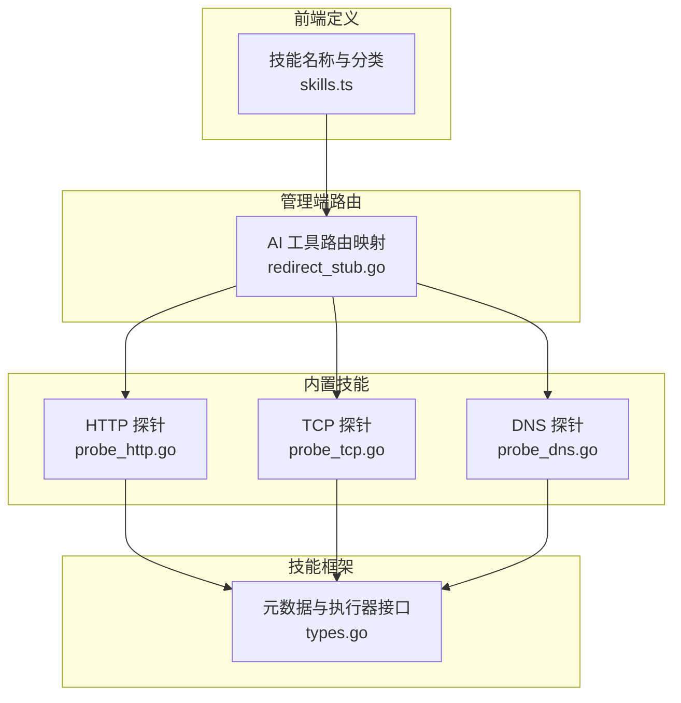
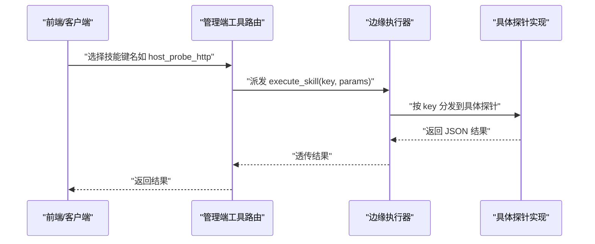
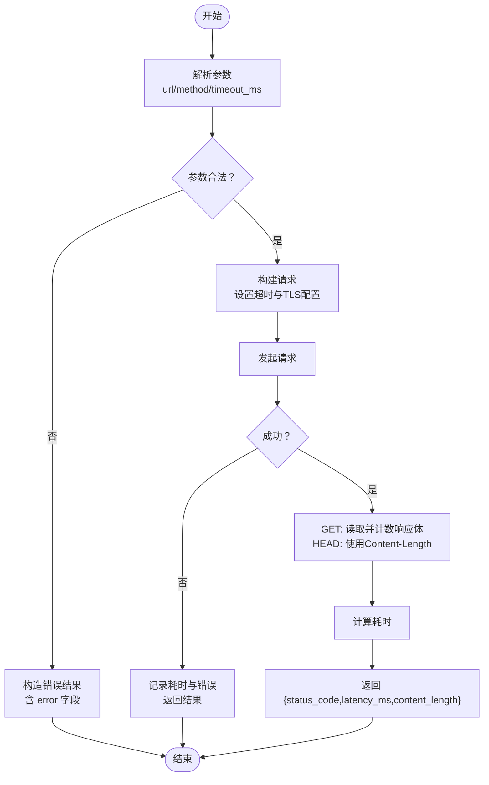
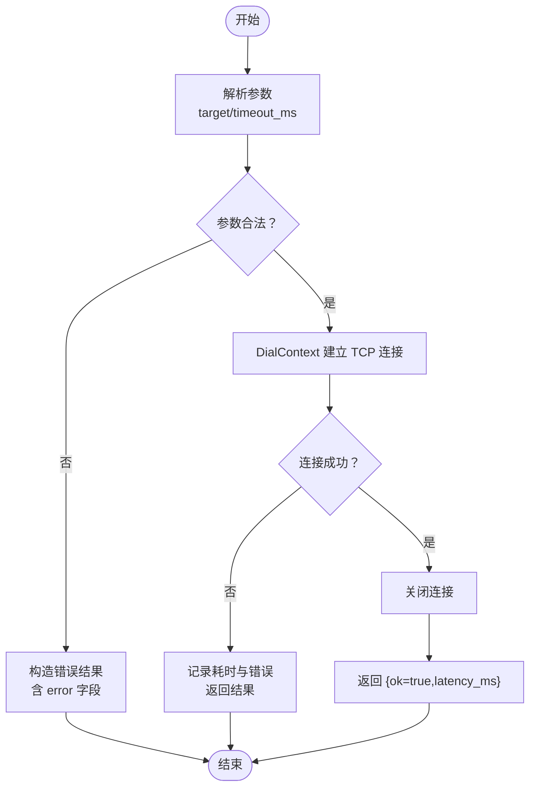
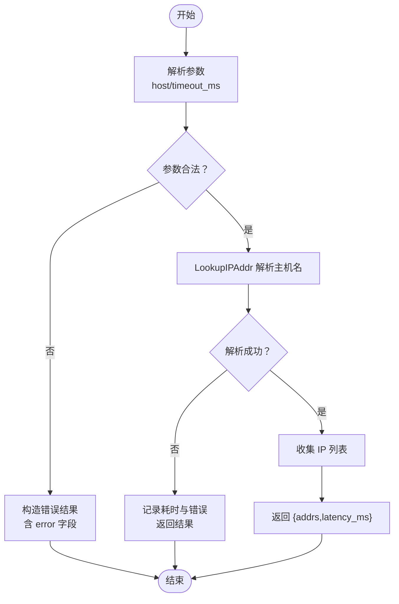
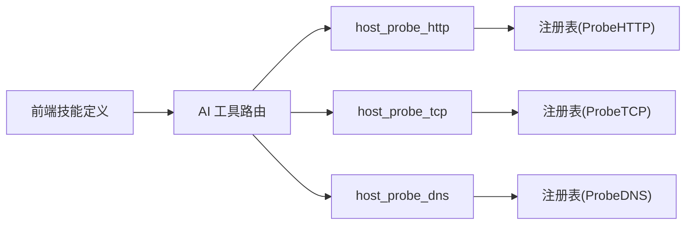

# 网络探测技能

<cite>
**本文引用的文件**
- [internal/skill/builtin/probe_http.go](file://internal/skill/builtin/probe_http.go)
- [internal/skill/builtin/probe_tcp.go](file://internal/skill/builtin/probe_tcp.go)
- [internal/skill/builtin/probe_dns.go](file://internal/skill/builtin/probe_dns.go)
- [internal/skill/types.go](file://internal/skill/types.go)
- [internal/manager/biz/aiops/tools/redirect_stub.go](file://internal/manager/biz/aiops/tools/redirect_stub.go)
- [web/src/api/skills.ts](file://web/src/api/skills.ts)
</cite>

## 目录
1. [简介](#简介)
2. [项目结构](#项目结构)
3. [核心组件](#核心组件)
4. [架构总览](#架构总览)
5. [详细组件分析](#详细组件分析)
6. [依赖关系分析](#依赖关系分析)
7. [性能与超时特性](#性能与超时特性)
8. [故障排查指南](#故障排查指南)
9. [结论](#结论)

## 简介
本文件面向运维人员，系统化梳理并说明“网络探测”相关技能的实现与使用方式，涵盖以下三类探针：
- HTTP 探针：对目标 URL 发起 HEAD/GET 请求，返回状态码、延迟与内容长度。
- TCP 探针：对 host:port 发起 TCP 连接，返回连通性与延迟。
- DNS 探针：解析主机名，返回 A/AAAA 记录列表与解析耗时。

文档将详细说明各探针的参数、返回值结构、调用示例（以参数描述为主）、错误处理策略，以及常见问题的定位方法。

## 项目结构
网络探测能力由“内置技能”提供，位于 internal/skill/builtin 目录下，每个探针一个文件；框架通过统一元数据与执行器接口进行注册与调度。

图表来源
- [internal/skill/builtin/probe_http.go:1-120](file://internal/skill/builtin/probe_http.go#L1-L120)
- [internal/skill/builtin/probe_tcp.go:1-83](file://internal/skill/builtin/probe_tcp.go#L1-L83)
- [internal/skill/builtin/probe_dns.go:1-85](file://internal/skill/builtin/probe_dns.go#L1-L85)
- [internal/skill/types.go:1-241](file://internal/skill/types.go#L1-L241)
- [internal/manager/biz/aiops/tools/redirect_stub.go:102-131](file://internal/manager/biz/aiops/tools/redirect_stub.go#L102-L131)
- [web/src/api/skills.ts:108-147](file://web/src/api/skills.ts#L108-L147)

章节来源
- [internal/skill/builtin/doc.go:1-26](file://internal/skill/builtin/doc.go#L1-L26)
- [internal/skill/types.go:1-241](file://internal/skill/types.go#L1-L241)

## 核心组件
- 技能元数据与执行器接口：定义了技能的关键信息（键名、名称、描述、权限类别、作用域、参数 Schema、结果预览）以及统一的 Execute 执行入口。
- 三个网络探针：分别实现 HTTP/TCP/DNS 的探测逻辑，均声明为安全类（ClassSafe），仅做只读探测，无副作用。

章节来源
- [internal/skill/types.go:1-241](file://internal/skill/types.go#L1-L241)
- [internal/skill/builtin/probe_http.go:1-120](file://internal/skill/builtin/probe_http.go#L1-L120)
- [internal/skill/builtin/probe_tcp.go:1-83](file://internal/skill/builtin/probe_tcp.go#L1-L83)
- [internal/skill/builtin/probe_dns.go:1-85](file://internal/skill/builtin/probe_dns.go#L1-L85)

## 架构总览
从调用端到执行端的整体流程如下：
- 前端或 AI 工具根据技能键名选择对应专家角色与实现。
- 管理端将请求转发到边缘侧执行器。
- 边缘侧按技能键分发到具体探针实现，执行后返回结构化结果。

图表来源
- [internal/manager/biz/aiops/tools/redirect_stub.go:102-131](file://internal/manager/biz/aiops/tools/redirect_stub.go#L102-L131)
- [internal/skill/types.go:190-203](file://internal/skill/types.go#L190-L203)
- [internal/skill/builtin/probe_http.go:15-47](file://internal/skill/builtin/probe_http.go#L15-L47)
- [internal/skill/builtin/probe_tcp.go:13-39](file://internal/skill/builtin/probe_tcp.go#L13-L39)
- [internal/skill/builtin/probe_dns.go:13-39](file://internal/skill/builtin/probe_dns.go#L13-L39)

## 详细组件分析

### HTTP 探针（host_probe_http）
- 功能概述
  - 对指定 URL 发起 HEAD 或 GET 请求，返回状态码、延迟（毫秒）、内容长度（字节）。
  - 默认方法为 HEAD；若为 GET，则统计实际响应体字节数；HEAD 时采用 Content-Length 头。
  - TLS 证书校验被跳过，便于探测内部自签证书服务。
- 参数定义
  - url（必填，字符串）：完整 URL，例如 https://example.com/health
  - method（枚举，可选，默认 HEAD）：允许值 GET、HEAD
  - timeout_ms（整数，可选，默认 5000）：请求超时（毫秒）
- 返回结果字段
  - status_code（整数）：HTTP 状态码
  - latency_ms（整数）：请求耗时（毫秒）
  - content_length（整数）：响应体长度（字节）
  - error（字符串，可选）：错误信息（当发生错误时填充）
- 调用示例（参数描述）
  - 检测健康页可用性（HEAD）：传入 url=https://svc.example.com/health，method=HEAD，timeout_ms=3000
  - 获取页面大小与延迟（GET）：传入 url=https://svc.example.com/index.html，method=GET，timeout_ms=5000
- 错误处理
  - 参数缺失或非法：返回包含 error 的结果对象
  - 网络不可达或超时：error 字段携带错误文本，latency_ms 仍会记录
- 注意事项
  - 仅支持只读方法（GET/HEAD），不支持 PUT/POST 等写操作
  - 不验证 TLS 证书，适用于内网自签场景

图表来源
- [internal/skill/builtin/probe_http.go:23-119](file://internal/skill/builtin/probe_http.go#L23-L119)

章节来源
- [internal/skill/builtin/probe_http.go:1-120](file://internal/skill/builtin/probe_http.go#L1-L120)

### TCP 探针（host_probe_tcp）
- 功能概述
  - 对目标 host:port 发起 TCP 拨号连接，立即关闭，返回连通性与延迟。
- 参数定义
  - target（必填，字符串）：目标地址，格式 host:port，例如 google.com:443
  - timeout_ms（整数，可选，默认 3000）：拨号超时（毫秒）
- 返回结果字段
  - ok（布尔）：是否连通
  - latency_ms（整数）：拨号耗时（毫秒）
  - error（字符串，可选）：错误信息（当失败时填充）
- 调用示例（参数描述）
  - 检查端口可达性：传入 target=10.0.0.1:8080，timeout_ms=2000
- 错误处理
  - 参数缺失或类型错误：返回包含 error 的结果对象
  - 连接拒绝或超时：ok=false，error 携带错误文本，latency_ms 仍记录
- 注意事项
  - 仅建立一次连接后立即关闭，不发送任何业务载荷

图表来源
- [internal/skill/builtin/probe_tcp.go:19-82](file://internal/skill/builtin/probe_tcp.go#L19-L82)

章节来源
- [internal/skill/builtin/probe_tcp.go:1-83](file://internal/skill/builtin/probe_tcp.go#L1-L83)

### DNS 探针（host_probe_dns）
- 功能概述
  - 使用系统解析器对主机名进行 A/AAAA 解析，返回 IP 列表与解析耗时。
- 参数定义
  - host（必填，字符串）：要解析的主机名，例如 example.com
  - timeout_ms（整数，可选，默认 3000）：解析超时（毫秒）
- 返回结果字段
  - addrs（字符串数组）：解析得到的 IP 列表（A/AAAA）
  - latency_ms（整数）：解析耗时（毫秒）
  - error（字符串，可选）：错误信息（当解析失败时填充）
- 调用示例（参数描述）
  - 解析域名：传入 host=example.com，timeout_ms=2000
- 错误处理
  - 参数缺失或类型错误：返回包含 error 的结果对象
  - 解析失败或超时：error 携带错误文本，latency_ms 仍记录
- 注意事项
  - 基于 net.DefaultResolver.LookupIPAddr，受系统 DNS 配置影响

图表来源
- [internal/skill/builtin/probe_dns.go:19-84](file://internal/skill/builtin/probe_dns.go#L19-L84)

章节来源
- [internal/skill/builtin/probe_dns.go:1-85](file://internal/skill/builtin/probe_dns.go#L1-L85)

## 依赖关系分析
- 技能注册与发现
  - 每个探针在 init() 中向全局注册表注册自身，键名为 host_probe_http / host_probe_tcp / host_probe_dns。
- 管理端路由
  - 管理端工具路由将上述键名映射到“specialist-network”，用于 AI 工具自动分派。
- 前端定义
  - 前端维护技能名称与分类，便于界面展示与交互。

图表来源
- [internal/skill/builtin/probe_http.go:15-15](file://internal/skill/builtin/probe_http.go#L15-L15)
- [internal/skill/builtin/probe_tcp.go:13-13](file://internal/skill/builtin/probe_tcp.go#L13-L13)
- [internal/skill/builtin/probe_dns.go:13-13](file://internal/skill/builtin/probe_dns.go#L13-L13)
- [internal/manager/biz/aiops/tools/redirect_stub.go:102-131](file://internal/manager/biz/aiops/tools/redirect_stub.go#L102-L131)
- [web/src/api/skills.ts:108-147](file://web/src/api/skills.ts#L108-L147)

章节来源
- [internal/skill/types.go:190-203](file://internal/skill/types.go#L190-L203)
- [internal/manager/biz/aiops/tools/redirect_stub.go:102-131](file://internal/manager/biz/aiops/tools/redirect_stub.go#L102-L131)
- [web/src/api/skills.ts:108-147](file://web/src/api/skills.ts#L108-L147)

## 性能与超时特性
- 超时控制
  - HTTP：http.Client.Timeout 控制整个请求生命周期；GET 会读取并丢弃响应体以准确统计内容长度。
  - TCP：net.Dialer.Timeout 控制拨号阶段；成功后立即关闭连接。
  - DNS：通过 context.WithTimeout 限制解析时间，避免阻塞调度 goroutine。
- 重试机制
  - 当前实现未内置重试；如需重试，可在上层编排层（如工作流或任务调度）实现。
- 并发与资源
  - 每次探测为单次请求/连接，完成后释放资源；适合高频轮询但需合理设置超时与间隔。

[本节为通用指导，不涉及具体代码片段]

## 故障排查指南
- 常见问题与定位
  - 参数缺失或类型错误
    - 现象：返回结果中包含 error 字段，或调用直接报错
    - 排查：确认必填参数存在且类型正确（如 url/target/host 为字符串，timeout_ms 为正整数）
  - 网络不可达或端口拒绝
    - 现象：TCP 探针 ok=false，error 提示连接拒绝或超时
    - 排查：检查防火墙规则、ACL、目标服务监听地址与端口
  - DNS 解析失败
    - 现象：DNS 探针 error 非空，addrs 为空
    - 排查：检查本地 DNS 配置、上游解析器可达性、域名拼写
  - HTTP 状态异常
    - 现象：status_code 非期望值
    - 排查：检查后端服务健康状态、路径是否正确、是否需要认证头（当前探针未注入自定义头）
  - TLS 证书问题
    - 现象：HTTPS 访问正常但证书校验被跳过
    - 说明：探针默认跳过证书校验，适用于内网自签环境；生产建议结合其他手段确保链路安全
- 最佳实践
  - 合理设置超时：根据网络质量与服务 SLA 调整 timeout_ms，避免过长等待
  - 区分方法与用途：健康检查优先用 HEAD，需要负载评估时用 GET
  - 监控指标：关注 latency_ms 趋势与 error 比例，结合告警阈值快速定位退化
  - 组合探测：先 DNS 再 TCP 再 HTTP，逐步缩小问题范围

[本节为通用指导，不涉及具体代码片段]

## 结论
网络探测技能提供了轻量、安全的只读探测能力，覆盖 HTTP/TCP/DNS 三大常用维度。通过统一的元数据与执行器接口，探针可被管理端与前端无缝集成。运维人员可据此快速完成服务可用性、连通性与解析能力的巡检与排障。建议在编排层按需叠加重试与聚合分析，以获得更稳健的观测效果。