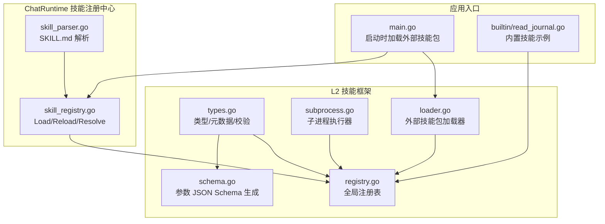
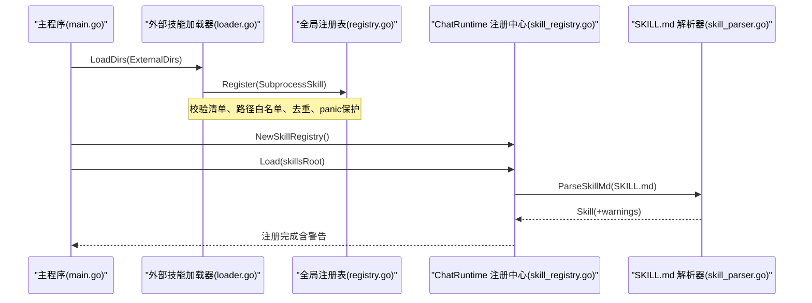
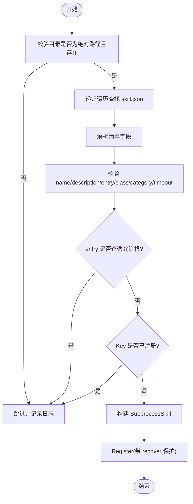
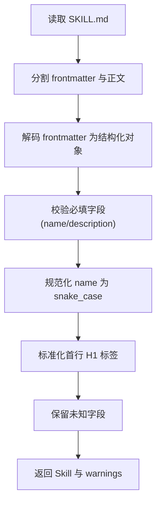
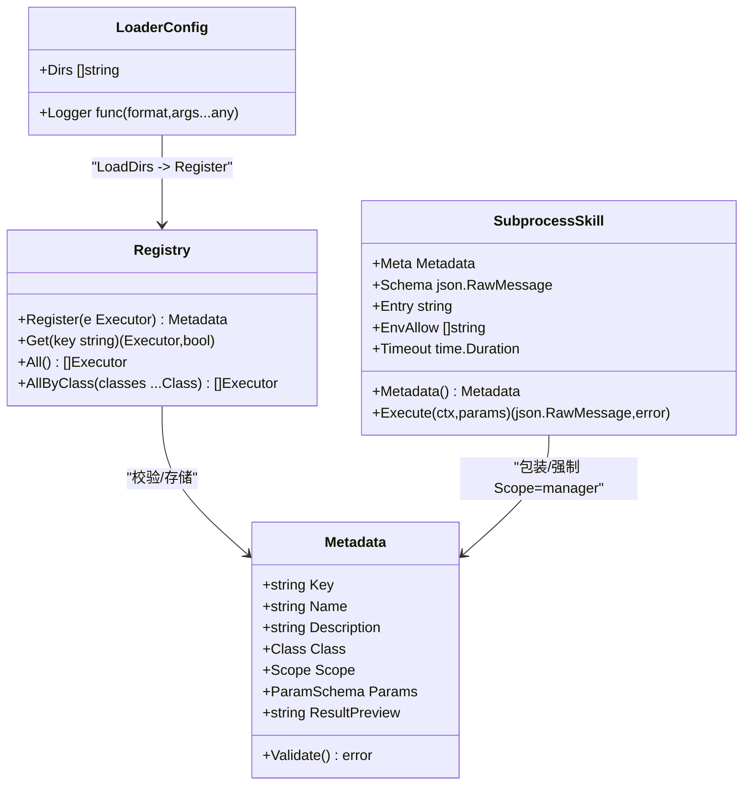
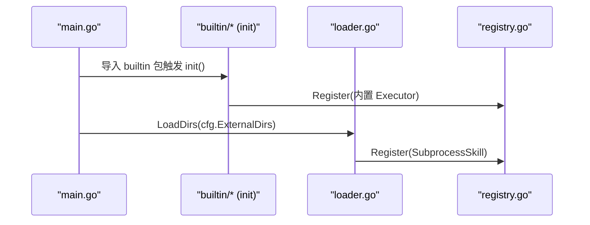
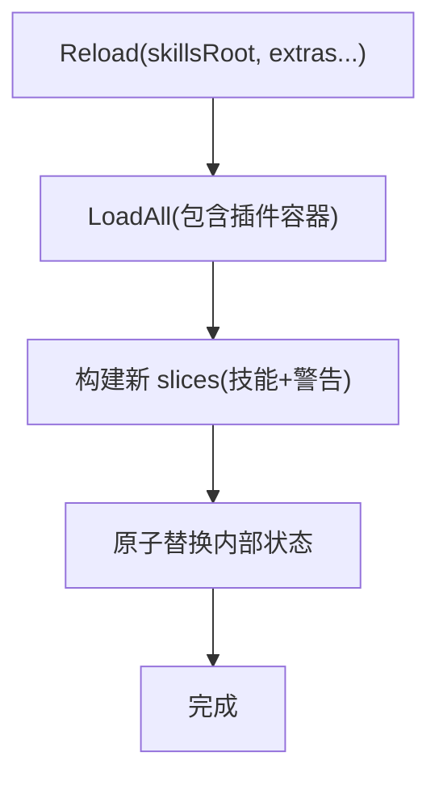
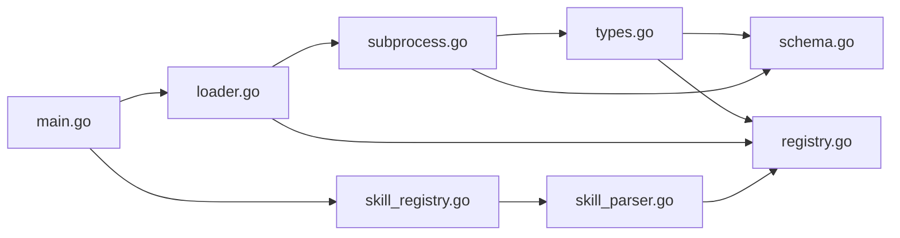

# 技能加载机制

<cite>
**本文引用的文件**
- [loader.go](file://internal/skill/loader.go)
- [types.go](file://internal/skill/types.go)
- [schema.go](file://internal/skill/schema.go)
- [registry.go](file://internal/skill/registry.go)
- [subprocess.go](file://internal/skill/subprocess.go)
- [skill_parser.go](file://internal/manager/biz/aiops/chatruntime/skill_parser.go)
- [skill_registry.go](file://internal/manager/biz/aiops/chatruntime/skill_registry.go)
- [main.go](file://cmd/ongrid/main.go)
- [read_journal.go](file://internal/skill/builtin/read_journal.go)
</cite>

## 目录
1. [简介](#简介)
2. [项目结构](#项目结构)
3. [核心组件](#核心组件)
4. [架构总览](#架构总览)
5. [详细组件分析](#详细组件分析)
6. [依赖关系分析](#依赖关系分析)
7. [性能与资源控制](#性能与资源控制)
8. [故障排查指南](#故障排查指南)
9. [结论](#结论)
10. [附录：扩展点与自定义加载器实现指南](#附录扩展点与自定义加载器实现指南)

## 简介
本文件系统性阐述技能（Skill）加载机制，覆盖以下关键主题：
- 文件系统扫描算法：目录遍历、SKILL.md 发现与解析、插件容器兼容、依赖关系解析。
- 注册流程：元数据校验、重复检测、安全检查（路径白名单、环境变量白名单、类与范围约束）。
- 版本管理与兼容性：SKILL.md frontmatter 字段保留策略、未知字段前向兼容。
- 内置技能与外部技能的加载差异：Go 内嵌 Executor 的动态注册 vs 子进程外部技能包（skill.json）的静态清单驱动。
- 错误处理与调试：加载失败分类、日志输出、审计与结果预览。
- 扩展点与自定义加载器：如何新增外部技能格式、如何在运行时热重载并接入统一注册表。

## 项目结构
与技能加载相关的关键代码位于两个层次：
- L2 设备直连能力框架（internal/skill）：定义技能类型、注册表、子进程执行器、清单加载器。
- ChatRuntime 技能注册中心（internal/manager/biz/aiops/chatruntime）：负责 SKILL.md 解析、插件容器发现、按查询与策略过滤的技能清单。

图表来源
- [types.go:1-241](file://internal/skill/types.go#L1-L241)
- [registry.go:1-127](file://internal/skill/registry.go#L1-L127)
- [schema.go:1-96](file://internal/skill/schema.go#L1-L96)
- [subprocess.go:1-268](file://internal/skill/subprocess.go#L1-L268)
- [loader.go:1-274](file://internal/skill/loader.go#L1-L274)
- [skill_parser.go:1-249](file://internal/manager/biz/aiops/chatruntime/skill_parser.go#L1-L249)
- [skill_registry.go:1-240](file://internal/manager/biz/aiops/chatruntime/skill_registry.go#L1-L240)
- [main.go:175-2264](file://cmd/ongrid/main.go#L175-L2264)
- [read_journal.go:1-53](file://internal/skill/builtin/read_journal.go#L1-L53)

章节来源
- [main.go:175-2264](file://cmd/ongrid/main.go#L175-L2264)

## 核心组件
- 类型与元数据（types.go）
  - 定义技能权限等级（safe/mutating/dangerous）、运行范围（host/manager）、参数模式与元数据结构，并提供 Validate 进行一致性检查。
- 全局注册表（registry.go）
  - 提供 Register/Get/All/AllByClass 等接口；对重复 Key 与无效元数据采用 panic 快速失败策略，保证启动期暴露作者错误。
- 参数 Schema 生成（schema.go）
  - 将 ParamSchema 转换为 OpenAI function-calling 风格的 JSON Schema；支持 RawSchemaProvider 直接返回原始 Schema。
- 子进程执行器（subprocess.go）
  - 以独立进程方式运行外部可执行文件；严格限制 stdout/stderr 大小、超时、环境变量白名单；强制 ScopeManager。
- 外部技能包加载器（loader.go）
  - 基于 skill.json 清单，递归扫描配置的外部目录，校验 name/description/entry/class/category/timeout/env_allow，并对 entry 做路径白名单与符号链接展开校验，最后注册为 SubprocessSkill。
- SKILL.md 解析器（skill_parser.go）
  - 解析 YAML frontmatter，校验必填字段，自动规范化 name 为 snake_case，标准化首行 H1 标签，保留未知字段以向前兼容。
- ChatRuntime 技能注册中心（skill_registry.go）
  - 聚合 Load/Reload/Resolve，支持插件容器（如 .claude-plugin/、openclaw.plugin.json），按激活策略与策略集过滤工具，原子替换内部切片以支持热重载。

章节来源
- [types.go:1-241](file://internal/skill/types.go#L1-L241)
- [registry.go:1-127](file://internal/skill/registry.go#L1-L127)
- [schema.go:1-96](file://internal/skill/schema.go#L1-L96)
- [subprocess.go:1-268](file://internal/skill/subprocess.go#L1-L268)
- [loader.go:1-274](file://internal/skill/loader.go#L1-L274)
- [skill_parser.go:1-249](file://internal/manager/biz/aiops/chatruntime/skill_parser.go#L1-L249)
- [skill_registry.go:1-240](file://internal/manager/biz/aiops/chatruntime/skill_registry.go#L1-L240)

## 架构总览
系统存在两套“技能”体系：
- L2 设备直连能力（internal/skill）：通过 Go Executor 或子进程 Executable 实现，注册到全局注册表，供 Manager 与 Edge 使用。
- ChatRuntime 技能（SKILL.md + 可选 tools）：用于 AI 对话编排，由 chatruntime 层解析、过滤与暴露给上层工具链。

图表来源
- [main.go:175-2264](file://cmd/ongrid/main.go#L175-L2264)
- [loader.go:1-274](file://internal/skill/loader.go#L1-L274)
- [registry.go:1-127](file://internal/skill/registry.go#L1-L127)
- [skill_registry.go:1-240](file://internal/manager/biz/aiops/chatruntime/skill_registry.go#L1-L240)
- [skill_parser.go:1-249](file://internal/manager/biz/aiops/chatruntime/skill_parser.go#L1-L249)

## 详细组件分析

### 外部技能包加载器（skill.json）
- 目录扫描
  - 仅接受绝对路径根目录；不存在或非目录则跳过并记录日志。
  - 递归遍历，匹配文件名 skill.json。
- 清单解析与构建
  - 必填字段：name、description、entry。
  - name 必须为 lower_snake，且与已注册 Key 去重。
  - entry 相对路径以清单所在目录为基准解析；随后进行绝对化与符号链接展开，确保最终路径位于配置的允许根目录下。
  - class 默认 safe；category 默认 external；timeout_seconds 缺省回退至默认值。
  - env_allow 决定子进程可见的环境变量名集合（默认不继承任何环境变量）。
- 注册与异常防护
  - 在 Register 前后使用 defer/recover 捕获潜在 panic，避免单个坏清单导致启动崩溃。
  - 重复 Key 会被跳过而非报错，保障部署过渡期的稳定性。

图表来源
- [loader.go:1-274](file://internal/skill/loader.go#L1-L274)
- [subprocess.go:1-268](file://internal/skill/subprocess.go#L1-L268)
- [registry.go:1-127](file://internal/skill/registry.go#L1-L127)

章节来源
- [loader.go:1-274](file://internal/skill/loader.go#L1-L274)
- [subprocess.go:1-268](file://internal/skill/subprocess.go#L1-L268)
- [registry.go:1-127](file://internal/skill/registry.go#L1-L127)

### SKILL.md 解析与依赖关系解析
- Frontmatter 解析
  - 要求 name 与 description 必填；缺失则返回错误。
  - name 非 snake_case 将被自动规范化并产生警告。
  - 未知字段保留到 UnknownFields，确保上游 schema 演进的前向兼容。
- 正文标准化
  - 首行 H1 被标准化为 [能力: <name>]，若无 H1 则自动插入。
- 依赖关系解析
  - 当前解析器聚焦于 SKILL.md 自身元数据与正文；tools 列表作为声明式描述保留，具体绑定与依赖解析由上层工具链与策略层处理。
  - 插件容器（如 .claude-plugin/、openclaw.plugin.json）由 LoadAll 统一发现并合并，但不在本解析器范围内。

图表来源
- [skill_parser.go:1-249](file://internal/manager/biz/aiops/chatruntime/skill_parser.go#L1-L249)

章节来源
- [skill_parser.go:1-249](file://internal/manager/biz/aiops/chatruntime/skill_parser.go#L1-L249)

### 注册流程：元数据验证、重复检测与安全策略
- 元数据验证
  - types.go 中 Metadata.Validate 校验 key 命名、class/scope 取值、参数类型与数组 ItemType、required/default 互斥等。
- 重复检测
  - registry.Register 对相同 Key 的注册会 panic，防止覆盖；loader 侧对重复 Key 选择跳过，兼顾健壮性。
- 安全策略
  - 外部技能：entry 路径白名单校验、符号链接展开后仍需在允许根下；env_allow 白名单控制环境变量注入；Scope 强制为 manager。
  - 内置技能：通过 init() 注册，受全局注册表保护；部分内置技能（如 web_search）可在运行时注入配置解析器。

图表来源
- [types.go:1-241](file://internal/skill/types.go#L1-L241)
- [registry.go:1-127](file://internal/skill/registry.go#L1-L127)
- [subprocess.go:1-268](file://internal/skill/subprocess.go#L1-L268)
- [loader.go:1-274](file://internal/skill/loader.go#L1-L274)

章节来源
- [types.go:1-241](file://internal/skill/types.go#L1-L241)
- [registry.go:1-127](file://internal/skill/registry.go#L1-L127)
- [subprocess.go:1-268](file://internal/skill/subprocess.go#L1-L268)
- [loader.go:1-274](file://internal/skill/loader.go#L1-L274)

### 版本管理与兼容性处理
- SKILL.md 版本字段
  - frontmatter 支持 version 字段；解析器将其保留在 Struct 中，便于后续策略层或 UI 展示。
- 未知字段前向兼容
  - 解析器会将未建模字段保留到 UnknownFields，避免上游 schema 升级导致 ongrid 无法加载。
- 冲突处理
  - 当 top-level activation 与 metadata.ongrid.activation 同时存在且不一致时，优先使用 metadata.ongrid.activation，并产生警告提示。

章节来源
- [skill_parser.go:1-249](file://internal/manager/biz/aiops/chatruntime/skill_parser.go#L1-L249)

### 内置技能与外部技能的加载差异
- 内置技能（Go 内嵌）
  - 通过包 init() 调用 Register 将 Executor 注册到全局注册表；例如 read_journal 在 init 中注册。
  - 优点：编译期集成、零开销、可直接访问宿主内存与库。
- 外部技能（子进程）
  - 通过 loader.LoadDirs 扫描 ExternalDirs，解析 skill.json，构建 SubprocessSkill 并注册。
  - 优点：语言无关、隔离性强、易于分发与热插拔；缺点：需遵守清单规范与路径/环境白名单。

图表来源
- [main.go:175-2264](file://cmd/ongrid/main.go#L175-L2264)
- [read_journal.go:1-53](file://internal/skill/builtin/read_journal.go#L1-L53)
- [loader.go:1-274](file://internal/skill/loader.go#L1-L274)
- [registry.go:1-127](file://internal/skill/registry.go#L1-L127)

章节来源
- [main.go:175-2264](file://cmd/ongrid/main.go#L175-L2264)
- [read_journal.go:1-53](file://internal/skill/builtin/read_journal.go#L1-L53)
- [loader.go:1-274](file://internal/skill/loader.go#L1-L274)
- [registry.go:1-127](file://internal/skill/registry.go#L1-L127)

### ChatRuntime 技能注册中心与热重载
- Load/Reload
  - Load 从单一 skillsRoot 扫描；Reload 支持额外 roots（如内置技能根），以便安装/卸载后热重载而不丢失内置项。
- Resolve
  - 根据 query 与 Policy 过滤：先按 activation（always/keyword）筛选，再按 class 策略过滤工具；若某技能有工具但全部被策略丢弃，则该技能整体丢弃。
- 并发与原子性
  - 读写锁保护；Reload 在锁外构建新切片，然后原子替换，保证在途请求不受影响。

图表来源
- [skill_registry.go:1-240](file://internal/manager/biz/aiops/chatruntime/skill_registry.go#L1-L240)

章节来源
- [skill_registry.go:1-240](file://internal/manager/biz/aiops/chatruntime/skill_registry.go#L1-L240)

## 依赖关系分析
- 模块耦合
  - loader.go 依赖 registry.go 与 subprocess.go；subprocess.go 依赖 types.go 与 schema.go。
  - chatruntime 的 skill_parser.go 与 skill_registry.go 相互协作，前者产出 Skill，后者聚合与过滤。
- 外部依赖
  - main.go 在启动阶段组装各服务，并调用 loader.LoadDirs 与 chatruntime 注册中心完成技能发现与注册。
- 循环依赖
  - 未发现循环依赖；注册表为单向读多写少结构，符合初始化期注册、运行期只读的常见模式。

图表来源
- [types.go:1-241](file://internal/skill/types.go#L1-L241)
- [schema.go:1-96](file://internal/skill/schema.go#L1-L96)
- [registry.go:1-127](file://internal/skill/registry.go#L1-L127)
- [subprocess.go:1-268](file://internal/skill/subprocess.go#L1-L268)
- [loader.go:1-274](file://internal/skill/loader.go#L1-L274)
- [skill_parser.go:1-249](file://internal/manager/biz/aiops/chatruntime/skill_parser.go#L1-L249)
- [skill_registry.go:1-240](file://internal/manager/biz/aiops/chatruntime/skill_registry.go#L1-L240)
- [main.go:175-2264](file://cmd/ongrid/main.go#L175-L2264)

章节来源
- [main.go:175-2264](file://cmd/ongrid/main.go#L175-L2264)

## 性能与资源控制
- 子进程输出上限
  - stdout 最大 16 MiB，stderr 尾部最多 4 KiB 保留用于诊断，避免恶意或异常输出撑爆内存。
- 超时控制
  - 子进程默认超时 30s，可通过 manifest 的 timeout_seconds 调整；超时上下文传播确保及时终止。
- 扫描效率
  - 仅匹配固定文件名（skill.json / SKILL.md），忽略其他文件；对不存在目录直接跳过，减少 IO。
- 并发安全
  - 注册表使用读写锁；Reload 原子替换，避免在读多写少场景下的锁竞争放大。

[本节为通用性能建议，无需特定文件引用]

## 故障排查指南
- 启动期问题
  - 清单字段缺失或非法：loader 会记录日志并跳过该清单，不会中断启动。
  - 重复 Key：loader 跳过重复项；若通过 Register 直接注册，则会 panic 快速失败。
  - 路径逃逸：entry 经 EvalSymlinks 后不在允许根下，将被拒绝。
- 运行期问题
  - 子进程退出码非零：错误信息包含 stderr 尾部片段，便于定位。
  - 超时：错误信息包含超时时长，便于评估是否需要调大 timeout_seconds。
  - 环境变量泄漏：确认 env_allow 是否正确配置；默认不继承任何环境变量。
- 调试建议
  - 启用 loader 的 Logger 回调，观察每个清单的解析与注册情况。
  - 关注 ChatRuntime 的 Warnings，了解 SKILL.md 解析过程中的规范化与冲突提示。
  - 对于内置技能，检查其 init 是否成功注册；必要时在 main 启动日志中增加计数统计。

章节来源
- [loader.go:1-274](file://internal/skill/loader.go#L1-L274)
- [subprocess.go:1-268](file://internal/skill/subprocess.go#L1-L268)
- [skill_registry.go:1-240](file://internal/manager/biz/aiops/chatruntime/skill_registry.go#L1-L240)

## 结论
本机制通过“清单驱动 + 白名单 + 强校验”的组合，实现了对外部技能的安全可控加载；同时以 ChatRuntime 的 SKILL.md 解析与策略过滤，提供了面向 AI 编排的可扩展能力。内置与外部技能共享统一的注册表与元数据模型，既保证了开发体验的一致性，又兼顾了安全与性能。

[本节为总结性内容，无需特定文件引用]

## 附录：扩展点与自定义加载器实现指南
- 新增外部技能格式
  - 参考 loader.go 的 LoadDirs 与 loadOneDir 模式，实现新的目录扫描与清单解析逻辑。
  - 在解析完成后，构造对应的 Executor（如 SubprocessSkill 或其他自定义实现），并通过 Register 注册到全局注册表。
- 自定义 Executor
  - 实现 types.Executor 接口（Metadata 与 Execute），并在 Metadata.Validate 允许的范围内定义参数与行为。
  - 如需复杂参数结构，可实现 RawSchemaProvider 以返回自定义 JSON Schema。
- 运行时热重载
  - 使用 chatruntime 的 SkillRegistry.Reload，传入新的 skillsRoot 与额外的内置根，实现无重启更新。
- 安全加固建议
  - 始终对 entry 路径进行白名单校验与符号链接展开检查。
  - 严格控制环境变量白名单，避免敏感信息泄露。
  - 为高风险技能设置合适的 class 与 scope，并结合上层策略进行审批与审计。

章节来源
- [loader.go:1-274](file://internal/skill/loader.go#L1-L274)
- [types.go:1-241](file://internal/skill/types.go#L1-L241)
- [schema.go:1-96](file://internal/skill/schema.go#L1-L96)
- [skill_registry.go:1-240](file://internal/manager/biz/aiops/chatruntime/skill_registry.go#L1-L240)