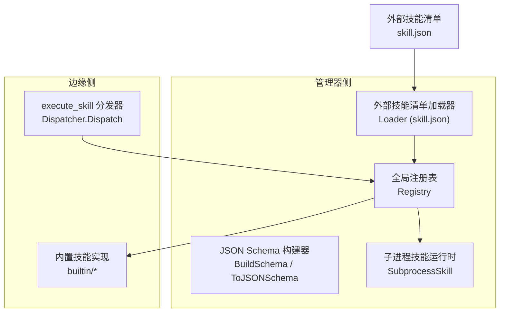
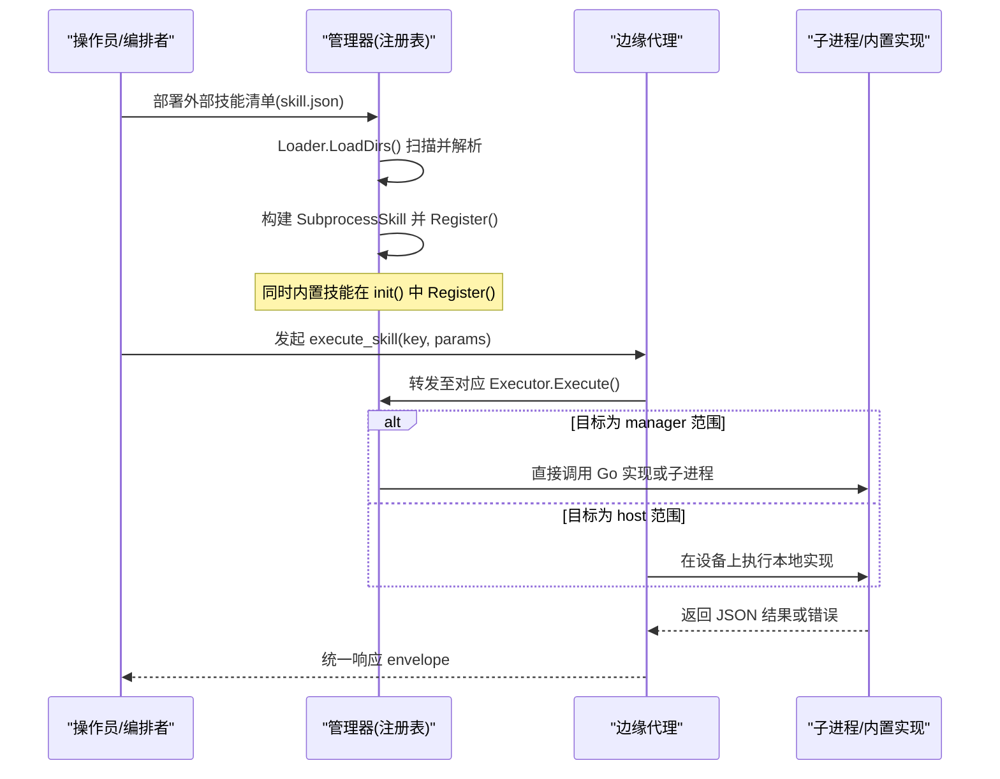
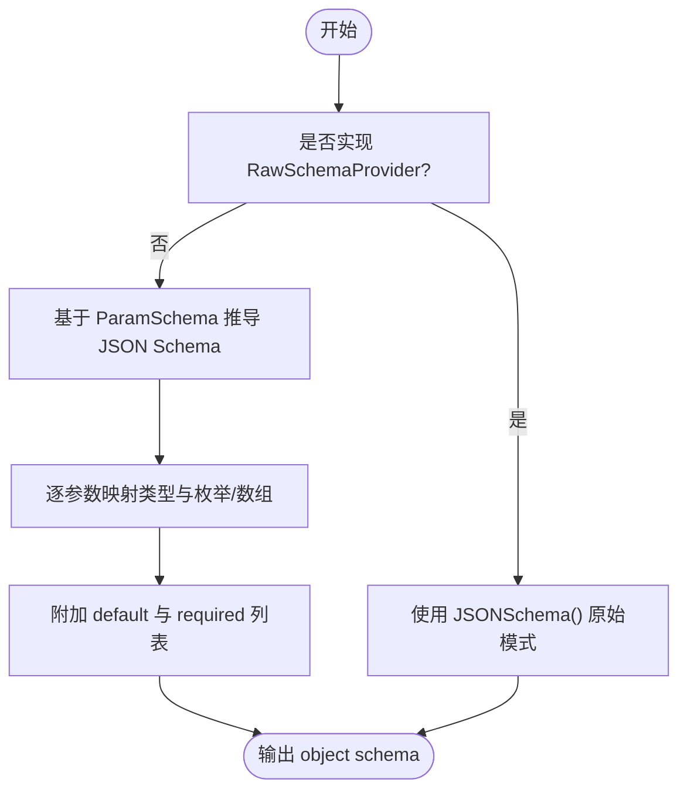
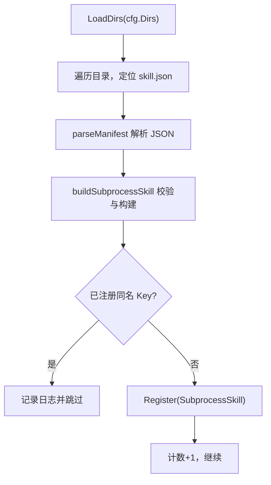
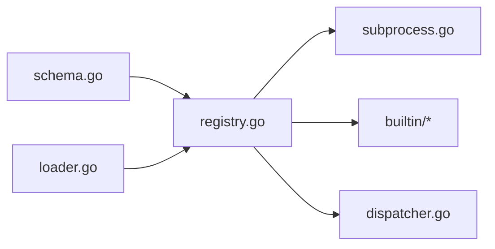

# 技能定义规范

<cite>
**本文引用的文件**   
- [internal/skill/types.go](file://internal/skill/types.go)
- [internal/skill/schema.go](file://internal/skill/schema.go)
- [internal/skill/loader.go](file://internal/skill/loader.go)
- [internal/skill/registry.go](file://internal/skill/registry.go)
- [internal/skill/subprocess.go](file://internal/skill/subprocess.go)
- [internal/edgeagent/skill/dispatcher.go](file://internal/edgeagent/skill/dispatcher.go)
- [skills/bash/SKILL.md](file://skills/bash/SKILL.md)
- [skills/restart-service/SKILL.md](file://skills/restart-service/SKILL.md)
- [internal/skill/builtin/probe_http.go](file://internal/skill/builtin/probe_http.go)
- [internal/skill/builtin/web_search.go](file://internal/skill/builtin/web_search.go)
- [internal/skill/builtin/tail_file.go](file://internal/skill/builtin/tail_file.go)
</cite>

## 目录
1. [引言](#引言)
2. [项目结构](#项目结构)
3. [核心组件](#核心组件)
4. [架构总览](#架构总览)
5. [详细组件分析](#详细组件分析)
6. [依赖关系分析](#依赖关系分析)
7. [性能与安全性考量](#性能与安全性考量)
8. [故障排查指南](#故障排查指南)
9. [结论](#结论)
10. [附录：SKILL.md 规范与最佳实践](#附录skillmd-规范与最佳实践)

## 引言
本规范面向技能开发者，系统化阐述 ongrid 的“技能”（Skill）定义与运行模型。重点包括：
- SKILL.md 文件格式与元数据字段（Key、Name、Description、Class、Scope、Category）
- 参数模式定义（ParamSchema）及其 JSON Schema 映射
- 权限分类系统（safe、mutating、dangerous）
- 执行范围（ScopeHost vs ScopeManager）的设计理念与适用场景
- 参数类型系统（string、int、float、bool、duration、enum、array）及验证规则
- 完整示例与预定义技能实现分析
- 面向开发者的定义规范与最佳实践

## 项目结构
与技能体系相关的核心代码位于 internal/skill 与 edge agent 的 skill 分发器中；外部可加载技能通过 manifest 描述并由 Loader 注册；内置技能位于 internal/skill/builtin。

图表来源
- [internal/skill/registry.go:1-127](file://internal/skill/registry.go#L1-L127)
- [internal/skill/schema.go:1-96](file://internal/skill/schema.go#L1-L96)
- [internal/skill/subprocess.go:1-268](file://internal/skill/subprocess.go#L1-L268)
- [internal/skill/loader.go:1-274](file://internal/skill/loader.go#L1-L274)
- [internal/edgeagent/skill/dispatcher.go:1-56](file://internal/edgeagent/skill/dispatcher.go#L1-L56)

章节来源
- [internal/skill/registry.go:1-127](file://internal/skill/registry.go#L1-L127)
- [internal/skill/schema.go:1-96](file://internal/skill/schema.go#L1-L96)
- [internal/skill/loader.go:1-274](file://internal/skill/loader.go#L1-L274)
- [internal/skill/subprocess.go:1-268](file://internal/skill/subprocess.go#L1-L268)
- [internal/edgeagent/skill/dispatcher.go:1-56](file://internal/edgeagent/skill/dispatcher.go#L1-L56)

## 核心组件
- 元数据与类型
  - Metadata：包含 Key、Name、Description、Class、Scope、Category、Params、ResultPreview 等字段，用于自动注册 LLM 工具、HTTP 路由、UI 表单与审计日志。
  - ParamSchema：有序的参数声明，生成 UI 表单与 LLM function-calling JSON Schema。
  - Class：权限分类 safe、mutating、dangerous。
  - Scope：执行范围 host（默认，设备侧）或 manager（管理器侧）。
- 注册与发现
  - Registry：进程级技能目录，提供 Register/Get/All/AllByClass。
- 参数模式与校验
  - BuildSchema：优先使用 RawSchemaProvider 提供的 JSON Schema，否则从 Metadata.Params 推导。
  - ToJSONSchema：将 ParamSchema 转换为 OpenAI function-calling 兼容的 object schema。
- 外部技能加载
  - Loader：扫描指定目录下的 skill.json，解析并注册为 SubprocessSkill。
  - SubprocessSkill：以独立进程方式运行外部可执行，stdin/stdout 交换 JSON，支持超时与环境白名单。
- 边缘侧分发
  - Dispatcher：接收 execute_skill RPC，按 key 查找 Executor 并调用 Execute，统一封装结果与错误。

章节来源
- [internal/skill/types.go:1-241](file://internal/skill/types.go#L1-L241)
- [internal/skill/schema.go:1-96](file://internal/skill/schema.go#L1-L96)
- [internal/skill/registry.go:1-127](file://internal/skill/registry.go#L1-L127)
- [internal/skill/loader.go:1-274](file://internal/skill/loader.go#L1-L274)
- [internal/skill/subprocess.go:1-268](file://internal/skill/subprocess.go#L1-L268)
- [internal/edgeagent/skill/dispatcher.go:1-56](file://internal/edgeagent/skill/dispatcher.go#L1-L56)

## 架构总览
下图展示了从外部清单到管理器注册、再到边缘调用的整体流程。

图表来源
- [internal/skill/loader.go:1-274](file://internal/skill/loader.go#L1-L274)
- [internal/skill/registry.go:1-127](file://internal/skill/registry.go#L1-L127)
- [internal/skill/subprocess.go:1-268](file://internal/skill/subprocess.go#L1-L268)
- [internal/edgeagent/skill/dispatcher.go:1-56](file://internal/edgeagent/skill/dispatcher.go#L1-L56)

## 详细组件分析

### 元数据与权限分类（Metadata、Class、Scope）
- Key：稳定标识符，lower_snake，用于去重、审计、路由与 LLM 工具名。
- Name：人类可读名称。
- Description：对人与 LLM 都可见的描述，应说明能力与前置条件。
- Class：权限分类
  - safe：只读无副作用（探测、读取、检查）
  - mutating：修改状态但可逆（重启服务、杀进程）
  - dangerous：不可逆或影响集群（rm、reboot、drop table）
- Scope：执行范围
  - host（默认）：在目标边缘设备上执行，需要 edge_id/device_id 参数
  - manager：在管理器进程内执行，适合访问公网、调用外部 API、运行子进程包
- Category：自由分组标签，便于 UI 组织
- Params：输入模式，自动生成 UI 表单与 LLM JSON Schema
- ResultPreview：结果形状提示，供 UI 与 LLM 参考

章节来源
- [internal/skill/types.go:99-175](file://internal/skill/types.go#L99-L175)
- [internal/skill/types.go:190-224](file://internal/skill/types.go#L190-L224)

### 参数模式与类型系统（ParamSchema、ToJSONSchema）
- 支持的类型
  - string、int、float、bool、duration、enum、array
- 数组元素类型
  - ItemType 必须为上述标量之一，不支持嵌套数组
- 必填与默认值
  - Required 与 Default 互斥；Required 时不得设置 Default
- JSON Schema 映射
  - string/duration -> "string"
  - int -> "integer"
  - float -> "number"
  - bool -> "boolean"
  - enum -> "string" + "enum" 列表
  - array -> "array" + items 对象（根据 ItemType 映射）
- 可选扩展
  - 若 Executor 实现 RawSchemaProvider，则以其 JSONSchema() 为准，覆盖 ParamSchema 推导

图表来源
- [internal/skill/schema.go:1-96](file://internal/skill/schema.go#L1-L96)
- [internal/skill/types.go:177-188](file://internal/skill/types.go#L177-L188)

章节来源
- [internal/skill/schema.go:1-96](file://internal/skill/schema.go#L1-L96)
- [internal/skill/types.go:63-97](file://internal/skill/types.go#L63-L97)

### 执行范围设计（ScopeHost vs ScopeManager）
- ScopeHost（默认）
  - 适用于设备直连能力（探测端口、读取日志、查看进程等）
  - 由管理器通过隧道 MethodExecuteSkill 下发，LLM 工具包装需传入 device_id
- ScopeManager
  - 适用于需要访问公网、调用外部 API、运行子进程技能包的场景
  - 无需 device_id，直接在管理器进程内执行

适用建议
- 仅涉及设备资源且受沙箱策略保护的能力优先选择 host
- 需要网络出站、外部集成或复杂脚本打包的场景选择 manager

章节来源
- [internal/skill/types.go:47-61](file://internal/skill/types.go#L47-L61)

### 外部技能清单（skill.json）与加载器（Loader）
- 清单字段
  - name：技能键（lower_snake），同 native 校验规则
  - description：显示给人类与 LLM 的描述
  - schema：可选的原始 JSON Schema，缺失时使用空对象
  - entry：入口可执行路径，相对路径相对于清单所在目录解析
  - env_allow：允许透传的环境变量名列表（默认不继承任何环境变量）
  - timeout_seconds：子进程超时，零值回退到默认 30s
  - class：权限分类，空值等价于 safe
  - category：分组标签，空值默认为 external
- 安全约束
  - entry 必须位于配置的 allowlist 根目录下，禁止通过 .. 或符号链接逃逸
  - 子进程环境严格白名单，避免泄露敏感信息
- 加载流程
  - LoadDirs 遍历配置目录，递归查找 skill.json
  - parseManifest 解析清单
  - buildSubprocessSkill 构建 SubprocessSkill 并 Validate
  - Register 注册到全局注册表，重复 key 跳过而非崩溃

图表来源
- [internal/skill/loader.go:75-161](file://internal/skill/loader.go#L75-L161)
- [internal/skill/loader.go:176-254](file://internal/skill/loader.go#L176-L254)

章节来源
- [internal/skill/loader.go:13-53](file://internal/skill/loader.go#L13-L53)
- [internal/skill/loader.go:75-161](file://internal/skill/loader.go#L75-L161)
- [internal/skill/loader.go:176-254](file://internal/skill/loader.go#L176-L254)

### 子进程技能运行时（SubprocessSkill）
- 执行契约
  - stdin：JSON 参数体（空参时注入 "{}"）
  - stdout：JSON 结果体（非合法 JSON 视为错误）
  - stderr：错误诊断尾部片段
  - 退出码：非零视为错误
- 安全与资源限制
  - 强制 ScopeManager
  - 绝对路径校验与存在性检查
  - 输出大小上限（stdout 最大 16MiB，stderr 保留尾部 4KiB）
  - 超时控制（默认 30s）
  - 环境变量白名单（deny by default）

章节来源
- [internal/skill/subprocess.go:30-78](file://internal/skill/subprocess.go#L30-L78)
- [internal/skill/subprocess.go:112-172](file://internal/skill/subprocess.go#L112-L172)
- [internal/skill/subprocess.go:174-193](file://internal/skill/subprocess.go#L174-L193)

### 边缘侧分发器（Dispatcher）
- 职责
  - 解析 execute_skill 请求体
  - 按 key 查找 Executor
  - 调用 Execute 并将结果或错误统一封装为 {result, error}
- 错误处理
  - 未知 key 返回错误消息
  - 执行错误不导致 RPC 失败，便于上层渲染与审计

章节来源
- [internal/edgeagent/skill/dispatcher.go:16-56](file://internal/edgeagent/skill/dispatcher.go#L16-L56)

### 预定义技能实现分析
- HTTP 探测（host_probe_http）
  - 类别：safe，范围：host
  - 参数：url(string)、method(enum: GET/HEAD)、timeout_ms(int)
  - 行为：发起 HEAD/GET，返回状态码、延迟、内容长度
- 联网搜索（web_search）
  - 类别：safe，范围：manager
  - 参数：query(string)、max_results(int)、include_domains(string)、exclude_domains(string)、provider(enum)
  - 行为：根据 provider 调用 SearXNG/Tavily/Brave，返回标准化结果集
- 文件尾部读取（host_tail_file）
  - 类别：safe，范围：host
  - 参数：path(string)、lines(int)、max_bytes(int)
  - 行为：读取最后 N 行，限制字节数，防止路径穿越

章节来源
- [internal/skill/builtin/probe_http.go:15-47](file://internal/skill/builtin/probe_http.go#L15-L47)
- [internal/skill/builtin/web_search.go:162-195](file://internal/skill/builtin/web_search.go#L162-L195)
- [internal/skill/builtin/tail_file.go:23-46](file://internal/skill/builtin/tail_file.go#L23-L46)

## 依赖关系分析
- 模块耦合
  - registry 被 loader、subprocess、builtin 与 dispatcher 共同依赖
  - schema 被 builder 与 LLM 工具注册层使用
  - loader 依赖 filesystem 与 path 安全校验
  - subprocess 依赖 os/exec 与 io 限流
  - dispatcher 依赖 registry 进行运行时分发
- 潜在循环
  - 当前结构清晰，未见循环依赖
- 外部依赖
  - 子进程运行时依赖操作系统命令执行能力
  - web_search 依赖外部搜索服务（SearXNG/Tavily/Brave）

图表来源
- [internal/skill/registry.go:1-127](file://internal/skill/registry.go#L1-L127)
- [internal/skill/schema.go:1-96](file://internal/skill/schema.go#L1-L96)
- [internal/skill/loader.go:1-274](file://internal/skill/loader.go#L1-L274)
- [internal/skill/subprocess.go:1-268](file://internal/skill/subprocess.go#L1-L268)
- [internal/edgeagent/skill/dispatcher.go:1-56](file://internal/edgeagent/skill/dispatcher.go#L1-L56)

## 性能与安全性考量
- 性能
  - 子进程启动开销：合理设置 timeout_seconds，避免频繁短生命周期任务
  - 输出裁剪：stdout 与 stderr 有上限，避免内存膨胀
  - 并发：注册阶段单线程，运行时并发读取注册表，注意临界区最小化
- 安全性
  - 权限分级：依据 Class 实施审批与审计策略
  - 执行范围：host 侧受 cmdpolicy 沙箱约束；manager 侧通过 allowlist 目录与环境白名单隔离
  - 路径安全：entry 必须在 allowlist 根下，禁止符号链接逃逸
  - 参数校验：ParamSchema 仅做形状校验，Execute 仍需防御性解析与语义校验

[本节为通用指导，不直接分析具体文件]

## 故障排查指南
- 常见错误
  - 未知 key：检查注册表是否正确加载与命名一致
  - 子进程未找到或不可执行：确认 entry 绝对路径与权限
  - 参数 JSON 非法：检查 LLM 生成的参数是否符合 JSON Schema
  - 超时：调整 timeout_seconds 或优化子进程逻辑
  - 输出非 JSON：确保子进程仅输出合法 JSON
- 调试建议
  - 启用 Loader 日志，观察注册与跳过原因
  - 捕获 stderr 尾部片段，快速定位子进程异常
  - 在 manager 侧注入测试 HTTP 客户端或 resolver，隔离外部依赖问题

章节来源
- [internal/skill/loader.go:115-161](file://internal/skill/loader.go#L115-L161)
- [internal/skill/subprocess.go:112-172](file://internal/skill/subprocess.go#L112-L172)
- [internal/edgeagent/skill/dispatcher.go:24-56](file://internal/edgeagent/skill/dispatcher.go#L24-L56)

## 结论
本规范明确了 ongrid 技能体系的元数据、参数模式、权限分类与执行范围设计，并通过 Loader 与 SubprocessSkill 实现了可扩展的外部技能生态。遵循本规范可实现安全的、可审计的、跨 host/manager 的统一能力接入。

[本节为总结，不直接分析具体文件]

## 附录：SKILL.md 规范与最佳实践

### SKILL.md 文件结构与字段
- 前置 YAML 头（Frontmatter）
  - name：技能键（lower_snake），与 Key 一致
  - description：能力描述
  - when_to_use：何时使用该技能的说明
  - metadata：
    - os：目标操作系统（如 linux）
    - requires：依赖的二进制或库
    - ongrid：
      - scope：edge（即 host）或 manager
      - edge_runtime：subprocess（子进程）或其他运行时
      - edge_capabilities：能力白名单（二进制、操作集合）
      - activation：激活策略（always/keyword 等）
      - min_ongrid_version：最低版本要求
- 正文
  - 调用规则：参数说明、必填项、默认值、取值范围
  - 允许/拒绝的分类与示例
  - 推荐套路与反模式
  - 实现说明（策略、限制、默认值）

章节来源
- [skills/bash/SKILL.md:1-188](file://skills/bash/SKILL.md#L1-L188)
- [skills/restart-service/SKILL.md:1-82](file://skills/restart-service/SKILL.md#L1-L82)

### 完整示例要点
- bash 诊断工具（host_bash）
  - scope: edge，edge_runtime: subprocess
  - 明确 read-only 策略与受限命令集
  - 给出典型用法与不要做的事
- 重启服务（host_restart_service）
  - scope: edge，edge_runtime: subprocess
  - mutating 类，触发 reviewer 二审
  - 白名单 service 列表与审计 reason 要求

章节来源
- [skills/bash/SKILL.md:29-108](file://skills/bash/SKILL.md#L29-L108)
- [skills/restart-service/SKILL.md:17-30](file://skills/restart-service/SKILL.md#L17-L30)

### 最佳实践
- 元数据
  - Key 使用 lower_snake，保持唯一与稳定
  - Description 清晰表达用途与前置条件
  - Class 谨慎选择，带副作用必须显式标注
  - Scope 优先 host，仅在必要时使用 manager
  - Category 合理分组，便于 UI 展示
- 参数模式
  - 使用 ParamSchema 表达必要性与默认值
  - 对敏感参数增加 Desc 与取值范围说明
  - 如需复杂结构，实现 RawSchemaProvider 提供自定义 JSON Schema
- 安全与健壮性
  - 在 Execute 中进行防御性解析与语义校验
  - 对路径、URL、枚举等进行边界检查
  - 子进程限定环境与超时，限制输出大小
- 文档与可观测性
  - 在 SKILL.md 中写明调用规则、白名单与反模式
  - 提供 ResultPreview 帮助 UI 与 LLM 理解结果
  - 记录关键决策与默认值，便于审计与复盘

[本节为通用指导，不直接分析具体文件]