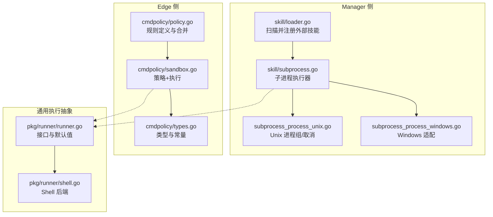
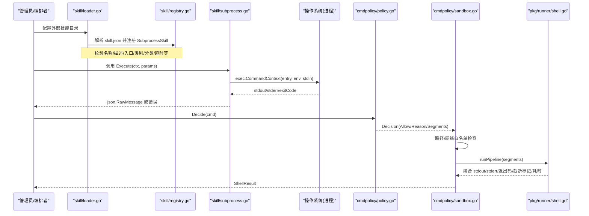
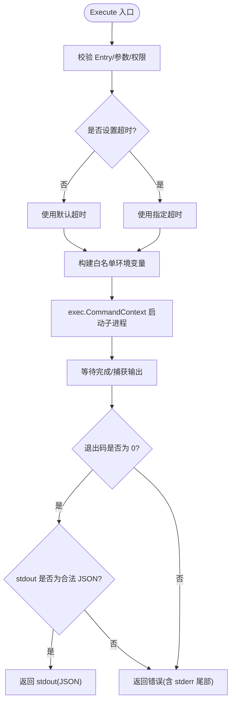
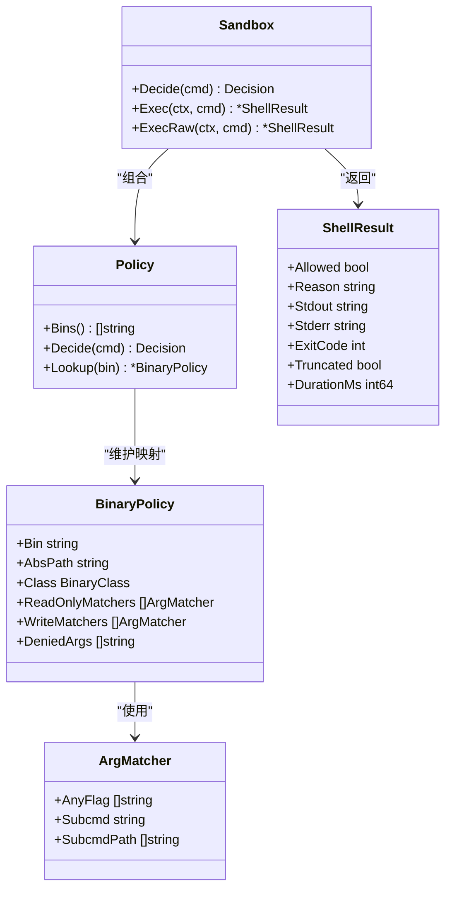
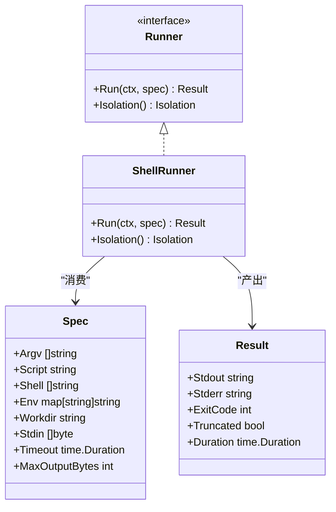
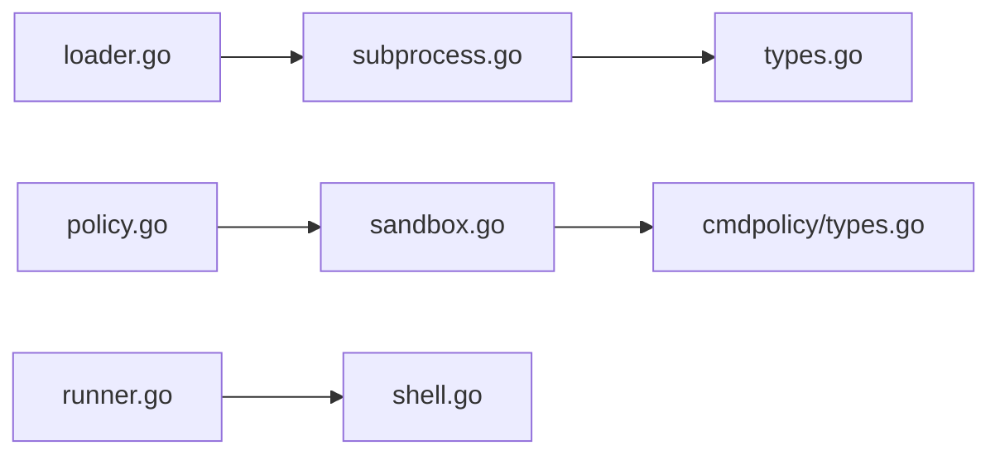

# 技能执行环境

<cite>
**本文引用的文件列表**
- [internal/skill/subprocess.go](file://internal/skill/subprocess.go)
- [internal/skill/subprocess_process_unix.go](file://internal/skill/subprocess_process_unix.go)
- [internal/skill/subprocess_process_windows.go](file://internal/skill/subprocess_process_windows.go)
- [internal/skill/loader.go](file://internal/skill/loader.go)
- [internal/skill/types.go](file://internal/skill/types.go)
- [internal/edgeagent/cmdpolicy/sandbox.go](file://internal/edgeagent/cmdpolicy/sandbox.go)
- [internal/edgeagent/cmdpolicy/policy.go](file://internal/edgeagent/cmdpolicy/policy.go)
- [internal/edgeagent/cmdpolicy/types.go](file://internal/edgeagent/cmdpolicy/types.go)
- [internal/pkg/runner/shell.go](file://internal/pkg/runner/shell.go)
- [internal/pkg/runner/runner.go](file://internal/pkg/runner/runner.go)
</cite>

## 目录
1. [简介](#简介)
2. [项目结构](#项目结构)
3. [核心组件](#核心组件)
4. [架构总览](#架构总览)
5. [详细组件分析](#详细组件分析)
6. [依赖关系分析](#依赖关系分析)
7. [性能考量](#性能考量)
8. [故障排查指南](#故障排查指南)
9. [结论](#结论)
10. [附录：开发者指南与优化建议](#附录开发者指南与优化建议)

## 简介
本文件面向开发者，系统性阐述“技能执行环境”的设计与实现，重点覆盖以下方面：
- 沙箱机制：进程隔离、资源限制与安全控制
- 跨平台差异：Unix 与 Windows 的具体实现差异
- 执行上下文管理：环境变量注入、工作目录设置、资源清理
- 超时控制与异常处理
- 执行性能监控与日志记录
- 自定义执行器开发指南与性能优化建议

该能力在系统中由多条路径共同支撑：
- Manager 侧的“外部子进程技能”（SubprocessSkill）通过白名单目录加载并安全地以子进程方式运行可执行文件
- Edge 侧的“命令策略 + 沙箱”（cmdpolicy）对 shell 命令进行细粒度白名单、参数匹配、网络目标白名单、输出上限与超时保护
- 统一的“Runner 抽象”（pkg/runner）提供可扩展的执行后端（当前为无隔离的子进程 shell，未来可扩展容器/微 VM）

## 项目结构
围绕“技能执行环境”的关键代码分布在如下模块：
- internal/skill：Manager 侧的外部子进程技能框架（加载、注册、执行、安全约束）
- internal/edgeagent/cmdpolicy：Edge 侧的命令策略与沙箱执行器（解析、决策、管道执行、输出/超时控制）
- internal/pkg/runner：统一执行抽象与默认 Shell 后端（用于云侧工具、未来扩展）

图表来源
- [internal/skill/loader.go:1-274](file://internal/skill/loader.go#L1-L274)
- [internal/skill/subprocess.go:1-268](file://internal/skill/subprocess.go#L1-L268)
- [internal/skill/subprocess_process_unix.go:1-27](file://internal/skill/subprocess_process_unix.go#L1-L27)
- [internal/skill/subprocess_process_windows.go:1-8](file://internal/skill/subprocess_process_windows.go#L1-L8)
- [internal/edgeagent/cmdpolicy/policy.go:1-800](file://internal/edgeagent/cmdpolicy/policy.go#L1-L800)
- [internal/edgeagent/cmdpolicy/sandbox.go:1-550](file://internal/edgeagent/cmdpolicy/sandbox.go#L1-L550)
- [internal/edgeagent/cmdpolicy/types.go:1-182](file://internal/edgeagent/cmdpolicy/types.go#L1-L182)
- [internal/pkg/runner/runner.go:1-97](file://internal/pkg/runner/runner.go#L1-L97)
- [internal/pkg/runner/shell.go:1-150](file://internal/pkg/runner/shell.go#L1-L150)

章节来源
- [internal/skill/loader.go:1-274](file://internal/skill/loader.go#L1-L274)
- [internal/skill/subprocess.go:1-268](file://internal/skill/subprocess.go#L1-L268)
- [internal/edgeagent/cmdpolicy/sandbox.go:1-550](file://internal/edgeagent/cmdpolicy/sandbox.go#L1-L550)
- [internal/pkg/runner/shell.go:1-150](file://internal/pkg/runner/shell.go#L1-L150)

## 核心组件
- 外部子进程技能（SubprocessSkill）
  - 作用：将外部可执行文件作为“技能”在 Manager 侧以子进程方式运行，通过 stdin/stdout 传递 JSON 参数与结果。
  - 安全要点：强制 Scope=Manager；Entry 必须为绝对路径且位于白名单目录；仅允许白名单环境变量透传；输出大小限制；超时控制。
- 命令策略与沙箱（cmdpolicy）
  - 作用：在 Edge 侧对 LLM 驱动的 shell 命令进行白名单、参数匹配、网络目标白名单、路径白名单、输出上限与超时保护，并以管道形式组合多个子进程。
  - 安全要点：严格 argv 解析（禁止 shell 元字符/重定向/命令替换），按类区分只读/写操作，拒绝危险二进制，限制最大参数数量。
- 统一执行抽象（Runner）
  - 作用：为“带注入环境的命令/脚本执行”提供统一接口，当前默认后端为无隔离的 Shell 子进程，未来可扩展容器/微 VM。
  - 安全要点：不继承父进程环境，完全由调用方传入 Env；支持工作目录与输出上限；超时控制。

章节来源
- [internal/skill/types.go:1-241](file://internal/skill/types.go#L1-L241)
- [internal/skill/subprocess.go:1-268](file://internal/skill/subprocess.go#L1-L268)
- [internal/edgeagent/cmdpolicy/types.go:1-182](file://internal/edgeagent/cmdpolicy/types.go#L1-L182)
- [internal/pkg/runner/runner.go:1-97](file://internal/pkg/runner/runner.go#L1-L97)

## 架构总览
下图展示了从“技能注册/加载”到“执行”的整体流程，以及 Manager 与 Edge 两条执行路径的差异。

图表来源
- [internal/skill/loader.go:1-274](file://internal/skill/loader.go#L1-L274)
- [internal/skill/subprocess.go:1-268](file://internal/skill/subprocess.go#L1-L268)
- [internal/edgeagent/cmdpolicy/policy.go:1-800](file://internal/edgeagent/cmdpolicy/policy.go#L1-L800)
- [internal/edgeagent/cmdpolicy/sandbox.go:1-550](file://internal/edgeagent/cmdpolicy/sandbox.go#L1-L550)
- [internal/pkg/runner/shell.go:1-150](file://internal/pkg/runner/shell.go#L1-L150)

## 详细组件分析

### 外部子进程技能（Manager 侧）
- 加载与注册
  - 扫描配置的白名单目录，解析每个 skill.json，构建 SubprocessSkill 并注册。
  - 入口路径必须为绝对路径，并通过符号链接展开后验证其位于允许的根目录下，防止逃逸。
- 执行流程
  - 参数校验：空参数自动补全为 "{}"；非空则需为合法 JSON。
  - 超时控制：若未显式设置，使用默认超时；基于 context.WithTimeout 控制。
  - 环境变量：仅透传白名单中的变量名，默认不继承父进程环境，避免密钥泄露。
  - 输出限制：stdout 有硬上限，stderr 保留尾部片段用于诊断。
  - 返回值：成功返回原始 stdout（JSON），失败返回错误（包含 stderr 尾部）。
- 跨平台差异
  - Unix：创建独立进程组，并在取消时向整个进程组发送 SIGKILL，确保子进程树被彻底终止。
  - Windows：保持最小化兼容，取消逻辑由 exec.CommandContext 负责。

图表来源
- [internal/skill/subprocess.go:1-268](file://internal/skill/subprocess.go#L1-L268)
- [internal/skill/subprocess_process_unix.go:1-27](file://internal/skill/subprocess_process_unix.go#L1-L27)
- [internal/skill/subprocess_process_windows.go:1-8](file://internal/skill/subprocess_process_windows.go#L1-L8)

章节来源
- [internal/skill/loader.go:1-274](file://internal/skill/loader.go#L1-L274)
- [internal/skill/subprocess.go:1-268](file://internal/skill/subprocess.go#L1-L268)

### 命令策略与沙箱（Edge 侧）
- 策略定义与合并
  - 内置只读基线策略，涵盖常见诊断二进制（ps、df、ss、find、grep、iptables -L 等），并对危险二进制直接拒绝。
  - 支持 YAML 覆盖：可新增/替换二进制规则、收紧路径/网络白名单、调整输出上限与超时。
- 决策流程（Decide）
  - 将输入命令拆分为管道段，逐段进行：
    - 参数数量上限检查
    - 二进制白名单与类判断（read-fs/read-system/mixed/network/denied）
    - 针对 mixed/network 类的读写匹配器判定
    - 全局 denied 参数黑名单匹配
- 执行流程（Exec/ExecRaw）
  - 路径白名单：所有以 "/" 开头的参数交由 PathValidator 校验（复用 host_files 的实现）。
  - 网络白名单：对 ClassNetwork 的二进制提取目标主机并与 allowlist 匹配。
  - 管道执行：按顺序连接 stdout→stdin，每段使用受限环境（PATH/LANG/LC_ALL），并设置进程组以便整体取消。
  - 输出上限：stdout/stderr 分别受 Cap 限制，命中上限时返回 Truncated=true。
  - 超时控制：基于 context.WithTimeout，超时返回特定错误信息。
  - ExecRaw：绕过所有策略检查，仅保留输出上限与超时保护，用于管理员“写门”场景。

图表来源
- [internal/edgeagent/cmdpolicy/types.go:1-182](file://internal/edgeagent/cmdpolicy/types.go#L1-L182)
- [internal/edgeagent/cmdpolicy/policy.go:1-800](file://internal/edgeagent/cmdpolicy/policy.go#L1-L800)
- [internal/edgeagent/cmdpolicy/sandbox.go:1-550](file://internal/edgeagent/cmdpolicy/sandbox.go#L1-L550)

章节来源
- [internal/edgeagent/cmdpolicy/policy.go:1-800](file://internal/edgeagent/cmdpolicy/policy.go#L1-L800)
- [internal/edgeagent/cmdpolicy/sandbox.go:1-550](file://internal/edgeagent/cmdpolicy/sandbox.go#L1-L550)
- [internal/edgeagent/cmdpolicy/types.go:1-182](file://internal/edgeagent/cmdpolicy/types.go#L1-L182)

### 统一执行抽象（Runner）
- 设计目标
  - 为“带注入环境的命令/脚本执行”提供统一接口，屏蔽底层隔离差异。
  - 当前默认后端为无隔离的 Shell 子进程，未来可扩展容器/微 VM。
- 关键特性
  - 环境变量：完全不继承父进程环境，由调用方传入完整 Env（包括 PATH）。
  - 工作目录：支持指定或临时目录（每次运行后清理）。
  - 输出上限：stdout/stderr 各自限制，超过上限标记 Truncated。
  - 超时控制：基于 context.WithTimeout，超时返回错误。
  - 结果对象：包含 stdout/stderr、退出码、是否截断、耗时。

图表来源
- [internal/pkg/runner/runner.go:1-97](file://internal/pkg/runner/runner.go#L1-L97)
- [internal/pkg/runner/shell.go:1-150](file://internal/pkg/runner/shell.go#L1-L150)

章节来源
- [internal/pkg/runner/runner.go:1-97](file://internal/pkg/runner/runner.go#L1-L97)
- [internal/pkg/runner/shell.go:1-150](file://internal/pkg/runner/shell.go#L1-L150)

## 依赖关系分析
- 内部耦合
  - skill/loader.go 依赖 skill/subprocess.go 与 types.go，负责将外部技能注册为 Manager 侧 Executor。
  - edgeagent/cmdpolicy 自包含策略与执行逻辑，Sandbox 组合 Policy 与 PathValidator（复用 host_files 的路径校验）。
  - pkg/runner 提供统一接口，当前 ShellRunner 实现与上层解耦，便于替换为容器/微 VM 后端。
- 外部依赖
  - 操作系统进程模型（Unix 进程组、信号；Windows 进程生命周期）。
  - 标准库 exec.CommandContext 用于上下文取消与超时。
- 潜在循环依赖
  - 各模块职责清晰，未见循环导入；策略层与执行层分离良好。

图表来源
- [internal/skill/loader.go:1-274](file://internal/skill/loader.go#L1-L274)
- [internal/skill/subprocess.go:1-268](file://internal/skill/subprocess.go#L1-L268)
- [internal/skill/types.go:1-241](file://internal/skill/types.go#L1-L241)
- [internal/edgeagent/cmdpolicy/policy.go:1-800](file://internal/edgeagent/cmdpolicy/policy.go#L1-L800)
- [internal/edgeagent/cmdpolicy/sandbox.go:1-550](file://internal/edgeagent/cmdpolicy/sandbox.go#L1-L550)
- [internal/edgeagent/cmdpolicy/types.go:1-182](file://internal/edgeagent/cmdpolicy/types.go#L1-L182)
- [internal/pkg/runner/runner.go:1-97](file://internal/pkg/runner/runner.go#L1-L97)
- [internal/pkg/runner/shell.go:1-150](file://internal/pkg/runner/shell.go#L1-L150)

章节来源
- [internal/skill/loader.go:1-274](file://internal/skill/loader.go#L1-L274)
- [internal/edgeagent/cmdpolicy/sandbox.go:1-550](file://internal/edgeagent/cmdpolicy/sandbox.go#L1-L550)
- [internal/pkg/runner/shell.go:1-150](file://internal/pkg/runner/shell.go#L1-L150)

## 性能考量
- 输出上限
  - Manager 子进程技能：stdout 上限 16 MiB，stderr 保留尾部 4 KiB，避免内存膨胀。
  - Edge 沙箱：stdout/stderr 上限可配置，命中上限时返回 Truncated 标志，提示上层重试或分页获取。
  - Runner：默认每流 1 MiB 上限，可通过 MaxOutputBytes 调整。
- 超时控制
  - Manager 子进程技能：默认 30 秒，可按技能清单配置。
  - Edge 沙箱：默认 30 秒，YAML 可覆盖。
  - Runner：默认 2 分钟，适合较长任务。
- 管道与进程组
  - Edge 沙箱按管道分段启动，最后一段的退出码作为整体结果；中间段管道断裂视为良性。
  - Unix 下通过进程组提升取消效率，避免僵尸进程。
- 资源泄漏防护
  - 工作目录：Runner 在未指定 Workdir 时使用临时目录并在完成后清理。
  - 环境变量：Runner 与 SubprocessSkill 均不继承父进程环境，降低敏感信息泄露风险。

[本节为通用性能讨论，无需具体文件引用]

## 故障排查指南
- 常见问题定位
  - 子进程无法启动：检查 Entry 是否存在且可执行；确认位于白名单目录；确认环境变量白名单是否包含必要项（如 PATH）。
  - 超时：确认技能/命令的超时配置是否合理；必要时拆分长任务或增加超时。
  - 输出过大：关注 Truncated 标志；在上层做分页或增量读取。
  - 策略拒绝：查看 Reason 字段，确认二进制是否在白名单、参数是否命中 WriteMatchers 或 DeniedArgs、网络目标是否在 allowlist。
- 调试建议
  - 启用日志：Loader 会记录注册/跳过事件；Sandbox 可结合 slog.Logger 输出关键决策。
  - 本地复现：使用 ExecRaw 绕过策略（仅限管理员授权场景）快速定位问题。
  - 观察退出码：非零退出码通常来自下游命令；结合 stderr 尾部信息进行诊断。

章节来源
- [internal/skill/loader.go:1-274](file://internal/skill/loader.go#L1-L274)
- [internal/edgeagent/cmdpolicy/sandbox.go:1-550](file://internal/edgeagent/cmdpolicy/sandbox.go#L1-L550)

## 结论
本系统通过“策略 + 沙箱 + 统一执行抽象”的分层设计，实现了跨平台、可配置、可审计的技能执行环境：
- Manager 侧以白名单目录与环境变量白名单为核心，保障外部子进程技能的安全可控
- Edge 侧以细粒度策略与管道执行为核心，兼顾可读性与安全性
- 统一 Runner 抽象为未来引入更强隔离（容器/微 VM）预留了平滑演进空间

[本节为总结性内容，无需具体文件引用]

## 附录：开发者指南与优化建议

### 自定义执行器开发指南
- 实现 Runner 接口
  - 在 internal/pkg/runner 中新增后端，实现 Run(ctx, spec) (Result, error) 与 Isolation() Isolation。
  - 参考 ShellRunner 的环境变量构建、工作目录设置、输出上限与超时控制模式。
- 集成到上层调用
  - 上层通过 Runner 接口选择不同隔离级别的后端；例如对高风险命令选择 IsolationContainer。
- 测试建议
  - 使用 mock 的 runner 接口模拟不同退出码、超时、输出截断等场景。
  - 覆盖跨平台行为差异（Unix 进程组取消 vs Windows 行为）。

章节来源
- [internal/pkg/runner/runner.go:1-97](file://internal/pkg/runner/runner.go#L1-L97)
- [internal/pkg/runner/shell.go:1-150](file://internal/pkg/runner/shell.go#L1-L150)

### 性能优化建议
- 合理设置输出上限与超时
  - 根据任务特征调整 MaxOutputBytes 与 Timeout，避免频繁截断或长时间占用资源。
- 减少不必要的管道链
  - 在 Edge 侧尽量将复杂逻辑下沉到单一可执行文件，减少管道段数与上下文切换开销。
- 预解析与缓存
  - 对固定策略（Policy）在启动时解析并缓存，避免重复 IO 与解析。
- 资源回收
  - 确保临时目录及时清理；在 Unix 下利用进程组保证子进程树完整回收。

[本节为通用优化建议，无需具体文件引用]