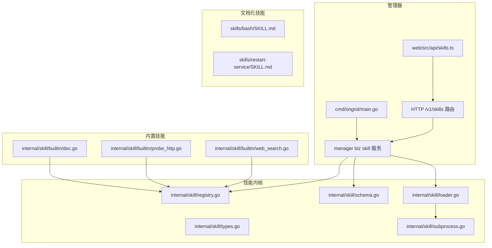
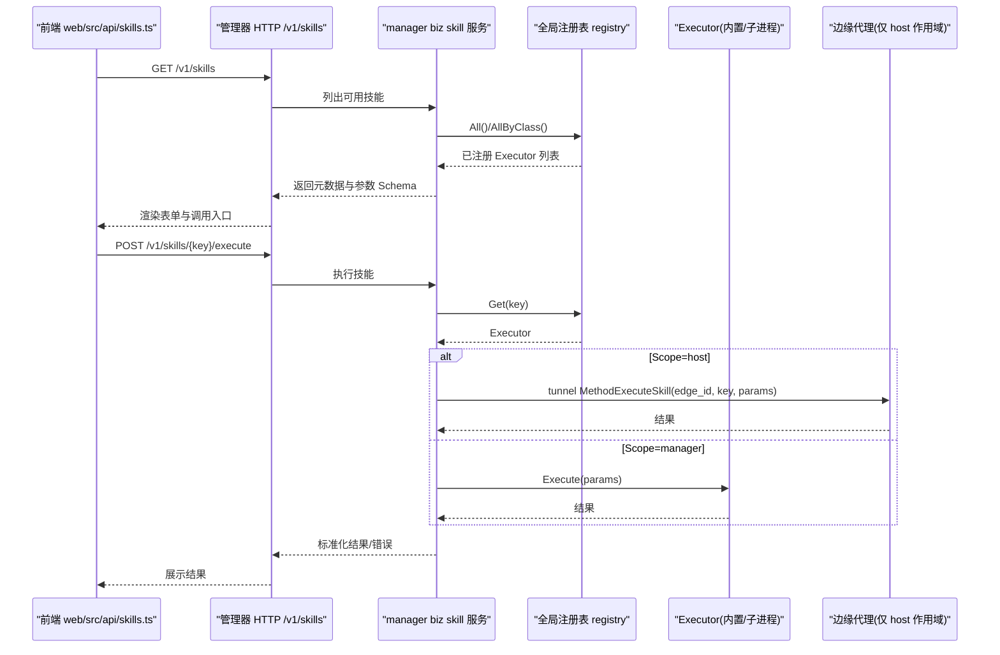
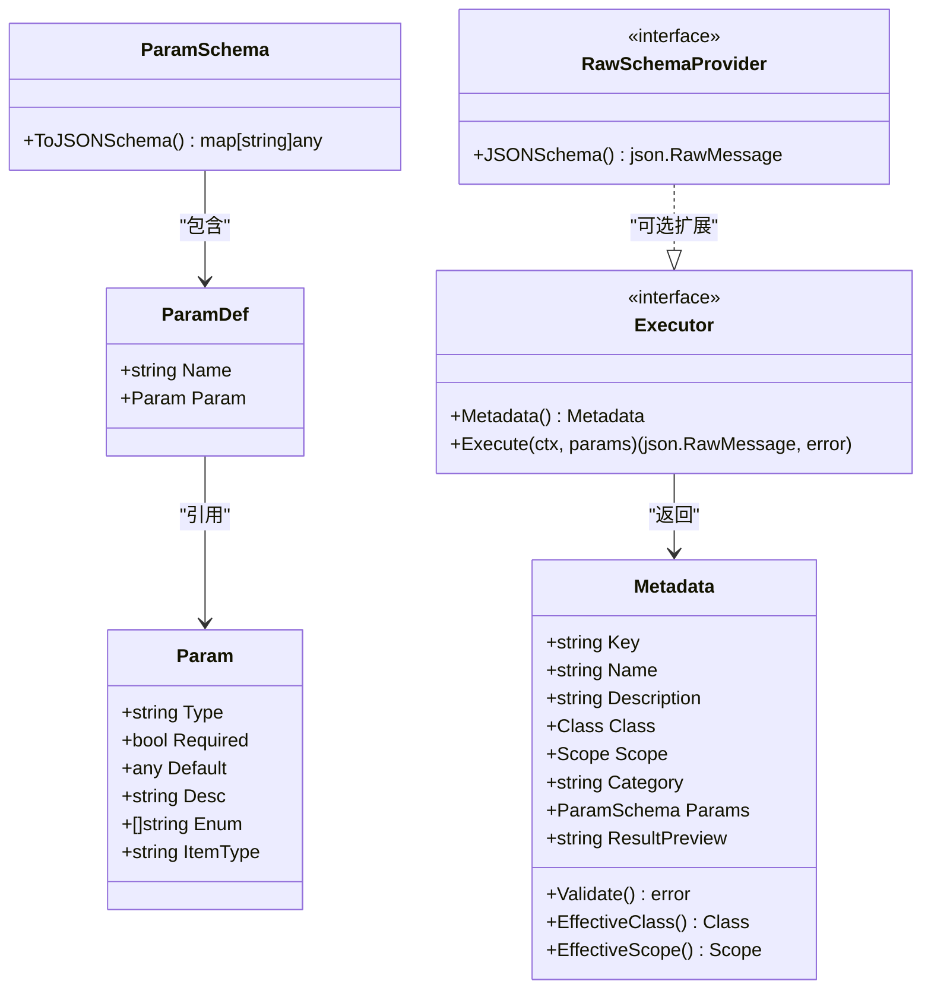
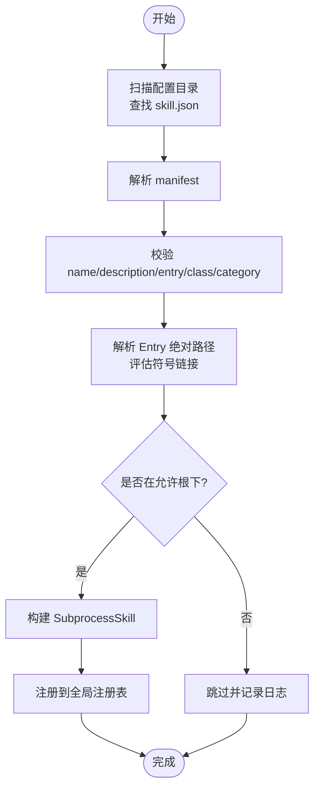
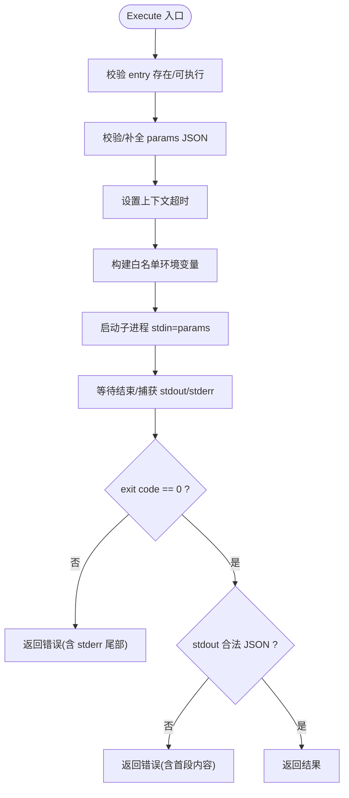
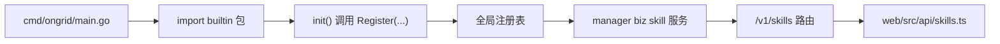

# 技能系统

<cite>
**本文引用的文件**   
- [internal/skill/types.go](file://internal/skill/types.go)
- [internal/skill/loader.go](file://internal/skill/loader.go)
- [internal/skill/registry.go](file://internal/skill/registry.go)
- [internal/skill/schema.go](file://internal/skill/schema.go)
- [internal/skill/subprocess.go](file://internal/skill/subprocess.go)
- [internal/skill/builtin/doc.go](file://internal/skill/builtin/doc.go)
- [internal/skill/builtin/probe_http.go](file://internal/skill/builtin/probe_http.go)
- [internal/skill/builtin/web_search.go](file://internal/skill/builtin/web_search.go)
- [cmd/ongrid/main.go](file://cmd/ongrid/main.go)
- [web/src/api/skills.ts](file://web/src/api/skills.ts)
- [skills/bash/SKILL.md](file://skills/bash/SKILL.md)
- [skills/restart-service/SKILL.md](file://skills/restart-service/SKILL.md)
</cite>

## 目录
1. [简介](#简介)
2. [项目结构](#项目结构)
3. [核心组件](#核心组件)
4. [架构总览](#架构总览)
5. [详细组件分析](#详细组件分析)
6. [依赖分析](#依赖分析)
7. [性能考虑](#性能考虑)
8. [故障排查指南](#故障排查指南)
9. [结论](#结论)
10. [附录：开发规范与最佳实践](#附录开发规范与最佳实践)

## 简介
本文件系统化阐述 ongrid 的“技能（Skill）”体系，覆盖设计理念、元数据与参数校验、执行环境隔离、加载机制、执行流程、安全控制、与 AIOPS 集成方式，以及面向开发者的完整规范与最佳实践。技能是设备侧或管理端可执行的原子能力单元，通过统一的注册表、调度器与审计通道接入 LLM 工具生态与前端 UI。

## 项目结构
技能系统由内核框架与内置实现组成：
- 内核框架：类型定义、注册表、Schema 生成、外部子进程技能加载与执行
- 内置技能：Go 实现的设备探测、日志读取、联网搜索等
- 文档化技能：以 SKILL.md 描述的设备侧能力（如 bash、重启服务），用于编排与策略约束
- 管理器集成：在管理器主进程中注册并暴露 /v1/skills 接口，供前端与 LLM 使用

图表来源
- [cmd/ongrid/main.go:1885-1946](file://cmd/ongrid/main.go#L1885-L1946)
- [internal/skill/registry.go:1-127](file://internal/skill/registry.go#L1-L127)
- [internal/skill/loader.go:1-274](file://internal/skill/loader.go#L1-L274)
- [internal/skill/subprocess.go:1-268](file://internal/skill/subprocess.go#L1-L268)
- [internal/skill/builtin/doc.go:1-26](file://internal/skill/builtin/doc.go#L1-L26)
- [internal/skill/builtin/probe_http.go:1-120](file://internal/skill/builtin/probe_http.go#L1-L120)
- [internal/skill/builtin/web_search.go:1-593](file://internal/skill/builtin/web_search.go#L1-L593)
- [web/src/api/skills.ts:1-82](file://web/src/api/skills.ts#L1-L82)

章节来源
- [cmd/ongrid/main.go:1885-1946](file://cmd/ongrid/main.go#L1885-L1946)
- [web/src/api/skills.ts:1-82](file://web/src/api/skills.ts#L1-L82)

## 核心组件
- 类型与元数据：定义权限等级、作用域、参数模式、结果预览等
- 注册表：全局注册、查询、按类过滤、并发安全
- Schema 生成：从声明式 ParamSchema 推导 JSON Schema，支持自定义 RawSchemaProvider
- 子进程技能：以独立二进制运行，stdin/stdout 交换 JSON，严格的环境白名单与超时限制
- 内置技能：Go 实现的安全探测、日志读取、联网搜索等
- 文档化技能：SKILL.md 描述设备侧能力与策略约束，配合边端沙箱执行

章节来源
- [internal/skill/types.go:1-241](file://internal/skill/types.go#L1-L241)
- [internal/skill/registry.go:1-127](file://internal/skill/registry.go#L1-L127)
- [internal/skill/schema.go:1-96](file://internal/skill/schema.go#L1-L96)
- [internal/skill/subprocess.go:1-268](file://internal/skill/subprocess.go#L1-L268)
- [internal/skill/builtin/doc.go:1-26](file://internal/skill/builtin/doc.go#L1-L26)
- [internal/skill/builtin/probe_http.go:1-120](file://internal/skill/builtin/probe_http.go#L1-L120)
- [internal/skill/builtin/web_search.go:1-593](file://internal/skill/builtin/web_search.go#L1-L593)
- [skills/bash/SKILL.md:1-188](file://skills/bash/SKILL.md#L1-L188)
- [skills/restart-service/SKILL.md:1-82](file://skills/restart-service/SKILL.md#L1-L82)

## 架构总览
技能系统在管理器中统一注册与暴露，在边缘侧通过 RPC 分发执行；LLM 工具与前端 UI 均基于同一份元数据自动生成。

图表来源
- [web/src/api/skills.ts:1-82](file://web/src/api/skills.ts#L1-L82)
- [cmd/ongrid/main.go:1885-1946](file://cmd/ongrid/main.go#L1885-L1946)
- [internal/skill/registry.go:1-127](file://internal/skill/registry.go#L1-L127)
- [internal/skill/types.go:1-241](file://internal/skill/types.go#L1-L241)

## 详细组件分析

### 类型与元数据（types.go）
- 权限等级 Class：safe/mutating/dangerous，决定审批与风控策略
- 作用域 Scope：host（在目标边缘执行，需 device_id）、manager（在管理器进程内执行）
- 参数模式 ParamSchema：string/int/float/bool/duration/enum/array，支持默认值与必填项
- 元数据 Metadata：Key/Name/Description/Class/Scope/Category/Params/ResultPreview
- 校验 Validate：对 Key 命名、Class/Scope 枚举、Param 类型与组合进行强校验
- 有效类与作用域：EffectiveClass/EffectiveScope 提供默认值兜底

图表来源
- [internal/skill/types.go:1-241](file://internal/skill/types.go#L1-L241)

章节来源
- [internal/skill/types.go:1-241](file://internal/skill/types.go#L1-L241)

### 注册表（registry.go）
- 全局注册 Register：重复 Key 或无效元数据会 panic，确保作者级错误尽早暴露
- 查询 Get/All/AllByClass：并发安全，支持按权限类筛选
- 测试友好：NewRegistryForTest 提供隔离实例

章节来源
- [internal/skill/registry.go:1-127](file://internal/skill/registry.go#L1-L127)

### Schema 生成（schema.go）
- BuildSchema：优先使用 RawSchemaProvider 提供的原始 JSON Schema，否则从 Metadata.Params 推导
- ToJSONSchema：将 ParamSchema 映射为 OpenAI function-calling 兼容的对象 schema

章节来源
- [internal/skill/schema.go:1-96](file://internal/skill/schema.go#L1-L96)

### 子进程技能加载与执行（loader.go + subprocess.go）
- 加载机制 LoadDirs：递归扫描配置目录下的 skill.json，解析并构建 SubprocessSkill，去重注册
- 路径安全：Entry 必须绝对路径且位于允许根目录下，解析符号链接后校验前缀
- 环境变量白名单：EnvAllow 显式放行，默认不继承任何环境变量
- 执行流程 Execute：
  - 参数校验与空体处理
  - 上下文超时控制
  - 标准输出上限与 stderr 尾部保留
  - 非零退出码与非法 JSON 输出报错
- 资源限制：MaxSubprocessStdout、MaxSubprocessStderrTail、DefaultSubprocessTimeout

图表来源
- [internal/skill/loader.go:1-274](file://internal/skill/loader.go#L1-L274)

图表来源
- [internal/skill/subprocess.go:1-268](file://internal/skill/subprocess.go#L1-L268)

章节来源
- [internal/skill/loader.go:1-274](file://internal/skill/loader.go#L1-L274)
- [internal/skill/subprocess.go:1-268](file://internal/skill/subprocess.go#L1-L268)

### 内置技能示例
- probe_http：发起 HEAD/GET 请求，返回状态码、延迟、内容长度，安全只读
- web_search：多后端联网搜索（SearXNG/Tavily/Brave），Manager 作用域，安全只读
- read_journal：读取 journald 日志（Linux 平台）
- restart_service：重启 systemd 服务（mutating，触发二审）

章节来源
- [internal/skill/builtin/doc.go:1-26](file://internal/skill/builtin/doc.go#L1-L26)
- [internal/skill/builtin/probe_http.go:1-120](file://internal/skill/builtin/probe_http.go#L1-L120)
- [internal/skill/builtin/web_search.go:1-593](file://internal/skill/builtin/web_search.go#L1-L593)
- [internal/skill/builtin/read_journal.go:1-53](file://internal/skill/builtin/read_journal.go#L1-L53)

### 文档化技能（SKILL.md）
- skills/bash/SKILL.md：描述设备侧只读 shell 能力，明确沙箱策略、允许命令分类、推荐套路与禁止事项
- skills/restart-service/SKILL.md：描述 mutating 重启服务流程，白名单与二审机制说明

章节来源
- [skills/bash/SKILL.md:1-188](file://skills/bash/SKILL.md#L1-L188)
- [skills/restart-service/SKILL.md:1-82](file://skills/restart-service/SKILL.md#L1-L82)

## 依赖分析
- 管理器主进程导入内置技能包，触发各技能的 init() 注册到全局注册表
- 管理器 skill 服务通过注册表获取 Executor，按 Scope 选择本地执行或转发至边缘
- 前端通过 /v1/skills 接口拉取元数据与参数 Schema，动态渲染表单与调用

图表来源
- [cmd/ongrid/main.go:1885-1946](file://cmd/ongrid/main.go#L1885-L1946)
- [internal/skill/builtin/doc.go:1-26](file://internal/skill/builtin/doc.go#L1-L26)
- [web/src/api/skills.ts:1-82](file://web/src/api/skills.ts#L1-L82)

章节来源
- [cmd/ongrid/main.go:1885-1946](file://cmd/ongrid/main.go#L1885-L1946)
- [internal/skill/builtin/doc.go:1-26](file://internal/skill/builtin/doc.go#L1-L26)
- [web/src/api/skills.ts:1-82](file://web/src/api/skills.ts#L1-L82)

## 性能考虑
- 子进程输出上限：stdout 最大 16 MiB，stderr 尾部保留 4 KiB，避免内存膨胀
- 默认超时：30s，可通过 manifest 指定 timeout_seconds
- 注册表读写分离：RWMutex 保护，批量 All/AllByClass 排序开销可控
- 网络请求：web_search 使用带超时的 http.Client，响应体限制读取

[本节为通用指导，无需源码引用]

## 故障排查指南
- 注册失败：检查 Key 命名规则、Class/Scope 枚举、Param 类型与组合是否合法
- 子进程无法执行：确认 Entry 绝对路径、可执行位、位于允许根目录、环境变量白名单
- 执行超时：调整 timeout_seconds 或优化子进程逻辑
- 输出非 JSON：确保子进程 stdout 输出合法 JSON
- 权限不足：根据 Class 级别走审批流程（mutating/dangerous）

章节来源
- [internal/skill/types.go:127-175](file://internal/skill/types.go#L127-L175)
- [internal/skill/loader.go:179-254](file://internal/skill/loader.go#L179-L254)
- [internal/skill/subprocess.go:112-172](file://internal/skill/subprocess.go#L112-L172)

## 结论
技能系统通过统一的元数据驱动、严格的参数校验与环境隔离，实现了跨设备与管理端的可插拔能力扩展。结合文档化技能与子进程模型，既保证了安全性与可观测性，又提供了灵活的编排与集成能力。

[本节为总结，无需源码引用]

## 附录：开发规范与最佳实践

### 元数据与参数设计
- 为每个技能提供清晰、准确的 Description 与 ResultPreview
- 合理使用 Class 与 Scope，避免误用 safe 掩盖副作用
- 参数尽量使用声明式 ParamSchema，复杂形状再采用 RawSchemaProvider

章节来源
- [internal/skill/types.go:99-175](file://internal/skill/types.go#L99-L175)
- [internal/skill/schema.go:1-96](file://internal/skill/schema.go#L1-L96)

### 子进程技能开发
- 使用 skill.json 清单描述 name/description/entry/env_allow/timeout_seconds/class/category
- Entry 路径相对 manifest 目录解析，并确保位于允许根目录
- 仅放行必要环境变量，避免泄露敏感信息
- 输出稳定 JSON，遵循约定键名，便于下游消费

章节来源
- [internal/skill/loader.go:13-53](file://internal/skill/loader.go#L13-L53)
- [internal/skill/loader.go:179-254](file://internal/skill/loader.go#L179-L254)
- [internal/skill/subprocess.go:174-193](file://internal/skill/subprocess.go#L174-L193)

### 内置 Go 技能开发
- 在各自子包中实现 Executor，并在 init() 中调用 Register
- 保持只读与安全默认，必要时标注 mutating/dangerous 并配合审批
- 为复杂参数提供 RawSchemaProvider 时，确保符合 OpenAI function-calling 期望

章节来源
- [internal/skill/builtin/doc.go:1-26](file://internal/skill/builtin/doc.go#L1-L26)
- [internal/skill/builtin/probe_http.go:1-120](file://internal/skill/builtin/probe_http.go#L1-L120)
- [internal/skill/builtin/web_search.go:1-593](file://internal/skill/builtin/web_search.go#L1-L593)

### 文档化技能（SKILL.md）
- 明确 when_to_use、metadata.os/requires/ondir.scope/edge_runtime/edge_capabilities
- 列出允许的命令分类与禁止行为，配合边端 cmdpolicy 沙箱
- 对于 mutating 操作，明确白名单与二审流程

章节来源
- [skills/bash/SKILL.md:1-188](file://skills/bash/SKILL.md#L1-L188)
- [skills/restart-service/SKILL.md:1-82](file://skills/restart-service/SKILL.md#L1-L82)

### 与 AIOPS 系统集成
- 管理器主进程导入 builtin 包，使所有内置技能自动注册
- 通过 manager biz skill 服务暴露 /v1/skills 接口，供前端与 LLM 使用
- 按 Class 过滤工具集，mutating/dangerous 走审批流

章节来源
- [cmd/ongrid/main.go:1885-1946](file://cmd/ongrid/main.go#L1885-L1946)
- [web/src/api/skills.ts:1-82](file://web/src/api/skills.ts#L1-L82)