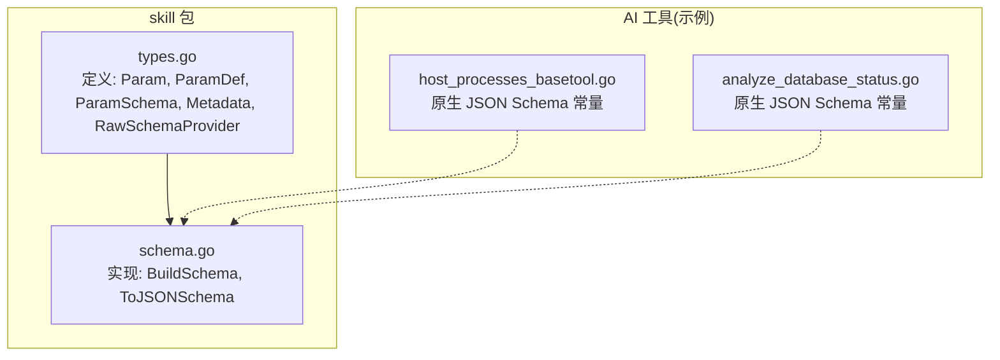
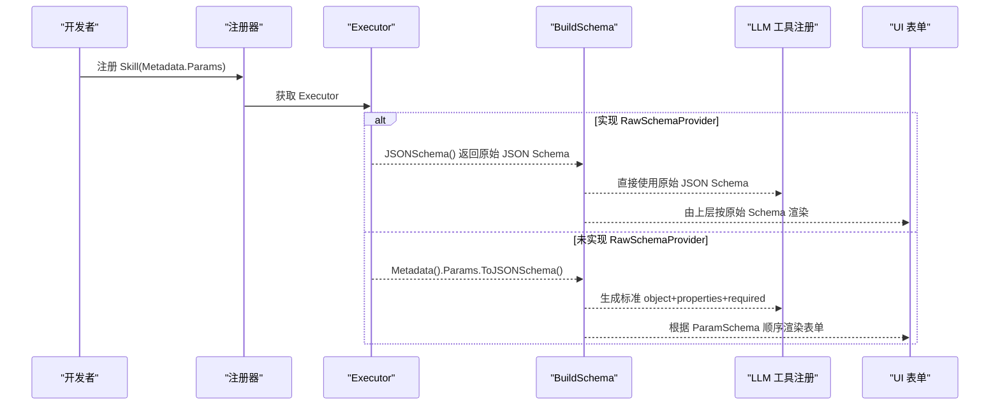
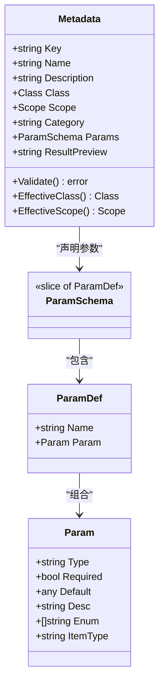
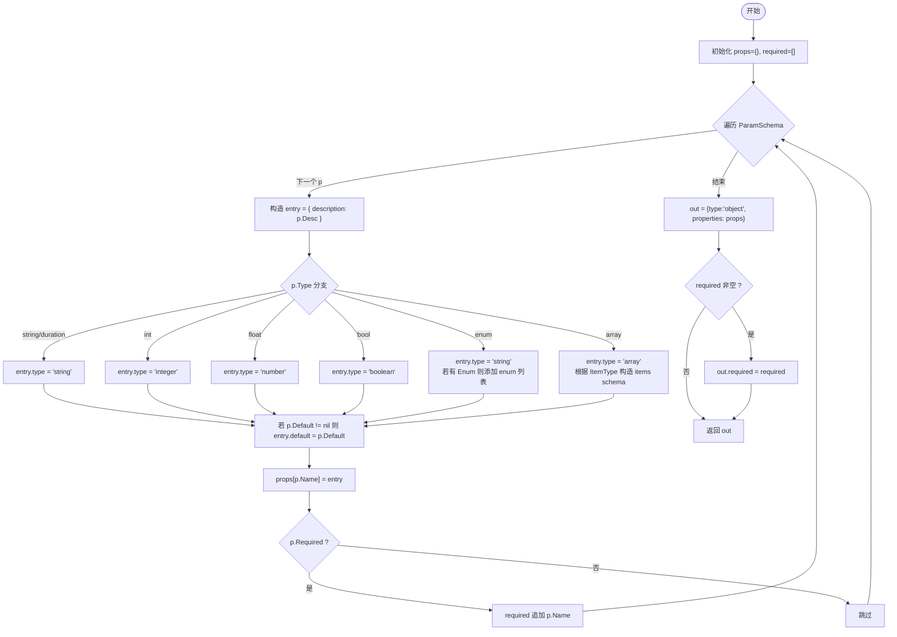
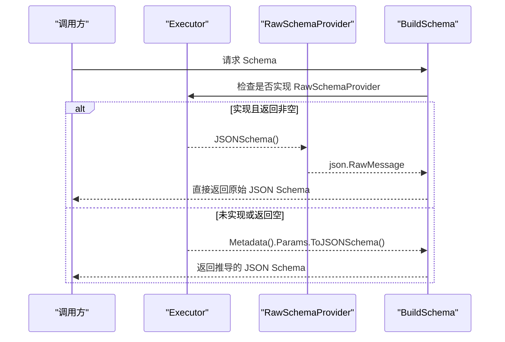
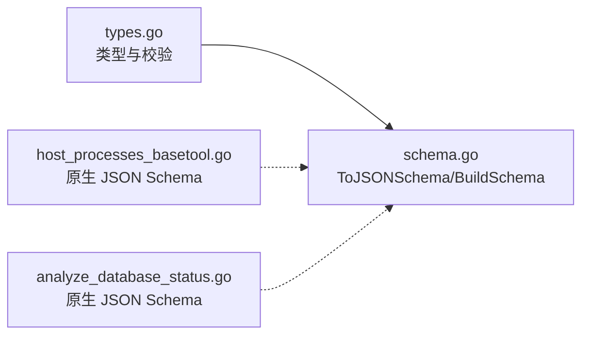

# 参数模式设计

<cite>
**本文引用的文件**
- [internal/skill/schema.go](file://internal/skill/schema.go)
- [internal/skill/types.go](file://internal/skill/types.go)
- [internal/manager/biz/aiops/tools/host_processes_basetool.go](file://internal/manager/biz/aiops/tools/host_processes_basetool.go)
- [internal/manager/biz/aiops/tools/analyze_database_status.go](file://internal/manager/biz/aiops/tools/analyze_database_status.go)
</cite>

## 目录
1. [引言](#引言)
2. [项目结构](#项目结构)
3. [核心组件](#核心组件)
4. [架构总览](#架构总览)
5. [详细组件分析](#详细组件分析)
6. [依赖关系分析](#依赖关系分析)
7. [性能与复杂度](#性能与复杂度)
8. [故障排查指南](#故障排查指南)
9. [结论](#结论)
10. [附录：类型与字段速查](#附录类型与字段速查)

## 引言
本指南聚焦于“参数模式设计”，围绕 Param 结构体、ParamSchema 声明方式、支持的参数类型、验证机制，以及 RawSchemaProvider 的使用场景进行系统化说明。目标是帮助开发者快速掌握如何以声明式方式定义工具（Skill）的参数，并理解其如何驱动 UI 表单渲染与 LLM 函数调用 JSON Schema 的生成。

## 项目结构
与参数模式相关的核心代码位于 skill 包中，包含类型定义、校验逻辑与 JSON Schema 构建；同时，在 manager 侧的 AI 工具中，存在使用原生 JSON Schema 的场景，用于表达更复杂的参数结构。

图表来源
- [internal/skill/types.go:63-188](file://internal/skill/types.go#L63-L188)
- [internal/skill/schema.go:12-95](file://internal/skill/schema.go#L12-L95)
- [internal/manager/biz/aiops/tools/host_processes_basetool.go:68-93](file://internal/manager/biz/aiops/tools/host_processes_basetool.go#L68-L93)
- [internal/manager/biz/aiops/tools/analyze_database_status.go:53-119](file://internal/manager/biz/aiops/tools/analyze_database_status.go#L53-L119)

章节来源
- [internal/skill/types.go:63-188](file://internal/skill/types.go#L63-L188)
- [internal/skill/schema.go:12-95](file://internal/skill/schema.go#L12-L95)

## 核心组件
本节深入解析 Param 结构体及其相关类型的设计原理与用法。

- Param 字段说明
  - Type：参数类型，支持 string、int、float、bool、duration、enum、array。其他值会在注册时拒绝。
  - Required：是否必填。若为 true，则不允许设置 Default。
  - Default：默认值，用于 UI 初始值与执行时的回退。当 Required 为 true 时必须为空。
  - Desc：描述文本，既用于 UI 提示，也用于 LLM 工具描述。
  - Enum：当 Type 为 enum 时，指定允许值集合。
  - ItemType：当 Type 为 array 时，指定元素类型，必须为标量类型之一。

- ParamSchema 与 ParamDef
  - ParamSchema 是有序的参数列表（切片），顺序影响 UI 渲染顺序。
  - ParamDef 将 Name 与 Param 扁平化，便于自动生成 UI 和 LLM Schema。

- 类型映射规则
  - string/duration -> "string"
  - int -> "integer"
  - float -> "number"
  - bool -> "boolean"
  - enum -> "string" + "enum" 数组
  - array -> "array" + items 子 schema（基于 ItemType 递归映射）

- 校验规则（注册期）
  - Key/Name/Description 必填且格式合法。
  - Type 必须在白名单内；当 Type=array 时，ItemType 必填且必须在白名单内。
  - Required 与 Default 互斥。

章节来源
- [internal/skill/types.go:63-188](file://internal/skill/types.go#L63-L188)
- [internal/skill/schema.go:22-95](file://internal/skill/schema.go#L22-L95)

## 架构总览
下图展示了从声明式参数到 JSON Schema 的生成路径，以及何时采用原始 JSON Schema。

图表来源
- [internal/skill/schema.go:12-20](file://internal/skill/schema.go#L12-L20)
- [internal/skill/types.go:177-188](file://internal/skill/types.go#L177-L188)

## 详细组件分析

### 组件一：Param 与 ParamSchema 设计
- 设计要点
  - 通过切片保持顺序，确保 UI 渲染顺序稳定可预期。
  - 将 Name 与 Param 扁平化为 ParamDef，简化序列化与前端消费。
  - 类型系统简洁明确，覆盖常见标量与枚举、数组等基础需求。
- 复杂度
  - 注册期 Validate 遍历一次 Params，时间复杂度 O(n)。
  - 生成 JSON Schema 时遍历一次 ParamSchema，时间复杂度 O(n)，空间复杂度 O(n) 用于构建 properties 与 required 列表。

图表来源
- [internal/skill/types.go:63-125](file://internal/skill/types.go#L63-L125)

章节来源
- [internal/skill/types.go:63-125](file://internal/skill/types.go#L63-L125)

### 组件二：ToJSONSchema 转换流程
- 输入：ParamSchema（有序）
- 输出：符合 OpenAI function-calling 风格的 JSON Schema（object + properties + required）
- 处理逻辑
  - 遍历每个 ParamDef，构造 entry 并填充 type、description、default、enum、items 等。
  - 根据 Required 收集 required 列表。
  - 最终组装为顶层 object schema。

图表来源
- [internal/skill/schema.go:34-95](file://internal/skill/schema.go#L34-L95)

章节来源
- [internal/skill/schema.go:34-95](file://internal/skill/schema.go#L34-L95)

### 组件三：RawSchemaProvider 接口与使用场景
- 适用场景
  - 需要表达复杂 JSON Schema（如嵌套对象、oneOf、条件约束等），无法用 ParamSchema 表达时。
  - 已有现成的 JSON Schema 常量，可直接复用。
- 行为优先级
  - 若 Executor 实现 RawSchemaProvider 且返回非空 JSON，则优先使用原始 Schema。
  - 否则回退到基于 Metadata.Params 自动推导的 Schema。

图表来源
- [internal/skill/schema.go:12-20](file://internal/skill/schema.go#L12-L20)
- [internal/skill/types.go:177-188](file://internal/skill/types.go#L177-L188)

章节来源
- [internal/skill/schema.go:12-20](file://internal/skill/schema.go#L12-L20)
- [internal/skill/types.go:177-188](file://internal/skill/types.go#L177-L188)

### 组件四：复杂参数模式的实现示例
- 数组参数
  - 使用 ParamSchema 时，Type=array，ItemType 指定元素类型（如 string/int）。
  - 或使用 RawSchemaProvider 提供原生 JSON Schema，例如设备 ID 列表、数据库类型过滤等。
- 枚举参数
  - 使用 ParamSchema 时，Type=enum，Enum 列出允许值。
  - 或使用 RawSchemaProvider 提供原生 JSON Schema，例如 sort_by 的可选值。

参考示例位置
- 原生 JSON Schema 示例（数组、枚举、minItems/maxItems 等）
  - [internal/manager/biz/aiops/tools/host_processes_basetool.go:68-93](file://internal/manager/biz/aiops/tools/host_processes_basetool.go#L68-L93)
  - [internal/manager/biz/aiops/tools/analyze_database_status.go:53-119](file://internal/manager/biz/aiops/tools/analyze_database_status.go#L53-L119)

章节来源
- [internal/manager/biz/aiops/tools/host_processes_basetool.go:68-93](file://internal/manager/biz/aiops/tools/host_processes_basetool.go#L68-L93)
- [internal/manager/biz/aiops/tools/analyze_database_status.go:53-119](file://internal/manager/biz/aiops/tools/analyze_database_status.go#L53-L119)

## 依赖关系分析
- 模块耦合
  - types.go 定义了所有核心类型与校验逻辑，schema.go 仅依赖这些类型进行转换。
  - AI 工具中的原生 JSON Schema 常量独立于 skill 包，但可通过 RawSchemaProvider 被统一消费。
- 外部依赖
  - 生成的 JSON Schema 需兼容 OpenAI function-calling 的 object+properties+required 形状。

图表来源
- [internal/skill/types.go:63-188](file://internal/skill/types.go#L63-L188)
- [internal/skill/schema.go:12-95](file://internal/skill/schema.go#L12-L95)
- [internal/manager/biz/aiops/tools/host_processes_basetool.go:68-93](file://internal/manager/biz/aiops/tools/host_processes_basetool.go#L68-L93)
- [internal/manager/biz/aiops/tools/analyze_database_status.go:53-119](file://internal/manager/biz/aiops/tools/analyze_database_status.go#L53-L119)

章节来源
- [internal/skill/types.go:63-188](file://internal/skill/types.go#L63-L188)
- [internal/skill/schema.go:12-95](file://internal/skill/schema.go#L12-L95)

## 性能与复杂度
- 时间复杂度
  - Validate：O(n)，n 为参数个数。
  - ToJSONSchema：O(n)，对每个参数进行一次分支判断与属性写入。
- 空间复杂度
  - 构建 properties 与 required 列表，O(n)。
- 优化建议
  - 对于大量参数的场景，避免在循环中进行昂贵的字符串拼接；当前实现已尽量使用 map 与切片追加。
  - 原生 JSON Schema 适合复杂结构，减少运行时转换开销。

[本节为通用性能讨论，不直接分析具体文件]

## 故障排查指南
- 注册期错误
  - 不支持的 Type 或 ItemType：检查是否在白名单内。
  - Type=array 缺少 ItemType：补全 ItemType。
  - Required 与 Default 同时设置：移除 Default 或将 Required 置为 false。
- 运行时问题
  - 若使用 RawSchemaProvider，请确保返回的 JSON Schema 有效且符合 object+properties+required 规范。
  - 若使用 ParamSchema，确认 Desc 与 Enum 填写完整，以便 UI 与 LLM 正确展示。

章节来源
- [internal/skill/types.go:153-175](file://internal/skill/types.go#L153-L175)

## 结论
- Param 与 ParamSchema 提供了轻量、易用的声明式参数模式，适用于大多数工具场景。
- 当需要表达复杂结构时，RawSchemaProvider 提供了灵活扩展点，保证向后兼容与能力上限。
- 通过严格的注册期校验与清晰的类型映射，确保了 UI 渲染与 LLM 调用的稳定性与一致性。

[本节为总结性内容，不直接分析具体文件]

## 附录：类型与字段速查
- 支持的 Type 与映射
  - string/duration -> "string"
  - int -> "integer"
  - float -> "number"
  - bool -> "boolean"
  - enum -> "string" + "enum"
  - array -> "array" + items（基于 ItemType）
- 关键字段
  - Required：必填控制
  - Default：默认值（不可与 Required 同时设置）
  - Desc：描述（UI 与 LLM 共用）
  - Enum：枚举值集合
  - ItemType：数组元素类型

章节来源
- [internal/skill/schema.go:27-78](file://internal/skill/schema.go#L27-L78)
- [internal/skill/types.go:63-86](file://internal/skill/types.go#L63-L86)