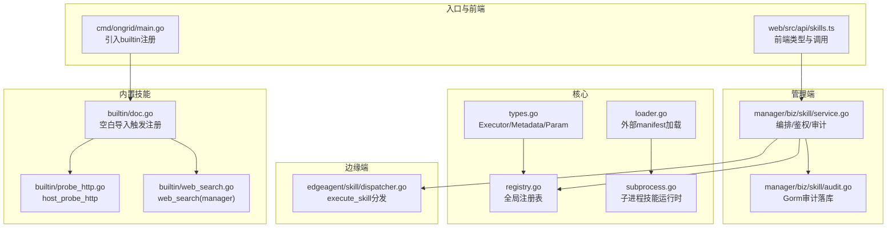
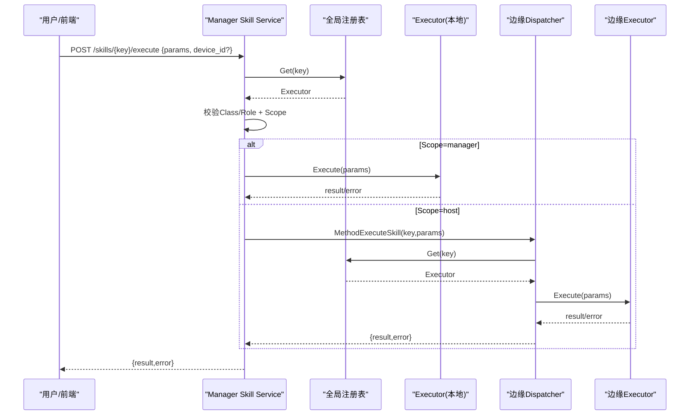
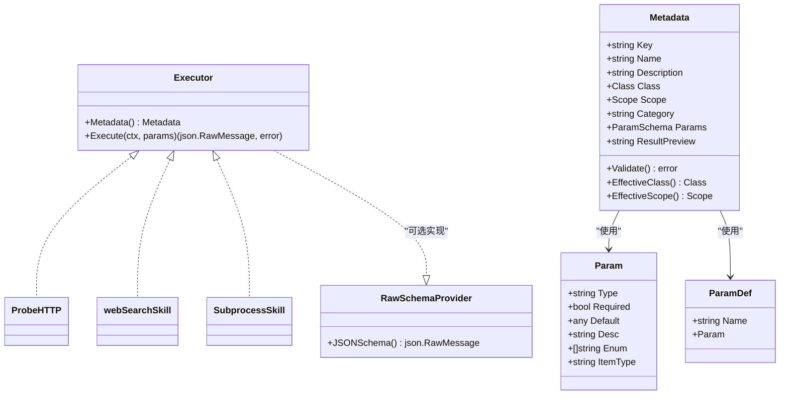
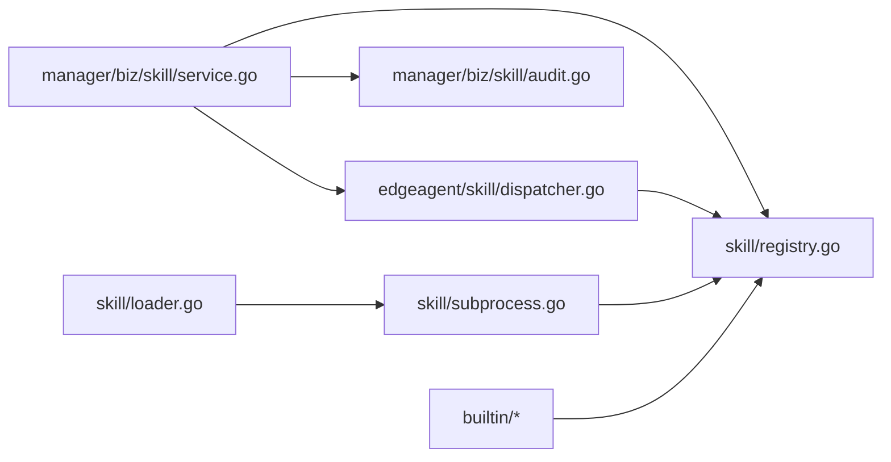
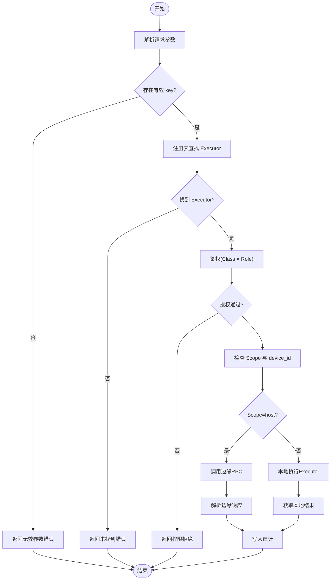

# 技能接口实现

<cite>
**本文引用的文件**   
- [internal/skill/types.go](file://internal/skill/types.go)
- [internal/skill/registry.go](file://internal/skill/registry.go)
- [internal/skill/loader.go](file://internal/skill/loader.go)
- [internal/skill/subprocess.go](file://internal/skill/subprocess.go)
- [internal/skill/builtin/doc.go](file://internal/skill/builtin/doc.go)
- [internal/skill/builtin/probe_http.go](file://internal/skill/builtin/probe_http.go)
- [internal/skill/builtin/web_search.go](file://internal/skill/builtin/web_search.go)
- [internal/edgeagent/skill/dispatcher.go](file://internal/edgeagent/skill/dispatcher.go)
- [internal/manager/biz/skill/service.go](file://internal/manager/biz/skill/service.go)
- [internal/manager/biz/skill/audit.go](file://internal/manager/biz/skill/audit.go)
- [cmd/ongrid/main.go](file://cmd/ongrid/main.go)
- [web/src/api/skills.ts](file://web/src/api/skills.ts)
</cite>

## 目录
1. [简介](#简介)
2. [项目结构](#项目结构)
3. [核心组件](#核心组件)
4. [架构总览](#架构总览)
5. [详细组件分析](#详细组件分析)
6. [依赖分析](#依赖分析)
7. [性能考虑](#性能考虑)
8. [故障排查指南](#故障排查指南)
9. [结论](#结论)
10. [附录](#附录)

## 简介
本指南面向希望为系统新增“技能（Skill）”的开发者，系统性阐述 Executor 接口的定义与实现要求、Metadata 元数据字段规范、权限分类 Class 的作用机制、执行范围 Scope 的概念与差异，并提供完整的实现示例路径与调用流程说明。通过该框架，新增一个技能仅需编写一个实现并注册一次，即可自动获得 LLM 工具注册、HTTP API、UI 表单、权限门控与审计日志等能力。

## 项目结构
技能框架由“核心类型与注册表”“内置技能”“边缘侧调度器”“管理器编排服务”“外部子进程技能加载器”“前端类型与API”组成。下图展示了关键模块与关系：

图表来源
- [internal/skill/types.go:1-241](file://internal/skill/types.go#L1-L241)
- [internal/skill/registry.go:1-127](file://internal/skill/registry.go#L1-L127)
- [internal/skill/loader.go:1-274](file://internal/skill/loader.go#L1-L274)
- [internal/skill/subprocess.go:1-268](file://internal/skill/subprocess.go#L1-L268)
- [internal/skill/builtin/doc.go:1-26](file://internal/skill/builtin/doc.go#L1-L26)
- [internal/skill/builtin/probe_http.go:1-120](file://internal/skill/builtin/probe_http.go#L1-L120)
- [internal/skill/builtin/web_search.go:1-593](file://internal/skill/builtin/web_search.go#L1-L593)
- [internal/edgeagent/skill/dispatcher.go:1-56](file://internal/edgeagent/skill/dispatcher.go#L1-L56)
- [internal/manager/biz/skill/service.go:1-347](file://internal/manager/biz/skill/service.go#L1-L347)
- [internal/manager/biz/skill/audit.go:1-72](file://internal/manager/biz/skill/audit.go#L1-L72)
- [cmd/ongrid/main.go:1856-1894](file://cmd/ongrid/main.go#L1856-L1894)
- [web/src/api/skills.ts:1-306](file://web/src/api/skills.ts#L1-L306)

章节来源
- [internal/skill/types.go:1-241](file://internal/skill/types.go#L1-L241)
- [internal/skill/registry.go:1-127](file://internal/skill/registry.go#L1-L127)
- [internal/skill/loader.go:1-274](file://internal/skill/loader.go#L1-L274)
- [internal/skill/subprocess.go:1-268](file://internal/skill/subprocess.go#L1-L268)
- [internal/skill/builtin/doc.go:1-26](file://internal/skill/builtin/doc.go#L1-L26)
- [internal/skill/builtin/probe_http.go:1-120](file://internal/skill/builtin/probe_http.go#L1-L120)
- [internal/skill/builtin/web_search.go:1-593](file://internal/skill/builtin/web_search.go#L1-L593)
- [internal/edgeagent/skill/dispatcher.go:1-56](file://internal/edgeagent/skill/dispatcher.go#L1-L56)
- [internal/manager/biz/skill/service.go:1-347](file://internal/manager/biz/skill/service.go#L1-L347)
- [internal/manager/biz/skill/audit.go:1-72](file://internal/manager/biz/skill/audit.go#L1-L72)
- [cmd/ongrid/main.go:1856-1894](file://cmd/ongrid/main.go#L1856-L1894)
- [web/src/api/skills.ts:1-306](file://web/src/api/skills.ts#L1-L306)

## 核心组件
- Executor 接口：每个技能必须实现 Metadata() 与 Execute(ctx, params)。前者提供元数据，后者执行业务逻辑并返回 JSON 结果或错误。
- Metadata 结构体：包含 Key、Name、Description、Class、Scope、Category、Params、ResultPreview 等字段，用于自动生成 LLM 工具描述、HTTP 路由、UI 表单与权限门控。
- ParamSchema/ParamDef：声明参数名、类型、是否必填、默认值、枚举、数组元素类型等，驱动 UI 表单与 LLM 函数调用 schema。
- Registry：进程级全局注册表，支持 Register/Get/All/AllByClass，保证并发安全与重复键检测。
- SubprocessSkill：以子进程方式运行外部可执行文件的通用技能实现，强制 ScopeManager，支持超时、白名单环境变量、输出大小限制。
- Loader：扫描外部 skill.json 清单，构建 SubprocessSkill 并注册到全局注册表。
- Edge Dispatcher：边缘端 execute_skill 处理器，按 key 查找 Executor 并调用 Execute。
- Manager Service：编排层负责鉴权、路由（host/manager）、审计记录与对外 HTTP 暴露。

章节来源
- [internal/skill/types.go:190-241](file://internal/skill/types.go#L190-L241)
- [internal/skill/registry.go:1-127](file://internal/skill/registry.go#L1-L127)
- [internal/skill/subprocess.go:1-268](file://internal/skill/subprocess.go#L1-L268)
- [internal/skill/loader.go:1-274](file://internal/skill/loader.go#L1-L274)
- [internal/edgeagent/skill/dispatcher.go:1-56](file://internal/edgeagent/skill/dispatcher.go#L1-L56)
- [internal/manager/biz/skill/service.go:1-347](file://internal/manager/biz/skill/service.go#L1-L347)

## 架构总览
下图展示从前端发起技能执行到边缘执行的完整序列：

图表来源
- [internal/manager/biz/skill/service.go:187-288](file://internal/manager/biz/skill/service.go#L187-L288)
- [internal/edgeagent/skill/dispatcher.go:24-44](file://internal/edgeagent/skill/dispatcher.go#L24-L44)
- [internal/skill/registry.go:35-47](file://internal/skill/registry.go#L35-L47)

## 详细组件分析

### Executor 接口与实现规范
- 必须实现的方法
  - Metadata(): 返回 Metadata，包含 Key、Name、Description、Class、Scope、Category、Params、ResultPreview。
  - Execute(ctx, params): 接收已按 Params 校验过的原始 JSON，进行防御性反序列化，返回业务结果 JSON 或错误。
- 可选扩展
  - RawSchemaProvider：当需要复杂 JSON Schema（嵌套对象、oneOf 等）时，返回自定义 JSON Schema，覆盖基于 Params 推导的 schema。
- 返回值约定
  - 成功：返回非空 JSON 结果；失败：返回 error，上层会将其包装为结构化响应中的 error 字段。

章节来源
- [internal/skill/types.go:190-241](file://internal/skill/types.go#L190-L241)

#### 类图：Executor 及其相关类型

图表来源
- [internal/skill/types.go:63-175](file://internal/skill/types.go#L63-L175)
- [internal/skill/types.go:190-241](file://internal/skill/types.go#L190-L241)
- [internal/skill/builtin/probe_http.go:23-47](file://internal/skill/builtin/probe_http.go#L23-L47)
- [internal/skill/builtin/web_search.go:162-195](file://internal/skill/builtin/web_search.go#L162-L195)
- [internal/skill/subprocess.go:87-97](file://internal/skill/subprocess.go#L87-L97)

### Metadata 字段含义与配置方法
- Key：稳定标识符，lower_snake，用于去重、审计、路由与 LLM 工具名。
- Name：人类可读名称，显示在 UI。
- Description：对人与 LLM 都可见的描述，应说明功能与前置条件。
- Class：权限分类，见下节。
- Scope：执行范围，见下节。
- Category：自由分组标签，如 network/filesystem/process/diagnostic/kubernetes。
- Params：输入参数 schema，生成 LLM 函数调用 JSON Schema 与 UI 表单。
- ResultPreview：结果形状提示，供 UI 与 LLM 参考。

章节来源
- [internal/skill/types.go:99-175](file://internal/skill/types.go#L99-L175)

### 权限分类 Class 的作用机制
- safe：只读、无副作用（探测、读取文件、检查）。
- mutating：修改边缘状态但可逆（杀进程、重启服务）。
- dangerous：不可逆或影响集群（rm、reboot、drop table）。
- 默认策略
  - 未设置 Class 时，默认 safe，避免作者遗漏导致危险能力上线。
  - 管理器侧鉴权：safe 允许所有认证用户；mutating 仅 admin/user；dangerous 当前拒绝所有人（待 SOP 签名落地后放开）。

章节来源
- [internal/skill/types.go:35-45](file://internal/skill/types.go#L35-L45)
- [internal/manager/biz/skill/service.go:295-313](file://internal/manager/biz/skill/service.go#L295-L313)

### 执行范围 Scope 的概念与区别
- host（默认）：在目标边缘设备 agent 上执行。管理器通过隧道 RPC 转发，调用时必须提供 device_id。
- manager：在管理器进程内执行。无需 device_id，适合访问公网（如 web_search）或运行子进程技能包。

章节来源
- [internal/skill/types.go:47-61](file://internal/skill/types.go#L47-L61)
- [internal/manager/biz/skill/service.go:216-259](file://internal/manager/biz/skill/service.go#L216-L259)

### 完整实现示例（路径指引）
- 边缘侧 host 技能示例：HTTP 探测
  - 注册位置：[internal/skill/builtin/probe_http.go:15](file://internal/skill/builtin/probe_http.go#L15)
  - 元数据定义：[internal/skill/builtin/probe_http.go:24-47](file://internal/skill/builtin/probe_http.go#L24-L47)
  - 执行逻辑：[internal/skill/builtin/probe_http.go:65-119](file://internal/skill/builtin/probe_http.go#L65-L119)
- 管理器侧 manager 技能示例：联网搜索
  - 注册位置：[internal/skill/builtin/web_search.go:19](file://internal/skill/builtin/web_search.go#L19)
  - 元数据定义（含 Scope=manager）：[internal/skill/builtin/web_search.go:162-195](file://internal/skill/builtin/web_search.go#L162-L195)
  - 执行逻辑（多 provider 路由）：[internal/skill/builtin/web_search.go:228-283](file://internal/skill/builtin/web_search.go#L228-L283)
- 子进程技能示例（外部可执行）
  - 清单加载与构建：[internal/skill/loader.go:176-254](file://internal/skill/loader.go#L176-L254)
  - 运行时实现（强制 ScopeManager、超时、白名单环境变量）：[internal/skill/subprocess.go:87-172](file://internal/skill/subprocess.go#L87-L172)
- 注册与入口
  - 空白导入触发注册：[internal/skill/builtin/doc.go:23-25](file://internal/skill/builtin/doc.go#L23-L25)
  - 主进程引入 builtin 以填充注册表：[cmd/ongrid/main.go:185-190](file://cmd/ongrid/main.go#L185-L190)

章节来源
- [internal/skill/builtin/probe_http.go:15-119](file://internal/skill/builtin/probe_http.go#L15-L119)
- [internal/skill/builtin/web_search.go:19-283](file://internal/skill/builtin/web_search.go#L19-L283)
- [internal/skill/loader.go:176-254](file://internal/skill/loader.go#L176-L254)
- [internal/skill/subprocess.go:87-172](file://internal/skill/subprocess.go#L87-L172)
- [internal/skill/builtin/doc.go:23-25](file://internal/skill/builtin/doc.go#L23-L25)
- [cmd/ongrid/main.go:185-190](file://cmd/ongrid/main.go#L185-L190)

### 边缘端调度器（Edge Dispatcher）
- 职责：解析请求、按 key 查找 Executor、调用 Execute、将错误封装为响应中的 error 字段，确保审计链路不断。
- 关键点：未知 key 返回友好错误；executor 错误不中断 RPC，便于上层统一处理与审计。

章节来源
- [internal/edgeagent/skill/dispatcher.go:24-44](file://internal/edgeagent/skill/dispatcher.go#L24-L44)

### 管理器编排服务（Manager Service）
- 职责：列表/详情、执行编排、鉴权、审计、合并额外 catalog（如 chatruntime SKILL.md 技能）。
- 鉴权规则：依据 Class 与角色决定放行与否；dangerous 暂拒。
- 路由规则：根据 Scope 选择本地执行或转发至边缘。
- 审计：每次执行写入 skill_executions 表，失败降级为警告。

章节来源
- [internal/manager/biz/skill/service.go:131-170](file://internal/manager/biz/skill/service.go#L131-L170)
- [internal/manager/biz/skill/service.go:202-288](file://internal/manager/biz/skill/service.go#L202-L288)
- [internal/manager/biz/skill/audit.go:34-64](file://internal/manager/biz/skill/audit.go#L34-L64)

### 前端类型与调用
- 类型映射：SkillClass、SkillScope、SkillParamType、SkillSummary 等与后端一致。
- 调用方式：POST /skills/{key}/execute，body 包含 params 与可选 device_id（manager 技能可不传）。

章节来源
- [web/src/api/skills.ts:4-45](file://web/src/api/skills.ts#L4-L45)
- [web/src/api/skills.ts:295-306](file://web/src/api/skills.ts#L295-L306)

## 依赖分析
- 低耦合高内聚：Executor 仅依赖标准库与 JSON；注册表提供进程级共享；管理器与边缘端通过 RPC 解耦。
- 直接依赖
  - Manager Service → 全局注册表、边缘调用接口、审计 Sink。
  - Edge Dispatcher → 全局注册表。
  - Loader/SubprocessSkill → 文件系统、进程管理、JSON。
- 潜在循环依赖：无。各层通过接口与包边界隔离。
- 外部依赖点：数据库（审计）、Tunnel/RPC（边缘通信）、HTTP 客户端（web_search）。

图表来源
- [internal/manager/biz/skill/service.go:1-120](file://internal/manager/biz/skill/service.go#L1-L120)
- [internal/edgeagent/skill/dispatcher.go:1-56](file://internal/edgeagent/skill/dispatcher.go#L1-L56)
- [internal/skill/loader.go:1-120](file://internal/skill/loader.go#L1-L120)
- [internal/skill/subprocess.go:1-120](file://internal/skill/subprocess.go#L1-L120)
- [internal/skill/registry.go:1-127](file://internal/skill/registry.go#L1-L127)

章节来源
- [internal/manager/biz/skill/service.go:1-120](file://internal/manager/biz/skill/service.go#L1-L120)
- [internal/edgeagent/skill/dispatcher.go:1-56](file://internal/edgeagent/skill/dispatcher.go#L1-L56)
- [internal/skill/loader.go:1-120](file://internal/skill/loader.go#L1-L120)
- [internal/skill/subprocess.go:1-120](file://internal/skill/subprocess.go#L1-L120)
- [internal/skill/registry.go:1-127](file://internal/skill/registry.go#L1-L127)

## 性能考虑
- 子进程技能
  - 默认超时 30s，可通过 manifest 指定 timeout_seconds。
  - stdout 最大 16MiB，stderr 尾部保留 4KiB，防止内存膨胀。
  - 环境变量白名单，避免继承过多环境。
- 网络技能（web_search）
  - 默认 30s 超时；SearXNG 可达性失败以 skipped_reason 返回，避免中断调用链。
- 注册表查询
  - 读写分离（RWMutex），All/AllByClass 排序开销小，适合频繁列举。
- 审计写入
  - 异步化建议：当前为同步写入，若吞吐压力大可考虑队列化或批量落库。

章节来源
- [internal/skill/subprocess.go:17-28](file://internal/skill/subprocess.go#L17-L28)
- [internal/skill/subprocess.go:112-172](file://internal/skill/subprocess.go#L112-L172)
- [internal/skill/builtin/web_search.go:228-283](file://internal/skill/builtin/web_search.go#L228-L283)
- [internal/manager/biz/skill/service.go:261-288](file://internal/manager/biz/skill/service.go#L261-L288)

## 故障排查指南
- 常见错误定位
  - 未知技能 key：检查注册与命名是否符合 lower_snake，确认 import 了对应包。
  - 缺少 device_id：Scope=host 的技能必须在请求中传入 device_id。
  - 权限不足：mutating 需要 admin/user；dangerous 当前全部拒绝。
  - 子进程异常：检查 entry 路径、可执行权限、stdout 是否为合法 JSON、stderr 尾部信息。
  - 网络不可达：web_search 的 SearXNG/Tavily/Brave 配置是否正确，返回 skipped_reason 或错误码。
- 审计与日志
  - 查看 skill_executions 表，核对 Params/Result/Error 字段。
  - 管理器日志中关注 “skill: audit record failed” 告警。

章节来源
- [internal/edgeagent/skill/dispatcher.go:24-44](file://internal/edgeagent/skill/dispatcher.go#L24-L44)
- [internal/manager/biz/skill/service.go:202-288](file://internal/manager/biz/skill/service.go#L202-L288)
- [internal/manager/biz/skill/audit.go:47-64](file://internal/manager/biz/skill/audit.go#L47-L64)
- [internal/skill/subprocess.go:112-172](file://internal/skill/subprocess.go#L112-L172)
- [internal/skill/builtin/web_search.go:294-374](file://internal/skill/builtin/web_search.go#L294-L374)

## 结论
通过统一的 Executor 接口与 Metadata 元数据模型，系统实现了“一次注册、多处复用”的技能生态。权限分类与执行范围提供了清晰的安全边界与部署语义；子进程与网络技能覆盖了常见场景。遵循本文规范可实现高质量、可维护、可审计的技能扩展。

## 附录

### 流程图：管理器执行决策

图表来源
- [internal/manager/biz/skill/service.go:202-288](file://internal/manager/biz/skill/service.go#L202-L288)