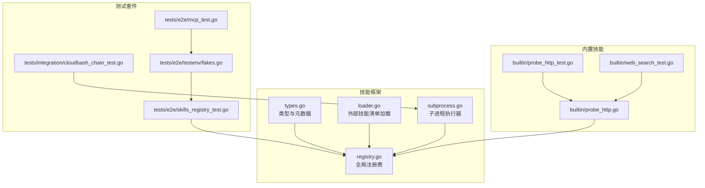
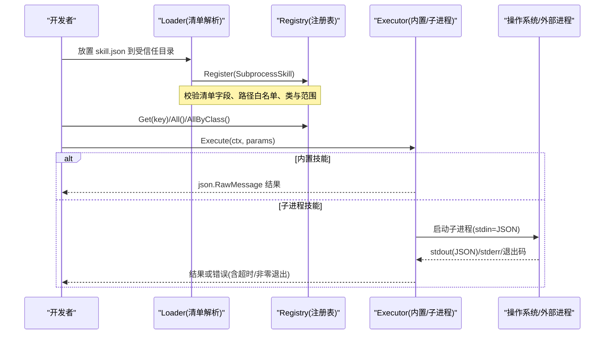
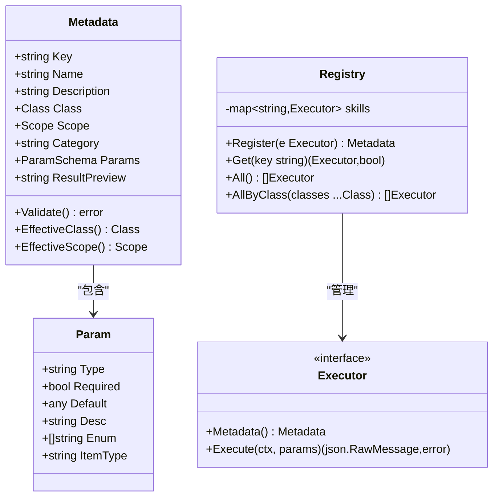
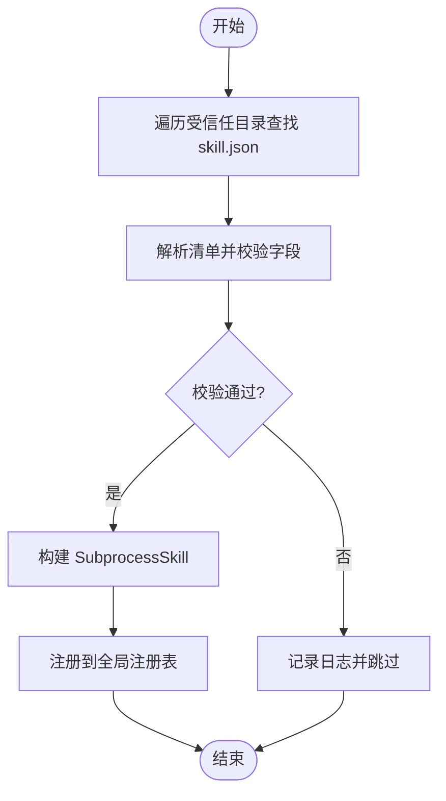
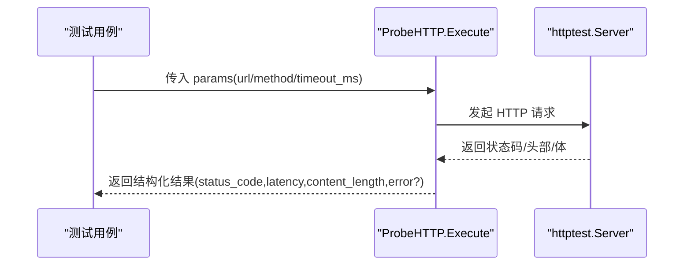
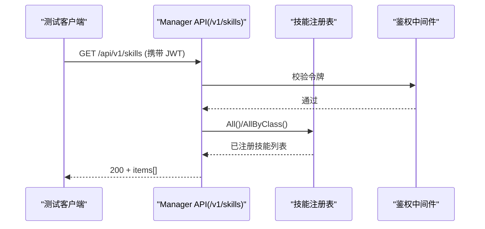
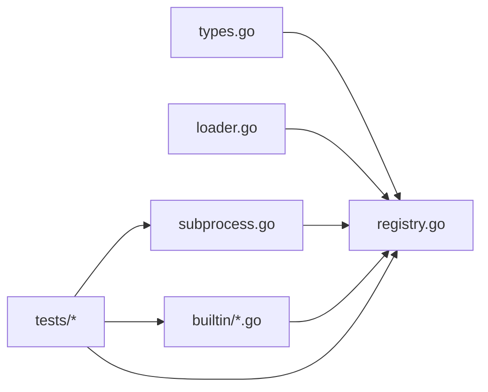

# 技能测试与调试

<cite>
**本文引用的文件**
- [internal/skill/types.go](file://internal/skill/types.go)
- [internal/skill/registry.go](file://internal/skill/registry.go)
- [internal/skill/loader.go](file://internal/skill/loader.go)
- [internal/skill/subprocess.go](file://internal/skill/subprocess.go)
- [internal/skill/builtin/probe_http.go](file://internal/skill/builtin/probe_http.go)
- [internal/skill/builtin/probe_http_test.go](file://internal/skill/builtin/probe_http_test.go)
- [internal/skill/builtin/web_search_test.go](file://internal/skill/builtin/web_search_test.go)
- [tests/e2e/skills_registry_test.go](file://tests/e2e/skills_registry_test.go)
- [tests/integration/cloudbash_chain_test.go](file://tests/integration/cloudbash_chain_test.go)
- [tests/e2e/testenv/fakes.go](file://tests/e2e/testenv/fakes.go)
- [tests/e2e/mcp_test.go](file://tests/e2e/mcp_test.go)
</cite>

## 目录
1. [引言](#引言)
2. [项目结构](#项目结构)
3. [核心组件](#核心组件)
4. [架构总览](#架构总览)
5. [详细组件分析](#详细组件分析)
6. [依赖关系分析](#依赖关系分析)
7. [性能考虑](#性能考虑)
8. [故障排查指南](#故障排查指南)
9. [结论](#结论)
10. [附录](#附录)

## 引言
本指南面向“技能（Skill）”的单元测试、集成测试与调试实践，覆盖以下目标：
- 单元测试：用例设计模式、断言策略、边界条件与错误路径。
- 集成测试：模拟边缘环境与云端环境，端到端验证执行链路与权限审批。
- 调试技巧：日志输出、错误追踪、性能分析与可观测性建议。
- Mock 对象：依赖注入、接口模拟与外部服务替代。
- 常见问题：参数绑定错误、执行超时、权限拒绝等典型问题的定位与修复。

## 项目结构
与技能测试与调试相关的代码主要分布在如下位置：
- 技能框架与注册中心：internal/skill/*
- 内置技能实现与单测：internal/skill/builtin/*
- 子进程技能加载器与运行时：internal/skill/loader.go, internal/skill/subprocess.go
- 端到端测试套件：tests/e2e/*
- 集成测试套件：tests/integration/*
- 通用测试替身（Fake）：tests/e2e/testenv/fakes.go

图示来源
- [internal/skill/types.go:1-241](file://internal/skill/types.go#L1-L241)
- [internal/skill/registry.go:1-127](file://internal/skill/registry.go#L1-L127)
- [internal/skill/loader.go:1-274](file://internal/skill/loader.go#L1-L274)
- [internal/skill/subprocess.go:1-268](file://internal/skill/subprocess.go#L1-L268)
- [internal/skill/builtin/probe_http.go:1-120](file://internal/skill/builtin/probe_http.go#L1-L120)
- [internal/skill/builtin/probe_http_test.go:1-105](file://internal/skill/builtin/probe_http_test.go#L1-L105)
- [internal/skill/builtin/web_search_test.go:1-570](file://internal/skill/builtin/web_search_test.go#L1-L570)
- [tests/e2e/skills_registry_test.go:1-145](file://tests/e2e/skills_registry_test.go#L1-L145)
- [tests/integration/cloudbash_chain_test.go:1-150](file://tests/integration/cloudbash_chain_test.go#L1-L150)
- [tests/e2e/testenv/fakes.go:1-431](file://tests/e2e/testenv/fakes.go#L1-L431)
- [tests/e2e/mcp_test.go:17-60](file://tests/e2e/mcp_test.go#L17-L60)

章节来源
- [internal/skill/types.go:1-241](file://internal/skill/types.go#L1-L241)
- [internal/skill/registry.go:1-127](file://internal/skill/registry.go#L1-L127)
- [internal/skill/loader.go:1-274](file://internal/skill/loader.go#L1-L274)
- [internal/skill/subprocess.go:1-268](file://internal/skill/subprocess.go#L1-L268)
- [internal/skill/builtin/probe_http.go:1-120](file://internal/skill/builtin/probe_http.go#L1-L120)
- [internal/skill/builtin/probe_http_test.go:1-105](file://internal/skill/builtin/probe_http_test.go#L1-L105)
- [internal/skill/builtin/web_search_test.go:1-570](file://internal/skill/builtin/web_search_test.go#L1-L570)
- [tests/e2e/skills_registry_test.go:1-145](file://tests/e2e/skills_registry_test.go#L1-L145)
- [tests/integration/cloudbash_chain_test.go:1-150](file://tests/integration/cloudbash_chain_test.go#L1-L150)
- [tests/e2e/testenv/fakes.go:1-431](file://tests/e2e/testenv/fakes.go#L1-L431)
- [tests/e2e/mcp_test.go:17-60](file://tests/e2e/mcp_test.go#L17-L60)

## 核心组件
- 技能元数据与执行器接口
  - 定义技能的 Key、Name、Description、Class、Scope、Params、ResultPreview 等元数据，以及 Executor 接口的 Metadata() 与 Execute(ctx, params)。
  - 提供 Validate() 对元数据进行强校验，避免运行期歧义。
- 全局注册表
  - 提供 Register/Get/All/AllByClass 等能力，保证并发安全与重复键检测。
- 子进程技能加载器
  - 扫描指定目录下的 skill.json 清单，构建 SubprocessSkill 并注册；严格限制 Entry 路径在允许根目录下，防止逃逸。
- 子进程执行器
  - 以 stdin/stdout JSON 协议与外部二进制通信；支持超时控制、环境变量白名单、输出大小上限与 stderr 尾部捕获。

章节来源
- [internal/skill/types.go:1-241](file://internal/skill/types.go#L1-L241)
- [internal/skill/registry.go:1-127](file://internal/skill/registry.go#L1-L127)
- [internal/skill/loader.go:1-274](file://internal/skill/loader.go#L1-L274)
- [internal/skill/subprocess.go:1-268](file://internal/skill/subprocess.go#L1-L268)

## 架构总览
下图展示了从“清单加载 → 注册 → 执行”的完整链路，以及内置与外部技能的统一入口。

图示来源
- [internal/skill/loader.go:1-274](file://internal/skill/loader.go#L1-L274)
- [internal/skill/registry.go:1-127](file://internal/skill/registry.go#L1-L127)
- [internal/skill/subprocess.go:1-268](file://internal/skill/subprocess.go#L1-L268)

## 详细组件分析

### 组件A：技能元数据与注册表
- 设计要点
  - 元数据强校验：Key 命名规范、必填字段、Class/Scope 枚举、ParamSchema 类型与数组元素类型约束。
  - 注册表线程安全：读多写少场景使用读写锁；重复 Key 直接 panic，确保作者级错误尽早暴露。
- 测试策略
  - 构造独立 Registry 实例进行隔离测试，验证重复键、无效元数据、按 Class 过滤等行为。
  - 通过 NewRegistryForTest 获取干净状态，避免全局污染。
- 关键路径参考
  - 元数据校验与默认值推导：[internal/skill/types.go:127-175](file://internal/skill/types.go#L127-L175)
  - 注册与查询接口：[internal/skill/registry.go:31-116](file://internal/skill/registry.go#L31-L116)

图示来源
- [internal/skill/types.go:63-175](file://internal/skill/types.go#L63-L175)
- [internal/skill/registry.go:21-116](file://internal/skill/registry.go#L21-L116)

章节来源
- [internal/skill/types.go:1-241](file://internal/skill/types.go#L1-L241)
- [internal/skill/registry.go:1-127](file://internal/skill/registry.go#L1-L127)

### 组件B：子进程技能加载器与执行器
- 设计要点
  - 清单解析与白名单校验：Entry 必须为绝对路径且位于允许根下，防止路径穿越。
  - 执行器安全：仅透明白名单环境变量；stdout/stderr 有上限；超时控制；非零退出码包装错误信息。
- 测试策略
  - 使用临时目录与脚本模拟外部技能，验证注册成功、路径逃逸被拒、缺失目录/相对根被跳过、非法 Key 被跳过等。
  - 通过替换 runner 接口注入假执行器，断言入参、输出与错误路径。
- 关键路径参考
  - 清单解析与构建：[internal/skill/loader.go:163-254](file://internal/skill/loader.go#L163-L254)
  - 子进程执行流程：[internal/skill/subprocess.go:112-172](file://internal/skill/subprocess.go#L112-L172)

图示来源
- [internal/skill/loader.go:75-161](file://internal/skill/loader.go#L75-L161)
- [internal/skill/loader.go:163-254](file://internal/skill/loader.go#L163-L254)

章节来源
- [internal/skill/loader.go:1-274](file://internal/skill/loader.go#L1-L274)
- [internal/skill/subprocess.go:1-268](file://internal/skill/subprocess.go#L1-L268)

### 组件C：内置技能示例（HTTP 探测）
- 设计要点
  - 只读方法（GET/HEAD），返回状态码、延迟与内容长度；TLS 校验关闭以适应内网自签证书场景。
- 测试策略
  - 使用 httptest.Server 模拟后端，覆盖正常响应、方法校验、URL 缺失、不可达主机等路径。
  - 断言返回结构与字段语义。
- 关键路径参考
  - 技能实现与注册：[internal/skill/builtin/probe_http.go:15-47](file://internal/skill/builtin/probe_http.go#L15-L47)
  - 执行逻辑与结果封装：[internal/skill/builtin/probe_http.go:65-119](file://internal/skill/builtin/probe_http.go#L65-L119)
  - 单测样例：[internal/skill/builtin/probe_http_test.go:13-105](file://internal/skill/builtin/probe_http_test.go#L13-L105)

图示来源
- [internal/skill/builtin/probe_http.go:65-119](file://internal/skill/builtin/probe_http.go#L65-L119)
- [internal/skill/builtin/probe_http_test.go:23-75](file://internal/skill/builtin/probe_http_test.go#L23-L75)

章节来源
- [internal/skill/builtin/probe_http.go:1-120](file://internal/skill/builtin/probe_http.go#L1-L120)
- [internal/skill/builtin/probe_http_test.go:1-105](file://internal/skill/builtin/probe_http_test.go#L1-L105)

### 组件D：Web 搜索技能（多提供者与回退）
- 设计要点
  - 支持多个提供者（SearXNG/Tavily/Brave），默认回退到零配置的 SearXNG；显式选择无密钥时返回 skipped_reason。
  - 可通过配置解析器与 HTTP 客户端注入，便于测试。
- 测试策略
  - 使用 stub 配置解析器与 httptest.Server 模拟各提供者；断言 provider 选择、参数传递、结果映射与错误处理。
- 关键路径参考
  - 单测覆盖多种场景：[internal/skill/builtin/web_search_test.go:58-570](file://internal/skill/builtin/web_search_test.go#L58-L570)

章节来源
- [internal/skill/builtin/web_search_test.go:1-570](file://internal/skill/builtin/web_search_test.go#L1-L570)

### 组件E：端到端与集成测试
- 端到端（E2E）
  - 验证 /api/v1/skills 列表接口：鉴权、返回结构、最小数量与关键字段存在性。
  - 参考：[tests/e2e/skills_registry_test.go:33-134](file://tests/e2e/skills_registry_test.go#L33-L134)
- 集成测试
  - 验证云 Bash 执行链：凭据加密存储 → 审批提议 → 人工批准 → 凭据注入 → 子进程执行 → 结果回传。
  - 参考：[tests/integration/cloudbash_chain_test.go:48-122](file://tests/integration/cloudbash_chain_test.go#L48-L122)
- 通用 Fake 与 MCP 模拟
  - FakeLLM/FakeProm/FakeSlack/FakeTelegram 等用于替代外部服务；MCP 服务器模拟工具调用与鉴权头透传。
  - 参考：[tests/e2e/testenv/fakes.go:27-133](file://tests/e2e/testenv/fakes.go#L27-L133)、[tests/e2e/mcp_test.go:29-60](file://tests/e2e/mcp_test.go#L29-L60)

图示来源
- [tests/e2e/skills_registry_test.go:33-134](file://tests/e2e/skills_registry_test.go#L33-L134)
- [internal/skill/registry.go:85-116](file://internal/skill/registry.go#L85-L116)

章节来源
- [tests/e2e/skills_registry_test.go:1-145](file://tests/e2e/skills_registry_test.go#L1-L145)
- [tests/integration/cloudbash_chain_test.go:1-150](file://tests/integration/cloudbash_chain_test.go#L1-L150)
- [tests/e2e/testenv/fakes.go:1-431](file://tests/e2e/testenv/fakes.go#L1-L431)
- [tests/e2e/mcp_test.go:17-60](file://tests/e2e/mcp_test.go#L17-L60)

## 依赖关系分析
- 低耦合高内聚
  - 元数据与注册表解耦：注册表不关心具体实现，仅维护键到执行器的映射。
  - 子进程执行器通过接口 runner 注入，便于测试替换。
- 外部依赖
  - 文件系统（清单扫描）、操作系统进程（子进程执行）、网络（内置技能访问外部服务）。
- 潜在循环依赖
  - 当前未见循环导入；注册发生在 init 阶段，运行期只读。

图示来源
- [internal/skill/types.go:1-241](file://internal/skill/types.go#L1-L241)
- [internal/skill/registry.go:1-127](file://internal/skill/registry.go#L1-L127)
- [internal/skill/loader.go:1-274](file://internal/skill/loader.go#L1-L274)
- [internal/skill/subprocess.go:1-268](file://internal/skill/subprocess.go#L1-L268)
- [internal/skill/builtin/probe_http.go:1-120](file://internal/skill/builtin/probe_http.go#L1-L120)

章节来源
- [internal/skill/types.go:1-241](file://internal/skill/types.go#L1-L241)
- [internal/skill/registry.go:1-127](file://internal/skill/registry.go#L1-L127)
- [internal/skill/loader.go:1-274](file://internal/skill/loader.go#L1-L274)
- [internal/skill/subprocess.go:1-268](file://internal/skill/subprocess.go#L1-L268)

## 性能考虑
- 子进程输出上限
  - stdout 最大 16 MiB，stderr 尾部保留 4 KiB，避免异常输出导致内存膨胀。
- 超时控制
  - 默认 30s，可在清单中配置；超时将返回明确错误，便于上层重试或降级。
- 并发与锁
  - 注册表使用读写锁，读多写少场景高效；注册仅在启动阶段发生。
- 网络 I/O
  - 内置技能如 HTTP 探测应设置合理超时与连接池参数，避免阻塞。

章节来源
- [internal/skill/subprocess.go:17-28](file://internal/skill/subprocess.go#L17-L28)
- [internal/skill/subprocess.go:145-172](file://internal/skill/subprocess.go#L145-L172)
- [internal/skill/registry.go:21-24](file://internal/skill/registry.go#L21-L24)

## 故障排查指南
- 参数绑定错误
  - 现象：Execute 解码失败或缺失必填字段。
  - 排查：检查 ParamSchema 与传入 JSON 字段名/类型一致性；查看 Validate 报错信息。
  - 参考：[internal/skill/types.go:127-175](file://internal/skill/types.go#L127-L175)
- 执行超时
  - 现象：子进程执行超过阈值被中断。
  - 排查：确认清单 timeout_seconds 设置；检查外部依赖响应时间；增加日志与指标。
  - 参考：[internal/skill/subprocess.go:145-160](file://internal/skill/subprocess.go#L145-L160)
- 权限拒绝
  - 现象：未携带 JWT 或角色不足导致 401/403。
  - 排查：确认鉴权中间件与 Token；检查 Class 与审批流是否满足要求。
  - 参考：[tests/e2e/skills_registry_test.go:33-75](file://tests/e2e/skills_registry_test.go#L33-L75)
- 路径逃逸与安全
  - 现象：Entry 指向允许根之外或被拒绝。
  - 排查：核对清单 Entry 路径与 allowlist 根；确认符号链接解析后仍在允许范围内。
  - 参考：[internal/skill/loader.go:179-214](file://internal/skill/loader.go#L179-L214)
- 外部服务不可用
  - 现象：SearXNG/Tavily/Brave 不可达或限流。
  - 排查：检查网络连通性与密钥配置；确认回退策略与 skipped_reason 提示。
  - 参考：[internal/skill/builtin/web_search_test.go:390-416](file://internal/skill/builtin/web_search_test.go#L390-L416)

章节来源
- [internal/skill/types.go:127-175](file://internal/skill/types.go#L127-L175)
- [internal/skill/subprocess.go:145-172](file://internal/skill/subprocess.go#L145-L172)
- [tests/e2e/skills_registry_test.go:33-75](file://tests/e2e/skills_registry_test.go#L33-L75)
- [internal/skill/loader.go:179-214](file://internal/skill/loader.go#L179-L214)
- [internal/skill/builtin/web_search_test.go:390-416](file://internal/skill/builtin/web_search_test.go#L390-L416)

## 结论
本指南围绕技能框架的元数据、注册、加载与执行四个关键环节，给出了系统化的测试与调试方法。通过严格的元数据校验、安全的子进程执行模型、完善的 Fake 与端到端/集成测试，能够有效保障技能在不同环境下的正确性与稳定性。建议在新增技能时遵循本文范式，完善单测与集成用例，并在 CI 中持续回归。

## 附录
- 常用测试技巧
  - 使用 httptest.Server 模拟外部 HTTP 服务。
  - 使用临时目录与脚本模拟外部技能清单与可执行文件。
  - 通过接口注入替换真实依赖（如 runner、HTTP 客户端、配置解析器）。
- 推荐断言策略
  - 结构断言：返回 JSON 字段完整性与类型。
  - 行为断言：调用次数、参数顺序、错误消息片段。
  - 边界断言：空输入、极大输入、超时、不可达地址。
- 参考样例路径
  - 内置技能单测：[internal/skill/builtin/probe_http_test.go:13-105](file://internal/skill/builtin/probe_http_test.go#L13-L105)
  - Web 搜索多提供者单测：[internal/skill/builtin/web_search_test.go:58-570](file://internal/skill/builtin/web_search_test.go#L58-L570)
  - 清单加载与执行单测：[internal/skill/loader_test.go:41-95](file://internal/skill/loader_test.go#L41-L95)
  - 端到端技能列表测试：[tests/e2e/skills_registry_test.go:33-134](file://tests/e2e/skills_registry_test.go#L33-L134)
  - 集成测试（凭据注入与审批链）：[tests/integration/cloudbash_chain_test.go:48-122](file://tests/integration/cloudbash_chain_test.go#L48-L122)
  - 通用 Fake 服务：[tests/e2e/testenv/fakes.go:27-133](file://tests/e2e/testenv/fakes.go#L27-L133)
  - MCP 服务器模拟：[tests/e2e/mcp_test.go:29-60](file://tests/e2e/mcp_test.go#L29-L60)