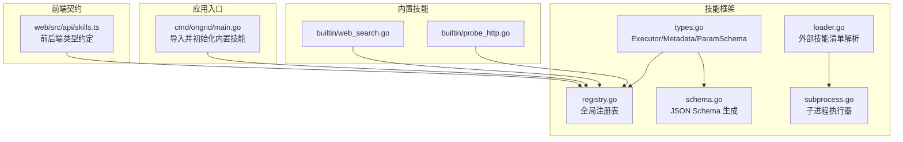
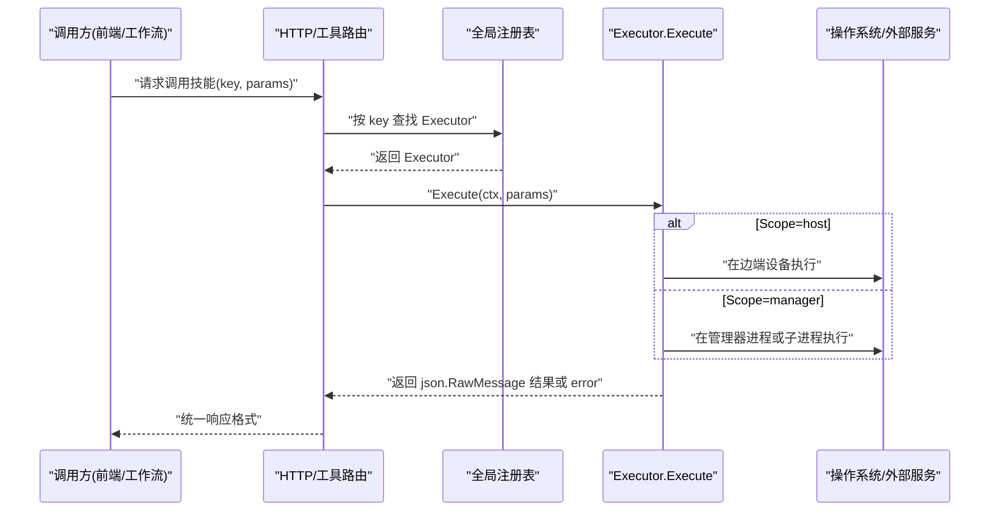
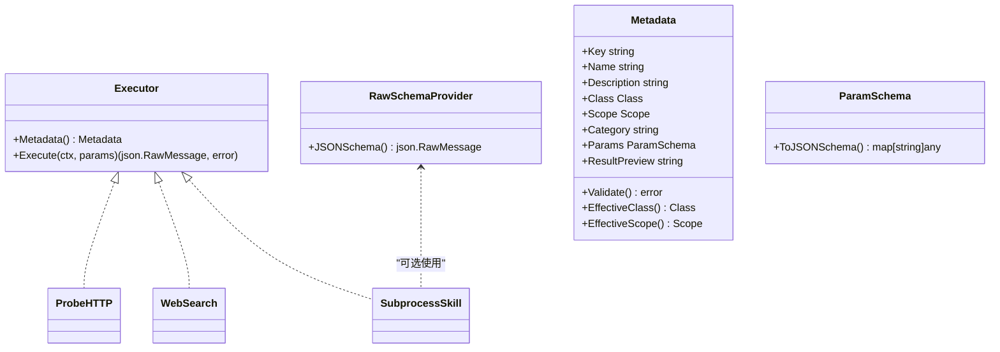
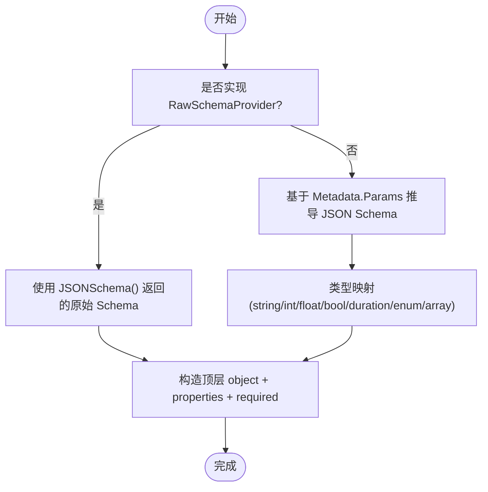
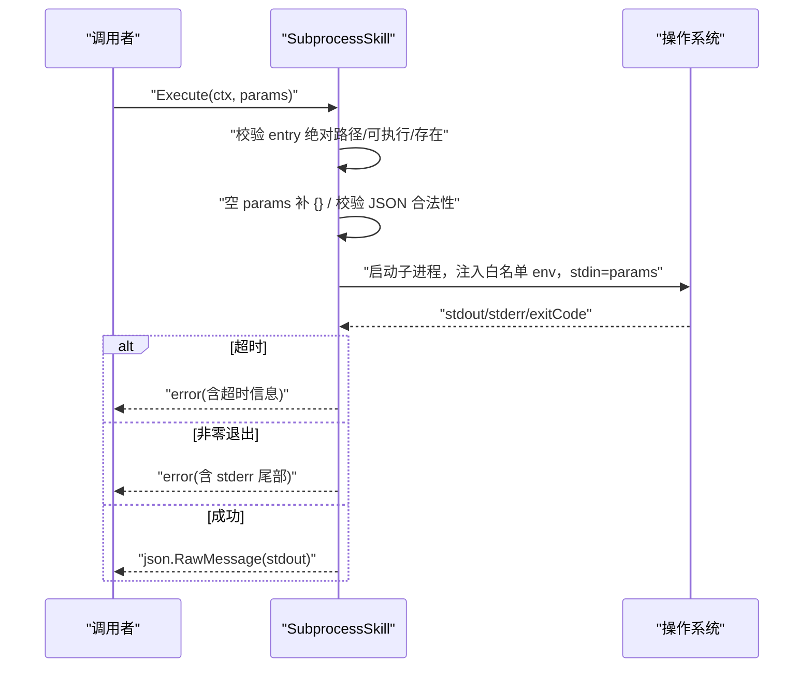
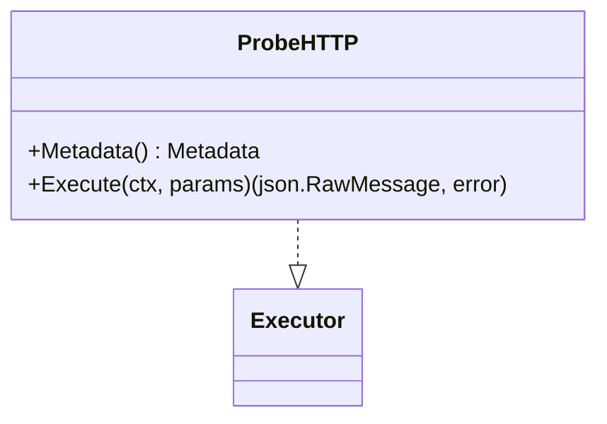
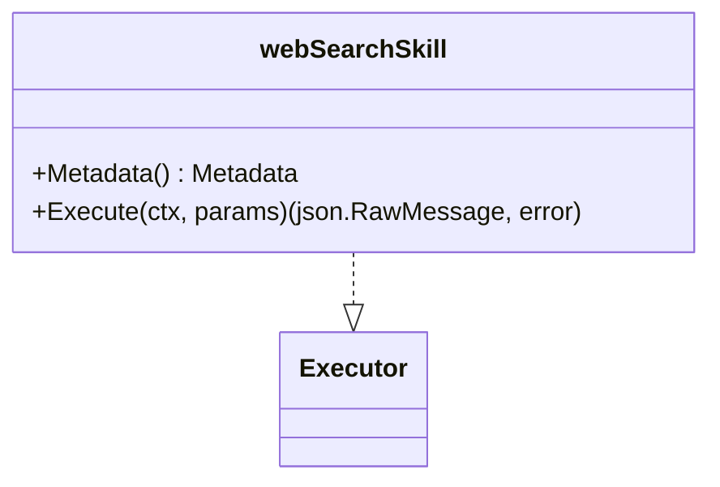
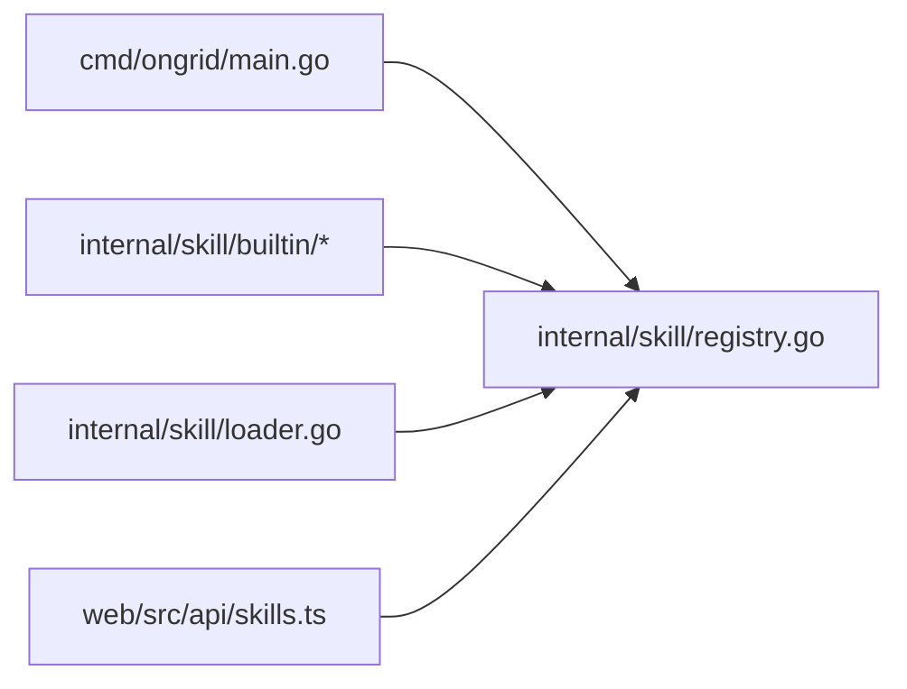

# 自定义技能开发

<cite>
**本文引用的文件**   
- [internal/skill/types.go](file://internal/skill/types.go)
- [internal/skill/schema.go](file://internal/skill/schema.go)
- [internal/skill/registry.go](file://internal/skill/registry.go)
- [internal/skill/loader.go](file://internal/skill/loader.go)
- [internal/skill/subprocess.go](file://internal/skill/subprocess.go)
- [internal/skill/builtin/probe_http.go](file://internal/skill/builtin/probe_http.go)
- [internal/skill/builtin/web_search.go](file://internal/skill/builtin/web_search.go)
- [cmd/ongrid/main.go](file://cmd/ongrid/main.go)
- [web/src/api/skills.ts](file://web/src/api/skills.ts)
</cite>

## 目录
1. [简介](#简介)
2. [项目结构](#项目结构)
3. [核心组件](#核心组件)
4. [架构总览](#架构总览)
5. [详细组件分析](#详细组件分析)
6. [依赖关系分析](#依赖关系分析)
7. [性能与资源限制](#性能与资源限制)
8. [错误处理与返回值规范](#错误处理与返回值规范)
9. [参数绑定与验证机制](#参数绑定与验证机制)
10. [完整开发示例](#完整开发示例)
11. [测试方法与调试技巧](#测试方法与调试技巧)
12. [打包、分发与版本管理](#打包分发与版本管理)
13. [故障排查指南](#故障排查指南)
14. [结论](#结论)

## 简介
本指南面向开发者，系统化讲解如何在 ongrid 中实现“自定义技能（Skill）”。内容覆盖：
- Executor 接口实现要求（Metadata 定义、Execute 编写）
- 参数绑定与验证（JSON Schema 生成与类型转换）
- 错误处理与返回值格式规范
- 从简单命令执行到复杂业务逻辑的完整示例
- 测试方法与调试技巧
- 技能的打包、分发与版本管理最佳实践

## 项目结构
技能框架位于 internal/skill 包，提供统一的注册、元数据描述、参数 Schema 生成、子进程执行等能力。内置技能位于 internal/skill/builtin，外部可插拔的子进程技能通过 manifest + 可执行文件方式加载。

**图表来源**
- [internal/skill/types.go:1-241](file://internal/skill/types.go#L1-L241)
- [internal/skill/registry.go:1-127](file://internal/skill/registry.go#L1-L127)
- [internal/skill/schema.go:1-96](file://internal/skill/schema.go#L1-L96)
- [internal/skill/loader.go:1-274](file://internal/skill/loader.go#L1-L274)
- [internal/skill/subprocess.go:1-268](file://internal/skill/subprocess.go#L1-L268)
- [internal/skill/builtin/probe_http.go:1-120](file://internal/skill/builtin/probe_http.go#L1-L120)
- [internal/skill/builtin/web_search.go:1-593](file://internal/skill/builtin/web_search.go#L1-L593)
- [cmd/ongrid/main.go:175-202](file://cmd/ongrid/main.go#L175-L202)
- [web/src/api/skills.ts:1-82](file://web/src/api/skills.ts#L1-L82)

**章节来源**
- [internal/skill/types.go:1-241](file://internal/skill/types.go#L1-L241)
- [internal/skill/registry.go:1-127](file://internal/skill/registry.go#L1-L127)
- [internal/skill/schema.go:1-96](file://internal/skill/schema.go#L1-L96)
- [internal/skill/loader.go:1-274](file://internal/skill/loader.go#L1-L274)
- [internal/skill/subprocess.go:1-268](file://internal/skill/subprocess.go#L1-L268)
- [internal/skill/builtin/probe_http.go:1-120](file://internal/skill/builtin/probe_http.go#L1-L120)
- [internal/skill/builtin/web_search.go:1-593](file://internal/skill/builtin/web_search.go#L1-L593)
- [cmd/ongrid/main.go:175-202](file://cmd/ongrid/main.go#L175-L202)
- [web/src/api/skills.ts:1-82](file://web/src/api/skills.ts#L1-L82)

## 核心组件
- Executor 接口：每个技能必须实现 Metadata() 和 Execute(ctx, params)。
- Metadata：声明 Key、Name、Description、Class、Scope、Category、Params、ResultPreview。
- ParamSchema：用于 UI 表单与 LLM 工具 JSON Schema 自动生成。
- Registry：进程级注册表，提供 Register/Get/All/AllByClass。
- SubprocessSkill：以子进程形式运行外部脚本/二进制，stdin/stdout 传输 JSON。
- Loader：扫描指定目录下的 skill.json 清单，构建并注册 SubprocessSkill。

**章节来源**
- [internal/skill/types.go:100-203](file://internal/skill/types.go#L100-L203)
- [internal/skill/registry.go:26-127](file://internal/skill/registry.go#L26-L127)
- [internal/skill/subprocess.go:30-172](file://internal/skill/subprocess.go#L30-L172)
- [internal/skill/loader.go:13-254](file://internal/skill/loader.go#L13-L254)

## 架构总览
下图展示了从调用方到具体 Executor 的端到端流程，以及 Manager/Edge 两种执行范围（Scope）。

**图表来源**
- [internal/skill/registry.go:31-82](file://internal/skill/registry.go#L31-L82)
- [internal/skill/types.go:190-203](file://internal/skill/types.go#L190-L203)
- [internal/skill/subprocess.go:99-172](file://internal/skill/subprocess.go#L99-L172)

## 详细组件分析

### Executor 接口与元数据
- 必须实现：
  - Metadata(): 返回 Metadata，包含 Key、Name、Description、Class、Scope、Category、Params、ResultPreview。
  - Execute(ctx, params): 接收已校验的参数 JSON，返回结果 JSON 或错误。
- 可选扩展：RawSchemaProvider，允许直接提供原始 JSON Schema，绕过 ParamSchema 推导。

**图表来源**
- [internal/skill/types.go:100-203](file://internal/skill/types.go#L100-L203)
- [internal/skill/schema.go:5-20](file://internal/skill/schema.go#L5-L20)
- [internal/skill/builtin/probe_http.go:23-47](file://internal/skill/builtin/probe_http.go#L23-L47)
- [internal/skill/builtin/web_search.go:162-195](file://internal/skill/builtin/web_search.go#L162-L195)
- [internal/skill/subprocess.go:87-97](file://internal/skill/subprocess.go#L87-L97)

**章节来源**
- [internal/skill/types.go:100-203](file://internal/skill/types.go#L100-L203)
- [internal/skill/schema.go:5-20](file://internal/skill/schema.go#L5-L20)

### 参数绑定与验证机制
- 参数声明：通过 Metadata.Params 声明参数名、类型、是否必填、默认值、枚举、数组元素类型等。
- JSON Schema 生成：
  - 若实现 RawSchemaProvider，优先使用其提供的原始 JSON Schema。
  - 否则由 ParamSchema.ToJSONSchema() 自动推导为 OpenAI function-calling 兼容的 object schema。
- 类型映射：string/int/float/bool/duration/enum/array；duration 序列化为字符串。
- 校验时机：注册时 Validate() 检查元数据一致性；调用前对 params 进行形状校验（不校验语义值）。

**图表来源**
- [internal/skill/schema.go:5-96](file://internal/skill/schema.go#L5-L96)
- [internal/skill/types.go:127-175](file://internal/skill/types.go#L127-L175)

**章节来源**
- [internal/skill/schema.go:5-96](file://internal/skill/schema.go#L5-L96)
- [internal/skill/types.go:127-175](file://internal/skill/types.go#L127-L175)

### 子进程技能（SubprocessSkill）
- 用途：以独立进程运行外部脚本/二进制，stdin 传入 JSON 参数，stdout 输出 JSON 结果。
- 安全策略：
  - 强制 ScopeManager，避免在边端执行不可信二进制。
  - 仅允许白名单环境变量注入（EnvAllow），默认无 PATH。
  - 清单中的 Entry 路径必须在允许的根目录下，Loader 会做路径穿越防护。
- 超时与限流：
  - 默认超时 30s，可通过 manifest 配置。
  - stdout 最大 16MiB，stderr 尾部保留 4KiB 用于诊断。
- 错误模型：非零退出码、超时、非法 JSON 输出均返回 Go error，便于上层统一包装审计与提示。

**图表来源**
- [internal/skill/subprocess.go:99-172](file://internal/skill/subprocess.go#L99-L172)
- [internal/skill/loader.go:176-254](file://internal/skill/loader.go#L176-L254)

**章节来源**
- [internal/skill/subprocess.go:17-268](file://internal/skill/subprocess.go#L17-L268)
- [internal/skill/loader.go:13-254](file://internal/skill/loader.go#L13-L254)

### 内置技能示例：HTTP 探测（ProbeHTTP）
- 作用：对 URL 发起 HEAD/GET，返回状态码、延迟、内容长度。
- 权限类：safe（只读网络探测）。
- 参数：url（必填）、method（枚举 GET/HEAD，默认 HEAD）、timeout_ms（int，默认 5000）。
- 返回值：{status_code, latency_ms, content_length, error?}。

**图表来源**
- [internal/skill/builtin/probe_http.go:23-47](file://internal/skill/builtin/probe_http.go#L23-L47)
- [internal/skill/builtin/probe_http.go:62-119](file://internal/skill/builtin/probe_http.go#L62-L119)

**章节来源**
- [internal/skill/builtin/probe_http.go:1-120](file://internal/skill/builtin/probe_http.go#L1-L120)

### 内置技能示例：联网搜索（WebSearch）
- 作用：聚合多个搜索引擎（SearXNG/Tavily/Brave），返回标题、URL、摘要等。
- 权限类：safe；执行范围：manager。
- 参数：query（必填）、max_results（int，默认 5，上限 10）、include_domains/exclude_domains（provider 特定）、provider（枚举，留空走系统设置）。
- 返回值：{provider, results:[...], answer?, skipped_reason?}。当未配置或不可达时返回 skipped_reason 而非错误，便于 LLM 友好提示。

**图表来源**
- [internal/skill/builtin/web_search.go:162-195](file://internal/skill/builtin/web_search.go#L162-L195)
- [internal/skill/builtin/web_search.go:225-283](file://internal/skill/builtin/web_search.go#L225-L283)

**章节来源**
- [internal/skill/builtin/web_search.go:1-593](file://internal/skill/builtin/web_search.go#L1-L593)

## 依赖关系分析
- 注册阶段：
  - 应用入口导入 builtin 包触发 init()，将内置 Executor 注册到全局注册表。
  - Loader 扫描外部目录，解析 skill.json 并注册 SubprocessSkill。
- 运行阶段：
  - HTTP/工具路由根据 key 从注册表获取 Executor，调用 Execute。
  - 前端通过 skills.ts 的类型定义与后端保持一致，确保 UI 表单与 LLM 工具描述一致。

**图表来源**
- [cmd/ongrid/main.go:175-202](file://cmd/ongrid/main.go#L175-L202)
- [internal/skill/registry.go:1-127](file://internal/skill/registry.go#L1-L127)
- [internal/skill/loader.go:69-161](file://internal/skill/loader.go#L69-L161)
- [web/src/api/skills.ts:1-82](file://web/src/api/skills.ts#L1-L82)

**章节来源**
- [cmd/ongrid/main.go:175-202](file://cmd/ongrid/main.go#L175-L202)
- [internal/skill/registry.go:1-127](file://internal/skill/registry.go#L1-L127)
- [internal/skill/loader.go:69-161](file://internal/skill/loader.go#L69-L161)
- [web/src/api/skills.ts:1-82](file://web/src/api/skills.ts#L1-L82)

## 性能与资源限制
- 子进程 stdout 最大 16MiB，stderr 尾部保留 4KiB，防止异常输出撑爆内存。
- 子进程默认超时 30s，可在 manifest 中调整。
- 参数 JSON 在调用前进行形状校验，减少无效执行。
- 建议：
  - 合理设置 timeout_ms 等耗时相关参数。
  - 控制返回结果大小，避免大对象影响 LLM 上下文。

[本节为通用指导，无需源码引用]

## 错误处理与返回值规范
- 错误分类：
  - 元数据校验失败：注册期 panic，快速暴露作者错误。
  - 参数校验失败：返回 Go error，上层可包装为统一错误体。
  - 运行时错误：如子进程非零退出、超时、非法 JSON 输出，返回 Go error。
  - 可恢复场景：如 WebSearch 未配置或不可达，返回 skipped_reason 字段而非错误，便于 LLM 引导用户修复。
- 返回值：
  - 成功：json.RawMessage，结构由 ResultPreview 提示。
  - 失败：Go error，上层可追加审计信息与错误码。

**章节来源**
- [internal/skill/types.go:127-175](file://internal/skill/types.go#L127-L175)
- [internal/skill/subprocess.go:99-172](file://internal/skill/subprocess.go#L99-L172)
- [internal/skill/builtin/web_search.go:225-283](file://internal/skill/builtin/web_search.go#L225-L283)

## 参数绑定与验证机制
- 参数声明要点：
  - Type 支持 string/int/float/bool/duration/enum/array。
  - array 需指定 ItemType，不支持嵌套数组。
  - Required 与 Default 互斥。
- JSON Schema 生成：
  - 优先使用 RawSchemaProvider 的原始 Schema。
  - 否则由 ParamSchema.ToJSONSchema() 生成 object schema，包含 properties 与 required。
- 类型转换：
  - duration 序列化为字符串，调用方负责解析。
  - enum 映射为 string 并附带 enum 列表。

**章节来源**
- [internal/skill/types.go:63-97](file://internal/skill/types.go#L63-L97)
- [internal/skill/schema.go:22-96](file://internal/skill/schema.go#L22-L96)

## 完整开发示例

### 示例一：简单的只读命令执行（子进程）
- 目标：在管理器侧执行一个只读 shell 命令，读取日志片段。
- 步骤：
  1. 准备可执行脚本（例如 echo.sh），输出合法 JSON。
  2. 创建 skill.json 清单，声明 name、description、entry、env_allow、timeout_seconds、class、category。
  3. 将清单放入 Loader 配置的白名单目录，重启后自动注册。
- 关键点：
  - Entry 必须是绝对路径且位于允许根目录下。
  - EnvAllow 仅放行必要变量，避免泄露。
  - stdout 必须为合法 JSON。

**章节来源**
- [internal/skill/loader.go:13-254](file://internal/skill/loader.go#L13-L254)
- [internal/skill/subprocess.go:99-172](file://internal/skill/subprocess.go#L99-L172)

### 示例二：HTTP 健康探测（原生 Go 技能）
- 参考：internal/skill/builtin/probe_http.go
- 要点：
  - 在 init() 中调用 skill.Register(&ProbeHTTP{})。
  - Metadata 声明 Key、Name、Description、Class、Category、Params、ResultPreview。
  - Execute 中解码 params，发起 HTTP 请求，返回结构化结果。

**章节来源**
- [internal/skill/builtin/probe_http.go:1-120](file://internal/skill/builtin/probe_http.go#L1-L120)

### 示例三：联网搜索（多 Provider 聚合）
- 参考：internal/skill/builtin/web_search.go
- 要点：
  - 支持 SearXNG/Tavily/Brave，通过配置解析器选择 provider。
  - 未配置或不可达时返回 skipped_reason，便于 LLM 友好提示。
  - 参数包括 query、max_results、include_domains/exclude_domains、provider。

**章节来源**
- [internal/skill/builtin/web_search.go:1-593](file://internal/skill/builtin/web_search.go#L1-L593)

## 测试方法与调试技巧
- 单元测试：
  - 使用 httptest 模拟外部服务，验证 Execute 分支（成功、错误、边界条件）。
  - 针对子进程技能，使用临时脚本与 mock runner 验证 stdin/stdout、超时、环境隔离。
- 调试技巧：
  - 查看注册日志，确认技能是否被正确加载。
  - 对于子进程，关注 stderr 尾部与退出码，快速定位问题。
  - 使用前端 Skills 页面或 API 列出技能，核对元数据与参数表单。

**章节来源**
- [internal/skill/builtin/probe_http_test.go:1-105](file://internal/skill/builtin/probe_http_test.go#L1-L105)
- [internal/skill/subprocess_test.go:1-201](file://internal/skill/subprocess_test.go#L1-L201)

## 打包、分发与版本管理
- 内部技能（Go）：
  - 在 internal/skill/builtin 下新增文件，init() 中注册。
  - 随主程序发布，版本号跟随主版本。
- 外部技能（子进程）：
  - 使用 skill.json 清单 + 可执行文件组织。
  - 将清单放入 Loader 配置的白名单目录，支持热发现。
  - 通过变更清单与二进制实现版本迭代；注意幂等注册与重复键保护。
- 前端契约：
  - 保持 web/src/api/skills.ts 的类型与后端一致，确保 UI 表单与 LLM 工具描述同步。

**章节来源**
- [internal/skill/loader.go:69-161](file://internal/skill/loader.go#L69-L161)
- [web/src/api/skills.ts:1-82](file://web/src/api/skills.ts#L1-L82)

## 故障排查指南
- 常见错误：
  - 元数据校验失败：检查 Key 命名规则、必填字段、Class/Scope 取值、参数类型与枚举。
  - 子进程无法执行：确认 Entry 绝对路径、可执行权限、存在于允许根目录。
  - 超时：适当增大 timeout_seconds 或优化子进程逻辑。
  - 非 JSON 输出：确保 stdout 为合法 JSON。
- 定位方法：
  - 查看注册日志与错误堆栈。
  - 子进程 stderr 尾部与退出码。
  - 前端 Skills 页面核对元数据与参数表单。

**章节来源**
- [internal/skill/types.go:127-175](file://internal/skill/types.go#L127-L175)
- [internal/skill/subprocess.go:99-172](file://internal/skill/subprocess.go#L99-L172)

## 结论
通过统一的 Executor 接口与元数据驱动的技能框架，开发者可以以最小成本实现从简单命令执行到复杂业务逻辑的多样化能力。借助 JSON Schema 自动生成、严格的参数校验与安全沙箱，技能具备高可用性与良好可观测性。结合完善的测试与调试手段，以及灵活的打包分发机制，团队能够高效地构建、共享与演进技能生态。