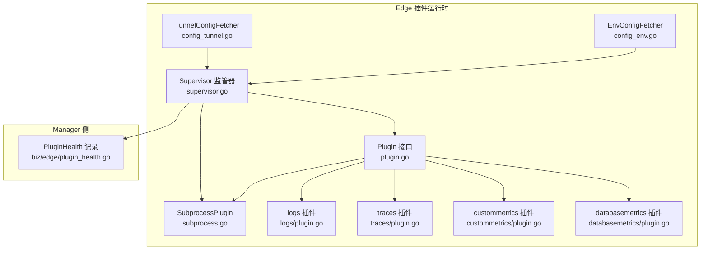
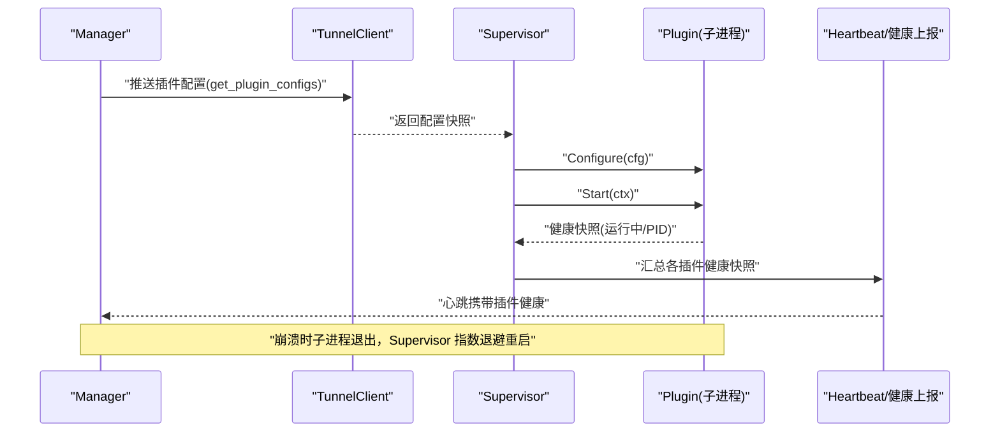
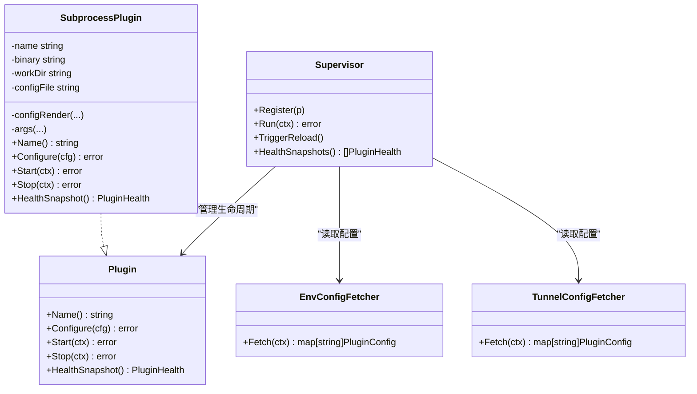
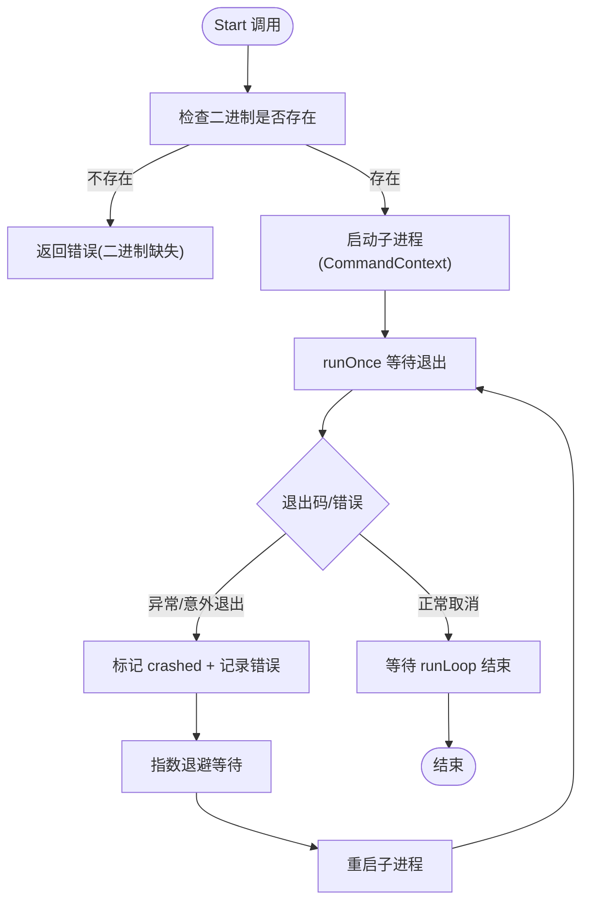
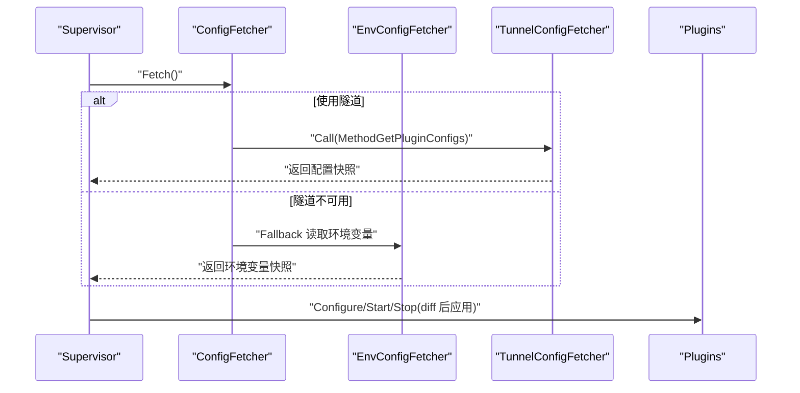
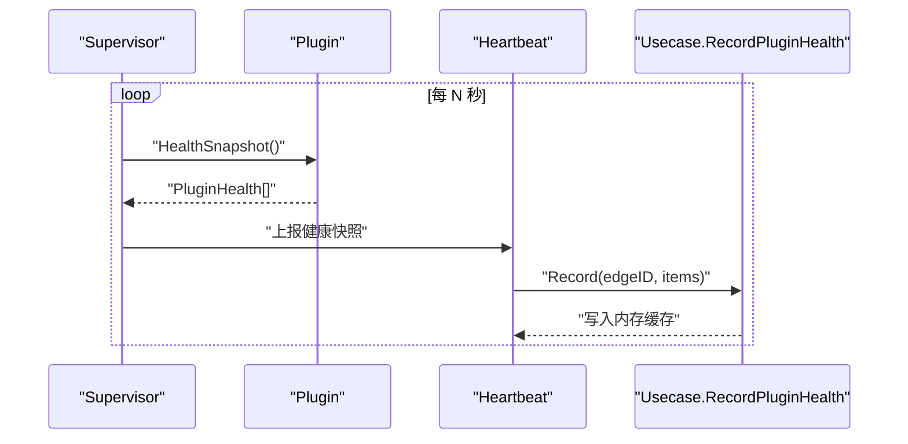
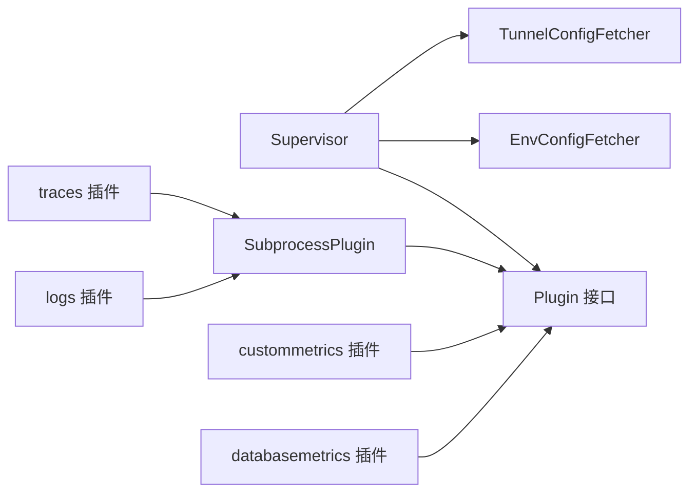

# 插件开发指南

<cite>
**本文引用的文件**   
- [internal/edgeagent/plugins/plugin.go](file://internal/edgeagent/plugins/plugin.go)
- [internal/edgeagent/plugins/subprocess.go](file://internal/edgeagent/plugins/subprocess.go)
- [internal/edgeagent/plugins/supervisor.go](file://internal/edgeagent/plugins/supervisor.go)
- [internal/edgeagent/plugins/config_env.go](file://internal/edgeagent/plugins/config_env.go)
- [internal/edgeagent/plugins/config_tunnel.go](file://internal/edgeagent/plugins/config_tunnel.go)
- [internal/edgeagent/plugins/logs/plugin.go](file://internal/edgeagent/plugins/logs/plugin.go)
- [internal/edgeagent/plugins/traces/plugin.go](file://internal/edgeagent/plugins/traces/plugin.go)
- [internal/edgeagent/plugins/custommetrics/plugin.go](file://internal/edgeagent/plugins/custommetrics/plugin.go)
- [internal/edgeagent/plugins/databasemetrics/plugin.go](file://internal/edgeagent/plugins/databasemetrics/plugin.go)
- [internal/manager/biz/edge/plugin_health.go](file://internal/manager/biz/edge/plugin_health.go)
- [internal/edgeagent/plugins/supervisor_test.go](file://internal/edgeagent/plugins/supervisor_test.go)
</cite>

## 目录
1. [简介](#简介)
2. [项目结构](#项目结构)
3. [核心组件](#核心组件)
4. [架构总览](#架构总览)
5. [详细组件分析](#详细组件分析)
6. [依赖关系分析](#依赖关系分析)
7. [性能与可靠性](#性能与可靠性)
8. [测试方案](#测试方案)
9. [安全模型](#安全模型)
10. [故障排查与调试技巧](#故障排查与调试技巧)
11. [结论](#结论)

## 简介
本指南面向希望在 ongrid-edge 上从零开始开发自定义插件的开发者。内容覆盖：
- 插件接口与生命周期（Configure、Start、Stop、HealthSnapshot）
- 子进程插件模式（进程启动、崩溃恢复、信号处理）
- 配置来源与环境变量/隧道拉取
- 健康状态上报与可视化
- 测试策略（单元、集成、性能）
- 安全模型（权限控制、资源限制、沙箱隔离）
- 实战示例与调试技巧

## 项目结构
插件子系统位于 edge-agent 侧，围绕“插件接口 + 进程管理器 + 配置拉取 + 健康上报”展开。关键路径如下：
- 插件接口与公共类型定义
- 子进程通用封装
- 插件监管器（Supervisor）
- 配置拉取器（环境变量/隧道）
- 内置插件实现（logs、traces、custommetrics、databasemetrics）
- 管理端健康快照存储

图表来源
- [internal/edgeagent/plugins/plugin.go:1-119](file://internal/edgeagent/plugins/plugin.go#L1-L119)
- [internal/edgeagent/plugins/subprocess.go:1-318](file://internal/edgeagent/plugins/subprocess.go#L1-L318)
- [internal/edgeagent/plugins/supervisor.go:1-276](file://internal/edgeagent/plugins/supervisor.go#L1-L276)
- [internal/edgeagent/plugins/config_env.go:1-101](file://internal/edgeagent/plugins/config_env.go#L1-L101)
- [internal/edgeagent/plugins/config_tunnel.go:1-138](file://internal/edgeagent/plugins/config_tunnel.go#L1-L138)
- [internal/edgeagent/plugins/logs/plugin.go:1-54](file://internal/edgeagent/plugins/logs/plugin.go#L1-L54)
- [internal/edgeagent/plugins/traces/plugin.go:1-48](file://internal/edgeagent/plugins/traces/plugin.go#L1-L48)
- [internal/edgeagent/plugins/custommetrics/plugin.go:1-291](file://internal/edgeagent/plugins/custommetrics/plugin.go#L1-L291)
- [internal/edgeagent/plugins/databasemetrics/plugin.go:1-403](file://internal/edgeagent/plugins/databasemetrics/plugin.go#L1-L403)
- [internal/manager/biz/edge/plugin_health.go:1-70](file://internal/manager/biz/edge/plugin_health.go#L1-L70)

章节来源
- [internal/edgeagent/plugins/plugin.go:1-119](file://internal/edgeagent/plugins/plugin.go#L1-L119)
- [internal/edgeagent/plugins/supervisor.go:1-276](file://internal/edgeagent/plugins/supervisor.go#L1-L276)
- [internal/edgeagent/plugins/config_env.go:1-101](file://internal/edgeagent/plugins/config_env.go#L1-L101)
- [internal/edgeagent/plugins/config_tunnel.go:1-138](file://internal/edgeagent/plugins/config_tunnel.go#L1-L138)
- [internal/manager/biz/edge/plugin_health.go:1-70](file://internal/manager/biz/edge/plugin_health.go#L1-L70)

## 核心组件
- Plugin 接口：统一的生命周期与能力契约，包含 Name、Configure、Start、Stop、HealthSnapshot。
- SubprocessPlugin：通用子进程封装，负责渲染配置、启动/停止子进程、崩溃指数退避重启、日志落盘与健康状态维护。
- Supervisor：插件注册表与协调器，周期性从 ConfigFetcher 拉取配置并应用，驱动 Configure/Start/Stop 调用，汇总 HealthSnapshots。
- ConfigFetcher：配置来源抽象，支持环境变量与隧道拉取两种实现，后者具备离线回退到环境变量的容错。
- 内置插件：logs（promtail）、traces（otelcol-contrib）、custommetrics（Prometheus 指标抓取）、databasemetrics（数据库 exporter）。
- Manager 健康快照：在 manager 侧以内存缓存方式保存最近一次心跳上报的插件健康信息，供 UI 展示。

章节来源
- [internal/edgeagent/plugins/plugin.go:18-119](file://internal/edgeagent/plugins/plugin.go#L18-L119)
- [internal/edgeagent/plugins/subprocess.go:17-102](file://internal/edgeagent/plugins/subprocess.go#L17-L102)
- [internal/edgeagent/plugins/supervisor.go:12-110](file://internal/edgeagent/plugins/supervisor.go#L12-L110)
- [internal/edgeagent/plugins/config_env.go:10-71](file://internal/edgeagent/plugins/config_env.go#L10-L71)
- [internal/edgeagent/plugins/config_tunnel.go:12-108](file://internal/edgeagent/plugins/config_tunnel.go#L12-L108)
- [internal/manager/biz/edge/plugin_health.go:5-70](file://internal/manager/biz/edge/plugin_health.go#L5-L70)

## 架构总览
下图展示了插件从配置下发到运行、再到健康上报的端到端流程。

图表来源
- [internal/edgeagent/plugins/config_tunnel.go:54-108](file://internal/edgeagent/plugins/config_tunnel.go#L54-L108)
- [internal/edgeagent/plugins/supervisor.go:135-230](file://internal/edgeagent/plugins/supervisor.go#L135-L230)
- [internal/edgeagent/plugins/subprocess.go:194-235](file://internal/edgeagent/plugins/subprocess.go#L194-L235)
- [internal/manager/biz/edge/plugin_health.go:36-70](file://internal/manager/biz/edge/plugin_health.go#L36-L70)

## 详细组件分析

### Plugin 接口与生命周期
- Name：插件标识，用于注册键与显示。
- Configure：解析并持久化配置（如写入配置文件），幂等；失败将导致插件进入“crashed”可见状态。
- Start：启动工作（内嵌 goroutine 或子进程），对重复 Start 应幂等。
- Stop：优雅关闭（SIGTERM + 超时保护），未运行时无效。
- HealthSnapshot：非阻塞地返回当前健康快照（含状态、错误、PID、时间戳、目标级健康等）。

图表来源
- [internal/edgeagent/plugins/plugin.go:18-119](file://internal/edgeagent/plugins/plugin.go#L18-L119)
- [internal/edgeagent/plugins/subprocess.go:17-102](file://internal/edgeagent/plugins/subprocess.go#L17-L102)
- [internal/edgeagent/plugins/supervisor.go:36-110](file://internal/edgeagent/plugins/supervisor.go#L36-L110)
- [internal/edgeagent/plugins/config_env.go:32-71](file://internal/edgeagent/plugins/config_env.go#L32-L71)
- [internal/edgeagent/plugins/config_tunnel.go:22-108](file://internal/edgeagent/plugins/config_tunnel.go#L22-L108)

章节来源
- [internal/edgeagent/plugins/plugin.go:18-119](file://internal/edgeagent/plugins/plugin.go#L18-L119)

### 子进程插件模式（进程启动、通信协议、信号处理、崩溃恢复）
- 启动：根据二进制路径与工作目录，渲染配置文件并传入 CLI 参数，使用 CommandContext 启动。
- 信号处理：上下文取消时发送 SIGTERM，等待 10s 后强制终止；Stop 带 15s 上限等待 runLoop 结束。
- 崩溃恢复：runLoop 检测非期望退出，按指数退避（1s→2s→…≤5min）重启；RestartCount 单调递增，仅在“禁用→启用”重置。
- 输出：stdout/stderr 重定向至 workDir 下日志文件，便于定位问题。
- 健康：每次状态变更更新 State/LastError/PID/StartedAt/UpdatedAt。

图表来源
- [internal/edgeagent/plugins/subprocess.go:135-183](file://internal/edgeagent/plugins/subprocess.go#L135-L183)
- [internal/edgeagent/plugins/subprocess.go:194-235](file://internal/edgeagent/plugins/subprocess.go#L194-L235)
- [internal/edgeagent/plugins/subprocess.go:239-287](file://internal/edgeagent/plugins/subprocess.go#L239-L287)

章节来源
- [internal/edgeagent/plugins/subprocess.go:135-183](file://internal/edgeagent/plugins/subprocess.go#L135-L183)
- [internal/edgeagent/plugins/subprocess.go:194-235](file://internal/edgeagent/plugins/subprocess.go#L194-L235)
- [internal/edgeagent/plugins/subprocess.go:239-287](file://internal/edgeagent/plugins/subprocess.go#L239-L287)

### 配置来源与热重载
- 环境变量拉取：通过固定前缀的环境变量拼装每个插件的配置，支持 SPEC_JSON 注入；当 AUTH_USER/AUTH_PASS 为空时回退到全局 ACCESS_KEY/SECRET_KEY。
- 隧道拉取：优先从 manager 获取 per-edge 配置；若 RPC 失败则静默回退到环境变量快照，避免断网导致已运行插件被误停。
- 热重载：Supervisor 定时轮询（默认 60s）或收到 TriggerReload 信号后重新 Fetch 并 diff 应用；配置变化会触发 Configure，必要时 Stop+Start。

图表来源
- [internal/edgeagent/plugins/config_tunnel.go:54-108](file://internal/edgeagent/plugins/config_tunnel.go#L54-L108)
- [internal/edgeagent/plugins/config_env.go:46-71](file://internal/edgeagent/plugins/config_env.go#L46-L71)
- [internal/edgeagent/plugins/supervisor.go:135-230](file://internal/edgeagent/plugins/supervisor.go#L135-L230)

章节来源
- [internal/edgeagent/plugins/config_env.go:10-71](file://internal/edgeagent/plugins/config_env.go#L10-L71)
- [internal/edgeagent/plugins/config_tunnel.go:12-108](file://internal/edgeagent/plugins/config_tunnel.go#L12-L108)
- [internal/edgeagent/plugins/supervisor.go:135-230](file://internal/edgeagent/plugins/supervisor.go#L135-L230)

### 健康状态报告与管理端视图
- Edge 侧：Supervisor 定期收集各插件 HealthSnapshot，排序后随心跳上报。
- Manager 侧：RecordPluginHealth 仅保留最近一次快照，标注 ReportedAt 以便 UI 判断新鲜度；无数据不覆盖已有快照。

图表来源
- [internal/edgeagent/plugins/supervisor.go:94-110](file://internal/edgeagent/plugins/supervisor.go#L94-L110)
- [internal/manager/biz/edge/plugin_health.go:36-70](file://internal/manager/biz/edge/plugin_health.go#L36-L70)

章节来源
- [internal/manager/biz/edge/plugin_health.go:5-70](file://internal/manager/biz/edge/plugin_health.go#L5-L70)

### 内置插件实现要点
- logs：基于 promtail 子进程，渲染配置文件与 positions 文件路径，直接推送到 /loki/api/v1/push。
- traces：基于 otelcol-contrib 子进程，接收本地 OTLP 并直推到 /v1/traces。
- custommetrics：内嵌抓取器，按目标并发抓取 Prometheus 指标并通过 tunnel 推送 push_prom_samples。
- databasemetrics：为每个数据库源拉起 exporter 子进程，读取受保护的 secret 文件，抓取并推送指标。

章节来源
- [internal/edgeagent/plugins/logs/plugin.go:1-54](file://internal/edgeagent/plugins/logs/plugin.go#L1-L54)
- [internal/edgeagent/plugins/traces/plugin.go:1-48](file://internal/edgeagent/plugins/traces/plugin.go#L1-L48)
- [internal/edgeagent/plugins/custommetrics/plugin.go:1-291](file://internal/edgeagent/plugins/custommetrics/plugin.go#L1-L291)
- [internal/edgeagent/plugins/databasemetrics/plugin.go:1-403](file://internal/edgeagent/plugins/databasemetrics/plugin.go#L1-L403)

## 依赖关系分析
- 低耦合：Supervisor 仅依赖 Plugin 接口与 ConfigFetcher 接口，具体实现可替换。
- 高内聚：SubprocessPlugin 封装了子进程生命周期、崩溃恢复、日志与健康的细节。
- 外部依赖：tunnel.Client 用于远程配置拉取与指标推送；文件系统用于配置与日志持久化。

图表来源
- [internal/edgeagent/plugins/supervisor.go:36-110](file://internal/edgeagent/plugins/supervisor.go#L36-L110)
- [internal/edgeagent/plugins/subprocess.go:17-102](file://internal/edgeagent/plugins/subprocess.go#L17-L102)
- [internal/edgeagent/plugins/logs/plugin.go:1-54](file://internal/edgeagent/plugins/logs/plugin.go#L1-L54)
- [internal/edgeagent/plugins/traces/plugin.go:1-48](file://internal/edgeagent/plugins/traces/plugin.go#L1-L48)
- [internal/edgeagent/plugins/custommetrics/plugin.go:1-291](file://internal/edgeagent/plugins/custommetrics/plugin.go#L1-L291)
- [internal/edgeagent/plugins/databasemetrics/plugin.go:1-403](file://internal/edgeagent/plugins/databasemetrics/plugin.go#L1-L403)

章节来源
- [internal/edgeagent/plugins/supervisor.go:36-110](file://internal/edgeagent/plugins/supervisor.go#L36-L110)
- [internal/edgeagent/plugins/subprocess.go:17-102](file://internal/edgeagent/plugins/subprocess.go#L17-L102)

## 性能与可靠性
- 子进程崩溃指数退避：避免雪崩重启，最大退避上限 5 分钟，降低系统抖动。
- 优雅关闭：SIGTERM + WaitDelay 机制，确保数据落盘与连接清理。
- 配置差异比较：仅当配置语义发生变化才触发重启，减少不必要的抖动。
- 健康快照轻量：HealthSnapshot 非阻塞，适合高频采集。
- 建议优化点：
  - 对大 Spec 的比较可引入结构化 deep equal，避免字符串格式化开销。
  - 针对多目标插件（custommetrics/databasemetrics）可增加并发上限与背压策略。
  - 日志滚动与大小限制，防止磁盘占满。

[本节为通用指导，无需代码引用]

## 测试方案
- 单元测试
  - 使用 fakePlugin 模拟 Configure/Start/Stop/HealthSnapshot 行为，验证 Supervisor 的启用/禁用、重配重启逻辑。
  - 参考测试用例：启用后首次 Start、禁用后 Stop、配置变更触发重启。
- 集成测试
  - 结合真实子进程（如 promtail/otelcol）与 mock 数据平面，验证配置渲染、进程启动、崩溃恢复与日志落盘。
  - 使用静态 fetcher 注入不同配置快照，观察 Supervisor 行为。
- 性能测试
  - 对多目标插件进行并发抓取压力测试，评估 CPU/内存占用与网络吞吐。
  - 模拟大量目标与长尾延迟，验证超时与重试策略。

章节来源
- [internal/edgeagent/plugins/supervisor_test.go:1-79](file://internal/edgeagent/plugins/supervisor_test.go#L1-L79)
- [internal/edgeagent/plugins/supervisor_test.go:75-126](file://internal/edgeagent/plugins/supervisor_test.go#L75-L126)

## 安全模型
- 权限控制
  - 子进程二进制与工作目录需严格权限控制（如 0600/0755），secret 文件要求严格权限与格式校验。
  - 数据面认证：Endpoint 与 AuthUser/AuthPass 由边缘侧注入，避免明文穿越网络。
- 资源限制
  - 子进程优雅关闭与超时保护，避免僵尸进程。
  - 指数退避重启，限制重启风暴。
- 沙箱隔离
  - 当前默认以进程边界隔离；未来规划包括 microsandbox、seccomp/capability profile、危险操作容器化执行等。
  - 建议在生产环境配合 systemd ProtectSystem=strict 与 ReadWritePaths 限定可写范围。

章节来源
- [internal/edgeagent/plugins/subprocess.go:135-183](file://internal/edgeagent/plugins/subprocess.go#L135-L183)
- [internal/edgeagent/plugins/databasemetrics/plugin.go:326-349](file://internal/edgeagent/plugins/databasemetrics/plugin.go#L326-L349)
- [ROADMAP.md:427-464](file://ROADMAP.md#L427-L464)

## 故障排查与调试技巧
- 快速定位
  - 查看插件工作目录下的 .log 文件，确认子进程启动参数与报错堆栈。
  - 通过 Supervisor 日志中的 “starting/stopping/restart backoff” 关键字追踪生命周期。
- 常见错误
  - 二进制缺失：检查 binDir 与打包产物路径。
  - 配置渲染失败：核对 SPEC_JSON 结构与必填字段。
  - 认证失败：确认 Endpoint/AuthUser/AuthPass 与后端服务一致。
  - 端口冲突/权限不足：检查监听端口与文件读写权限。
- 调试手段
  - 使用环境变量快速切换配置（EnvConfigFetcher），便于本地联调。
  - 临时增加日志级别，关注 “configure failed/start failed/stop timeout” 等告警。
  - 使用 TriggerReload 主动触发重配，验证热重载路径。

章节来源
- [internal/edgeagent/plugins/subprocess.go:239-287](file://internal/edgeagent/plugins/subprocess.go#L239-L287)
- [internal/edgeagent/plugins/supervisor.go:135-230](file://internal/edgeagent/plugins/supervisor.go#L135-L230)
- [internal/edgeagent/plugins/config_env.go:46-71](file://internal/edgeagent/plugins/config_env.go#L46-L71)

## 结论
通过统一的 Plugin 接口与 SubprocessPlugin 封装，开发者可以专注于业务逻辑与配置渲染，而将进程管理、崩溃恢复、健康上报等横切关注点交由 Supervisor 处理。结合环境变量与隧道双通道配置、完善的健康快照与日志体系，以及严格的权限与安全策略，能够高效、可靠地扩展 ongrid-edge 的可观测性与运维能力。