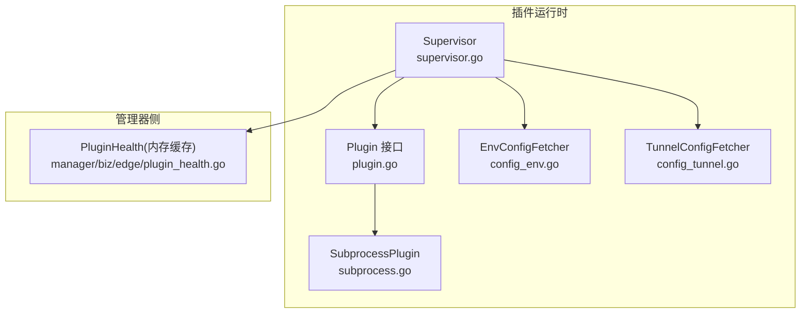
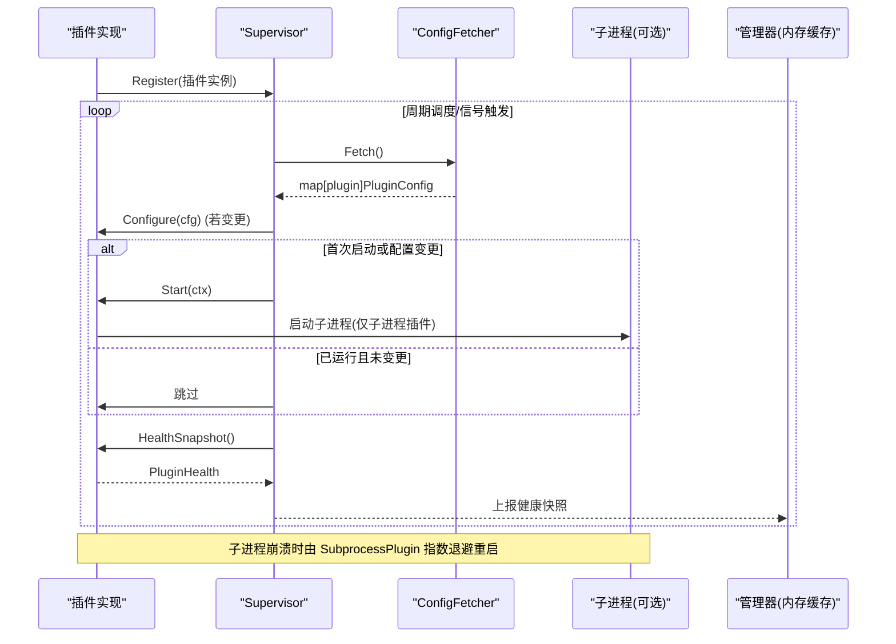
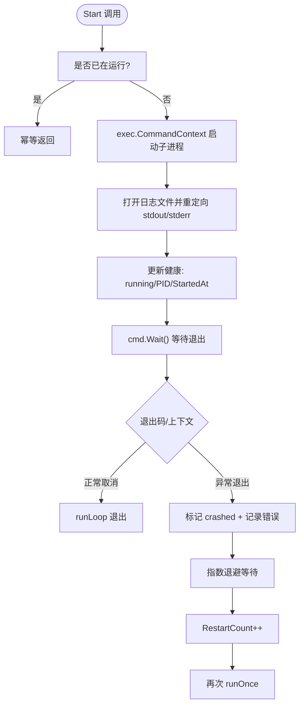
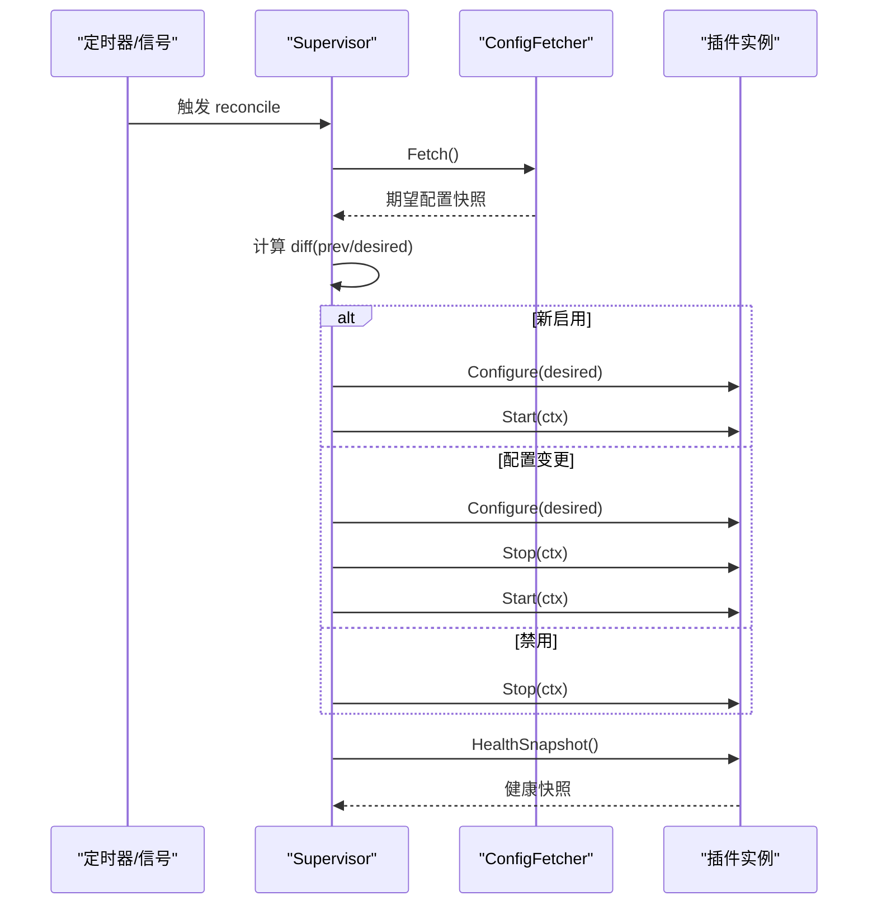
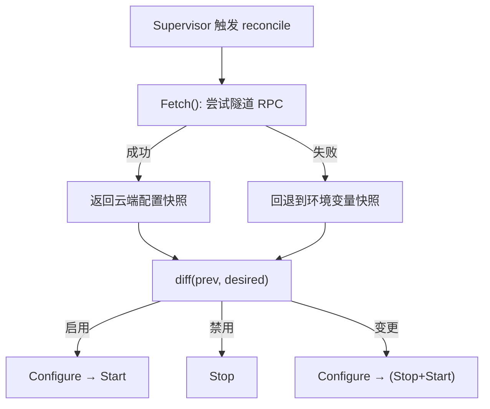
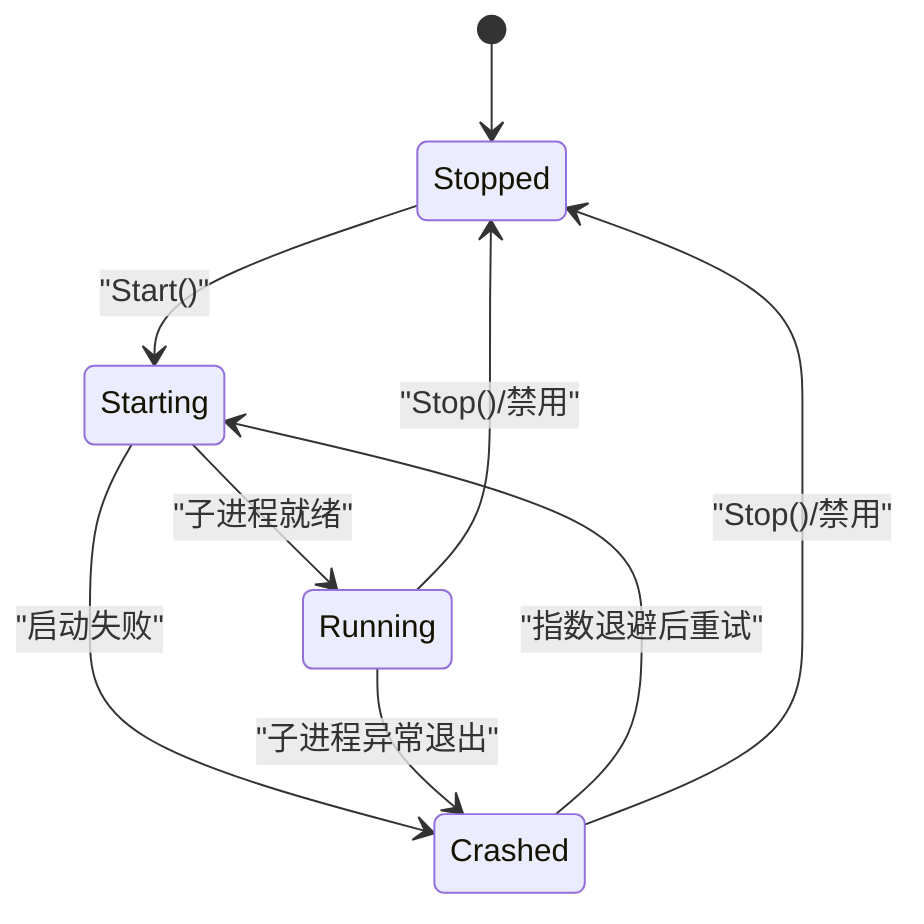
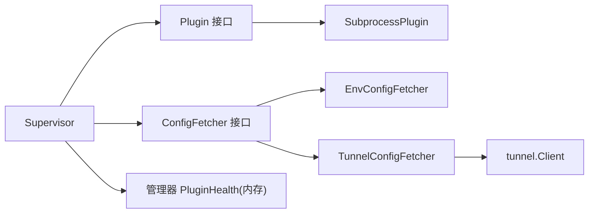

# 插件架构设计

<cite>
**本文引用的文件**   
- [internal/edgeagent/plugins/plugin.go](file://internal/edgeagent/plugins/plugin.go)
- [internal/edgeagent/plugins/supervisor.go](file://internal/edgeagent/plugins/supervisor.go)
- [internal/edgeagent/plugins/subprocess.go](file://internal/edgeagent/plugins/subprocess.go)
- [internal/edgeagent/plugins/config_env.go](file://internal/edgeagent/plugins/config_env.go)
- [internal/edgeagent/plugins/config_tunnel.go](file://internal/edgeagent/plugins/config_tunnel.go)
- [internal/manager/biz/edge/plugin_health.go](file://internal/manager/biz/edge/plugin_health.go)
</cite>

## 目录
1. [简介](#简介)
2. [项目结构](#项目结构)
3. [核心组件](#核心组件)
4. [架构总览](#架构总览)
5. [详细组件分析](#详细组件分析)
6. [依赖关系分析](#依赖关系分析)
7. [性能考量](#性能考量)
8. [故障排查指南](#故障排查指南)
9. [结论](#结论)
10. [附录：开发最佳实践与示例指引](#附录开发最佳实践与示例指引)

## 简介
本文件面向插件开发者，系统化阐述边缘侧插件系统的架构设计与实现要点。内容覆盖：
- 插件接口定义与生命周期管理（Configure → Start → HealthSnapshot → Stop）
- 进程模型（in-process vs subprocess）与统一抽象
- Supervisor 管理机制（注册、配置拉取、差异对比、启停编排、健康快照聚合）
- 插件配置系统（PluginConfig 结构、云端推送与环境变量回退、动态重配置）
- 健康检查机制（状态报告、错误处理、自动重启策略）
- 面向插件开发者的最佳实践与实现建议

## 项目结构
插件子系统位于 edgeagent 的 plugins 包中，围绕“接口 + 通用运行时 + 配置来源”展开：
- plugin.go：定义 Plugin 接口、配置结构、健康状态与配置拉取器接口
- supervisor.go：Supervisor 主循环，负责注册、拉取配置、差异对比、启停编排与健康快照收集
- subprocess.go：SubprocessPlugin 通用封装，提供子进程生命周期、崩溃指数退避重启、日志落盘等能力
- config_env.go：环境变量驱动的配置拉取器（本地/开发模式）
- config_tunnel.go：通过隧道 RPC 从管理器拉取配置，并具备环境变量的回退能力



图表来源
- [internal/edgeagent/plugins/plugin.go:18-52](file://internal/edgeagent/plugins/plugin.go#L18-L52)
- [internal/edgeagent/plugins/supervisor.go:36-110](file://internal/edgeagent/plugins/supervisor.go#L36-L110)
- [internal/edgeagent/plugins/subprocess.go:32-102](file://internal/edgeagent/plugins/subprocess.go#L32-L102)
- [internal/edgeagent/plugins/config_env.go:32-71](file://internal/edgeagent/plugins/config_env.go#L32-L71)
- [internal/edgeagent/plugins/config_tunnel.go:22-108](file://internal/edgeagent/plugins/config_tunnel.go#L22-L108)
- [internal/manager/biz/edge/plugin_health.go:11-21](file://internal/manager/biz/edge/plugin_health.go#L11-L21)

章节来源
- [internal/edgeagent/plugins/plugin.go:1-119](file://internal/edgeagent/plugins/plugin.go#L1-L119)
- [internal/edgeagent/plugins/supervisor.go:1-276](file://internal/edgeagent/plugins/supervisor.go#L1-L276)
- [internal/edgeagent/plugins/subprocess.go:1-318](file://internal/edgeagent/plugins/subprocess.go#L1-L318)
- [internal/edgeagent/plugins/config_env.go:1-101](file://internal/edgeagent/plugins/config_env.go#L1-L101)
- [internal/edgeagent/plugins/config_tunnel.go:1-138](file://internal/edgeagent/plugins/config_tunnel.go#L1-L138)
- [internal/manager/biz/edge/plugin_health.go:1-71](file://internal/manager/biz/edge/plugin_health.go#L1-L71)

## 核心组件
- Plugin 接口：统一描述插件的能力与生命周期方法，包括 Name、Configure、Start、Stop、HealthSnapshot
- PluginConfig：插件配置载体，包含启用开关、边端标识、数据面 Endpoint、鉴权信息以及插件特定 Spec
- ConfigFetcher 接口：抽象配置来源，支持环境变量与隧道 RPC 两种实现
- Supervisor：插件注册表与协调器，周期性拉取配置并执行差异对比与启停编排
- SubprocessPlugin：子进程插件通用封装，负责渲染配置、启动/停止子进程、崩溃指数退避重启、健康状态维护

章节来源
- [internal/edgeagent/plugins/plugin.go:18-119](file://internal/edgeagent/plugins/plugin.go#L18-L119)
- [internal/edgeagent/plugins/supervisor.go:36-110](file://internal/edgeagent/plugins/supervisor.go#L36-L110)
- [internal/edgeagent/plugins/subprocess.go:32-102](file://internal/edgeagent/plugins/subprocess.go#L32-L102)

## 架构总览
插件系统采用“接口 + 通用运行时 + 可插拔配置源”的分层设计：
- 上层：具体插件实现（如 metrics/logs/traces），遵循 Plugin 接口
- 中间层：Supervisor 负责配置拉取、差异对比、生命周期编排与健康快照聚合
- 底层：SubprocessPlugin 为需要独立进程的插件提供统一运行与自愈能力；in-process 插件直接以 goroutine 运行
- 配置来源：优先使用隧道 RPC 获取云端配置，失败时回退到环境变量；两者均输出统一的 PluginConfig 快照
- 健康上报：Supervisor 定期调用各插件 HealthSnapshot，汇总后随心跳上报至管理器，管理器在内存中缓存用于 UI 展示



图表来源
- [internal/edgeagent/plugins/supervisor.go:114-133](file://internal/edgeagent/plugins/supervisor.go#L114-L133)
- [internal/edgeagent/plugins/supervisor.go:138-230](file://internal/edgeagent/plugins/supervisor.go#L138-L230)
- [internal/edgeagent/plugins/subprocess.go:194-235](file://internal/edgeagent/plugins/subprocess.go#L194-L235)
- [internal/manager/biz/edge/plugin_health.go:41-55](file://internal/manager/biz/edge/plugin_health.go#L41-L55)

## 详细组件分析

### 插件接口与生命周期
- 生命周期顺序：Configure → Start → (HealthSnapshot)* → Stop
- Configure：接收最新配置，需幂等处理重配；返回错误将导致插件进入“crashed”可见状态
- Start：启动工作（goroutine 或子进程），对重复 Start 应幂等
- Stop：优雅关闭（子进程 SIGTERM + 宽限期；in-process 取消 context），对未运行状态安全无操作
- HealthSnapshot：非阻塞地返回当前健康快照，供 Supervisor 周期性采集

```mermaid
classDiagram
class Plugin {
+Name() string
+Configure(cfg PluginConfig) error
+Start(ctx context.Context) error
+Stop(ctx context.Context) error
+HealthSnapshot() PluginHealth
}
class PluginConfig {
+bool Enabled
+uint64 EdgeID
+string Endpoint
+string AuthUser
+string AuthPass
+map[string]interface{} Spec
}
class PluginHealth {
+string Name
+PluginState State
+string LastError
+int RestartCount
+int PID
+time.Time StartedAt
+time.Time UpdatedAt
+[]TargetHealth Targets
}
class TargetHealth {
+string ID
+string Name
+string Kind
+string State
+string LastError
+int Samples
+time.Time LastSuccessAt
+time.Time UpdatedAt
}
Plugin --> PluginConfig : "接收配置"
Plugin --> PluginHealth : "返回健康"
PluginHealth --> TargetHealth : "多目标指标"
```

图表来源
- [internal/edgeagent/plugins/plugin.go:18-106](file://internal/edgeagent/plugins/plugin.go#L18-L106)

章节来源
- [internal/edgeagent/plugins/plugin.go:18-106](file://internal/edgeagent/plugins/plugin.go#L18-L106)

### 进程模型：in-process vs subprocess
- in-process 插件：作为 goroutine 运行于 ongrid-edge 进程内，适合轻量、低隔离需求的任务
- subprocess 插件：通过 SubprocessPlugin 包装外部二进制（如 promtail、otelcol），具备：
  - 配置渲染与写入磁盘
  - 子进程启动/停止、SIGTERM 优雅退出与超时保护
  - 崩溃指数退避重启（1s→2s→…上限 5min）
  - 标准输出/错误捕获到插件日志文件
  - 健康状态（PID、StartedAt、RestartCount、LastError）维护



图表来源
- [internal/edgeagent/plugins/subprocess.go:137-156](file://internal/edgeagent/plugins/subprocess.go#L137-L156)
- [internal/edgeagent/plugins/subprocess.go:194-235](file://internal/edgeagent/plugins/subprocess.go#L194-L235)
- [internal/edgeagent/plugins/subprocess.go:239-287](file://internal/edgeagent/plugins/subprocess.go#L239-L287)

章节来源
- [internal/edgeagent/plugins/subprocess.go:32-102](file://internal/edgeagent/plugins/subprocess.go#L32-L102)
- [internal/edgeagent/plugins/subprocess.go:137-183](file://internal/edgeagent/plugins/subprocess.go#L137-L183)
- [internal/edgeagent/plugins/subprocess.go:194-311](file://internal/edgeagent/plugins/subprocess.go#L194-L311)

### Supervisor 管理机制
- 注册：Register 添加插件实例，按名称去重
- 拉取与合并：周期性或信号触发 Fetch，得到期望配置快照
- 差异对比：比较 current 与 desired，决定是否需要 Configure/Start/Stop
- 启停编排：
  - 新增启用：Configure → Start
  - 禁用：Stop
  - 配置变更：先 Configure，再根据 needRestart 决定是否 Stop+Start
- 健康快照：遍历所有插件，调用 HealthSnapshot 并排序返回
- 优雅关闭：ctx 取消时，对所有运行中的插件进行带超时的 Stop



图表来源
- [internal/edgeagent/plugins/supervisor.go:114-133](file://internal/edgeagent/plugins/supervisor.go#L114-L133)
- [internal/edgeagent/plugins/supervisor.go:138-230](file://internal/edgeagent/plugins/supervisor.go#L138-L230)
- [internal/edgeagent/plugins/supervisor.go:94-110](file://internal/edgeagent/plugins/supervisor.go#L94-L110)

章节来源
- [internal/edgeagent/plugins/supervisor.go:36-110](file://internal/edgeagent/plugins/supervisor.go#L36-L110)
- [internal/edgeagent/plugins/supervisor.go:114-230](file://internal/edgeagent/plugins/supervisor.go#L114-L230)
- [internal/edgeagent/plugins/supervisor.go:232-251](file://internal/edgeagent/plugins/supervisor.go#L232-L251)

### 配置系统：结构、来源与动态重配置
- PluginConfig 字段说明：
  - Enabled：是否启用
  - EdgeID：边端标识，注入标签集
  - Endpoint：数据面推送地址
  - AuthUser/AuthPass：数据面鉴权（basic-auth 用户名/密码或 bearer token）
  - Spec：插件特定 JSON 配置
- 配置来源：
  - EnvConfigFetcher：从环境变量读取，键名约定清晰，便于本地验证与离线部署
  - TunnelConfigFetcher：通过隧道 RPC 拉取云端配置，失败时回退到环境变量快照
- 动态重配置：
  - Supervisor 定时轮询与信号触发双重保障
  - 配置变更时先 Configure，必要时 Stop+Start 以应用新配置
  - 子进程插件可通过 SIGHUP 热重载（若二进制支持），否则走 Stop+Start



图表来源
- [internal/edgeagent/plugins/config_tunnel.go:58-108](file://internal/edgeagent/plugins/config_tunnel.go#L58-L108)
- [internal/edgeagent/plugins/config_env.go:46-71](file://internal/edgeagent/plugins/config_env.go#L46-L71)
- [internal/edgeagent/plugins/supervisor.go:138-230](file://internal/edgeagent/plugins/supervisor.go#L138-L230)

章节来源
- [internal/edgeagent/plugins/plugin.go:54-69](file://internal/edgeagent/plugins/plugin.go#L54-L69)
- [internal/edgeagent/plugins/config_env.go:10-71](file://internal/edgeagent/plugins/config_env.go#L10-L71)
- [internal/edgeagent/plugins/config_tunnel.go:12-108](file://internal/edgeagent/plugins/config_tunnel.go#L12-L108)
- [internal/edgeagent/plugins/supervisor.go:138-230](file://internal/edgeagent/plugins/supervisor.go#L138-L230)

### 健康检查机制：状态报告、错误处理与自动重启
- 状态枚举：stopped、starting、running、crashed
- 健康快照字段：
  - Name/State/LastError/RestartCount/PID/StartedAt/UpdatedAt/Targets
  - Targets 用于多目标指标插件（如 custommetrics、databasemetrics）
- 错误处理：
  - Configure 失败：记录警告，插件保持“crashed”可见
  - Start 失败：记录警告，不中断其他插件
  - 子进程异常退出：记录错误，指数退避重启，RestartCount 单调递增
- 自动重启策略：
  - 指数退避：1s→2s→4s→…上限 5min
  - 仅在“希望运行但意外退出”时触发重启
  - 当管理器推送新配置并重新启用时，RestartCount 重置（由 Supervisor 的“首次启动”语义保证）
- 管理器侧：
  - 内存缓存最近一次健康快照，附带 ReportedAt 时间戳，用于 UI 展示新鲜度



图表来源
- [internal/edgeagent/plugins/plugin.go:71-93](file://internal/edgeagent/plugins/plugin.go#L71-93)
- [internal/edgeagent/plugins/subprocess.go:194-235](file://internal/edgeagent/plugins/subprocess.go#L194-L235)
- [internal/manager/biz/edge/plugin_health.go:11-21](file://internal/manager/biz/edge/plugin_health.go#L11-L21)

章节来源
- [internal/edgeagent/plugins/plugin.go:71-106](file://internal/edgeagent/plugins/plugin.go#L71-L106)
- [internal/edgeagent/plugins/subprocess.go:194-311](file://internal/edgeagent/plugins/subprocess.go#L194-L311)
- [internal/manager/biz/edge/plugin_health.go:36-71](file://internal/manager/biz/edge/plugin_health.go#L36-L71)

## 依赖关系分析
- 组件耦合：
  - Supervisor 依赖 Plugin 接口与 ConfigFetcher 接口，松耦合，易于替换配置源
  - SubprocessPlugin 依赖操作系统 exec 与文件系统，屏蔽了子进程细节
- 外部依赖：
  - 隧道客户端（tunnel.Client）用于远程配置拉取
  - 管理器侧内存缓存用于健康展示
- 潜在风险：
  - 配置渲染函数与 Args 构造逻辑集中在具体插件中，需确保幂等与健壮性
  - 子进程二进制缺失或权限不足会导致启动失败，应在部署阶段校验



图表来源
- [internal/edgeagent/plugins/supervisor.go:36-110](file://internal/edgeagent/plugins/supervisor.go#L36-L110)
- [internal/edgeagent/plugins/subprocess.go:32-102](file://internal/edgeagent/plugins/subprocess.go#L32-L102)
- [internal/edgeagent/plugins/config_env.go:32-71](file://internal/edgeagent/plugins/config_env.go#L32-L71)
- [internal/edgeagent/plugins/config_tunnel.go:22-108](file://internal/edgeagent/plugins/config_tunnel.go#L22-L108)
- [internal/manager/biz/edge/plugin_health.go:41-55](file://internal/manager/biz/edge/plugin_health.go#L41-L55)

章节来源
- [internal/edgeagent/plugins/supervisor.go:36-110](file://internal/edgeagent/plugins/supervisor.go#L36-L110)
- [internal/edgeagent/plugins/subprocess.go:32-102](file://internal/edgeagent/plugins/subprocess.go#L32-L102)
- [internal/edgeagent/plugins/config_env.go:32-71](file://internal/edgeagent/plugins/config_env.go#L32-L71)
- [internal/edgeagent/plugins/config_tunnel.go:22-108](file://internal/edgeagent/plugins/config_tunnel.go#L22-L108)
- [internal/manager/biz/edge/plugin_health.go:41-55](file://internal/manager/biz/edge/plugin_health.go#L41-L55)

## 性能考量
- 配置拉取频率：默认 60s 轮询，避免频繁网络请求；支持信号快速重配
- 健康快照采集：遍历插件集合，注意插件 HealthSnapshot 必须非阻塞
- 子进程资源：
  - 日志文件 I/O 开销可控，建议合理设置日志轮转
  - 指数退避重启避免雪崩，上限 5min 防止频繁重启
- 差异对比：Spec 使用浅比较，对于大型 Spec 应考虑更高效的比较策略

## 故障排查指南
- 常见症状与定位：
  - 插件处于“crashed”：查看 LastError 与子进程日志文件路径，确认二进制是否存在、权限是否正确
  - 配置未生效：检查 Supervisor 日志中的“reconcile snapshot”，确认 Desired 与 Current 差异
  - 健康长时间未更新：确认心跳是否正常、Supervisor 是否仍在运行
- 关键日志位置：
  - Supervisor：组件日志 comp=plugin-supervisor
  - 子进程：workDir/<name>.log
- 恢复步骤：
  - 修正配置后触发 TriggerReload 或等待下次轮询
  - 若子进程异常退出，等待指数退避后自动重启；必要时手动 Stop+Start

章节来源
- [internal/edgeagent/plugins/supervisor.go:138-230](file://internal/edgeagent/plugins/supervisor.go#L138-L230)
- [internal/edgeagent/plugins/subprocess.go:239-287](file://internal/edgeagent/plugins/subprocess.go#L239-L287)

## 结论
该插件架构通过清晰的接口与通用运行时，实现了高内聚、低耦合的可插拔扩展能力。Supervisor 提供了稳定的生命周期管理与自愈机制，配置系统兼顾云端推送与本地回退，健康检查贯穿端到端链路，便于运维观测与排障。按照本文最佳实践实现的插件，可在不同进程模型下获得一致的管理体验。

## 附录：开发最佳实践与示例指引
- 接口实现规范
  - 严格遵循生命周期顺序，确保 Configure/Start/Stop 幂等
  - HealthSnapshot 必须非阻塞，避免影响心跳
  - 子进程插件建议使用 SubprocessPlugin，减少样板代码
- 错误处理模式
  - Configure 失败：返回错误，让 Supervisor 记录并暴露“crashed”状态
  - Start 失败：返回错误，避免吞掉异常
  - 子进程异常：利用 SubprocessPlugin 的崩溃重启策略，无需自行实现
- 性能优化建议
  - 避免在 HealthSnapshot 中进行耗时操作
  - 合理设置子进程日志级别与轮转策略
  - 大 Spec 配置考虑增量渲染与高效比较
- 配置来源选择
  - 生产环境优先使用 TunnelConfigFetcher，结合环境变量回退
  - 开发与调试可使用 EnvConfigFetcher 快速验证
- 参考实现路径
  - 插件接口与数据结构：[internal/edgeagent/plugins/plugin.go](file://internal/edgeagent/plugins/plugin.go)
  - 子进程通用封装：[internal/edgeagent/plugins/subprocess.go](file://internal/edgeagent/plugins/subprocess.go)
  - 配置拉取器（环境/隧道）：[internal/edgeagent/plugins/config_env.go](file://internal/edgeagent/plugins/config_env.go)、[internal/edgeagent/plugins/config_tunnel.go](file://internal/edgeagent/plugins/config_tunnel.go)
  - 管理器健康缓存：[internal/manager/biz/edge/plugin_health.go](file://internal/manager/biz/edge/plugin_health.go)