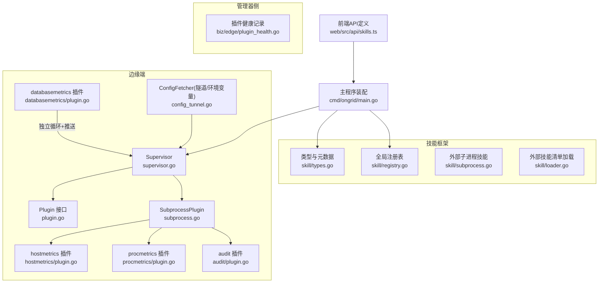
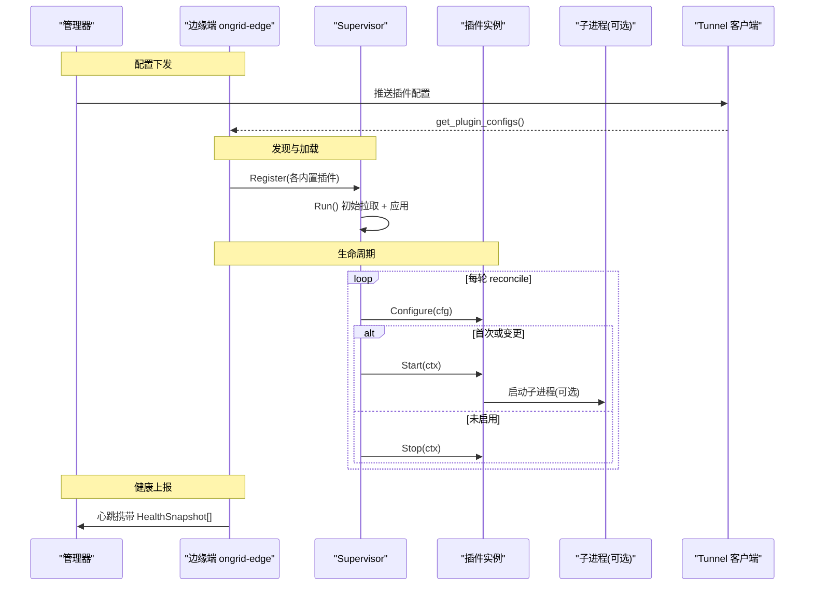
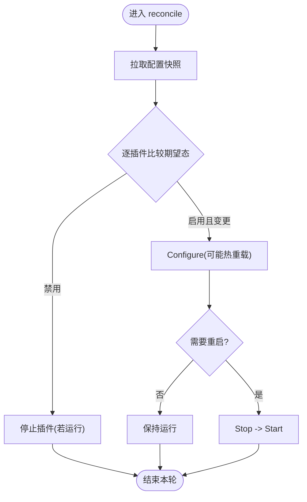
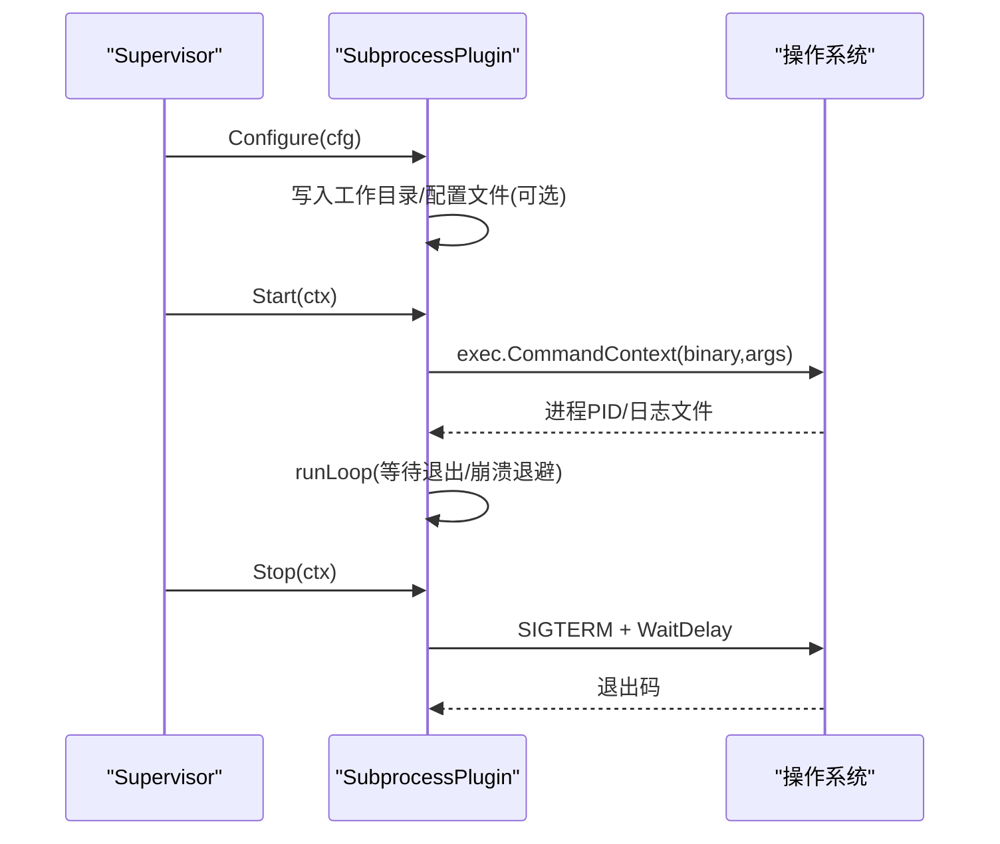
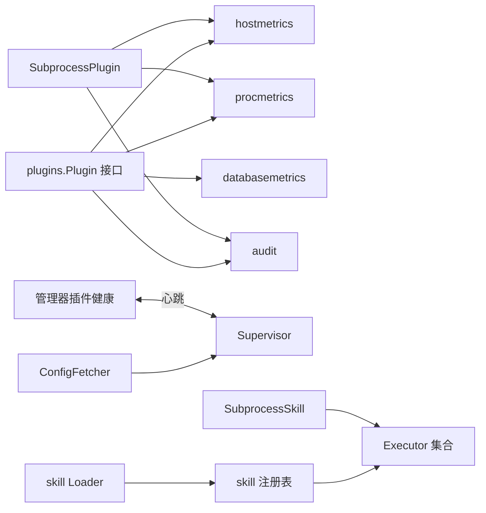
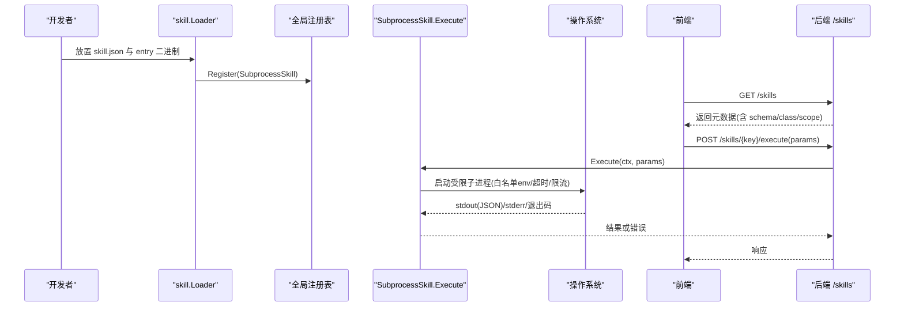

# 插件生态系统

<cite>
**本文引用的文件**   
- [internal/edgeagent/plugins/plugin.go](file://internal/edgeagent/plugins/plugin.go)
- [internal/edgeagent/plugins/supervisor.go](file://internal/edgeagent/plugins/supervisor.go)
- [internal/edgeagent/plugins/subprocess.go](file://internal/edgeagent/plugins/subprocess.go)
- [internal/edgeagent/plugins/config_tunnel.go](file://internal/edgeagent/plugins/config_tunnel.go)
- [internal/edgeagent/plugins/hostmetrics/plugin.go](file://internal/edgeagent/plugins/hostmetrics/plugin.go)
- [internal/edgeagent/plugins/procmetrics/plugin.go](file://internal/edgeagent/plugins/procmetrics/plugin.go)
- [internal/edgeagent/plugins/databasemetrics/plugin.go](file://internal/edgeagent/plugins/databasemetrics/plugin.go)
- [internal/edgeagent/plugins/audit/plugin.go](file://internal/edgeagent/plugins/audit/plugin.go)
- [internal/manager/biz/edge/plugin_health.go](file://internal/manager/biz/edge/plugin_health.go)
- [internal/skill/types.go](file://internal/skill/types.go)
- [internal/skill/loader.go](file://internal/skill/loader.go)
- [internal/skill/registry.go](file://internal/skill/registry.go)
- [internal/skill/subprocess.go](file://internal/skill/subprocess.go)
- [cmd/ongrid/main.go](file://cmd/ongrid/main.go)
- [web/src/api/skills.ts](file://web/src/api/skills.ts)
</cite>

## 目录
1. [简介](#简介)
2. [项目结构](#项目结构)
3. [核心组件](#核心组件)
4. [架构总览](#架构总览)
5. [详细组件分析](#详细组件分析)
6. [依赖关系分析](#依赖关系分析)
7. [性能考量](#性能考量)
8. [故障排查指南](#故障排查指南)
9. [结论](#结论)
10. [附录：插件与技能开发指南](#附录插件与技能开发指南)

## 简介
本文件系统性阐述 ongrid 的“插件生态系统”，涵盖边缘侧插件（metrics/logs/traces/audit 等）的发现、加载、生命周期管理与健康上报，以及 L2 技能系统（Skills）的设计与实现。文档面向插件开发者，提供接口契约、配置管理、错误处理、测试策略、安全模型与权限控制、资源限制机制，并给出最佳实践与性能优化建议。

## 项目结构
- 插件运行时位于 internal/edgeagent/plugins，包含统一 Plugin 接口、Supervisor 调度器、SubprocessPlugin 通用子进程封装，以及多个内置插件（hostmetrics、procmetrics、databasemetrics、audit 等）。
- 技能框架位于 internal/skill，定义 Executor/Metadata/ParamSchema 等类型，提供全局注册表、外部子进程技能加载与安全执行环境。
- 管理器侧维护插件健康快照，供前端展示与诊断。
- 前端通过 /skills API 暴露技能清单与执行入口。



图表来源
- [internal/edgeagent/plugins/supervisor.go:1-120](file://internal/edgeagent/plugins/supervisor.go#L1-L120)
- [internal/edgeagent/plugins/plugin.go:18-119](file://internal/edgeagent/plugins/plugin.go#L18-L119)
- [internal/edgeagent/plugins/subprocess.go:1-120](file://internal/edgeagent/plugins/subprocess.go#L1-L120)
- [internal/edgeagent/plugins/hostmetrics/plugin.go:1-120](file://internal/edgeagent/plugins/hostmetrics/plugin.go#L1-L120)
- [internal/edgeagent/plugins/procmetrics/plugin.go:1-60](file://internal/edgeagent/plugins/procmetrics/plugin.go#L1-L60)
- [internal/edgeagent/plugins/audit/plugin.go:1-75](file://internal/edgeagent/plugins/audit/plugin.go#L1-L75)
- [internal/edgeagent/plugins/databasemetrics/plugin.go:1-120](file://internal/edgeagent/plugins/databasemetrics/plugin.go#L1-L120)
- [internal/edgeagent/plugins/config_tunnel.go:1-34](file://internal/edgeagent/plugins/config_tunnel.go#L1-L34)
- [internal/manager/biz/edge/plugin_health.go:1-70](file://internal/manager/biz/edge/plugin_health.go#L1-L70)
- [internal/skill/types.go:1-120](file://internal/skill/types.go#L1-L120)
- [internal/skill/registry.go:1-80](file://internal/skill/registry.go#L1-L80)
- [internal/skill/subprocess.go:1-120](file://internal/skill/subprocess.go#L1-L120)
- [internal/skill/loader.go:1-120](file://internal/skill/loader.go#L1-L120)
- [cmd/ongrid/main.go:1856-1894](file://cmd/ongrid/main.go#L1856-L1894)
- [web/src/api/skills.ts:1-60](file://web/src/api/skills.ts#L1-L60)

章节来源
- [internal/edgeagent/plugins/supervisor.go:1-120](file://internal/edgeagent/plugins/supervisor.go#L1-L120)
- [internal/edgeagent/plugins/plugin.go:18-119](file://internal/edgeagent/plugins/plugin.go#L18-L119)
- [internal/edgeagent/plugins/subprocess.go:1-120](file://internal/edgeagent/plugins/subprocess.go#L1-L120)
- [internal/edgeagent/plugins/hostmetrics/plugin.go:1-120](file://internal/edgeagent/plugins/hostmetrics/plugin.go#L1-L120)
- [internal/edgeagent/plugins/procmetrics/plugin.go:1-60](file://internal/edgeagent/plugins/procmetrics/plugin.go#L1-L60)
- [internal/edgeagent/plugins/audit/plugin.go:1-75](file://internal/edgeagent/plugins/audit/plugin.go#L1-L75)
- [internal/edgeagent/plugins/databasemetrics/plugin.go:1-120](file://internal/edgeagent/plugins/databasemetrics/plugin.go#L1-L120)
- [internal/edgeagent/plugins/config_tunnel.go:1-34](file://internal/edgeagent/plugins/config_tunnel.go#L1-L34)
- [internal/manager/biz/edge/plugin_health.go:1-70](file://internal/manager/biz/edge/plugin_health.go#L1-L70)
- [internal/skill/types.go:1-120](file://internal/skill/types.go#L1-L120)
- [internal/skill/registry.go:1-80](file://internal/skill/registry.go#L1-L80)
- [internal/skill/subprocess.go:1-120](file://internal/skill/subprocess.go#L1-L120)
- [internal/skill/loader.go:1-120](file://internal/skill/loader.go#L1-L120)
- [cmd/ongrid/main.go:1856-1894](file://cmd/ongrid/main.go#L1856-L1894)
- [web/src/api/skills.ts:1-60](file://web/src/api/skills.ts#L1-L60)

## 核心组件
- 插件接口与配置
  - Plugin 接口定义了 Name/Configure/Start/Stop/HealthSnapshot 生命周期方法；PluginConfig 承载启用开关、边端标识、数据面 Endpoint/鉴权与插件私有 Spec。
  - ConfigFetcher 抽象了配置来源（隧道拉取与环境变量回退），使 Supervisor 可热重载。
- 插件调度器
  - Supervisor 周期拉取配置，对比期望态与实际态，按插件维度进行 Configure/Start/Stop 编排，并汇总 HealthSnapshot 上报。
- 子进程插件通用封装
  - SubprocessPlugin 负责渲染配置、启动子进程、捕获日志、崩溃指数退避重启、优雅停止与健康状态更新。
- 内置插件
  - hostmetrics：包装 node_exporter，支持 textfile 补充指标（如 conntrack）。
  - procmetrics：包装 process_exporter，基于 YAML 配置匹配进程组。
  - databasemetrics：为每个数据库源拉起 exporter，定时抓取并通过隧道推送样本。
  - audit：包装 auditbeat，输出 JSONL 由 logs 插件采集至 Loki。
- 管理器侧健康
  - 内存中缓存最近一次心跳中的插件健康快照，供 UI 展示。

章节来源
- [internal/edgeagent/plugins/plugin.go:18-119](file://internal/edgeagent/plugins/plugin.go#L18-L119)
- [internal/edgeagent/plugins/supervisor.go:112-230](file://internal/edgeagent/plugins/supervisor.go#L112-L230)
- [internal/edgeagent/plugins/subprocess.go:17-120](file://internal/edgeagent/plugins/subprocess.go#L17-L120)
- [internal/edgeagent/plugins/hostmetrics/plugin.go:1-120](file://internal/edgeagent/plugins/hostmetrics/plugin.go#L1-L120)
- [internal/edgeagent/plugins/procmetrics/plugin.go:1-60](file://internal/edgeagent/plugins/procmetrics/plugin.go#L1-L60)
- [internal/edgeagent/plugins/databasemetrics/plugin.go:1-120](file://internal/edgeagent/plugins/databasemetrics/plugin.go#L1-L120)
- [internal/edgeagent/plugins/audit/plugin.go:1-75](file://internal/edgeagent/plugins/audit/plugin.go#L1-L75)
- [internal/manager/biz/edge/plugin_health.go:1-70](file://internal/manager/biz/edge/plugin_health.go#L1-L70)

## 架构总览
下图展示了从管理器到边缘端的插件发现、加载、运行与健康上报的整体流程，以及技能框架在管理器侧的装配与调用路径。



图表来源
- [internal/edgeagent/plugins/supervisor.go:112-230](file://internal/edgeagent/plugins/supervisor.go#L112-L230)
- [internal/edgeagent/plugins/config_tunnel.go:1-34](file://internal/edgeagent/plugins/config_tunnel.go#L1-L34)
- [internal/manager/biz/edge/plugin_health.go:1-70](file://internal/manager/biz/edge/plugin_health.go#L1-L70)

## 详细组件分析

### 插件接口与配置契约
- 关键要点
  - 命名遵循 OpenTelemetry 信号名（metrics/logs/traces/profiles）。
  - Configure 必须幂等且能热重载；Start/Stop 需对重复调用安全。
  - HealthSnapshot 不可阻塞，返回当前状态与目标级健康（多目标场景）。
  - PluginConfig.Spec 为插件私有 JSON 片段，Endpoint/AuthUser/AuthPass 用于数据面推送。
- 复杂度与扩展性
  - 新增插件只需实现接口并在启动时注册；Supervisor 自动编排。
  - 多目标插件可通过 Targets 字段上报细粒度健康。

```mermaid
classDiagram
class Plugin {
+Name() string
+Configure(cfg PluginConfig) error
+Start(ctx context.Context) error
+Stop(ctx context.Context) error
+HealthSnapshot() PluginHealth
}
class PluginConfig {
+bool Enabled
+uint64 EdgeID
+string Endpoint
+string AuthUser
+string AuthPass
+map~string~interface{} Spec
}
class PluginHealth {
+string Name
+PluginState State
+string LastError
+int RestartCount
+int PID
+time.Time StartedAt
+time.Time UpdatedAt
+[]TargetHealth Targets
}
class TargetHealth {
+string ID
+string Name
+string Kind
+string State
+string LastError
+int Samples
+time.Time LastSuccessAt
+time.Time UpdatedAt
}
class ConfigFetcher {
<<interface>>
+Fetch(ctx) map[string]PluginConfig
}
Plugin ..> PluginConfig : "使用"
Plugin ..> PluginHealth : "返回"
PluginHealth o-- TargetHealth : "包含"
Supervisor ..> ConfigFetcher : "拉取配置"
```

图表来源
- [internal/edgeagent/plugins/plugin.go:18-119](file://internal/edgeagent/plugins/plugin.go#L18-L119)

章节来源
- [internal/edgeagent/plugins/plugin.go:18-119](file://internal/edgeagent/plugins/plugin.go#L18-L119)

### 插件调度器（Supervisor）
- 职责
  - 周期拉取配置（默认 60s），触发式重载（收到 manager 推送信号）。
  - 比较期望态与实际态，按插件维度执行 Configure/Start/Stop。
  - 聚合所有插件 HealthSnapshot 供心跳上报。
- 健壮性
  - 单插件失败不影响其他插件；停止带超时保护；关闭时优雅停止全部。
- 配置相等性
  - 仅当 Spec 语义变化才触发重配/重启，避免不必要的抖动。



图表来源
- [internal/edgeagent/plugins/supervisor.go:135-230](file://internal/edgeagent/plugins/supervisor.go#L135-L230)

章节来源
- [internal/edgeagent/plugins/supervisor.go:112-230](file://internal/edgeagent/plugins/supervisor.go#L112-L230)

### 子进程插件通用封装（SubprocessPlugin）
- 能力
  - 渲染配置到磁盘（可选）、构造 CLI 参数、启动子进程、捕获 stdout/stderr 到日志文件。
  - 崩溃指数退避重启（上限 5 分钟），PID/StartedAt/LastError 等健康信息维护。
  - 优雅停止：SIGTERM + WaitDelay 降级 SIGKILL。
- 适用场景
  - 无需自行处理进程管理的插件（logs/promtail、traces/otelcol、auditbeat 等）。



图表来源
- [internal/edgeagent/plugins/subprocess.go:107-183](file://internal/edgeagent/plugins/subprocess.go#L107-L183)
- [internal/edgeagent/plugins/subprocess.go:194-287](file://internal/edgeagent/plugins/subprocess.go#L194-L287)

章节来源
- [internal/edgeagent/plugins/subprocess.go:17-120](file://internal/edgeagent/plugins/subprocess.go#L17-L120)
- [internal/edgeagent/plugins/subprocess.go:194-287](file://internal/edgeagent/plugins/subprocess.go#L194-L287)

### 内置插件详解

#### hostmetrics（主机指标）
- 行为
  - 启动 node_exporter，监听地址可配置；追加 textfile 目录以注入补充指标（如 nf_conntrack）。
  - 通过 in-process 生产者周期性写入 .prom 文件，node_exporter 自动采集。
- 配置键
  - listen_address、collectors_enabled、collectors_disabled、extra_args。

章节来源
- [internal/edgeagent/plugins/hostmetrics/plugin.go:1-120](file://internal/edgeagent/plugins/hostmetrics/plugin.go#L1-L120)
- [internal/edgeagent/plugins/hostmetrics/plugin.go:233-277](file://internal/edgeagent/plugins/hostmetrics/plugin.go#L233-L277)

#### procmetrics（进程指标）
- 行为
  - 启动 process_exporter，根据 YAML 配置匹配进程组，暴露 per-process 指标。
- 配置键
  - listen_address、process_names（透传给 YAML）。

章节来源
- [internal/edgeagent/plugins/procmetrics/plugin.go:1-60](file://internal/edgeagent/plugins/procmetrics/plugin.go#L1-L60)
- [internal/edgeagent/plugins/procmetrics/plugin.go:62-128](file://internal/edgeagent/plugins/procmetrics/plugin.go#L62-L128)

#### databasemetrics（数据库指标）
- 行为
  - 解析 spec，为每个 enabled 源拉起对应 exporter，定时 scrape 并通过隧道 push_prom_samples 上报。
  - 本地读取受管密钥文件（严格权限校验），按 source 维度维护健康与样本计数。
- 安全
  - 密钥文件路径必填、非空、权限不宽于 0600。

章节来源
- [internal/edgeagent/plugins/databasemetrics/plugin.go:1-120](file://internal/edgeagent/plugins/databasemetrics/plugin.go#L1-L120)
- [internal/edgeagent/plugins/databasemetrics/plugin.go:326-349](file://internal/edgeagent/plugins/databasemetrics/plugin.go#L326-L349)

#### audit（审计日志采集）
- 行为
  - 启动 auditbeat，输出 JSONL 到 workDir/audit/audit.jsonl；logs 插件自动 tail 到 Loki。
  - Linux-only，darwin 下保持禁用并报告异常直至替换构建。

章节来源
- [internal/edgeagent/plugins/audit/plugin.go:1-75](file://internal/edgeagent/plugins/audit/plugin.go#L1-L75)
- [internal/edgeagent/plugins/audit/plugin.go:76-92](file://internal/edgeagent/plugins/audit/plugin.go#L76-L92)

### 配置获取（隧道与环境变量回退）
- TunnelConfigFetcher 通过隧道 RPC 拉取 per-edge 插件配置；鉴权凭据不从网络传输，由边缘本地环境填充。
- 冷启动或隧道不可用时，回退到 EnvConfigFetcher 提供的默认快照，保证最小可用。

章节来源
- [internal/edgeagent/plugins/config_tunnel.go:1-34](file://internal/edgeagent/plugins/config_tunnel.go#L1-L34)

### 管理器侧插件健康
- 接收心跳中的 HealthSnapshot[]，仅内存缓存，重启清空，约一个心跳间隔内恢复。
- 提供 List/Record 接口，供 UI 展示“最后上报时间”和“错误原因”。

章节来源
- [internal/manager/biz/edge/plugin_health.go:1-70](file://internal/manager/biz/edge/plugin_health.go#L1-L70)

## 依赖关系分析
- 插件层
  - 所有内置插件均依赖 plugins.Plugin 接口与 SubprocessPlugin 通用封装（部分自定义循环，如 databasemetrics）。
  - 配置来源通过 ConfigFetcher 抽象，便于切换与回退。
- 管理器层
  - 通过心跳接收插件健康，无持久化，强调实时可见性。
- 技能框架
  - 全局注册表集中管理 Executor；Loader 扫描外部 skill.json 并注册 SubprocessSkill；SubprocessSkill 在管理器侧以受限环境执行外部二进制。



图表来源
- [internal/edgeagent/plugins/plugin.go:18-119](file://internal/edgeagent/plugins/plugin.go#L18-L119)
- [internal/edgeagent/plugins/supervisor.go:112-230](file://internal/edgeagent/plugins/supervisor.go#L112-L230)
- [internal/edgeagent/plugins/subprocess.go:17-120](file://internal/edgeagent/plugins/subprocess.go#L17-L120)
- [internal/manager/biz/edge/plugin_health.go:1-70](file://internal/manager/biz/edge/plugin_health.go#L1-L70)
- [internal/skill/registry.go:1-80](file://internal/skill/registry.go#L1-L80)
- [internal/skill/loader.go:1-120](file://internal/skill/loader.go#L1-L120)
- [internal/skill/subprocess.go:1-120](file://internal/skill/subprocess.go#L1-L120)

章节来源
- [internal/edgeagent/plugins/plugin.go:18-119](file://internal/edgeagent/plugins/plugin.go#L18-L119)
- [internal/edgeagent/plugins/supervisor.go:112-230](file://internal/edgeagent/plugins/supervisor.go#L112-L230)
- [internal/edgeagent/plugins/subprocess.go:17-120](file://internal/edgeagent/plugins/subprocess.go#L17-L120)
- [internal/manager/biz/edge/plugin_health.go:1-70](file://internal/manager/biz/edge/plugin_health.go#L1-L70)
- [internal/skill/registry.go:1-80](file://internal/skill/registry.go#L1-L80)
- [internal/skill/loader.go:1-120](file://internal/skill/loader.go#L1-L120)
- [internal/skill/subprocess.go:1-120](file://internal/skill/subprocess.go#L1-L120)

## 性能考量
- 插件侧
  - 子进程崩溃退避上限 5 分钟，避免风暴重启；停止操作带超时，防止阻塞关闭。
  - hostmetrics 补充指标写入采用 tmp+rename 原子替换，减少文本文件半写导致的采集失败。
  - databasemetrics 按源并发拉起 exporter，scrape 与 push 带超时，失败快速回退。
- 管理器侧
  - 插件健康仅内存缓存，降低 IO 开销；心跳间隔内即可恢复最新状态。
- 建议
  - 合理设置 scrape 间隔与超时，避免雪崩。
  - 大体积输出（如日志/trace）应走文件/流式通道，避免内存膨胀。

[本节为通用指导，不直接分析具体文件]

## 故障排查指南
- 常见症状与定位
  - 插件状态为 crashed：查看子进程日志文件（workDir/<name>.log）与 LastError。
  - 数据库指标无数据：检查 secret 文件路径与权限（0600 或更严），确认 exporter 二进制存在。
  - hostmetrics 缺少 conntrack：确认内核路径存在且未被旧路径覆盖。
  - 配置未生效：核对 ConfigFetcher 是否成功拉取，关注 reconcile 日志中的 desired/enabled 统计。
- 工具与线索
  - 管理器侧 PluginHealth 显示 ReportedAt 与 LastError，结合 edge 心跳时间判断是否离线。
  - 子进程退出码与 stderr 尾部会出现在错误消息中，便于快速定位。

章节来源
- [internal/edgeagent/plugins/subprocess.go:194-287](file://internal/edgeagent/plugins/subprocess.go#L194-L287)
- [internal/edgeagent/plugins/databasemetrics/plugin.go:326-349](file://internal/edgeagent/plugins/databasemetrics/plugin.go#L326-L349)
- [internal/manager/biz/edge/plugin_health.go:1-70](file://internal/manager/biz/edge/plugin_health.go#L1-L70)

## 结论
本插件生态以统一的 Plugin 接口与 Supervisor 调度为核心，配合 SubprocessPlugin 通用封装，实现了高内聚、低耦合的可插拔架构。内置插件覆盖了主机/进程/数据库/审计等典型观测需求；管理器侧轻量健康缓存满足实时可视。技能框架则提供了跨宿主与云端的统一能力编排与执行模型，具备完善的安全与权限约束。整体设计兼顾稳定性、可扩展性与可运维性。

[本节为总结性内容，不直接分析具体文件]

## 附录：插件与技能开发指南

### 插件开发规范
- 实现步骤
  - 实现 Plugin 接口；如需子进程，优先使用 SubprocessPlugin 封装。
  - 在 main 启动阶段将插件注册到 Supervisor。
  - 编写 render/args 函数，将 PluginConfig.Spec 转换为子进程可识别的配置或参数。
- 配置管理
  - 使用 PluginConfig.Spec 传递插件私有配置；Endpoint/AuthUser/AuthPass 用于数据面推送。
  - 通过 ConfigFetcher 抽象接入隧道或环境变量回退。
- 错误处理
  - Configure 返回错误将导致插件处于“crashed”状态，便于观察；Start/Stop 需幂等。
  - 子进程崩溃后由 SubprocessPlugin 自动退避重启。
- 测试策略
  - 使用 fakePlugin 模拟生命周期与配置变更；验证 Supervisor 的重载与停止逻辑。
  - 针对子进程插件，校验配置渲染与参数组装的正确性。

章节来源
- [internal/edgeagent/plugins/plugin.go:18-119](file://internal/edgeagent/plugins/plugin.go#L18-L119)
- [internal/edgeagent/plugins/supervisor.go:112-230](file://internal/edgeagent/plugins/supervisor.go#L112-L230)
- [internal/edgeagent/plugins/subprocess.go:17-120](file://internal/edgeagent/plugins/subprocess.go#L17-L120)

### 技能系统（Skills）设计与实现
- 核心概念
  - Executor 代表一个可执行能力；Metadata 描述名称、分类、权限等级、作用域、参数 Schema 等。
  - Class 分为 safe/mutating/dangerous；Scope 分为 host/manager。
  - 全局注册表集中管理，支持按类过滤；Loader 扫描外部 skill.json 注册外部子进程技能。
- 外部子进程技能
  - 通过 manifest 声明 name/description/schema/entry/env_allow/timeout/class/category。
  - 执行时以受限环境运行，仅允许白名单环境变量，stdout 作为结果 JSON，stderr 尾随用于诊断。
- 管理器装配
  - 主程序导入 builtin 包以完成注册；服务层通过 frontierbound 分发执行并落库审计。
- 前端集成
  - 通过 /skills 列表与 /skills/{key}/execute 接口交互，UI 自动生成表单与国际化文案。



图表来源
- [internal/skill/loader.go:1-120](file://internal/skill/loader.go#L1-L120)
- [internal/skill/registry.go:1-80](file://internal/skill/registry.go#L1-L80)
- [internal/skill/subprocess.go:1-120](file://internal/skill/subprocess.go#L1-L120)
- [cmd/ongrid/main.go:1856-1894](file://cmd/ongrid/main.go#L1856-L1894)
- [web/src/api/skills.ts:1-60](file://web/src/api/skills.ts#L1-L60)

章节来源
- [internal/skill/types.go:1-120](file://internal/skill/types.go#L1-L120)
- [internal/skill/loader.go:1-120](file://internal/skill/loader.go#L1-L120)
- [internal/skill/registry.go:1-80](file://internal/skill/registry.go#L1-L80)
- [internal/skill/subprocess.go:1-120](file://internal/skill/subprocess.go#L1-L120)
- [cmd/ongrid/main.go:1856-1894](file://cmd/ongrid/main.go#L1856-L1894)
- [web/src/api/skills.ts:1-60](file://web/src/api/skills.ts#L1-L60)

### 安全模型、权限控制与资源限制
- 插件侧
  - 子进程隔离：SubprocessPlugin 以独立进程运行，崩溃退避与优雅停止；工作目录受 systemd ReadWritePaths 约束。
  - 密钥安全：databasemetrics 强制读取 0600 或更严的本地密钥文件。
- 技能侧
  - 作用域与类别：host/manager 决定执行位置；safe/mutating/dangerous 决定审批与 SOP 要求。
  - 外部技能沙箱：Loader 限定 Entry 必须在允许的目录树内（含符号链接解析），EnvAllow 白名单注入环境变量，超时与输出大小限制。
- 未来规划
  - 路线图提出微沙箱、seccomp 能力集、危险类操作的临时容器执行等增强方案。

章节来源
- [internal/edgeagent/plugins/databasemetrics/plugin.go:326-349](file://internal/edgeagent/plugins/databasemetrics/plugin.go#L326-L349)
- [internal/skill/loader.go:176-254](file://internal/skill/loader.go#L176-L254)
- [internal/skill/subprocess.go:174-205](file://internal/skill/subprocess.go#L174-L205)

### 最佳实践与性能优化建议
- 插件
  - 尽量使用 SubprocessPlugin 封装，减少重复代码；配置变更采用热重载而非频繁重启。
  - 对长耗时任务设置合理超时与重试退避；避免在 HealthSnapshot 中做阻塞操作。
- 技能
  - 明确 Class 与 Scope，谨慎声明 dangerous；对外部二进制严格限定目录与环境变量。
  - 控制 stdout 大小，必要时分片或落盘；stderr 仅保留尾部用于诊断。
- 运维
  - 利用管理器侧 PluginHealth 监控“最后上报时间”与“错误原因”，建立告警阈值。
  - 定期审查插件与技能的配置变更，确保 Spec 向后兼容。

[本节为通用指导，不直接分析具体文件]