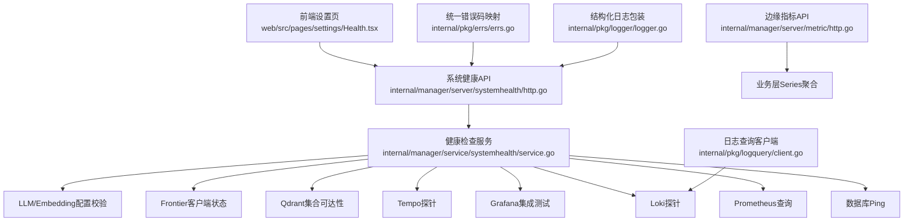
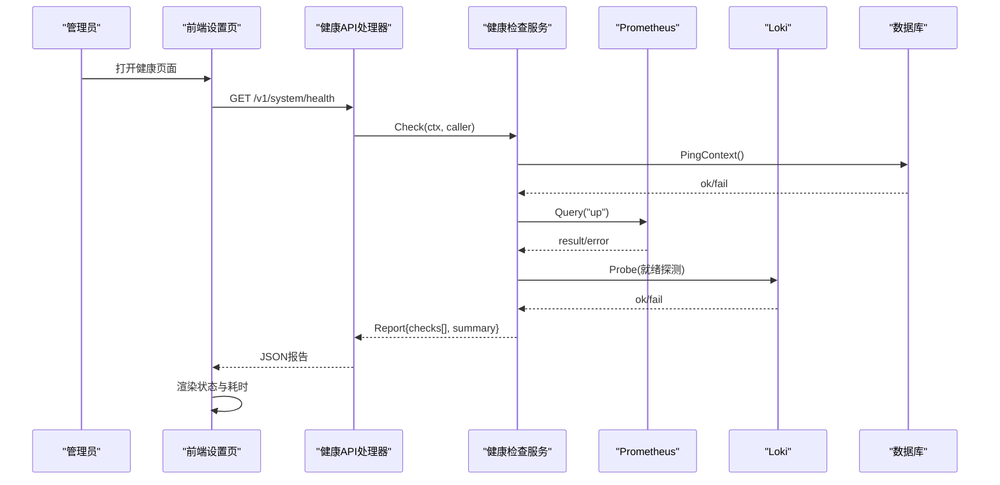
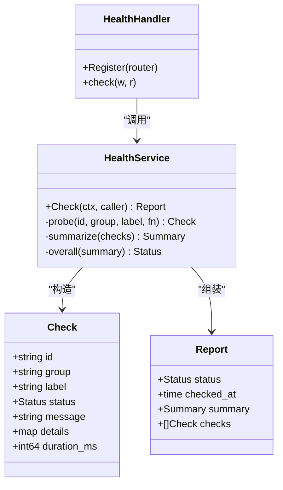
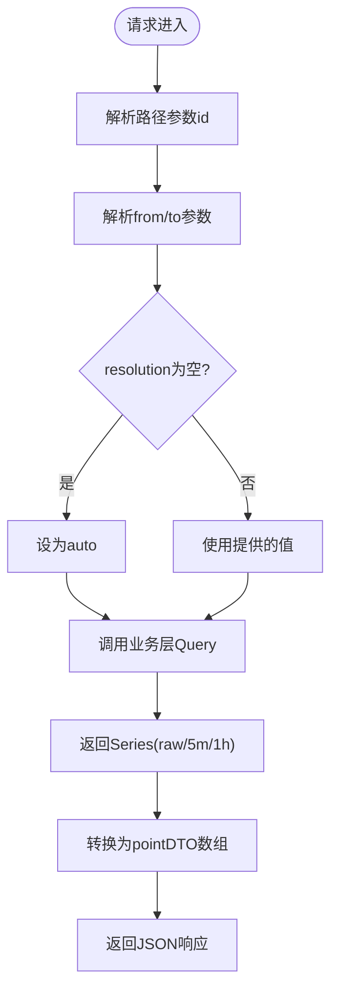
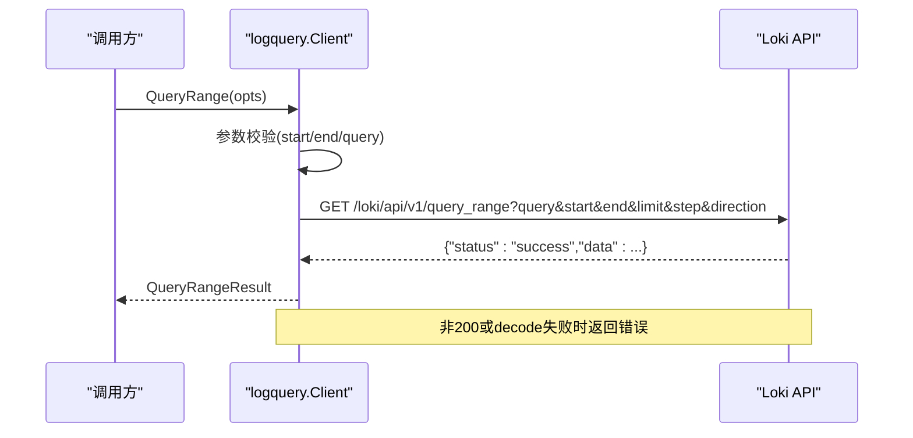
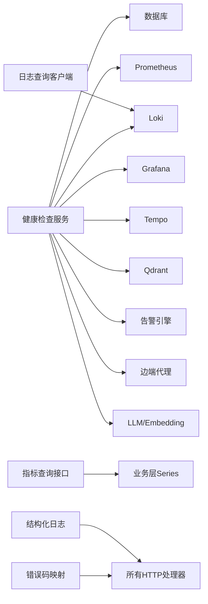

# 故障排查

<cite>
**本文引用的文件列表**
- [internal/pkg/logger/logger.go](file://internal/pkg/logger/logger.go)
- [internal/pkg/logquery/client.go](file://internal/pkg/logquery/client.go)
- [internal/manager/server/systemhealth/http.go](file://internal/manager/server/systemhealth/http.go)
- [internal/manager/service/systemhealth/service.go](file://internal/manager/service/systemhealth/service.go)
- [internal/manager/server/metric/http.go](file://internal/manager/server/metric/http.go)
- [internal/pkg/errs/errs.go](file://internal/pkg/errs/errs.go)
- [web/src/pages/settings/Health.tsx](file://web/src/pages/settings/Health.tsx)
- [web/src/api/skills.ts](file://web/src/api/skills.ts)
- [skills/bash/SKILL.md](file://skills/bash/SKILL.md)
- [internal/edgeagent/cmdpolicy/sandbox.go](file://internal/edgeagent/cmdpolicy/sandbox.go)
- [ROADMAP.md](file://ROADMAP.md)
- [cmd/ongrid/main.go](file://cmd/ongrid/main.go)
</cite>

## 目录
1. [简介](#简介)
2. [项目结构](#项目结构)
3. [核心组件](#核心组件)
4. [架构总览](#架构总览)
5. [详细组件分析](#详细组件分析)
6. [依赖关系分析](#依赖关系分析)
7. [性能问题排查流程](#性能问题排查流程)
8. [日志分析与结构化查询](#日志分析与结构化查询)
9. [系统健康检查与指标解读](#系统健康检查与指标解读)
10. [网络连通性测试与安全策略验证](#网络连通性测试与安全策略验证)
11. [调试工具与远程诊断技巧](#调试工具与远程诊断技巧)
12. [常见问题与快速定位](#常见问题与快速定位)
13. [结论](#结论)

## 简介
本指南面向运维人员，聚焦于安装、配置与运行期的故障排查与调试。内容覆盖：
- 常见问题的诊断方法与解决方案（安装、配置、运行时异常）
- 日志分析方法与工具（结构化日志、错误模式识别）
- 性能问题排查流程（CPU、内存、网络、磁盘）
- 系统健康检查方法与指标解读
- 网络连通性测试与安全策略验证
- 调试工具使用与远程诊断技巧

## 项目结构
与故障排查密切相关的代码与配置主要分布在以下位置：
- 日志与可观测性客户端：internal/pkg/logquery（Loki）、internal/pkg/promquery（Prometheus）、internal/pkg/tracequery（Tempo）
- 系统健康检查服务：internal/manager/service/systemhealth 与 HTTP 接口 internal/manager/server/systemhealth
- 指标查询接口：internal/manager/server/metric
- 统一错误码与状态映射：internal/pkg/errs
- 前端健康页与健康展示：web/src/pages/settings/Health.tsx
- 边端命令执行沙箱与白名单：internal/edgeagent/cmdpolicy/sandbox.go
- 技能与网络探测能力定义：web/src/api/skills.ts、skills/bash/SKILL.md
- AIOps 协调员提示词与专家派单逻辑：cmd/ongrid/main.go
- 路线图中的远程诊断能力规划：ROADMAP.md

图表来源
- [internal/manager/server/systemhealth/http.go:1-96](file://internal/manager/server/systemhealth/http.go#L1-L96)
- [internal/manager/service/systemhealth/service.go:1-443](file://internal/manager/service/systemhealth/service.go#L1-L443)
- [internal/manager/server/metric/http.go:1-258](file://internal/manager/server/metric/http.go#L1-L258)
- [internal/pkg/logquery/client.go:1-280](file://internal/pkg/logquery/client.go#L1-L280)
- [internal/pkg/errs/errs.go:1-54](file://internal/pkg/errs/errs.go#L1-L54)
- [internal/pkg/logger/logger.go:1-27](file://internal/pkg/logger/logger.go#L1-L27)

章节来源
- [internal/manager/server/systemhealth/http.go:1-96](file://internal/manager/server/systemhealth/http.go#L1-L96)
- [internal/manager/service/systemhealth/service.go:1-443](file://internal/manager/service/systemhealth/service.go#L1-L443)
- [internal/manager/server/metric/http.go:1-258](file://internal/manager/server/metric/http.go#L1-L258)
- [internal/pkg/logquery/client.go:1-280](file://internal/pkg/logquery/client.go#L1-L280)
- [internal/pkg/errs/errs.go:1-54](file://internal/pkg/errs/errs.go#L1-L54)
- [internal/pkg/logger/logger.go:1-27](file://internal/pkg/logger/logger.go#L1-L27)

## 核心组件
- 健康检查服务：提供平台自检报告，包含数据库、Prometheus、Grafana、Loki、Tempo、Qdrant、Frontier、告警引擎、边端代理、LLM/Embedding等子项的状态与耗时。
- 指标查询接口：暴露边缘主机 CPU、内存、负载、网络收发、磁盘使用率等时间序列数据，支持原始与聚合分辨率。
- 日志查询客户端：封装对 Loki 的 /loki/api/v1/query_range、labels、label values 调用，带超时、限流与错误处理。
- 统一错误码：将领域错误映射为 HTTP 状态码与错误码字符串，便于前端与监控统一处理。
- 结构化日志：基于 slog JSON 输出，强制只记录结构化字段，避免泄露敏感信息。

章节来源
- [internal/manager/service/systemhealth/service.go:1-443](file://internal/manager/service/systemhealth/service.go#L1-L443)
- [internal/manager/server/metric/http.go:1-258](file://internal/manager/server/metric/http.go#L1-258)
- [internal/pkg/logquery/client.go:1-280](file://internal/pkg/logquery/client.go#L1-280)
- [internal/pkg/errs/errs.go:1-54](file://internal/pkg/errs/errs.go#L1-54)
- [internal/pkg/logger/logger.go:1-27](file://internal/pkg/logger/logger.go#L1-27)

## 架构总览
健康检查与指标/日志查询在 Manager 侧形成“自检 + 可观测”闭环：
- 健康检查通过多探针并行评估各子系统可用性，返回整体状态与明细。
- 指标查询从 Prometheus 拉取并聚合，供前端渲染趋势图。
- 日志查询通过 logquery 客户端访问 Loki，用于错误回溯与模式识别。
- 错误码与日志贯穿全链路，确保前后端一致的错误语义与可观测性。

图表来源
- [internal/manager/server/systemhealth/http.go:1-96](file://internal/manager/server/systemhealth/http.go#L1-L96)
- [internal/manager/service/systemhealth/service.go:1-443](file://internal/manager/service/systemhealth/service.go#L1-L443)
- [web/src/pages/settings/Health.tsx:306-335](file://web/src/pages/settings/Health.tsx#L306-L335)

## 详细组件分析

### 健康检查服务与HTTP接口
- 职责：聚合多个子系统探针结果，生成结构化报告；统一错误响应格式。
- 关键点：
  - 每个检查项带有 ID、分组、标签、状态、消息、详情与耗时。
  - 探针具备超时控制，超时自动降级为失败。
  - 告警引擎检查会统计规则数、启用数与开放事件数。
  - 边端代理检查采样在线/离线数量。
  - LLM/Embedding 检查区分“未配置”和“已配置”。

图表来源
- [internal/manager/server/systemhealth/http.go:1-96](file://internal/manager/server/systemhealth/http.go#L1-L96)
- [internal/manager/service/systemhealth/service.go:1-443](file://internal/manager/service/systemhealth/service.go#L1-L443)

章节来源
- [internal/manager/server/systemhealth/http.go:1-96](file://internal/manager/server/systemhealth/http.go#L1-L96)
- [internal/manager/service/systemhealth/service.go:1-443](file://internal/manager/service/systemhealth/service.go#L1-L443)
- [web/src/pages/settings/Health.tsx:306-335](file://web/src/pages/settings/Health.tsx#L306-L335)

### 指标查询接口
- 职责：按边缘设备维度查询 CPU、内存、负载、网络、磁盘使用率的时间序列。
- 关键点：
  - 支持 raw、5m、1h 三种分辨率，统一 pointDTO 形状。
  - 空数据点以 null 表示，避免断链误连。
  - 参数校验严格，from/to 必须为 RFC3339。

图表来源
- [internal/manager/server/metric/http.go:1-258](file://internal/manager/server/metric/http.go#L1-258)

章节来源
- [internal/manager/server/metric/http.go:1-258](file://internal/manager/server/metric/http.go#L1-258)

### 日志查询客户端
- 职责：封装 Loki 的 query_range、labels、label values 调用，提供统一的错误处理与限流保护。
- 关键点：
  - 默认单次请求超时 30s，响应体限制 8MiB。
  - 单租户场景下注入 X-Scope-OrgID: ongrid。
  - 非 200 响应记录警告日志并返回错误。

图表来源
- [internal/pkg/logquery/client.go:1-280](file://internal/pkg/logquery/client.go#L1-280)

章节来源
- [internal/pkg/logquery/client.go:1-280](file://internal/pkg/logquery/client.go#L1-280)

### 统一错误码与状态映射
- 职责：将领域错误映射为 HTTP 状态码与错误码字符串，保证跨模块一致性。
- 关键点：
  - 包括未授权、禁止、无效参数、冲突、租户不匹配、边端离线、预算超限、未接线、过多尝试等。
  - 未知错误默认 500。

章节来源
- [internal/pkg/errs/errs.go:1-54](file://internal/pkg/errs/errs.go#L1-54)

### 结构化日志
- 职责：基于 slog 的 JSON 输出，强制只记录结构化字段，避免泄露用户内容与密钥。
- 关键点：
  - 通过 WithService 注入 service 属性，便于追踪。
  - 所有日志写入 stderr，适合容器化收集。

章节来源
- [internal/pkg/logger/logger.go:1-27](file://internal/pkg/logger/logger.go#L1-27)

## 依赖关系分析
- 健康检查服务依赖数据库、Prometheus、Grafana、Loki、Tempo、Qdrant、Frontier、告警与边端服务、LLM/Embedding。
- 指标查询接口依赖业务层 Series 聚合实现。
- 日志查询客户端依赖 Loki 的 REST API。
- 错误码与日志贯穿所有 HTTP 处理器与服务。

图表来源
- [internal/manager/service/systemhealth/service.go:1-443](file://internal/manager/service/systemhealth/service.go#L1-L443)
- [internal/manager/server/metric/http.go:1-258](file://internal/manager/server/metric/http.go#L1-258)
- [internal/pkg/logquery/client.go:1-280](file://internal/pkg/logquery/client.go#L1-280)
- [internal/pkg/errs/errs.go:1-54](file://internal/pkg/errs/errs.go#L1-54)
- [internal/pkg/logger/logger.go:1-27](file://internal/pkg/logger/logger.go#L1-27)

## 性能问题排查流程
- 指标采集与可视化
  - 使用边缘指标接口获取 CPU、内存、负载、网络、磁盘使用率，选择合适分辨率观察峰值与趋势。
  - 关注空数据点（null）是否代表采集中断或服务不可用。
- 资源瓶颈定位
  - CPU：查看 topk 进程占用、cgroup 节流情况、上下文切换与软中断。
  - 内存：关注 RSS、缓存压力、OOM 与交换抖动。
  - 网络：关注带宽饱和、丢包、重传、MTU 黑洞与连接跟踪表满。
  - 磁盘：关注 I/O 饱和、inode 耗尽、脏页回写停滞与 RAID 降级重建。
- 关联证据
  - 结合告警规则与事件，交叉验证指标异常是否与变更相关。
  - 使用知识库文档进行根因假设与验证。

[本节为通用指导，不直接分析具体文件]

## 日志分析与结构化查询
- 结构化日志规范
  - 仅输出 JSON 行，包含 service、trace_id、org_id 等上下文属性。
  - 严禁记录用户输入、请求体与密钥。
- Loki 查询方法
  - 使用 query_range 检索时间段内的日志，支持 limit、step、方向。
  - 使用 labels 与 label values 构建动态过滤条件。
  - 注意响应大小限制与超时，必要时缩小时间窗口或增加 limit。
- 错误模式识别
  - 关注非 200 响应、解码失败、上游错误等日志条目。
  - 结合错误码映射，快速定位权限、参数、上游不可用等问题。

章节来源
- [internal/pkg/logger/logger.go:1-27](file://internal/pkg/logger/logger.go#L1-27)
- [internal/pkg/logquery/client.go:1-280](file://internal/pkg/logquery/client.go#L1-280)
- [internal/pkg/errs/errs.go:1-54](file://internal/pkg/errs/errs.go#L1-54)

## 系统健康检查与指标解读
- 健康检查项
  - Manager API、数据库、Prometheus、Grafana、Loki、Tempo、Qdrant、Frontier、告警引擎、边端代理、LLM/Embedding。
- 状态含义
  - ok：正常；degraded：部分功能受限或未完全配置；failed：关键依赖不可用；unknown：无法判定。
- 指标解读
  - 检查耗时：单个探针的 duration_ms 反映依赖延迟。
  - 摘要计数：ok/degraded/failed/unknown 的数量决定整体状态。
  - 详情字段：如版本、集合名、在线/离线数量、规则与事件数等。

章节来源
- [internal/manager/service/systemhealth/service.go:1-443](file://internal/manager/service/systemhealth/service.go#L1-L443)
- [web/src/pages/settings/Health.tsx:306-335](file://web/src/pages/settings/Health.tsx#L306-L335)

## 网络连通性测试与安全策略验证
- 连通性测试
  - DNS：host_probe_dns 返回 A/AAAA 记录。
  - HTTP：host_probe_http 返回状态码、延迟与内容长度。
  - TCP：host_probe_tcp 返回连通性与延迟。
  - 命名空间：host_netns_inspect 列出 /var/run/netns 下的命名空间及 IP/路由/接口状态。
- 安全策略验证
  - 边端命令执行沙箱：Decide 组合策略、路径校验与网络目标白名单。
  - 网络类命令（dig、ping、traceroute 等）受 cmdpolicy 约束，目标主机需在 allowlist。
  - 高级网络工具（OVS、nft、conntrack、ethtool、bpftool、ip netns）读操作可用，写操作需 SOP 审批。

章节来源
- [web/src/api/skills.ts:108-147](file://web/src/api/skills.ts#L108-L147)
- [skills/bash/SKILL.md:81-109](file://skills/bash/SKILL.md#L81-L109)
- [internal/edgeagent/cmdpolicy/sandbox.go:76-132](file://internal/edgeagent/cmdpolicy/sandbox.go#L76-L132)

## 调试工具与远程诊断技巧
- 内置技能与工具
  - 主机负载与进程快照、文件系统读取、systemd-journald 日志读取、tail_file。
  - 网络探测：DNS、HTTP、TCP、命名空间检查。
- 远程诊断能力规划
  - 远程抓包（pcap）上传对象存储并在 UI 中嵌入查看器。
  - 网络探测作为一等 BaseTool（probe_tcp/probe_http/probe_dns/traceroute/mtr）。
  - 文件/日志/内核诊断（strace/lsof/dmesg/sosreport）。
  - 网络 Layer-1 扩展（OVS/nft/conntrack/ipset/ethtool/bpftool/ip netns），读操作已上线，写操作需 SOP。
- AIOps 协调员
  - 首席协调员负责判断派发给计算/网络/磁盘/运维专家或直接给出结论。
  - 要求每次工具调用前说明目的与假设，数据驱动收敛，避免重复调用。

章节来源
- [web/src/api/skills.ts:108-147](file://web/src/api/skills.ts#L108-L147)
- [ROADMAP.md:58-99](file://ROADMAP.md#L58-L99)
- [cmd/ongrid/main.go:3603-3659](file://cmd/ongrid/main.go#L3603-L3659)

## 常见问题与快速定位
- 安装问题
  - 确认依赖服务（Prometheus/Loki/Grafana/Qdrant/Frontier）可达且端口正确。
  - 检查单租户模式下 X-Scope-OrgID 是否正确注入。
  - 若安装脚本失败，查看 systemd 服务状态与日志。
- 配置错误
  - 健康检查返回 degraded：检查缺失配置（如 root_url、sa_token/api_key、Qdrant URL/collection）。
  - 指标接口返回 invalid：检查 from/to 是否为 RFC3339，id 是否为正整数。
- 运行时异常
  - 非 200 响应：查看 logquery 警告日志，确认上游状态码与错误信息。
  - 超时：缩短查询窗口或降低 limit；调整探针超时与 HTTP 客户端超时。
  - 权限不足：检查认证与角色（admin 才能访问健康检查），确认租户与 RBAC。
- 性能问题
  - CPU/内存高：使用指标接口与 Top 进程面板定位热点进程；结合 cgroup 节流与上下文切换。
  - 网络慢/丢包：使用 host_probe_* 与 conntrack/ethtool 检查 MTU、重传与队列。
  - 磁盘压力：关注 I/O 等待、inode 使用率与脏页回写。
- 网络连通性
  - DNS 解析失败：使用 host_probe_dns 与 dig/nslookup 对比。
  - HTTP 不通：使用 host_probe_http 检查状态码与延迟；核对证书与代理。
  - TCP 不通：使用 host_probe_tcp 与 traceroute/mtr 定位中间节点。
- 安全策略
  - 命令被拒绝：检查 cmdpolicy 白名单与路径校验；确认网络目标是否在 allowlist。
  - 写操作受限：遵循 SOP 审批流程后再执行。

章节来源
- [internal/manager/server/systemhealth/http.go:1-96](file://internal/manager/server/systemhealth/http.go#L1-L96)
- [internal/manager/service/systemhealth/service.go:1-443](file://internal/manager/service/systemhealth/service.go#L1-L443)
- [internal/manager/server/metric/http.go:1-258](file://internal/manager/server/metric/http.go#L1-258)
- [internal/pkg/logquery/client.go:1-280](file://internal/pkg/logquery/client.go#L1-280)
- [internal/pkg/errs/errs.go:1-54](file://internal/pkg/errs/errs.go#L1-54)
- [internal/edgeagent/cmdpolicy/sandbox.go:76-132](file://internal/edgeagent/cmdpolicy/sandbox.go#L76-L132)
- [web/src/api/skills.ts:108-147](file://web/src/api/skills.ts#L108-L147)

## 结论
通过健康检查、指标查询与结构化日志三位一体的可观测体系，配合 AIOps 协调员与专家工具，可以快速定位安装、配置与运行期问题。建议在日常运维中：
- 定期巡检健康检查报告，关注 degraded/failed 项与耗时。
- 使用指标接口与 Top 进程面板定位资源瓶颈。
- 利用 Loki 结构化日志与错误码映射快速回溯异常。
- 借助网络探测技能与安全策略校验保障连通性与合规。
- 结合路线图逐步引入远程抓包与更丰富的诊断工具，提升排障效率。